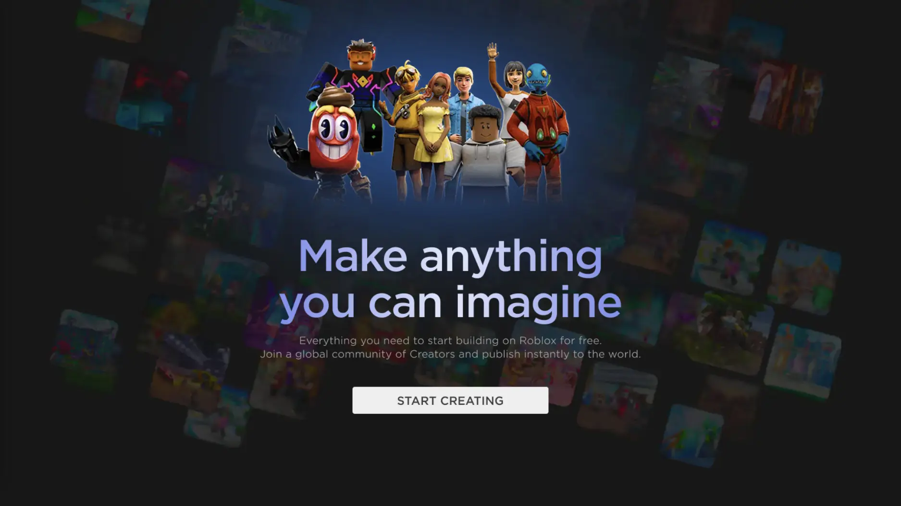
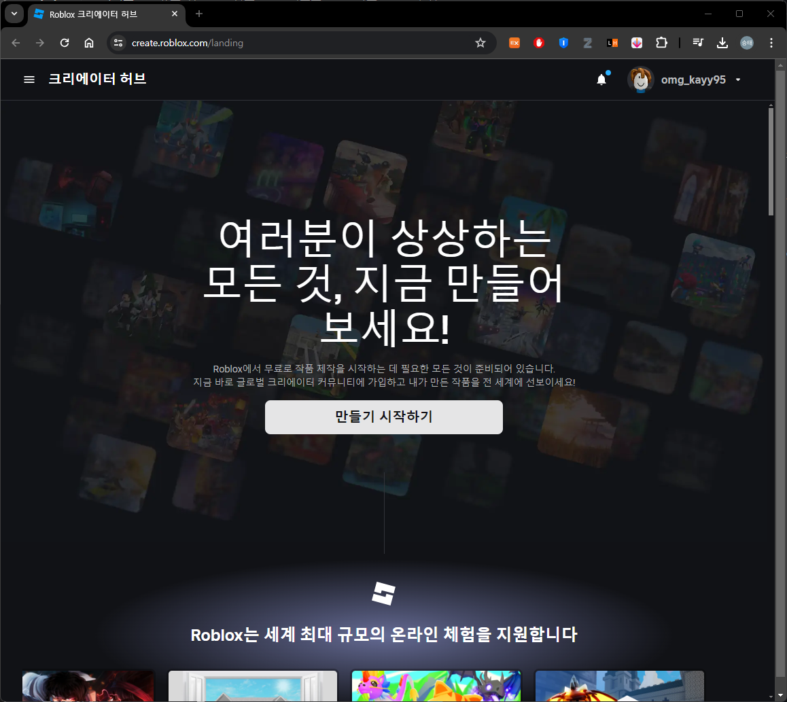
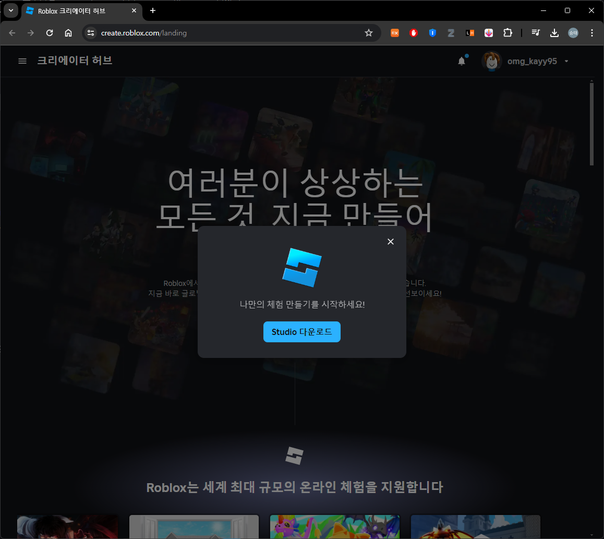
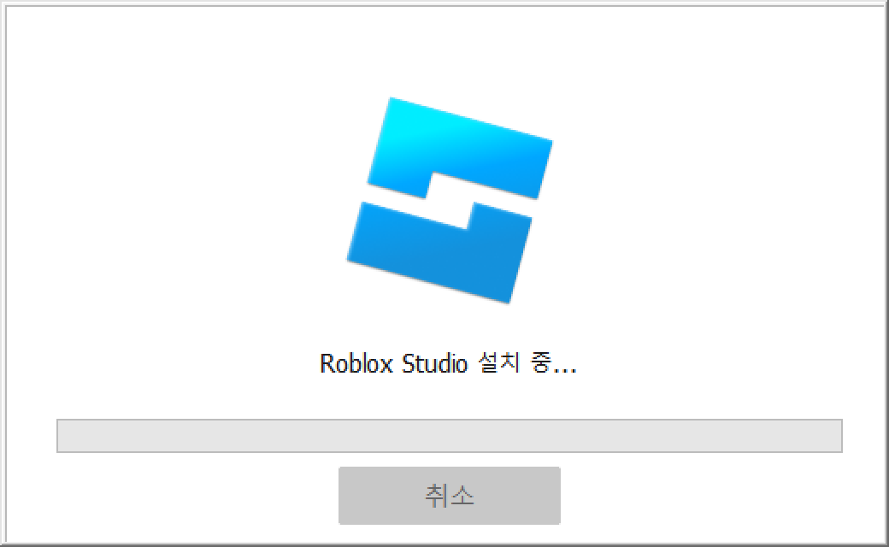
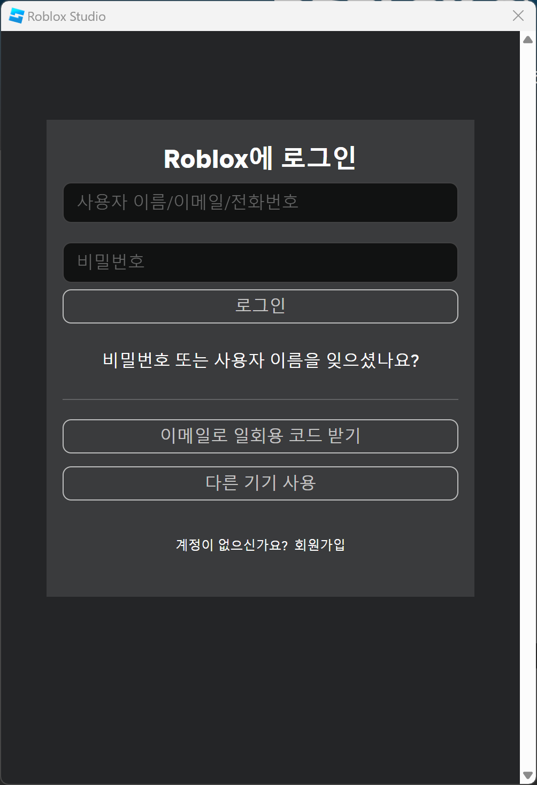
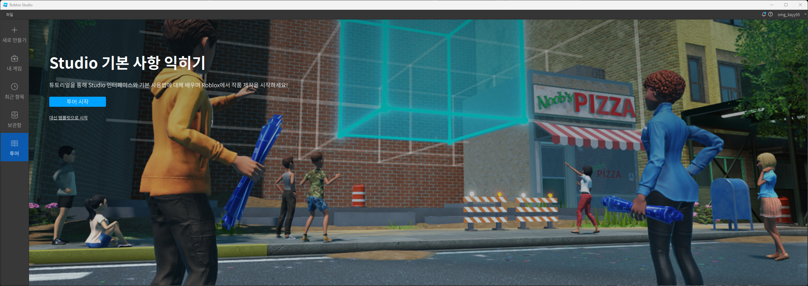
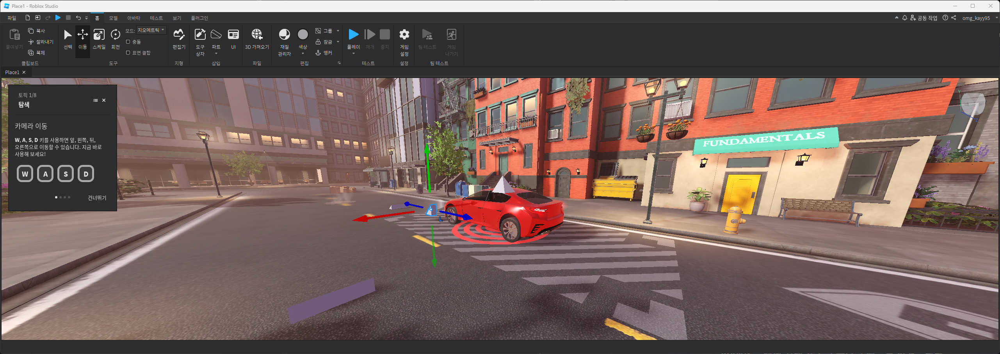

# Roblox Studio Setup

## 목차
- [Roblox Studio Setup](#roblox-studio-setup)
  - [목차](#목차)
  - [시스템 요구 사항](#시스템-요구-사항)
  - [Studio 설치하기](#studio-설치하기)
  - [Studio 업데이트하기](#studio-업데이트하기)
  - [출처](#출처)
  - [다음](#다음)
---
Roblox Studio를 사용하여 Windows 및 macOS에서 사용 가능한 무료 응용 프로그램을 통해 몰입형 3D 체험을 만들어보세요.

---
## 시스템 요구 사항

Studio가 원활하게 실행되려면 다음과 같은 시스템 사양이 필요합니다:

- **Windows**: Windows 7, Windows 8/8.1, Windows 10 또는 Windows 11입니다. Windows 10 이전 버전의 경우 Internet Explorer 11 이상과 WebView2의 최신 버전도 필요합니다. Windows 8/8.1의 경우 메트로 모드는 지원되지 않으므로 데스크톱 모드에서 Roblox를 실행해야 합니다.
- **macOS**: macOS 10.13 (High Sierra) 이상입니다.
- **프로세서**: 클록 속도가 1.6 GHz 이상인 프로세서가 필요합니다.
- **메모리**: 시스템 메모리 2GB 이상이 필요합니다.
- **하드 디스크**: 설치 후 최소 10GB의 사용 가능한 하드 디스크 공간이 필요합니다.
- **그래픽 카드**: 전용 비디오 카드가 장착된 5년 미만의 컴퓨터 또는 통합 비디오 카드가 장착된 3년 미만의 노트북이 필요합니다.
- **인터넷 속도**: Studio를 최신 상태로 유지하고 Roblox 계정에 프로젝트를 저장하려면 최소 4-8 MB/s의 인터넷 속도가 필요합니다.

---
## Studio 설치하기
Roblox Studio를 설치하려면 다음 단계를 따르세요:

1. 회원가입을 합니다.
1. [create.roblox.com](https://create.roblox.com)로 이동합니다. 
2. **만들기 시작하기** 버튼을 클릭합니다. 팝업 대화 상자가 표시됩니다.  
3. **Studio 다운로드** 버튼을 클릭합니다.
4. 브라우저의 다운로드 기록에서 Studio 설치 프로그램을 찾아 파일을 두 번 클릭합니다. 
    - Windows의 경우 파일 이름은 `RobloxStudio.exe`입니다.
    - macOS의 경우 파일 이름은 `RobloxStudio.dmg`입니다.
5. Roblox 계정으로 Studio에 로그인하세요. 계정이 없는 경우 [roblox.com]([[roblox.com](https://www.roblox.com/)](https://www.roblox.com/))에서 계정을 만들고 계정 보안 유지 팁을 따르세요. 
6. Roblox Studio를 실행합니다. 
7. **투어 시작**을 하여 사용법을 익힙니다. 

---
## Studio 업데이트하기

일부 다른 엔진과는 달리 모든 경험은 최신 버전의 Roblox 엔진에서 실행됩니다. 최신 API와 기능을 활용하려면 Studio를 최신 상태로 유지해야 합니다.

현재 사용 중인 Studio 버전이 오래되었다면, 오른쪽 상단에 업데이트 가능 버튼이 표시됩니다. 이 버튼을 클릭하면 현재 열려 있는 장소를 저장/닫을 것을 요청하는 팝업이 표시되어 Studio가 자동으로 업데이트되고 재시작됩니다.

---
## 출처
 - [Roblox Studio 설치하기](https://create.roblox.com/docs/ko-kr/studio/setting-up-roblox-studio)
---
## [다음](./03_Creating_Your_First_Experience.md)