# Creating Your First Experience

## 목차
- [Creating Your First Experience](#creating-your-first-experience)
  - [목차](#목차)
  - [Creating Your First Experience](#creating-your-first-experience-1)
    - [프로젝트 만들기](#프로젝트-만들기)
    - [자산 팩 가져오기](#자산-팩-가져오기)
    - [목표물 사용자 지정](#목표물-사용자-지정)
    - [스크립트 구성](#스크립트-구성)
    - [투사체 사용자 지정](#투사체-사용자-지정)
    - [경험 게시](#경험-게시)
  - [출처](#출처)
  - [다음](#다음)

---
## Creating Your First Experience

온보딩 투어를 완료하고 Roblox Studio의 사용자 인터페이스에 익숙해지면 플랫폼에서 경험을 만들 준비가 됩니다.

[고품질의 투석기 자산 팩](https://create.roblox.com/store/asset/17266332444/IntroToStudioCatapult)을 사용하여, 이 튜토리얼은 플레이어가 떠 있는 플랫폼의 목표물에 다섯 개의 투사체를 발사할 수 있는 경험을 만드는 과정을 안내합니다. 이 과정은 다음을 포함합니다:

- Studio의 프로젝트 템플릿 중 하나를 사용하여 단일 장소의 데이터 모델을 구축하고 조직하는 방법
- Creator Store에서 기본 및 복잡한 3D 객체를 고유한 게임 요구 사항에 맞게 사용자 지정하는 방법
- Roblox 엔진이 올바르게 시뮬레이션하고 렌더링할 수 있도록 스크립트를 적절한 위치에 배치하는 방법
- 다양한 장치를 사용하는 글로벌 청중에게 창작물을 플레이 테스트하고 게시하는 방법

이 과정을 완료하면 기본 커리큘럼을 통해 간단한 3D 플랫폼 게임 경험을 재창조하거나 다양한 사용 사례 튜토리얼을 실험하거나 자신의 프로젝트를 시작하는 방법을 배울 수 있습니다.

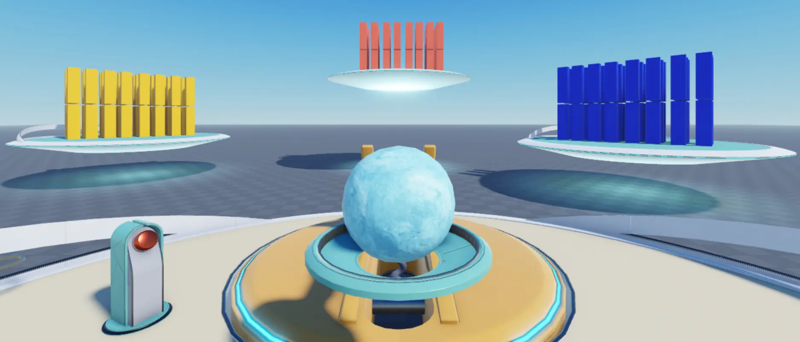

### 프로젝트 만들기
프로젝트는 자산, 설정 및 기타 리소스를 모아 하나의 경험을 나타내는 것입니다. 모든 프로젝트는 플레이어가 경험에 참여할 때 로드하는 단일 장소로 시작하지만, 동일한 경험 내에서 추가 장소를 만들어 다른 게임 플레이 영역의 자산을 조직할 수 있습니다. 예를 들어, 플레이어가 던전에 입장한 후 광대한 사막이나 으스스한 섬으로 순간 이동하기를 원할 경우 각 영역의 자산을 자체 장소로 구성할 수 있습니다.

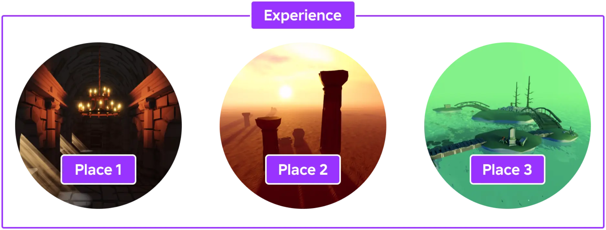
세 개의 독특한 환경을 가진 개별 장소들로 이루어진 경험 그룹.

장소의 객체 계층 구조는 데이터 모델이며, 이는 게임 플레이 영역을 구성하는 모든 것을 설명합니다. 여기에는 3D 세계를 구성하는 객체부터 런타임 동작을 제어하는 객체까지 포함됩니다. 프로젝트를 처음 열면 시작 장소의 데이터 모델이 상대적으로 간단하지만, 경험에 구현하려는 객체, 상호 작용성 또는 동작의 양에 따라 빠르게 복잡해질 수 있습니다.

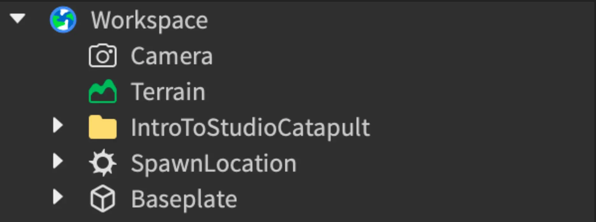
튜토리얼 시작 시 데이터 모델


튜토리얼 종료 시 데이터 모델

첫 번째 경험에서는 Studio의 프로젝트 템플릿 중 하나를 사용하여 단일 장소의 데이터 모델을 구축하고 조직하는 방법을 배웁니다. 프로젝트 템플릿은 시작 장소의 데이터 모델에 기본 객체 세트를 제공하여 다양한 장르의 경험을 구축하는 데 유용합니다.

예를 들어, 대도시를 포함한 역할극 경험을 구축하려면 [모던 시티](https://www.roblox.com/games/13165709401/Modern-City) 템플릿을 열어 벽, 창문, 문 객체를 사용하여 고유한 건물 변형을 만들 수 있습니다. 마찬가지로 레이싱 경험을 구축하려면 [레이싱](https://www.roblox.com/games/16078915506/Racing) 템플릿을 열어 작동하는 경주용 차와 구불구불한 트랙 객체를 다양한 구성으로 재구성할 수 있습니다.


모던 시티 템플릿 타일


레이싱 템플릿 타일

단순하게 유지하기 위해 이 튜토리얼에서는 [Baseplate](https://www.roblox.com/games/95206881/Baseplate) 템플릿을 사용하여 프로젝트를 만듭니다. 이 템플릿에는 거의 모든 경험에서 중요한 두 개의 기본 객체가 포함되어 있습니다:

- 스폰 위치 – [`SpawnLocation`](https://create.roblox.com/docs/ko-kr/reference/engine/classes/SpawnLocation) 객체는 플레이어 캐릭터가 경험에 참여할 때 3D 공간에 나타나는 위치이며, 건강이 0이 되면 다시 스폰되는 위치입니다.
- Baseplate – 4x4 격자 텍스처가 있는 바닥판입니다.

이 템플릿은 고해상도 조명 기술과 격자에 맞춰 3D 객체를 배치하고 방향을 지정할 수 있는 바닥이 있는 중립적인 세계를 제공하므로 첫 번째 경험을 만드는 데 좋은 출발점입니다. 스터드는 Studio의 기본 길이 단위이며, 각 스터드는 약 28cm에 해당합니다. Studio의 주요 단위에 대한 자세한 내용은 Roblox 단위를 참조하십시오.


Baseplate 템플릿 타일

Baseplate 템플릿으로 프로젝트를 열려면:
1. **Roblox Studio**를 엽니다. 시작 페이지에 모든 사용 가능한 프로젝트 템플릿이 표시됩니다.
2. **Baseplate** 템플릿 타일을 선택합니다. Studio가 스폰 위치와 Baseplate가 있는 새로운 경험을 엽니다.

새로운 Baseplate 템플릿이 기본 스폰 위치와 함께 Studio에서 열립니다.


### 자산 팩 가져오기
프로젝트가 열리면 스폰 위치와 Baseplate 외에도 데이터 모델에 추가 3D 객체를 추가할 수 있습니다. Studio는 3D 객체를 3D 공간에서 물리적 시뮬레이션으로 렌더링하고 중력, 마찰, 힘과 같은 현실 세계의 물리적 동작을 모방하는 [`BasePart`](https://create.roblox.com/docs/ko-kr/reference/engine/classes/BasePart) 객체로 나타냅니다.

여러 종류의 `BasePart` 객체가 있지만 가장 일반적인 것은 다음과 같습니다:

- 파트 – `Part` 객체는 구, 블록, 원기둥, 쐐기, 코너 쐐기의 다섯 가지 모양으로 제공되는 Studio의 기본 3D 객체입니다.
- 메시 – `MeshPart` 객체는 타사 모델링 응용 프로그램의 꼭짓점, 가장자리 및 면으로 구성된 객체입니다.

두 가지 유형의 3D 객체에 익숙해지도록 이 튜토리얼에서는 첫 번째 경험의 핵심 게임 플레이를 만드는 데 필요한 다음 파트와 메쉬를 포함한 자산 팩을 제공합니다:

- 지면에 고정된 플랫폼에서 좌우로 조준할 수 있는 메쉬로 만든 투석기 모델
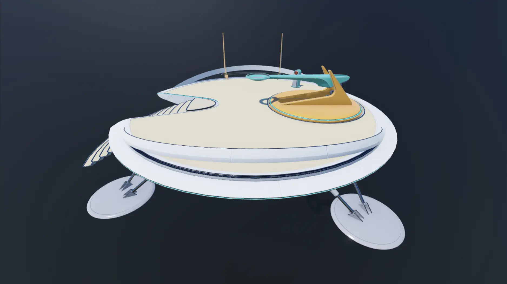

- 투석기에 장착할 수 있는 세 개의 공 파트 투사체


- 투사체로 쓰러뜨릴 수 있는 블록 파트 목표물을 가진 두 개의 떠 있는 플랫폼 메쉬
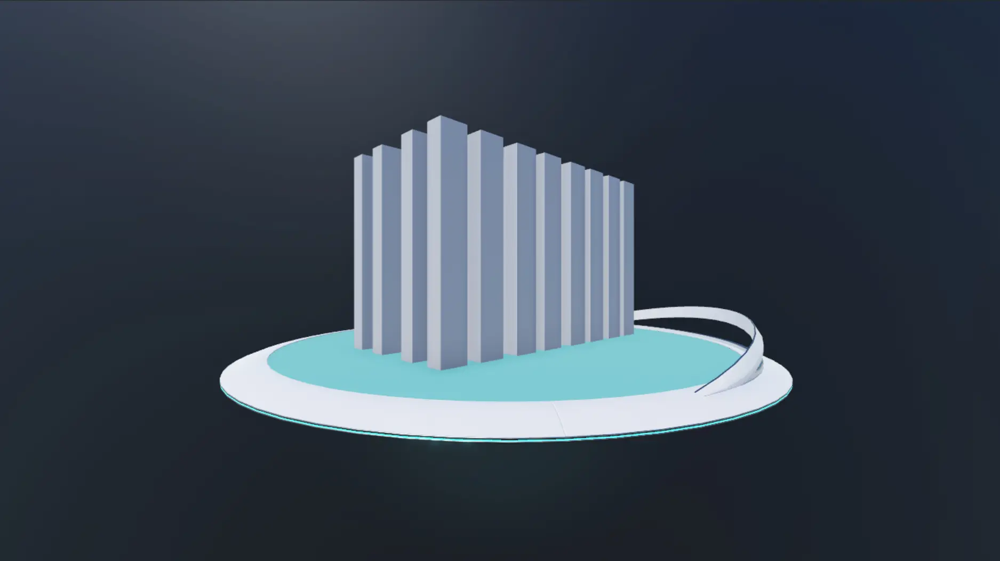

이 자산 팩은 프로젝트 내에서 사용할 수 있는 Roblox와 Roblox 커뮤니티의 자산을 특징으로 하는 마켓플레이스인 **Creator Store**에서 찾을 수 있습니다. 여기에는 모델, 이미지, 메쉬, 오디오, 플러그인, 비디오 및 글꼴 자산이 포함됩니다. Creator Store는 Toolbox 내에서 Studio에서 직접 액세스할 수 있으며 Creator Hub에서도 액세스할 수 있습니다. 이 마켓플레이스에 대한 자세한 내용은 Creator Store를 참조하십시오.


Creator Store에서 이 튜토리얼의 자산 팩을 Studio 인벤토리에 추가하려면 다음 구성 요소에서 인벤토리에 추가 링크를 클릭하십시오. 자산이 인벤토리에 있으면 플랫폼의 모든 프로젝트에서 재사용할 수 있습니다.

인벤토리에서 이 자산 팩을 경험에 추가하려면:

1. 메뉴 모음에서 보기 탭을 선택합니다.

2. 보기 섹션에서 Toolbox를 클릭합니다. Toolbox 창이 표시됩니다.


Studio의 보기 탭에서 Toolbox 도구가 강조 표시됩니다.

3. Toolbox 창에서 인벤토리 탭을 클릭합니다. 내 모델 정렬이 표시됩니다.

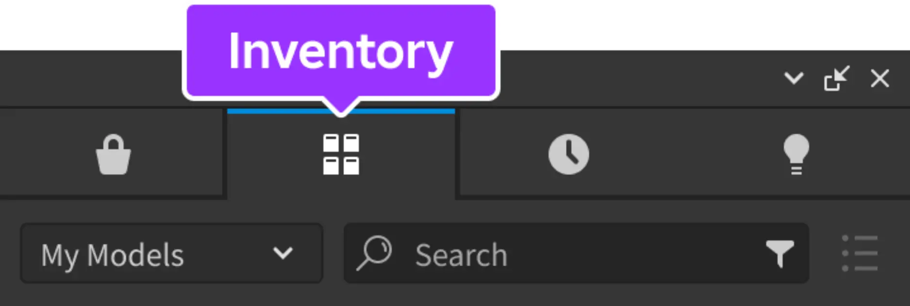
인벤토리 탭이 강조 표시된 Studio의 Toolbox 창.

4. Intro to Studio - Catapult & Platforms 타일을 클릭합니다. 자산 팩이 뷰포트에 표시됩니다.
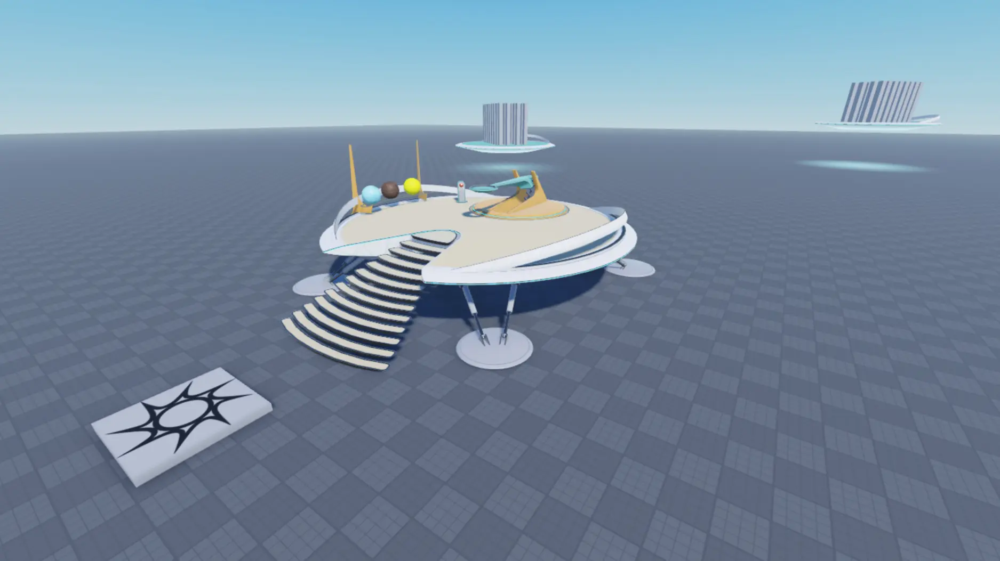

### 목표물 사용자 지정
경험에 3D 객체를 추가하면 Studio가 탐색기 창을 업데이트하여 객체의 이름과 `Workspace` 서비스 내 자식 객체의 중첩을 표시합니다. 예를 들어, 뷰포트에 투석기 모델을 추가한 후 탐색기 창에는 스폰 위치와 Baseplate 옆에 IntrotoStudioCatapult 폴더와 자식 자산이 표시됩니다.
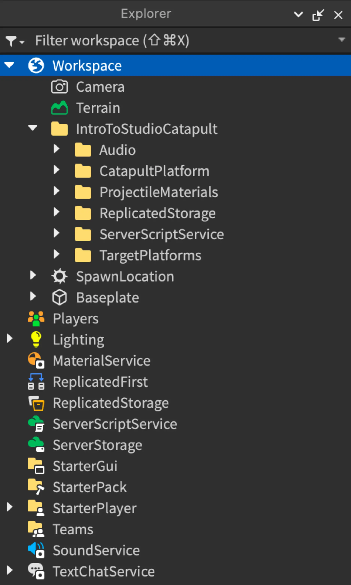

탐색기 창은 열린 경험의 장소에 대한 데이터 모델을 나타내는 기본 Studio 창입니다. 즉, 여러 장소가 있는 경험의 경우 현재 작업 중인 장소에 따라 이 창에 다른 객체가 표시됩니다.

탐색기 창에서 객체를 선택하면 Studio가 속성 창을 업데이트하여 스크립트를 사용하지 않고도 객체에 대해 사용자 지정할 수 있는 속성 선택 항목을 표시합니다. 예를 들어, 객체의 크기, 색상, 위치 또는 방향을 지정할 수 있습니다. 이 과정을 설명하기 위해 이 튜토리얼 섹션에서는 떠 있는 플랫폼의 회색 목표물의 시각적 및 동작 특성을 사용자 지정하는 방법을 안내합니다.

목표물을 사용자 지정하려면:

1. 목표물 중 하나를 선택합니다.

    1. 탐색기 창에서 IntroToStudioCatapult 폴더 왼쪽의 드롭다운 화살표를 클릭하여 모든 자식을 표시합니다.

    2. 이 과정을 사용하여 TargetPlatforms 폴더, 지면에 고정된 투석기 플랫폼과 가장 가까운 떠 있는 플랫폼에 대한 자식 TargetPlatform 모델 및 TargetParts 폴더를 확장하여 떠 있는 플랫폼의 모든 부분을 표시합니다.<br>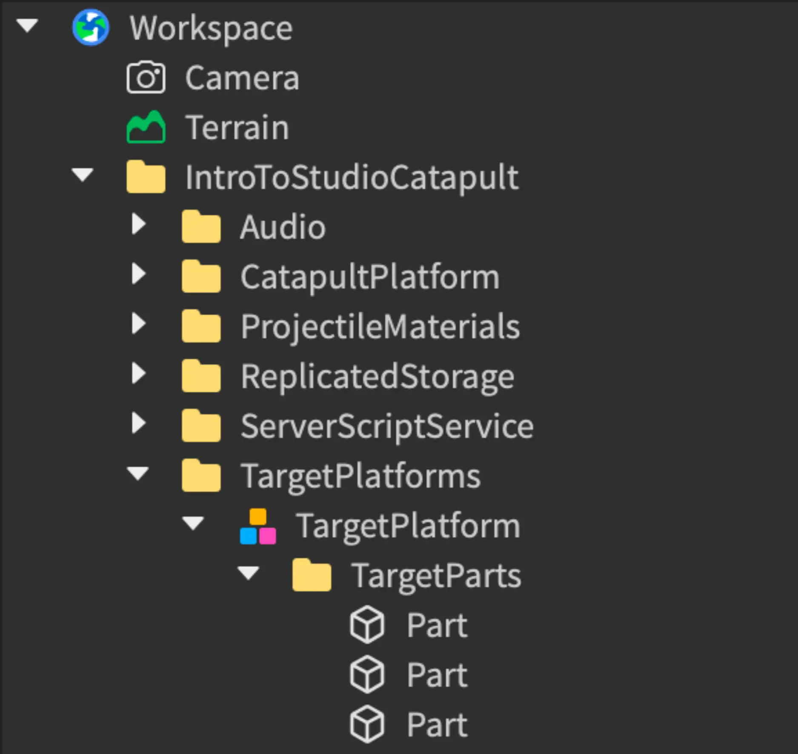

    3. parts 중 하나를 클릭합니다. 뷰포트는 객체가 선택되었음을 나타내는 개요를 표시하고 속성 창은 해당 부분에 대한 사용자 지정 가능한 속성 선택 항목을 표시합니다.

2. 속성 창에서:

    1. BrickColor를 부분을 색칠할 색상으로 설정합니다.

    2. 크기를 X, Y, Z 축을 따라 부분이 가지게 할 크기로 설정합니다.

    3. CFrame.Position을 부분이 플랫폼에서 가지게 할 위치로 설정합니다.
    
    4. CFrame.Orientation을 Y 축을 따라 부분이 가지게 할 회전으로 설정합니다.
<br>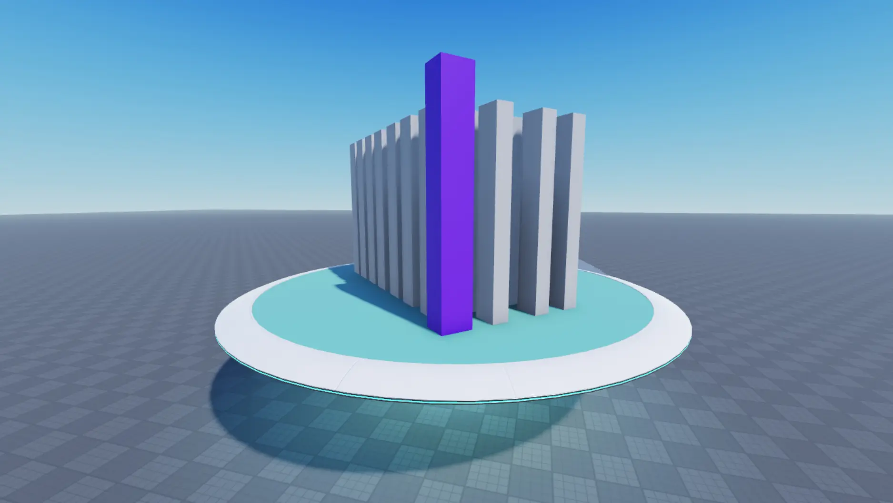

3. 이 과정을 떠 있는 플랫폼의 다른 부분에 반복합니다.

### 스크립트 구성
프로젝트 내에서 데이터 모델을 구성하는 방식에는 많은 유연성이 있지만, Roblox 엔진은 시뮬레이션 및 렌더링 기능이 서버와 클라이언트 간에 올바르게 작동하기 위해 특정 객체가 특정 컨테이너 서비스에 있어야 합니다. 서버는 경험의 상태를 유지하기 위한 궁극적인 권한을 가진 Roblox 컴퓨터를 나타내며, 모든 연결된 클라이언트(예: 모바일 전화 및 노트북과 같은 플레이어 장치)를 진실의 원천과 동기화 상태로 유지합니다.

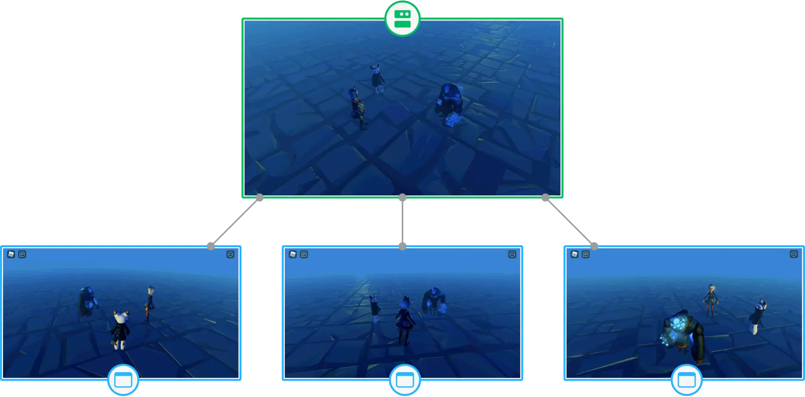
세 개의 클라이언트 장치와 연결된 서버 그룹

주요 컨테이너 서비스 범주는 다음과 같습니다:

- Workspace - 3D 세계에서 렌더링되는 객체를 포함합니다.
- Environment - 환경 설정 및 요소에 대한 객체를 포함합니다.
- Replication - 서버와 클라이언트 간에 복제되는 콘텐츠 및 논리를 포함합니다.
- Server - 서버 측 전용 콘텐츠 및 논리를 포함합니다.
- Client - 클라이언트 측 콘텐츠 및 논리를 포함합니다.
- Chat - 채팅 기능을 활성화하는 객체를 포함합니다.

이 튜토리얼에서는 데이터 모델의 워크스페이스 서비스에만 객체와 상호 작용했지만, 투석기가 올바르게 작동하려면 일부 자식 스크립트 객체를 다른 컨테이너 서비스로 이동해야 합니다. Roblox는 Luau 코드를 포함하여 객체 동작을 수정하고 경험의 전체 논리를 구현하는 두 가지 유형의 스크립트 객체를 제공합니다:

- 스크립트 - `RunContext` 속성 설정에 따라 서버 또는 클라이언트에서 실행될 수 있는 스크립트
- 모듈스크립트 - 서버 및 클라이언트 스크립트에서 모두 요구할 수 있는 재사용 가능한 스크립트

스크립트 객체의 RunContext 속성은 스크립트가 클라이언트 또는 서버에서 실행되는지 여부를 결정합니다. 실행 컨텍스트에는 세 가지 유형이 있습니다:

- 레거시 - 부모 컨테이너를 기반으로 스크립트가 실행됩니다. 레거시는 기본 실행 컨텍스트입니다.
- 서버 - 부모 컨테이너와 상관없이 스크립트가 서버에서만 실행됩니다.
- 클라이언트 - 부모 컨테이너와 상관없이 스크립트가 클라이언트에서만 실행됩니다.

스크립트가 실행되는 위치를 주의하지 않으면 객체가 원하는 방식으로 작동하지 않을 수 있습니다. 예를 들어, 지금 경험을 플레이 테스트하면 플레이어는 투석기에 투사체를 장착하거나 목표물에 발사할 수 없습니다. 게임 플레이가 올바르게 작동하도록 하려면 ReplicatedStorage 및 ServerScriptService 폴더 내의 자식을 각각의 컨테이너 서비스로 이동해야 합니다.

ReplicatedStorage에는 서버와 연결된 클라이언트가 모두 액세스할 수 있는 객체가 포함되어 있어 플레이어가 몇 개의 투사체를 발사했는지 추적하고 UI를 표시하는 게임 플레이 논리에 가장 적합한 위치입니다. ServerScriptService에는 서버 사용을 위해 설계된 스크립팅 관련 자산이 포함되어 있어 투사체를 투석기에 연결하고 특정 방향으로 발사하며 투석기를 시작 위치로 재설정하는 게임 플레이 논리에 가장 적합한 위치입니다.

투석기가 올바르게 작동하도록 폴더를 올바른 컨테이너 서비스에 구성하려면:

1. 탐색기 창에서 ReplicatedStorage 및 ServerScriptStorage 폴더를 확장합니다.<br>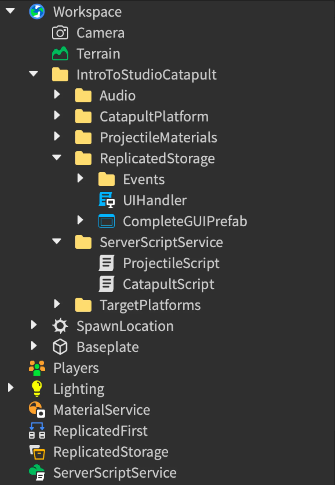

2. ReplicatedStorage 폴더 내의 모든 자식을 선택한 다음 ReplicatedStorage 서비스로 드래그합니다.<br>

```
UIHandler Script 객체는 RunContext 속성이 클라이언트로 설정되어 있어 클라이언트 측에서만 실행됩니다.
```

3. ServerScriptStorage 폴더 내의 모든 자식을 선택한 다음 ServerScriptStorage 서비스로 드래그합니다.<br>

4. ReplicatedStorage 및 ServerScriptStorage 폴더를 삭제합니다.
   - 두 폴더를 선택합니다.
   - 삭제를 누릅니다.

5. 투석기가 올바르게 작동하는지 확인하려면 플레이 테스트를 진행합니다.

    1. 메뉴 모음에서 재생 버튼을 클릭합니다. Studio가 플레이 테스트 모드로 들어갑니다.<br>메뉴 모음에서 재생 버튼이 강조 표시된 Studio의 홈 탭
    2. 얼음 투사체를 투석기에 장착하고 가장 가까운 떠 있는 플랫폼을 향해 조준한 다음 목표물에 발사합니다.<br><video src="../img/03_Creating_Your_First_Experience/Scripts-5B.mp4" width="320" height="240" controls></video>
    3. 목재 투사체를 투석기에 장착하고 가장 먼 떠 있는 플랫폼을 향해 조준한 다음 목표물에 발사합니다.<br><video src="../img/03_Creating_Your_First_Experience/Scripts-5C.mp4" width="320" height="240" controls></video>
    4. 플레이 테스트가 끝나면 메뉴 모음으로 돌아가서 중지 버튼을 클릭합니다. Studio가 플레이 테스트 모드에서 나옵니다.
    <br>
    <br>메뉴 모음에서 중지 버튼이 강조 표시된 Studio의 홈 탭

### 투사체 사용자 지정
투사체는 모두 동일한 크기이지만, 투석기에서 발사할 때 다른 거리를 이동합니다. 이는 각 투사체가 밀도, 탄성, 마찰과 같은 현실 세계의 물리적 특성을 모방하는 고유한 재료를 가지고 있기 때문입니다.

뉴턴의 제2운동 법칙에 따르면, 물체의 가속도는 물체에 작용하는 힘과 물체 자체의 질량에 따라 달라집니다. 투석기는 각 발사마다 동일한 양의 힘을 제공하므로 각 투사체의 가속도는 질량에 비례하여 변합니다. 질량이 작은 투사체는 더 빨리 가속되고, 질량이 큰 투사체는 더 느리게 가속됩니다.

이 원리를 실제로 확인하려면 이전 플레이 테스트의 결과를 살펴보십시오. 목재 재료는 얼음 재료보다 밀도가 낮아 목재 투사체는 더 빨리 가속할 수 있으며, 따라서 동일한 발사 지점에서 더 큰 거리를 이동합니다. 목재 투사체를 투석기에 가장 가까운 목표물에 발사하면 투사체는 플랫폼을 완전히 넘어 이동합니다. 마찬가지로 얼음 투사체를 투석기에 가장 먼 목표물에 발사하면 투사체는 목표물에 도달하지 못합니다.

<video src="../img/03_Creating_Your_First_Experience/Projectile-TooFar.mp4" width="320" height="240" controls></video>
<video src="../img/03_Creating_Your_First_Experience/Projectile-TooClose.mp4" width="320" height="240" controls></video>

Roblox Studio는 현실 세계의 물리적 동작을 실시간으로 모방하는 실제 시뮬레이션 엔진이므로, 객체의 물리적 특성에 따라 다르게 동작하는 방식을 고려하는 것이 중요합니다. 튜토리얼의 마지막 게임 플레이 섹션에서는 세 번째 떠 있는 플랫폼의 목표물에 도달할 수 있는 재료를 사용하여 세 번째 투사체를 사용자 지정하는 실험을 진행합니다. 각 재료의 물리적 특성 목록을 참조하려면 Materials - Default Physical Properties를 참조하십시오.

세 번째 투사체를 사용자 지정하려면:

1. 세 번째 떠 있는 목표물 플랫폼을 만듭니다.
    1. 탐색기 창에서 TargetPlatform 객체를 선택합니다.
    2. CMD + D를 눌러 플랫폼과 목표물을 복제합니다.
    3. 이동 도구를 사용하여 새 플랫폼을 새로운 위치로 이동합니다.
    <br>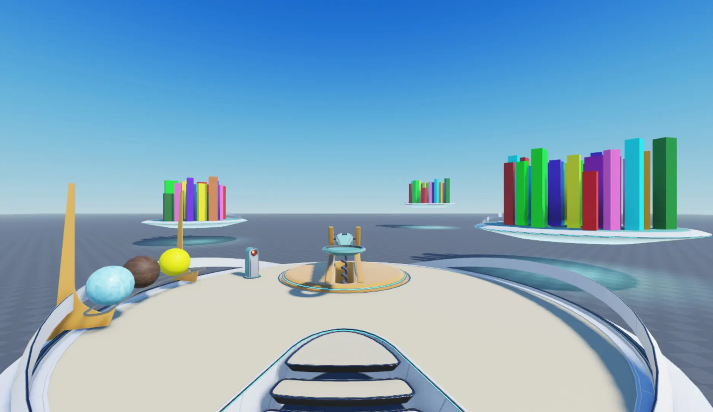
2. 세 번째 투사체의 재료를 변경하여 세 번째 플랫폼의 목표물에 도달할 수 있는 적절한 질량을 갖도록 합니다.
    1. 탐색기 창에서 ProjectileMaterials 폴더를 확장한 다음 ProjectileC를 선택합니다.
    2. 속성 창에서 재료를 현실 세계의 물리적 특성을 포함한 재료로 설정합니다. 이 재료는 새 플랫폼에 도달할 수 있는 적절한 질량을 가져야 합니다.
<br>
3. 플레이 테스트를 통해 세 번째 떠 있는 플랫폼의 목표물에 투사체가 도달하는지 확인합니다.<br>
<video src="../img/03_Creating_Your_First_Experience/Projectiles-3.mp4" width="320" height="240" controls></video>

### 경험 게시
Roblox는 경험을 만들고 실행하기 위한 도구와 엔진을 제공할 뿐만 아니라, 전화, 컴퓨터, 태블릿, 콘솔 및 VR 하드웨어를 포함한 다양한 장치에서 플랫폼에 액세스하는 플레이어의 대규모 소셜 네트워크에 액세스할 수 있도록 합니다. 글로벌 청중에게 경험을 공개하려면 경험을 게시하고 설정을 구성하여 원하는 모든 장치에서 플레이어가 액세스할 수 있도록 해야 합니다.
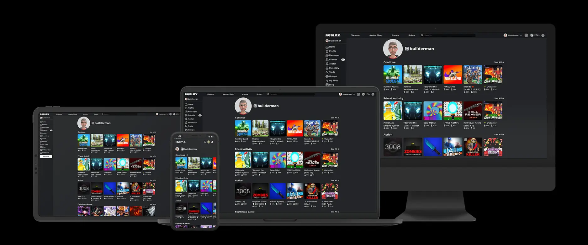

Roblox의 거의 모든 것은 고유한 ID와 함께 클라우드 기반 자산으로 표현됩니다. 이 ID는 일반적으로 `rbxassetid://[ID]` 형식으로, 해당 자산 유형에 적합한 속성으로 다양한 객체에 적용됩니다. 경험을 게시하면 경험 자체는 `UniverseID`를, 각 개별 장소는 `PlaceID`를 받습니다.

```
UniverseID와 PlaceID는 내부 워크플로 자동화, 콘텐츠 생성 및 관리 효율성 향상, 웹에서 경험 운영 지원 등 Open Cloud API를 통해 Roblox 리소스를 관리하는 데 유용합니다. 자세한 내용은 Open Cloud 개요를 참조하십시오.
```

게시가 완료되면 **Creator Dashboard**는 다음과 같은 경험 및 장소에 대한 모니터링, 관리 및 작업을 수행할 수 있는 도구와 리소스를 제공합니다:

- 분석 기능을 통해 플레이어 활동, 유지 및 성장 모니터링
- 로컬라이제이션 기능을 통해 다양한 언어를 구사하는 글로벌 청중을 위한 인게임 콘텐츠 자동 번역
- 수익 창출 기능을 통해 인게임 구매 및 몰입형 광고 구성

Creator Dashboard에서 배운 내용은 프로젝트를 더욱 개선하고 청중을 참여시키는 데 중요한 통찰력을 제공합니다. 예를 들어, 청중이 멀티플레이어 경쟁을 중요시한다는 것을 알게 되면 각 플레이어가 목표물을 몇 개 쓰러뜨렸는지 추적하는 여러 투석기를 만들고, 경험을 다시 게시하여 한 번의 클릭으로 업데이트를 즉시 플랫폼에 제공할 수 있습니다.

처음으로 경험을 게시하려면:

1. 경험을 클라우드에 업로드합니다.
    1. 메뉴 모음에서 파일을 클릭한 다음 Roblox에 게시를 선택합니다. 게임 게시 창이 표시됩니다.<br><br>메뉴 모음에서 게시를 클릭한 Studio의 파일 메뉴
    2. 게임 게시 창에서 모든 관련 필드를 작성합니다.
        1. 이름 필드에 경험의 이름을 입력합니다.
        2. 설명 필드에 플레이어가 경험에서 기대할 수 있는 내용을 요약합니다.
        3. 장르 드롭다운 메뉴에서 경험을 대표할 장르를 선택합니다.
        4. 장치 섹션에서 플레이어가 경험에 액세스할 수 있도록 할 모든 장치를 활성화합니다.
    3. 창의 하단 오른쪽에서 만들기 버튼을 클릭합니다. 이제 경험이 클라우드에 UniverseID와 시작 장소에 대한 PlaceID로 업로드됩니다.
2. 경험을 모든 플레이어에게 공개합니다.
    1. Creator Dashboard로 이동합니다. Creations 시작 페이지에 첫 번째 경험이 표시됩니다.<br>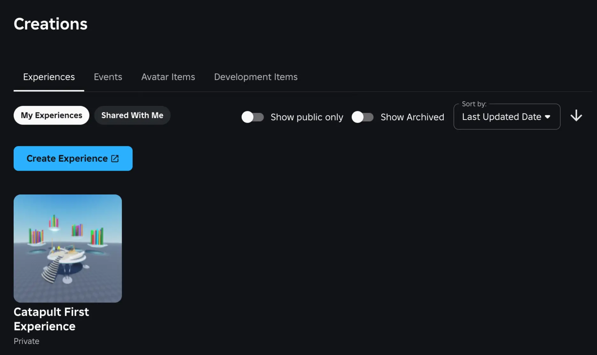
    2. 경험 타일 위로 마우스를 이동하고 ⋯ 버튼을 클릭한 다음 상황에 맞는 메뉴에서 공개로 설정을 선택합니다.<br>
3. (선택 사항) 경험을 다른 사람과 공유합니다.
    1. Creator Dashboard에서 경험 타일 위로 마우스를 이동하고 ⋯ 버튼을 클릭한 다음 상황에 맞는 메뉴에서 URL 복사를 선택합니다.<br>
    2. URL을 다른 사람과 공유하여 경험의 랜딩 페이지에 직접 연결합니다.

첫 번째 Roblox 경험을 만든 것을 축하합니다! Roblox에서 몰입형 경험을 만드는 방법에 대해 자세히 알아보려면 튜토리얼을 확인하십시오.

---
## 출처
 - [Creating Your First Experience](https://create.roblox.com/docs/ko-kr/tutorials/first-experience)
---
## [다음](./04_Lua_programmimg_basic.md)