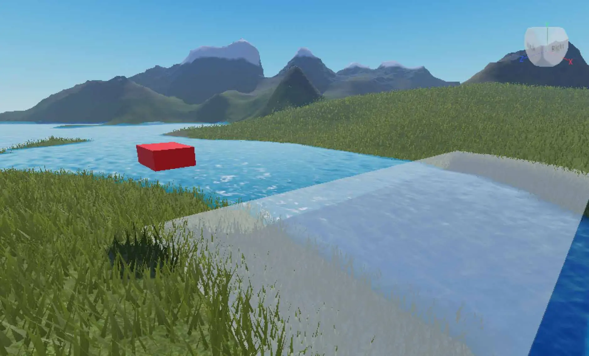
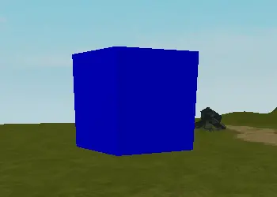

# Lua Programming Basic

## 목차
- [Lua Programming Basic](#lua-programming-basic)
  - [목차](#목차)
  - [Overview](#overview)
    - [시리즈 설명](#시리즈-설명)
    - [시리즈 내용](#시리즈-내용)
  - [Variables and Objects](#variables-and-objects)
    - [Overview](#overview-1)
      - [시리즈 설명](#시리즈-설명-1)
      - [목표 및 전제 조건](#목표-및-전제-조건)
        - [학습 목표](#학습-목표)
      - [전제 조건](#전제-조건)
      - [시리즈 내용](#시리즈-내용-1)
    - [스크립트 작성하기](#스크립트-작성하기)
      - [스크립트를 사용한 코딩](#스크립트를-사용한-코딩)
      - [스크립트 만들기](#스크립트-만들기)
      - [Hello World](#hello-world)
      - [출력 테스트](#출력-테스트)
      - [데이터 유형 식별](#데이터-유형-식별)
      - [변수 생성](#변수-생성)
      - [변수와 문자열을 함께 사용하기](#변수와-문자열을-함께-사용하기)
      - [변수 이름 지정](#변수-이름-지정)
      - [변수에 값 할당](#변수에-값-할당)
      - [Print()를 사용하여 메시지 출력하기](#print를-사용하여-메시지-출력하기)
      - [문자열 결합](#문자열-결합)
      - [요약](#요약)
    - [Object Properties](#object-properties)
      - [속성 창](#속성-창)
      - [스크립트에 주석 추가하기](#스크립트에-주석-추가하기)
      - [파트 위치 찾기](#파트-위치-찾기)
      - [코드로 속성 변경하기](#코드로-속성-변경하기)
      - [요약](#요약-1)
    - [Parents and Children](#parents-and-children)
      - [프로젝트 및 스크립트 설정](#프로젝트-및-스크립트-설정)
      - [부모와 자식 관계](#부모와-자식-관계)
      - [script.Parent 사용하기](#scriptparent-사용하기)
      - [재사용 가능한 파트 테스트](#재사용-가능한-파트-테스트)
      - [요약](#요약-2)
  - [Functions and Events](#functions-and-events)
    - [Overview](#overview-2)
      - [시리즈 설명](#시리즈-설명-2)
      - [목표와 전제 조건](#목표와-전제-조건)
        - [학습 목표](#학습-목표-1)
        - [전제 조건](#전제-조건-1)
      - [시리즈 내용](#시리즈-내용-2)
    - [Coding a Function](#coding-a-function)
      - [함수 생성하기](#함수-생성하기)
      - [함수에 코드 추가하기](#함수에-코드-추가하기)
      - [함수 실행 지시](#함수-실행-지시)
      - [문제 해결 팁](#문제-해결-팁)
    - [Using Parameters and Events](#using-parameters-and-events)
      - [매개변수와 이벤트를 사용하여 함정 설정하기](#매개변수와-이벤트를-사용하여-함정-설정하기)
      - [새 파트 생성하기](#새-파트-생성하기)
      - [스크립트 설정하기](#스크립트-설정하기)
      - [매개변수를 사용하여 함수 생성하기](#매개변수를-사용하여-함수-생성하기)
      - [이벤트를 사용하여 함수 호출하기](#이벤트를-사용하여-함수-호출하기)
      - [요약](#요약-3)
    - [Parameters Practice - Buttons](#parameters-practice---buttons)
      - [다리 만들기](#다리-만들기)
      - [버튼 만들기](#버튼-만들기)
      - [버튼 상호작용 만들기](#버튼-상호작용-만들기)
      - [코드 솔루션](#코드-솔루션)
      - [코드 문제 해결](#코드-문제-해결)
        - [문제: 게임 시작 시 다리가 이미 고체입니다.](#문제-게임-시작-시-다리가-이미-고체입니다)
        - [문제: 출력 창에 "Bridge is not a valid member of Workspace" 오류가 발생합니다.](#문제-출력-창에-bridge-is-not-a-valid-member-of-workspace-오류가-발생합니다)
      - [선택적 코드 도전 과제](#선택적-코드-도전-과제)
    - [Multiple Parameters and Arguments](#multiple-parameters-and-arguments)
      - [여러 매개변수로 연습하기](#여러-매개변수로-연습하기)
      - [함수 설정하기](#함수-설정하기)
      - [여러 매개변수 사용하기](#여러-매개변수-사용하기)
      - [매개변수를 통해 값 전달하기](#매개변수를-통해-값-전달하기)
      - [매개변수의 순서](#매개변수의-순서)
      - [요약](#요약-4)
  - [Conditionals](#conditionals)
    - [Overview](#overview-3)
      - [시리즈 설명](#시리즈-설명-3)
      - [목표와 전제 조건](#목표와-전제-조건-1)
        - [학습 목표](#학습-목표-2)
        - [전제 조건](#전제-조건-2)
      - [시리즈 내용](#시리즈-내용-3)
    - [Intro to If Statements](#intro-to-if-statements)
      - [If 문 연습](#if-문-연습)
      - [If 문 포맷팅](#if-문-포맷팅)
      - [거짓 조건 확인](#거짓-조건-확인)
      - [수학 연산자](#수학-연산자)
      - [변수와 속성](#변수와-속성)
      - [요약](#요약-5)
    - [If/then Practice with Traps](#ifthen-practice-with-traps)
      - [함정 설정하기](#함정-설정하기)
      - [플레이어 터치 확인](#플레이어-터치-확인)
      - [특정 객체 찾기](#특정-객체-찾기)
      - [if 문으로 확인](#if-문으로-확인)
      - [플레이어의 체력 변경](#플레이어의-체력-변경)
      - [요약](#요약-6)
    - [Evaluating Multiple Statements](#evaluating-multiple-statements)
      - [파워업 만들기](#파워업-만들기)
      - [파워업 설정하기](#파워업-설정하기)
      - [플레이어 속도 증가](#플레이어-속도-증가)
      - [속도 부스트 조정](#속도-부스트-조정)
      - [요약](#요약-7)
    - [Multiple Conditions](#multiple-conditions)
      - [여러 조건 코딩하기](#여러-조건-코딩하기)
      - [레이스 코스 설정](#레이스-코스-설정)
      - [finish()가 반복되지 않도록 하기](#finish가-반복되지-않도록-하기)
      - [시간 추적하기](#시간-추적하기)
      - [플레이어 메달 수여](#플레이어-메달-수여)
      - [추가 조건 추가](#추가-조건-추가)
      - [문제 해결 팁](#문제-해결-팁-1)
      - [Else 조건 추가](#else-조건-추가)
      - [요약](#요약-8)
    - [Else/If Practice with Giving Points](#elseif-practice-with-giving-points)
      - [프로젝트 설정하기](#프로젝트-설정하기)
      - [점수 추적](#점수-추적)
      - [색상 변경 파트](#색상-변경-파트)
    - [플레이어 서비스 추가](#플레이어-서비스-추가)
      - [함수와 이벤트](#함수와-이벤트)
      - [색상 순환 만들기](#색상-순환-만들기)
      - [플레이어에게 점수 부여](#플레이어에게-점수-부여)
      - [현재 색상 찾기](#현재-색상-찾기)
      - [점수 부여 또는 차감](#점수-부여-또는-차감)
      - [플레이어 피드백 제공](#플레이어-피드백-제공)
      - [문제 해결 팁](#문제-해결-팁-2)
      - [완성된 PointScript](#완성된-pointscript)
  - [Loops](#loops)
    - [Overview](#overview-4)
      - [시리즈 설명](#시리즈-설명-4)
      - [목표와 전제 조건](#목표와-전제-조건-2)
        - [학습 목표](#학습-목표-3)
        - [전제 조건](#전제-조건-3)
      - [시리즈 내용](#시리즈-내용-4)
    - [Repeating Code with While Loops](#repeating-code-with-while-loops)
      - [파트 및 스크립트 설정](#파트-및-스크립트-설정)
      - [파트를 저장하는 변수 사용](#파트를-저장하는-변수-사용)
      - [While 루프](#while-루프)
      - [While 루프 코딩하기](#while-루프-코딩하기)
      - [루프에 코드 추가하기](#루프에-코드-추가하기)
      - [스크립트 대기 만들기](#스크립트-대기-만들기)
      - [문제 해결 참고 사항](#문제-해결-참고-사항)
        - [문제: 색상이 건너뜀](#문제-색상이-건너뜀)
        - [문제: 파트가 여전히 회색이거나 의도한 대로 색상이 변경되지 않음](#문제-파트가-여전히-회색이거나-의도한-대로-색상이-변경되지-않음)
      - [완성된 색상 반복 파트 스크립트](#완성된-색상-반복-파트-스크립트)
      - [요약](#요약-9)
    - [Intro to For Loops](#intro-to-for-loops)
      - [For 루프 작동 방식](#for-루프-작동-방식)
      - [For 루프의 단계](#for-루프의-단계)
      - [카운트다운 코딩](#카운트다운-코딩)
      - [문제 해결 팁](#문제-해결-팁-3)
      - [다른 For 루프 예제](#다른-for-루프-예제)
        - [1씩 증가하기](#1씩-증가하기)
        - [짝수로 증가하기](#짝수로-증가하기)
        - [For 루프가 전혀 실행되지 않는 경우](#for-루프가-전혀-실행되지-않는-경우)
      - [요약](#요약-10)
    - [Glowing Lights with For Loops](#glowing-lights-with-for-loops)
      - [파트 및 스크립트 설정](#파트-및-스크립트-설정-1)
      - [램프를 빛나게 하기](#램프를-빛나게-하기)
        - [첫 번째 루프 (빛 증가)](#첫-번째-루프-빛-증가)
        - [두 번째 루프 (빛 감소)](#두-번째-루프-빛-감소)
      - [빛을 반복하기](#빛을-반복하기)
      - [완성된 라이트 스크립트](#완성된-라이트-스크립트)
      - [요약](#요약-11)
    - [Loops Practice - Creating a Timed Bridge](#loops-practice---creating-a-timed-bridge)
      - [프로젝트 설정](#프로젝트-설정)
        - [파트 만들기](#파트-만들기)
        - [타이머 디스플레이 만들기](#타이머-디스플레이-만들기)
        - [스크립트 설정](#스크립트-설정)
      - [터치 상호작용 코딩](#터치-상호작용-코딩)
        - [문제 해결 팁](#문제-해결-팁-4)
      - [타이머 생성](#타이머-생성)
      - [다리 재시작 방지](#다리-재시작-방지)
      - [완료된 타이머 다리 스크립트](#완료된-타이머-다리-스크립트)
      - [요약](#요약-12)
    - [Nested Loops](#nested-loops)
      - [중첩 반복문의 실행 방식](#중첩-반복문의-실행-방식)
        - [중첩 반복문 로직](#중첩-반복문-로직)
        - [중첩 반복문 예제](#중첩-반복문-예제)
      - [중첩 반복문 타워](#중첩-반복문-타워)
      - [큐브 생성 스크립트 코딩](#큐브-생성-스크립트-코딩)
        - [Setting up the Script](#setting-up-the-script)
        - [다른 방향으로 생성](#다른-방향으로-생성)
        - [중첩 반복문을 사용한 생성](#중첩-반복문을-사용한-생성)
      - [선택적 도전 과제](#선택적-도전-과제)
        - [파트 사라지게 하기](#파트-사라지게-하기)
        - [객체 내리기](#객체-내리기)
      - [요약](#요약-13)
  - [Arrays and Dictionaries](#arrays-and-dictionaries)
    - [Overview](#overview-5)
      - [시리즈 설명](#시리즈-설명-5)
      - [목표 및 전제 조건](#목표-및-전제-조건-1)
      - [시리즈 내용](#시리즈-내용-5)
    - [Intro to Arrays](#intro-to-arrays)
      - [테이블](#테이블)
        - [배열](#배열)
        - [말하는 캐릭터 만들기](#말하는-캐릭터-만들기)
      - [대사 배열 코딩](#대사-배열-코딩)
      - [배열 인덱스 사용](#배열-인덱스-사용)
      - [특정 인덱스 값 사용](#특정-인덱스-값-사용)
      - [대사 변경](#대사-변경)
      - [배열 크기](#배열-크기)
        - [대사 재시작](#대사-재시작)
      - [요약](#요약-14)
        - [완성된 스크립트](#완성된-스크립트)
        - [문제 해결 팁](#문제-해결-팁-5)
      - [선택적 도전 과제](#선택적-도전-과제-1)
    - [Loops and Arrays](#loops-and-arrays)
      - [배열을 통한 루프](#배열을-통한-루프)
        - [배열과 함께 for 루프 사용](#배열과-함께-for-루프-사용)
        - [문제 해결 팁](#문제-해결-팁-6)
          - [문제: 파트가 너무 빨리 사라지거나 시작할 때 모두 사라집니다.](#문제-파트가-너무-빨리-사라지거나-시작할-때-모두-사라집니다)
        - [두 번째 루프 코딩](#두-번째-루프-코딩)
      - [while 루프로 반복](#while-루프로-반복)
        - [완성된 스크립트](#완성된-스크립트-1)
      - [배열과 ipairs()](#배열과-ipairs)
        - [완성된 스크립트](#완성된-스크립트-2)
      - [요약](#요약-15)
    - [Making Changes to Arrays](#making-changes-to-arrays)
      - [배열에 값 추가하기](#배열에-값-추가하기)
      - [배열에서 값 제거하기](#배열에서-값-제거하기)
        - [마지막 값 제거하기](#마지막-값-제거하기)
        - [인덱스로 제거하기](#인덱스로-제거하기)
      - [배열에서 값 검색하기](#배열에서-값-검색하기)
        - [단일 값 찾기 및 반환하기](#단일-값-찾기-및-반환하기)
        - [값 제거하기](#값-제거하기)
      - [특정 값을 모두 찾고 제거하기](#특정-값을-모두-찾고-제거하기)
      - [요약](#요약-16)
    - [Intro to Dictionaries](#intro-to-dictionaries)
    - [딕셔너리 소개](#딕셔너리-소개)
      - [딕셔너리 문법](#딕셔너리-문법)
      - [딕셔너리 생성하기](#딕셔너리-생성하기)
        - [딕셔너리 값 사용하기](#딕셔너리-값-사용하기)
      - [딕셔너리 값 변경하기](#딕셔너리-값-변경하기)
      - [기존 변수를 키로 사용하기](#기존-변수를-키로-사용하기)
        - [완성된 스크립트](#완성된-스크립트-3)
        - [추가 도전 과제](#추가-도전-과제)
      - [딕셔너리와 `pairs()`](#딕셔너리와-pairs)
      - [요약](#요약-17)
    - [pairs and ipairs](#pairs-and-ipairs)
      - [딕셔너리와 pairs()](#딕셔너리와-pairs-1)
      - [배열과 ipairs()](#배열과-ipairs-1)
      - [연습 - 레스토랑 수프 시뮬레이터](#연습---레스토랑-수프-시뮬레이터)
      - [추가 도전 과제](#추가-도전-과제-1)
    - [Returning Values from Tables](#returning-values-from-tables)
      - [딕셔너리 검색 예제](#딕셔너리-검색-예제)
  - [Organizing Code](#organizing-code)
    - [Overview](#overview-6)
      - [시리즈 설명](#시리즈-설명-6)
      - [목표와 전제 조건](#목표와-전제-조건-3)
        - [학습 목표](#학습-목표-4)
        - [전제 조건](#전제-조건-4)
      - [시리즈 내용](#시리즈-내용-6)
    - [Intro to Module Scripts](#intro-to-module-scripts)
      - [모듈 스크립트 기초](#모듈-스크립트-기초)
        - [모듈 스크립트 생성](#모듈-스크립트-생성)
        - [모듈 스크립트의 구조](#모듈-스크립트의-구조)
        - [모듈 스크립트에 추가하기](#모듈-스크립트에-추가하기)
        - [모듈 스크립트의 범위](#모듈-스크립트의-범위)
      - [다른 스크립트에서 모듈 사용](#다른-스크립트에서-모듈-사용)
      - [RewardManager 예제](#rewardmanager-예제)
      - [일반적인 문제 해결](#일반적인-문제-해결)
      - [요약](#요약-18)
    - [Creating with Module Scripts](#creating-with-module-scripts)
      - [프로젝트 설정](#프로젝트-설정-1)
        - [시작 프로젝트 로드](#시작-프로젝트-로드)
        - [모듈 스크립트 생성](#모듈-스크립트-생성-1)
      - [모듈 스크립트에서 함수 사용](#모듈-스크립트에서-함수-사용)
        - [열쇠를 위한 모듈 함수 생성](#열쇠를-위한-모듈-함수-생성)
        - [모듈 함수 사용](#모듈-함수-사용)
        - [문제 해결 팁](#문제-해결-팁-7)
      - [로컬 함수 생성](#로컬-함수-생성)
        - [현재 TreasureManager 스크립트](#현재-treasuremanager-스크립트)
      - [모듈 스크립트에서 정보 가져오기](#모듈-스크립트에서-정보-가져오기)
        - [상자를 열 수 있는지 확인하기](#상자를-열-수-있는지-확인하기)
        - [플레이어에게 보물을 줍니다](#플레이어에게-보물을-줍니다)
        - [상자 함수를 호출합니다](#상자-함수를-호출합니다)
        - [문제 해결 팁](#문제-해결-팁-8)
      - [완료된 스크립트](#완료된-스크립트)
        - [완료된 TreasureManager 스크립트](#완료된-treasuremanager-스크립트)
        - [완료된 ChestScript](#완료된-chestscript)
        - [완료된 keyScript](#완료된-keyscript)
      - [요약](#요약-19)
    - [Coding Concept - Abstraction](#coding-concept---abstraction)
      - [추상화를 만드는 이유](#추상화를-만드는-이유)
        - [상점 예제](#상점-예제)
      - [추상화 설계](#추상화-설계)
        - [이해 점검 - 추상화 사용](#이해-점검---추상화-사용)
      - [요약](#요약-20)
      - [예시](#예시)
    - [Coding Concept - Algorithms](#coding-concept---algorithms)
      - [코드에서 알고리즘 만들기](#코드에서-알고리즘-만들기)
      - [알고리즘 결합](#알고리즘-결합)
        - [옷 입기 의사 코드](#옷-입기-의사-코드)
      - [요약](#요약-21)
  - [출처](#출처)
  - [다음](#다음)

---
## Overview

### 시리즈 설명
이 시리즈는 프로그래밍 언어 Lua를 사용하는 방법에 대한 기초를 다루는 쉽고 따라하기 쉬운 과정을 통해 Roblox에서 코딩을 시작할 수 있도록 도와줍니다. 이 과정들은 코딩을 처음 접하거나 Lua를 처음 사용하는 사람들에게 완벽합니다. 각 과정은 기본적인 컴퓨터 과학 원리를 중심으로 진행되며, Roblox에서 자신만의 경험을 창조할 수 있도록 단계별 튜토리얼을 포함한 개별 레슨으로 구성되어 있습니다.

이 과정을 시작하기 전에, 독자는 Roblox Studio의 기본 지식을 가지고 있어야 합니다. 이 지식은 'Studio 소개'에서 배울 수 있습니다.

### 시리즈 내용
- **Variables and Objects**: 첫 번째 스크립트를 작성하고 코드를 통해 무언가를 만들기 시작합니다. 이 튜토리얼에서는 변수, 데이터 유형 및 속성을 다룹니다.
- **Functions and Events**: 함수는 코드의 특정 부분을 만들어 필요할 때만 실행되도록 합니다. 코드와 세계의 이벤트를 연결하여 함정이나 다리 같은 인터랙티브한 객체를 만듭니다.
- **Conditionals**: 조건문은 "이것이 일어나면 저것을 하라"는 코딩 패턴을 사용합니다. 이 패턴을 적용하여 플레이어에게 파워업을 잠금 해제할 시기를 확인합니다.
- **Loops**: for 루프와 while 루프를 사용하여 특정 횟수만큼 코드를 반복 실행하거나 영구히 실행되도록 배우십시오. 이러한 반복문 유형을 사용하여 타이머 다리와 깜박이는 조명을 코딩하는 연습을 합니다.
- **Dictionaries and Arrays**: 테이블과 배열을 사용하여 단일 변수에 많은 데이터를 저장하는 방법을 배우십시오. 이러한 데이터 구조는 플레이어의 인벤토리와 같은 큰 데이터 세트를 저장할 수 있습니다.
- **Organizing Code**: 모듈 스크립트라는 Roblox Lua의 고유한 스크립트 유형에 대해 배우고, 다른 스크립트와 상호 작용할 수 있는 방법을 학습하여 코드 조직을 한 단계 더 발전시킵니다.

---
## Variables and Objects

### Overview

#### 시리즈 설명
컴퓨터 과학이나 코딩을 배우고자 하는 모든 사람에게 기초 시리즈로서 제공됩니다. 이 시리즈는 Roblox Studio에서 다른 코딩 수업을 듣고자 하는 모든 사람에게 추천됩니다.

#### 목표 및 전제 조건
##### 학습 목표
- 스크립트 생성 및 출력 창과 같은 인터페이스 요소를 식별하는 과정 이해
- 데이터 유형과 변수를 활용하여 문자열을 사용해 메시지를 출력 창에 출력하고 객체 속성을 변경

#### 전제 조건
- Roblox Studio에서 파트를 생성하고 조작하는 기본 지식

#### 시리즈 내용
- **Creating a Script**: 새로운 스크립트 객체를 생성하고 메시지를 출력 창에 출력하는 방법을 배웁니다.
- **Object Properties**: 코드만 사용하여 파트의 색상을 변경하는 방법을 배웁니다.
- **Parents and Children**: 특정 파트 이름을 호출하는 대신, 계층 구조를 탐색하여 모든 파트에서 작동하는 코드를 작성하는 방법을 배웁니다.

### 스크립트 작성하기
코딩은 컴퓨터가 따라야 하는 지침을 만드는 과정입니다. 사람들이 영어와 스페인어와 같은 다양한 언어를 사용하는 것처럼 프로그램도 다양한 언어를 사용합니다. Roblox는 Lua라는 코딩 언어를 사용합니다.

이 기사에서는 Roblox에서 코딩을 시작하는 방법을 다루며, 스크립트, 데이터 유형 및 변수와 같은 일반적인 개념을 소개합니다. 끝까지 읽으면 Roblox Studio에서 메시지를 표시하는 코드를 작성할 수 있게 될 것입니다.

#### 스크립트를 사용한 코딩
Roblox Studio에서는 Lua 코드의 줄이 스크립트에 저장됩니다. 이 스크립트는 게임에 플레이어에게 체력 포인트를 부여하거나, 불꽃비를 만들거나, 그 외 상상할 수 있는 모든 것에 대한 지침을 제공합니다.

#### 스크립트 만들기
스크립트는 일반적으로 스크립트를 보관하기 위해 만들어진 특별한 폴더인 ServerScriptService에서 생성됩니다.

1. Explorer에서 ServerScriptService 위에 마우스를 올리면 + 버튼이 나타납니다.<br>
2. + 버튼을 클릭하고 Script를 선택합니다. 새로운 스크립트가 생성되고 스크립트 편집기가 열립니다.
3. 스크립트를 마우스 오른쪽 버튼으로 클릭하고 이름 바꾸기를 선택합니다. 스크립트 이름을 PracticeScript로 변경합니다. 스크립트에 이름을 지정하면 여러분과 팀원들이 각 스크립트의 역할을 기억하는 데 도움이 됩니다.

#### Hello World
새로운 스크립트는 스크립트 편집기 상단에 print 함수가 포함되어 있습니다. print 함수는 화면에 텍스트를 표시합니다. 이것은 많은 사람들이 처음 배우는 함수 중 하나이며 자주 사용하게 될 것입니다. 이 코드는 "Hello world!"를 화면에 표시합니다.

```lua
print("Hello world!")
```

다음에 Roblox Studio를 열 때 스크립트를 찾으려면 게임 편집기 위의 스크립트 이름을 클릭하거나 Explorer에서 스크립트 이름을 더블 클릭하십시오.

#### 출력 테스트
기본 코드를 실행한 결과를 보려면 출력 창이 필요합니다. 출력 창은 일반적으로 Roblox Studio 하단에 있지만, 처음 사용하는 경우 활성화해야 할 수도 있습니다.

이 과정 내내 출력 창이 필요하므로 아직 활성화하지 않았다면 지금 활성화하는 것이 좋습니다.

1. 보기 메뉴 탭을 선택합니다.
2. 출력 창을 클릭합니다.<br>
3. 창이 Roblox Studio 하단에 나타납니다.<br>
4. 스크립트를 테스트하려면 재생을 클릭합니다. "Hello world!"가 출력 창에 나타날 것입니다.<br>
5. 플레이테스트를 끝내려면 중지를 클릭합니다. 이제 스크립트 탭으로 돌아갈 수 있습니다.

#### 데이터 유형 식별
코딩 언어는 다양한 종류의 값을 데이터 유형으로 분류합니다. 예를 들어, 하나의 데이터 유형은 숫자입니다. 숫자 데이터 유형은 오로지 숫자로 구성됩니다.

또 다른 데이터 유형은 문자열입니다. 문자열은 숫자, 문자 및 문자를 포함할 수 있습니다. 새로운 스크립트의 기본 코드를 다시 보면, 괄호 안의 단어와 따옴표는 문자열 데이터 유형의 예입니다.

```lua
print("Hello world!")
```

"Hello World"와 같은 문자열은 항상 따옴표 안에 있습니다, "이런 식으로". 아래는 문자열의 더 많은 예입니다. 문자와 숫자가 혼합되어 있는 것을 볼 수 있습니다.

- "You just joined the game!"
- "There are 50 players left"
- "10"

#### 변수 생성
변수는 프로그램이 사용할 수 있고 변경할 수 있는 정보를 저장하는 컨테이너입니다. 

변수를 선언하는 것은 새로운 변수를 생성하는 과정을 말합니다. Lua에서는 새로운 변수를 선언하기 위해 `local`을 입력한 다음 변수의 이름을 입력합니다. 플레이어 이름을 저장할 수 있는 변수는 다음과 같을 수 있습니다: `local playerName`

새 변수를 선언할 때 일부 코딩 언어는 변수에 사용할 데이터 유형을 명시해야 합니다. 예를 들어, Java에서는 `String name = "Pavel"`와 같이 선언합니다. Lua에서는 이름만 필요합니다.

Lua에서 변수는 전역 또는 지역 변수가 될 수 있습니다. 일반적으로 지역 변수를 사용합니다. 지역 변수는 생성된 스크립트 또는 코드 조각 내에서만 사용할 수 있습니다. 전역 변수는 다른 스크립트에서 사용할 수 있지만, 전역 변수가 너무 많으면 경험이 느리고 반응이 없을 수 있습니다. 필요한 경우를 제외하고는 변수를 지역 변수로 만드는 것이 좋습니다.

#### 변수와 문자열을 함께 사용하기
이제 직접 변수를 선언할 차례입니다. 이러한 단계에서는 문자열을 사용하여 좋아하는 동물의 이름을 저장합니다.

1. `print("Hello world!")`를 삭제합니다. 스크립트에 불필요한 코드를 남기지 않는 것이 최선의 방법입니다.
2. `local`을 입력한 다음 변수 이름을 `myAnimal`로 지정하여 새로운 변수를 선언합니다.

변수를 선언합니다:
```lua
local myAnimal
```

변수 이름에는 공백을 포함할 수 없습니다. 공백을 포함하지 않도록 주의하지 않으면 코드가 의도한 대로 작동하지 않습니다.

#### 변수 이름 지정
변수는 무엇이든 이름을 지정할 수 있지만, 좋은 이름은 항상 그 목적을 설명합니다. 일반적인 이름은 코드를 읽기 어렵게 만들고 나중에 업데이트하기 어렵게 만듭니다. 코더들은 또한 변수 이름을 스크립트 내에서 어떻게 사용하는지 기억하기 위해 다양한 대문자 스타일을 사용할 것입니다. 기본 스타일로 camelCase를 사용하는 것이 좋습니다.

camelCase로 작성하려면:

- 소문자로 시작
- 공백 생략
- 추가 단어는 대문자로 시작

좋은 변수 이름:

- playerPoints
- numberStorageArray

나쁜 변수 이름:

- myVariable - 변수의 목적을 설명하지 않습니다
- player name - 포함된 공백이 문제를 일으킬 것입니다

#### 변수에 값 할당
새로운 변수는 비어 있습니다. 값을 할당하거나 컨테이너에 무언가를 넣으려면 `=` 기호를 사용합니다. 이 경우 변수에 좋아하는 동물의 이름을 할당합니다.

변수 이름 다음에 `=`를 입력합니다:

값을 할당합니다:
```lua
local myAnimal =
```

같은 줄에 좋아하는 동물의 이름을 포함하는 문자열을 입력합니다. 따옴표를 잊지 마세요.

```lua
local myAnimal = "Porcupines"
```

#### Print()를 사용하여 메시지 출력하기
print 함수는 화면에 텍스트를 표시합니다. 이전에 본 것처럼, 이 함수는 많은 사람들이 처음 배우는 함수 중 하나입니다. 변수를 보려면 print() 함수를 사용합니다.

새 줄에 print()를 입력합니다:

빈 print() 추가:
```lua
local myAnimal = "Porcupines"
print()
```

괄호 안에 변수 이름을 입력합니다:

```lua
local myAnimal = "Porcupines"
print(myAnimal)
```

출력 편집기에서 빨간 오류가 보이면 코드에 오류가 있는 것입니다. 각 오류는 자신을 설명하는 고유한 방법이 있습니다. 오류 정보를 사용하여 코드를 수정해 보십시오.

재생 버튼으로 코드를 테스트하십시오. 출력 창에 동물의 이름이 표시될 것입니다.

#### 문자열 결합
print()를 사용하여 출력에서 문자열을 표시할 수 있으며, 함수 내에서 변수에 저장된 문자열이나 직접 입력된 문자열을 모두 출력할 수 있습니다. 문자열 결합은 문자열을 결합하는 것입니다. 변수가 할당된 문자열과 두 번째 문자열을 결합하려면 두 개의 점 `..`을 사용합니다. 다음 예는 두 변수를 결합하고 두 개의 문자열을 입력합니다.

```lua
local firstAnimal = "porcupines"
local secondAnimal = "dolphins"

print("I like " .. firstAnimal .. " and " .. secondAnimal)
```

다양한 문자열 조합을 출력하며 연습해 보십시오.

#### 요약
새 스크립트는 객체 이름 옆의 + 버튼을 클릭하여 생성할 수 있습니다. ServerScriptService는 새로운 스크립트를 만들기 위한 일반적인 장소입니다. 새로운 스크립트는 기본 코드 `print("Hello world!")`를 포함합니다. 이 코드는 출력 창에 Hello world!를 표시하며, 코드의 결과와 오류가 발생했는지 여부를 확인할 수 있습니다.

"Hello world!"는 문자열 데이터 유형의 예입니다. 문자열은 키보드에서 입력할 수 있는 모든 문자 조합을 포함할 수 있습니다. 문자열 결합은 여러 문자열을 결합하는 것입니다.

변수는 문자열과 숫자와 같은 다양한 데이터 유형을 저장하도록 할당할 수 있는 컨테이너입니다.

### Object Properties

속성은 객체의 외관과 기능을 제어합니다. Roblox Studio의 각 객체는 고유한 속성 세트를 가지고 있습니다. 예를 들어, 파트 객체는 색상, 크기 및 모양 속성을 가지고 있습니다. 속성은 속성 창이나 코드를 통해 변경할 수 있습니다.

속성에 대해 배우려면 파트에서 일반적으로 사용되는 속성을 탐색한 다음 파트 색상을 변경하는 스크립트를 작성해 보십시오.

#### 속성 창

속성 창은 객체의 속성에 대해 배울 수 있는 도구입니다. 이를 사용하여 파트의 속성을 확인해 보십시오.

1. 파트를 선택하십시오.
2. 오른쪽 아래의 속성 창에서 색상, 크기, 재질 및 투명도와 같은 변경 가능한 다양한 속성을 확인하십시오. 또한, 이 창 내에서 스크립트를 통해 대부분의 속성을 변경할 수 있습니다.<br>
3. 속성 창이 보이지 않으면 뷰 탭으로 이동하여 속성 버튼을 클릭하십시오.

#### 스크립트에 주석 추가하기

주석은 --로 시작하는 특별한 줄로, 코더가 스크립트의 각 부분이 무엇을 하는지 기억하는 데 도움을 줍니다. 다른 코드와 달리 주석은 실행되지 않고, 자신과 다른 프로그래머에게 메모를 남기기 위해 존재합니다. 이 스크립트는 게임 시작 시 파트의 색상 속성을 변경할 것입니다.

1. 기존 파트를 선택하거나 새 파트를 만드십시오. 파트 이름을 PracticePart로 변경하십시오.
2. ServerScriptService에서 ChangeColor라는 새 스크립트를 만드십시오.
3. 스크립트의 기본 코드를 삭제하십시오. 그런 다음 --를 입력하고 스크립트가 무엇을 할 것인지 간략히 설명하는 주석을 작성하십시오.

```lua
-- 스크립트가 하는 일을 설명합니다
-- 파트의 색상을 변경합니다
```

#### 파트 위치 찾기

파트를 변경하려면 파트의 위치를 설명할 수 있어야 합니다. Explorer는 위치를 참조하는 데 탁월한 도구입니다. 이 경우 PracticePart는 Workspace 아래에 있습니다.


이제 파트의 위치를 알고 있으므로, 파트의 위치를 스크립트가 이해할 수 있는 형식으로 번역해야 합니다.

주석 아래에 `workspace.PracticePart`를 입력하십시오.

```lua
-- Workspace의 PracticePart를 참조합니다
-- 파트의 색상을 변경합니다
workspace.PracticePart
```

Workspace에 도달하는 긴 방법은 `game.Workspace`를 사용하는 것입니다. 그러나 Workspace에 접근해야 하는 경우가 매우 흔하기 때문에 Roblox는 키워드 `workspace`를 지름길로 만들었습니다.

#### 코드로 속성 변경하기

파트의 색상을 변경하려면 RGB 값을 사용하십시오. 컴퓨터는 RGB 값, 즉 빨강, 초록, 파랑의 조합을 사용하여 화면의 모든 색상을 만듭니다.

RGB 값은 0에서 255까지의 세 숫자를 사용하며, 쉼표로 구분됩니다. 예를 들어, 검정색은 (0, 0, 0), 흰색은 (255, 255, 255)입니다.

파트의 경우, 스크립트는 색상 속성을 새로운 Color3, 색상을 저장하는 데이터 유형으로 변경할 것입니다.

PracticePart 뒤에 .Color를 입력하여 색상 속성에 접근하십시오.

```lua
-- 색상 속성에 접근합니다
-- 파트의 색상을 변경합니다
workspace.PracticePart.Color
```

Roblox는 코딩 과정을 빠르게 하기 위해 단어를 입력할 때 자동 완성 기능을 제공합니다. 단어가 나타나면 화살표 키를 사용하여 목록을 아래로 이동할 수 있습니다. Enter를 눌러 옵션을 선택하십시오.

다음으로, `= Color3.fromRGB()`를 입력하십시오. 이 코드는 새로운 색상을 할당할 수 있게 합니다.

```lua
-- Color3.fromRGB()를 사용합니다
-- 파트의 색상을 변경합니다
workspace.PracticePart.Color = Color3.fromRGB()
```

RGB 색상 값은 괄호 안에 수동으로 입력할 수 있지만, 색상 선택기를 사용하는 것이 더 쉽습니다. 괄호 안을 클릭한 다음 색상 휠을 클릭하십시오. 팝업을 따라 색상을 만드십시오.

코드는 아래와 유사해야 합니다.

```lua
-- PracticePart의 색상을 업데이트합니다
-- 파트의 색상을 변경합니다
workspace.PracticePart.Color = Color3.fromRGB(255, 230, 50)
```

RGB 값을 수동으로 입력하려면 각 숫자가 0에서 255 사이이고 쉼표로 구분되어 있는지 확인하십시오. 예: (10, 50, 10).

색상이 변경되는지 테스트하려면 Play를 누르십시오.

#### 요약

모든 객체에는 속성이 있습니다. 파트는 색상과 투명도와 같은 속성을 가지고 있습니다. 동시에 다른 객체 유형에는 고유한 속성이 있습니다.

파트의 색상을 변경하려면 어디서 찾을 수 있는지 설명할 수 있어야 합니다. 파트가 Workspace에 있는 경우 키워드 `workspace`를 사용하십시오. 그런 다음 점 연산자를 사용하여 원하는 파트를 지정하고 속성에 접근하십시오.

### Parents and Children

ServerScriptService에서 스크립트를 실행하는 대신, 파트에 스크립트를 연결하고 싶을 수 있습니다. 예를 들어, 파트를 함정으로 만들거나 플레이어가 파트를 터치할 때 점수를 주는 스크립트를 사용하는 경우입니다. 스크립트와 파트가 계층 구조에서 어떻게 관련되어 있는지 이해함으로써, 어떤 파트를 사용할지 명시하지 않고도 자동으로 작동하는 스크립트를 만들 수 있습니다.

이를 위해 부모와 자식 관계를 이해해야 합니다.

부모와 자식은 서로 다른 객체 간의 계층 구조를 설명하는 방법입니다. Workspace에 새 파트를 추가할 때마다 Workspace는 부모 객체가 되고, 파트는 자식 객체가 됩니다. ServerScriptService에 스크립트를 추가할 때, ServerScriptService는 부모가 되고, 스크립트는 새로운 자식이 됩니다.

#### 프로젝트 및 스크립트 설정

부모와 자식 관계를 설명하기 위해, 색상이 변하는 단일 파트로 시작한 다음 여러 파트에 스크립트를 복제할 것입니다.

새 파트를 만들고 이름을 변경하십시오. 이 레슨에서는 ColorPart를 사용합니다.


파트를 마우스 오른쪽 버튼으로 클릭하고 Insert Object > New Script를 선택하십시오. 스크립트 이름을 ColorChanger로 변경하십시오.

아래 코드를 ColorChanger에 복사하여 붙여넣으십시오. 이 버전의 코드는 이전에 사용한 것과 동일합니다. 특정 파트를 변수에 할당합니다.

```lua
-- ColorPart의 색상을 변경합니다
local colorPart = workspace.ColorPart
colorPart.Color = Color3.fromRGB(50, 240, 255)
```

4. 테스트하여 파트의 색상이 원하는 대로 변경되는지 확인하십시오.

#### 부모와 자식 관계

부모는 스크립트나 파트와 같은 객체가 그 아래에 붙어 있는 모든 것을 의미합니다. 부모 아래에 있는 모든 것은 자식입니다. 아래 예에서, ColorPart는 부모이고, ColorChanger는 자식입니다.


현재 스크립트로는 ColorPart라는 단일 파트의 색상만 변경할 수 있습니다. 어떤 파트의 색상이든 변경하려면 스크립트의 부모 객체에서 작동하도록 코드를 설계할 수 있습니다. 코드 script.Parent는 계층 구조를 따라 올라가 스크립트가 붙어 있는 객체를 찾습니다.

#### script.Parent 사용하기

script.Parent는 = 기호를 사용하여 다른 값처럼 변수에 할당할 수 있습니다.

스크립트에서 이름이 지정된 파트를 script.Parent로 교체하십시오. 아래 코드를 확인하십시오.

```lua
-- 부모 객체의 색상을 변경합니다
local colorPart = script.Parent
colorPart.Color = Color3.fromRGB(50, 240, 255)
```

#### 재사용 가능한 파트 테스트

변수가 스크립트가 붙어 있는 어떤 파트이든 참조하게 되므로, 원하는 만큼 복사할 수 있습니다.

컬러 파트를 마우스 오른쪽 버튼으로 클릭하고 Duplicate를 선택하거나 단축키 CtrlD(⌘D)를 사용하십시오. 총 세 개 이상의 파트를 만드십시오.

게임을 실행하여 모든 파트의 색상이 변경되는지 확인하십시오.

<video src="../img/04_Lua_programmimg_basic/scriptParent_finalExample_web.mp4" width="320" height="240" controls></video>

#### 요약

파트를 이름과 위치로 직접 참조하는 대신, script.Parent를 대안으로 사용할 수 있습니다. 이 코드는 스크립트가 붙어 있는 부모 객체나 객체를 가져와 스크립트가 이를 수정할 수 있게 합니다. script.Parent와 같은 코드를 사용하면 코드를 재사용하는 데 유용합니다. 기억해야 할 단점은 코드를 변경하고자 할 때 여러 스크립트를 업데이트해야 한다는 점입니다.

---
## Functions and Events

### Overview

#### 시리즈 설명
함수와 이벤트를 사용하여 코드를 원하는 시점에, 원하는 만큼 실행하십시오. 함수와 이벤트를 통해 함정, 버튼, 체력 회복 아이템 등을 설정할 수 있습니다.

이 과정에서는 함수, 매개변수, 인수 및 반환 값을 다룹니다.

#### 목표와 전제 조건

##### 학습 목표
- 코드를 함수라는 재사용 가능한 덩어리로 배치하는 방법을 배웁니다.
- 코드가 "범위 내에 있다"는 의미를 이해합니다.
- 경험 내에서 이벤트를 설정하고 함수가 실행될 시점을 알리는 데 이를 사용합니다.
- 함정과 버튼을 만들기 위해 함수와 이벤트를 사용하는 연습을 합니다.

##### 전제 조건
Roblox Studio에 대한 기본 지식, 예를 들어 파트를 이동하고 회전하는 방법. Script 객체를 생성하고 변수, 속성, 문자열을 사용하는 경험.

#### 시리즈 내용

| 기사 | 설명 |
| --- | --- |
| Coding a Function | 코드 조각을 설정하여 명령할 때만 실행되도록 합니다. |
| Using Parameters and Events | 모든 정보를 아직 가지고 있지 않을 때 함수를 코딩하는 방법입니다. |
| Parameters Practice - Buttons | 버튼을 눌러 세상에 다리를 나타나게 함으로써 이벤트와 매개변수를 사용하는 연습입니다. |
| Multiple Parameters and Arguments | 여러 정보를 한 번에 함수로 전달합니다. |

### Coding a Function

함수는 스크립트에서 여러 번 사용할 수 있는 지시문의 집합입니다. print()와 task.wait() 같은 사전 제작된 함수(메소드라고도 함)는 대부분의 프로그래밍 언어에 내장되어 있습니다. 코더는 또한 여러 번 사용하고 싶은 코드를 위해 자신만의 커스텀 함수를 만들 수 있습니다. Lua에서는 이것을 `local function nameOfTheFunction()`을 입력하여 수행합니다.

함수는 요리법과 비슷하다고 생각할 수 있습니다. 둘 다 특정 지시사항 목록입니다. 예를 들어, 로봇에게 스파게티를 만드는 방법을 가르치기 위해 함수를 사용할 수 있습니다. 먼저, 식사 준비 단계를 나열하는 로컬 함수를 만듭니다. 그런 다음, 저녁을 먹고 싶을 때마다 "로봇, makeSpaghetti()를 실행해"라고 말하면 됩니다.

저녁을 만드는 단계는 다음과 같습니다:

1. 물을 끓인다
2. 파스타를 넣는다
3. 15분간 요리한다
4. 소스를 추가한다
5. 접시에 담아 서빙한다

코드 버전은 다음과 같이 보일 수 있습니다:

```lua
local function makeDinner()
    -- 지시 사항 목록
end

-- 코드 실행 지시
makeDinner()
```

#### 함수 생성하기

연습을 위해 첫 번째 함수는 출력 창에 좋아하는 음식을 출력합니다. 사용할 스크립트를 설정합니다. 방법을 기억하지 못한다면, 다음을 참고하십시오:

1. ServerScriptService에서 새 스크립트를 만듭니다.
2. 스크립트 이름을 FunctionsPractice로 변경합니다.
3. "Hello World"를 삭제합니다.
4. 맨 위에 주석을 추가합니다. 예: -- 좋아하는 음식을 출력합니다

다음으로, 함수를 생성하고 이름을 지정합니다. 모든 함수는 그 목적을 기억하기 쉽게 이름이 지정되어야 합니다. 함수 이름은 camelCase로, 첫 글자는 소문자이고 다음 단어는 대문자로 시작합니다.

예: addPoints(), restartGame(), rainFlamingLlamas()

`local function printFood()`를 입력한 후 키보드에서 Enter를 누르십시오. 함수가 자동 완성되어 다음과 같이 보일 것입니다:

```lua
local function printFood()

end
```

코드가 자동 완성되지 않으면 `end`를 직접 입력하십시오. 함수에 끝이 없으면 코드가 실행되지 않습니다.

#### 함수에 코드 추가하기

모든 함수 코드는 `local function printFood()`와 `end` 사이에 입력해야 합니다. 이 두 지점 사이에 없는 코드는 함수가 실행될 때 실행되지 않습니다.

```lua
local function printFood()
    -- 함수가 호출될 때 실행되는 코드
end

-- 여기에 있는 코드는 실행되지 않음
```

함수 안에 있거나 함수가 사용할 수 있는 정보는 범위 내에 있습니다.

`local function printFood()`와 `end` 사이에 print()를 사용하여 좋아하는 음식을 표시하십시오.

```lua
local function printFood()
    print("Curry!")
end
```

입력하는 동안 코드가 자동으로 들여쓰기 되었을 것입니다. 이는 함수의 시작과 끝을 쉽게 볼 수 있도록 합니다. 자동 들여쓰기가 되지 않았다면, 줄의 시작 부분에서 Tab을 눌러 빠르게 들여쓰기 할 수 있습니다.

#### 함수 실행 지시

함수가 작동하려면 마지막으로 해야 할 일은 함수를 실행하도록 지시하는 것입니다. 이를 함수 호출이라고 합니다. 함수는 호출될 때까지 실행되지 않습니다. 함수를 호출하려면 함수 이름과 끝에 ()를 입력합니다.

`end` 아래에 `printFood()`를 입력하십시오.

```lua
local function printFood()
    print("Curry!")
end

printFood()
```

코드를 테스트하십시오. 좋아하는 음식이 출력 창에 나타나야 합니다.

#### 문제 해결 팁

코드가 실행되지 않으면 다음과 같은 오류를 확인하십시오:

- `print("Your Food Here")`가 `local function printFood()`와 `end` 사이에 있는지 확인하십시오.
- 음식이 문자열인지 확인하고 "양쪽에 따옴표"가 있는지 확인하십시오.
- 함수가 생성된 후 호출되었는지 확인하십시오. `printFood()`는 `end` 아래에 있어야 합니다.

### Using Parameters and Events

일반적으로 함수는 함수 내에 작성된 정보만 사용할 수 있습니다. 그러나 때로는 그 정보를 사전에 알지 못하거나, 유사한 여러 정보를 사용하여 동일한 함수를 재사용하고 싶을 때가 있습니다. 예를 들어, 오비 코스를 가장 빨리 완주한 사람의 이름을 거대한 글자로 모든 사람에게 표시하는 함수를 사용하고 싶다면, 경주가 끝날 때까지 미래의 승자의 이름을 알 수 없습니다.

매개변수는 나중에 함수에 전달할 정보를 위한 자리 표시자입니다. 매개변수는 함수에 정보를 전달할 수 있는 창과 같습니다.

#### 매개변수와 이벤트를 사용하여 함정 설정하기

이 스크립트는 파트를 터치하는 모든 것을 파괴하는 함정 파트를 생성합니다. 이를 설정하려면 매개변수를 사용해야 합니다. 함정이 떨어져서 의도하지 않은 것을 파괴하지 않도록 주의하십시오.

#### 새 파트 생성하기

무엇이든 닿는 것을 파괴할 파트를 설정해야 합니다.

1. 아무것도 닿지 않는 새 파트를 만드십시오. 무언가에 닿으면 너무 일찍 작동할 수 있습니다.
2. Explorer에서 파트의 이름을 TrapPart로 변경하십시오.
3. 파트를 앵커하십시오.

#### 스크립트 설정하기

변수와 경험의 계층 구조에 대한 지식을 사용하여 함정 파트를 참조하십시오.

1. 함정 파트에 새 스크립트를 추가하십시오. 스크립트 이름을 TrapScript로 변경하십시오.
2. "Hello World"를 삭제하고 설명적인 주석을 추가하십시오.
3. 주석 아래에 스크립트의 부모를 찾는 새 변수를 만드십시오.

```lua
-- 부모에 닿는 모든 것을 파괴합니다
local trap = script.Parent
```

#### 매개변수를 사용하여 함수 생성하기

함정은 파트를 터치한 무엇이든 파괴하기 위해 함수를 사용할 것입니다. 작동하려면, 함수는 무엇이 파트를 터치했는지 알아야 합니다. 그리고 이는 매개변수를 사용하는 것을 의미합니다. 매개변수는 함수 이름 뒤에 오는 () 안에 입력됩니다. 다음과 같이 보입니다:

```lua
local function functionName(parameterName)

end
```

매개변수를 통해 전달되는 실제 정보는 인수라고 합니다. 이 레슨에서는 onTouch()라는 새 함수를 만들고 objectTouched라는 매개변수를 사용하여 무엇이 함정을 터치했는지 추적한 후 터치된 파트를 파괴할 것입니다.

```lua
local trap = script.Parent

local function onTouch()

end
```

() 안에 매개변수 이름을 입력하십시오. 이 레슨에서는 objectTouched를 사용합니다.

```lua
local trap = script.Parent

local function onTouch(objectTouched)

end
```

`local function onTouch()`와 `end` 사이에 print 문을 만드십시오. 다음 섹션에서 파트가 터치되는지 확인하는 데 사용합니다.

```lua
local trap = script.Parent

local function onTouch(objectTouched)
    print("무언가 함정을 터치했습니다")
end
```

#### 이벤트를 사용하여 함수 호출하기

함수가 파트를 터치할 때마다 실행되도록 하려면 함수를 Touched 이벤트에 연결하십시오. 이벤트는 경험 내에서 발생하는 일입니다. 예를 들어, 플레이어가 파트를 터치하거나 체력을 잃는 경우입니다. 함수가 이벤트에 연결되면 이벤트가 발생할 때마다 함수가 실행됩니다.

Touched 이벤트는 한 파트가 다른 파트를 터치할 때마다 실행되며, 버튼, 함정 및 플레이어와 상호 작용하는 다른 객체를 만드는 데 사용할 수 있습니다.

함수의 `end` 아래에 `trap.Touched:Connect(onTouch)`를 입력하십시오.

```lua
local trap = script.Parent

local function onTouch(objectTouched)
    print("무언가 함정을 터치했습니다")
end

-- 함수를 Touched 이벤트에 연결합니다
trap.Touched:Connect(onTouch)
```

테스트를 클릭한 다음 파트를 터치하십시오. 테스트 출력 문을 확인하십시오: "무언가 함정을 터치했습니다". 출력 창에 문자열이 보이지 않으면 다음을 확인하십시오:

- 문자열 "무언가 함정을 터치했습니다"가 `local function onTouch()`와 `end` 사이에 있는지 확인하십시오.
- Touched가 대문자로 시작하는지 확인하십시오.

이제 함수가 올바르게 설정되었으므로, 파트를 터치한 무엇이든 파괴하도록 만드십시오. 함수 내에서 문자열 뒤에 `objectTouched:Destroy()`를 입력하십시오. 완성된 코드는 다음과 같습니다:

```lua
local trap = script.Parent

local function onTouch(objectTouched)
    print("무언가 함정을 터치했습니다")
    -- 터치한 객체를 파괴합니다
    objectTouched:Destroy()
end

trap.Touched:Connect(onTouch)
```

다시 테스트하고 파트를 터치했을 때 어떤 일이 발생하는지 확인하십시오. 아바타의 발이나 팔이 사라질 것입니다. 파트가 아바타의 머리나 목에 닿으면 완전히 파괴될 수도 있습니다.

<video src="../img/04_Lua_programmimg_basic/parameters-and-events_trap.mp4" width="320" height="240" controls></video>

#### 요약

매개변수는 일반적으로 범위 밖에 있는 정보를 함수로 전달하는 데 사용됩니다. 한편, 이벤트는 중요한 일이 발생할 때 경험 내에서 발생하는 특별한 신호입니다. 서로 다른 객체는 서로 다른 이벤트를 가지고 있습니다. 함수는 이벤트에 연결되어 이벤트가 발생할 때마다 호출됩니다. 이 작은 스크립트는 함수를 함정의 Touched 이벤트에 연결하고, 매개변수를 통해 함정을 터치한 것을 전달했습니다.

### Parameters Practice - Buttons

버튼은 플레이어가 새로운 영역을 잠금 해제하고, 점수를 주며, 보물을 드러내는 데 사용할 수 있습니다. 플레이어가 버튼을 터치할 때마다 상호 작용 중임을 알리기 위해 색상을 변경하거나 소리를 내는 등의 피드백을 제공해야 합니다.

이 예제에서는 버튼을 사용하여 다리를 활성화합니다. 버튼을 누르면 초록색으로 변하고 플레이어는 다리를 사용할 수 있게 됩니다. 플레이어가 버튼을 누르지 않으면 다리를 걸으려 할 때 떨어지게 됩니다.

#### 다리 만들기

먼저 다리를 설정합니다.

1. 플레이어가 다리가 필요로 하는 게임 영역을 만듭니다.
2. 다리 역할을 할 파트를 만들고 이름을 Bridge로 변경합니다.
3. 다리를 선택하고 속성 창에서 다음을 변경합니다:
   - Transparency를 0.5로 변경합니다. Transparency는 0이 보이는 상태, 1이 보이지 않는 상태입니다.
   - Anchor를 체크합니다.
   - CanCollide를 체크 해제합니다.
4. 게임을 테스트하여 다리가 안개처럼 보이고 사람들이 아직 걸을 수 없음을 확인합니다.


#### 버튼 만들기

다리가 설정되었으므로 이제 버튼을 만듭니다.

1. Button이라는 새 파트를 만듭니다.
2. 버튼 색상을 빨간색으로 변경합니다.
3. 버튼을 앵커합니다.
4. 버튼을 약간 떠서 아무것도 닿지 않도록 이동합니다. 이는 Touched 이벤트가 실수로 실행되지 않도록 하기 위함입니다.


#### 버튼 상호작용 만들기

이번에는 Touched 이벤트를 사용하여 함정을 만드는 대신 버튼을 사용하여 다리를 사용할 수 있게 만듭니다. 다리를 충돌 가능하게 만들려면 플레이어가 버튼을 터치할 때 실행되는 사용자 정의 함수 내에서 `bridge.CanCollide = true` 코드를 사용합니다. 다음 단계를 완료하는 데 필요한 모든 것을 이미 알고 있습니다.

코드 솔루션을 보기 전에 직접 시도해 보십시오.

1. 버튼에 ActivateBridge라는 새 스크립트를 삽입합니다.
2. "Hello World"를 삭제합니다.
3. 다리와 버튼에 대한 변수를 만듭니다.
4. 버튼이 터치될 때 수행할 로컬 함수를 만듭니다:
   - "button touched"를 출력합니다.
   - 터치 시 버튼 색상을 빨간색에서 초록색으로 변경합니다.
   - 다리의 투명도를 0으로 변경하여 보이게 만듭니다.
   - `bridge.CanCollide = true`를 사용하여 다리를 사용할 수 있게 만듭니다.
5. 함수를 버튼의 Touched 이벤트에 연결합니다.
6. 스크립트를 테스트하여 버튼을 터치할 때 다리가 나타나는지 확인합니다.

#### 코드 솔루션

다음은 가능한 코드 솔루션 중 하나입니다:

```lua
-- 이 스크립트를 버튼에 삽입합니다
-- 무언가 버튼을 터치하면 버튼을 초록색으로 바꿉니다.

local button = script.Parent
local bridge = workspace.Bridge

local function buttonPressed()
    print("button touched")
    button.Color = Color3.fromRGB(0, 170, 0)
    bridge.Transparency = 0
    bridge.CanCollide = true
end

button.Touched:Connect(buttonPressed)
```

#### 코드 문제 해결

##### 문제: 게임 시작 시 다리가 이미 고체입니다.
파트가 앵커되고 아무것도 닿지 않도록 하십시오. 파트가 지형이나 다른 파트와 닿으면 `buttonPressed()` 함수가 실수로 실행될 수 있습니다.

##### 문제: 출력 창에 "Bridge is not a valid member of Workspace" 오류가 발생합니다.
다음을 확인하십시오:
- 다리의 이름이 정확하게 맞는지 확인하십시오. 스크립트의 다리 이름이 Explorer의 이름과 정확히 일치해야 합니다.
- `part.Touched:Connect(buttonPressed)`가 `buttonPressed()` 함수 외부에 있는지 확인하십시오.

#### 선택적 코드 도전 과제

이 레슨의 스크립트는 특정 영역에서 플레이어를 차단하는 문을 유지하는 데도 사용할 수 있습니다. 코딩 기술을 연습하고 다음을 수행하십시오:

1. 문 파트를 만듭니다.
2. 문에서 멀리 떨어진 버튼을 만듭니다.
3. 이 레슨의 스크립트를 수정하여 문이 투명해지고 플레이어가 충돌할 수 없도록 만드십시오.

당신의 버전은 다음과 비슷할 것입니다:

```lua
local button = script.Parent
-- 참고: 프로젝트의 파트 이름을 Gate로 대체하십시오.
local gate = workspace.Gate

local function buttonPressed()
    print("button touched")
    -- 플레이어에게 피드백을 주기 위해 버튼을 빨간색으로 변경합니다
    button.BrickColor = BrickColor.Red() -- 여기 수정
    -- 문을 보이지 않게 만듭니다
    gate.Transparency = 1
    -- 플레이어가 문을 통과할 수 있게 합니다
    gate.CanCollide = false
end

button.Touched:Connect(buttonPressed)
```

### Multiple Parameters and Arguments

함수는 실제로 하나 이상의 매개변수를 가질 수 있으며, 이를 통해 여러 개의 인수(정보 조각)를 함수로 전달할 수 있습니다. 게임 예시로는 플레이어를 팀에 할당하는 경우가 있습니다. 여기에서는 플레이어를 전달할 매개변수와 어느 팀에 할당할지를 전달할 매개변수가 필요합니다.

여러 매개변수를 설정하려면 매개변수 이름을 쉼표로 구분하십시오.

```lua
local function assignTeam(playerName, whichTeam)

end
```

#### 여러 매개변수로 연습하기

여러 매개변수를 사용하는 연습을 위해, 게임 내 객체를 쓰레기와 재활용으로 분류하는 함수를 만들어 보겠습니다.

- 첫 번째 매개변수는 쓰레기이며, 파괴됩니다.
- 두 번째 매개변수는 재활용품이며, 새롭게 빛나게 만듭니다.

#### 함수 설정하기

먼저 여러 매개변수를 사용하는 함수를 설정한 다음 작업을 테스트하십시오.

1. ServerScriptService에 새 스크립트를 만듭니다.
2. `sortGarbage()`라는 새 함수를 만들고 두 개의 매개변수 `trash`와 `recyclable`을 추가합니다.
3. 스크립트 하단에서 함수를 호출합니다.
4. 함수 내에서 print 문을 사용하여 지금까지의 코드를 빠르게 확인하십시오.

```lua
local function sortGarbage(trash, recyclable)
   print("garbage test")
end

sortGarbage()
```

#### 여러 매개변수 사용하기

함수 내에서 매개변수는 변수와 유사하게 사용할 수 있습니다. 이 예제에서는 `trash`는 파괴되고 `recyclable`은 Particle Emitter를 사용하여 반짝이게 됩니다.

print 문을 삭제하고 `Instance.new()`를 사용하여 새 Particle Emitter를 생성하십시오. 이는 재활용품에 반짝임을 줄 때 사용됩니다.

```lua
local function sortGarbage(trash, recyclable)
    -- Create a new Particle Emitter
    local sparkle = Instance.new("ParticleEmitter")
end

sortGarbage()
```

`Instance.new()`는 Fire, 폴더, 파트 등과 같은 객체를 생성하는 데도 사용할 수 있습니다.

매개변수를 통해 전달된 `trash`를 다른 변수와 동일하게 파괴하십시오.

```lua
local function sortGarbage(trash, recyclable)
    local sparkle = Instance.new("ParticleEmitter")

    -- Destroy the trash
    trash:Destroy()
end

sortGarbage()
```

Particle Emitter를 `recyclable`에 연결하십시오.

```lua
local function sortGarbage(trash, recyclable)
    local sparkle = Instance.new("ParticleEmitter")

    -- Destroy the trash and make recyclables shiny
    trash:Destroy()
    sparkle.Parent = recyclable
end

sortGarbage()
```

#### 매개변수를 통해 값 전달하기

이제 쓰레기를 처리할 시간입니다! 매개변수가 설정되었으므로 함수는 정보를 받을 준비가 되었습니다.

1. 버릴 수 있는 것들을 나타내기 위해 기본 파트를 사용하여 두 개의 객체를 만듭니다. 하나는 쓰레기, 하나는 재활용품이어야 합니다. 고유한 이름을 지정하십시오.
2. 스크립트 상단에 생성한 객체에 대한 변수를 추가합니다. 이것들이 인수가 됩니다.

```lua
local cementBlock = workspace.Cement
local glassBottle = workspace.GlassBottle
```

3. 스크립트 하단에서 `sortGarbage()`가 호출되는 위치에 각 인수를 전달하십시오.

```lua
-- Objects to use as arguments
local cementBlock = workspace.CementBlock
local glassBottle = workspace.GlassBottle

--Destroys trash and cleans up recyclables
local function sortGarbage(trash, recyclable)
    local sparkle = Instance.new("ParticleEmitter")

    trash:Destroy()
    sparkle.Parent = recyclable
end

-- Pass in the arguments
sortGarbage(cementBlock, glassBottle)
```

코드를 테스트하십시오. 먼저 전달된 객체는 파괴되고, 두 번째 객체는 반짝일 것입니다.

#### 매개변수의 순서

일반적으로 인수는 전달되는 순서에 따라 매개변수와 일치합니다. 예를 들어, 첫 번째 인수는 첫 번째 매개변수에 사용됩니다. 두 번째 인수는 두 번째 매개변수에 사용됩니다.

예제에서는 두 개의 매개변수가 있습니다. 처음에 전달되는 것은 항상 쓰레기이고, 두 번째는 항상 재활용품이 됩니다.

```lua
--Destroys trash and cleans up recyclables
local function sortGarbage(trash, recyclable)
     local sparkle = Instance.new("ParticleEmitter")

    trash:Destroy()
    sparkle.Parent = recyclable
end

--Goes in order. Cement is destroyed and the glass bottle is recycled
sortGarbage(cementBlock, glassBottle)

--GlassBottle is destroyed and cementBlock is recycled
sortGarbage(glassBottle, cementBlock)
```

인수 하나만 전달하면, 그 인수는 쓰레기로 처리됩니다. 세 개의 인수를 전달하면, 세 번째 인수는 매개변수가 없기 때문에 아무 일도 일어나지 않습니다.

#### 요약

매개변수는 값을 함수로 전달할 수 있는 자리 표시자입니다. 인수는 자리 표시자를 통해 전달되는 값입니다. 이름을 쉼표로 구분하여 여러 매개변수를 만들 수 있습니다. 함수를 호출할 때, 값이 전달되는 순서가 어떤 매개변수에 사용될지 결정합니다.

---
## Conditionals

### Overview

#### 시리즈 설명
많은 경험은 특정 요구 사항 목록이 충족될 때만 실행되는 동작을 가지고 있습니다. 특정 팀만 들어갈 수 있는 방이나 일부 플레이어만 구매할 수 있는 인벤토리 아이템을 본 적이 있을 것입니다. 이 시리즈에서는 "이것이 발생하면, 저것을 실행하라"는 코드를 설정하는 방법을 다룹니다.

#### 목표와 전제 조건

##### 학습 목표
- if then 문 뒤의 논리와 elseif 및 else 키워드를 사용하여 여러 시나리오를 설정하는 방법을 이해합니다.

##### 전제 조건
이 과정을 시작하기 전에 독자는 Roblox Studio를 탐색하고 새 변수와 함수를 선언할 수 있어야 합니다.

#### 시리즈 내용

| 기사 | 설명 |
| --- | --- |
| Intro to If Statements | If 문이 어떻게 작동하는지 배우고 Roblox Lua 내에서 이를 코딩하는 방법을 학습합니다. |
| If Statement Practice: Trap Parts | 조건문을 사용하여 아바타와 휴머노이드만 피해를 입히는 더 나은 함정을 만듭니다. |
| If Statement Practice: Power Ups | If 문을 사용하여 플레이어의 걷는 속도를 증가시키는 파트를 만듭니다. |
| Multiple Conditions | else 및 elseif를 사용하여 여러 시나리오를 고려하는 코드를 설계합니다. |
| Multiple Conditions Practice: Awarding Points | 조건문에 대해 배운 모든 것을 사용하여 플레이어에게 점수를 부여할 수 있는 파트를 만듭니다.

### Intro to If Statements

경험에서는 원인과 결과의 관계가 많이 발생합니다. 예를 들어:

- 플레이어가 10점을 획득하면, 게임에서 승리합니다.
- 플레이어가 파워업을 얻으면, 매우 빠르게 달릴 수 있습니다.
- 플레이어가 채팅에서 "생일 축하해"라고 말하면, 종이가 비처럼 내립니다.

스크립트는 이러한 상황을 처리하기 위해 조건문을 사용합니다. 조건문은 특정 조건이 참일 때만 실행되는 코드 줄입니다. 조건문의 한 유형은 if/then 문입니다. Lua에서 if 문의 구문 패턴은 다음과 같습니다:

```lua
if "무언가가 발생하면" then
      -- 다른 무언가를 발생시킵니다
end
```

조건문을 사용하는 코드 조각은 제어 구조입니다. 제어 구조는 코드 형식의 흐름 다이어그램과 같으며 여러 조건문을 가질 수 있습니다.

#### If 문 연습

다음 단계는 조건이 참일 경우 파트의 색상을 변경하는 스크립트를 만드는 방법을 보여줍니다.

1. ServerScriptService에서 새 스크립트를 만들고 이름을 TruthChecker로 지정합니다. 스크립트에 적절한 주석을 추가합니다.

   ```lua
   -- 조건이 참일 경우 파트의 색상을 변경합니다
   ```

2. LieDetector라는 새 파트를 만듭니다.

#### If 문 포맷팅

조건은 다양한 형태일 수 있지만 종종 수학 방정식과 같은 단순한 문장입니다. 예를 들어, 1+1이 2와 같으면 코드를 실행합니다. 일반 수학 방정식처럼 조건문은 덧셈(+) 또는 작음(<) 등의 연산자를 사용하여 문장을 평가할 수 있습니다.

특히 주의해야 할 연산자는 ==입니다. 이는 "같다"를 의미합니다. 따라서 2 + 2 == 4라는 문장은 "2 더하기 2는 4와 같다"로 읽을 수 있습니다. 변수와 같은 객체에 새 값을 할당하는 =와 혼동하지 않도록 매우 주의하십시오.

빈 조건문을 설정합니다. 스크립트에서 if then을 입력하고 Enter를 눌러 조건문을 자동 완성합니다. 코드가 불완전하기 때문에 then 키워드가 밑줄이 그어집니다.

```lua
if then
  -- 빈 코드
end
```

if 키워드 다음에 참인 문장(예: 3 + 3 == 6)을 입력합니다.

```lua
if 3 + 3 == 6 then
  -- 빈 코드
end
```

조건문 내에서 LieDetector라는 이름의 파트를 참조하고 파트의 Color 속성을 녹색으로 변경합니다.

```lua
if 3 + 3 == 6 then
   workspace.LieDetector.Color = Color3.fromRGB(0, 255, 0)
end
```

조건문 내의 코드 줄을 들여쓰면 코드 조각의 시작과 끝을 더 쉽게 볼 수 있습니다.

코드를 테스트하십시오. 3 더하기 3이 6과 같으면 파트가 녹색으로 변합니다.

#### 거짓 조건 확인

이제 의도적으로 문장을 변경하여 수학 방정식이 거짓일 때 무슨 일이 발생하는지 확인합니다.

if 문에서 방정식을 3 + 3 >= 10과 같이 부정확한 것으로 변경합니다.

```lua
if 3 + 3 >= 10 then
   workspace.LieDetector.Color = Color3.fromRGB(0, 255, 0)
end
```

이제 코드를 테스트합니다. 거짓 문장에는 파트가 녹색으로 변하지 않아야 합니다.

#### 수학 연산자

아래 표는 일반적인 Lua 연산자를 나열한 것입니다. 연산자에 대한 자세한 정보는 Luau Operators에서 찾을 수 있습니다.

| 기호 | 의미 |
| --- | --- |
| + | 덧셈 |
| - | 뺄셈 |
| * | 곱셈 |
| / | 나눗셈 |

비교 연산자
- == : 같다.
- ~= : 같지 않다.
- < 또는 > : 각각 작거나 크다.
- <= 또는 >= : 각각 작거나/크거나 같음.

#### 변수와 속성

조건문은 속성과 변수의 상태를 평가하는 데도 사용됩니다. 다음 단계는 변수가 성공적으로 값이 할당되었는지 확인합니다.

모든 코드를 삭제하고 다음 코드 조각을 스크립트에 복사하십시오. 테스트하면 출력에 새 오류가 나타납니다.

```lua
local mysteryPart = workspace.MysteryPart

-- MysteryPart가 성공적으로 할당되었는지 평가합니다
if mysteryPart then
  workspace.LieDetector.Color = Color3.fromRGB(0, 255, 0)
end
```

워크스페이스에 MysteryPart라는 새 파트를 삽입합니다. 다시 테스트하면 LieDetector가 녹색으로 변해야 합니다.

조건문을 사용하여 속성이 평가되는 방법을 탐구하십시오. MysteryPart를 유지하고 코드를 다시 삭제한 후 아래 코드 상자를 복사하십시오.

```lua
local mysteryPart = workspace.MysteryPart

-- MysteryPart가 완전히 불투명한 경우 참으로 평가합니다
if mysteryPart.Transparency == 0 then
  workspace.LieDetector.Color = Color3.fromRGB(0, 255, 0)
  mysteryPart.Transparency = .2
end
```

코드를 테스트하면 MysteryPart가 기본 투명도 0을 가지고 있으면 LieDetector가 녹색으로 변하면서 MysteryPart는 유령처럼 보이게 됩니다.

#### 요약

조건문은 문장이 정확한지 확인하고, 그렇다면 일부 코드를 실행합니다. if 문은 매우 일반적인 조건문 유형입니다. 이들은 "이것이 참이면 저것을 실행하라"는 패턴을 사용합니다.

조건문을 사용하는 코드 조각은 제어 구조라고 합니다. 제어 구조는 여러 조건문을 포함할 수 있습니다.

간단한 수학 문장이 사실인지 평가하는 것 외에도, 조건문은 변수와 속성의 상태를 확인하는 데도 사용됩니다.

### If/then Practice with Traps

플레이어의 체력을 감소시키는 함정은 재미있는 게임 플레이 요소이며, 조건문을 사용하여 코딩할 수 있습니다. 조건문을 사용하여 플레이어가 파트를 터치하면 체력을 0으로 설정하는 파트를 만들어 보세요.

<video src="../img/04_Lua_programmimg_basic/trap-exampleFinal.mp4" width="320" height="240" controls></video>

#### 함정 설정하기

함정은 오비와 같은 이동 기반 도전이 있는 경험에서 특히 잘 작동합니다. 다음 단계에서는 필요한 변수와 함수를 설정하는 것으로 시작합니다. 먼저 코드 상자를 보지 않고 최대한 직접 해보세요.

1. 함정 파트를 만들고 이름을 지정합니다. 파트에 스크립트를 삽입합니다.
2. 스크립트에서 설명적인 주석을 추가한 후 변수로 스크립트의 부모를 참조합니다.

   ```lua
   -- 플레이어가 이 파트를 터치하면 체력을 0으로 설정합니다

   local trapPart = script.Parent
   ```

3. otherPart라는 매개변수를 가진 onTouch()라는 함수를 만듭니다.

   ```lua
   -- 플레이어가 이 파트를 터치하면 체력을 0으로 설정합니다

   local trapPart = script.Parent

   local function onTouch(otherPart)

   end
   ```

4. 함수가 파트를 터치할 때마다 실행되도록 함수를 함정 파트의 Touched 이벤트에 연결합니다.

   ```lua
   local trapPart = script.Parent

   local function onTouch(otherPart)

   end

   trapPart.Touched:Connect(onTouch)
   ```

#### 플레이어 터치 확인

otherPart 매개변수는 함정 파트를 터치한 모든 것을 기록합니다. 이는 플레이어의 일부일 수도 있고, 그냥 기본 베이스 플레이트일 수도 있습니다.

함정이 플레이어만 파괴하고, 무작위 장식 아이템을 파괴하지 않도록 하려면, if/then 문을 사용하여 otherPart에 Humanoid 객체가 포함되어 있는지 확인합니다.

휴머노이드는 플레이어 아바타와 많은 NPC에 존재합니다. 휴머노이드에는 여러 고유한 속성이 있으며, 그 중 하나는 Health입니다.

#### 특정 객체 찾기

FindFirstChildWhichIsA() 함수는 특정 객체 유형을 찾는 데 사용할 수 있습니다. 이는 휴머노이드 유형의 객체를 찾으려 하기 때문에 유용합니다. 플레이어는 아바타의 일부만으로 함정을 터치할 가능성이 높으므로, 터치된 파트의 부모를 찾아 Humanoid를 검색하는 변수를 설정해야 합니다.

onTouch() 함수 내에서 `local character = otherPart.Parent`를 입력합니다.

```lua
local trapPart = script.Parent

local function onTouch(otherPart)
   -- otherPart의 부모 객체를 찾습니다
  local character = otherPart.Parent

end

trapPart.Touched:Connect(onTouch)
```

character에 Humanoid가 있는지 확인하려면 다음을 입력합니다:

```lua
local humanoid = character:FindFirstChildWhichIsA("Humanoid")

local trapPart = script.Parent

local function onTouch(otherPart)
  local character = otherPart.Parent
  local humanoid = character:FindFirstChildWhichIsA("Humanoid")
end
trapPart.Touched:Connect(onTouch)
```

#### if 문으로 확인

휴머노이드를 찾으면 휴머노이드의 체력을 0으로 설정합니다.

if 문을 사용하여 휴머노이드가 로컬 humanoid에 성공적으로 할당되었는지 확인합니다.

```lua
local trapPart = script.Parent

local function onTouch(otherPart)
   local character = otherPart.Parent
   local humanoid = character:FindFirstChildWhichIsA("Humanoid")

   -- 휴머노이드를 찾았는지 평가합니다
   if humanoid then

   end
end

trapPart.Touched:Connect(onTouch)
```

print 문을 추가하고 지금까지의 코드를 확인합니다.

```lua
local trapPart = script.Parent

local function onTouch(otherPart)
   local character = otherPart.Parent
   local humanoid = character:FindFirstChildWhichIsA("Humanoid")

   -- 휴머노이드를 찾았는지 평가합니다
   if humanoid then
      print("휴머노이드를 찾았습니다")
   end
end

trapPart.Touched:Connect(onTouch)
```

코드를 실행하고 플레이어가 파트를 터치할 때마다 출력을 확인합니다.

#### 플레이어의 체력 변경

문장이 참이면 동일한 humanoid 변수를 사용하여 플레이어의 체력을 0으로 설정할 수 있습니다.

then과 end 사이에 `humanoid.Health = 0`을 입력합니다.

완성된 스크립트:

```lua
local trapPart = script.Parent

local function onTouch(otherPart)
   local character = otherPart.Parent
   local humanoid = character:FindFirstChildWhichIsA("Humanoid")

   -- 휴머노이드를 찾았는지 평가합니다
   if humanoid then
      print("휴머노이드를 찾았습니다")
      humanoid.Health = 0
   end
end

trapPart.Touched:Connect(onTouch)
```

함정을 테스트합니다.

#### 요약

이 함정 파트는 조건문을 사용하여 휴머노이드 파트를 감지하고 휴머노이드의 체력을 0으로 설정했습니다. 이 스크립트는 이전의 모든 터치 객체를 파괴하던 함정 스크립트보다 개선되었습니다.

그러나 여전히 몇 가지 결함이 있습니다. 휴머노이드는 플레이어뿐만 아니라 비 플레이어 캐릭터(NPC)에도 존재합니다. 또한 이 스크립트는 플레이어의 체력을 0으로 설정하는 데만 적합합니다. 체력을 조금씩 빼는 실험을 할 수 있지만, 원하지 않는 속도로 체력이 줄어들 가능성이 큽니다. 이후 레슨에서는 플레이어의 체력 감소를 더 잘 제어할 수 있도록 개선된 방법을 제공합니다.


### Evaluating Multiple Statements

If 문은 코드를 실행하기 전에 참이 되어야 하는 여러 요구 조건을 가질 수 있습니다. and 키워드를 사용하면 문장을 결합할 수 있습니다. 다음 코드는 먼저 2 더하기 2가 6과 같은지 평가한 다음 4가 6과 같지 않은지 평가합니다. 두 문장이 모두 참이면 코드가 실행됩니다.

```lua
-- 실행되지 않음
if 2 + 2 == 6 and 4 ~= 6 then
   print("Both statements are true")
end

-- 실행됨
if 4 + 2 == 6 and 4 ~= 6 then
   print("Both statements are true")
end
```

#### 파워업 만들기

파워업은 플레이어에게 비행, 투명화 또는 속도와 같은 특별한 능력을 부여하는 인게임 아이템입니다. 이 파워업은 파워업을 터치할 때마다 플레이어의 걷는 속도를 증가시킵니다. 계속해서 부스트를 적용하면 플레이어가 너무 빨라질 수 있으므로, and를 사용하여 걷는 속도의 상한선을 제어합니다.

#### 파워업 설정하기

이 코드는 단순한 파트나 모델(예: 크리스탈, 동전 또는 빛나는 네온 오브)과 함께 사용됩니다.

1. Powerup이라는 새 파트를 만들고 WalkSpeedManager라는 스크립트를 삽입합니다.
2. speedBoost라는 변수를 선언하고 스크립트의 부모 객체를 할당합니다.

```lua
-- 터치 시 임시 속도 부스트를 제공합니다
local speedBoost = script.Parent
```

3. onTouch라는 함수를 만들고 이를 부모 객체의 Touched 이벤트에 연결합니다. 그런 다음 플레이테스트를 하고 작업을 확인합니다.

```lua
local speedBoost = script.Parent

local function onTouch(otherPart)
   print("Something touched speedBoost")
end

speedBoost.Touched:Connect(onTouch)
```

WalkSpeed 속성은 Humanoid 객체에 있습니다. 함정 파트를 만들 때 사용한 동일한 패턴을 사용하여 Humanoid 객체를 찾는 조건문을 만듭니다.

```lua
-- Humanoid 파트를 찾습니다
local function onTouch(otherPart)
  local character = otherPart.Parent
  local humanoid = character:FindFirstChildWhichIsA("Humanoid")

  if humanoid then
    print("A Humanoid was found")
  end
end
```

#### 플레이어 속도 증가

속도 부스트는 속도 부스트를 터치할 때마다 아바타의 걷는 속도를 빠르게 합니다. 이는 매우 빨라질 수 있습니다. and 키워드는 플레이어가 특정 속도 이하일 때만 속도 부스트를 가능하게 하여 너무 빠르지 않도록 보장합니다.

휴머노이드를 찾으면 현재 WalkSpeed 값에 10을 추가합니다. 플레이테스트를 통해 아바타가 속도 부스트를 터치할 때마다 빨라지는 것을 확인합니다.

```lua
-- 현재 WalkSpeed를 증가시킵니다
local function onTouch(otherPart)
   local character = otherPart.Parent
   local humanoid = character:FindFirstChildWhichIsA("Humanoid")

   if humanoid then
       humanoid.WalkSpeed += 10
   end
end

speedBoost.Touched:Connect(onTouch)
```

if 문에서 and 키워드를 사용하여 현재 WalkSpeed 값이 50 미만인 경우라는 두 번째 조건을 추가합니다. 부스트를 추가한 후, 최대 WalkSpeed 값은 60이 됩니다.

```lua
-- 현재 WalkSpeed가 50 이하인지 확인합니다
if humanoid and humanoid.WalkSpeed <= 50 then
 humanoid.WalkSpeed += 10
end
```

#### 속도 부스트 조정

onTouch는 속도 부스트를 터치할 때마다 호출됩니다. 모든 단계나 약간의 튕김이 Touched 이벤트를 트리거하고 연결된 함수를 호출합니다. 파트의 CanTouch 속성은 Touched 이벤트가 실행되지 않도록 합니다. CanTouch를 활용하여 속도 부스트가 활성화될 때마다 1초 동안 꺼지도록 합니다.

부스트를 적용한 후, 파트의 CanTouch 속성을 false로 설정합니다. 플레이테스트를 통해 부스트가 한 번만 적용되는지 확인합니다.

```lua
-- 속도 부스트를 비활성화합니다
local speedBoost= script.Parent

local function onTouch(otherPart)
  local character = otherPart.Parent
  local humanoid = character:FindFirstChildWhichIsA("Humanoid")

  if humanoid and humanoid.WalkSpeed <= 50 then
    humanoid.WalkSpeed += 10
    speedBoost.CanTouch = false
  end
end

speedBoost.Touched:Connect(onTouch)
```

`task.wait(1)`을 사용하여 스크립트를 1초 동안 일시 중지한 다음 CanTouch를 true로 설정합니다. 플레이테스트를 통해 1초 후에 속도 부스트가 다시 적용될 수 있는지 확인합니다.

완성된 스크립트:

```lua
local speedBoost= script.Parent

local function onTouch(otherPart)
  local character = otherPart.Parent
  local humanoid = character:FindFirstChildWhichIsA("Humanoid")

  if humanoid and humanoid.WalkSpeed <= 50 then
    humanoid.WalkSpeed += 10
    speedBoost.CanTouch = false
    task.wait(1)
    speedBoost.CanTouch = true
   end
end

speedBoost.Touched:Connect(onTouch)
```

완성된 스크립트의 값을 조정해 보세요. WalkSpeed는 최대 100까지 설정할 수 있습니다. 기본 WalkSpeed 값은 16입니다.

#### 요약

and 키워드는 코드 조각을 실행하기 전에 여러 조건을 요구하는 데 사용할 수 있습니다. 예를 들어, 값이 0보다 크고 100보다 작을 때나 Humanoid가 있고 WalkSpeed가 50 이하일 때처럼 조건을 결합할 수 있습니다.

### Multiple Conditions


제어 구조는 하나 이상의 조건을 가질 수 있습니다. else 및 elseif 키워드를 사용하면 여러 조건에서 발생해야 할 상황을 추가로 설정할 수 있습니다. 구문은 다음과 같습니다:

```lua
-- elseif와 else의 구문을 보여줍니다
if isGreen then
   print("Go")
elseif isYellow then
   print("Slow")
elseif isPedestrians then
   print("Wait")
else
   print("Stop")
end
```

이 프로젝트에서는 else 및 elseif를 사용하여 주자가 완주 시간에 따라 상을 받는 파쿠르 코스를 코딩합니다.


#### 여러 조건 코딩하기

이 프로젝트에서는 각 메달을 플레이어에게 수여하기 위해 고유한 if 문을 작성할 수 있지만, 이는 많은 시간이 걸립니다. 아래의 가상 코드를 예로 들어 보겠습니다.

```lua
-- 모든 if 문
if finishTime < 5 then
   -- 금메달 획득
end

if finishTime >= 5 and finishTime <= 10 then
   -- 은메달 획득
end

if finishTime > 10 and finishTime <= 15 then
   -- 동메달 획득
end
```

이것을 더 읽기 쉽고 효율적으로 코딩하는 방법은 단일 if 문을 사용하고 이전 조건이 참이 아닌 경우 대체 조건을 제공하기 위해 elseif 키워드를 사용하는 것입니다.

```lua
-- elseif와 else를 사용
if finishTime < 5 then
   -- 금메달 획득
elseif finishTime >= 5 and finishTime <= 10 then
   -- 은메달 획득
elseif finishTime > 10 and finishTime <= 15 then
   -- 동메달 획득
end
```

if/then 문이 실행될 때, 첫 번째로 참인 조건을 찾으면 그 코드만 실행됩니다.

#### 레이스 코스 설정

코스의 시작점과 끝점을 배치한 다음, 플레이어의 시간을 측정하고 다양한 메달을 수여하는 스크립트를 작성합니다.

1. FinishLine이라는 고정된 파트를 만듭니다. 테스트를 빠르게 하기 위해 시작점과 끝점을 가까이 배치합니다. 스크립트를 완성한 후 끝점을 이동할 수 있습니다.


2. FinishLine에 RaceManager라는 스크립트를 삽입합니다. 그런 다음, 경주가 시작된 후 경과된 시간을 저장할 변수와 FinishLine을 참조할 두 번째 변수를 추가합니다.

```lua
local finishLine = script.Parent
local timePassed = 0
```

3. finish()라는 함수를 만듭니다.

```lua
local timePassed = 0
local finishLine = script.Parent

local function finish()

end
```

다음은 직접 해보세요:

1. 플레이어가 터치할 때 finish()를 실행하는 partTouched()라는 함수를 코딩합니다.
2. 완성된 코드를 예제와 비교합니다.

```lua
local function finish()
   print("touched the finish line")
end

local function partTouched(otherPart)
   local character = otherPart.Parent
   local humanoid = character:FindFirstChildWhichIsA("Humanoid")
   if humanoid then
      finish()
   end
end

finishLine.Touched:Connect(partTouched)
```

플레이테스트를 하고 finish()가 호출되는지 확인합니다.

#### finish()가 반복되지 않도록 하기

현재 플레이어가 끝선을 터치할 때마다 finish()가 계속 호출됩니다. finish()가 한 번만 호출되도록 하기 위해 boolean 변수를 사용합니다.

raceActive라는 새 변수를 만들고 true로 설정합니다.

```lua
local timePassed = 0
local finishLine = script.Parent
local raceActive = true

-- 플레이어가 끝선을 터치할 때 실행됩니다
local function finish()
```

if 문에 두 번째 조건을 추가하여 raceActive가 true인지 확인한 후 finish()를 호출합니다.

```lua
local function partTouched(otherPart)
   local character = otherPart.Parent
   local humanoid = character:FindFirstChildWhichIsA("Humanoid")
   if humanoid and raceActive == true then
      finish()
   end
end
```

finish()가 다시 호출되지 않도록 raceActive를 false로 설정합니다.

```lua
local function finish()
   print("touched the finish line")
   raceActive = false
end
```

플레이테스트를 통해 테스트 출력 문이 한 번만 나타나는지 확인합니다.

#### 시간 추적하기

if 문과 마찬가지로 while 루프도 조건을 사용하여 실행 여부를 확인할 수 있습니다. 플레이어의 시간을 측정하려면, raceActive boolean이 true일 때만 실행되는 while true do 루프를 사용하여 타이머를 만듭니다.

스크립트 하단에 `while raceActive == true do`를 입력합니다. Enter를 눌러 자동 완성하고 end를 추가합니다.

```lua
finishLine.Touched:Connect(partTouched)

while raceActive == true do

end
```

루프가 스크립트 하단에 있는지 확인합니다. 이 while true do 루프가 결국 멈추더라도, 이전 코드가 실행된 후 루프에 도달하도록 스크립트 하단에 위치해야 합니다.

플레이어의 시간을 측정하려면, 루프 내에서 매초 timePassed 변수에 1을 추가합니다. 작업을 테스트하기 위해 print 문을 포함합니다.

```lua
finishLine.Touched:Connect(partTouched)

while raceActive == true do
   task.wait(1)
   timePassed += 1
   print(timePassed)
end
```

게임을 플레이하고 매초마다 출력 창에 시간이 표시되는지 확인합니다.

#### 플레이어 메달 수여

마지막으로, if 문과 여러 조건을 사용하여 플레이어의 성과에 따라 다른 메달을 수여합니다. 플레이어의 완주 시간을 확인하고 올바른 메달을 수여하기 위해 if 문과 두 개의 elseif 문을 사용합니다.

각 메달이 수여될 수 있는지 확인하려면 print 문을 사용합니다.

```lua
local function finish()
   raceActive = false
   print("You finished in " .. timePassed)
end
```

금메달을 수여하려면, timePassed를 원하는 완주 시간과 비교하는 if 문을 작성합니다. 이 예제는 플레이어의 시간이 10초 이하인 경우를 확인합니다.

```lua
local function finish()
   raceActive = false
   print("You finished in " .. timePassed)

   if timePassed <= 10 then
      print("You get a gold medal!")
   end
end
```

플레이테스트를 통해 금메달이 수여되는지 확인합니다.

#### 추가 조건 추가

이제 금메달을 테스트했으므로, elseif 키워드를 사용하여 다른 메달에 대한 조건을 코딩합니다.

은메달의 경우, 다음 원하는 시간 범위를 사용하여 elseif를 사용합니다. 이 예제에서는 10초보다 길고 20초 이하인 범위입니다.

```lua
local function finish()
   raceActive = false
   print("You finished in " .. timePassed)

   if timePassed <= 10 then
      print("You get a gold medal!")
   elseif timePassed > 10 and timePassed <= 20 then
      print("You get a silver medal!")
   end
end
```

동메달의 경우에도 동일한 패턴을 사용합니다. 예제와 비교하여 코드를 확인합니다.

```lua
local function finish()
   raceActive = false
   print("You finished in " .. timePassed)

   if timePassed <= 10 then
      print("You get a gold medal!")
   elseif timePassed > 10 and timePassed <= 20 then
      print("You get a silver medal!")
   elseif  timePassed > 20 and timePassed <= 30 then
      print("You get a bronze medal!")
   end
end
```

은메달과 동메달을 위한 플레이테스트를 합니다.

#### 문제 해결 팁

은메달과 동메달이 나타나지 않으면, 다음 중 하나를 시도해 보세요:

- 각 elseif는 조건 뒤에 then이 있어야 합니다.
- partTouched()에서 if 문의 두 번째 조건이 ==를 사용하는지 확인합니다. 예: `raceActive == true`
- 각 elseif가 범위 내에 있는지 확인합니다. 각 elseif 조건은 if/then 문의 첫 번째 줄과 마지막 end 사이에 있어야 합니다.

#### Else 조건 추가

플레이어가 메달을 얻지 못했다면, 다시 시도하도록 격려해야 합니다. 이 경우 else 문을 사용하여 다른 조건이 모두 참이 아니면 메시지를 표시합니다.

모든 if 문에는 else가 있어야 합니다. 그렇지 않으면 코드가 참인 조건을 찾지 못할 수 있습니다.

마지막 elseif 아래에 새로운 줄을 시작하고 else를 입력합니다. then을 추가하지 마세요. else 아래에 print 문을 사용하여 다시 시도하라는 메시지를 표시합니다.

```lua
local function finish()
   raceActive = false
   print("You finished in " .. timePassed)

   if timePassed <= 10 then
      print("You get a gold medal!")
   elseif timePassed > 10 and timePassed <= 20 then
      print("You get a silver medal!")
   elseif  timePassed > 20 and timePassed <= 30 then
      print("You get

 a bronze medal!")
   else
      print("Try again!")
   end
end
```

else 문은 제어 구조에서 항상 마지막 체크가 되어야 합니다.

#### 요약

제어 구조는 하나 이상의 시나리오를 가질 수 있습니다. if 문을 사용하여 초기 조건을 설정하고, 필요한 만큼 많은 elseif 조건을 추가합니다. 마지막으로, 모든 주어진 조건이 거짓일 경우 발생해야 하는 일을 말하기 위해 else를 사용합니다.

위에서부터 시작하여 모든 조건이 확인되며, 첫 번째 참 조건만 코드가 실행됩니다. 나머지 조건은 확인되지 않으며, 그 코드도 실행되지 않습니다.

프로젝트를 마친 후, 추가 요소를 추가하여 스크립트를 확장할 수 있습니다.

- 플레이어가 시작선을 터치하면 경주를 반복할 수 있도록 코드를 추가합니다.
- 경주 중에 시간을 표시하는 방법을 디자인합니다. Creating a Timed Bridge 튜토리얼처럼 파트에 Surface GUI를 사용하여 시간을 표시할 수 있습니다.

완성된 스크립트:

```lua
local timePassed = 0
local finishLine = script.Parent

-- 경주가 끝났을 때 finish()와 타이머가 반복되지 않도록 사용됩니다
local raceActive = true

-- 플레이어가 끝선을 터치하면 실행되며, 그들에게 상을 보여줍니다
local function finish()
   raceActive = false
   print("You finished in " .. timePassed)

   if timePassed <= 10 then
      print("You get a gold medal!")
   elseif timePassed > 10 and timePassed <= 20 then
      print("You get a silver medal!")
   elseif  timePassed > 20 and timePassed <= 30 then
      print("You get a bronze medal!")
   else
      print("Try again!")
   end
end

-- 경주가 활성화된 상태에서 플레이어가 파트를 터치하는지 확인합니다
local function partTouched(otherPart)
   local character = otherPart.Parent
   local humanoid = character:FindFirstChildWhichIsA("Humanoid")
   if humanoid and raceActive == true then
      finish()
   end
end

finishLine.Touched:Connect(partTouched)

-- 경주가 활성화된 동안 경주 시간을 추적합니다. 스크립트 하단에 있어야 합니다.
while raceActive == true do
   task.wait(1)
   timePassed += 1
   print(timePassed)
end
```

### Else/If Practice with Giving Points

이 프로젝트에서는 조건문을 사용하여 파트를 터치했을 때 파트의 색상에 따라 리더보드에 점수를 부여하거나 차감하는 파트를 만듭니다. 파트가 파란색이면 플레이어에게 약간의 점수를 줍니다. 파트가 초록색이면 많은 점수를 줍니다. 마지막으로 파트가 빨간색이면 점수를 차감합니다.

<video src="../img/04_Lua_programmimg_basic/coding3_colorPointBlockFinalizedExample.mp4" width="320" height="240" controls></video>

#### 프로젝트 설정하기

점수 부여 파트는 점수가 중요한 모든 프로젝트에 추가할 수 있습니다. 예를 들어, 플레이어가 점수를 모으는 어드벤처 게임이 있습니다.

#### 점수 추적

이 프로젝트를 설정하려면, 점수를 추적하는 리더보드와 색상이 변하는 파트가 필요합니다. 리더보드에 대한 코드는 제공됩니다.

1. ServerScriptService에 Leaderboard라는 새 스크립트를 만듭니다. 아래 코드를 스크립트에 복사하여 붙여넣습니다.

```lua
-- ServerScriptService에 PlayerSetup이라는 스크립트를 만들고 아래 내용을 추가합니다.

local Players = game:GetService("Players")

local function onPlayerJoin(player)
	local leaderstats = Instance.new("Folder")
	leaderstats.Name = "leaderstats"
	leaderstats.Parent = player

	-- IntValue 예제
	local points = Instance.new("IntValue")
	points.Name = "Points"
	points.Value = 0
	points.Parent = leaderstats
end

-- PlayerAdded 이벤트가 발생할 때 onPlayerJoin을 실행합니다
Players.PlayerAdded:Connect(onPlayerJoin)
```

#### 색상 변경 파트

스크립트는 파트의 세 가지 색상을 순환합니다. 각 색상은 RGB 값(빨강, 초록, 파랑)의 세 숫자 집합을 포함하는 데이터 유형을 저장하는 변수로 저장됩니다.

1. PointPart라는 이름의 파트를 만들고 PointScript라는 스크립트를 추가합니다.
2. PointScript에서 `script.Parent`를 사용하여 파트를 참조합니다.

```lua
local pointPart = script.Parent
```

3. 다양한 색상을 저장할 변수를 만듭니다. 각 변수는 `Color3.fromRGB()`로 설정되어 색상 값을 생성합니다.

- 파란색 (약간의 점수): (0, 0, 255)
- 초록색 (많은 점수): (0, 255, 0)
- 빨간색 (점수 차감): (255, 0, 0)

```lua
local pointPart = script.Parent

-- 색상
local blue = Color3.fromRGB(0, 0, 255)
local green = Color3.fromRGB(0, 255, 0)
local red = Color3.fromRGB(255 ,0, 0)
```

4. 소량의 점수, 많은 점수, 점수 차감을 위한 변수를 추가합니다.

```lua
-- 색상
local blue = Color3.fromRGB(0, 0, 255)
local green = Color3.fromRGB(0, 255, 0)
local red = Color3.fromRGB(255 ,0, 0)

-- 점수 값
local smallPoints = 10
local largePoints = 50
local losePoints = 100
```

### 플레이어 서비스 추가

점수를 부여하려면 Explorer의 Players 아래에 저장된 플레이어 정보를 가져와야 합니다. 이는 리더보드 통계와 같은 정보를 찾을 수 있는 곳입니다.

스크립트에 Players 서비스를 추가합니다. 서비스는 Roblox 엔지니어가 시간을 절약하기 위해 만든 추가적인 사전 제작된 함수 집합입니다.

Players 서비스를 가져오려면 다음을 입력합니다:

```lua
local Players = game:GetService("Players")

-- 점수 값
local smallPoints = 10
local largePoints = 50
local losePoints = 100

-- 필요한 서비스
local Players = game:GetService("Players")
```

#### 함수와 이벤트

PointScript에는 두 개의 함수가 필요합니다. 첫 번째 함수는 점수를 부여하고 차감합니다. 두 번째 함수는 플레이어가 파트를 터치했는지 확인합니다. 이 함수들은 파트를 터치할 때마다 실행되는 터치 이벤트와 연결됩니다.

1. `givePoints()`라는 새 함수와 `player`라는 매개변수를 만듭니다. 내부에 테스트용 print 문을 추가합니다.

```lua
local Players = game:GetService("Players")

-- 점수를 부여하거나 차감합니다
local function givePoints(player)
	print("Giving player points")
end
```

2. 그 아래에 `partTouched()`라는 두 번째 함수와 `otherPart`라는 매개변수를 만듭니다.

```lua
-- 점수를 부여하거나 차감합니다
local function givePoints(player)
	print("Giving player points")
end

-- 플레이어가 파트를 터치했는지 확인합니다
local function partTouched(otherPart)

end
```

3. 함수 내부에서 `GetPlayerFromCharacter()` 함수를 사용하여 `otherPart` 변수에 플레이어가 있는지 확인합니다.

```lua
-- 플레이어가 파트를 터치했는지 확인합니다
local function partTouched(otherPart)
	local player = Players:GetPlayerFromCharacter(otherPart.Parent)
end
```

4. 플레이어가 파트를 터치했으면 player 변수에 저장됩니다. 그렇지 않으면 변수는 비어 있습니다. 직접 해보세요:

- 함수 내부에서 player에 값이 있는지 확인합니다. 값이 있으면 `givePoints(player)`를 호출합니다.
- 함수 아래에 `partTouched()`를 pointPart의 Touched 이벤트에 연결합니다.

```lua
-- 플레이어가 파트를 터치했는지 확인합니다
local function partTouched(otherPart)
	-- 파트를 터치한 플레이어를 가져옵니다
	local player = Players:GetPlayerFromCharacter(otherPart.Parent)
	if player then
		givePoints(player)
	end
end

pointPart.Touched:Connect(partTouched)
```

프로젝트를 실행합니다. 플레이어가 파트를 터치할 때마다 출력 창에 "Giving player points" 메시지가 표시되어야 합니다.

#### 색상 순환 만들기

스크립트는 while 루프를 사용하여 파트의 색상을 몇 초마다 변경합니다. 이 루프의 조건은 true이므로 무한히 실행됩니다.

1. 스크립트 하단에 조건이 true인 새로운 while 루프를 만듭니다.

```lua
-- 플레이어가 파트를 터치했는지 확인합니다
local function partTouched(otherPart)
	-- 파트를 터치한 플레이어를 가져옵니다
	local player = Players:GetPlayerFromCharacter(otherPart.Parent)
	if player then
		givePoints(player)
	end
end

pointPart.Touched:Connect(partTouched)

-- 색상 순환
while true do

end
```

2. while true do 루프가 스크립트 하단에 있는지 확인합니다. while 루프는 멈추지 않으므로 루프 아래의 코드는 실행되지 않습니다.

3. 직접 해보세요: while true do 루프를 코딩하여 pointPart를 생성한 색상 변수로 변경합니다. 색상 간의 `task.wait()`을 잊지 마세요. 완료되면 코드를 아래 버전과 비교합니다.

```lua
-- 3가지 색상을 순환하며 각 색상 사이에 대기합니다
while true do
  pointPart.Color = blue
  task.wait(3)
  pointPart.Color = green
  task.wait(2)
  pointPart.Color = red
  task.wait(1)
end
```

플레이테스트를 통해 세 가지 색상이 멈추지 않고 순환하는지 확인합니다.



#### 플레이어에게 점수 부여

플레이어가 파트를 터치할 때마다 파트의 현재 색상을 확인하여 나중에 점수를 부여할 때 사용합니다.

#### 현재 색상 찾기

1. `givePoints()`를 찾아 테스트 메시지를 pointPart의 현재 색상 변수로 대체합니다. 이 변수는 플레이어가 얻거나 잃는 점수를 결정합니다.

```lua
local function givePoints(player)
	local currentColor = pointPart.Color
end
```

2. 플레이어의 점수에 영향을 주려면, 함수가 플레이어의 리더보드에 접근할 수 있어야 합니다. 이를 저장할 변수를 만듭니다.

```lua
local function givePoints(player)
	local currentColor = pointPart.Color

	local playerStats = player:WaitForChild("leaderstats")
end
```

3. 플레이어의 Points 값을 가져올 변수를 추가합니다. 이는 리더보드의 자식입니다.

```lua
local function givePoints(player)
	local currentColor = pointPart.Color

	local playerStats = player:WaitForChild("leaderstats")
	local playerPoints= playerStats:WaitForChild("Points")
end
```

#### 점수 부여 또는 차감

다음으로, if 및 elseif를 사용하여 터치 시 파트의 색상에 따라 점수를 부여하거나 차감합니다. 파란색은 약간의 점수를, 초록색은 많은 점수를, 빨간색은 점수를 차감합니다.

1. `givePoints()` 내부에 변수가 있는 아래에 if 문을 사용하여 현재 색상이 파란색인지 확인하고 그렇다면 플레이어의 현재 점수 값에 smallPoints를 추가합니다.

```lua
local function givePoints(player)
	local currentColor = pointPart.Color

	local playerStats = player:WaitForChild("leader

stats")
	local playerPoints= playerStats:WaitForChild("Points")

	if currentColor == blue then
		playerPoints.Value += smallPoints
	end
end
```

2. 초록색인지 확인하기 위해 else if 조건을 추가합니다. 초록색이면 largePoints 변수를 플레이어의 점수에 추가합니다.

```lua
if currentColor == blue then
	playerPoints.Value += smallPoints
elseif currentColor == green then
	playerPoints.Value += largePoints
end
```

3. pointsPart가 파란색이나 초록색이 아닌 경우 점수를 차감하기 위해 else 문을 사용합니다.

```lua
if currentColor == blue then
	playerPoints.Value += smallPoints
elseif currentColor == green then
	playerPoints.Value += largePoints
else
	playerPoints.Value -= losePoints
end
```

4. 마지막으로, if 문 후에 파트를 파괴하여 스크립트가 점수를 계속 부여하지 않도록 합니다.

```lua
if currentColor == blue then
	playerPoints.Value += smallPoints
elseif currentColor == green then
	playerPoints.Value += largePoints
else
	playerPoints.Value -= losePoints
end

pointPart:Destroy()
```

플레이테스트를 통해 각 색상이 예상대로 점수를 부여하는지 확인합니다. 세 가지 조건을 모두 테스트하세요.

<video src="../img/04_Lua_programmimg_basic/colorPoint_showPointChange_web.mp4" width="320" height="240" controls></video>

#### 플레이어 피드백 제공

PointPart는 작동하지만, 플레이어가 리더보드를 보고 있지 않으면 변화를 눈치채지 못할 수 있습니다. 이를 해결하기 위해 PointPart가 파괴될 때 파티클을 생성합니다.

<video src="../img/04_Lua_programmimg_basic/colorPoint_showParticles_web.mp4" width="320" height="240" controls></video>

1. 파티클 효과는 터치 시 파트의 색상과 동일한 색상이 됩니다. 색상이 변수에 저장되었기 때문에 쉽게 재사용할 수 있습니다.
2. `givePoints()`의 하단에 새로운 ParticleEmitter 인스턴스를 만듭니다. 인스턴스 이름이 정확히 표시된 대로 입력되었는지 확인합니다.

```lua
local particle = Instance.new("ParticleEmitter")
```

3. ParticleEmitter는 Color 속성을 제어하는 색상 시퀀스를 사용합니다. 새로운 ColorSequence를 생성하고 현재 파트 색상을 전달합니다.

```lua
-- 파트를 파괴합니다
pointPart:Destroy()

-- 파티클을 생성합니다
local particle = Instance.new("ParticleEmitter")
particle.Color = ColorSequence.new(currentColor)
```

4. 파티클을 터치한 플레이어의 머리에 부모로 설정합니다.

```lua
local particle = Instance.new("ParticleEmitter")
particle.Color = ColorSequence.new(currentColor)

local playerCharacter = player.Character
particle.Parent = playerCharacter:WaitForChild("Head")
```

5. `task.wait()`을 사용하여 잠깐 기다린 후 파티클을 파괴합니다.

```lua
local particle = Instance.new("ParticleEmitter")
particle.Color = ColorSequence.new(currentColor)

local playerCharacter = player.Character
particle.Parent = playerCharacter:WaitForChild("Head")

task.wait(1)
particle:Destroy()
```

게임을 플레이테스트하여 각 색상을 터치한 후 파티클이 잠시 동안 플레이어를 따라다니는지 확인합니다.

#### 문제 해결 팁

이 시점에서 파티클이 의도한 대로 작동하지 않으면 다음 중 하나를 시도해 보세요.

- 새로운 인스턴스를 만들 때 ParticleEmitter가 정확히 표시된 대로 입력되었는지 확인합니다.
- 파티클을 부모로 설정할 때 playerCharacter와 WaitForChild() 사이에 :을 사용하고 공백이 없는지 확인합니다.

#### 완성된 PointScript

아래에서 완성된 스크립트를 참조할 수 있습니다.

```lua
local pointPart = script.Parent
-- local storage = game:GetService("ServerStorage")

-- 약간의 점수를 부여합니다
local blue = Color3.fromRGB(0, 0, 255)
-- 많은 점수를 부여합니다
local green = Color3.fromRGB(0, 255, 0)
-- 플레이어의 점수를 차감합니다
local red = Color3.fromRGB(255 ,0, 0)

-- 플레이어에게 부여되는 금액
local smallPoints = 10
local largePoints = 50
local losePoints = 100

local Players = game:GetService("Players")

local function givePoints(player)
	local currentColor = pointPart.Color

	local playerStats = player:WaitForChild("leaderstats")
	local playerPoints = playerStats:WaitForChild("Points")
	
	-- 파트의 색상에 따라 플레이어에게 점수를 부여합니다
	if currentColor == blue then
		playerPoints.Value += smallPoints
	elseif currentColor == green then
		playerPoints.Value += largePoints
	else
		playerPoints.Value -= losePoints
	end

	-- 파트를 파괴하고, 1초를 기다린 후 파티클을 파괴합니다
	pointPart:Destroy()
	
	-- 스파클 효과를 생성하고 파괴합니다
	local playerCharacter = player.Character
	local particle = Instance.new("ParticleEmitter")
	particle.Color = ColorSequence.new(currentColor)
	particle.Parent = playerCharacter:WaitForChild("Head")
	task.wait(1)
	particle:Destroy()
end

local function partTouched(otherPart)
	local player = Players:GetPlayerFromCharacter(otherPart.Parent)

	if player then
		givePoints(player)
	end
end

pointPart.Touched:Connect(partTouched)

-- 스크립트 하단에 있어야 하는 부분입니다. 변수에 따라 파트의 색상을 변경합니다.
while true do
	pointPart.Color = blue
	task.wait(4)
	pointPart.Color = green
	task.wait(3)
	pointPart.Color = red
	task.wait(2)
end
```

---
## Loops

### Overview

#### 시리즈 설명
컴퓨터 과학에서 반복문은 많은 스크립트에서 일반적으로 사용되는 기능으로, 코드 집합을 반복 실행하는 데 자주 사용됩니다. 이 시리즈에서는 가장 일반적인 두 가지 반복문: for 문과 while 문을 다룹니다.

#### 목표와 전제 조건

##### 학습 목표
- 반복문이 스크립트 작성의 대안적인 형태보다 유용한 상황을 이해합니다.
- for 문과 while 문을 작성할 수 있으며, 두 문법을 식별할 수 있습니다.

##### 전제 조건
- Lua의 변수에 대한 일반적인 이해가 필요합니다.

#### 시리즈 내용

| 기사 | 설명 |
| --- | --- |
| Repeating Code with while Loops | 색상 변경 파트를 만들기 위해 코드를 반복하는 방법을 배웁니다. |
| Intro to For Loops | 정해진 횟수만큼 지시 사항을 반복하는 일반적인 반복문을 사용합니다. |
| Loops Practice: Glowing Lights with For Loops | for 반복문을 사용하여 조명을 빛나게 하는 연습을 합니다. |
| Loops Practice: Creating a Timed Bridge | 다리가 사라졌다 다시 나타나게 하는 더 복잡한 for 반복문 구현을 연습합니다. |
| Nesting Loops | 더 복잡한 동작과 코드를 위해 반복문 내에 반복문을 추가합니다.

### Repeating Code with While Loops

컴퓨터 과학이나 게임 개발에서는 여러 작업이 종종 반복됩니다. 예를 들어, 앱은 몇 초마다 피드의 콘텐츠를 업데이트하거나 게임은 플레이어가 로그인할 때마다 매일 보상을 줄 수 있습니다. 이러한 동작을 수행하기 위해 코더는 종종 반복문을 사용합니다.

컴퓨터 과학에서 반복문은 특정 조건이 충족될 때까지 명령 세트를 반복하는 코딩 패턴입니다. 이를 연습하기 위해 색상이 무한히 변경되는 파트를 코딩합니다. 이후의 레슨에서는 반복을 멈추는 방법을 배울 것입니다.

<video src="../img/04_Lua_programmimg_basic/loops-and-parts-finishedPart.mp4" width="320" height="240" controls></video>

#### 파트 및 스크립트 설정

이 연습에서는 Roblox 프로젝트를 사용합니다. 완료되면 이 파트는 환경을 장식하는 방법으로 사용할 수 있습니다.

1. 설명적인 이름을 가진 새 파트를 만듭니다. 이 레슨에서는 LoopingPart를 사용합니다.
2. ServerScriptService에 LoopingScript라는 새 스크립트를 추가합니다.
3. 스크립트에서 "Hello World"를 삭제하고 이 스크립트의 목적을 설명하는 주석을 작성합니다.

```lua
-- LoopingPart의 색상을 몇 초마다 변경합니다
```

#### 파트를 저장하는 변수 사용

변수는 문자열 외에도 객체를 참조할 수 있습니다. 예를 들어, 스크립트가 파트에 대한 참조를 알면 스크립트는 이를 변경할 수 있습니다.

workspace.NameOfYourPart를 반복해서 입력하는 대신, 그 전체 줄을 로컬 변수에 저장할 수 있습니다. 로컬 변수는 `local`과 변수 이름을 입력하여 생성됩니다.

예: `local nameOfVariable`

로컬 변수는 생성된 스크립트에서만 작동합니다. Script1에서 생성된 로컬 변수 part1은 Script2에서 사용할 수 없습니다. 대부분의 변수는 로컬 변수입니다.

주석 아래에 `local loopingPart`를 입력하여 로컬 변수를 생성합니다.

```lua
-- LoopingPart의 색상을 몇 초마다 변경합니다
local loopingPart
```

같은 줄에 `= workspace.LoopingPart`를 입력하여 변수를 해당 파트에 설정합니다.

```lua
-- LoopingPart의 색상을 몇 초마다 변경합니다
local loopingPart = workspace.LoopingPart
```

#### While 루프

색상 변경 파트를 위한 while 루프를 생성하기 전에 구문을 설명하는 것이 좋습니다. while 루프에는 세 가지 구성 요소가 있습니다:

- while 키워드.
- 키워드 뒤의 조건.
- do와 end 키워드 사이의 명령.

반복문에서 조건은 다양한 논리 문일 수 있습니다. 예를 들어 두 숫자가 같은지 확인할 수 있습니다. 루프는 조건이 참이면 실행됩니다.

아래 예제에서는 조건이 참이므로 이 루프는 영원히 실행됩니다. 이후 레슨에서는 특정 조건이 루프를 멈추도록 코딩할 것입니다.

```lua
while true do
  print("This loop is running")
end
```

#### While 루프 코딩하기

다음으로 색상 변경 파트를 위한 while 루프를 설정합니다.

다음 줄에 `while true do`를 입력합니다. 그런 다음 Enter를 눌러 자동 완성하고 end를 추가합니다.

```lua
-- LoopingPart의 색상을 몇 초마다 변경합니다
local loopingPart = workspace.LoopingPart

-- Looping Code
while true do

end
```

편집기가 자동으로 스크립트에 end를 추가하고 다음 코드 줄을 들여 쓴 것을 볼 수 있습니다. 들여쓰기는 코드를 더 읽기 쉽게 만듭니다. 루프의 명령은 항상 들여 써야 합니다.

#### 루프에 코드 추가하기

while 루프가 생성되었으므로 명령을 추가하여 시간이 지남에 따라 파트의 색상을 변경할 수 있습니다. 루프 내에서 각 색상에 대한 코드를 추가합니다. 각 색상은 컴퓨터 과학에서 숫자로 색상을 저장하는 방법인 RGB 값을 사용합니다.

while true do와 end 사이에 파트의 Color 속성을 `Color3.fromRGB()`로 설정합니다.

```lua
local loopingPart = workspace.LoopingPart

while true do
    loopingPart.Color = Color3.fromRGB()
end
```

색상 설정은 Studio의 색상 선택기를 사용하여 할 수 있습니다. 이를 위해, `fromRGB` 옆의 () 안을 왼쪽 클릭합니다. 그런 다음 색상 휠 아이콘을 클릭합니다. 원하는 색상을 선택한 후, OK를 눌러 자동으로 코드에 색상 값을 추가합니다.

```lua
local loopingPart = workspace.LoopingPart

while true do
    loopingPart.Color = Color3.fromRGB(82, 227, 255)
end
```

원하는 경우, 0에서 255까지의 값을 각 숫자에 할당하여 수동으로 색상을 생성할 수 있습니다.

#### 스크립트 대기 만들기

지금 두 번째 색상 변경 코드를 추가하면, 벽돌의 색상이 너무 빨리 변해서 첫 번째 색상이 보이지 않을 수 있습니다. 스크립트가 다음 명령을 실행하기 전에 대기하게 하려면 `task.wait()` 함수를 사용합니다.

벽돌 색상을 변경한 후 줄에 `task.wait(3)`를 입력합니다. () 안에 있는 숫자는 스크립트가 기다리는 초 수입니다.

```lua
local loopingPart = workspace.LoopingPart

while true do
    loopingPart.Color = Color3.fromRGB(82, 227, 255)
    task.wait(3)
end
```

대기 함수 아래에 새로운 색상을 추가하는 동일한 과정을 반복합니다. 추가 대기 함수를 사용하여 완료합니다.

```lua
while true do
  loopingPart.Color = Color3.fromRGB(82, 227, 255)
  task.wait(3)
  loopingPart.Color = Color3.fromRGB(177, 52, 255)
  task.wait(3)
end
```

루프 내에 더 많은 코드를 추가할 때, 모든 코드가 while true do와 end 사이에 있는지 확인하여 범위 내에 있도록 합니다.

코드를 테스트하고 색상이 변경되는지 확인합니다.

<video src="../img/04_Lua_programmimg_basic/loops-and-parts-finishedPart.mp4" width="320" height="240" controls></video>

#### 문제 해결 참고 사항

이 시점에서 색상 변경 파트가 의도한 대로 작동하지 않으면 다음 중 하나를 시도해 보세요.

##### 문제: 색상이 건너뜀

- 각 색상 변경 사이에 대기 함수가 있는지 확인합니다. 특히 마지막 줄에 대기 함수가 있어야 합니다.
- 모든 색상 변경 및 대기 코드가 while true do와 end 섹션 사이에 있는지 확인합니다.

##### 문제: 파트가 여전히 회색이거나 의도한 대로 색상이 변경되지 않음

- 모든 RGB 값이 0에서 255 사이의 숫자이며, 소수점이나 정수이고 쉼표로 구분되어 있는지 확인합니다.
- 대기 함수의 () 안에 있는 숫자가 1보다 큰지 확인합니다. 대기 시간이 너무 짧으면 색상이 보이지 않을 수 있습니다.

#### 완성된 색상 반복 파트 스크립트

```lua
-- 파트를 저장할 변수를 만듭니다
local loopingPart = workspace.LoopingPart

-- 루프 코드
while true do
    -- LoopingPart의 색상을 변경합니다
    loopingPart.Color = Color3.fromRGB(82, 227, 255)
    -- 다음 명령 실행 전 3초 대기
    task.wait(3)
    loopingPart.Color = Color3.fromRGB(177, 52, 255)
    task.wait(3)
end
```

#### 요약

반복문은 대부분의 컴퓨터 언어에서 일반적인 요소입니다. 반복문은 특정 조건이 충족될 때까지 명령을 반복하는 데 사용됩니다. 이 기사에서는 while 루프를 사용하여 명령을 무한히 반복하는 방법을 다루었습니다. while 루프를 무한히 반복하도록 생성하려면 아래 구문을 사용하여 do와 end 키워드 사이에 명령을 포함시키면 됩니다.

```lua
while true do
    -- 명령
end
```

### Intro to For Loops

코드를 반복해서 실행하는 방법에는 여러 가지가 있습니다. 코드가 특정 횟수만큼만 실행되도록 하려면 for 루프를 사용합니다. 이 기사에서는 for 루프의 논리를 다루고 카운트다운을 코딩하는 등의 실제 예제를 보여줍니다.

#### For 루프 작동 방식

For 루프는 몇 번 실행할지를 제어하는 세 가지 값을 사용합니다: 제어 변수, 종료 값, 그리고 증가 값입니다. 제어 변수의 값에서 시작하여 for 루프는 루프 내의 코드를 실행할 때마다 증가 값을 더하거나 빼면서 종료 값을 초과할 때까지 카운트합니다. 양의 증가 값은 증가하고, 음의 증가 값은 감소합니다.


다른 컴퓨터 언어는 for 루프와 함께 다른 용어를 사용할 수 있습니다. 예를 들어, C#이나 JavaScript에서는 종료 값을 조건이라고 부를 수 있습니다.

#### For 루프의 단계

For 루프를 이해하려면, 루프가 진행되는 논리를 보여주는 흐름도 다이어그램을 보는 것이 도움이 됩니다.

1. 먼저, for 루프는 제어 변수와 종료 값을 비교합니다.<br>
2. 코드를 실행한 후, 증가 값을 제어 변수에 더합니다. 그런 다음 루프는 제어 변수를 확인하고 다시 시작합니다.<br>
3. 제어 변수가 종료 값을 초과하면 루프는 멈춥니다. 예를 들어, 루프의 종료 값이 10인 경우, 제어 변수가 10을 초과하면 for 루프는 멈춥니다.<br>

#### 카운트다운 코딩

For 루프가 어떻게 작동하는지 보기 위해, 10에서 0까지 한 번에 한 숫자씩 카운트다운하는 for 루프를 코딩합니다. 루프가 실행될 때마다 제어 변수의 현재 값을 출력합니다.

1. ServerScriptService에서 PracticeLoop라는 새 스크립트를 만듭니다. 스크립트에서 for 키워드를 입력하여 시작합니다.

```lua
for
```

2. 제어 변수 count를 생성하고 시작 값을 10으로 설정합니다.

```lua
for count = 10
```

3. 종료 값을 0으로 설정합니다. 값을 구분하기 위해 쉼표를 포함해야 합니다.

```lua
for count = 10, 0
```

4. 증가 값을 -1로 설정합니다. 루프가 작업을 완료한 후, 증가 값은 제어 변수 count에 더해집니다. 증가 값이 음수이므로 제어 변수에 더할 때 감산됩니다.

```lua
for count = 10, 0, -1
```

For 루프는 명시적으로 증가 값이 필요하지 않습니다. 증가 값이 없으면 루프는 기본적으로 각 루프 후에 1을 더합니다.

```lua
for count = 10, 0
```

5. For 루프를 완료하려면 do를 입력하고 Enter를 눌러 end를 추가합니다. do와 end 사이에 입력된 모든 코드는 루프가 반복될 때마다 실행됩니다.

```lua
for count = 10, 0, -1 do

end
```

6. 루프 내에서 제어 변수 count의 값을 출력하고 wait 함수를 사용하여 스크립트를 지연시켜 카운트다운을 만듭니다.

```lua
for count = 10, 0, -1 do
    -- For 루프의 현재 숫자를 출력합니다
    print(count)
    -- 1초 대기
    task.wait(1)
end
```

프로젝트를 실행하고 출력 창에서 for 루프를 확인합니다.

루프는 제어 변수 count의 현재 값을 출력할 것입니다. 반복(iteration)은 제어 값을 확인하고, 코드를 실행하며, 증가 값을 업데이트하는 전체 프로세스를 의미합니다. 제어 변수가 10에서 시작하여 0을 초과해야 하므로, 루프는 멈추기 전에 11번의 반복을 수행합니다.

#### 문제 해결 팁

이 시점에서 루프가 의도한 대로 작동하지 않으면 다음 중 하나를 시도해 보세요.

- for 루프에 두 개의 쉼표로 숫자를 구분하는지 확인합니다. 쉼표가 부족하거나 너무 많으면 루프가 시작되지 않습니다.
- for 루프가 한 번에 모두 출력된다면, 적어도 1초를 사용하는 wait 함수가 있는지 확인합니다.

#### 다른 For 루프 예제

For 루프의 세 가지 값을 변경하면 루프의 동작이 변경됩니다. 아래는 다른 시작, 종료, 증가 값이 있는 다양한 for 루프 예제입니다. 스크립트에 넣고 어떻게 작동하는지 확인해 보세요.

##### 1씩 증가하기

```lua
for count = 0, 5, 1 do
    print(count)
    task.wait(1)
end
```

##### 짝수로 증가하기

```lua
for count = 0, 10, 2 do
    print(count)
    task.wait(1)
end
```

##### For 루프가 전혀 실행되지 않는 경우

제어 변수가 종료 값을 초과하여 시작하는 경우, 예를 들어 아래 예제에서는 for 루프가 전혀 실행되지 않습니다.

```lua
for count = 10, 0, 1 do
    print(count)
    task.wait(1)
end
```

이 경우, for 루프는 count가 0보다 큰지 확인하고 있습니다. 처음 확인할 때 10이 0보다 크기 때문에 루프는 아무 것도 출력하지 않고 멈춥니다.

#### 요약

For 루프는 특정 횟수만큼 명령을 반복해야 할 때 사용되는 일반적인 유형의 루프입니다. For 루프를 생성하려면 아래 구문을 사용하여 세 가지 변수를 사용합니다:

```lua
for count = 0, 10, 1 do
    print(count)
end
```

위 예제에서는 루프가 0에서 시작합니다. 각 루프마다 count 변수를 출력하고, count에 1을 더하며, count가 10에 도달하면 루프가 종료됩니다.

### Glowing Lights with For Loops

For 루프를 연습하기 위해, 서서히 밝아졌다가 어두워지는 램프를 만들 것입니다. 이 스크립트는 프로젝트의 다른 조명, 예를 들어 가로등이나 빛나는 크리스탈에도 적용할 수 있습니다.


<video src="../img/04_Lua_programmimg_basic/glowing-light-finished.mp4" width="320" height="240" controls></video>

#### 파트 및 스크립트 설정

램프는 라이트와 스크립트가 첨부된 파트입니다.

1. 빛을 더 쉽게 볼 수 있도록 게임 시간을 밤으로 변경합니다. Explorer > Lighting > ClockTime을 0으로 변경합니다.<br>
2. Lamp라는 새 파트 또는 모델을 만듭니다.<br>
3. Lamp를 선택하고, PointLight 또는 SpotLight와 같은 라이트를 추가합니다. 라이트의 밝기 속성을 사용하여 빛나는 램프를 만듭니다.<br>
4. Lamp에 GlowScript라는 새 스크립트를 추가합니다. 스크립트에서 램프 파트와 포인트 라이트를 저장할 변수를 만듭니다.

    ```lua
    local lightPart = script.Parent
    local light = lightPart.SpotLight
    ```

    모델에 따라 라이트와 파트의 경로가 다를 수 있으므로 Explorer에서 두 번 확인하세요.

5. 다음으로, 루프가 실행될 때마다 라이트의 밝기가 얼마나 변경될지를 저장할 변수를 만듭니다. 그런 다음, 루프가 다시 실행되기 전 몇 초 동안 대기할지를 저장할 변수를 추가합니다.

    ```lua
    -- 라이트의 밝기가 매번 얼마나 변할지
    local brightnessChange = 1
    -- 라이트의 밝기가 변경되는 주기(초 단위)
    local timeChange = 1
    ```

#### 램프를 빛나게 하기

램프는 하나의 for 루프가 빛을 밝게 만들고, 다른 하나의 for 루프가 어둡게 만드는 두 개의 루프를 사용할 것입니다. 각 for 루프는 currentBrightness라는 제어 변수를 가집니다. 따라서 for 루프의 제어 변수가 올라가고 내려갈 때마다 라이트의 밝기도 변합니다.

##### 첫 번째 루프 (빛 증가)

기억하세요, for 루프는 키워드 `for`로 시작하고 제어 변수가 따라옵니다. 이 스크립트는 라이트의 밝기 값을 제어 변수의 값으로 설정할 것입니다.

다음 값을 사용하여 for 루프를 코딩하세요. 제어 변수와 종료 값을 쉼표로 구분합니다.

- 제어 변수: currentBrightness
- 시작 값: 0
- 종료 값: 5
- 증가 값: brightnessChange

```lua
local timeChange = 1

for currentBrightness = 0, 5, brightnessChange do

end
```

for 루프의 범위 내에서 제어 변수의 값을 라이트의 밝기 속성으로 설정합니다.

```lua
for currentBrightness = 0, 5, brightnessChange do
  light.Brightness = currentBrightness
end
```

변경이 한 번에 일어나지 않도록, `task.wait(timeChange)` 함수를 추가합니다.

```lua
for currentBrightness = 0, 5, brightnessChange do
   light.Brightness = currentBrightness
   task.wait(timeChange)
end
```

게임을 실행하여 매초 라이트가 밝아지는 것을 확인합니다.

<video src="../img/04_Lua_programmimg_basic/glowing-light-increase.mp4" width="320" height="240" controls></video>

프로젝트의 조명에 따라 밝기 변수를 조정하거나 환경 조명을 변경해야 할 수 있습니다.

##### 두 번째 루프 (빛 감소)

라이트를 어둡게 하기 위해 두 번째 for 루프를 사용합니다. 이 루프의 값은 반대로 설정하여 라이트가 밝기 시작하고 매초 어두워지도록 합니다.

다음 값을 사용하여 라이트의 밝기를 시간에 따라 줄이는 두 번째 for 루프를 코딩합니다.

- 제어 변수: currentBrightness (이전 루프의 종료 값인 5로 설정)
- 종료 값: 0 (라이트 끄기)
- 증가 값: brightnessChange 빼기

```lua
-- 두 번째 루프가 램프를 어둡게 만듭니다
for currentBrightness = 5, 0, -brightnessChange do
   light.Brightness = currentBrightness
   task.wait(timeChange)
end
```

게임을 실행하여 라이트가 밝아졌다가 어두워지는 것을 확인합니다.

<video src="../img/04_Lua_programmimg_basic/glowing-light-singleLoop.mp4" width="320" height="240" controls></video>

#### 빛을 반복하기

현재, 라이트는 한 번만 켜지고 꺼집니다. 램프가 계속 켜지고 꺼지도록 만들려면, for 루프를 반복하는 while 루프 안에 넣습니다.

for 루프 아래에 새로운 while 루프를 만듭니다.

```lua
while true do

end
```

두 개의 for 루프를 while 루프 안에 넣습니다. for 루프를 들여써서 while 루프와 쉽게 구분할 수 있도록 합니다.

```lua
while true do
   for currentBrightness = 0, 5, brightnessChange do
      light.Brightness = currentBrightness
      task.wait(timeChange)
   end

   for currentBrightness  = 5, 0, -brightnessChange do
      light.Brightness = currentBrightness
      task.wait(timeChange)
   end
end
```

게임을 실행하여 라이트가 계속 밝아졌다가 어두워지는 것을 확인합니다.

<video src="../img/04_Lua_programmimg_basic/glowing-light-finished.mp4" width="320" height="240" controls></video>

#### 완성된 라이트 스크립트

완성된 스크립트 버전은 아래를 참조할 수 있습니다.

```lua
-- 이 램프에 연결된 라이트를 저장합니다
lightPart = script.Parent
light = lightPart.SpotLight

-- 라이트의 밝기가 매번 얼마나 변할지
local brightnessChange = 1
-- 라이트의 밝기가 변경되는 주기(초 단위)
local timeChange = 0.2

while true do
	for count = 0, 5, brightnessChange do
	    light.Brightness = count
	    task.wait(timeChange)
	end

	-- 라이트를 끄기 위한 두 번째 루프
	for count = 5, 0, -brightnessChange do
		light.Brightness = count
		task.wait(timeChange)
	end
end
```

#### 요약

프로젝트에서 복잡한 효과를 만들기 위해 스크립트는 여러 루프와 다른 유형의 루프 조합을 사용할 수 있습니다. 빛나는 라이트를 코딩하기 위해 두 개의 루프가 while 루프 안에 중첩되어 있습니다. 코더가 더 많은 루프를 추가할 때는 들여쓰기를 확인하여 코드가 읽기 쉽도록 해야 합니다.

### Loops Practice - Creating a Timed Bridge

이 프로젝트는 반복문을 실용적인 방식으로 사용하는 또 다른 예입니다. 이 다리는 플레이어가 버튼을 터치하면 일정 시간 동안 걸을 수 있게 되고, 시간이 지나면 다리가 사라집니다. 타이머를 만들고 플레이어에게 남은 시간을 보여주기 위해 for 루프를 사용할 것입니다.

<video src="../img/04_Lua_programmimg_basic/timedBridgePresentation.mp4" width="320" height="240" controls></video>

#### 프로젝트 설정

이 다리는 obby와 같은 움직임 기반 도전 과제가 있는 모든 게임 프로젝트에 포함될 수 있습니다.

##### 파트 만들기

강이나 obby의 큰 간격과 같은 다리를 만들 장소를 찾습니다. 아래와 같이 세 개의 고정된 파트를 만듭니다.

- TimerDisplay
- Bridge
- ButtonBridge


비활성 상태일 때 다리는 반투명 상태가 됩니다. 이를 위해 Bridge를 선택하고 속성을 변경합니다.

- Transparency = 0.8
- CanCollide = False

##### 타이머 디스플레이 만들기

다리를 건널 때 플레이어는 다리가 사라지기 전 남은 시간을 볼 필요가 있습니다. 이미지나 텍스트를 표시하는 한 가지 방법은 Surface GUI라는 객체를 파트에 추가하는 것입니다. Surface GUI는 게임 내 표지판, 사용자 정의 체력 바 및 인벤토리 시스템을 만드는 데도 사용할 수 있습니다. 이 튜토리얼에서는 이를 빠르게 다루지만, 자세한 내용은 튜토리얼 섹션에서 확인할 수 있습니다.

1. TimerDisplay를 선택하고 SurfaceGui를 추가합니다. 그런 다음, Surface Gui에 TextLabel을 추가합니다.<br>
2. Surface GUI를 선택합니다. 속성에서 다음 변경 사항을 수행합니다:
   - Face를 변경하여 플레이어가 바라보는 타이머의 앞면에 텍스트 라벨이 보이도록 합니다.
3. TextLabel을 선택합니다. 속성에서 다음 변경 사항을 수행합니다:
   - Size를 {1, 0},{1, 0}으로 설정합니다.
   - TextScaled를 true로 설정합니다.
   - 텍스트를 비워둡니다. 텍스트는 스크립트를 사용하여 업데이트될 것입니다.

##### 스크립트 설정

이제 타이머가 설정되었으므로 다리를 제어하고 플레이어에게 카운트다운 번호를 표시하는 스크립트를 만듭니다.

1. Bridge 파트에 TimedBridge라는 새 스크립트를 추가합니다. 스크립트에서 다음 변수를 만듭니다.

```lua
local bridge = script.Parent
local button = workspace.ButtonBridge
local timerText = workspace.TimerDisplay.SurfaceGui.TextLabel

-- 다리가 견고하게 유지될 시간
local timerDuration = 5
```

#### 터치 상호작용 코딩

다리를 사용하려면 두 가지 함수를 만들어야 합니다. 하나의 함수는 다리를 걷을 수 있게 만들고 타이머를 표시합니다. 다른 함수는 플레이어가 다리를 활성화하는 버튼을 터치했는지 감지합니다.

1. print 문을 포함하는 startTimer()라는 새 함수를 만듭니다. print 문을 사용하여 코드를 테스트합니다.

```lua
local timerDuration = 5

local function startTimer()
    print("Countdown started")
end
```

2. humanoid가 버튼을 터치했는지 확인하는 buttonPressed()라는 함수를 코딩합니다. 함수는 partTouched라는 매개변수를 받아야 하며, 해당 부분에 humanoid가 감지되었는지 확인하는 빈 if 문을 가집니다.

```lua
local function startTimer()
   print("Countdown started")
end

local function buttonPressed(partTouched)
   local character = partTouched.Parent
   local humanoid = character:FindFirstChildWhichIsA("Humanoid")

   if humanoid then

   end
end
```

3. if 문 안에서 startTimer() 함수를 호출하여 타이머를 시작합니다.

```lua
local function buttonPressed(otherPart)
   local character = otherPart.Parent
   local humanoid = character:FindFirstChildWhichIsA("Humanoid")
   if humanoid then
      startTimer()
   end
end
```

4. buttonPressed() 함수의 끝에서 버튼의 Touched 이벤트에 buttonPressed() 함수를 연결합니다.

```lua
local function buttonPressed(otherPart)
   local character = otherPart.Parent
   local humanoid = character:FindFirstChildWhichIsA("Humanoid")
   if humanoid then
      startTimer()
   end

end

button.Touched:Connect(buttonPressed)
```

프로젝트를 실행합니다. 파트를 터치하고 출력 창에서 print 문을 확인합니다.

##### 문제 해결 팁

이 시점에서 다리가 의도한 대로 작동하지 않으면 다음 중 하나를 시도해 보세요.

- 문제: "...는 workspace의 유효한 멤버가 아닙니다"라는 오류 메시지.
  - TimedBridge 스크립트에서 모든 파트가 Explorer에 표시된 대로 정확히 철자가 맞는지 확인합니다.
- 문제: 파트를 볼 수 없음.
  - 세 개의 파트가 모두 고정되어 있는지 확인합니다.
  - 다리의 투명도 속성을 확인합니다.

#### 타이머 생성

플레이어가 다리 위에 올라설 때마다 startTimer()가 다리를 걷을 수 있게 하고 타이머를 시작합니다. 타이머가 0에 도달하면 다리는 걸을 수 없게 되어 충분히 빠르지 않은 사람은 떨어지게 됩니다.

1. startTimer()에서 다리를 투명하게 만들고 CanCollide 속성을 true로 설정하여 다리를 걷을 수 있게 합니다.

```lua
local function startTimer()
   -- 다리를 보이게 하고 걷을 수 있게 만듭니다
   bridge.Transparency = 0
   bridge.CanCollide = true
end
```

2. 카운트다운하는 타이머를 만들기 위해 다음 값을 가진 for 루프를 생성합니다.
   - 제어 변수: count, timerDuration으로 설정.
   - 종료 값: 0
   - 증가 값: -1

```lua
local function startTimer()
   -- 다리를 보이게 하고 걷을 수 있게 만듭니다
   bridge.Transparency = 0
   bridge.CanCollide = true

   for count = timerDuration, 0, -1 do

   end

end
```

3. 플레이어에게 타이머를 보여주기 위해 timerText의 텍스트를 count로 설정합니다.

```lua
for count = timerDuration, 0, -1 do
   timerText.Text = count
end
```

4. for 루프가 초당 한 번만 실행되도록 task.wait 함수를 사용합니다.

```lua
for count = timerDuration, 0, -1 do
   timerText.Text = count
   task.wait(1)
end
```

게임을 실행합니다. 버튼을 터치하면 다리가 나타나고 타이머가 시작되어 완료됩니다.

<video src="../img/04_Lua_programmimg_basic/forLoopBridge-finishedCountdown.mp4" width="320" height="240" controls></video>

#### 다리 재시작 방지

버튼 위를 움직이면 타이머가 계속 재시작됩니다. 

<video src="../img/04_Lua_programmimg_basic/forLoop_outputError.mp4" width="320" height="240" controls></video>

이는 버튼을 터치할 때마다 for 루프가 호출되어 처음부터 다시 시작되기 때문입니다. 타이머가 계속 재시작되지 않도록 하려면, boolean이라는 변수 유형을 추가하여 startTimer()가 다시 호출될 수 있는지 여부를 제어합니다.

boolean은 숫자나 문자열 대신 true 또는 false로 설정할 수 있습니다. 이 상황에서는 타이머가 시작되기 전에 boolean을 사용하여 타이머가 현재 실행 중인지 확인합니다.

1. 스크립트 상단의 변수 아래에 timerActive라는 변수를 생성하고 false로 설정합니다.

```lua
local timerDuration = 5
local timerActive = false

local function startTimer()
```

2. 타이머가 timerActive boolean이 false일 때만 시작되도록 buttonPressed()의 if 문에 두 번째 조건을 추가합니다.

```lua
local function buttonPressed(otherPart)
   local character = otherPart.Parent
   local humanoid = character:FindFirstChildWhichIsA("Humanoid")
   if humanoid and timerActive == false then
      startTimer()
   end
end
```

3. 타이머가 종료되기 전에 startTimer()가 다시 실행되지 않도록 boolean timerActive를 true로 설정합니다.

```lua
local function startTimer()
   timerActive = true
   bridge.Transparency = 0
   bridge.CanCollide = true
```

4. for 루프 후에 다리를 원래 속성으로 되돌리려면 bridge의 투명도를 0.8로 변경하고 CanCollide를 false로 설정합니다.

```lua
local function startTimer()
   timerActive = true
   bridge.Transparency = 0
   bridge.CanCollide = true

   -- timerDuration에서 0까지 카운트다운하는 for 루프
   for count = timerDuration, 0, -1 do
      timerText.Text = count
      task.wait(1)
   end

   -- 다리를 걸을 수 없게 만듭니다
   bridge.Transparency = 0.8
   bridge.CanCollide = false
end
```

5. 다리를 재설정하려면 마지막으로 timerText를 원래대로 빈 문자열로 변경합니다. 그런 다음, timerActive boolean을 false로 설정합니다.

```lua
bridge.Transparency = 0.8
bridge.CanCollide = false
timerText.Text = ""
timerActive = false
```

<video src="../img/04_Lua_programmimg_basic/timedBridgePresentation.mp4" width="320" height="240" controls></video>

#### 완료된 타이머 다리 스크립트

```lua
local bridge = script.Parent
-- Explorer에 입력된 대로 버튼을 가져옵니다
local button = workspace.ButtonBridge

-- 디스플레이를 위한 파트를 가져옵니다
local timerPart = workspace.TimerDisplay
-- 타이머를 표시할 텍스트를 가져옵니다
local timerText = timerPart.SurfaceGui.TextLabel

-- 플레이어가 다리를 건너는 시간
local timerDuration = 5
local timerActive = false

local function startTimer()
    print("Countdown started")
    timerActive = true
    bridge.Transparency = 0
    bridge.CanCollide = true

    -- timerDuration에서 0까지 카운트다운하는 for 루프
    for count = timerDuration, 0, -1 do
        timerText.Text = count
        task.wait(1)
    end

    -- 다리를 걸을 수 없게 만듭니다
    bridge.Transparency = 0.8
    bridge.CanCollide = false
    timerText.Text = ""
    timerActive = false
end

local function buttonPressed(partTouched)
    local character = partTouched.Parent
    local humanoid = character:FindFirstChildWhichIsA("Humanoid")
    print("part touched")

    if humanoid and timerActive == false then
        print("starting timer")
        startTimer()
    end
end

button.Touched:Connect(buttonPressed)
```

#### 요약

반복문은 다양한 상호작용과 결합하여 재미있는 게임플레이 순간을 만들 수 있습니다. 이 튜토리얼에서는 카운트다운으로 작동하는 for 루프를 사용하여 타이머 다리를 만들었습니다. 카운트다운 동안 플레이어는 제한된 시간 내에 다리를 건너야 합니다.

### Nested Loops

중첩 반복문을 사용하면 작업을 여러 번 반복할 수 있습니다. 예를 들어, 6개의 컵케이크를 3회 굽거나, 두 팀의 플레이어에게 무기를 할당하는 것입니다.

#### 중첩 반복문의 실행 방식

반복문이 중첩되면, 스크립트는 다음 반복문에 도달할 때까지 줄 단위로 실행됩니다. 내부 반복문은 조건이 충족될 때까지 실행된 후 외부 반복문으로 돌아갑니다.

##### 중첩 반복문 로직

다음 다이어그램은 반복문이 진행되는 단계를 보여줍니다.


- 외부 반복문: 코드가 줄 단위로 실행되다가 내부 반복문에 도달합니다.
- 내부 반복문: 조건이 충족될 때까지 실행된 후 외부 반복문으로 돌아갑니다.

##### 중첩 반복문 예제

중첩 반복문은 다소 추상적으로 보일 수 있으므로, 시각적 예제를 통해 이해하는 것이 도움이 됩니다. 이 연습에서는 샘플 스크립트를 복사하여 스튜디오에서 실행해 봅니다. 이 스크립트는 파트로 타워를 생성합니다. 외부 반복문은 생성할 파트의 수를 제어하고, 내부 반복문은 실제 배치를 생성합니다.

1. ServerScriptService에 PartMaker라는 새 스크립트를 만듭니다. 아래 코드를 복사합니다.

```lua
local numberOfBatches = 7
local partsPerBatch = 5
local partsMade = 0

-- 단일 큐브 생성
local function createPart()
  local part = Instance.new("Part")
  part.Size = Vector3.new(2, 2, 2)
  part.CFrame = CFrame.new(20, 0, 20)
  part.Color = currentColor
  part.Parent = workspace
end

-- 외부 반복문
for partBatch = 1, numberOfBatches do
  print("Top outer loop: part batch " .. partBatch)
  currentColor = Color3.fromRGB(math.random(0, 255), math.random(0, 255), math.random(0, 255))

  -- 내부 반복문
  for partNumber = 1, partsPerBatch do
    createPart()
    print("Inner loop: part " .. partNumber)
    partsMade += 1
    task.wait(0.5)
  end

  print("Bottom outer loop: " .. partsMade .. " parts made so far.")

  task.wait(2)
end
```

스크립트가 다른 색상의 파트 배치를 생성하는 것을 확인합니다. 한 배치를 완료한 후 2초 동안 일시 정지합니다. 외부 반복문의 print 문은 내부 반복문이 완료될 때마다 한 번만 실행됩니다.

#### 중첩 반복문 타워

각 반복문은 자체 코드 세트를 가지므로 다른 작업을 담당할 수 있습니다. 중첩 반복문은 객체가 생성되는 위치를 변경하여 비디오와 같은 타워를 생성할 수 있습니다. 너비, 길이 및 높이에 따라 큐브가 생성되는 위치를 제어하는 세 개의 반복문이 있습니다.

<video src="../img/04_Lua_programmimg_basic/LoopingTower2_Compressed.mp4" width="320" height="240" controls></video>

#### 큐브 생성 스크립트 코딩

중첩 반복문을 연습하기 위해, 큐브 타워를 생성하는 스크립트를 만듭니다. 먼저 단일 큐브를 생성하는 함수를 코딩합니다. 타워는 이 함수를 반복 호출하여 빌드됩니다.

##### Setting up the Script

1. PartMaker 스크립트를 삭제하거나 비활성화합니다(스크립트 속성에서 Disabled 체크). 그렇지 않으면 같은 위치에서 두 개의 스크립트가 파트를 생성하게 됩니다.
2. TowerBuilder라는 새 스크립트를 만듭니다. 상단에 타워 크기와 큐브 크기에 대한 변수를 추가합니다.

```lua
local TOWER_SIZE = 4
local CUBE_SIZE = 2
```

위 변수들이 모두 대문자로 된 것을 주목하세요. 이는 상수라고 하며, 스크립트 내에서 변경되지 않는 변수입니다. 변경될 변수와 구별하기 위해 대문자와 밑줄을 사용합니다.

3. CUBE_SIZE를 사용하여 단일 정사각형 큐브를 생성하는 makeCube()라는 로컬 함수를 추가합니다.

```lua
local TOWER_SIZE = 4
local CUBE_SIZE = 2

-- 개별 큐브 생성
local function makeCube()
  local cube = Instance.new("Part")
  cube.Size = Vector3.new(CUBE_SIZE, CUBE_SIZE, CUBE_SIZE)
end
```

4. 큐브의 색상을 업데이트할 변수로 설정합니다.

```lua
local function makeCube()
  local cube = Instance.new("Part")
  cube.Size = Vector3.new(CUBE_SIZE, CUBE_SIZE, CUBE_SIZE)
  cube.Color = currentColor
end
```

5. 마지막으로, 새 큐브를 workspace에 연결하여 나타나도록 합니다.

```lua
local function makeCube()
    local cube = Instance.new("Part")
    cube.Size = Vector3.new(CUBE_SIZE, CUBE_SIZE, CUBE_SIZE)
    cube.Color = currentColor
    cube.Parent = workspace
end
```

로블록스 코드에서 객체가 스크립트에 의해 생성되면, 끝에 부모를 설정하는 것이 좋습니다. 게임 월드에 물리적 객체가 존재하기 전에 인스턴스에 변경을 가하는 것이 더 빠릅니다.

##### 다른 방향으로 생성

타워를 만들려면 각 새 큐브의 X, Y, Z 속성을 설정하여 특정 지점에 생성합니다. X와 Z는 좌우를 의미하고, Y는 위아래를 의미합니다.

makeCube() 함수에서 spawnX, spawnY, spawnZ 매개변수를 추가합니다. 이 숫자는 각 새 큐브의 생성 위치를 설정합니다.

```lua
-- 개별 큐브 생성
local function makeCube(spawnX, spawnY, spawnZ)
    local cube = Instance.new("Part")
    cube.Size = Vector3.new(CUBE_SIZE, CUBE_SIZE, CUBE_SIZE)
    cube.Color = currentColor
    cube.Parent = workspace
end
```

함수 내에서 큐브의 CFrame 속성을 spawnX, spawnY, spawnZ 매개변수를 사용하는 새 CFrame으로 설정합니다.

```lua
local function makeCube(spawnX, spawnY, spawnZ)
    local cube = Instance.new("Part")
    cube.Size = Vector3.new(CUBE_SIZE, CUBE_SIZE, CUBE_SIZE)
    cube.Color = currentColor
    cube.CFrame = CFrame.new(spawnX, spawnY, spawnZ)
    cube.Parent = workspace
end
```

로블록스에서 CFrame은 3D 위치와 방향을 저장하는 데이터 유형입니다. 객체를 월드에 배치하는 데 사용됩니다.

##### 중첩 반복문을 사용한 생성

스크립트는 타워의 길이, 너비, 높이를 제어하는 세 개의 반복문을 갖습니다. 전체 층을 완료한 후 위로 이동하려면, 첫 번째 외부 반복문에서 Y 좌표를 설정합니다.

1. makeCube() 함수 아래에 각 큐브가 생성될 높이를 설정하는 for 루프를 만듭니다.

```lua
-- 타워 빌드
for heightIndex = 1, TOWER_SIZE do
    local spawnY = (heightIndex - 1) * CUBE_SIZE
end
```

spawnY에 대한 계산은 첫 번째 큐브가 지상 높이에 생성되고 매번 단일 큐브의 공간을 이동하도록 합니다. 지면 높이는 0이므로 heightIndex에서 1을 빼야 합니다.

2. 첫 번째 높이에 대한 반복문이 완료되면, 타워의 길이를 따라 큐브를 배치할 위치에 대한 새로운 for 루프를 추가합니다.

```lua
for heightIndex = 1, TOWER_SIZE do
    local spawnY = (heightIndex - 1) * CUBE_SIZE

    for lengthIndex = 1, TOWER_SIZE do
        local spawnX = lengthIndex * CUBE_SIZE
    end
end
```

중첩 반복문을 사용할 때, 코드를 잘 들여쓰기하는 것이 중요합니다. 이는 코드를 읽기 쉽고 정리되게 합니다.

3. 두 번째 루프 안에 타워의 너비에 대한 세 번째 for 루프를 추가합니다. 이 최종 루프에서는 makeCube()를 호출하고 X, Y, Z 매개변수를 전달합니다.

```lua
for heightIndex = 1, TOWER_SIZE do
    local spawnY = (heightIndex - 1) * CUBE_SIZE

    for lengthIndex = 1, TOWER_SIZE do
        local spawnX = lengthIndex * CUBE_SIZE

        for widthIndex = 1, TOWER_SIZE do
            local spawnZ = widthIndex * CUBE_SIZE
            makeCube(spawnX, spawnY, spawnZ)
            task.wait(0.25)
        end
    end
end
```

각 층을 무작위 색상으로 만들려면, 새 층을 만들 때마다 반복문 내에서 currentColor를 무작위 RGB 숫자로 변경합니다.

```lua
for heightIndex = 1, TOWER_SIZE do
    local spawnY =

 (heightIndex - 1) * CUBE_SIZE
    currentColor = Color3.fromRGB(math.random(0, 255), math.random(0, 255), math.random(0, 255))
    for lengthIndex = 1, TOWER_SIZE do
        local spawnX = lengthIndex * CUBE_SIZE
        for widthIndex = 1, TOWER_SIZE do
            local spawnZ = widthIndex * CUBE_SIZE
            makeCube(spawnX, spawnY, spawnZ)
            task.wait(0.25)
        end
    end
end
```

프로젝트를 실행하고 출력 창에 오류가 없는지 확인하여 전체 타워가 생성되는지 확인합니다.


#### 선택적 도전 과제

다음은 중첩 반복문을 다양한 방식으로 사용하는 여러 자가 학습 도전 과제입니다. 솔루션을 보기 전에 스스로 코드를 작성해 보세요.

##### 파트 사라지게 하기

타워가 생성될 때, 왼쪽에서 오른쪽으로 투명도가 점점 사라지게 만듭니다.


솔루션 코드는 아래에 있습니다.

```lua
local TOWER_SIZE = 6
local CUBE_SIZE = 2

-- 개별 큐브 생성
local function makeCube(spawnX, spawnY, spawnZ)
    local cube = Instance.new("Part")
    cube.Size = Vector3.new(CUBE_SIZE, CUBE_SIZE, CUBE_SIZE)
    cube.Color = currentColor
    cube.Transparency = cubeTransparency -- 투명도 설정
    cube.CFrame = CFrame.new(spawnX, spawnY, spawnZ)
    cube.Parent = workspace
end

-- 타워 빌드
for heightIndex = 1, TOWER_SIZE do
    local spawnY = (heightIndex - 1) * CUBE_SIZE
    currentColor = Color3.fromRGB(math.random(0, 255), math.random(0, 255), math.random(0, 255))

    for lengthIndex = 1, TOWER_SIZE do
        local spawnX = lengthIndex * CUBE_SIZE
        cubeTransparency = (lengthIndex - 1) * 0.10 -- 매 루프마다 업데이트 시작값 0

        for widthIndex = 1, TOWER_SIZE do
            local spawnZ = widthIndex * CUBE_SIZE
            makeCube(spawnX, spawnY, spawnZ)
            task.wait(0.05)
        end
    end
end
```

##### 객체 내리기

파트 대신 실제 객체를 생성합니다. 예제에서는 컵케이크를 사용했습니다.

스스로 해보세요:

1. 기본 파트에서 객체를 만듭니다. 객체가 분리되지 않도록 모든 파트를 용접합니다.
2. 객체를 ServerStorage에 배치합니다.
3. 중첩 반복문 예제에서 PartMaker를 수정하여 파트 대신 객체를 사용합니다.

<video src="../img/04_Lua_programmimg_basic/CupCakeBloopers_Compressed.mp4" width="320" height="240" controls></video>

컵케이크를 사용하는 코드 솔루션이 포함되어 있습니다.

```lua
local numberOfBatches = 30
local cupcakesPerBatch = 6

local cupcakesBaked = 0

-- 단일 컵케이크 생성
local function makeCupcake()
    local ServerStorage = game:GetService("ServerStorage")
    local cupcake = ServerStorage.Cupcake:Clone()
    local cup = cupcake.Cup
    local frosting = cupcake.Frosting
    cupcake:SetPrimaryPartCFrame(CFrame.new(0, 20, 0) * CFrame.Angles(0, 0, -90))
    frosting.Color = frostingColor
    cup.Color = cupColor
    cupcake.Parent = workspace
end

-- 외부 반복문
for cupcakeBatch = 1, numberOfBatches do
    print("Top outer loop: cupcake batch " .. cupcakeBatch)
    frostingColor = Color3.fromRGB(math.random(0, 255), math.random(0, 255), math.random(0, 255))
    cupColor = Color3.fromRGB(math.random(0, 255), math.random(0, 255), math.random(0, 255))

    -- 내부 반복문
    for cupcakeNumber = 1, cupcakesPerBatch do
        makeCupcake()
        print("Inner loop: cupcake " .. cupcakeNumber)
        -- 구운 컵케이크 수 추적
        cupcakesBaked += 1
        task.wait(0.5)
    end

    print("Bottom outer loop: " .. cupcakesBaked .. " cupcakes baked so far.")
end
```

#### 요약

더 복잡한 작업을 수행하기 위해, 여러 반복문 및 다른 유형의 반복문을 결합하는 것이 유용할 것입니다. 모든 반복문은 중첩될 수 있으며, 이는 하나의 반복문이 다른 반복문 내에 포함되는 것을 의미합니다. 중첩 반복문은 다른 반복문과 동일한 논리를 따릅니다. 첫 번째 외부 반복문에서 시작하여 내부 반복문을 통해 작업을 실행한 다음 적용 가능한 경우 다시 첫 번째 반복문으로 돌아갑니다.

---

## Arrays and Dictionaries

### Overview

#### 시리즈 설명
데이터 구조는 코더가 전체 데이터 세트를 저장하고 조직하는 방법입니다. Lua에서 데이터 구조는 테이블입니다. 변수와 달리 테이블은 임의의 수의 값을 보유할 수 있습니다. 테이블은 높은 점수 목록, 플레이어의 인벤토리 또는 객체의 모든 속성을 저장할 수 있습니다. 이 시리즈에서 다루는 두 가지 유형의 테이블은 딕셔너리와 배열입니다.

#### 목표 및 전제 조건
**학습 목표**
- 배열과 딕셔너리와 같은 정보 집합을 저장하는 일반적인 구조를 배우고 각 구조의 사용 사례를 이해합니다.
- 배열과 같은 구조에서 값을 추가, 제거 또는 반환하는 등 데이터 구조를 조작할 수 있습니다.

**전제 조건**
- Lua에서 변수에 대한 일반적인 이해를 가지고 있어야 합니다.
- 조건문(if 및 else) 및 반복문(for 및 while)을 사용하는 데 익숙해야 합니다.

#### 시리즈 내용
**기사** | **설명**
--- | ---
Intro to Arrays | 배열을 사용하여 유사한 데이터를 함께 저장하는 방법을 배웁니다.
Loops and Arrays | 배열과 반복문을 결합하여 사라지는 경로 함정을 반복 실행하는 코드를 작성합니다.
Making Changes to Arrays | 플레이어의 인벤토리를 관리하는 스크립트를 작성하여 배열에 값을 추가하고 제거합니다.
Intro to Dictionaries | 딕셔너리를 사용하여 복잡한 데이터 세트를 쌍으로 구성합니다.

### Intro to Arrays

데이터 구조는 코더가 전체 데이터 세트를 저장하고 조직하는 방법입니다. Lua에서 데이터 구조는 테이블로 생성됩니다. 테이블은 임의의 수의 값을 보유할 수 있습니다.

이 기사에서는 배열이라는 특정 테이블 유형을 사용하여 말하는 캐릭터를 만드는 방법을 다룹니다.


#### 테이블

테이블은 여러 값을 보유할 수 있는 데이터 유형입니다. 단일 값을 저장하는 다른 데이터 유형과 달리, 테이블은 고정 크기가 없으며 다양한 유형의 값을 혼합하여 보유할 수 있습니다. 테이블을 사용하면 플레이어의 인벤토리에 아이템을 저장하거나 수천 명의 플레이어 이름 목록을 만들 수 있습니다.

##### 배열

테이블에는 다양한 유형이 있습니다. 그 중 하나는 배열로, 특정 순서로 값 목록을 저장합니다. 배열을 생성하려면 변수를 만들고 중괄호 { }를 할당합니다. 중괄호 내의 값은 쉼표로 구분합니다.

```lua
local myArray = {"item1", "item2", 10, workspace.Part, myVariable}
```

##### 말하는 캐릭터 만들기

배열을 탐구하기 위해, 클릭 시 다른 대사를 보여주는 NPC(비 플레이어 캐릭터)를 작업합니다.

<video src="../img/04_Lua_programmimg_basic/introArrays_projectTotal_optimized.mp4" width="320" height="240" controls></video>

이 프로젝트에서는 부분적인 스크립트와 프롬프트 감지기를 포함한 미리 만든 NPC 모델을 사용하지만 대사가 없습니다.

[NPC 템플릿](https://prod.docsiteassets.roblox.com/assets/education/coding-5/TemplateNPC.rbxm)을 다운로드합니다.

Explorer에서 Workspace를 오른쪽 클릭하여 NPC를 가져옵니다: Insert From File을 선택하고 다운로드한 파일을 선택합니다.

#### 대사 배열 코딩

이 단계에서는 배열을 사용하여 플레이어가 NPC와 상호 작용할 때 NPC가 말할 다양한 문구를 저장합니다.

Explorer에서 NPC > ProximityPrompt > ChatManager로 이동합니다.

ChatManager의 스크립트에서 대사 옵션을 저장할 빈 배열을 만듭니다.

```lua
-- 프롬프트가 사용될 때 대사를 순환합니다

local Chat = game:GetService("Chat")
local prompt = script.Parent
local npc = prompt.Parent
local characterParts = npc.CharacterParts
local head = characterParts.Head

-- 여기에 배열 추가
local dialogueArray = {}

local function speak()
   local dialogue = "I've got one thing to say!"
   Chat:Chat(head, dialogue)
end

prompt.Triggered:Connect(speak)
```

방금 만든 배열의 중괄호 {} 안에 최소 세 개의 대사 문자열을 쉼표로 구분하여 입력합니다.

```lua
local dialogueArray = {"Hi!", "Do I know you?", "Goodbye!"}
```

#### 배열 인덱스 사용

배열의 각 값은 인덱스 번호가 할당됩니다. 인덱스는 값이 저장된 순서대로 할당됩니다. 첫 번째 값은 인덱스 1에, 두 번째 값은 인덱스 2에 저장됩니다.

일부 코딩 언어, 예를 들어 Java에서는 인덱스가 0부터 시작합니다.

방금 만든 배열에서 "Hi"는 인덱스 1에, "Goodbye!"는 인덱스 3에 있습니다.

```plaintext
인덱스    값
1        Hi
2        Do I know you?
3        Goodbye!
```

#### 특정 인덱스 값 사용

특정 인덱스 값을 사용하여 NPC에 대사를 할당합니다. 배열의 특정 인덱스 값을 사용하려면 배열 이름 바로 뒤에 대괄호로 인덱스를 추가합니다. 예: dialogueArray[1]

dialogue 변수의 기본 문자열 값을 인덱스 2로 바꿉니다.

```lua
local dialogueArray = {"Hi!", "Do I know you?", "Goodbye!"}

local function speak()
   local dialogue = dialogueArray[2]
   Chat:Chat(head, dialogue)
end
```

인덱스가 존재하지 않으면 Output 창에 nil 오류가 표시됩니다. 예를 들어, 이 배열에 값이 세 개만 있는 상태에서 dialogueArray[4]를 사용하면 오류가 발생합니다.

플레이테스트하고 NPC를 클릭합니다. 두 번째 배열 값이 채팅 버블에 나타나야 합니다. 테이블의 각 값을 테스트하기 위해 코드를 변경해 보세요.


#### 대사 변경

플레이어가 NPC와 상호 작용할 때 NPC가 항상 같은 대사를 말하는 것은 지루합니다. 대신 변수를 사용하여 사용할 인덱스 값을 업데이트합니다.

플레이어가 NPC와 상호 작용할 때마다 변수 값을 1씩 증가시켜 다음 대사 줄을 표시합니다.

현재 인덱스를 추적하기 위해 dialogueIndex라는 새 변수를 추가합니다. 배열의 처음부터 시작하도록 변수를 1로 설정합니다.

```lua
local dialogueArray = {"Hi!", "Do I know you?", "Goodbye!"}
local dialogueIndex = 1
```

speak() 함수에서 dialogueArray[2]의 인덱스 번호를 방금 만든 변수로 바꿉니다.

```lua
local function speak()
   local dialogue = dialogueArray[dialogueIndex]
   Chat:Chat(head, dialogue)
end
```

함수의 하단에 dialogueIndex에 1을 더합니다. speak()가 다음에 호출될 때 대사는 다음 문자열을 표시합니다.

```lua
local function speak()
   local dialogue = dialogueArray[dialogueIndex]
   Chat:Chat(head, dialogue)

   dialogueIndex += 1
end
```

플레이테스트하고 NPC를 클릭하여 배열의 각 대사 문자열을 확인합니다.

<video src="../img/04_Lua_programmimg_basic/introArray_showDialogIndexes_optimized.mp4" width="320" height="240" controls></video>

스크립트가 배열의 끝에 도달하면 Output 창에 오류가 발생하는 것을 알 수 있습니다.

다음 섹션에서는 마지막 문자열을 표시한 후 대사를 처음부터 다시 시작하도록 수정합니다.

#### 배열 크기

배열의 크기를 사용하여 원하는 인덱스를 1로 재설정할 시점을 알 수 있습니다. 배열 이름 앞에 #을 입력하여 배열의 크기를 확인합니다. 예: #dialogueArray

배열의 크기를 변수의 현재 값과 비교하여 처음으로 돌아갈 시점을 알 수 있습니다.

##### 대사 재시작

배열 크기를 사용하여 처음으로 돌아갈 시점을 확인합니다.

if 문을 추가하여 dialogueIndex가 배열의 전체 크기인 #dialogueArray와 같은지 확인합니다. 그렇다면 dialogueIndex를 1로 설정합니다.

```lua
local function speak()
   local dialogue = dialogueArray[dialogueIndex]
   Chat:Chat(head, dialogue)

   if dialogueIndex == #dialogueArray then
     dialogueIndex = 1
   end

   dialogueIndex += 1
end
```

dialogueIndex가 끝에 도달하지 않은 경우 여전히 dialogueIndex에 1을 더해야 합니다. else 문 아래에 dialogueIndex += 1을 이동합니다.

```lua
local function speak()
   local dialogue = dialogueArray[dialogueIndex]
   Chat:Chat(head, dialogue)

   if dialogueIndex == #dialogueArray then
     dialogueIndex = 1
   else
     dialogueIndex += 1
   end
end
```

플레이하고 대사가 순환하고 재시작되는 것을 확인합니다.

<video src="../img/04_Lua_programmimg_basic/introArrays_showFullLoopIndexes_optimized.mp4" width="320" height="240" controls></video>

#### 요약

데이터 구조는 데이터 집합을 저장하는 방법입니다. Lua는 테이블을 사용하여 데이터 구조를 만듭니다. 배열은 정보의 순서 있는 목록을 보유할 수 있는 테이블 유형입니다. 배열 내의 각 값은 인덱스 번호가 할당되며, 인덱스 1부터 시작합니다.

이 스크립트는 배열을 사용하여 NPC(비 플레이어 캐릭터)의 가능한 대사 목록을 만들었습니다.

##### 완성된 스크립트

```lua
-- 프롬프트가 사용될 때 대사를 순환합니다

local Chat = game:GetService("Chat")
local prompt = script.Parent
local npc = prompt.Parent
local characterParts = npc.CharacterParts
local head = characterParts.Head

-- 여기 배열 추가
local dialogueArray = {"Hi!", "Do I know you?", "Goodbye!"}
local dialogueIndex = 1

local function speak()
   local dialogue = dialogueArray[dialogueIndex]
   Chat:Chat(head, dialogue)

   if dialogueIndex == #dialogueArray then
      dialogueIndex = 1
   else
      dialogueIndex += 1
   end
end

prompt.Triggered:Connect(speak)
```

##### 문제 해결 팁

캐릭터가 대사를 순환하지 않으면 다음 문제 해결 팁을 시도하세요.

- if 문에서 dialogueIndex가 1로 다시 설정되었는지 확인합니다. else 문에서 dialogueIndex에 1이 더해지는지 확인합니다.
- 배열의 크기를 가져올 때 #dialogueArray 뒤에 공백이 없는지 확인합니다.

#### 선택적 도전 과제

다음 선택적 도전 과제 중 하나를 시도해 보세요.

1. 스크립트가 NPC의 대사를 배열을 거꾸로 순환하도록 코딩합니다. dialogueIndex는 배열의 끝에서 시작하여 각 반복마다 감소합니다.
2. 순서대로 대사를 표시하는 대신, NPC가 Random.new()를 사용하여 각 클릭마다 임의의 대사를 표시하도록 합니다. 참조할 수 있는 샘플 스크립트가 아래에 포함되어 있습니다.

```lua
local randomGenerator = Random.new()

-- NPC가 클릭될 때마다 새로운 대사를 표시합니다
local function

 speak()
   local randomIndex = randomGenerator:NextInteger(1, #dialogueArray)
   local dialogue = dialogueArray[randomIndex]
   Chat:Chat(head, dialogue)
end
```

### Loops and Arrays

배열은 while과 for와 같은 루프와 결합하여 각 인덱스 값에 대해 동일한 코드를 반복 실행할 수 있습니다. 예를 들어, 배열에 있는 각 플레이어를 새로운 장소로 텔레포트하거나 배열에 있는 파트를 불태우는 등의 작업을 할 수 있습니다.

루프를 통해 배열을 탐색하려면 파트를 배열에 넣고 하나씩 사라지게 하는 다리 경로를 만드세요.

<video src="../img/04_Lua_programmimg_basic/disappearingHero_16_9web.mp4" width="320" height="240" controls></video>

#### 배열을 통한 루프
프로젝트를 위해 사라지게 할 세 개의 파트를 찾거나 만듭니다. 모든 파트는 앵커되어 있어야 합니다.

세 개의 파트를 만듭니다. 사라질 순서대로 파트의 이름을 Part1, Part2, Part3로 지정합니다.

ServerScriptService에서 새 스크립트를 삽입하고 파트를 저장할 배열을 만듭니다.

```lua
local pathArray = {
}
```

각 값에 대해 한 줄씩 배열에 파트의 이름을 입력합니다. 각 값을 새 줄로 작성하면 읽기 쉽습니다.

```lua
local pathArray = {
	workspace.Part1,
	workspace.Part2,
	workspace.Part3,
}
```

##### 배열과 함께 for 루프 사용
배열을 통해 루프를 실행하고, 배열 내에서 인덱스된 순서대로 파트가 사라지는 속도를 제어합니다.

파트가 사라지는 속도를 제어하기 위해 VANISH_RATE라는 변수를 만듭니다. 테스트를 위해 작은 숫자로 설정하는 것이 좋습니다.

```lua
local VANISH_RATE = 1.5

local pathArray = {
	workspace.Part1,
	workspace.Part2,
	workspace.Part3
}
```

상수는 스크립트의 다른 코드에 의해 변경되어서는 안 되는 변수입니다. 상수는 조정할 가능성이 높으므로 스크립트 상단에 ALL_CAPS로 작성하여 쉽게 찾을 수 있도록 합니다.

다음과 같이 for 루프를 만듭니다: 시작: partIndex = 1, 배열의 첫 번째 값의 인덱스. 종료: #pathArray, 배열의 크기.

```lua
for partIndex = 1, #pathArray  do

end
```

파트가 사라지기 전에 지연을 추가하려면 루프 안에 task.wait()를 VANISH_RATE와 함께 추가합니다.

```lua
for partIndex = 1, #pathArray  do
   task.wait(VANISH_RATE)
end
```

파트를 사라지게 하려면 whichPart라는 새 변수를 만들고, partsArray[partIndex]와 같게 설정합니다. 그런 다음, 해당 파트의 CanCollide 속성을 false로, Transparency를 1로 설정하여 사라지게 합니다.

```lua
for partIndex = 1, #pathArray  do
   task.wait(VANISH_RATE)
   local whichPart = pathArray[partIndex]
   whichPart.CanCollide = false
   whichPart.Transparency = 1
end
```

시간이 지남에 따라 경로의 파트가 사라지는지 확인합니다.

<video src="../img/04_Lua_programmimg_basic/showPathDisappearFirst_web.mp4" width="320" height="240" controls></video>

##### 문제 해결 팁
만약 다리가 사라지지 않는다면, 다음의 가능한 문제를 확인하세요:

###### 문제: 파트가 너무 빨리 사라지거나 시작할 때 모두 사라집니다.

경험이 로드되는 속도에 따라 첫 번째 파트가 이미 보이지 않을 수 있습니다. 이를 해결하려면 스크립트 시작 시 task.wait(2)와 같은 짧은 대기 시간을 추가하세요.

##### 두 번째 루프 코딩
현재 파트는 영원히 사라집니다. 다시 나타나게 하려면 두 번째 for 루프를 만들어 각 파트를 즉시 걷을 수 있게 합니다.

첫 번째 루프 후에 task.wait()를 추가하여 경로가 다시 나타나기 전에 짧은 지연을 만듭니다.

```lua
for partIndex = 1, #pathArray  do
	task.wait(VANISH_RATE)
	local whichPart = pathArray[partIndex]
	whichPart.CanCollide = false
	whichPart.Transparency = 1
end

task.wait(1)
```

직접, 각 파트의 CanCollide 속성을 true로, Transparency를 0으로 변경하여 경로를 다시 사용할 수 있게 만드는 두 번째 for 루프를 코딩해보세요. 완료되면 아래 코드와 비교해보세요.

```lua
-- 경로를 리셋하여 모든 파트를 다시 걷을 수 있게 합니다
for partIndex = 1, #pathArray do
   local whichPart = pathArray[partIndex]
   whichPart.CanCollide = true
   whichPart.Transparency = 0
end
```

앵커되지 않은 파트는 CanCollide가 false일 때 기본 플레이트를 통과할 것입니다. 파트가 다시 나타나지 않고 Output에 오류가 없다면, 파트를 앵커하고 다시 테스트하세요.

프로젝트를 테스트하여 모든 파트가 사라진 후 다시 나타나는지 확인합니다.

<video src="../img/04_Lua_programmimg_basic/showPathDisappearIndexed_web.mp4" width="320" height="240" controls></video>

#### while 루프로 반복
파트가 사라졌다가 나타나지만, 한 번만 실행됩니다. 코드를 계속 반복하려면 모든 코드를 while 루프 안에 중첩합니다.

스크립트 하단에 새로운 while true do 루프를 만듭니다. 그런 다음, 두 개의 for 루프를 while 루프 안으로 이동합니다.

```lua
while true do
   -- 배열에서 순서대로 파트를 사라지게 만듭니다
	for partIndex = 1, #pathArray  do
		task.wait(VANISH_RATE)
		local whichPart = pathArray[partIndex]
		whichPart.CanCollide = false
		whichPart.Transparency = 1
	end

	-- 경로가 다시 나타나기 전에 1초 대기합니다
	task.wait(1)

	-- 경로를 리셋하여 모든 파트를 다시 걷을 수 있게 합니다
	for partIndex = 1, #pathArray do
		local whichPart = pathArray[partIndex]
		whichPart.CanCollide = true
		whichPart.Transparency = 0
	end
end
```

모든 파트가 사라진 후 다시 나타나는지 확인합니다.

<video src="../img/04_Lua_programmimg_basic/showPathDisappearIndexed_web.mp4" width="320" height="240" controls></video>

##### 완성된 스크립트
```lua
local VANISH_RATE = 1.0

local pathArray = {
	workspace.Part1,
	workspace.Part2,
	workspace.Part3,
}

while true do
	-- 배열에서 순서대로 파트를 사라지게 만듭니다
	for partIndex = 1, #pathArray  do
		task.wait(VANISH_RATE)
		local whichPart = pathArray[partIndex]
		whichPart.CanCollide = false
		whichPart.Transparency = 1
	end

	-- 경로가 다시 나타나기 전에 1초 대기합니다
	task.wait(1.0)

	-- 경로를 리셋하여 모든 파트를 다시 걷을 수 있게 합니다
	for partIndex = 1, #pathArray do
		local whichPart = pathArray[partIndex]
		whichPart.CanCollide = true
		whichPart.Transparency = 0
	end
end
```

#### 배열과 ipairs()
ipairs()는 배열과 함께 사용됩니다. ipairs()의 "i"는 "index"를 의미합니다. ipairs()를 사용하여 파트가 가득한 폴더와 같이 많은 객체에 작업을 빠르게 반복할 수 있습니다.

Workspace에서 PartsFolder라는 폴더를 만듭니다. 원하는 만큼의 파트를 추가합니다.

ServerScriptService에서 새 스크립트를 만들고 폴더를 참조합니다.

GetChildren()을 사용하여 폴더 내의 모든 객체 목록을 자동으로 가져옵니다.

```lua
local partsFolder = workspace.PartsFolder

-- PartsFolder의 파트를 나열한 배열을 가져옵니다
local partsArray = partsFolder:GetChildren()
```

for 루프에서 ipairs(ArrayToUse)를 사용하여 partsArray를 통해 파티클을 추가합니다.

##### 완성된 스크립트
```lua
-- PartsFolder의 파트를 나열한 배열을 가져옵니다
local partsArray = partsFolder:GetChildren()

-- 배열의 모든 파트에 파티클을 추가합니다
for index, part in ipairs(partsArray) do
	local particles = Instance.new("ParticleEmitter")
	particles.Parent = part
end
```

플레이테스트하고 폴더 내의 모든 파트에서 파티클이 떠오르는 것을 확인합니다.

#### 요약
루프는 배열과 결합하여 많은 값을 빠르게 작업할 수 있습니다. 몇 개의 파트에 대해 정확한 제어와 순서를 원한다면, 배열에 특정 값을 하드코딩해야 합니다.

순서가 중요하지 않은 많은 파트와 작업하려면 GetChildren()을 사용하여 객체의 자식 목록을 배열로 만들 수 있습니다. ipairs()를 활용하여 배열의 크기를 알지 못해도 빠르게 반복할 수 있습니다.

### Making Changes to Arrays

배열의 내용은 종종 변경해야 할 필요가 있습니다. 예를 들어, 플레이어의 인벤토리에서 아이템을 제거할 때처럼 말입니다. Lua는 테이블을 사용하기 쉽게 하기 위해 사전에 빌드된 함수들을 제공합니다.

이 글에서는 추가 및 제거와 같은 테이블의 사전에 빌드된 함수들을 설명하고, 값을 검색하는 방법을 설명합니다.

이 기술을 적용하기 위해, 게임 내에서 플레이어의 인벤토리를 관리하는 스크립트를 작성할 것입니다.


#### 배열에 값 추가하기
새 값을 배열에 추가하려면 `table.insert(array, valueToInsert)`를 사용합니다. 두 번째 매개변수는 문자열, 숫자 또는 Player나 IntValue와 같은 전체 객체가 될 수 있습니다.

연습을 위해, 테이블에 플레이어 아이템을 저장한 다음 추가하는 스크립트를 작성할 것입니다. 이 예제는 단지 스크립트일 뿐이므로, 어떤 파일이나 프로젝트에서도 사용할 수 있습니다. 코드는 Output 창을 사용하여 테스트합니다.

빈 배열을 만들어 `playerItems`로 이름 짓습니다.

```lua
playerItems = {}
```

`table.insert()`를 사용하여 배열에 인벤토리 아이템을 추가합니다. 괄호 안에 `playerItems`와 추가할 문자열을 입력합니다. 최소한 세 개의 값을 추가합니다.

```lua
playerItems = {}

table.insert(playerItems, "Potion")
table.insert(playerItems, "Bread")
table.insert(playerItems, "Sleeping Bag")

print(playerItems)
```

프로젝트를 실행합니다. Output에서 세 점(...)을 확장하여 인쇄된 테이블을 확인합니다.

#### 배열에서 값 제거하기
값을 제거하려면, 예를 들어 플레이어가 아이템을 사용했거나 활성 플레이어 목록에서 누군가가 나갔을 때, `table.remove()`를 사용합니다. 제공된 매개변수에 따라 테이블의 마지막 값이나 특정 인덱스에서 값을 제거할 수 있습니다.

##### 마지막 값 제거하기
때로는 스크립트에서 특정 아이템을 제거해야 합니다. 예를 들어, 플레이어 인벤토리의 첫 번째 아이템을 제거하거나 목록에서 첫 번째 플레이어를 선택하는 경우입니다. 배열의 마지막 값을 제거하려면 `table.remove(arrayName)`을 사용합니다. 이 사용 사례에서는 테이블 자체만 매개변수로 필요합니다.

이전 예제의 아이템 배열을 사용한 다음, 테이블의 마지막 값을 제거하려면, 이 경우 "Sleeping Bag", `table.remove(playerItems)`를 입력합니다.

```lua
playerItems = {}

table.insert(playerItems, "Potion")
table.insert(playerItems, "Bread")
table.insert(playerItems, "Sleeping Bag")

table.remove(playerItems)

print(playerItems)
```

프로젝트를 실행합니다. Output 창에서 마지막 값인 "Sleeping Bag"이 인쇄되지 않아야 합니다.

##### 인덱스로 제거하기
배열의 특정 지점에서 값을 제거하려면 두 번째 매개변수로 제거할 인덱스를 입력합니다. 예: `table.remove(arrayName, 1)`.

같은 테이블을 사용하여 `table.remove()`를 입력합니다. 매개변수로 테이블 이름과 제거할 값인 1을 입력합니다.

```lua
playerItems = {}

table.insert(playerItems, "Potion")
table.insert(playerItems, "Bread")
table.insert(playerItems, "Sleeping Bag")

table.remove(playerItems, 1)
```

`table.remove()`의 두 번째 매개변수는 숫자 인덱스만 허용합니다. "Potion"과 같이 입력하면 오류가 발생합니다.

프로젝트를 실행합니다. 첫 번째 값인 "Potion"이 제거되었는지 확인합니다.

또한 모든 인덱스 값이 변경되거나 밀려난 것을 확인합니다. 배열에서 값을 제거하면 배열 크기가 변경되고 제거된 인덱스 이후의 값들이 아래로 이동합니다. "Bread"는 이제 인덱스 1이고, "Sleeping Bag"은 인덱스 2입니다.

#### 배열에서 값 검색하기
배열을 검색하는 내장 함수는 없습니다. 배열에서 특정 값을 찾으려면, 예를 들어 우승한 플레이어의 이름을 찾으려면, for 루프와 if 문을 사용하여 직접 검색 함수를 코딩해야 합니다.

##### 단일 값 찾기 및 반환하기
배열에서 값을 찾으려면, 배열을 검색하고 일치하는 값을 처음 찾았을 때 멈추는 `findValue()`라는 함수를 만듭니다.

값을 찾으면, 함수는 `return` 키워드를 사용하여 해당 값의 인덱스를 반환합니다. 인덱스를 사용하여 배열에서 값을 제거할 수 있습니다.

아래에 있는 `playerItems`라는 배열을 복사합니다.

```lua
local playerItems = {
    "Potion",
    "Bread",
    "Bread",
    "Sleeping Bag"
}
```

검색할 배열과 특정 문자열을 확인하는 `findValue()`라는 새 함수를 두 개의 매개변수와 함께 코딩합니다.

```lua
local function findValue(whichArray, itemName)

end
```

`findValue()`에서, for 루프를 사용하여 배열의 값이 `itemName`과 일치하는지 확인합니다. 값이 일치하면 `return` 키워드를 사용하여 `currentIndex`에서 값을 반환합니다.

```lua
local function findValue(whichArray, itemName)
   for currentIndex = 1, #whichArray do
       if whichArray[currentIndex] == itemName then
          return currentIndex
       end
    end
end
```

검색 함수를 테스트하려면, `findValue()`를 호출하고 검색할 배열과 값을 전달하여 `valueFound`라는 변수를 만듭니다. 코드가 예상한 출력 값인 인덱스 2를 반환하는지 확인합니다.

```lua
local function findValue(whichArray, itemName)
   for currentIndex = 1, #whichArray do
       if whichArray[currentIndex] == itemName then
          return currentIndex
       end
    end
end

local valueFound = findValue(playerItems, "Bread")

print("The value is at index " .. valueFound)
```

##### 값 제거하기
검색 함수를 사용하여 값을 찾았다면 제거할 수 있습니다. if 문으로 값이 발견되었는지 확인합니다.

`valueFound`에 값이 있는지 확인하고, 그렇다면 `table.remove()`를 사용하여 값을 제거합니다.

```lua
if valueFound then
    table.remove(playerItems, valueFound)
end
```

배열을 인쇄하는 코드를 사용합니다.

```lua
for index = 1, #playerItems do
   local itemString = playerItems[index]
   print("Index " .. index .. ": " .. itemString)
end
```

플레이테스트하고 배열에서 첫 번째 "Bread" 값이 제거되었는지 확인합니다. 두 번째 매개변수를 변경하여 다른 값을 제거해 보세요.

이 함수가 한 번 호출되었기 때문에 첫 번째 "Bread" 인스턴스만 제거된다는 점에 유의하세요. 다음 섹션에서는 모든 인스턴스를 찾고 제거하는 방법을 다룹니다.

#### 특정 값을 모두 찾고 제거하기
이전 코드가 값을 처음 찾은 인스턴스만 제거할 수 있었다면, 이 코드 스니펫은 배열에서 모든 발생을 찾고 제거할 것입니다. 예를 들어, 플레이어가 게임 내 상점에서 모든 빵을 판매하려는 경우입니다.

중복 값이 포함된 네 개 이상의 값을 가진 배열을 사용합니다.

```lua
local playerItems = {
 "Potion",
 "Bread",
 "Bread",
 "Sleeping Bag"
}
```

배열을 탐색하려면 `playerItems`를 역순으로 탐색하는 for 루프를 만듭니다. 시작: #playerItems, 종료: 1, 증분: -1.

```lua
for index = #playerItems, 1, -1 do

end
```

항목을 제거하면 이후 인덱스가 이동합니다. 끝에서 시작하면 처음에서 시작했을 때 이동할 수 있는 값을 건너뛸 수 없습니다.

루프 안에서 if 문을 사용하여 `playerItems[index]`의 값이 "Bread"와 같은지 확인하고, 그렇다면 항목을 제거합니다.

```lua
for index = #playerItems, 1, -1 do
   if playerItems[index] == "Bread" then
      table.remove(playerItems, index)
   end
end
```

배열을 인쇄하는 두 번째 for 루프를 추가하는 코드를 사용합니다.

```lua
for index = 1, #playerItems do
  local itemString = playerItems[index]
  print("Index " .. index .. ": " .. itemString)
end
```

스크립트를 실행하고 "Bread"라는 이름의 모든 값이 제거되었는지 확인합니다.

#### 요약
값은 배열에 추가하거나 배열에서 제거할 수 있지만, 이렇게 하면 인덱스가 이동할 수 있으므로 주의해야 합니다. 루프를 사용하여 테이블을 반복하여 값의 모든 인스턴스 또는 첫 번째 인스턴스만 제거할 수 있습니다.

`return` 키워드는 루프를 멈추고 필요한 곳으로 정보를 보낼 수 있습니다.

완성된 스크립트 버전은 아래에서 참조할 수 있습니다.

다음 프로젝트는 이 튜토리얼의

 모든 스크립트를 포함합니다. [여기서 다운로드]([URL](https://prod.docsiteassets.roblox.com/assets/education/coding-5/Making_Changes_to_Arrays_-_Final_Project.rbxl)).

모든 스크립트는 ServerScriptService에 있으며 비활성화 상태입니다. 스크립트를 사용하려면 속성에서 Disabled 필드를 선택 해제하고 Studio를 실행하세요.

### Intro to Dictionaries
### 딕셔너리 소개
딕셔너리는 인덱스 대신 이름 또는 "키"를 값과 연관시키는 테이블입니다.

예제:

Lua 딕셔너리 문법
```lua
local pet = {
    Name = "Bobbie",
    Type = "Dog",
}
```
딕셔너리는 값을 순서대로 나열하는 배열과 달리 값을 레이블로 지정해야 할 때 사용됩니다. 이 튜토리얼에서 플레이어와 관련된 값을 조작하여 딕셔너리를 사용하는 방법을 연습해보세요.

#### 딕셔너리 문법
배열과 마찬가지로 딕셔너리는 중괄호 {}를 사용하여 변수에 할당됩니다. 키-값 쌍은 쉼표로 구분된 개별 라인에 저장됩니다. 키와 값은 문자열, 숫자 및 변수 이름을 포함한 모든 데이터 유형이 될 수 있습니다.

```lua
local playerNames = {
    player1 = "Zap",
    player2 = "Kel",
}
print(playerNames["player1"])
```
부분이나 다른 인스턴스 객체를 키로 참조하려면 대괄호를 사용하세요.

```lua
local greenPart = workspace.GreenPart
local redPart = workspace.RedPart

local partList = {
    [greenPart] = true,
    [redPart] = false,
}
print(partList[redPart])
```
딕셔너리 키에 일관된 데이터 유형을 사용하세요. 문자열과 변수를 키로 혼합하여 사용하면 배열을 조작할 때 일관되지 않은 결과가 발생하고 다른 코더를 혼란스럽게 할 수 있습니다.

#### 딕셔너리 생성하기
딕셔너리를 사용하는 일상적인 방법 중 하나는 플레이어 또는 캐릭터 정보를 구성하는 것입니다. 이 단계에서는 이론적인 적 캐릭터의 정보를 저장하고 액세스하는 방법을 탐구합니다.

새 스크립트에서 `enemy`라는 딕셔너리를 만듭니다.

```lua
local enemy = {

}
```
딕셔너리의 첫 번째 키는 적의 이름을 추적하는 변수 `name`이 됩니다.

```lua
local enemy = {
    Name
}
```
키에 적의 이름을 할당하고 쉼표로 구분합니다.

```lua
local enemy = {
    name = "Spike",
}
```
적의 체력을 나타내는 두 번째 키-값 쌍을 추가합니다. 키는 항상 동일한 데이터 유형을 사용해야 하지만, 값은 반드시 그럴 필요가 없습니다.

```lua
local enemy = {
    Name = "Spike",
    Health = 1000,
}
```

##### 딕셔너리 값 사용하기
딕셔너리 값을 액세스하는 두 가지 방법이 있습니다:
- `tableName["keyName"]` -- 따옴표를 주의하세요.
- `tableName.keyName`

```lua
local enemy = {
    Name = "Spike",
    Health = 1000,
}

print("The villain " .. enemy["Name"] .. " approaches!")
print("The villain " .. enemy.Name .. " approaches!")
```
어떤 스타일을 사용할지는 주로 테이블의 목적에 따라 다릅니다. 서버의 플레이어 목록과 같은 값의 모음을 보유하는 테이블의 경우 코더는 일반적으로 `tableName["keyName"]`을 사용합니다. 객체를 설명하는 데 사용되는 딕셔너리의 경우 코더는 더 자주 `tableName.keyName`을 사용합니다.

#### 딕셔너리 값 변경하기
키의 값을 변경하는 것은 다른 변수와 동일합니다. `=` 연산자를 사용하세요.

적 테이블 아래에서 적의 이름을 다른 것으로 설정합니다.

```lua
local enemy = {
    Name = "Spike",
    Health = 1000,
}

enemy.Name = "Rana"

print("The enemy's name is " .. enemy.Name)
```
프로젝트를 실행하고 Output 창을 확인하세요.

#### 기존 변수를 키로 사용하기
딕셔너리는 스크립트의 다른 부분에 선언된 기존 변수와 상호 작용할 수 있습니다. 다음 코딩 예제는 플레이어가 경험에 합류할 때 플레이어의 이름을 키로 추가한 다음 플레이어의 점수 값을 0으로 설정하는 변수를 사용합니다.

ServerScriptService에서 `PlayerPoints`라는 새 스크립트를 만듭니다. 스크립트에서 Players 서비스를 가져오고 `playerPoints`라는 빈 딕셔너리를 만듭니다.

```lua
Players = game:GetService("Players")

local playerPoints = {

}
```

새 플레이어 변수를 위한 매개변수가 있는 로컬 함수를 코딩하여 플레이어 점수를 설정합니다. 함수를 `Players.PlayerAdded` 이벤트에 연결합니다.

```lua
local playerPoints = {

}

local function setPoints(newPlayer)

end

Players.PlayerAdded:Connect(setPoints)
```
함수에서 플레이어 객체의 `Name` 속성을 가져오는 변수를 추가하고 테스트용 print 문을 추가합니다.

```lua
local function setPoints(newPlayer)
    local name = newPlayer.Name
    print("hello " .. name)
end
```

`name`을 키로 사용하여 `playerPoints` 딕셔너리에 삽입하고 값을 0으로 설정합니다.

```lua
local function setPoints(newPlayer)
    local name = newPlayer.Name
    print("hello " .. name)
    playerPoints[name] = 0
end
```
`name`이 변수로 생성되었기 때문에 실제 변수 이름으로 액세스할 수 있습니다. 만약 `name`이 단순히 키 이름이었다면 다른 문자열처럼 `playerPoints["name"]`으로 액세스해야 합니다.

`name`을 사용하여 플레이어의 이름을 출력하고 `playerPoints[name]`을 사용하여 변수와 일치하는 키의 값을 출력합니다.

```lua
local function setPoints(newPlayer)
    local name = newPlayer.Name
    print("hello " .. name)
    playerPoints[name] = 0
    print(name .. " has " .. playerPoints[name] .. " points.")
end
```
프로젝트를 실행하고 Output 창을 확인합니다.

##### 완성된 스크립트
```lua
Players = game:GetService("Players")

local playerPoints = {

}

local function setPoints(newPlayer)
    local name = newPlayer.Name
    print("hello " .. name)
    playerPoints[name] = 0
    print(name .. " has " .. playerPoints[name] .. " points.")
end

Players.PlayerAdded:Connect(setPoints)
```

##### 추가 도전 과제
아래에는 딕셔너리를 다양한 방법으로 사용하는 도전 과제가 있습니다. 이들에 대한 코드를 작성해보세요.

- 시간이 지남에 따라 플레이어에게 피해를 주는 함정 파트를 만드세요. 플레이어가 함정에 닿으면 피해를 주고 잠시 기다린 다음 다시 피해를 줄 수 있도록 하세요.
- 딕셔너리에 액세스하여 두 플레이어 중 누가 더 많은 점수를 가지고 있는지 확인하는 함수를 만드세요.
- "A"라는 글자를 "G"로 교체하거나 "apple"이라는 단어를 "orange"로 교체하는 것처럼 한 단어를 다른 단어로 교체하여 "비밀" 코드를 만드는 암호화 시스템을 만드세요.

#### 딕셔너리와 `pairs()`
`pairs()`는 딕셔너리를 반복하는 데 자주 사용되는 함수입니다. 아래 예제를 참조하세요.

```lua
local myDictionary = {
    ["Blue Player"] = "Ana",
    ["Gold Player"] = "Binh",
    ["Red Player"] = "Cate",
}

for key, value in pairs(myDictionary) do
    print(key .. " is " .. value)
end
```
`pairs()`는 딕셔너리 요소의 키, 값 또는 둘 다를 작업하는 데 사용할 수 있습니다. 아래 for 루프에서 첫 번째 변수는 키입니다. 두 번째 변수는 값입니다. 작업하려는 딕셔너리가 `pairs()`에 전달됩니다.

```lua
local inventory = {
    ["Gold Bricks"] = 43,
    Carrots = 3,
    Torches = 2,
}

print("You have:")

for itemName, itemValue in pairs(inventory) do
    print(itemValue, itemName)
end
```
실행하면 다음과 같이 출력됩니다:

```
You have:
43 Gold Bricks
3 Carrots
2 Torches
```

#### 요약
딕셔너리는 인덱스 값 대신 키-값 쌍을 사용하는 테이블입니다. 딕셔너리와 배열은 변수에 중괄호를 할당하여 유사하게 시작합니다. 항목은 쉼표로 구분하여 보관합니다.

딕셔너리 내의 모든 키는 동일한 데이터 유형을 사용해야 하지만, 값은 데이터 유형을 혼합해도 문제가 없습니다.

딕셔너리에 접근하는 스타일은 딕셔너리의 목적을 전달할 수 있습니다. 적 속성의 딕셔너리는 점 연산자를 사용하여 접근할 가능성이 높지만, 이름 목록은 `tableName[keyName]`을 사용할 가능성이 높습니다.

대괄호를 사용할 때는 주의하세요. 테이블 내에서 생성된 키 이름은 문자열로 처리해야 합니다: `tableName["keyName"]`. 그러나 부분과 같은

 객체를 참조할 때는 따옴표가 필요하지 않습니다: `tableName[keyName]`.

많은 스크립트가 딕셔너리나 배열을 순회해야 하지만, 이러한 데이터 구조의 시작과 끝을 항상 알 수 있는 것은 아닙니다. 예를 들어, 플레이어의 딕셔너리는 변경될 수 있으며, 플레이어는 크기가 다른 배열 인벤토리를 가질 수 있습니다.

이러한 상황에서는 `pairs()`와 `ipairs()`를 for 루프에서 사용하여 알려진 시작 및 종료 지점 없이 각 요소를 순회할 수 있습니다. 또한 `pairs()`나 `ipairs()`가 필요 없이 일반적인 반복을 통해 요소를 순회할 수 있습니다.

### pairs and ipairs

많은 스크립트는 딕셔너리나 배열을 통해 반복적으로 작업해야 합니다. 그러나 때로는 이러한 데이터 구조의 시작과 끝을 알 수 없을 때가 있습니다. 예를 들어, 플레이어의 딕셔너리는 변경될 수 있으며, 플레이어는 다양한 크기의 배열 인벤토리를 가질 수 있습니다.

이러한 상황에서는 pairs()와 ipairs()를 사용할 수 있습니다. 이 함수들은 for 루프와 함께 사용하여 시작과 끝을 모르는 각 요소를 순회할 수 있습니다.

이 글에서는 pairs()와 ipairs()를 사용하는 방법을 다루고, 요리 게임에서 레스토랑 주문을 추적하는 실제 스크립트 예제를 제공합니다.

#### 딕셔너리와 pairs()
pairs()는 딕셔너리와 함께 사용됩니다. 아래 예제를 참고하세요.

```lua
local myDictionary = {
    ["Blue Player"] = "Ana",
    ["Gold Player"] = "Binh",
    ["Red Player"] = "Cate",
}

for key, value in pairs(myDictionary) do
    print(key .. " is " .. value)
end
```
pairs()는 딕셔너리 요소의 키, 값 또는 둘 다 작업하는 데 사용할 수 있습니다. 아래 for 루프에서는 첫 번째 변수가 키입니다. 두 번째 변수는 값입니다. 작업할 딕셔너리가 pairs()에 전달됩니다.

```lua
local inventory = {
    ["Gold Bricks"] = 43,
    Carrots = 3,
    Torches  = 2,
}

print("You have:")

for itemName, itemValue in pairs(inventory) do
    print(itemValue, itemName)
end
```
코드를 실행하면 다음과 같이 출력됩니다:

```
You have:
43 Gold Bricks
3 Carrots
2 Torches
```

#### 배열과 ipairs()
ipairs()는 배열과 함께 사용됩니다. ipairs()의 "i"는 "index"를 의미합니다. ipairs()와 배열을 for 루프와 함께 사용하여 순서가 있는 값을 처리할 수 있습니다. 아래 예제를 참고하세요.

```lua
local players = {"Ali", "Ben", "Cammy"}

for playerRank, playerName in ipairs(players) do
    print("Winner #" .. playerRank .. " is " .. playerName)
end
```
코드를 실행하면 다음과 같이 출력됩니다:

```
Winner #1 is Ali
Winner #2 is Ben
Winner #3 is Cammy
```

#### 연습 - 레스토랑 수프 시뮬레이터
플레이어가 가능한 수프 재료 목록에서 선택하는 레스토랑 시뮬레이터에서 수프를 만들어봅시다. 재료는 키로 저장되고, 값은 플레이어가 선택한 재료만 가져가도록 false로 시작합니다.

pairs()를 사용하여 선택한 항목을 확인한 다음, ipairs()를 사용하여 재료 목록을 출력합니다.

새 딕셔너리 menu를 생성하세요. 키가 재료이고 값이 false인 3-5개의 키-값 쌍을 추가하세요.

```lua
local menu = {
    cabbage = false,
    beef = false,
    tomato = false,
    noodles = false,
}
```

menu 딕셔너리 아래에 빈 배열을 추가하여 나중에 고객의 선택으로 채웁니다.

```lua
-- Customer's soup
local isInSoup = {}
```

pairs()를 사용하여 딕셔너리의 각 재료가 true 또는 false로 표시되는지 확인합니다. 만약 true이면, 그 재료를 수프에 추가합니다.

```lua
-- Customer's soup
local isInSoup = {}

-- Adds customer's choices to their soup
for menuChoice, value in pairs(menu) do
    if value then
        table.insert(isInSoup, menuChoice)
    end
end
```

고객에게 주문을 다시 확인합니다. 스크립트에서 다음 코드를 작성하세요.

isInSoup에 메뉴 항목이 있는지 확인합니다. 있으면 "You ordered soup with: "를 출력합니다.
ipairs()를 사용하여 isInSoup 배열을 순회하고 각 재료를 출력합니다.
테스트를 위해 최소한 하나의 메뉴 항목을 true로 변경합니다.

```lua
-- Prints soup order from "isInSoup"
if #isInSoup > 0 then
    print("You ordered soup with: ")
    for index, soupIngredient in ipairs(isInSoup) do
        print(soupIngredient)
    end
else
    print("Nothing was selected. Are you not hungry?")
end
```

이 단계는 컴퓨터 과학에서 오류 검사의 예입니다. 코드에 누락된 값이 있을 경우 발생할 수 있는 상황을 항상 고려하는 것이 좋습니다. 그렇지 않으면 실행 중에 오류가 발생할 수 있습니다.

#### 추가 도전 과제
아래는 pairs와 ipairs를 다양한 방법으로 사용하는 도전 과제입니다. 이들에 대한 코드를 작성해보세요.

**도전 과제: 웨이터 NPC 생성하기**  
출력 창 대신 Intro To Arrays에서 사용한 NPC를 사용하여 웨이터를 만들어 고객 주문을 받으세요.

**도전 과제: 플레이어가 주문을 할 수 있게 하기**  
플레이어가 근접 프롬프트와 같은 물리적 부분을 터치하여 재료를 선택할 수 있도록 하세요. 자세한 내용은 Proximity Prompts를 참조하세요.

**고급 도전 과제: 수프 시뮬레이터 만들기**  
플레이어가 요리사가 되어야 하는 레스토랑 시뮬레이터를 만드세요! 플레이어는 웨이터가 제공한 주문에 맞는 재료를 모아야 합니다.

- 3 - 5개의 다른 재료에 대한 게임 내 소품을 만듭니다.
- 이 수업에서와 유사한 딕셔너리를 사용하여 3 - 5개의 레시피를 만듭니다.
- 모든 레시피를 보유하는 배열을 만듭니다.
- 레시피를 무작위로 선택하고 NPC를 사용하여 플레이어에게 재료를 알려줍니다.
- 플레이어가 터치한 소품 재료를 기반으로 레시피를 만드는 새 딕셔너리를 만듭니다.
- 플레이어의 레시피를 NPC가 선택한 레시피와 비교합니다.
- 타이머와 같은 추가 조건을 추가하여 난이도를 높입니다.


### Returning Values from Tables

많은 데이터 구조에서 값 반환은 흔한 요구입니다. 이 글에서는 key 또는 value와 같은 테이블 요소의 절반을 찾아 나머지 절반을 반환하는 방법으로 pairs() 또는 ipairs()를 사용하여 테이블을 검색하는 방법을 다룹니다.

예제에서는 수리를 기다리는 배의 목록을 사용합니다. ipairs()를 사용하여 배의 줄 서 있는 위치를 반환합니다.

```lua
local shipToFind = "Void Racer"

-- 수리를 기다리는 배들
local waitingShips = {"Battle Sun", "Void Racer", "The Big Slow"}

-- 줄 서 있는 위치를 얻는 함수
local function getPlaceInLine(shipName)
    for placeInLine, ship in ipairs(waitingShips) do
        if ship == shipName then
            return placeInLine
        end
    end
end

-- 줄 서 있는 위치 출력
local placeInLine = getPlaceInLine(shipToFind)
print("Your place in line is " .. placeInLine)
```

#### 딕셔너리 검색 예제
방마다 잃어버린 애완동물을 찾기 위해 집을 검색해본 적이 있나요? 딕셔너리 `house`를 검색하여 어떤 방에 강아지가 있는지 확인하는 함수를 직접 작성해보세요.

아래의 딕셔너리를 복사하여 집을 나타내도록 하세요.

```lua
local house = {
    kitchen = "pile of Junk",
    livingRoom = "kitten",
    bedroom1 = "nobody there",
    bedroom2 = "puppy",
}
```

딕셔너리를 검색하는 `findPet()`라는 새로운 함수를 만드세요. 검색할 딕셔너리와 검색할 값을 위한 매개변수를 포함합니다.

pairs()를 사용하여 딕셔너리를 반복합니다. 아래의 솔루션을 확인하기 전에 직접 코드를 작성해보세요.

```lua
local function findPet(whereToSearch, searchFor)
    for place, value in pairs(whereToSearch) do

    end
end
```

for 루프가 딕셔너리를 반복할 때, return을 사용하여 애완동물이 발견된 방을 반환합니다.

```lua
local function findPet(whereToSearch, searchFor)
    for place, value in pairs(whereToSearch) do
        if value == searchFor then
            return place
        end
    end
end
```

---
## Organizing Code

### Overview

#### 시리즈 설명

코드를 계속 작성하다 보면 스크립트가 점점 복잡해집니다. 이를 해결하기 위해 코더들은 코딩을 효율적이고 이해하기 쉽게 만들며 오류 발생 가능성을 줄이는 다양한 기술을 사용합니다. 이 시리즈에서는 다른 스크립트에서 사용할 함수와 변수를 저장할 수 있는 스크립트의 특수 유형인 모듈 스크립트와 같은 스크립트 정리 방법을 다룹니다.

#### 목표와 전제 조건
##### 학습 목표	
 - 모듈 스크립트의 논리를 이해하고, 모듈 스크립트를 작성하고 다른 스크립트에서 접근하는 방법을 배웁니다.

 - 컴퓨터 과학에서 추상화 패턴과 알고리즘을 식별할 수 있습니다.

##### 전제 조건	
 - 함수, 이벤트, if/then 문에 대한 이해가 필요합니다.

#### 시리즈 내용
**기사** | **설명**
--- | ---
Intro to Module Scripts | 다른 스크립트에서 호출하거나 접근할 수 있는 함수와 변수를 저장하는 스크립트 유형인 모듈 스크립트를 사용하는 방법을 배웁니다.
Creating with Module Scripts | 플레이어가 열쇠를 모아 상자를 여는 미니 게임을 만들기 위해 모듈 스크립트를 사용하는 방법을 적용해 봅니다.
Coding Abstraction | 컴퓨터 과학에서 추상화는 더 큰 것을 단순화하여 표현하는 것을 의미합니다. 이는 가장 필요한 정보만 추출하고 나머지는 숨깁니다.
Coding Algorithms | 알고리즘은 결과를 결정하는 일련의 단계들을 사용합니다. 단계들은 지침, 비교, 또는 수학적 공식이 될 수 있습니다.

### Intro to Module Scripts

프로젝트가 복잡해짐에 따라 스크립트를 어떻게 조직할 것인지 생각하는 것이 중요해집니다. 좋은 조직 방법은 코드가 스크립트 간에 중복되지 않거나 관리하기 어려워지지 않도록 보장할 수 있습니다.

코드를 조직하고 재사용하는 더 나은 방법은 모듈 스크립트를 사용하는 것입니다. 모듈 스크립트는 플레이어의 돈이나 적 관리와 같은 공통 목적을 위해 설계된 함수 및 변수를 저장하는 독특한 유형의 스크립트입니다. 모듈 스크립트 내의 코드는 다른 스크립트에서 사용할 수 있습니다. 이를 통해 퀘스트를 완료하거나 아이템을 획득할 때 여러 다른 스크립트에서 동전 부여 함수를 호출할 수 있습니다.

공통적으로 사용되는 코드를 모듈 스크립트에 저장하면 여러 스크립트를 업데이트할 필요 없이 하나의 모듈 스크립트만 수정하면 되므로 코드 유지 관리와 조직이 더 쉬워집니다.

일반 스크립트는 픽업을 터치하는 것과 같은 게임의 독립 요소에 사용되어야 하고, 모듈 스크립트는 점수 부여와 같이 여러 독립 스크립트에서 재사용할 수 있는 코드를 저장하는 데 유용합니다.

#### 모듈 스크립트 기초
모듈 스크립트는 실제로 스크립트 객체와 별개의 객체입니다. Roblox에서 모듈 스크립트는 보라색 아이콘으로 표시됩니다.

##### 모듈 스크립트 생성
서버 사이드 스크립트에서 사용될 때는 ServerScriptService에, 클라이언트 사이드 로컬 스크립트(GUI 상호작용 등)에서 사용될 때는 ReplicatedStorage에 모듈 스크립트를 배치하는 것이 일반적입니다.

ServerStorage에 모듈 스크립트를 생성합니다.


##### 모듈 스크립트의 구조
모든 모듈 스크립트는 아래 코드로 시작됩니다:

```lua
local Module = {}

return Module
```

`local Module = {}` 줄은 모듈의 공유 함수와 변수를 저장할 수 있는 테이블 또는 코드 컨테이너를 생성합니다. 이 테이블은 모듈의 목적에 맞게 RewardManager 또는 ParticleController와 같이 이름을 변경해야 합니다. 다른 변수는 카멜 케이스(myVariable)를 사용하지만, 모듈 테이블은 파스칼 케이스를 사용하고 대문자로 시작하는 것이 좋습니다(MyModule).

```lua
local RewardManager = {}

return RewardManager
```

다른 스크립트가 모듈의 비로컬 함수나 변수를 사용할 수 있도록 모든 모듈은 `return MyModule`로 끝납니다. 다른 스크립트가 모듈에서 코드를 가져오려고 할 때 `return`을 사용하여 그 스크립트가 모듈 테이블 내에 저장된 코드에 접근할 수 있도록 합니다.

##### 모듈 스크립트에 추가하기
다른 스크립트에서 사용할 수 있는 함수나 변수를 모듈에 추가하려면 모듈 테이블 이름 뒤에 점을 찍고 함수나 변수 이름을 입력합니다. 이는 `TestModule.myVariable`와 같이 작성합니다. 점 연산자를 사용하여 코드를 테이블에 추가하면 모듈 테이블이 반환될 때 다른 스크립트에서 그 코드를 사용할 수 있습니다.

```lua
local TestModule = {}

-- 'TestModule' 테이블에 변수 추가
TestModule.myVariable = 100

-- 'TestModule' 테이블에 함수 추가
function TestModule.doTask(player)
 -- 플레이스홀더 코드
end

return TestModule
```

모든 코드는 `local MyModule = {}`와 `return MyModule` 사이에 입력해야 합니다. 그렇지 않으면 코드가 오류를 일으킬 수 있습니다.

##### 모듈 스크립트의 범위
외부 스크립트에서 모듈 함수나 변수를 사용하려면 `local`을 입력하지 마세요.

변수와 함수 앞에 `local`을 입력하면 해당 스크립트에서만 사용할 수 있습니다. 이는 대부분의 스크립트에서 오류를 줄이고 문제 해결을 쉽게 하기 위한 좋은 습관이지만, 모듈 스크립트 함수와 변수를 로컬로 만들 수는 없습니다.

모듈 스크립트에서만 사용되는 코드는 여전히 `local`을 포함해야 합니다. 예를 들어, 아래 코드는 모듈 스크립트에서만 사용 가능한 `difficultyModifier` 변수를 포함하고 있으며, 외부 스크립트에서 사용 가능한 `getCoinReward` 함수를 포함하고 있습니다.

```lua
local RewardManager = {}

-- 모듈 스크립트에서만 사용 가능
local rewardCoins = 50

-- 모듈 스크립트에서만 사용 가능
local difficultyModifier = {
 easy = 0.5,
 normal = 1,
 hard = 2
}

-- 다른 스크립트에서 사용 가능
function RewardManager.getCoinReward(difficulty)
 local coins = difficultyModifier[difficulty] * rewardCoins
 return coins
end

return RewardManager
```

#### 다른 스크립트에서 모듈 사용
모듈 스크립트 자체로는 코드를 실행할 수 없으며, Explorer에서 모듈 스크립트의 위치를 인수로 받아들이는 `require()` 키워드를 사용하여 다른 스크립트에서 로드해야 합니다.

모듈을 사용하려면 별도의 스크립트에서 변수를 `require(moduleScript)`와 같게 설정합니다.

```lua
local MyModule = require(ServerStorage.ModuleScript)
```

이제 변수 MyModule은 해당 모듈 스크립트에서 생성된 모듈 테이블을 포함합니다. 그 테이블의 함수와 변수를 사용하려면 변수 이름 뒤에 점을 찍고 모듈 스크립트에서 사용할 정확한 이름을 입력합니다. 예를 들어, `MyModule.myFunction()`와 같이 작성합니다. 스크립트가 실행되어 해당 줄에 도달하면 모듈 테이블에 저장된 특정 함수나 변수에 접근합니다.

```lua
local MyModule = require(ServerStorage.ModuleScript)

MyModule.myFunction()
```

#### RewardManager 예제
ModuleScript - RewardManager

```lua
local RewardManager = {}

-- 모듈 스크립트에서만 사용 가능
local rewardCoins = 50

-- 모듈 스크립트에서만 사용 가능
local difficultyModifier = {
 easy = 0.5,
 normal = 1,
 hard = 2
}

-- 다른 스크립트에서 사용 가능
function RewardManager.getCoinReward(difficulty)
 local coins = difficultyModifier[difficulty] * rewardCoins
 return coins
end

return RewardManager
```

Script - TreasureChestScript

```lua
local ServerStorage = game:GetService("ServerStorage")

-- 모듈 스크립트 로드
local RewardManager = require(ServerStorage.RewardManager)

-- 모듈 스크립트의 함수 호출
local coins = RewardManager.getCoinReward("easy")
print("Should award " .. coins .. " coins")
```

다른 스크립트에서 모듈 스크립트 함수나 변수를 사용할 때, 모듈 스크립트에서 찾은 것과 정확히 동일하게 철자가 맞는지 확인하세요. 이를 돕기 위해 모듈에서 정확한 함수나 변수 이름을 복사하여 일반 스크립트에 붙여넣을 수 있습니다.

#### 일반적인 문제 해결
다음 팁들은 모듈 스크립트 작업 시 발생할 수 있는 일반적인 문제를 해결하는 데 도움을 줍니다. 모듈 스크립트는 더 복잡한 주제로서, 더 자세한 내용은 모듈 스크립트에 대한 기술적 가이드를 참조하세요.

문제: "Infinite yield possible" 또는 "not a valid member"와 같은 오류 메시지가 나타남

모듈 스크립트가 로드된 위치의 철자를 확인하세요. `require()`는 모듈 스크립트의 경로와 철자를 정확하게 포함해야 하며, 모듈 테이블과 다르게 이름이 지정될 수 있습니다.
문제: "attempt to index global"과 같은 오류 메시지가 나타남

모듈 스크립트를 사용하는 모든 스크립트에서 `require()` 함수를 사용하여 로드되었는지 확인하세요. 그렇지 않으면 해당 스크립트는 모듈 스크립트의 함수와 변수를 사용할 수 없습니다.
#### 요약
Roblox에서 모듈 스크립트는 코드를 조직하고 재사용하는 방법입니다. 모듈 스크립트는 종종 ServerStorage(또는 클라이언트 기반 상호작용의 경우 ReplicatedStorage)에 저장됩니다. 거기서 다른 스크립트는 모듈 스크립트에 저장된 함수와 변수를 호출할 수 있습니다.

예를 들어, 한 게임은 플레이어가 객체를 수집할 때 점수를 부여할 수 있습니다. 모듈 스크립트는 점수를 부여하는 코드를 처리할 수 있습니다. 그런 다음, 다양한 객체 유형의 스크립트는 모듈 스크립트 함수를 호출하기만 하면 됩니다. 이는

 여러 스크립트 간에 코드를 재사용할 필요성을 줄여주어 코드를 이해하고 유지 관리하기 쉽게 만듭니다.

### Creating with Module Scripts


모듈 스크립트에 대한 지식을 적용하기 위해 플레이어가 열쇠를 주워 보물 상자를 열 수 있게 하는 모듈 스크립트를 만듭니다.

<video src="../img/04_Lua_programmimg_basic/final-example.mp4" width="320" height="240" controls></video>

#### 프로젝트 설정
이 프로젝트는 리더보드와 열쇠 및 보물 상자를 위한 스크립트가 포함된 시작 맵을 포함합니다.

##### 시작 프로젝트 로드
[시작 프로젝트를 다운로드](https://prod.docsiteassets.roblox.com/assets/education/coding-6/creating-with-module-scripts/Intro_to_Module_Scripts_-_Starter_Project.rbxl)합니다.

Roblox Studio에서 다운로드한 파일을 엽니다: `Intro to Module Scripts - Starter Project.rbxl`.


##### 모듈 스크립트 생성
플레이어가 보물 상자에서 보물을 얻을 수 있도록 `TreasureManager`라는 모듈 스크립트를 만듭니다. 모듈 스크립트를 사용하면 픽업과 리더보드를 연결할 수 있습니다.

ServerStorage에 새 ModuleScript를 만들고 이름을 `TreasureManager`로 바꿉니다.


TreasureManager에서 기본 모듈 테이블의 이름을 두 군데 모두에서 `module`을 `TreasureManager`로 바꿉니다.

```lua
local TreasureManager = {}

return TreasureManager
```

#### 모듈 스크립트에서 함수 사용
모듈 스크립트에서 함수가 어떻게 작동하는지 테스트하기 위해 `getKey()`라는 새 함수를 만듭니다. 다른 스크립트에서 `getKey()` 함수가 호출되면 키 파트를 삭제하고 플레이어의 인벤토리에 있는 키 수를 1 추가합니다.

##### 열쇠를 위한 모듈 함수 생성
이 모듈 스크립트는 모듈 함수와 로컬 함수를 조합하여 사용합니다. 두 개의 주석을 추가하여 이를 구분하는 데 도움을 줍니다.

```lua
local TreasureManager = {}

------------------ Local Functions

------------------ Module Functions

return TreasureManager
```

Module Functions 주석 아래에 `getKey()`라는 새 모듈 함수를 TreasureManager에 추가합니다.

두 개의 매개변수를 사용합니다:

- keyPart - 삭제할 파트.
- whichCharacter - 키 파트를 터치한 플레이어.

```lua
local TreasureManager = {}

------------------ Local Functions

------------------ Module Functions
function TreasureManager.getKey(keyPart, whichCharacter)

end

return TreasureManager
```

`getKey()`에서 `keyPart`를 삭제합니다.

```lua
function TreasureManager.getKey(keyPart, whichCharacter)
   keyPart:Destroy()
end
```

##### 모듈 함수 사용
이제 `getKey()` 모듈 함수를 다른 스크립트에서 사용할 수 있습니다. 이 함수를 테스트하려면 미리 만들어진 스크립트를 열고 호출합니다.

Workspace > Keys > KeyScript에서 키 스크립트를 엽니다.

keyScript에서 모듈 스크립트를 변수 `treasureManager`에 저장하고 다음과 같이 설정합니다: `require(ServerStorage:WaitForChild("TreasureManager"))`

```lua
local ServerStorage = game:GetService("ServerStorage")
-- Require the module script below ⯆
local treasureManager = require(ServerStorage:WaitForChild("TreasureManager"))

local keys = script.Parent
local keysFolder = keys.Parts
local keysArray = keysFolder:GetChildren()
```

TreasureManager가 로드될 때까지 스크립트가 기다리도록 `WaitForChild()`를 사용하여 오류를 방지합니다. ServerScriptService 또는 ServerStorage의 스크립트에는 점 연산자를 대신 사용하는 것이 안전합니다. 예를 들어, `ServerStorage.TreasureManager`처럼 사용할 수 있습니다.

이미 플레이어가 파트를 터치하는지 확인하는 함수 `partTouched()`가 있습니다. `partTouched()` 내에서:

- `getKey()` 모듈 함수를 호출하여 키를 삭제합니다.
- `keyPart`와 `whichCharacter`를 전달합니다.

```lua
local ServerStorage = game:GetService("ServerStorage")
-- Require the module script below ⯆
local treasureManager = require(ServerStorage:WaitForChild("TreasureManager"))

local keys = script.Parent
local keysFolder = keys.Parts
local keysArray = keysFolder:GetChildren()

local function partTouched(otherPart, keyPart)
   local whichCharacter = otherPart.Parent
   local humanoid = whichCharacter:FindFirstChildWhichIsA("Humanoid")
   if humanoid then
      -- Give the player a key and destroy the key part
      -- =============================================
      treasureManager.getKey(keyPart, whichCharacter)
      -- =============================================
   end
end
```

프로젝트를 실행하고 키를 터치하면 키가 삭제되는지 확인합니다.

<video src="../img/04_Lua_programmimg_basic/get-first-key.mp4" width="320" height="240" controls></video>

##### 문제 해결 팁
- 문제: "Infinite yield possible"이라는 오류 메시지가 표시됨.
  - 스크립트에서 모듈 스크립트의 철자를 확인하세요. TreasureManager와 같이 모듈 스크립트의 이름이 다르게 쓰이면 오류가 발생합니다.
- 문제: "attempt to index global"이라는 오류 메시지가 표시됨.
  - keyScript에서 모듈 스크립트를 require하는 줄을 확인하세요. 모듈에 require가 포함되지 않으면 해당 모듈 스크립트의 함수와 변수를 사용할 수 없습니다.
- 문제: 스크립트가 실행되지 않거나 열쇠를 픽업할 수 없음.
  - 모듈 스크립트에서 모든 코드가 `local TreasureManager = {}`와 `return TreasureManager` 사이에 있는지 확인하세요. `return`은 모듈 스크립트의 마지막 줄이어야 합니다.
  - `require`가 있는 줄 끝에 괄호가 두 개 있는지 확인하세요. 예를 들어 `WaitForChild("TreasureManager"))`와 같이 작성해야 합니다.

#### 로컬 함수 생성
현재 리더보드는 플레이어의 열쇠와 보물을 추적합니다. 리더보드 숫자를 변경하려면 모듈 스크립트에서 로컬 함수를 사용합니다. 로컬 함수는 TreasureManager 스크립트에서만 필요한 플레이어의 열쇠 또는 보물 값을 변경하는 데 사용됩니다.

ServerStorage에서 TreasureManager 스크립트를 엽니다.

다음을 수행하는 로컬 변수를 생성합니다:

- Players 서비스를 가져와서 스크립트가 플레이어의 리더보드 통계를 처리할 수 있도록 합니다.
- 플레이어가 `keyPart`를 터치한 후 받는 열쇠 수를 저장합니다.

```lua
local TreasureManager = {}
local Players = game:GetService("Players")
local keyDrop = 1

------------------ Local Functions

------------------ Module Functions
function TreasureManager.getKey(keyPart, whichCharacter)
   keyPart:Destroy()
end

return TreasureManager
```

다음 두 개의 로컬 함수를 Local Functions 섹션에 복사하여 붙여넣습니다.

- `getPlayerKeys()`는 플레이어의 Lockpicks 리더스탯 값을 반환합니다.
- `getPlayerTreasure()`는 플레이어의 Treasure 리더스탯 값을 반환합니다.

```lua
------------------ Local Functions
local function getPlayerKeys(whichCharacter)
   local player = Players:GetPlayerFromCharacter(whichCharacter)
   local leaderstats = player:FindFirstChild("leaderstats")
   return leaderstats:WaitForChild("Lockpicks")
end

local function getPlayerTreasure(whichCharacter)
   local player = Players:GetPlayerFromCharacter(whichCharacter)
   local leaderstats = player:FindFirstChild("leaderstats")
   return leaderstats:WaitForChild("Treasure")
end
------------------ Module Functions
```

플레이어의 열쇠를 추가하려면 `getKey()` 모듈 함수에서:

- `getPlayerKeys(whichCharacter)`를 호출하는 로컬 변수를 생성합니다.
- `playerKeys`에 `keyDrop` 값을 추가합니다.

```lua
------------------ Module Functions
function TreasureManager.getKey(keyPart, whichCharacter)
   local playerKeys = getPlayerKeys(whichCharacter)
   playerKeys.Value = playerKeys.Value + keyDrop
   keyPart:Destroy()
end
```

프로젝트를 실행합니다. 키를 터치하면 키가 삭제되고 리더보드에 플레이어의 키 수가 1 추가되는지 확인합니다.


필요한 경우 아래의 스크립트와 비교하여 문제를 해결하세요.

##### 현재 TreasureManager 스크립트

```lua
local TreasureManager = {}
local Players = game:GetService("Players")
local keyDrop = 1

------------------ Local Functions
local function getPlayerKeys(whichCharacter)
   local player = Players:GetPlayerFromCharacter(whichCharacter)
   local leaderstats = player:FindFirstChild("leaderstats")
   return leaderstats:WaitForChild("Lockpicks")
end

local function getPlayerTreasure(whichCharacter)
   local player = Players:GetPlayerFromCharacter
   local leaderstats = player:FindFirstChild("leaderstats")
   return leaderstats:WaitForChild("Treasure")
end

------------------ Module Functions
function TreasureManager.getKey(keyPart, whichCharacter)
   local playerKeys = getPlayerKeys(whichCharacter)
   playerKeys.Value = playerKeys.Value + keyDrop
   keyPart:Destroy()
end

return TreasureManager
```

#### 모듈 스크립트에서 정보 가져오기
TreasureManager 모듈 스크립트는 플레이어가 보물 상자를 터치할 때 열쇠가 있는지 확인하고 보물을 줍니다.

##### 상자를 열 수 있는지 확인하기
먼저 ServerStorage > TreasureManager 스

크립트에서 상자를 열 때 필요한 열쇠의 수와 각 상자가 포함하는 금액을 설정합니다.

```lua
local TreasureManager = {}

local Players = game:GetService("Players")
local keyDrop = 1
local chestPickCost = 1
local chestReward = 100

------------------ Local Functions
local function getPlayerKeys(whichCharacter)
   local player = Players:GetPlayerFromCharacter(whichCharacter)
   local leaderstats = player:FindFirstChild("leaderstats")
   return leaderstats:WaitForChild("Lockpicks")
end
```

플레이어가 상자를 열 수 있는지 확인하는 함수를 생성하려면 Module Functions 섹션에 `canOpenChest()`라는 새 함수를 TreasureManager 테이블에 추가하고 매개변수 `whichCharacter`를 추가합니다.

```lua
------------------ Module Functions
function TreasureManager.canOpenChest(whichCharacter)

end

function TreasureManager.getKey(keyPart, whichCharacter)
   local playerKeys = getPlayerKeys(whichCharacter)
   playerKeys.Value = playerKeys.Value + keyDrop
   keyPart:Destroy()
end
```

아래의 코드를 `canOpenChest()`에 복사하여 붙여넣어 플레이어가 충분한 열쇠를 가지고 있는 경우 true를 반환하고 그렇지 않은 경우 false를 반환합니다.

```lua
function TreasureManager.canOpenChest(whichCharacter)
   local playerKeys = getPlayerKeys(whichCharacter)
   if playerKeys.Value >= chestPickCost then
      return true
   else
      return false
   end
end
```

##### 플레이어에게 보물을 줍니다
플레이어가 상자를 열 수 있도록 TreasureManager에 보물을 주는 함수를 만듭니다.

TreasureManager에 `openChest()`라는 새 모듈 함수를 추가합니다.

두 개의 인수를 전달합니다:

- chestPart - 삭제할 상자 파트.
- whichCharacter - 보물을 받을 플레이어.

```lua
function TreasureManager.openChest(chestPart, whichCharacter)

end
```

플레이어의 열쇠를 빼고 보물을 주기 위해 아래의 코드를 `openChest()`에 복사하여 붙여넣습니다. 이 코드는 이전에 생성된 변수, 예를 들어 상자당 주어지는 보물 양인 `chestReward`를 사용합니다.

```lua
function TreasureManager.openChest(chestPart, whichCharacter)
   local playerKeys = getPlayerKeys(whichCharacter)
   local playerTreasure = getPlayerTreasure(whichCharacter)
   playerKeys.Value = playerKeys.Value - chestPickCost
   playerTreasure.Value = playerTreasure.Value + chestReward
   chestPart:Destroy()
end
```

##### 상자 함수를 호출합니다
이제 `canOpenChest()` 및 `openChest()` 모듈 함수가 생성되었으므로, 플레이어가 상자를 터치할 때마다 Chest parts에서 호출할 수 있습니다. 이를 위해 미리 만들어진 `partTouched()` 함수를 사용합니다.

Workspace > Chests에서 `ChestScript`를 엽니다.

`treasureManager`라는 새 변수를 생성하고 ServerStorage의 TreasureManager 모듈 스크립트를 요구합니다.

```lua
local ServerStorage = game:GetService("ServerStorage")
-- Require the module script below
local treasureManager = require(ServerStorage:WaitForChild("TreasureManager"))

local chests = script.Parent
local chestsFolder = chests.Parts
local chestsArray = chestsFolder:GetChildren()
```

`partTouched()`에서 `if humanoid` 문 아래에 `canOpen`이라는 새 변수를 생성하고 다음과 같이 설정합니다:

```lua
treasureManager.canOpenChest(whichCharacter)
```

```lua
local function partTouched(otherPart, chestPart)
  local whichCharacter = otherPart.Parent
  local humanoid = whichCharacter:FindFirstChildWhichIsA("Humanoid")
  if humanoid then
    -- Check if the player can open a chest, then let them get treasure
    -- =============================================
    local canOpen = treasureManager.canOpenChest(whichCharacter)
    -- =============================================
  end
end
```

다음으로 `canOpen`이 true인지 확인하는 if 문을 만듭니다.

그렇다면 TreasureManager의 `openChest()` 함수를 호출합니다.

그런 다음 두 개의 매개변수 `chestPart`와 `whichCharacter`를 전달합니다.

```lua
local function partTouched(otherPart, chestPart)
   local whichCharacter = otherPart.Parent
   local humanoid = whichCharacter:FindFirstChildWhichIsA("Humanoid")
   if humanoid then
      -- Check if the player can open a chest, then let them get treasure
      -- =============================================
      local canOpen = treasureManager.canOpenChest(whichCharacter)
      if canOpen == true then
         treasureManager.openChest(chestPart, whichCharacter)
      end
      -- =============================================
   end
end
```

프로젝트를 실행합니다. 다음을 확인합니다:

- 열쇠가 1개 이상 있으면 상자를 터치하면 상자가 파괴되고 보물이 주어집니다.
- 열쇠가 0개이면 보물 상자를 열 수 없습니다.

##### 문제 해결 팁
ChestScript에서 모듈 스크립트의 함수가 TreasureManager 스크립트에서 정확하게 철자가 맞는지 확인합니다. 차이가 있으면 오류가 발생합니다.

모듈 스크립트의 함수와 변수를 사용하려면 모듈 스크립트를 require해야 합니다. 예를 들어 `require(ServerStorage.TreasureManager)`와 같이 사용해야 합니다.

#### 완료된 스크립트
##### 완료된 TreasureManager 스크립트

```lua
local TreasureManager = {}
local Players = game:GetService("Players")
local keyDrop = 1
local chestPickCost = 1
local chestReward = 100

------------------ Local Functions
local function getPlayerKeys(whichCharacter)
   local player = Players:GetPlayerFromCharacter(whichCharacter)
   local leaderstats = player:FindFirstChild("leaderstats")
   return leaderstats:WaitForChild("Lockpicks")
end

local function getPlayerTreasure(whichCharacter)
   local player = Players:GetPlayerFromCharacter(whichCharacter)
   local leaderstats = player:FindFirstChild("leaderstats")
   return leaderstats:WaitForChild("Treasure")
end

------------------ Module Functions
function TreasureManager.openChest(chestPart, whichCharacter)
   local playerKeys = getPlayerKeys(whichCharacter)
   local playerTreasure = getPlayerTreasure(whichCharacter)
   playerKeys.Value = playerKeys.Value - chestPickCost
   playerTreasure.Value = playerTreasure.Value + chestReward
   chestPart:Destroy()
end

function TreasureManager.canOpenChest(whichCharacter)
   local playerKeys = getPlayerKeys(whichCharacter)
   if playerKeys.Value >= chestPickCost then
   return true
   else
   return false
   end
end

function TreasureManager.getKey(keyPart, whichCharacter)
   local playerKeys = getPlayerKeys(whichCharacter)
   playerKeys.Value = playerKeys.Value + keyDrop
   keyPart:Destroy()
end

return TreasureManager
```

##### 완료된 ChestScript

```lua
local ServerStorage = game:GetService("ServerStorage")
-- Require the module script below ⯆
local treasureManager = require(ServerStorage:WaitForChild("TreasureManager"))

local chests = script.Parent
local chestsFolder = chests.Parts
local chestsArray = chestsFolder:GetChildren()

local function partTouched(otherPart, chestPart)
   local whichCharacter = otherPart.Parent
   local humanoid = whichCharacter:FindFirstChildWhichIsA("Humanoid")
   if humanoid then
      -- Check if the player can open a chest, then let them get treasure
      -- =============================================
      local canOpen = treasureManager.canOpenChest(whichCharacter)
      if canOpen == true then
         treasureManager.openChest(chestPart, whichCharacter)
      end
      -- =============================================
   end
end

-- Binds every chest part to the touch function so it works on all parts
for chestIndex = 1, #chestsArray do
   local chestPart = chestsArray[chestIndex]
   chestPart.Touched:Connect(function(otherPart)
   partTouched(otherPart, chestPart)
   end)
end
```

##### 완료된 keyScript

```lua
local ServerStorage = game:GetService("ServerStorage")
-- Require the module script below ⯆
local treasureManager = require(ServerStorage:WaitForChild("TreasureManager"))

local keys = script.Parent
local keysFolder = keys.Parts
local keysArray = keysFolder:GetChildren()

local function partTouched(otherPart, keyPart)
   local whichCharacter = otherPart.Parent
   local humanoid = whichCharacter:FindFirstChildWhichIsA("Humanoid")
   if humanoid then
      -- Give the player a key and destroy the key part
      -- =============================================
      treasureManager.getKey(keyPart, whichCharacter)
      -- =============================================
   end
end

-- Binds every key part to the touch function so it works on all parts
for keyIndex = 1, #keysArray do
   local keyPart = keysArray[keyIndex]
   keyPart.Touched:Connect(function(otherPart)
      partTouched(otherPart, keyPart)
   end)
end
```

#### 요약
Roblox 게임에서 모듈 스크립트를 사용하는 일반적인 응용 프로그램은 플레이어에게 점수를 부여하는 등의 일반적인 작업을 처리하는 것입니다. 이 예에서는 TreasureManager라는 모듈 스크립트를 만들어 플레이어가

 게임 내 객체와 상호 작용할 때 열쇠와 보물을 제공하도록 했습니다.

### Coding Concept - Abstraction

컴퓨터 과학에서 추상화는 더 큰 것의 단순화된 표현을 제공합니다. 이는 가장 필요한 정보만을 추출하고 나머지는 숨깁니다.

함수는 재사용 가능한 추상화입니다. 호출될 때, 사용자는 전체 함수의 코드를 다시 작성하거나 심지어 볼 필요 없이 함수의 혜택을 얻습니다.

코딩 언어에서 흔히 사용되는 예로는 print()가 있습니다. 대부분의 코드는 숨겨져 있어서 코더는 인쇄해야 할 내용에만 집중하고 나머지 코드는 신경 쓸 필요가 없습니다.

#### 추상화를 만드는 이유
추상화는 프로그램을 정리되고 간단하게 유지하며 코드를 업데이트하기 쉽게 만듭니다.

##### 상점 예제
게임 내 상점에서 두 가지 다른 배낭을 판매한다고 가정해 봅시다. 두 번째 배낭의 코드는 약간의 변경 사항(다른 이름과 판매 가격)으로 복사되었습니다.

- <br>노란 배낭 - 10 로벅스
- <br>보라 배낭 - 25 로벅스

여기서는 코드가 추상화되지 않았습니다. 각 배낭은 자체 스크립트를 가지고 있습니다. 다음을 추가하려고 하면 어떻게 될까요?

- 20개의 더 많은 배낭.
- 일부 가방이 다른 가방보다 더 많은 아이템을 보유할 수 있는 기능.
- 모든 배낭에 대해 25% 할인하는 휴일 세일.

#### 추상화 설계
각 배낭 스크립트를 따로두면 배낭을 추가하고 업데이트하는 것이 시간이 많이 걸립니다. 대신 추상화를 만들어 여러 곳에서 업데이트할 필요가 없도록 합니다.

추상화를 설계하려면 다음을 결정하십시오:

- 코드의 어떤 부분이 재사용될 것인지.
- 매번 어떤 요소가 다를 것인지.

추상화는 변하는 정보를 추출하고 나머지는 숨겨야 합니다. 배낭 예제에서는 배낭의 이름, 가격, 보유할 수 있는 아이템의 수가 다릅니다. 따라서 추상화의 예로, 배낭의 이름을 받아 가격과 용량을 반환하는 함수를 설계할 수 있습니다.
| |  |
| -------- | ------ |
| 비추상화 | 추상화 |
| 네 가지 다른 배낭, 네 곳에서 업데이트 필요 | 테이블에서 고유 정보를 검색하는 함수를 사용. 한 곳에서만 업데이트 필요 |

##### 이해 점검 - 추상화 사용
다른 게임 메커니즘 중 추상화를 생성할 수 있는 것은 무엇이 있을까요?

가능한 예제

- 함정 부분 - 다른 피해 값을 허용
- 랜덤 파워업을 제공하는 함수 생성
- 캐릭터 클래스를 생성

#### 요약
추상화는 더 큰 것의 단순화된 표현을 제공하며 세부 사항을 생략합니다. 추상화를 생성할지 여부를 결정할 때는 매번 작은 변경 사항과 함께 자주 재사용되는 코드를 찾아보십시오. 예를 들어, 배낭과 같은 일반적인 아이템은 가격과 용량을 조회하는 재사용 가능한 함수로 추상화할 수 있습니다.

추상화로 코드를 계획하고 구조화하는 데 시간을 투자하면 코더는 중요한 것에 집중할 수 있습니다. 이 시간 투자로 프로그램을 더 잘 정리하고 업데이트하기 쉽게 만듭니다.

#### 예시
- **Galactic Speedway**: 설정 스크립트에는 드리프트 스피더의 고유 기능을 위한 변수만 있습니다. 나머지 코드는 숨겨져 있습니다. 이는 코딩에 익숙하지 않은 학생들이 길을 잃지 않고 집중할 수 있도록 도와줍니다.
- **Story Game Creator Challenge**: 학생들은 StoryMaker 모듈 스크립트에서 getInput()을 호출하여 플레이어가 답할 질문을 생성합니다. 학생들은 문자열을 입력하는 연습을 하고 원하는 만큼 질문을 할 수 있지만 StoryMaker 모듈의 코드를 볼 필요는 없습니다.

### Coding Concept - Algorithms

알고리즘은 일련의 단계를 사용하여 결과를 도출하는 방법입니다. 단계는 지시 사항, 비교 또는 수학적 공식일 수 있습니다.

일상 생활은 생각하지 않고 사용하는 알고리즘으로 가득 차 있습니다. 알고리즘은 결정을 내리고, 무언가를 만들고, 문제를 해결하는 데 도움을 줍니다.

실제 생활의 예:
- 간식을 사기 위해 돈이 충분한지 확인하기.
- 아침에 옷 입기.
- 막대기 인형 그리기.

코딩의 예:
- 아이템을 사용하기에 충분한 기술 레벨인지 확인하기.
- 항목 목록을 알파벳순으로 정렬하기.
- 플레이어가 용암 위에 서 있으면 매 초마다 5의 체력을 잃습니다. 체력이 0이 되면 리스폰됩니다.

#### 코드에서 알고리즘 만들기
실생활에서는 매일 사용하는 알고리즘을 별로 생각하지 않습니다. 그러나 컴퓨터는 문제를 해결하거나 결과를 도출하기 위해 단계별로 코딩된 알고리즘이 필요합니다. 문제를 해결하거나 결과를 도출하기 위해 최소한 세 가지 방법 중 하나를 사용합니다.

| 방법론 | 예 |
| --- | --- |
| 선택 - if/then과 같은 조건문을 사용하여 출력을 결정합니다. | if time == 0 then<br>stopLightColor = red<br>end |
| 순서 - 정밀한 단계의 집합. | local function createBridge()<br>create new block<br>size block<br>set color<br>rotate<br>set location<br>parent to workspace<br>end |
| 반복 - 필요한 경우 코드의 일부를 반복합니다. for 루프나 곱셈에서 사용됩니다. | for countDown = 10, 1, -1 do<br>time -= 1<br>task.wait(1)<br>end |

#### 알고리즘 결합
더 큰 문제를 작은 문제로 나눌 수 있는 것처럼, 일부 알고리즘도 일련의 작은 알고리즘으로 나눌 수 있습니다.


실생활에서 아침에 옷을 입는 알고리즘을 생각해 보세요. 이것이 주요 알고리즘이라면, 옷을 고르는 알고리즘과 옷을 입는 알고리즘을 사용할 수 있습니다.

##### 옷 입기 의사 코드
-- 첫 번째 알고리즘: 옷 고르기
```lua
local function pickClothes()
    pick top clothing
    pick bottom clothing
    pick socks
    pick shoes
end
```
-- 두 번째 알고리즘: 옷 입기
```lua
local function putOnClothes()
    put on top clothing
    put on bottom clothing
    put on socks
    put on shoes
end
```
-- 메인 알고리즘: pickClothes()와 putOnClothes() 호출
```lua
local function getDressed()
    pickClothes()
    putOnClothes()
end
```

옵션 도전 과제로, pickClothes()가 사용할 수 있는 추가 알고리즘이 무엇인지 알아보세요.

- 날씨 확인.
- 옷이 깨끗한지 확인.
- 옷이 잘 어울리는지 확인.

#### 요약
알고리즘은 결과를 제공하는 사전 정의된 단계입니다. 일상 생활에서는 옷을 입고, 출근하고, 케이크를 만드는 등의 문제를 해결합니다. 코드에서는 웹사이트 관리, 교통 혼잡 처리, 게임 메커니즘 실행 등의 문제를 해결합니다. 목표를 달성하기 위해 알고리즘은 종종 다른 알고리즘을 호출합니다.

알고리즘은 결론에 도달하기 위해 세 가지 다른 방법을 사용합니다: 선택, 반복 및 순서. 선택은 if/then 문과 같은 조건을 사용합니다. 반복은 필요한 경우 코드의 일부를 반복합니다. 순서는 일련의 단계를 사용하여 결과를 생성합니다.

---
## 출처
 - [Coding Fundamentals](https://create.roblox.com/docs/ko-kr/tutorials/fundamentals/coding-1/coding-fundamentals)
---
## [다음](./04_Roblox_tutorial.md)