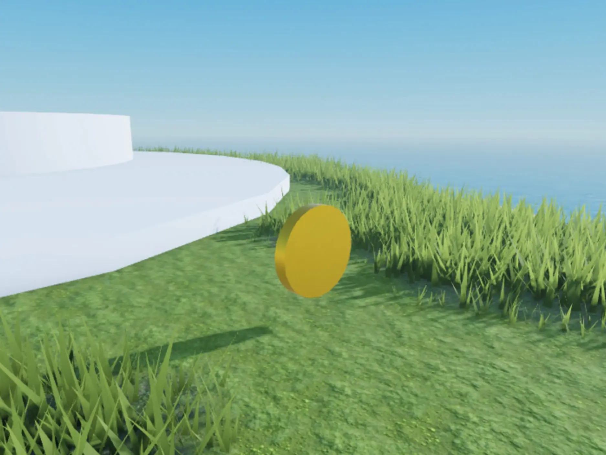
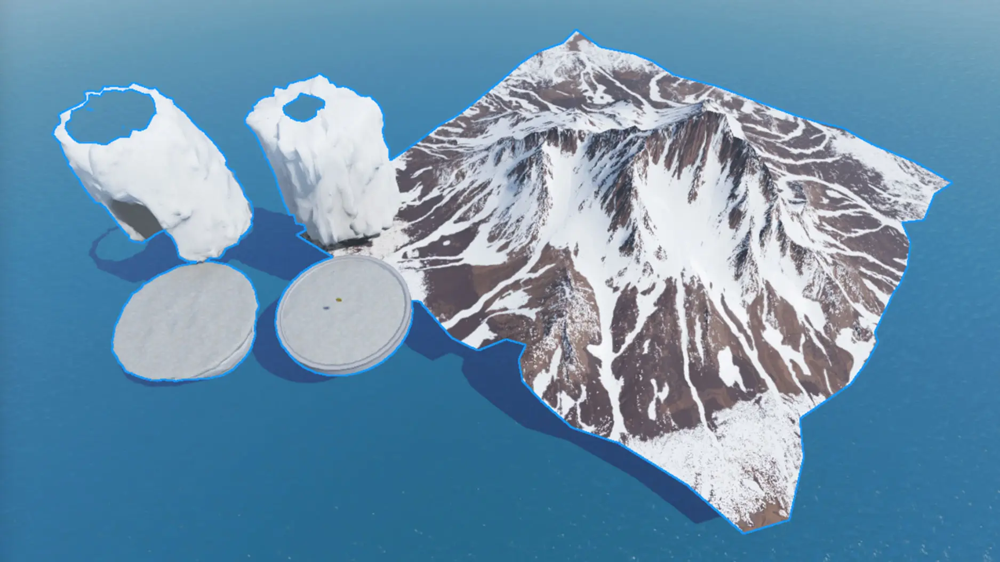
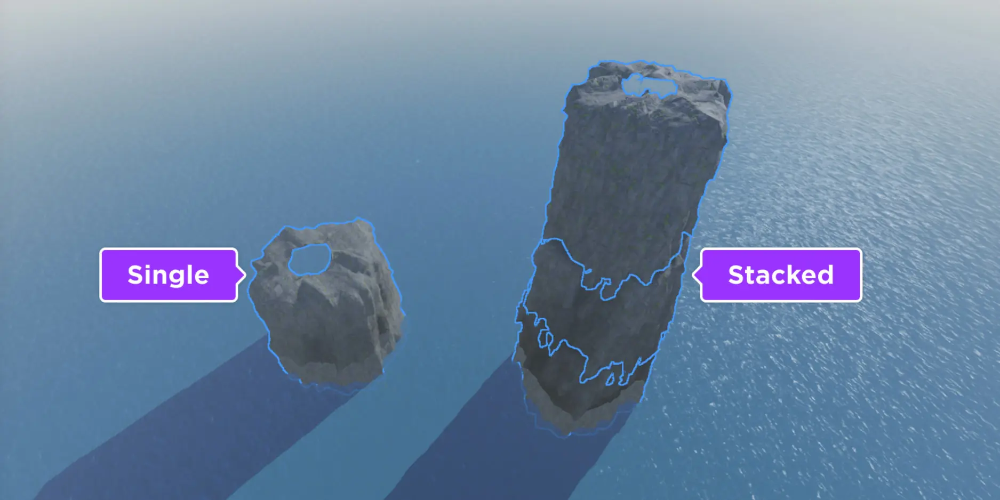
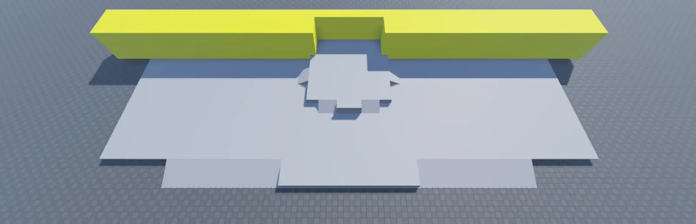
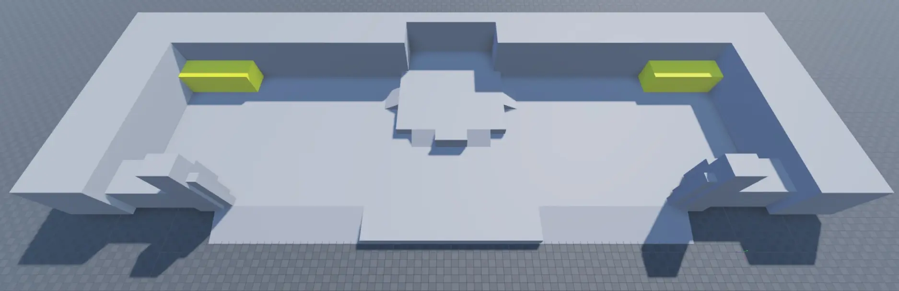

# Roblox tutorial

## 목차
- [Roblox tutorial](#roblox-tutorial)
  - [목차](#목차)
  - [Core](#core)
    - [Core Curriculum](#core-curriculum)
    - [Chapter 1 - Build a Greybox](#chapter-1---build-a-greybox)
      - [Create a Project](#create-a-project)
      - [Create an Environment with Terrain](#create-an-environment-with-terrain)
        - [섬 만들기](#섬-만들기)
        - [섬 모양 만들기](#섬-모양-만들기)
        - [물 만들기](#물-만들기)
        - [재료 적용](#재료-적용)
        - [플레이테스트](#플레이테스트)
      - [Greybox a Playable Area](#greybox-a-playable-area)
        - [플레이 가능한 영역 계획하기](#플레이-가능한-영역-계획하기)
        - [플랫폼 추가하기](#플랫폼-추가하기)
        - [조직 구조 만들기](#조직-구조-만들기)
        - [파트 삽입](#파트-삽입)
        - [파트 정렬](#파트-정렬)
        - [속이 빈 터널 만들기](#속이-빈-터널-만들기)
        - [플레이테스트](#플레이테스트-1)
    - [Chapter 2 - Script the Gameplay](#chapter-2---script-the-gameplay)
      - [Create a Coin Collection Mechanic](#create-a-coin-collection-mechanic)
        - [코인 만들기](#코인-만들기)
        - [스크립트 만들기](#스크립트-만들기)
        - [Code Explanation](#code-explanation)
          - [서비스 및 변수 초기화](#서비스-및-변수-초기화)
          - [이벤트 핸들러 정의](#이벤트-핸들러-정의)
          - [이벤트 핸들러 연결](#이벤트-핸들러-연결)
        - [메커니즘 플레이테스트](#메커니즘-플레이테스트)
      - [Record and Display Player Data](#record-and-display-player-data)
        - [코인 수집을 기록하는 모듈 스크립트 만들기](#코인-수집을-기록하는-모듈-스크립트-만들기)
        - [리더보드 구현](#리더보드-구현)
        - [모듈 스크립트 통합](#모듈-스크립트-통합)
        - [플레이테스트](#플레이테스트-2)
      - [Create Player Hazards](#create-player-hazards)
        - [기본적인 물 위험 요소 생성하기](#기본적인-물-위험-요소-생성하기)
        - [플레이어 생명 주기와 연결하기](#플레이어-생명-주기와-연결하기)
        - [플레이 테스트](#플레이-테스트)
      - [Script an Upgrade Button](#script-an-upgrade-button)
        - [업그레이드 버튼 생성하기](#업그레이드-버튼-생성하기)
        - [점프 파워 데이터 정의하기](#점프-파워-데이터-정의하기)
        - [점프 파워 데이터 업데이트하기](#점프-파워-데이터-업데이트하기)
        - [플레이어 GUI에 버튼 추가하기](#플레이어-gui에-버튼-추가하기)
      - [플레이 테스트](#플레이-테스트-1)
    - [Chapter 3 - Polish the Experience](#chapter-3---polish-the-experience)
      - [Create Basic Visual Effects](#create-basic-visual-effects)
        - [플레어 만들기](#플레어-만들기)
        - [플레어 구성하기](#플레어-구성하기)
          - [입자 이미지](#입자-이미지)
          - [기본 속성](#기본-속성)
          - [수명 및 NumberSequence 값](#수명-및-numbersequence-값)
        - [PointLight 추가하기](#pointlight-추가하기)
        - [먼지 입자 만들기](#먼지-입자-만들기)
          - [먼지 입자 구성하기](#먼지-입자-구성하기)
      - [Customize Global Lighting](#customize-global-lighting)
        - [조명 속성 설정](#조명-속성-설정)
          - [조명의 색상 조정](#조명의-색상-조정)
          - [그림자 경화](#그림자-경화)
          - [미래 조명 시스템 활성화](#미래-조명-시스템-활성화)
          - [태양 위치 변경](#태양-위치-변경)
        - [대기 속성](#대기-속성)
          - [공기 입자 밀도 증가](#공기-입자-밀도-증가)
          - [먼 물체 블렌딩](#먼-물체-블렌딩)
      - [Apply Polished Assets](#apply-polished-assets)
        - [자산 라이브러리 가져오기](#자산-라이브러리-가져오기)
        - [조직 구조 계속하기](#조직-구조-계속하기)
        - [자산 라이브러리 적용하기](#자산-라이브러리-적용하기)
          - [Platforms](#platforms)
          - [Sea Stacks](#sea-stacks)
          - [Coins](#coins)
          - [Mountains](#mountains)
        - [Playtest](#playtest)
  - [Environmental Art](#environmental-art)
    - [Chapter 1 - Greybox Your Environment](#chapter-1---greybox-your-environment)
      - [세 개의 레인 맵 레이아웃](#세-개의-레인-맵-레이아웃)
        - [스폰 존](#스폰-존)
        - [주요 레인](#주요-레인)
        - [교차 레인](#교차-레인)
      - [플레이 가능한 영역 만들기](#플레이-가능한-영역-만들기)
        - [바닥 지오메트리](#바닥-지오메트리)
        - [주변 벽 지오메트리](#주변-벽-지오메트리)
        - [스폰 존 지오메트리](#스폰-존-지오메트리)
        - [전투 포켓 지오메트리](#전투-포켓-지오메트리)
        - [외부 지오메트리](#외부-지오메트리)
      - [플레이스홀더 재료 적용](#플레이스홀더-재료-적용)
      - [레이아웃 테스트](#레이아웃-테스트)
    - [Chapter 2 - Develop Polished Assets](#chapter-2---develop-polished-assets)
      - [예술 스타일 선택](#예술-스타일-선택)
      - [텍스처 디자인](#텍스처-디자인)
        - [타일 가능한 텍스처](#타일-가능한-텍스처)
        - [트림 시트](#트림-시트)
      - [모듈형 키트 디자인](#모듈형-키트-디자인)
      - [소품 디자인](#소품-디자인)
    - [Chapter 3 - Assemble an Asset Library](#chapter-3---assemble-an-asset-library)
      - [사용자 정의 재료 만들기](#사용자-정의-재료-만들기)
      - [SurfaceAppearance 패키지 만들기](#surfaceappearance-패키지-만들기)
      - [모듈형 에셋 및 소품 가져오기](#모듈형-에셋-및-소품-가져오기)
      - [SurfaceAppearance 데이터 적용](#surfaceappearance-데이터-적용)
      - [물리 및 렌더링 매개 변수 설정](#물리-및-렌더링-매개-변수-설정)
        - [고정됨](#고정됨)
        - [충돌 가능](#충돌-가능)
        - [터치 가능](#터치-가능)
        - [쿼리 가능](#쿼리-가능)
        - [그림자 캐스팅](#그림자-캐스팅)
        - [양면 렌더링](#양면-렌더링)
        - [충돌 충실도](#충돌-충실도)
        - [렌더링 충실도](#렌더링-충실도)
      - [에셋을 패키지로 변환하기](#에셋을-패키지로-변환하기)
    - [Chapter 4 - Construct Your World](#chapter-4---construct-your-world)
      - [에셋 라이브러리 적용하기](#에셋-라이브러리-적용하기)
        - [바닥](#바닥)
        - [스폰 존](#스폰-존-1)
        - [전투 포켓](#전투-포켓)
        - [외곽 복도](#외곽-복도)
        - [문](#문)
        - [외부 에셋](#외부-에셋)
          - [타워](#타워)
          - [기둥](#기둥)
          - [화분](#화분)
        - [지붕](#지붕)
          - [천창](#천창)
          - [천장](#천장)
          - [상단 지붕](#상단-지붕)
          - [오버행](#오버행)
          - [트림](#트림)
      - [불필요한 기하학 삭제](#불필요한-기하학-삭제)
      - [지형 조각하기](#지형-조각하기)
      - [플레이 가능한 영역 포함](#플레이-가능한-영역-포함)
      - [특수 효과 구성](#특수-효과-구성)
        - [배경 구름](#배경-구름)
        - [전경 구름](#전경-구름)
        - [먼지 입자](#먼지-입자)
      - [조명 소스 구성](#조명-소스-구성)
        - [전역 조명](#전역-조명)
        - [로컬 조명](#로컬-조명)
    - [Chapter 5 - Optimize Your Experience](#chapter-5---optimize-your-experience)
      - [물리 및 렌더링 매개변수 검토](#물리-및-렌더링-매개변수-검토)
      - [비본질적 콘텐츠 제거](#비본질적-콘텐츠-제거)
        - [중복 텍스처 제거](#중복-텍스처-제거)
        - [기하학 최적화](#기하학-최적화)
        - [중첩된 투명도 삭제](#중첩된-투명도-삭제)
  - [Gameplay Scripting](#gameplay-scripting)
    - [Gameplay Scripting Curriculum](#gameplay-scripting-curriculum)
    - [Chapter 1 - Spawning and Respawning](#chapter-1---spawning-and-respawning)
      - [새로운 플레이어 추가](#새로운-플레이어-추가)
      - [포스 필드 커스터마이즈](#포스-필드-커스터마이즈)
      - [클라이언트 상태 처리](#클라이언트-상태-처리)
      - [캐릭터 리스폰](#캐릭터-리스폰)
      - [기타 설정](#기타-설정)
    - [Chapter 2 - Implementing Blasters](#chapter-2---implementing-blasters)
      - [플레이어 입력 감지](#플레이어-입력-감지)
      - [플레이어가 발사할 수 있는지 확인](#플레이어가-발사할-수-있는지-확인)
      - [발사 데이터 생성](#발사-데이터-생성)
      - [서버에 알리기](#서버에-알리기)
      - [블래스터 재설정](#블래스터-재설정)
    - [Chapter 3 - Detecting Hits](#chapter-3---detecting-hits)
      - [발사 방향 얻기](#발사-방향-얻기)
      - [광선 캐스팅](#광선-캐스팅)
      - [발사 검증](#발사-검증)
      - [플레이어 체력 감소](#플레이어-체력-감소)
  - [출처](#출처)
  - [다음](#다음)

---
## Core

여기에 Studio에서 창작하는 것에 대한 포괄적인 소개를 시작하세요! 처음부터 간단하지만 완성도 높은 경험을 만드는 데 필요한 모든 것을 다룹니다.

### Core Curriculum

핵심 커리큘럼은 기술 및 창의적 분야 전반에 걸쳐 Studio의 많은 필수 기능을 배우는 데 도움을 줍니다.

플레이어가 점프 파워를 교환하기 위해 코인을 수집하는 간단한 3D 플랫폼 게임 경험을 재창조하는 방법을 배울 수 있습니다. 플레이어는 점점 더 높은 플랫폼을 점프하여 최종적으로 가장 높은 플랫폼에 있는 신호탄에 도달합니다.

이 과정은 일반적인 코딩 개념에 익숙하지만 Roblox에 처음인 독자를 대상으로 합니다. 코딩을 배우는 데 도움이 필요하다면 Studio 작업의 기본 사항과 코딩 기본 개념을 시도해보세요.

코스 내용

 - 핵심 커리큘럼은 세 개의 챕터로 나뉘며, 각 챕터는 해당 장소 파일과 함께 제공됩니다. 각 챕터의 단계를 따라가거나 챕터의 최종 결과를 보고 싶다면 장소 파일을 검사할 수 있습니다.

 -  챕터 1 - 그레이박스 구축
    - 프로젝트 만들기 - Roblox 플랫폼에서 경험을 나타내는 .rbxl 파일을 만드는 방법을 배우세요.
    - 지형으로 환경 만들기 - Studio의 지형 도구를 사용하여 플레이어가 스폰되는 섬을 만드는 방법을 배우세요.
    - 플레이 가능 영역 그레이박스 - 솔리드 모델링 도구를 사용하여 플랫폼의 기본 형태를 계획하는 방법을 배우세요.

 - 챕터 2 - 게임플레이 스크립트 작성
   - 코인 수집 메커니즘 만들기 - 플레이어의 코인 수집을 추적하고 저장하는 방법을 배우세요.
   - 플레이어 데이터 기록 및 표시 - 개별 플레이어 데이터를 시각적으로 리더보드를 통해 저장, 검색 및 표시하는 방법을 배우세요.
   - 플레이어 위험 요소 만들기 - 플레이어 행동을 수정하고 플레이어 생명 주기를 만들어 물에서 위험 요소를 만드는 방법을 배우세요.
   - 업그레이드 버튼 스크립트 작성 - Roblox 서버와 통신하고 GUI 상호작용을 처리하여 플레이어 점프 파워를 업그레이드하는 방법을 배우세요.

 - 챕터 3 - 경험 다듬기
   - 기본 시각 효과 만들기 - 파티클 방출기를 사용하여 두 가지 다른 유형의 시각 효과를 만드는 방법을 배우세요.
   - 글로벌 조명 사용자 지정 - 글로벌 조명 설정을 사용하여 경험의 외관과 느낌을 개선하는 방법을 배우세요.
   - 정교한 자산 적용 - 간단한 부분을 복잡하고 가져온 모델로 교체하여 장면을 마무리하는 방법을 배우세요.

### Chapter 1 - Build a Greybox

#### Create a Project

Island Jump 3D 플랫폼 경험을 재현하기 위해서는 Roblox Studio 내에서 프로젝트를 만들어야 합니다. 프로젝트는 장소, 자산, 설정 및 기타 리소스의 모음으로, 함께 경험을 나타냅니다. 프로젝트는 처음부터 시작할 수도 있고, Studio의 템플릿 중 하나를 사용하여 환경과 게임 메커니즘의 기초를 제공할 수도 있습니다. 예를 들면 다음과 같습니다:

Baseplate 템플릿 — Baseplate와 SpawnLocation 객체를 포함합니다.
Modern City 템플릿 — 고품질의 도시 샘플과 모듈식 자산 키트를 포함합니다.
Mansion of Wonder 템플릿 — 1인칭 슈터 경험을 위한 자산과 스크립트를 포함합니다.

Baseplate 템플릿으로 프로젝트를 만들려면:

1. Roblox Studio를 엽니다.
2. 세로 탐색 바에서 새 탭을 선택합니다. 모든 템플릿이 표시됩니다.
3. Baseplate 템플릿을 선택합니다. Studio가 새로운 경험을 엽니다.<br>
4. Explorer 창에서 Baseplate 객체를 마우스 오른쪽 버튼으로 클릭합니다. 컨텍스트 메뉴가 표시됩니다.
5. 삭제를 선택합니다. 뷰포트에는 중앙에 스폰 위치가 있는 빈 세계가 표시됩니다.<br>

다음 튜토리얼 섹션에서는 스폰 위치 주변에 섬 환경을 만들기 위해 지형 편집기를 사용하는 방법을 배우게 됩니다.

#### Create an Environment with Terrain

지형을 사용하여 환경을 만드는 것은 3D 공간 내에서 실제 자연 재료처럼 보이고 작동하는 유기적 재료를 생성하고 사용자 정의할 수 있게 해줍니다. Terrain Editor 내의 도구를 사용하여 이 튜토리얼 섹션에서는 플레이어가 스폰하고 경험의 첫 번째 몇 개의 플랫폼으로 이동할 수 있는 작은 섬을 위해 지형을 생성하고 조각하는 방법을 가르칩니다.

시작하기 전에 지형을 조각하는 것은 예술 형식이며, 브러쉬 스트로크와 미세한 재료 편집을 정확하게 재현하는 것은 어렵다는 점을 유념하십시오. 지형이 여러분의 경험 요구에 부합하는 한, 여러분의 환경이 샘플 Island Jump 경험과 다르게 보이고 느껴지는 것은 정상이며 예상되는 일입니다.

##### 섬 만들기

환경을 만드는 첫 번째 단계는 플레이어가 경험을 시작할 때와 플랫폼에서 떨어져 건강이 0이 되었을 때 스폰될 작은 섬을 만드는 것입니다. Terrain Editor의 Draw 도구를 사용하여 뷰포트 내 어디에서나 클릭하고 드래그하여 섬을 시작할 큰 구체를 생성할 수 있으며, 나중에 넓은 표면적을 위해 모양을 만들고 평평하게 할 수 있습니다.

섬을 만들려면:

1. 메뉴 바에서 홈 탭으로 이동한 다음 Terrain Editor 버튼을 클릭합니다. Terrain Editor 창이 표시됩니다.<br>
2. Terrain Editor 창에서 Edit 탭을 클릭한 다음 Draw 버튼을 클릭합니다.<br>
3. 브러쉬 설정 및 재료 설정 섹션에서 다음을 제외한 모든 기본 설정을 유지합니다:<br>
    - 기본 크기를 32로 설정합니다.
    - 재료를 모래로 설정합니다.
4. 뷰포트에서 스폰 위치 근처를 클릭합니다. 모래 재료의 구체가 표시됩니다.

<video src="../img/05_Roblox_tutorial/Terrain-Adding-First-Sphere.mp4" width="320" height="240" controls></video>

구체가 보이지 않으면 카메라를 줌 아웃하여 스폰 위치가 작아질 때까지 시도하십시오.

##### 섬 모양 만들기

현재 모양의 섬을 유지하면 플레이어가 섬에서 떨어지지 않고 탐색하기 어려울 것입니다. Terrain Editor의 Flatten 도구를 사용하여 고정 평면에서 지형을 균일하게 평평하게 만들고 플레이어가 경험을 시작할 때 상대적으로 평평한 표면을 제공할 수 있습니다. 이 모양이 처음에는 자연스럽지 않아 보이지만, Terrain Editor의 Sculpt 도구를 사용하여 섬의 가장자리를 다듬어 보다 유기적이고 현실적으로 보이게 할 수 있습니다.

섬 모양을 만들려면:

1. Terrain Editor 창에서 Flatten 버튼을 클릭합니다.<br>
2. 브러쉬 설정 섹션에서 다음을 제외한 모든 기본 설정을 유지합니다:<br>
    - 기본 크기를 18로 설정합니다.
    - 고정 평면을 활성화합니다. 새로운 설정이 표시됩니다.
    - 평면 위치를 0으로 설정합니다.
3. 뷰포트에서 마우스를 클릭하고 드래그하여 구체의 상단이 완전히 평평해질 때까지 이동합니다.
<video src="../img/05_Roblox_tutorial/Terrain-Flattening-Sphere.mp4" width="320" height="240" controls></video>

4. 다시 Terrain Editor 창으로 이동하여 Sculpt 버튼을 클릭합니다.<br>
5. 브러쉬 설정 및 재료 설정 섹션에서 재료를 모래로 설정하고 다른 모든 기본 설정을 유지합니다.<br>
6. 뷰포트에서 마우스를 클릭하고 드래그하여 섬의 가장자리와 물 아래 라인을 따라 이동하여 섬이 보다 자연스럽게 보이도록 합니다.

<video src="../img/05_Roblox_tutorial/Terrain-Sculpting-Edges.mp4" width="320" height="240" controls></video>

Draw 도구는 브러쉬 위치에 따라 재료를 추가하거나 빼지만, Sculpt 도구는 기존 지형을 성장시키거나 침식시키기만 합니다.

##### 물 만들기

큰 수역을 생성하는 방법은 여러 가지가 있지만, 다음 지침에서는 Terrain Editor의 Fill 도구를 사용합니다. 이 방법을 사용하면 특정 영역의 모든 재료를 다른 재료(공기 포함)로 교체할 수 있습니다.

섬 주변에 물을 만들려면:

1. Terrain Editor 창에서 Fill 버튼을 클릭합니다.<br>
2. 선택 설정 섹션에서,
    1. 위치를 0, -15, 0으로 설정하여 섬 상단 아래에 물이 채워지도록 합니다.
    2. 크기를 1800, 5, 1800으로 설정하여 경험의 지평선까지 물이 채워지도록 합니다.
3. 재료 설정 섹션에서 도구를 다음 설정으로 구성합니다:<br>
    - 재료 모드를 대체로 설정합니다.
    - 원본 재료를 공기로 설정합니다.
    - 대상 재료를 물로 설정합니다.
4. 적용 버튼을 클릭합니다. 섬 주변에 물이 생성됩니다.
<video src="../img/05_Roblox_tutorial/Terrain-Filling-Water.mp4" width="320" height="240" controls></video>

##### 재료 적용

이제 섬의 기초가 마련되었으므로 다양한 재료로 외관을 사용자 정의할 수 있습니다. Terrain Editor의 Paint 도구를 사용하여 클릭하고 드래그하여 섬 표면의 중간 부분에 풀과 풀잎을 적용할 수 있습니다.

섬에 재료를 적용하려면:
1. Terrain Editor에서 Paint 버튼을 클릭합니다.<br>
2. 브러쉬 설정 및 재료 설정 섹션에서 다음을 제외한 모든 기본 설정을 유지합니다:
    <br>
    - 재료 모드를 페인트로 설정합니다.
    - 재료를 잎이 많은 풀로 설정합니다.
3. 뷰포트에서 섬의 중간을 클릭하고 드래그하여 잎이 많은 풀 재료를 적용합니다.
<video src="../img/05_Roblox_tutorial/Terrain-Painting-Grass.mp4" width="320" height="240" controls></video>

4. 다시 Terrain Editor 창으로 이동하여 브러쉬 설정 및 재료 설정 섹션에서
    - 기본 크기를 3으로 설정합니다.
    - 재료를 풀로 설정합니다.
5. 뷰포트에서 섬 가장자리를 따라 드래그하여 풀잎을 적용하고, 섬의 중간에 스폰 위치와 초기 플랫폼을 위한 공간을 남깁니다.
6. Explorer 창에서 SpawnLocation 객체를 선택합니다.
7. 홈 탭에서 이동 도구를 선택합니다.
8. 뷰포트에서 스폰 위치를 섬 가장자리 쪽으로 이동하여 첫 번째 플랫폼을 위한 공간을 만듭니다. 샘플 Island Jump - Building .rbxl 파일은 위치를 -127, -3, 9로 사용합니다.

<video src="../img/05_Roblox_tutorial/create-an-environment-with-terrain-spawn.mp4" width="320" height="240" controls></video>

재료 오버라이드를 사용하여 사용자 정의 텍스처 자산을 제공하여 기본 지형 텍스처를 대체하는 완전히 사용자 정의된 재료 외관을 만들 수 있습니다.

##### 플레이테스트

섬의 외관에 만족하면 플레이테스트를 통해 섬의 규모와 3D 세계에서의 느낌을 확인할 수 있습니다.

경험을 플레이테스트하려면:
1. 메뉴 바에서 재생 버튼을 클릭합니다. Studio가 플레이테스트 모드로 전환됩니다.<br>
2. 섬을 걸어 다니며 플레이 중에 어떻게 보이는지 확인합니다. 완료되면 메뉴 바로 돌아가서 정지 버튼을 클릭합니다. Studio가 플레이테스트 모드를 종료합니다.<br>

스폰 시 캐릭터가 예상과 다른 방향을 향하고 있다면, 예를 들어 섬의 중앙이 아닌 바다를 향하고 있다면 SpawnLocation 객체를 회전시키고 다시 플레이테스트하여 캐릭터가 적절한 방향으로 스폰될 때까지 과정을 반복합니다.

<video src="../img/05_Roblox_tutorial/create-an-environment-with-terrain-walking.mp4" width="320" height="240" controls></video>

다음 튜토리얼 섹션에서는 플레이어가 가장 높은 플랫폼에 도달할 수 있는 플레이 가능한 영역을 만드는 방법을 배웁니다.

#### Greybox a Playable Area

환경의 그레이박싱(Greyboxing), 또는 환경을 대략적으로 배치하는 과정은 스크립팅이나 복잡한 자산을 만들기 전에 사용자가 게임플레이를 어떻게 경험할지 알아보기 위해 3D 공간에 간단한 모양을 추가하는 과정입니다. 이 과정은 레이아웃의 문제를 찾는 데 많은 시간을 절약할 수 있으며, Studio에 고품질 메시를 가져오는 것보다 기본 부품을 조정하는 것이 훨씬 쉽습니다.

기본 부품과 고체 모델링 작업을 사용하여 이 튜토리얼 섹션에서는 경험의 플레이 가능한 영역을 구성하는 해상 암초 플랫폼을 그레이박싱하는 방법을 가르칩니다. 환경을 완료한 후에는 Luau 스크립트를 사용하여 경험의 게임플레이를 만드는 방법을 배우게 됩니다.

##### 플레이 가능한 영역 계획하기

경험의 최종 버전에서는 플레이어가 섬과 해상 암초 플랫폼에서 동전을 모아 점프력을 업그레이드하고 더 높은 플랫폼에 도달해야 합니다. 다음 튜토리얼 섹션에서는 이 동작을 추가하도록 스크립트를 구성하겠지만, 환경을 그레이박싱할 때 플랫폼 간의 높이 차이를 계획하는 것이 중요합니다. 예를 들어, 각 높이 수준마다 플랫폼 간의 높이 차이가 점차 증가하여 플레이어가 동전을 모아 레벨을 진행하도록 유도해야 합니다.

가이드로서, 샘플 Island Jump - Building .rbxl 파일에는 7개의 다른 높이 수준이 포함되어 있으며, 첫 번째 수준은 섬에 잠기도록 하여 몇 개의 스터드 높이만 노출됩니다. 이는 플레이어가 경험 초기에 몇 개의 동전만 모으면 다음 플랫폼으로 진행할 수 있도록 합니다. 각 수준 간의 후속 높이 차이는 8, 20, 35, 55, 81 및 110 스터드로 증가하여 플레이어가 경험을 진행하면서 성취감을 느낄 수 있습니다.

스터드는 Studio의 주요 길이 단위이며, 28cm에 해당합니다.


샘플 Island Jump 경험의 그레이박스 지오메트리의 먼 뷰. 각 해상 암초 간의 높이 차이가 강조 표시되어 있습니다.

샘플의 단순한 디자인을 넘어 세계를 확장하려면, 점프 업그레이드를 필요로 하는 각 새로운 높이 수준이 이전 수준보다 적어도 30 스터드 이상 높아지도록 해야 합니다.

##### 플랫폼 추가하기

이제 플랫폼 간의 높이 차이에 대한 계획이 마련되었으므로, 해상 암초 플랫폼을 나타내는 자리 표시자 `Part` 객체를 추가할 차례입니다. Part는 모양, 크기, 색상 등의 물리적 외관을 사용자 정의할 수 있는 Roblox의 기본 빌딩 블록입니다.

해상 암초 플랫폼을 나타내기 위해 거의 모든 파트 모양을 사용할 수 있지만, 플랫폼 간 점프를 플레이테스트할 때 착지할 수 있는 평평한 표면을 제공하고 튜토리얼의 최종 섹션에서 사용할 해상 암초 메시와 유사하기 때문에 실린더 파트로 환경을 그레이박싱하는 것이 좋습니다.

샘플 Island Jump 경험의 그레이박스와 최종 지오메트리 비교


샘플 Island Jump 경험의 그레이박스 지오메트리.


샘플 Island Jump 경험의 최종 지오메트리.

##### 조직 구조 만들기
3D 공간에 자리 표시자 파트를 삽입하기 전에, Workspace의 자산에 대한 조직 구조를 만드는 것이 중요합니다. 이 과정은 특히 관리해야 할 자산이 많은 경험을 만드는 과정에서 Workspace가 조직되고 쉽게 스캔되도록 보장합니다.

자산을 함께 그룹화할 수 있는 컨테이너 유형에는 Folder와 Model 객체 두 가지가 있습니다. 폴더는 다양한 유형의 많은 객체를 저장하는 데 유용하고, 모델은 파트의 기하학적 그룹을 저장하는 데 유용합니다. 다음 지침에서는 3D 세계의 모든 자산을 저장하는 데 두 가지 컨테이너 객체를 사용하는 방법을 가르칩니다.

조직 구조를 만들려면:
1. Explorer 창에서 Workspace 위로 마우스를 올리고 ⊕ 아이콘을 클릭합니다. 컨텍스트 메뉴가 표시됩니다.
2. 컨텍스트 메뉴에서 Folder 객체를 삽입합니다. 3D 세계의 모든 자산을 포함할 폴더 객체가 표시됩니다.
<br>
<br>Explorer 창에서 Workspace의 플러스 아이콘과 폴더 객체가 강조 표시된 모습.

3. 새 폴더 이름을 World로 변경합니다.
    1. 폴더 객체를 마우스 오른쪽 버튼으로 클릭합니다. 컨텍스트 메뉴가 표시됩니다.
    2. 컨텍스트 메뉴에서 이름 변경을 클릭하고 폴더의 이름을 World로 입력합니다.
    이름이 올바르게 철자가 맞고 대소문자가 올바른지 확인합니다. Roblox에서 작성한 스크립트는 대소문자를 구분하며, 나중에 이 폴더에 접근하기 위해 하나의 스크립트를 작성할 것입니다.
4. World 폴더 위로 마우스를 올리고 ⊕ 아이콘을 클릭합니다.
5. 컨텍스트 메뉴에서 Model을 삽입합니다.<br><br>Explorer 창에서 World 폴더의 플러스 아이콘과 Model 객체가 강조 표시된 모습.
6. 모델 이름을 Blockout_Parts로 변경합니다.<br><br>Explorer 창에서 World 폴더 아래에 있는 새 Blockout_Parts 모델이 강조 표시된 모습.

##### 파트 삽입

```
다음 지침에서는 두 가지 다른 교육 경로를 제공합니다. 고유한 환경에 파트를 삽입하거나 샘플 Island Jump - Building 내의 그레이박스 환경을 정확하게 재현할 수 있습니다.
```

이제 자산을 포함할 조직 구조가 마련되었으므로, 3D 공간에 해상 암초 플랫폼을 나타내는 파트를 삽입할 수 있습니다.

첫 번째 플랫폼을 위한 실린더 파트를 삽입하려면:
1. 메뉴 바에서 홈 탭을 선택합니다.
2. 삽입 섹션에서 파트 드롭다운 화살표를 클릭한 다음 실린더를 선택합니다. 실린더 파트가 뷰포트에 표시됩니다.<br>
3. Explorer 창에서 새 Part를 클릭하고 Blockout_Parts 모델로 드래그합니다. 파트가 모델의 자식이 됩니다.<br><br>Explorer 창에서 Blockout_Parts 모델 객체 아래에 새 Part가 강조 표시된 모습.
4. 다시 홈 탭으로 이동하여 이동, 크기 조정 및 회전 도구를 사용하여 실린더를 섬의 중앙에 큰 평평한 표면이 되도록 위치, 크기 조정 및 회전합니다. 이 도구에 대한 자세한 내용은 파트 조작을 참조하십시오.<br><br><br><br>
5. 같은 과정을 사용하여 높이가 증가하는 적어도 7개의 해상 암초 플랫폼을 Blockout_Parts 모델에 추가하고 구성합니다.<br>
6. Explorer 창에서 Block_Out 모델을 선택합니다.
7. 홈 탭에서 편집 섹션으로 이동하여 앵커 아이콘을 클릭합니다. 이는 경험이 시작될 때 물리 시스템이 파트를 이동시키지 않도록 보장합니다.<br>

##### 파트 정렬
해상 암초 플랫폼을 삽입할 때 샘플 Island Jump - Building 경험 값을 사용한 경우 이 단계를 건너뛸 수 있습니다.

섬 외부에 더 많은 해상 암초 자리 표시자 파트를 추가할 때, 이러한 파트의 높이 차이를 서로 다른 위치 대신 다양한 크기를 사용하여 관리하는 것이 더 쉽습니다. 이를 통해 각 플랫폼의 기반을 정렬하여 모든 수직 크기 차이가 다른 높이로 반영되도록 하고, 같은 크기의 파트는 동일한 수준에 있도록 할 수 있습니다.

`Align Tool`은 특정 축에 따라 최소, 중앙 또는 최대 가장자리에 파트를 정렬합니다. 이 경험의 목적을 위해 Y 축에서 아래 가장자리를 정렬하여 모든 파트가 물에 부분적으로 잠기도록 해야 합니다.

파트를 정렬하려면:
1. Explorer 창에서 모든 플랫폼을 선택합니다.
2. 메뉴 바에서 모델 탭으로 이동한 다음 Align Tool을 클릭합니다. Align Tool 창이 표시됩니다.<br>
3. Align Tool 창에서,
    1. 모드를 Min으로 설정합니다.
    2. 정렬 대상을 World, Y로 설정합니다.
    3. Relative To를 Selection Bounds로 유지합니다.
4. Align 버튼을 클릭합니다. 모든 파트가 가장 낮은 Y Part.Position 값을 가진 파트에 따라 Y 축에서 정렬됩니다.

모든 플랫폼이 아래 가장자리를 정렬합니다.

##### 속이 빈 터널 만들기

플레이 가능한 영역을 차단하는 데 파트를 그대로 사용하는 것 외에도 고체 모델링 작업을 적용하여 파트를 독특한 방식으로 결합하여 속이 빈 터널과 같은 더 복잡한 모양을 만들 수 있습니다. 이 기술은 플레이어가 환경과 상호 작용하는 방식에 시각적 흥미와 변화를 제공합니다.

고체 모델링 도구에는 네 가지가 있습니다:

 - Union – 두 개 이상의 파트를 결합하여 하나의 고체 유니언을 만듭니다.
 - Intersect – 겹치는 파트를 하나의 고체 교차로 교차합니다.
 - Negate – 파트를 제거하여 구멍과 함몰부를 만드는 데 유용합니다.
 - Separate – 유니언이나 교차를 개별 파트로 다시 분리합니다.

속이 빈 터널을 만드는 목적을 위해 Union과 Negate 도구만 사용하면 됩니다. 모든 도구에 대한 전체 분석은 고체 모델링을 참조하십시오.


모델 탭에서 고체 모델링 도구가 강조 표시된 모습.

속이 빈 터널을 만들려면:
1. 해상 암초 플랫폼 위에 실린더 파트를 삽입하고 위치를 지정합니다. 샘플 Island Jump - Building 경험은 다음 값으로 Level_4b 플랫폼 위에 이 파트를 위치시킵니다:<br>
    | 이름 |	크기 |	CFrame.Position |	CFrame.Orientation |
    |---|---|---|---|
    |Tunnel |	24, 65, 69	| 137, 77, 69	| 0, 0, 90 |
2. 실린더 파트 안에 속이 빈 부분을 나타내는 블록 파트를 삽입하고 위치를 지정하여 플레이어가 통과할 수 있을 정도로 높고 적절한 너비를 가집니다. 샘플 Island Jump - Building 경험은 다음 값으로 이전 실린더 안에 이 파트를 위치시킵니다:<br>
    | 이름 |	크기 |	CFrame.Position |	CFrame.Orientation |
    |---|---|---|---|
    |Hollow_Part |	24.5, 72, 22	| 134.5, 77, 71	| 0, 135, 90 |
    <br>
3. Explorer 창에서 블록 파트를 선택합니다.
4. 모델 탭에서 고체 모델링 섹션으로 이동한 다음 Negate 버튼을 클릭합니다. 파트가 반투명해집니다.<br>
5. Explorer 창에서 반투명 파트와 실린더 터널 파트를 모두 선택합니다.
6. 모델 탭에서 고체 모델링 섹션으로 돌아가서 Union 버튼을 클릭합니다. 반투명 파트가 겹치는 터널 실린더에서 잘립니다.<br>
7. 새 유니언의 이름을 높이 수준과 위치를 반영하도록 Level_4b_Union과 같이 변경합니다.
8. 새 유니언 아래에 해상 암초 플랫폼을 복제하고 터널 위에 위치시킵니다. 샘플 Island Jump - Building 경험은 다음 값으로 유니언 위에 복제된 Level_4b 플랫폼을 위치시킵니다:<br>
    | 이름 |	크기 |	CFrame.Position |	CFrame.Orientation |
    |---|---|---|---|
    |Level_4b_Top |	74, 65, 69	| 137, 126, 69	| 0, 0, 90 |
    <br>

##### 플레이테스트

플레이 가능한 영역을 그레이박싱한 후에는 환경의 레이아웃을 플레이테스트하여 경험이 재미있고 기능적이며, 개발 과정이 진행됨에 따라 작은 문제가 더 큰 프로젝트로 변하기 전에 잡을 수 있도록 해야 합니다. 예를 들어, 경험의 게임플레이는 플레이어가 수집한 동전 수에 따라 점프력을 점진적으로 업그레이드해야 하므로, 플레이어가 다양한 플랫폼 높이 수준에서 기대하는 Humanoid.JumpPower에 따라 플랫폼 간 점프할 수 있는지 확인하는 것이 중요합니다.

다음 단계별 지침은 다양한 Humanoid.JumpPower 값으로 경험을 플레이테스트하는 방법을 가르칩니다. 플레이테스트를 할 때 다음 질문을 스스로에게 던져 보세요:

 - 플레이어가 각 플랫폼으로 성공적으로 점프할 수 있나요?
 - 플랫폼 간의 높이 차이가 점차 증가하여 플레이어가 진행하도록 유도하나요?
 - 레이아웃이나 게임플레이에서 무엇을 즐기고 있거나 좌절하고 있나요?

경험을 플레이테스트하려면:
1. 메뉴 바에서 재생 버튼을 클릭합니다. Studio가 플레이테스트 모드로 전환됩니다.<br>
2. Explorer 창에서 Roblox 사용자 이름을 표시하는 캐릭터 모델 옆의 화살표를 선택합니다. 모든 캐릭터 모델의 자식 객체가 표시됩니다.
3. Humanoid를 선택합니다.<br>
4. 속성 창에서 점프 설정 섹션으로 이동한 다음 UseJumpPower를 활성화합니다 JumpPower 속성이 기본값 50으로 표시됩니다.
5. JumpPower를 0으로 설정합니다. 이는 캐릭터가 점프할 수 없도록 하여 게임플레이를 스크립트한 후 플레이어의 시작 상태와 동일하게 만듭니다.<br><br>속성 창이 보이지 않으면 보기 탭을 열고 표시 섹션에서 속성이 선택되어 있는지 확인하십시오.
6. 새 수준에 도달하면 JumpPower를 30의 배수로 설정하여 점프 업그레이드를 시뮬레이션합니다.

<video src="../img/05_Roblox_tutorial/playable-area-walk.mp4" width="320" height="240" controls></video>

튜토리얼의 다음 섹션에서는 경험의 전체 게임플레이를 스크립트하는 방법을 배우게 됩니다.

### Chapter 2 - Script the Gameplay
#### Create a Coin Collection Mechanic

이제 3D 세계가 마련되었으므로, 이 튜토리얼 섹션에서는 코인 수집 메커니즘을 정의하는 첫 번째 스크립트를 추가하는 방법을 가르칩니다. 이 메커니즘은 플레이어가 코인을 수집할 수 있게 하며, 최근에 수집된 코인의 수집을 비활성화합니다.

##### 코인 만들기

스크립트를 작성하기 전에, 코인으로 사용할 자리 표시자 객체를 세계에 추가해야 합니다. 이전 섹션에서 만든 해상 암초 플랫폼처럼, 코인도 간단한 Part 객체일 수 있습니다.

코인을 만들려면:
1. Explorer 창에서 World 폴더에 새 폴더를 추가한 다음 이름을 Coins로 변경합니다.
2. Coins 폴더에 실린더 파트를 삽입한 다음 파트 이름을 Coin으로 변경합니다.<br>
3. 파트를 선택한 다음 속성 창에서,
    - BrickColor를 Gold로 설정합니다.
    - 재료를 Metal로 설정합니다.
    - 크기를 0.6, 8, 4로 설정합니다.
    - CanCollide를 비활성화합니다. 이는 다른 파트가 코인을 통과할 수 있음을 엔진에 알리며, 플레이어가 코인을 수집하기 위해 코인을 통과할 수 있음을 의미합니다.
    - Anchored를 활성화합니다. 이는 물리 관련 시뮬레이션으로 인해 코인의 위치가 변경되지 않도록 엔진에 알리며, 플레이어가 코인에 닿아도 위치에 영향을 미치지 않음을 의미합니다.
    <br>
4. 몇 개의 코인을 복제하여 테스트 목적으로 지도 주변에 배치합니다.<br>


이제 실린더 파트가 코인처럼 보이고 물리 시뮬레이션을 방지하지만, 플레이어가 코인을 수집할 수 있도록 논리를 추가해야 합니다.

##### 스크립트 만들기

코인을 수집 가능하게 하려면 플레이어가 코인에 닿을 때 반응해야 합니다. Roblox 엔진은 코인에 무언가가 닿을 때 알려줄 수 있지만, 이를 스크립트에서 선언해야 합니다. 

스크립트를 만들려면:
1. Explorer 창에서 ServerScriptService 위로 마우스를 올리고 ⊕ 버튼을 클릭합니다. 컨텍스트 메뉴가 표시됩니다.
2. 컨텍스트 메뉴에서 스크립트를 선택합니다. ServerScriptService 아래에 새 스크립트가 표시되며, 이는 엔진에 스크립트를 서버에서 실행하고 클라이언트가 코드에 액세스하지 못하도록 합니다.<br>
3. 스크립트 이름을 CoinService로 변경합니다.<br>
4. 기본 코드를 다음 코드로 바꿉니다:<br>
    ```lua
    -- 서비스 및 변수 초기화
    local Workspace = game:GetService("Workspace")
    local Players = game:GetService("Players")

    local coinsFolder = Workspace.World.Coins
    local coins = coinsFolder:GetChildren()

    local COOLDOWN = 10

    -- 이벤트 핸들러 정의
    local function onCoinTouched(otherPart, coin)
        if coin:GetAttribute("Enabled") then
            local character = otherPart.Parent
            local player = Players:GetPlayerFromCharacter(character)
            if player then
                -- 플레이어가 코인에 닿음
                coin.Transparency = 1
                coin:SetAttribute("Enabled", false)
                print("Player collected coin")
                task.wait(COOLDOWN)
                coin.Transparency = 0
                coin:SetAttribute("Enabled", true)
            end
        end
    end

    -- 이벤트 리스너 설정
    for _, coin in coins do
        coin:SetAttribute("Enabled", true)
        coin.Touched:Connect(function(otherPart)
            onCoinTouched(otherPart, coin)
        end)
    end
    ```

이제 플레이어가 코인에 닿을 때마다 코인이 10초 동안 사라지고, 출력 로그에 "Player collected coin"이 표시됩니다.

##### Code Explanation

다음 섹션에서는 스크립트가 작동하는 방식을 자세히 설명합니다.

###### 서비스 및 변수 초기화

다른 언어에서 작성한 많은 코드와 마찬가지로, 나중에 필요할 변수를 스크립트 상단에 정의합니다. 우리의 코드는 다음을 수행합니다:
 - 서비스 인스턴스 가져오기 - Roblox 서비스는 일반 기능에 대한 내장 기능을 제공합니다. 스크립트는 먼저 3D 세계의 모든 객체를 포함하는 Workspace 서비스와 경험에 연결된 모든 플레이어를 관리하고 포함하는 Player 서비스를 가져옵니다.
 - 모든 코인 참조 가져오기 - 스크립트는 GetChildren() 메서드를 사용하여 3D 워크스페이스에서 코인 객체에 대한 모든 참조를 쿼리합니다. 이 메서드는 이 경우 생성한 Workspace.World.Coins 폴더에 연결된 모든 것을 포함하는 배열을 반환합니다.
 - 전역 변수 정의 - COOLDOWN 변수는 코인이 수집된 후 비활성화되는 시간을 정의하는 데 사용됩니다.

서비스 및 변수 초기화
```lua
local Workspace = game:GetService("Workspace")
local Players = game:GetService("Players")

local coinsFolder = Workspace.World.Coins
local coins = coinsFolder:GetChildren()

local COOLDOWN = 10
```

###### 이벤트 핸들러 정의

Roblox 엔진은 3D 세계를 물리적으로 시뮬레이션하고 렌더링, 물리 및 네트워킹과 관련된 이벤트를 처리하는 논리의 많은 부분을 처리합니다. 이러한 이벤트 중 일부에서 사용자 정의 논리를 스크립팅하려는 경우, 이벤트를 청취하고 처리할 수 있으며, 엔진이 나머지를 처리하게 할 수 있습니다. 이 경우, 코인이 닿는 것과 관련된 이벤트를 청취하고 처리합니다. 스크립트는 onCoinTouched() 메서드에서 이 이벤트를 처리하는 논리를 정의하며, 다음을 수행합니다:
 - 코인이 활성화되었는지 감지 - 모든 Instance에는 객체가 3D 세계에 존재하는지 여부를 정의하는 Enabled 부울 속성이 있습니다. GetAttribute() 메서드를 사용하여 인스턴스 속성을 가져올 수 있습니다.
 - 플레이어가 코인에 닿았는지 감지 - 코인이 활성화된 경우, 메서드는 플레이어 서비스로 코인에 닿은 객체가 실제로 플레이어인지 확인합니다. 터치 이벤트가 발생하면 Roblox 엔진은 코인에 닿은 객체를 otherPart 매개변수로 전달합니다. 스크립트는 otherPart의 부모가 플레이어에 속하는지 확인합니다.
 - 플레이어가 코인에 닿았을 때 코인을 비활성화하고 10초 후에 다시 활성화 - 마지막으로, 플레이어가 코인에 닿았을 경우, 메서드는 코인을 비활성화하고 10초 동안 기다렸다가 코인을 다시 수집할 수 있도록 활성화합니다. task.wait()은 wait() 대신 사용되며, 코드 실행을 완전히 중지하지 않고 다른 스레드의 작업을 동시에 실행할 수 있도록 하여 성능을 향상시킵니다.

이벤트 핸들러 정의
```lua
local function onCoinTouched(otherPart, coin)
   if coin:GetAttribute("Enabled") then
      local character = otherPart.Parent
      local player = Players:GetPlayerFromCharacter(character)
      if player then
         -- 플레이어가 코인에 닿음
         coin.Transparency = 1
         coin:SetAttribute("Enabled", false)
         print("Player collected coin")
         task.wait(COOLDOWN)
         coin.Transparency = 0
         coin:SetAttribute("Enabled", true)
      end
   end
end
```

###### 이벤트 핸들러 연결

모든 시뮬레이션된 3D 객체는 BasePart를 상속받아 Touched() 이벤트를 가집니다. 다음 루프는 일반 반복을 사용하여 각 코인을 반복하고 코인이 기본적으로 활성화되도록 하여 코인이 3D 세계에서 보이도록 하고, onCoinTouched() 핸들러 메서드를 코인의 Touched 이벤트에 연결하여 이벤트가 발생할 때마다 실행되도록 합니다. 엔진이 터치를 감지하면, 다른 객체를 otherPart 매개변수로 전달합니다.

이벤트 핸들러 연결
```lua
for _, coin in coins do
   coin:SetAttribute("Enabled", true)
   coin.Touched:Connect(function(otherPart)
      onCoinTouched(otherPart, coin)
   end)
end
```

##### 메커니즘 플레이테스트
코인 수집 메커니즘이 의도한 대로 작동하는지 확인할 시간입니다. 경험을 플레이테스트하려면:
1. 메뉴 바에서 재생 버튼을 클릭합니다. Studio가 플레이테스트 모드로 전환됩니다.<br>
2. 캐릭터를 이동하여 코인에 닿게 합니다. 스크립트가 제대로 작동하면 출력 창에 "Player collected coin"이 표시되고, 코인이 10초 동안 사라졌다가 다시 나타납니다.<br>

출력 창이 보이지 않으면 보기 탭으로 이동한 다음 출력이 선택되어 있는지 확인하십시오.

<video src="../img/05_Roblox_tutorial/script-game-behavior-coin-collection.mp4" width="320" height="240" controls></video>

#### Record and Display Player Data

이제 플레이어가 코인을 수집했을 때 이를 감지할 수 있으므로, 이 튜토리얼 섹션에서는 플레이어가 수집한 코인의 수를 세고, 그 수를 리더보드에 표시하는 방법을 배웁니다.

##### 코인 수집을 기록하는 모듈 스크립트 만들기

각 플레이어의 코인 수집 데이터를 저장하고 관리하려면, 모든 플레이어의 코인 수집 데이터에 접근하는 데이터 구조와 함수를 포함한 `ModuleScript` 객체를 만들어야 합니다. 모듈 스크립트는 다른 스크립트에서 요구할 수 있는 재사용 가능한 코드입니다. 이 경우, `CoinService`는 플레이어가 코인을 터치할 때 코인 수집 데이터를 업데이트할 수 있도록 이 모듈 스크립트를 요구합니다.

모듈 스크립트를 만들려면:
1. Explorer 창에서 ServerStorage 위로 마우스를 올리고 ⊕ 버튼을 클릭합니다. 컨텍스트 메뉴가 표시됩니다.
2. 컨텍스트 메뉴에서 ModuleScript를 선택합니다. ServerStorage 아래에 새 모듈 스크립트가 표시됩니다. 코인 수집 로직을 서버에서 관리하기 때문에 모듈 스크립트를 ServerStorage에 배치합니다.<br> 
3. 모듈 스크립트의 이름을 PlayerData로 변경합니다.<br>
4. 기본 코드를 다음 코드로 바꿉니다:
  ```lua
  local PlayerData = {}
  PlayerData.COIN_KEY_NAME = "Coins"

  local playerData = {
    --[[
      [userId: string] = {
        ["Coins"] = coinAmount: number
      }
    ]]
  }

  local DEFAULT_PLAYER_DATA = {
    [PlayerData.COIN_KEY_NAME] = 0
  }

  local function getData(player)
    local data = playerData[tostring(player.UserId)] or DEFAULT_PLAYER_DATA
    playerData[tostring(player.UserId)] = data
    return data
  end

  function PlayerData.getValue(player, key)
    return getData(player)[key]
  end

  function PlayerData.updateValue(player, key, updateFunction)
    local data = getData(player)
    local oldValue = data[key]
    local newValue = updateFunction(oldValue)

    data[key] = newValue
    return newValue
  end

  return PlayerData
  ```

**Code Explanation**

모듈 스크립트는 플레이어의 코인 수집 데이터를 나타내는 zero 또는 많은 `playerData` 테이블을 포함하는 `PlayerData` 테이블을 정의합니다. 이 모듈 스크립트를 요구하는 모든 스크립트는 `PlayerData` 테이블의 동일한 복사본을 받으므로 여러 스크립트가 코인 수집 데이터를 수정하고 공유할 수 있습니다.

**데이터 구조 선언**

모듈 스크립트는 빈 테이블 `PlayerData` 선언으로 시작하며, 스크립트 끝에서 반환됩니다. 또한 테이블의 값을 가져오고 설정하는 접근자 메서드를 포함합니다.

`playerData` 테이블에는 테이블의 구조를 설명하는 주석이 포함되어 있어 코드를 이해하기 쉽게 합니다. 이 경우, `playerData` 테이블에는 `userId`와 그 플레이어의 수집된 코인 수를 나타내는 `Coins`라는 필드가 포함됩니다.

```lua
local PlayerData = {}
PlayerData.COIN_KEY_NAME = "Coins"

local playerData = {
  --[[
    [userId: string] = {
        ["Coins"] = coinAmount: number
    }
  ]]
}
...
return PlayerData
```

**로컬 데이터 접근자 정의**
`getData()`는 특정 `playerData` 테이블에 대한 데이터를 가져오는 로컬 함수입니다. 플레이어가 코인을 수집하지 않았다면, 이 함수는 DEFAULT_PLAYER_DATA 테이블을 반환하여 모든 플레이어에게 일부 데이터가 연결되도록 보장합니다. 일반적인 관례는 간단하고 공개된 함수를 만들어 실제 작업을 로컬 범위의 함수에 맡기는 것입니다.

```lua
local DEFAULT_PLAYER_DATA = {
 [PlayerData.COIN_KEY_NAME] = 0
}

local function getData(player)
  local data = playerData[tostring(player.UserId)] or DEFAULT_PLAYER_DATA
  playerData[tostring(player.UserId)] = data
  return data
end
```

**공개 데이터 접근자 정의**
`getValue()`와 `updateValue()`는 이 모듈 스크립트를 요구하는 다른 스크립트가 호출할 수 있는 공개된 함수입니다. 이 경우, `CoinService`는 플레이어가 코인을 터치할 때 플레이어의 코인 수집 데이터를 업데이트하는 데 이 함수를 사용합니다.

```lua
function PlayerData.getValue(player, key)
 return getData(player)[key]
end

function PlayerData.updateValue(player, key, updateFunction)
  local data = getData(player)
  const oldValue = data[key]
  local newValue = updateFunction(oldValue)

  data[key] = newValue
  return newValue
end
```

##### 리더보드 구현
코인 수집 데이터를 화면에 표시되는 리더보드로 시각적으로 표현할 수 있습니다. Roblox는 기본 UI를 사용하여 자동으로 리더보드를 생성하는 내장 시스템을 포함합니다.

리더보드를 만들려면:

1. Explorer 창에서 ServerStorage에 ModuleScript를 생성한 다음 모듈 스크립트의 이름을 Leaderboard로 변경합니다.<br>

2. 기본 코드를 다음 코드로 바꿉니다:

  ```lua
  local Leaderboard = {}

  -- 새로운 리더보드 생성
  local function setupLeaderboard(player)
    local leaderstats = Instance.new("Folder")
    -- 'leaderstats'는 리더보드를 생성하기 위해 Roblox에서 인식하는 예약된 이름입니다.
    leaderstats.Name = "leaderstats"
    leaderstats.Parent = player
    return leaderstats
  end

  -- 새로운 리더보드 통계 값 생성
  local function setupStat(leaderstats, statName)
    local stat = Instance.new("IntValue")
    stat.Name = statName
    stat.Value = 0
    stat.Parent = leaderstats
    return stat
  end

  -- 플레이어의 통계 값 업데이트
  function Leaderboard.setStat(player, statName, value)
    local leaderstats = player:FindFirstChild("leaderstats")
    if not leaderstats then
      leaderstats = setupLeaderboard(player)
    end

    local stat = leaderstats:FindFirstChild(statName)
    if not stat then
      stat = setupStat(leaderstats, statName)
    end

    stat.Value = value
  end

  return Leaderboard
  ```

**Code Explanation**

다음 섹션에서는 리더보드가 작동하는 방식을 자세히 설명합니다.

**리더보드 생성**

setupLeaderboard() 함수는 leaderstats라는 이름의 새 폴더 인스턴스를 생성하고 이를 지정된 플레이어의 자식으로 설정합니다. Roblox는 leaderstats라는 이름의 폴더를 통계의 컨테이너로 인식하고 통계를 표시하기 위한 UI 요소를 생성합니다. leaderstats의 값은 "값" 객체(예: StringValue, IntValue 또는 NumberValue)로 저장되어야 합니다.

```lua
-- 새로운 리더보드 생성
local function setupLeaderboard(player)
  local leaderstats = Instance.new("Folder")
  -- 'leaderstats'는 리더보드를 생성하기 위해 Roblox에서 인식하는 예약된 이름입니다.
  leaderstats.Name = "leaderstats"
  leaderstats.Parent = player
  return leaderstats
end

-- 새로운 리더보드 통계 값 생성
local function setupStat(leaderstats, statName)
  local stat = Instance.new("IntValue")
  stat.Name = statName
  stat.Value = 0
  stat.Parent = leaderstats
  return stat
end
```

**플레이어 통계 업데이트**
setStat()는 Leaderboard 모듈에서 유일한 공개 함수입니다. 이 함수는 지정된 플레이어나 리더보드 자체에 대해 통계 값을 생성합니다.

FindFirstChild()는 객체의 이름을 받아 객체가 존재하면 반환하고, 그렇지 않으면 nil을 반환합니다. 이는 객체가 존재하는지 확인하기 전에 사용하는 일반적이고 안전한 방법입니다.

```lua
-- 플레이어의 통계 값 업데이트
function Leaderboard.setStat(player, statName, value)
  local leaderstats = player:FindFirstChild("leaderstats")
  if not leaderstats then
    leaderstats = setupLeaderboard(player)
  end

  local stat = leaderstats:FindFirstChild(statName)
  if not stat then
    stat = setupStat(leaderstats, statName)
  end

  stat.Value = value
end
```

##### 모듈 스크립트 통합

PlayerData 및 Leaderboard 모듈 스크립트가 완료되면, CoinService 스크립트에서 이를 요구하여 플레이어 코인 데이터를 관리하고 표시합니다. CoinService를 업데이트하려면:

Explorer 창에서 CoinService 스크립트를 엽니다.

기존 코드를 다음 코드로 바꿉니다:

```lua
-- 서비스 및 변수 초기화
local Workspace = game:GetService("Workspace")
local Players = game:GetService("Players")
local ServerStorage = game:GetService("ServerStorage")

-- 모듈
local Leaderboard = require(ServerStorage.Leaderboard)
local PlayerData = require(ServerStorage.PlayerData)

local coinsFolder = Workspace.World.Coins
local coins = coins

Folder:GetChildren()

local COIN_KEY_NAME = PlayerData.COIN_KEY_NAME
local COOLDOWN = 10
local COIN_AMOUNT_TO_ADD = 1

local function updatePlayerCoins(player, updateFunction)
  -- 코인 테이블 업데이트
  local newCoinAmount = PlayerData.updateValue(player, COIN_KEY_NAME, updateFunction)

  -- 코인 리더보드 업데이트
  Leaderboard.setStat(player, COIN_KEY_NAME, newCoinAmount)
end

-- 이벤트 핸들러 정의
local function onCoinTouched(otherPart, coin)
  if coin:GetAttribute("Enabled") then
    local character = otherPart.Parent
    local player = Players:GetPlayerFromCharacter(character)
    if player then
      -- 플레이어가 코인에 닿음
      coin.Transparency = 1
      coin:SetAttribute("Enabled", false)
      updatePlayerCoins(player, function(oldCoinAmount)
        oldCoinAmount = oldCoinAmount or 0
        return oldCoinAmount + COIN_AMOUNT_TO_ADD
      end)

      task.wait(COOLDOWN)
      coin.Transparency = 0
      coin:SetAttribute("Enabled", true)
    end
  end
end

-- 이벤트 리스너 설정
for _, coin in coins do
  coin:SetAttribute("Enabled", true)
  coin.Touched:Connect(function(otherPart)
    onCoinTouched(otherPart, coin)
  end)
end
```

**Code Explanation**

원래 CoinService 스크립트의 변경 사항은 다음을 포함합니다:

 - require() 함수를 사용하여 PlayerData 및 Leaderboard 모듈을 가져옵니다.
 - 플레이어가 코인을 수집할 때 추가할 코인의 수를 COIN_AMOUNT_TO_ADD로 선언하고, PlayerData에서 정의한 키 이름을 COIN_KEY_NAME으로 선언합니다.
 = 플레이어의 코인 수와 관련 리더보드 통계를 업데이트하는 도우미 함수 updatePlayerCoins()를 생성합니다.
 - onCoinTouched()에서 플레이어가 코인에 닿았을 때 호출되는 print() 문을 updatePlayerCoins() 호출로 대체합니다.

##### 플레이테스트

코인 수집이 의도한 대로 작동하는지 확인할 시간입니다. 게임에서 코인을 터치하고 수집할 때, 리더보드 UI에 수집한 코인의 수가 표시되어야 합니다. 

경험을 플레이테스트하려면:

1. 메뉴 바에서 재생 버튼을 클릭합니다. Studio가 플레이테스트 모드로 전환됩니다.<br>
2. 캐릭터를 이동하여 코인에 닿게 합니다. 스크립트가 제대로 작동하면 리더보드 UI가 표시되고 코인을 더 많이 수집할수록 코인 수가 증가합니다.

<video src="../img/05_Roblox_tutorial/record-and-display-player-data-example.mp4" width="320" height="240" controls></video>

#### Create Player Hazards

위험 요소는 플레이어가 접촉할 때 체력을 감소시킵니다. 이 튜토리얼 섹션에서는 물과 같은 높이에 있는 큰 보이지 않는 파트를 생성하여 플레이어가 위험에 빠지면 체력이 0으로 변하고 게임의 시작 지점으로 다시 이동하도록 하는 방법을 배웁니다.

##### 기본적인 물 위험 요소 생성하기
기본적인 물 위험 요소를 생성하려면 다음 단계를 따르세요:
1. Explorer 창에서 World 폴더에 새 폴더를 추가하고, 이름을 Hazards로 변경합니다. 대소문자를 정확히 입력하지 않으면 코드가 작동하지 않습니다.
2. Hazards 폴더에 블록 파트를 추가하고 이름을 Hazard로 변경합니다.<br>
3. 파트를 이동하고 크기를 조정하여 섬과 플랫폼 주위의 물 라인을 덮습니다. 예를 들어, 샘플 Island Jump - Scripting 경험에서는 Size를 825, 1, 576으로 설정하고 CFrame.Position을 174, -6.5, 38로 설정합니다.<br>
4. 파트를 선택한 다음 Properties 창에서 다음 속성을 구성하여 위험 요소를 보이지 않게 하고 플레이어가 통과할 수 있도록 합니다:
   - Transparency를 1로 설정합니다. 이렇게 하면 위험 요소가 보이지 않게 되어 실제 물이 위험 요소처럼 보이게 됩니다.
   - CanCollide를 비활성화합니다. 이렇게 하면 다른 파트가 위험 요소를 방해 없이 통과할 수 있어 플레이어가 위험 요소를 통과할 수 있습니다.
   - Anchored를 활성화합니다. 이렇게 하면 물리적 시뮬레이션으로 인해 위험 요소의 위치가 변경되지 않도록 하여 플레이어가 위험 요소를 만져도 위치에 영향을 주지 않습니다.
5. ServerScriptService에 스크립트를 생성하고 이름을 HazardService로 변경합니다.
6. 기본 코드를 다음 코드로 교체합니다:
  ```lua
  local Players = game:GetService("Players")
  local Workspace = game:GetService("Workspace")

  local hazardsFolder = Workspace.World.Hazards
  local hazards = hazardsFolder:GetChildren()

  local function onHazardTouched(otherPart)
    local character = otherPart.Parent
    local player = Players:GetPlayerFromCharacter(character)
    if player then
      local humanoid = character:FindFirstChildWhichIsA("Humanoid")
      if humanoid then
        humanoid.Health = 0
      end
    end
  end

  for _, hazard in hazards do
    hazard.Touched:Connect(onHazardTouched)
  end
  ```

**Code Explanation**
HazardService는 CoinService와 많은 유사점을 가지고 있습니다. 그러나 코인을 수집하는 대신 플레이어가 위험 요소를 만질 때 체력이 0으로 설정됩니다.

위험 요소를 수정, 추가 또는 제거하여 고유한 장애물을 만들 수 있습니다. Hazards 폴더에 포함되어 있는 한, 코드 루프는 이벤트 핸들러를 모든 위험 요소에 연결합니다.

##### 플레이어 생명 주기와 연결하기

플레이어 생명 주기는 플레이어가 게임에 참여, 떠나거나 다시 스폰되는 등의 이벤트를 나타냅니다. 각 주요 생명 주기 이벤트에 대한 논리를 적절히 실행하기 위해 이러한 이벤트에 핸들러를 연결해야 합니다. CoinService 스크립트에서 다음 코드를 스크립트 하단에 복사하여 붙여넣습니다:
```lua
local function onPlayerAdded(player)
  -- 플레이어 코인을 0으로 초기화
  updatePlayerCoins(player, function(_)
    return 0
  end)

  player.CharacterAdded:Connect(function(character)
    -- WaitForChild는 플레이어 루프를 멈추므로 아래는 별도의 스레드에서 수행되어야 합니다.
    task.spawn(function()
      -- 플레이어가 죽을 때
      character:WaitForChild("Humanoid").Died:Connect(function()
        -- 플레이어 코인을 0으로 초기화
        updatePlayerCoins(player, function(_)
          return 0
        end)
      end)
    end)
  end)
end

-- PlayerAdded 이벤트에 연결하기 전에 추가된 플레이어 초기화
for _, player in Players:GetPlayers() do
  onPlayerAdded(player)
end

local function onPlayerRemoved(player)
  updatePlayerCoins(player, function(_)
    return nil
  end)
end

Players.PlayerAdded:Connect(onPlayerAdded)
Players.PlayerRemoving:Connect(onPlayerRemoved)
```

**Code Explanation**

이 코드는 적절한 생명 주기 이벤트 동안 코인 수를 초기화하는 함수를 정의합니다:

   - Player.PlayerAdded는 플레이어가 게임에 참가할 때 발생하며, 코인 수를 0으로 설정합니다.
   - Player.CharacterAdded는 플레이어의 캐릭터 모델이 월드에 추가될 때 발생합니다. 이는 PlayerAdded 이후와 플레이어가 다시 스폰될 때 발생합니다.
   - Humanoid.Died는 플레이어가 죽을 때 발생하며, 코인 수를 0으로 설정합니다. task.spawn()은 이를 처리하기 위해 별도의 스레드를 생성하여 플레이어 생명 주기의 다른 측면이 실행될 수 있도록 합니다.
   - Player.PlayerRemoved는 플레이어가 게임을 떠날 때 발생하여 플레이어 상태를 정리합니다.
   - 이 코드는 플레이어가 Players.PlayerAdded 이벤트가 실행되기 전에 코인을 수집하고 나서 코인 수가 0으로 재설정되는 잠재적 문제를 포함합니다. 이 문제를 완화하려면 코드 스케줄링 또는 초기화가 완료될 때까지 플레이어의 캐릭터를 동결하는 등의 해결책을 고려하십시오. 그러나 이러한 해결책은 이 튜토리얼의 범위를 벗어난 더 복잡한 스크립팅 개념을 포함합니다.

##### 플레이 테스트
이제 플레이어 위험 요소가 의도한 대로 작동하는지 확인할 시간입니다. 물에 닿으면 캐릭터가 죽고 코인을 잃어야 합니다. 
게임을 테스트하려면:
1. 메뉴 바에서 Play 버튼을 클릭합니다. Studio가 플레이 테스트 모드로 전환됩니다.<br>
2. 캐릭터를 이동하여 코인을 몇 개 수집한 다음 물로 뛰어드세요. 스크립트가 올바르게 작동하면 캐릭터가 죽고 리더보드의 코인 수가 0으로 초기화됩니다.
<video src="../img/05_Roblox_tutorial/player-hazards-example.mp4" width="320" height="240" controls></video>

#### Script an Upgrade Button

플레이어가 이제 코인을 수집하고 죽을 때 잃을 수 있지만, 코인은 아무 역할도 하지 않으며, 매우 높이 점프할 수 있는 능력 없이는 게임의 대부분이 접근할 수 없습니다. 이 튜토리얼 섹션에서는 코인을 소비하여 점프 능력을 높이는 화면 버튼을 추가하여 경험의 논리를 완성하는 방법을 배웁니다.

##### 업그레이드 버튼 생성하기
Roblox에서 2D 인터페이스는 일반적으로 GUI 컨테이너 내부의 GUI 구성 요소 모음으로 구성됩니다. 이 경우, 화면 GUI 컨테이너 안에 'Upgrade Jump (5 Coins)'라고 적힌 TextButton 구성 요소만 필요합니다.

GUI를 생성하려면:

1. Explorer 창에서 ReplicatedStorage에 새 폴더를 추가한 후, 폴더 이름을 Instances로 변경합니다. ReplicatedStorage에 있는 모든 객체는 각 플레이어의 Roblox 클라이언트에서 접근할 수 있으며, 이는 GUI가 표시되는 위치입니다.
2. Instances 폴더에 ScreenGui 객체를 추가합니다.
3. ScreenGui 객체를 선택한 다음 Properties 창에서 다음을 설정합니다:
   - Name을 JumpPurchaseGui로 설정합니다.
   - ResetOnSpawn을 비활성화하여 플레이어가 다시 스폰될 때 GUI가 플레이어에게 유지되도록 합니다.
4. Explorer 창에서 JumpPurchaseGui 컨테이너에 TextButton을 삽입한 후, 텍스트 버튼 이름을 JumpButton으로 변경합니다.
5. (선택 사항) 버튼의 외형과 위치를 구성하여 사용자 지정합니다. 간단한 제안은 다음과 같습니다:
   - Text 속성을 'Upgrade Jump (5 Coins)'로 설정합니다.
   - TextSize 속성을 25로 설정합니다.
   - AnchorPoint를 1, 1로 설정하고 Position을 0,0으로 설정하여 버튼을 오른쪽 하단 모서리로 이동합니다.

이 튜토리얼의 나중 부분에서 버튼을 플레이어의 GUI에 추가하지만, 그 전에 버튼이 작동하는 데 필요한 모든 논리와 데이터를 정의해야 합니다.

##### 점프 파워 데이터 정의하기
현재 PlayerData 모듈 스크립트에는 각 플레이어의 코인 수만 저장되어 있습니다. 동일한 방식으로 점프 파워를 저장하고 업데이트해야 합니다. PlayerData의 함수는 변경되는 데이터에 구체적이지 않기 때문에, 플레이어 점프 파워를 저장하기 위해 필요한 것은 Jump 키를 추가하고 DEFAULT_PLAYER_DATA에 초기 값을 초기화하는 것입니다.

점프 파워를 저장하려면 PlayerData 모듈 스크립트를 업데이트하십시오:

1. Explorer 창에서 ServerStorage에 있는 PlayerData 모듈 스크립트를 엽니다.

2. 스크립트의 코드를 다음 샘플로 교체하여 각 플레이어에 대해 기존의 Coins 값과 함께 Jump 값을 초기화합니다:
```lua
local PlayerData = {}

PlayerData.COIN_KEY_NAME = "Coins"
PlayerData.JUMP_KEY_NAME = "Jump"

local playerData = {
	--[[
		[userId: string] = {
			["Coins"] = coinAmount: number,
			["Jump"] = jumpPower: number
		}
	--]]
}

local DEFAULT_PLAYER_DATA = {
	[PlayerData.COIN_KEY_NAME] = 0,
	[PlayerData.JUMP_KEY_NAME] = 0,
}

local function getData(player)
	local data = playerData[tostring(player.UserId)] or DEFAULT_PLAYER_DATA
	playerData[tostring(player.UserId)] = data
	return data
end

function PlayerData.getValue(player, key)
	return getData(player)[key]
end

function PlayerData.updateValue(player, key, updateFunction)
	local data = getData(player)
	local oldValue = data[key]
	local newValue = updateFunction(oldValue)

	data[key] = newValue
	return newValue
end

return PlayerData
```

##### 점프 파워 데이터 업데이트하기
이제 PlayerData가 점프 파워를 추적할 수 있으므로, 플레이어의 클라이언트 요청에서 점프 파워를 업그레이드하는 논리를 서버에 구현해야 합니다.

서버와 클라이언트는 Remote Events 또는 Remote Functions를 통해 통신할 수 있습니다. Remote Events는 발사되었을 때 대기하지 않으며 단방향 통신에 적합합니다. Remote Functions는 응답을 받을 때까지 대기하여 양방향 통신을 가능하게 합니다. 이 경우, 클라이언트는 서버가 플레이어의 점프 파워를 성공적으로 업그레이드했는지 여부를 알아야 하므로 Remote Function이 이상적입니다.

점프 업그레이드를 구현하려면:

1. Explorer 창에서 ReplicatedStorage의 Instances 폴더를 엽니다.
2. Instances 폴더에 RemoteFunction을 삽입한 후, RemoteFunction의 이름을 IncreaseJumpPowerFunction으로 변경합니다. 클라이언트와 서버가 모두 접근할 수 있어야 하기 때문에 Remote Functions는 항상 ReplicatedStorage에 생성합니다.<br>
3. Explorer 창에서 StarterPlayer를 선택합니다.
4. Properties 창에서 CharacterUseJumpPower 속성을 활성화합니다. 기본적으로 캐릭터의 점프 파워 값은 캐릭터가 점프하는 양을 정의하지 않으므로 이를 활성화해야 합니다.
5. Explorer 창에서 ServerScriptService에 새 스크립트를 삽입한 후, 스크립트 이름을 JumpService로 변경합니다. 이 스크립트에는 점프 업그레이드 논리가 포함됩니다.
6. 기본 코드를 다음 코드로 교체합니다:
```lua
-- Services
local ReplicatedStorage = game:GetService("ReplicatedStorage")
local ServerStorage = game:GetService("ServerStorage")
local Players = game:GetService("Players")

-- Modules
local Leaderboard = require(ServerStorage.Leaderboard)
local PlayerData = require(ServerStorage.PlayerData)

-- Events
local IncreaseJumpPowerFunction = ReplicatedStorage.Instances.IncreaseJumpPowerFunction

local JUMP_KEY_NAME = PlayerData.JUMP_KEY_NAME
local COIN_KEY_NAME = PlayerData.COIN_KEY_NAME
local JUMP_POWER_INCREMENT = 30
local JUMP_COIN_COST = 5

local function updateJumpPower(player, updateFunction)
	-- Update the jump power table
	local newJumpPower = PlayerData.updateValue(player, JUMP_KEY_NAME, updateFunction)

	-- Update the players jump power
	local character = player.Character or player.CharacterAdded:Wait()
	local humanoid = character:FindFirstChild("Humanoid")
	if humanoid then
		humanoid.JumpPower = newJumpPower

		-- Update the jump leaderboard
		Leaderboard.setStat(player, JUMP_KEY_NAME, newJumpPower)
	end
end

local function onPurchaseJumpIncrease(player)
	local coinAmount = PlayerData.getValue(player, COIN_KEY_NAME)
	if coinAmount < JUMP_COIN_COST then
		return false
	end

	-- Increase player's jump power
	updateJumpPower(player, function(oldJumpPower)
		oldJumpPower = oldJumpPower or 0
		return oldJumpPower + JUMP_POWER_INCREMENT
	end)
	-- Update the coin table
	local newCoinAmount = PlayerData.updateValue(player, COIN_KEY_NAME, function(oldCoinAmount)
		return oldCoinAmount - JUMP_COIN_COST
	end)
	-- Update the coin leaderboard
	Leaderboard.setStat(player, COIN_KEY_NAME, newCoinAmount)
	return true
end

local function onCharacterAdded(player)
	-- Reset player's jump power when the character is added
	updateJumpPower(player, function(_)
		return 0
	end)
end

-- Initialize any players added before connecting to PlayerAdded event
for _, player in Players:GetPlayers() do
	onCharacterAdded(player)
end

-- Normal initialization of players from PlayerAdded event
local function onPlayerAdded(player)
	player.CharacterAdded:Connect(function()
		onCharacterAdded(player)
	end)
end

local function onPlayerRemoved(player)
	updateJumpPower(player, function(_)
		return nil
	end)
end

IncreaseJumpPowerFunction.OnServerInvoke = onPurchaseJumpIncrease
Players.PlayerAdded:Connect(onPlayerAdded)
Players.PlayerRemoving:Connect(onPlayerRemoved)
```
**Code Explanation**

다음 섹션에서는 코드를 더 자세히 설명합니다.

   - 점프 파워 데이터 업데이트하기 - `updateJumpPower()`는 플레이어의 점프 파워와 리더보드를 업데이트하여 시각적 피드백을 제공합니다. 이 함수는 Create Player Hazards에서 플레이어를 손상시키는 코드와 유사합니다. Character 모델과 Humanoid가 업그레이드되는 플레이어에게 존재하는 경우, 함수는 PlayerData에 저장된 새 값으로 JumpPower 속성을 업데이트하여 30만큼 증가시킵니다. 게임을 더 오래 지속시키고 싶다면 이 숫자를 줄일 수 있습니다.
   - 서버 요청 검증하기 - `onPurchaseJumpIncrease()`는 먼저 플레이어가 업그레이드를 구매하는 데 필요한 코인 수를 실제로 가지고 있는지 확인합니다. 클라이언트에서 서버로의 모든 요청은 부정 행위자가 잘못된 요청을 제출하여 경험을 악용하지 않도록 검증해야 합니다.

##### 플레이어 GUI에 버튼 추가하기
ScreenGui 객체는 플레이어의 PlayerGui 객체에 상속되어야 화면에 표시됩니다. 기본적으로 이는 채팅 창과 같은 시스템 GUI를 포함합니다. 이제 ReplicatedStorage에 스크립트를 만들어 업그레이드 버튼을 각 플레이어의 GUI에 복사하고 버튼이 눌렸을

 때의 동작을 구현해야 합니다.

플레이어가 참가할 때 버튼을 GUI에 추가하려면:

1. Explorer 창에서 ReplicatedStorage에 Script를 생성합니다.
2. 스크립트를 선택한 다음 Properties 창에서 다음을 설정합니다:
   - Name을 JumpButtonClickHandler로 설정합니다.
   - RunContext를 Client로 설정합니다. 이는 엔진이 항상 이 스크립트를 클라이언트에서 실행하여 네트워크 통신을 최적화하도록 지시합니다.
3. 열린 스크립트에서 기본 코드를 다음 코드로 교체합니다:
```lua
local ReplicatedStorage = game:GetService("ReplicatedStorage")
local Players = game:GetService("Players")

local player = Players.LocalPlayer
local playerGui = player.PlayerGui

local IncreaseJumpPowerFunction = ReplicatedStorage.Instances.IncreaseJumpPowerFunction
local jumpPurchaseGui = ReplicatedStorage.Instances.JumpPurchaseGui
local jumpButton = jumpPurchaseGui.JumpButton

local function onButtonClicked()
	local success, purchased = pcall(IncreaseJumpPowerFunction.InvokeServer, IncreaseJumpPowerFunction)
	if not success then
		-- purchased will be the error message if success is false
		error(purchased)
	elseif success and not purchased then
		warn("Not enough coins!")
	end
end

jumpButton.Activated:Connect(onButtonClicked)

-- Add the JumpPurchaseGui to the player's Gui
jumpPurchaseGui.Parent = playerGui
```

**Code Explanation**

다음 섹션에서는 코드를 더 자세히 설명합니다.

   - GUI 및 서버 함수에 대한 참조 가져오기 - 변수 `IncreaseJumpPowerFunction`, `jumpPurchaseGui` 및 `jumpButton`은 나중에 필요할 함수 및 GUI에 대한 참조를 포함합니다.
   - 이벤트 핸들러 정의 - `onButtonClicked()`는 사용자가 업그레이드 버튼을 클릭할 때의 논리를 정의합니다. 이는 pcall() (보호 호출)을 사용하여 RemoteFunction을 호출합니다. 이와 같은 모든 클라이언트-서버 통신은 오류 또는 연결 문제를 처리하기 위해 pcall()을 필요로 합니다.
   - 핸들러를 버튼에 연결하기 - `Activated` 이벤트는 마우스, 터치스크린 또는 게임패드 컨텍스트를 포함한 모든 플랫폼에서 호환됩니다. 클릭, 터치 또는 게임패드 버튼이 해제될 때 트리거됩니다.

#### 플레이 테스트
이제 업그레이드 버튼을 사용하여 코인을 사용하여 점프 업그레이드를 구매할 수 있어야 합니다. 프로젝트를 테스트하려면:

1. 메뉴 바에서 Play 버튼을 클릭합니다. Studio가 플레이 테스트 모드로 전환됩니다.<br>
2. 스크립트가 올바르게 작동하면 점프 파워를 구매하는 버튼이 화면에 나타납니다. 코인을 수집하기 전에 버튼을 클릭하여 추가 점프 파워가 부여되지 않는지 확인한 다음, 코인을 몇 개 수집하고 다시 클릭하여 업그레이드가 작동하는지 확인하세요.
<video src="../img/05_Roblox_tutorial/script-an-upgrade-button-example.mp4" width="320" height="240" controls></video>

이제 코드가 완성되었으므로, 코인의 양과 위치를 통해 게임의 균형을 맞춰보세요. 게임이 너무 느리게 느껴지면 더 많은 코인을 추가하고, 너무 빠르고 쉽게 느껴지면 코인을 줄이고 도전적인 장소에 배치하세요.

### Chapter 3 - Polish the Experience
#### Create Basic Visual Effects

경험에 기본적인 특수 효과를 추가하면 환경에 동적인 움직임을 더하여 세계가 더 생동감 있고 현실감 있게 느껴집니다. 또한, 특수 효과의 시각적 흥미와 움직임은 종종 플레이어의 관심을 끌어, 경험에서 플레이어를 원하는 방향으로 유도하는 유용한 장치가 됩니다.

이 튜토리얼 섹션에서는 부모 객체와 설정을 구성하는 방법에 따라 2D 이미지 또는 입자를 독특한 방식으로 방출하는 특수 효과인 **입자 방출기**를 사용하는 방법을 배웁니다. 샘플 [Island Jump - Final](https://www.roblox.com/games/14238807008/Island-Jump-Completed-Sample) 경험에서 예제를 사용하여 플레이어를 끌어들이는 빛나는 플레어와 공기 중에 질감을 더하는 떠다니는 먼지 입자와 같은 강력하고 미묘한 효과를 만드는 방법을 배우게 됩니다.

##### 플레어 만들기

샘플 [Island Jump - Final](https://www.roblox.com/games/14238807008/Island-Jump-Completed-Sample)에서 경험에 동적인 움직임을 추가하기 위해 사용하는 첫 번째 유형의 입자 방출기는 가장 높은 바다 스택 플랫폼 꼭대기의 거대한 플레어입니다. 나머지 환경이 정적이기 때문에 이 효과는 3D 공간의 중심점이 되어 플레이어가 경험의 마지막 플랫폼에 도달할 수 있도록 환경을 진행하도록 유도합니다.

플레어를 만들려면:

1. **Explorer** 창에서 **World** 폴더에 새 폴더를 추가한 다음, 새 폴더 이름을 **VFX**로 변경합니다.
2. **VFX** 폴더에 **블록** 파트를 추가한 다음, 파트를 가장 높은 바다 스택 플랫폼 위 약 10 스터드에 위치시킵니다. 샘플 **Island Jump - Final** 경험은 이 파트를 **Level_7** 플랫폼 위에 다음 값으로 위치시킵니다:
   <table>
      <thead>
      <tr>
      <th>크기</th>
      <th>CFrame.Position</th>
      <th>CFrame.Orientation</th>
      </tr>
      </thead>
      <tbody>
      <tr>
      <td>`20, 20, 20`</td>
      <td>`400, 331, 79`</td>
      <td>`0, 0, 0`</td>
      </tr>
      </tbody>
   </table>
3. 이 블록 파트를 선택한 다음 **Properties** 창에서,
   1. **Name**을 **VFX_Flare**로 설정합니다.
   1. 파트를 보이지 않게 하기 위해 **Transparency**를 **1**로 설정합니다.
   1. 물리 시스템이 경험이 시작될 때 파트를 이동시키지 않도록 **Anchored**를 활성화합니다.
4. 이 파트에 부착물을 추가합니다.
   1. **Explorer** 창에서 블록 파트 위로 마우스를 가져가 **⊕** 버튼을 클릭합니다. 컨텍스트 메뉴가 표시됩니다.
   1. 컨텍스트 메뉴에서 **Attachment**를 삽입합니다. 부착물은 파트의 중심에서 양의 Y축 방향으로 표시됩니다.
5. 이 부착물에 입자 방출기를 추가하고 입자 방출기 이름을 **Emitter_Flare**로 변경합니다. 입자 방출기는 부착물의 방향으로 즉시 입자를 방출합니다.

<video controls src="../img/05_Roblox_tutorial/Flare-1.mp4" width="80%"></video>

##### 플레어 구성하기

이제 경험에 입자 방출기가 있으므로 플레이어가 경험을 시작할 때 마주하는 빛나는 플레어를 방출하도록 속성을 사용자 지정할 수 있습니다. 각 속성이 결과 시각 효과에 어떻게 영향을 미치는지 자세히 알아보려면 `ParticleEmitter` 및 [입자 사용자 지정](https://create.roblox.com/docs/ko-kr/effects/particle-emitters#customizing-particles)을 참조하세요.

###### 입자 이미지

각 입자는 `Texture` 속성에 의해 설정된 이미지를 표시합니다. 자신만의 이미지를 사용하려면 이미지를 Roblox에 업로드하고 자산 ID를 얻어야 합니다. 이 프로세스 및 직접 수행하는 방법에 대한 자세한 내용은 [Assets](https://create.roblox.com/docs/ko-kr/projects/assets)을 참조하세요.

입자 방출기의 `Texture`에 Roblox의 미리 만들어진 플레어 이미지를 사용할 수 있습니다. Roblox의 미리 만들어진 자산을 사용하려면:

1. **Explorer** 창에서 **Emitter_Flare**를 선택합니다.
2. **Properties** 창에서 **Texture**를 `rbxassetid://8983307836`으로 설정합니다.

###### 기본 속성

`ParticleEmitter.Rate`는 초당 방출되는 입자의 양을 결정합니다. `5`의 속도는 입자가 매 `1/5 = 0.2`초마다 방출됨을 의미합니다. `ParticleEmitter.ZOffset`의 값이 클수록 입자가 다른 객체 앞에 렌더링되고, 음수 값은 다른 객체 뒤에 렌더링됨을 의미합니다.

`ParticleEmitter.LightEmission`은 텍스처의 색상과 배경의 색상이 혼합되는 방식을 결정합니다. `0`에서는 텍스처가 정상적으로 혼합되지만, `1`에서는 입자가 겹칠 때 색상이 더 밝아지도록 추가적으로 혼합됩니다. 제공된 텍스처는 이 속성을 `1`로 설정하여 사용하도록 설계되었습니다.

`ParticleEmitter.Lifetime`과 같은 속성은 최소값과 최대값이 필요하며, Roblox는 입자가 방출될 때마다 최소값과 최대값 사이의 임의의 지속 시간을 선택합니다. 이 경우, 입자는 변동 없이 모두 10초 동안 지속되어야 하므로 두 값 모두 `10`으로 설정합니다.

입자 방출기의 기본 속성을 구성하려면:

1. **Explorer** 창에서 **Emitter_Flare**를 선택합니다.
2. **Properties** 창에서,
   1. **Color**를 **127, 84, 59**로 설정하거나 플레어에 선호하는 색상으로 설정합니다.
   2. **LightEmission**을 **1**로 설정하여 추가 혼합을 사용합니다.
   3. **ZOffset**을 **1**로 설정하여 카메라와의 관계에서 예상대로 나타나도록 합니다.
   4. **Lifetime**을 **10, 10**으로 설정합니다.
   5. **Rate**를 **0.45**로 설정합니다.
   6. **RotSpeed**를 **20**으로 설정하여 각 입자가 초당 20도 회전하도록 합니다.
   7. **Speed**를 **0**으로 설정하여 입자가 움직이지 않도록 합니다.

###### 수명 및 NumberSequence 값

`ParticleEmitter.Size` 및 `ParticleEmitter.Transparency`와 같은 속성은 `Datatype.NumberSequence`를 사용하여 입자의 `Lifetime` 동안 속성 값의 변화를 자동화합니다. 예를 들어, 플레어의 `Size`와 `Transparency`의 시퀀스는 입자가 방출될 때마다 맥동 효과를 만듭니다.

`ParticleEmitter.Size` 및 `ParticleEmitter.Transparency`의 시퀀스를 구성하려면:

1. **Explorer** 창에서 **Emitter_Flare**를 선택합니다.
2. **Properties** 창에서 **Size** 값 옆의 **…**를 클릭하여 `Datatype.NumberSequence`를 엽니다.
3. 시퀀스에 점을 추가하려면 시퀀스를 클릭한 다음, 창이 다음 예제와 유사해질 때까지 이동합니다:<br><br>Y축은 각 입자의 크기를 나타내고 X축은 각 입자의 수명을 나타냅니다. 크기는 0에서 시작하여 수명의 초기에 천천히 성장한 후, 빠르게 크기 10으로 성장하여 수명 동안 10을 유지합니다.
4. 시퀀스를 열려면 **Transparency** 값 옆의 **…**를 클릭합니다.
5. 시퀀스에 점을 추가하려면 시퀀스를 클릭한 다음, 창이 다음 예제와 유사해질 때까지 이동합니다:

   <figure>
   
   <figcaption>입자는 수명의 대부분 동안 보입니다(0 또는 가까운 값). 입자가 수명의 끝에 가까워질 때, 투명도 값이 여러 값에서 위아래로 뛰며, 끝에서는 1로 설정됩니다.</figcaption>
   </figure>


##### PointLight 추가하기

플레어를 더 눈에 띄게 하기 위해 플레어에 빛을 넣을 수 있습니다. 사용할 수 있는 세 가지 다른 빛 객체가 있습니다:

- `PointLight`는 단일 지점에서 구형으로 빛을 방출합니다.
- `SpotLight`는 주어진 방향으로 원뿔 모양으로 빛을 방출합니다.
- `SurfaceLight`는 `BasePart`의 한 면에서 빛을 방출합니다.

`PointLight`는 입자 효과의 위치에서 구형으로 빛을 방출하기 위해 가장 적합합니다. 파트에 광원을 생성하려면:

1. **Emitter_Flare**에 **PointLight**를 추가합니다.
2. **PointLight** 객체를 선택한 다음 **Properties** 창에서,
   1. **Brightness**를 **2**로 설정하여 빛을 더 밝게 만듭니다.
   1. **Range**를 **36**으로 설정하여 빛의 범위를 늘립니다.


##### 먼지 입자 만들기

샘플 [Island Jump - Final](https://www.roblox.com/games/14238807008/Island-Jump-Completed-Sample)에서 경험에 동적인 움직임을 추가하기 위해 사용하는 두 번째 유형의 입자 방출기는 대기 중의 먼지 입자입니다. 이 입자는 플레이어 주변에 떠다니며 공기 자체에 질감과 깊이를 더합니다.

먼지 입자를 만들려면:

1. **VFX** 폴더에 **블록** 파트를 삽입한 후, 전체 플레이 가능한 영역을 포함하도록 스케일을 조정합니다. 샘플 **Island Jump - Final** 경험은 이 파트를 다음 값으로 위치시키고 스케일을 조정합니다:
   <table>
   <thead>
   <tr>
   <th>크기</th>
   <th>CFrame.Position</th>
   <th>CFrame.Orientation</th>
   </tr>
   </thead>
   <tbody>
   <tr>
   <td>`645, 355, 275`</td>
   <td>`198, 168, 26`</td>
   <td>`0, 0, 0`</td>
   </tr>
   </tbody>
   </table>
2. 이 블록 파트를 선택한 다음 **Properties** 창에서,
   1. **Name**을 **VFX_DustMotes**로 설정합니다.
   1. 파트를 보이지 않게 하기 위해 **Transparency**를 **1**로 설정합니다.
   1. 플레이어가 이동할 때 파트와 충돌하지 않도록 **CanCollide**를 비활성화합니다.
   1. 물리 시스템이 경험이 시작될 때 파트를 이동시키지 않도록 **Anchored**를 활성화합니다.
3. 이 파트에 입자 방출기를 추가한 다음 입자 방출기 이름을 **Emitter_DustMotes**로 변경합니다. 입자 방출기는 파트의 영역 내에서 즉시 입자를 방출합니다.

<video controls src="../img/05_Roblox_tutorial/DustParticles-1.mp4" width="80%"></video>

###### 먼지 입자 구성하기

먼지 입자 방출기는 변경할 몇 가지 새로운 속성이 필요합니다. `ParticleEmitter.Acceleration`은 입자의 `ParticleEmitter.Speed`가 수명 동안 어떻게 변하는지를 결정합니다. 가속도는 종종 음의 `Y` 값을 가진 입자에 중력 효과를 적용하는 데 사용됩니다.

`ParticleEmitter.Rotation`은 방출된 입자의 회전 범위를 도 단위로 정의하며, 양수 값은 시계 방향을 의미합니다. 각 먼지 입자의 회전에 무작위성을 더하기 위해 각도를 선택할 범위를 만들 수 있습니다.

`NumberSequence`의 각 점에 대해 창 하단의 숫자 입력을 사용하여 _엔벨로프_를 설정할 수 있습니다. 엔벨로프는 입자가 방출될 때마다 스튜디오가 점 값보다 높거나 낮은 임의의 값을 선택하는 범위를 설정합니다. 엔벨로프의 크기는 임의 선택의 범위를 결정합니다. `ParticleEmitter.Transparency`의 시퀀스에는 엔벨로프가 포함되어 각 입자의 가시성이 예측 불가능하게 됩니다.

다음은 이전에 설명한 모든 속성의 값입니다. 이러한 설명은 [플레어 구성하기](#configure-the-flare)를 다시 참조하세요.

1. **Explorer** 창에서 **Emitter_DustMotes**를 선택합니다.
2. **Properties** 창에서,
   1. **Color**를 **192, 241, 255**로 설정합니다.
   2. **Size**를 다음 `NumberSequence`로 설정합니다:

      <figure>
      
      <figcaption>크기는 생성 직후 0.25로 증가한 다음 점차적으로 0으로 감소합니다.</figcaption>
      </figure>

   3. **Texture**를 **rbxassetid://14302399641**로 설정합니다.
   4. **Transparency**를 다음 `NumberSequence`로 설정합니다:

      <figure>
      
      <figcaption>입자는 완전히 투명하게 시작하여 엔벨로프 0.1로 무작위로 더 불투명해진 다음 천천히 사라집니다.</figcaption>
      </figure>

   5. **ZOffset**을 **-5**로 설정하여 플레이어와 다른 객체 뒤에 나타나도록 합니다.
   6. **Lifetime**을 **1, 10**으로 설정합니다.
   7. **Rate**를 **50000**으로 설정합니다. 이는 빠른 속도이지만, 입자 방출기의 부모 파트의 부피가 너무 커서 희박하게 나타납니다.
   8. **Rotation**을 **-45, 45**로 설정합니다.
   9. **RotSpeed**를 **-60**으로 설정합니다.
   10. **Speed**를 **1, 5**로 설정합니다.
   11. 입자가 부드럽게 위로 떠오르도록 **Acceleration**을 **1, -1, 1**로 설정합니다.

<figure>

<figcaption>플랫폼에서 하늘을 올려다보며 공기 중에 희미한 먼지 입자</figcaption>
</figure>

#### Customize Global Lighting


**글로벌 조명**은 환경에서 태양이나 달로부터 나오는 광휘를 의미합니다. `Lighting` 서비스와 Studio의 기본 자식 객체의 몇 가지 주요 기본 속성을 사용자 지정하여 경험에서 글로벌 조명이 어떻게 보이고 느껴지는지, 그리고 3D 공간에 배치한 다른 객체와의 상호 작용 방식을 크게 변경할 수 있습니다.

Studio의 기본 조명 설정에 몇 가지 수정만으로 이 튜토리얼 섹션에서는 태양의 위치와 빛의 색상을 변경하고, 극적인 그림자를 만들고, 대기를 두껍게 하는 등 글로벌 조명을 사용자 지정하는 방법을 배웁니다.

```
경험에서 글로벌 조명에 영향을 미칠 수 있는 추가 조명 객체를 사용자 지정할 수 있습니다. Studio에서 사용 가능한 모든 조명 객체 개요는 [조명 및 효과]를 참조하세요.
```

##### 조명 속성 설정

`Lighting` 서비스는 경험에서 글로벌 조명을 사용자 지정하기 위해 조정할 수 있는 다섯 가지 상위 범주의 속성을 포함합니다:

- **Color** - 환경 내 색조를 구성합니다.
- **Intensity** - 카메라에 닿는 빛의 양을 구성합니다.
- **Shadows** - 환경 내에서 그림자가 렌더링되는 방식을 구성합니다.
- **Environment** - 시간대와 지리적 위도와 같은 환경 조건을 구성합니다.
- **Technology** - 조명과 그림자를 렌더링하는 데 Studio가 사용하는 조명 기술을 구성합니다.

다음 지침에서는 주변 및 반사 조명의 색상을 변경하고, 그림자의 가장자리를 더 선명하게 만들고, 가장 고급 조명 기술을 활용하며, 샘플 [Island Jump - Final](https://www.roblox.com/games/14238807008/Island-Jump-Completed-Sample) 설정에 맞게 태양과 세계의 위치를 수정하는 방법을 보여줍니다.

###### 조명의 색상 조정

샘플 **Island Jump - Final** 경험의 `Lighting` 서비스 속성에 맞추는 첫 번째 단계는 환경에서 주변 및 반사 조명의 색상을 조정하는 것입니다. 주변 조명의 색상을 제어하는 두 가지 조명 서비스 속성이 있습니다:

- `Lighting.Ambient`는 실내 공간이나 야외 덮개 아래와 같이 하늘로부터 가려진 부분의 주변 조명의 색상을 제어합니다.
- `Lighting.OutdoorAmbient`는 하늘이 보이는 부분의 주변 조명의 색상을 제어합니다.

또한, `Lighting.ColorShift_Top` 속성은 태양이나 달을 향한 표면에서 반사되는 빛의 색상을 제어합니다. 기본적으로 이 세 가지 속성은 세계 전체에 어두운 회색 톤을 생성하도록 설정되어 있지만, 최종 샘플의 해양 환경을 보완하기 위해 이 속성을 조정하여 주변 및 반사 조명이 전통적인 해양 팔레트의 미묘한 **파란색-회색** 톤을 갖도록 만들 수 있습니다.

<div><b>샘플 Island Jump 경험의 기본 및 사용자 지정 주변 조명 비교</b></div>
<GridContainer numColumns="2">
  <figure>
    
    <figcaption>기본 속성</figcaption>
  </figure>
  <figure>
    
    <figcaption>사용자 지정 속성</figcaption>
  </figure>
</GridContainer>

환경에서 주변 조명의 색상을 조정하려면:

1. **Explorer** 창에서 **Lighting**을 선택합니다.
2. **Properties** 창에서,
   1. **Ambient**를 **16, 16, 16**으로 설정합니다. 전체 환경이 미묘하게 어두워집니다.
   1. **ColorShift_Top**을 **196, 222, 255**로 설정합니다. 태양을 향한 표면에서 반사되는 색조가 밝아집니다.
   1. **OutdoorAmbient**를 **134, 158, 190**으로 설정합니다. 터널을 제외한 모든 영역이 파란색-회색 색조로 표시됩니다.

###### 그림자 경화

샘플 **Island Jump - Final** 경험의 `Lighting` 서비스 속성에 맞추는 두 번째 단계는 환경에서 그림자를 경화하는 것입니다. 이는 플레이어가 경험의 야외와 덮개가 있는 영역을 탐색할 때 더 극적인 효과를 만듭니다.

<div><b>샘플 Island Jump 경험의 기본 및 사용자 지정 그림자 비교</b></div>
<GridContainer numColumns="2">
  <figure>
    
    <figcaption>기본 그림자</figcaption>
  </figure>
  <figure>
    
    <figcaption>사용자 지정 그림자</figcaption>
  </figure>
</GridContainer>

환경에서 그림자를 경화하려면:

1. **Explorer** 창에서 **Lighting**을 선택합니다.
2. **Properties** 창에서 **ShadowSoftness**를 **0**으로 설정합니다. 그림자가 선명한 가장자리를 생성합니다.

###### 미래 조명 시스템 활성화

샘플 **Island Jump - Final** 경험의 `Lighting` 서비스 속성에 맞추는 세 번째 단계는 Studio에서 가장 고급 조명 시스템을 활성화하는 것입니다. Studio는 `Enum.Technology.ShadowMap` 조명 시스템으로 모든 경험을 시작하며 이는 글로벌 조명에서 선명한 그림자와 조명을 렌더링합니다. 그러나 환경을 향상시키고 로컬 광원이 정밀한 그림자와 조명을 생성할 수 있도록 하려면 대신 `Enum.Technology.Future` 조명 시스템 기술을 활성화해야 합니다.

미래 조명 시스템은 글로벌 조명과 로컬 조명이 함께 작동하여 더 현실적이고 몰입감 있는 시각 효과를 제공합니다. 예를 들어, ShadowMap 조명 시스템에서는 빛나는 플레어에서 그림자가 전혀 생성되지 않지만, 미래 조명 시스템 기술에서는 바다 스택 플랫폼의 둘레에서 미묘한 그림자를 생성합니다. 이 효과는 환경 내에 더 많은 광원이 있을수록 더 두드러집니다.

<div><b>ShadowMap 조명 시스템과 Future 조명 시스템 비교</b></div>
<GridContainer numColumns="2">
  <figure>
    
    <figcaption>ShadowMap 조명 시스템</figcaption>
  </figure>
  <figure>
    
    <figcaption>Future 조명 시스템</figcaption>
  </figure>
</GridContainer>

미래 조명 시스템을 활성화하려면:

1. **Explorer** 창에서 **Lighting**을 선택합니다.
2. **Properties** 창에서 **Technology** 드롭다운을 클릭한 다음, **Future**를 선택합니다. 조명 시스템이 업데이트됩니다.

###### 태양 위치 변경

샘플 **Island Jump - Final** 경험의 `Lighting` 서비스 속성에 맞추는 마지막 단계는 하늘에서 태양의 위치를 변경하는 것입니다. 태양의 위치를 제어하는 세 가지 속성이 있습니다:

- `Lighting.ClockTime`은 0시부터 24시까지의 현재 시간을 나타냅니다.
- `Lighting.TimeOfDay`는 24시간 문자열로 현재 시간을 나타냅니다.
- `Lighting.GeographicLatitude`는 지리적 위도를 도 단위로 나타냅니다.

```
`Lighting.ClockTime`과 `Lighting.TimeOfDay`는 직접적으로 관련되어 있으므로 한 속성을 변경하면 다른 속성도 변경되므로 하루의 시간을 변경하려면 이 두 속성 중 하나만 사용자 지정하면 됩니다.
```

태양의 기본 위치는 하늘 높이 있으며, 실제 세계에서 정오에 해당하는 위치입니다. 그러나 더 두드러진 그림자와 방향성을 생성하려면 태양을 바다 스택 플랫폼 오른쪽으로 이동할 수 있습니다.

<div><b>기본 및 사용자 지정 태양 위치 비교</b></div>
<GridContainer numColumns="2">
  <figure>


    
    <figcaption>기본 태양 위치</figcaption>
  </figure>
  <figure>
    
    <figcaption>사용자 지정 태양 위치</figcaption>
  </figure>
</GridContainer>

태양 위치를 변경하려면:

1. **Explorer** 창에서 **Lighting**을 선택합니다.
2. **Properties** 창에서,
   1. **ClockTime**을 **9**로 설정합니다. 태양이 오전 9시에 실제 세계에서의 위치로 이동합니다.
   2. **GeographicLatitude**를 **78**로 설정합니다. 세계가 78도 이동하여 태양이 바다 스택 플랫폼 오른쪽으로 이동합니다.

##### 대기 속성

`Lighting` 서비스의 자식 객체인 `Atmosphere`는 공기 입자를 시뮬레이트하는 속성을 기반으로 햇빛을 독특한 방식으로 산란시켜 현실적인 환경 조명 효과를 생성할 수 있게 합니다. 이러한 속성은 환경의 공기 두께를 형성하여 대기에 깊이감을 부여하는 데 매우 유용할 수 있습니다.

다음 지침에서는 샘플 [Island Jump - Final](https://www.roblox.com/games/14238807008/Island-Jump-Completed-Sample) 경험과 같이 물의 가장자리를 숨기고 더 많은 심도 효과를 생성하기 위해 `Atmosphere` 속성을 조정하여 약간 두꺼운 대기를 만드는 방법을 보여줍니다.

```
`Atmosphere` 내 추가 속성 개요는 [대기 효과]를 참조하세요.
```

###### 공기 입자 밀도 증가

샘플 **Island Jump - Final** 경험의 `Atmosphere` 속성에 맞추는 첫 번째 단계는 공기 입자 밀도를 증가시키는 것입니다. `Atmosphere.Density` 속성은 환경의 공기 중에 존재하는 입자의 양을 제어합니다. 이 속성을 증가시키면 추가된 입자가 플레이어의 배경 물체 시야를 방해합니다. 이는 특히 물 지형의 경계를 숨기는 데 유용합니다.

<div><b>기본 및 사용자 지정 공기 입자 밀도 비교</b></div>
<GridContainer numColumns="2">
  <figure>
    
    <figcaption>기본 공기 입자 밀도</figcaption>
  </figure>
  <figure>
    
    <figcaption>사용자 지정 공기 입자 밀도</figcaption>
  </figure>
</GridContainer>

환경에서 공기 입자 밀도를 증가시키려면:

1. **Explorer** 창에서 **Lighting** 서비스로 이동한 다음 자식 객체 **Atmosphere**를 선택합니다.
2. **Properties** 창에서 **Density**를 **0.375**로 설정합니다. 공기가 두꺼워집니다.

###### 먼 물체 블렌딩

샘플 **Island Jump - Final** 경험의 `Atmosphere` 속성에 맞추는 두 번째 단계이자 이 튜토리얼 섹션의 마지막 단계는 수평선의 먼 물체를 블렌딩하는 것입니다. `Atmosphere.Offset` 속성은 카메라와 하늘 배경 사이의 빛의 전달 방식을 제어합니다. 이 값을 증가시키면 수평선 실루엣을 생성하고, 이 값을 감소시키면 먼 물체가 하늘과 블렌딩되어 무한하고 매끄러운 오픈 월드를 만듭니다.

샘플 경험은 이 속성을 0으로 설정하여 플레이어가 수평선을 볼 수 없도록 할 수 있었지만, 튜토리얼의 다음 섹션에서는 경험의 경계 근처에 산 객체를 추가하여 보이도록 할 필요가 있습니다. 또한, 기본 값을 감소시키되 0으로 설정하지 않으면, 먼 곳에 안개가 끼기 시작하는 것을 모방하여 더 현실적인 환경을 만듭니다.

<div><b>기본 및 사용자 지정 Offset 값 비교</b></div>
<GridContainer numColumns="2">
  <figure>
    
    <figcaption>기본 `Atmosphere.Offset` 속성</figcaption>
  </figure>
  <figure>
    
    <figcaption>사용자 지정 `Atmosphere.Offset` 속성</figcaption>
  </figure>
</GridContainer>

환경에서 먼 물체를 블렌딩하려면:

1. **Explorer** 창에서 **Lighting** 서비스로 이동한 다음 자식 객체 **Atmosphere**를 선택합니다.
2. **Properties** 창에서 **Offset**을 **0.17**로 설정합니다. 공기가 두꺼워집니다.

이제 경험의 글로벌 조명이 사용자 지정 속성으로 설정되었으므로, 튜토리얼의 다음 섹션에서는 회색 상자 레이아웃을 고품질의 정교한 자산으로 교체하는 방법을 배웁니다.

<Tabs>
  <TabItem label="사용자 지정 전">
    
  </TabItem>
  <TabItem label="사용자 지정 시각 효과">
    
  </TabItem>
</Tabs>

#### Apply Polished Assets

**고품질 자산 적용**은 최종 환경을 구성하는 마지막 단계로, 회색 상자 자리 표시 자산을 고품질의 세련된 자산으로 교체하여 경험의 미적 목표와 게임 디자인 요구를 충족시키는 과정입니다. 이 커리큘럼의 흥미진진한 섹션에서 여러분의 세계가 완성된 일관된 환경으로 변모하는 것을 확인할 수 있습니다.

[Island Jump - Final](https://www.roblox.com/games/14238807008/Island-Jump-Completed-Sample) `.rbxl` 파일을 참고하여, 이 튜토리얼 섹션에서는 Creator Store를 사용하여 샘플 자산 라이브러리를 프로젝트에 추가하고, 새로운 자산을 의미 있는 카테고리로 정리하는 조직 구조를 계속 유지하며, 자산 라이브러리를 3D 공간에 적용하는 방법을 배웁니다.

##### 자산 라이브러리 가져오기

**Creator Store**는 Roblox 및 Roblox 커뮤니티에서 만든 모든 자산을 프로젝트에서 사용할 수 있도록 찾을 수 있는 Toolbox의 탭입니다. 여기에는 모델, 이미지, 메쉬, 오디오, 플러그인, 비디오 및 글꼴 자산이 포함됩니다. Creator Store를 사용하여 개별 자산이나 자산 라이브러리를 열린 경험에 직접 추가할 수 있습니다.

자산 라이브러리는 쉽게 액세스하고 재사용할 수 있도록 경험의 중앙 위치에 배치할 수 있는 자산 모음입니다. Creator Store에서 사용할 자산 라이브러리에는 여섯 개의 3D 자산, 두 개의 사용자 정의 `MaterialVariant` 재료 및 [기본 시각 효과 만들기]에서 최종 입자 효과가 포함됩니다. 여섯 개의 메쉬는 다음과 같습니다:

<GridContainer numColumns="3">
  <figure>
    
    <figcaption>PlatformA</figcaption>
  </figure>
    <figure>
     
    <figcaption>PlatformB</figcaption>
  </figure>
    <figure>
    
    <figcaption>Coin</figcaption>
  </figure>
  <figure>
    
    <figcaption>SeaStackMesh</figcaption>
  </figure>
  <figure>
    
    <figcaption>SeaStackCaveMesh</figcaption>
  </figure>
    <figure>
    
    <figcaption>MountainMesh</figcaption>
  </figure>
</GridContainer>

이 3D 자산 각각은 단일 `MeshPart` 객체 또는 여러 `MeshPart` 객체를 저장하는 `Model` 객체이며, 사용자 정의 재료 또는 현실적인 음영과 조명을 표현할 수 있는 물리 기반 렌더링(PBR) 텍스처를 사용합니다. 이 과정에 대한 자세한 내용은 [재료 - 사용자 정의 재료] 및 [PBR 텍스처]를 참조하세요.

다음 구성 요소에서 **Add to Inventory** 링크를 클릭하여 Studio에서 인벤토리에 라이브러리를 추가할 수 있습니다. 자산이 인벤토리에 추가되면 플랫폼의 모든 프로젝트에서 이를 재사용할 수 있습니다.

[Core-Building-and-Scripting-Library](https://create.roblox.com/store/asset/14238769242)

인벤토리에서 경험으로 자산 라이브러리를 가져오려면:

1. 메뉴 바에서 **View** 탭을 선택합니다.
2. **Show** 섹션에서 **Toolbox**를 클릭합니다. **Toolbox** 창이 표시됩니다.

   

3. **Toolbox** 창에서 **Inventory** 탭을 클릭합니다. **My Models** 정렬이 표시됩니다.

   

4. **Core Building and Scripting** 타일을 클릭합니다. 라이브러리가 뷰포트에 표시되지만 일부 메쉬는 올바른 텍스처를 표시하지 않습니다. 이는 재료가 아직 `MaterialService`에 없는 사용자 정의 변형으로 설정되어 있기 때문입니다.

   

5. **Explorer** 창에서 샘플 자산 라이브러리의 **Moss_Lumpy_A**와 **Moss_Strata_Noisy_A**를 선택한 다음, **MaterialService** 컨테이너로 드래그합니다. 자산 라이브러리가 업데이트되어 올바른 재료를 표시합니다.

   

   

##### 조직 구조 계속하기

자산 라이브러리를 회색 상자 기하학에 적용하기 전에 [Greybox a Playable Area]에서 시작한 조직 구조를 계속 유지하여 환경에 추가할 새로운 자산에 대한 컨테이너 객체를 생성하는 것이 중요합니다. 이 과정은 Workspace를 조직적으로 유지하고 쉽게 스캔할 수 있도록 하여 특정 자산 그룹을 빠르게 업데이트할 수 있게 합니다.

조직 구조에 추가 컨테이너 객체를 추가하려면:

1. **Explorer** 창에서 **World** 폴더에 새 폴더 두 개를 삽입합니다.
2. 폴더 이름을 각각 **Platforms**와 **Mountains**로 변경합니다.
3. **Platforms** 폴더에 환경의 각 바다 스택 플랫폼에 대한 새 모델을 삽입하고, [Greybox a Playable Area]에서 만든 바다 스택 레벨 명명에 따라 이름을 변경합니다. 예를 들어, 샘플 경험에는 환경의 모든 플랫폼에 대해 18개의 개별 모델 컨테이너가 있습니다.

   

##### 자산 라이브러리 적용하기


다음 지침에서는 두 가지 다른 교육 경로를 제공합니다: 고유한 환경에 자산 라이브러리를 적용하거나, 샘플 [Island Jump - Final](https://www.roblox.com/games/14238807008/Island-Jump-Completed-Sample) 경험 내 최종 환경을 정확히 재현하는 방법을 선택할 수 있습니다.


이제 새로운 자산을 포함할 조직 구조를 갖추었으므로, 자산 라이브러리를 회색 상자 기하학에 적용하기 시작할 수 있습니다. 두 교육 경로 중 하나를 따르면서, 예제 이미지는 자리 표시 자산을 반투명하게 만들어 단계별 진행 상황을 볼 수 있습니다.

<Tabs>
  <TabItem key = "1" label="Graybox Version">
    
  </TabItem>
  <TabItem key = "2" label="Polished Assets">
    
  </TabItem>
</Tabs

>

###### Platforms

샘플 자산 라이브러리에는 바다 스택 플랫폼 상단에 사용할 수 있는 두 가지 유형의 플랫폼이 포함되어 있습니다:

- **PlatformA** – 초기 및 최종 플랫폼용 금속 원형 베이스를 포함합니다.
- **PlatformB** – 중간 레벨 플랫폼용 기본 지형 캡을 포함합니다.

두 플랫폼 유형 모두 두 개의 `MeshPart` 객체를 포함하는 `Model` 객체입니다.


<Tabs>
  <TabItem key = "1" label="Apply Your Own Platforms">

플랫폼에 자산 라이브러리를 적용하려면:

1. **Explorer** 창에서 자산 라이브러리로 이동하여 **PlatformA**를 복사합니다.
   1. **PlatformA**를 마우스 오른쪽 버튼으로 클릭합니다. 컨텍스트 메뉴가 표시됩니다.
   1. 컨텍스트 메뉴에서 **복사**를 선택합니다.
1. **Platforms** 폴더에서 **Level_1** 모델에 **PlatformA**를 붙여넣습니다.
1. **Home** 탭에서 **Move** 및 **Scale** 도구를 사용하여 모델을 첫 번째 자리 표시 바다 스택 플랫폼의 크기로 위치시키고 크기를 조정합니다.

   

1. 이 과정을 반복하여 각 자리 표시 바다 스택 플랫폼의 상단에 **PlatformA** 또는 **PlatformB** 자산을 추가하고 구성합니다.

   

  </TabItem>
  <TabItem key = "2" label="Recreate the Sample">

샘플 [Island Jump - Final](https://www.roblox.com/games/14238807008/Island-Jump-Completed-Sample) 경험 내 바다 스택 플랫폼을 정확히 재현하려면:

1. **Explorer** 창에서 자산 라이브러리로 이동하여 **PlatformA**를 복사합니다.
   1. **PlatformA**를 마우스 오른쪽 버튼으로 클릭합니다. 컨텍스트 메뉴가 표시됩니다.
   1. 컨텍스트 메뉴에서 **복사**를 선택합니다.
2. **Platforms** 폴더에서 **Level_1** 모델에 **PlatformA**를 붙여넣습니다.
3. **Properties** 창에서,

   1. **Origin.Position**을 **-30, 3, 9**로 설정합니다.
   1. **Scale**을 **2.2**로 설정합니다.

   

4. 이 과정을 반복하여 다음 **PlatformA** 자산을 해당 바다 스택 플랫폼 모델에 추가하고 구성합니다:

   <table>
   <thead>
   <tr>
   <th>부모 모델</th>
   <th>Origin.Position</th>
   <th>Scale</th>
   </tr>
   </thead>
   <tbody>
   <tr>
   <td>Level_2</td>
   <td>`-24, 11, 24`</td>
   <td>`1.4`</td>
   </tr>
   <tr>
   <td>Level_3a</td>
   <td>`34, 31, 9.5`</td>
   <td>`0.7`</td>
   </tr>
   <tr>
   <td>Level_3b</td>
   <td>`79, 31, 2`</td>
   <td>`0.6`</td>
   </tr>
   <tr>
   <td>Level_7</td>
   <td>`402, 312, 79`</td>
   <td>`1.1`</td>
   </tr>
   </tbody>
   </table>

   

5. 다음 **PlatformB** 자산을 해당 바다 스택 플랫폼 모델에 추가하고 구성합니다:

   <table>
   <thead>
   <tr>
   <th>부모 모델</th>
   <th>Origin.Position</th>
   <th>Scale</th>
   </tr>
   </thead>
   <tbody>
   <tr>
   <td>Level_3c</td>
   <td>`89, 31, 48`</td>
   <td>`0.8`</td>
   </tr>
   <tr>
   <td>Level_4a</td>
   <td>`104, 65.5, 46.5`</td>
   <td>`0.6`</td>
   </tr>
   <tr>
   <td>Level_4b</td>
   <td>`127, 66, 67.5`</td>
   <td>`0.6`</td>
   </tr>
   <tr>
   <td>Level_4b</td>
   <td>`133.5, 164.5, 70.5`</td>
   <td>`0.7`</td>
   </tr>
   <tr>
   <td>Level_4c</td>
   <td>`152, 65.5, 91`</td>
   <td>`1`</td>
   </tr>
   <tr>
   <td>Level_4d</td>
   <td>`200, 66, 107`</td>
   <td>`0.5`</td>
   </tr>
   <tr>
   <td>Level_4e</td>
   <td>`238.5, 66, 81`</td>
   <td>`0.8`</td>
   </tr>
   <tr>
   <td>Level_5a</td>
   <td>`262, 120, 57.5`</td>
   <td>`0.7`</td>
   </tr>
   <tr>
   <td>Level_5b</td>
   <td>`245, 122, 15`</td>
   <td>`0.4`</td>
   </tr>
   <tr>
   <td>Level_5c</td>
   <td>`271, 122.5, -5.5`</td>
   <td>`0.4`</td>
   </tr>
   <tr>
   <td>Level_5d</td>
   <td>`318, 121, -22`</td>
   <td>`0.9`</td>
   </tr>
   <tr>
   <td>Level_6a</td>
   <td>`363, 201, -52.5`</td>
   <td>`1.2`</td>
   </tr>
   <tr>
   <td>Level_6b</td>
   <td>`381, 201, 11`</td>
   <td>`0.4`</td>
   </tr>
   <tr>
   <td>Level_6c</td>
   <td>`389, 201, 47`</td>
   <td>`0.6`</td>
   </tr>
   </tbody>
   </table>

   

  </TabItem>
</Tabs>

###### Sea Stacks

샘플 자산 라이브러리에는 바다 스택 플랫폼의 기둥을 형성하기 위해 창의적으로 쌓을 수 있는 두 가지 유형의 바다 스택 암석 형성이 포함되어 있습니다:

- **SeaStackMesh** – 단단한 암석 형성을 포함합니다.
- **SeaStackCaveMesh** – 터널과 단단한 상단을 포함합니다.

두 플랫폼 유형 모두 `MeshPart` 객체입니다.

<GridContainer numColumns="2">
  <figure>
    
  </figure>
  <figure>
    
  </figure>
</GridContainer>

<Tabs>
  <TabItem key = "1" label="Apply Your Own Sea Stacks">

바다 스택에 자산 라이브러리를 적용하려면:

1. **Explorer** 창에서 자산 라이브러리로 이동하여 **SeaStackMesh**를 복사합니다.
2. **Platforms** 폴더에서 레벨 모델 중 하나에 **SeaStackMesh**를 붙여넣습니다.
3. **Home** 탭에서 **Move**, **Scale** 및 **Rotate** 도구를 사용하여 메쉬를 자리 표시 바다 스택의 길이에 맞게 위치, 크기 조정 및 회전시킵니다. 필요한 경우 **SeaStackMesh** 메쉬를 여러 개 사용합니다.

   

4. 이 과정을 반복하여 각 바다 스택과 터널에 대해 더 많은 **SeaStackMesh** 및 **SeaStackCaveMesh** 메쉬를 추가하고 구성합니다.

   

5. 자리 표시 회색 상자 바다 스택 플랫폼을 삭제합니다.

  </TabItem>
  <TabItem key = "2" label="Recreate the Sample">

샘플 [Island Jump - Final](https://www.roblox.com/games/14238807008/Island-Jump-Completed-Sample) 경험 내 바다 스택을 정확히 재현하려면:

1. **Explorer** 창에서 자산 라이브러리로 이동하여 **SeaStackMesh**를 복사합니다.
2. **Platforms** 폴더에서 **Level_3a** 모델에 **SeaStackMesh**를 세 번 붙여넣습니다.
3. **Properties** 창에서 메쉬를 다음 값으로 구성합니다:

   <table>
   <thead>
   <tr>
   <th>Size</th>
   <th>CFrame.Position</th>
   <th>CFrame.Orientation</th>
   </tr>
   </thead>
   <tbody>
   <tr>
   <td>`31, 31, 34`</td>
   <td>`31, 14, 15.5`</td>
   <td>`0, 72, 0`</td>
   </tr>
   <tr>
   <td>`32, 37, 34`</td>
   <td>`39, 11, 6`</td>
   <td>`0, 162, 0`</td>
   </tr>
   <tr>
   <td>`32, 36, 34`</td>
   <td>`31, 13, 7.5`</td>
   <td>`0, 68, 0`</td>
   </tr>
   </tbody>
   </table>

   

4. 이 과정을 반복하여 다음 **SeaStackMesh** 자산을 **Level_3b** 모델에 추가하고 구성합니다:

   <table>
   <thead>
   <tr>
   <th>Size</th>
   <th>CFrame.Position</th>
   <th>CFrame.Orientation</th>
   </tr>
   </thead>
   <tbody>
   <tr>
   <td>`35, 47, 36`</td>
   <td>`80, 7, 4`</td>
   <td>`0, -18, 0`</td>
   </tr>
   </tbody>
   </table>

   

5. 다음 **SeaStackMesh** 자산을 **Level_3c** 모델에 추가하고 구성합니다:

   <table>
   <thead>
   <tr>
   <th>Size</th>
   <th>CFrame.Position</th>
   <th>CFrame.Orientation</th>
   </tr>
   </thead>
   <tbody>
   <tr>
   <td>`52, 69, 53`</td>
   <td>`90, -4, 48`</td>
   <td>`0, -18, 0`</td>
   </tr>
   </tbody>
   </table>

   

6. 다음 **SeaStackMesh** 자산을 **Level_4a** 모델에 추가하고 구성합니다:

   <table>
   <thead>
   <tr>
   <th>Size</th>
   <th>CFrame.Position</th>
   <th>CFrame.Orientation</th>
   </tr>
   </thead>
   <tbody>
   <tr>
   <td>`43, 49, 43`</td>
   <td>`103, 5, 48`</td>
   <td>`0, -119, 0`</td>
   </tr>
   <tr>
   <td>`37, 49, 38`</td>
   <td>`104, 41, 47`</td>
   <td>`0, -18, 0`</td>
   </tr>
   </tbody>
   </table>

   

7. 다음 자산을 **Level_4b** 모델에 추가하고 구성합니다:

   <table>
   <thead>
   <tr>
   <th>Sea Stack 유형</th>
   <th>Size</th>
   <th>CFrame.Position</th>
   <th>CFrame.Orientation</th>
   </tr>
   </thead>
   <tbody>
   <tr>
   <td>SeaStackCaveMesh</td>
   <td>`54, 67, 53`</td>
   <td>`131, 88, 71`</td>
   <td>`0, -111, 0`</td>
   </tr>
   <tr>
   <td>SeaStackMesh</td>
   <td>`66, 85, 65`</td>
   <td>`133, 23, 71`</td>
   <td>`0, 87, 0`</td>
   </tr>
   <tr>
   <td>SeaStackMesh</td>
   <td>`46, 55, 47`</td>
   <td>`133, 136, 71`</td>
   <td>`0, -79, 0`</td>
   </tr>
   </tbody>
   </table>

   

8. 다음 **SeaStackMesh** 자산을 **Level_4c** 모델에 추가하고 구성합니다:

   <table>
   <thead>
   <tr>
   <th>Size</th>
   <th>CFrame.Position</th>
   <th>CFrame.Orientation</th>
   </tr>
   </thead>
   <tbody>
   <tr>
   <td>`63, 81, 62`</td>
   <td>`151, 25, 91`</td>
   <td>`0, -50, 0`</td>
   </tr>
   </tbody>
   </table>

   

9. 다음

 **SeaStackMesh** 자산을 **Level_4d** 모델에 추가하고 구성합니다:

   <table>
   <thead>
   <tr>
   <th>Size</th>
   <th>CFrame.Position</th>
   <th>CFrame.Orientation</th>
   </tr>
   </thead>
   <tbody>
   <tr>
   <td>`35, 39, 35`</td>
   <td>`198, -4, 108`</td>
   <td>`0, -44, 0`</td>
   </tr>
   <tr>
   <td>`33, 36, 32`</td>
   <td>`199, 21, 108`</td>
   <td>`0, -119, 0`</td>
   </tr>
   <tr>
   <td>`27, 36, 28`</td>
   <td>`199, 48, 108`</td>
   <td>`0, -18, 0`</td>
   </tr>
   </tbody>
   </table>

   

10. 다음 **SeaStackMesh** 자산을 **Level_4e** 모델에 추가하고 구성합니다:

      <table>
      <thead>
      <tr>
      <th>Size</th>
      <th>CFrame.Position</th>
      <th>CFrame.Orientation</th>
      </tr>
      </thead>
      <tbody>
      <tr>
      <td>`57, 65, 57`</td>
      <td>`239, -14, 82`</td>
      <td>`0, -63, 0`</td>
      </tr>
      <tr>
      <td>`48, 65, 50`</td>
      <td>`239, 34, 81`</td>
      <td>`0, 39, 0`</td>
      </tr>
      </tbody>
      </table>

      

11. 다음 **SeaStackMesh** 자산을 **Level_5a** 모델에 추가하고 구성합니다:

      <table>
      <thead>
      <tr>
      <th>Size</th>
      <th>CFrame.Position</th>
      <th>CFrame.Orientation</th>
      </tr>
      </thead>
      <tbody>
      <tr>
      <td>`56, 62, 54`</td>
      <td>`264, 11, 55`</td>
      <td>`0, 150, 0`</td>
      </tr>
      <tr>
      <td>`50, 57, 50`</td>
      <td>`263, 50, 57`</td>
      <td>`0, 75, 0`</td>
      </tr>
      <tr>
      <td>`43, 57, 44`</td>
      <td>`262, 92, 57`</td>
      <td>`0, 176, 0`</td>
      </tr>
      </tbody>
      </table>

      

12. 다음 **SeaStackMesh** 자산을 **Level_5b** 모델에 추가하고 구성합니다:

      <table>
      <thead>
      <tr>
      <th>Size</th>
      <th>CFrame.Position</th>
      <th>CFrame.Orientation</th>
      </tr>
      </thead>
      <tbody>
      <tr>
      <td>`47, 36, 40`</td>
      <td>`245, -16, 15`</td>
      <td>`0, 0, 0`</td>
      </tr>
      <tr>
      <td>`38, 38, 41`</td>
      <td>`245, 11, 14`</td>
      <td>`0, 100, 0`</td>
      </tr>
      <tr>
      <td>`36, 38, 34`</td>
      <td>`243, 34, 15`</td>
      <td>`0, -164, 0`</td>
      </tr>
      <tr>
      <td>`31, 34, 30`</td>
      <td>`244, 62, 16`</td>
      <td>`0, -45, 0`</td>
      </tr>
      <tr>
      <td>`28, 32, 28`</td>
      <td>`244, 83, 15`</td>
      <td>`0, -120, 0`</td>
      </tr>
      <tr>
      <td>`24, 32, 24`</td>
      <td>`244, 106, 15`</td>
      <td>`0, -18, 0`</td>
      </tr>
      </tbody>
      </table>

      

13. 다음 **SeaStackMesh** 자산을 **Level_5c** 모델에 추가하고 구성합니다:

      <table>
      <thead>
      <tr>
      <th>Size</th>
      <th>CFrame.Position</th>
      <th>CFrame.Orientation</th>
      </tr>
      </thead>
      <tbody>
      <tr>
      <td>`45, 34, 38`</td>
      <td>`270, -8, -6`</td>
      <td>`0, 180, 0`</td>
      </tr>
      <tr>
      <td>`36, 35, 38`</td>
      <td>`270, 17, -5`</td>
      <td>`0, -80, 0`</td>
      </tr>
      <tr>
      <td>`34, 35, 32`</td>
      <td>`272, 40, -5`</td>
      <td>`0, 16, 0`</td>
      </tr>
      <tr>
      <td>`29, 32, 29`</td>
      <td>`271, 65, -7`</td>
      <td>`0, 136, 0`</td>
      </tr>
      <tr>
      <td>`26, 30, 26`</td>
      <td>`271, 86, -6`</td>
      <td>`0, 61, 0`</td>
      </tr>
      <tr>
      <td>`22, 30, 23`</td>
      <td>`270, 108, -6`</td>
      <td>`0, 162, 0`</td>
      </tr>
      </tbody>
      </table>

      

14. 다음 **SeaStackMesh** 자산을 **Level_5d** 모델에 추가하고 구성합니다:

      <table>
      <thead>
      <tr>
      <th>Size</th>
      <th>CFrame.Position</th>
      <th>CFrame.Orientation</th>
      </tr>
      </thead>
      <tbody>
      <tr>
      <td>`65, 71, 63`</td>
      <td>`315, -5, -27`</td>
      <td>`0, -161, 0`</td>
      </tr>
      <tr>
      <td>`58, 66, 58`</td>
      <td>`315, 39, -25`</td>
      <td>`0, 124, 0`</td>
      </tr>
      <tr>
      <td>`50, 66, 51`</td>
      <td>`315, 89, -24`</td>
      <td>`0, -134, 0`</td>
      </tr>
      </tbody>
      </table>

      

15. 다음 **SeaStackMesh** 자산을 **Level_6a** 모델에 추가하고 구성합니다:

      <table>
      <thead>
      <tr>
      <th>Size</th>
      <th>CFrame.Position</th>
      <th>CFrame.Orientation</th>
      </tr>
      </thead>
      <tbody>
      <tr>
      <td>`94, 104, 92`</td>
      <td>`358, 32, -56`</td>
      <td>`0, -123, 0`</td>
      </tr>
      <tr>
      <td>`85, 96, 84`</td>
      <td>`360, 97, -54`</td>
      <td>`0, 162, 0`</td>
      </tr>
      <tr>
      <td>`72, 71, 74`</td>
      <td>`361, 165, -52`</td>
      <td>`0, -79, 0`</td>
      </tr>
      </tbody>
      </table>

      

16. 다음 **SeaStackMesh** 자산을 **Level_6b** 모델에 추가하고 구성합니다:

      <table>
      <thead>
      <tr>
      <th>Size</th>
      <th>CFrame.Position</th>
      <th>CFrame.Orientation</th>
      </tr>
      </thead>
      <tbody>
      <tr>
      <td>`44, 65, 47`</td>
      <td>`380, 17, 9`</td>
      <td>`0, -143, 0`</td>
      </tr>
      <tr>
      <td>`46, 44, 39`</td>
      <td>`380, 61, 11`</td>
      <td>`0, -78, 0`</td>
      </tr>
      <tr>
      <td>`37, 37, 40`</td>
      <td>`381, 92, 11`</td>
      <td>`0, 22, 0`</td>
      </tr>
      <tr>
      <td>`35, 37, 33`</td>
      <td>`381, 115, 10`</td>
      <td>`0, 118, 0`</td>
      </tr>
      <tr>
      <td>`30, 33, 30`</td>
      <td>`379, 141, 10`</td>
      <td>`0, -123, 0`</td>
      </tr>
      <tr>
      <td>`27, 31, 27`</td>
      <td>`380, 162, 10`</td>
      <td>`0, 162, 0`</td>
      </tr>
      <tr>
      <td>`23, 31, 24`</td>
      <td>`380, 185, 11`</td>
      <td>`0, -96, 0`</td>
      </tr>
      </tbody>
      </table>

      

17. 다음 **SeaStackMesh** 자산을 **Level_6c** 모델에 추가하고 구성합니다:

      <table>
      <thead>
      <tr>
      <th>Size</th>
      <th>CFrame.Position</th>
      <th>CFrame.Orientation</th>
      </tr>
      </thead>
      <tbody>
      <tr>
      <td>`68, 52, 57`</td>
      <td>`387, 3, 48`</td>
      <td>`0, -4, 0`</td>
      </tr>
      <tr>
      <td>`54, 54, 58`</td>
      <td>`388, 41, 47`</td>
      <td>`0, 96, 0`</td>
      </tr>
      <tr>
      <td>`52, 54, 48`</td>
      <td>`385, 75, 47`</td>
      <td>`0, -168, 0`</td>
      </tr>
      <tr>
      <td>`44, 49, 43`</td>
      <td>`385, 114, 49`</td>
      <td>`0, -49, 0`</td>
      </tr>
      <tr>
      <td>`40, 45, 40`</td>
      <td>`386, 145, 48`</td>
      <td>`0, -124, 0`</td>
      </tr>
      <tr>
      <td>`34, 45, 35`</td>
      <td>`387, 178, 48`</td>
      <td>`0, -22, 0`</td>
      </tr>
      </tbody>
      </table>

      

18. 다음 **SeaStackMesh** 자산을 **Level_7a** 모델에 추가하고 구성합니다:

      <table>
      <thead>
      <tr>
      <th>Size</th>
      <th>CFrame.Position</th>
      <th>CFrame.Orientation</th>
      </tr>
      </thead>
      <tbody>
      <tr>
      <td>`96, 98, 102`</td>
      <td>`406, 19, 82`</td>
      <td>`0, -41, 0`</td>
      </tr>
      <tr>
      <td>`92, 98, 84`</td>
      <td>`407, 81, 82`</td>
      <td>`0, -19, 0`</td>
      </tr>
      <tr>
      <td>`81, 90, 79`</td>
      <td>`407, 152, 80`</td>
      <td>`0, 90, 0`</td>
      </tr>
      <tr>
      <td>`73, 83, 73`</td>
      <td>`404, 208, 80`</td>
      <td>`0, 15, 0`</td>
      </tr>
      <tr>
      <td>`62, 83, 64`</td>
      <td>`403, 270, 79`</td>
      <td>`0, 116, 0`</td>
      </tr>
      </tbody>
      </table>

      

19. 자리 표시 회색 상자 바다 스택 플랫폼을 삭제합니다.

  </TabItem>
</Tabs>

###### Coins

샘플 자산 라이브러리에는 `MeshPart` 객체와 하위 `SurfaceAppearance` 객체가 있는 단일 **Coin** 자산이 포함되어 있습니다. `SurfaceAppearance` 객체는 동전에 반짝이는 금속 효과를 만들어 더 현실적이고 플레이어가 수집하기 더 매력적으로 만듭니다.

이 객체를 초기 자리 표시 동전을 설정한 위치에 배치하거나 플레이어에게 더 유용하게 생각되는 위치로 위치와 방향 값을 수정할 수 있습니다.


<Tabs>
  <TabItem key = "1" label="Apply Your Own Coins">

동전에 자산 라이브러리를 적용하려면:

1. **Explorer** 창에서 자산 라이브러리로 이동하여 **Coin**을 복사합니다.
1. **Platforms** 폴더에서 **Coins** 폴더에 **Coin**을

 붙여넣습니다.
1. **Home** 탭에서 **Move** 및 **Rotate** 도구를 사용하여 메쉬를 첫 번째 자리 표시 동전의 구성과 동일한 구성으로 위치시키고 회전시킵니다.
1. 이 과정을 반복하여 초기 동전 자리 표시 객체를 설정한 위치에 **coin** 자산을 추가하고 구성합니다.

   

1. 자리 표시 동전을 삭제합니다.

  </TabItem>
  <TabItem key = "2" label="Recreate the Sample">

샘플 [Island Jump - Final](https://www.roblox.com/games/14238807008/Island-Jump-Completed-Sample) 경험 내 동전을 정확히 재현하려면:

1. **Explorer** 창에서 자산 라이브러리로 이동하여 **Coin**을 복사합니다.
2. **Platforms** 폴더에서 **Coins** 폴더에 **Coin**을 붙여넣습니다.
3. **Properties** 창에서,
   1. **CFrame.Position**을 **-121, 3, 6**으로 설정합니다.
   1. **CFrame.Orientation**을 **0, -105, 0**으로 설정합니다.
4. 이 과정을 반복하여 초기 동전 자리 표시 객체를 설정한 위치에 다음 **coin** 자산을 추가하고 구성합니다:

   <table>
   <thead>
   <tr>
   <th>CFrame.Position</th>
   <th>CFrame.Orientation</th>
   </tr>
   </thead>
   <tbody>
   <tr>
   <td>`-121, 3, 6`</td>
   <td>`0, -105, 0`</td>
   </tr>
   <tr>
   <td>`-107, 3, 10`</td>
   <td>`0, -105, 0`</td>
   </tr>
   <tr>
   <td>`-104, 3, 35`</td>
   <td>`0, 120, 0`</td>
   </tr>
   <tr>
   <td>`-86, 3, 61`</td>
   <td>`0, 30, 0`</td>
   </tr>
   <tr>
   <td>`-101, 3, -12`</td>
   <td>`0, -15, 0`</td>
   </tr>
   <tr>
   <td>`-22, 6, -39`</td>
   <td>`0, 120, 0`</td>
   </tr>
   <tr>
   <td>`-48, 6, -26`</td>
   <td>`0, 75, 0`</td>
   </tr>
   <tr>
   <td>`-65, 6, -6`</td>
   <td>`0, 75, 0`</td>
   </tr>
   <tr>
   <td>`-74, 6, 19`</td>
   <td>`0, 75, 0`</td>
   </tr>
   <tr>
   <td>`-67, 6, 46`</td>
   <td>`0, 75, 0`</td>
   </tr>
   <tr>
   <td>`-38, 14, 28`</td>
   <td>`0, 75, 0`</td>
   </tr>
   <tr>
   <td>`-8, 14, 8`</td>
   <td>`0, 75, 0`</td>
   </tr>
   <tr>
   <td>`-3, 14, 34`</td>
   <td>`0, 75, 0`</td>
   </tr>
   <tr>
   <td>`35, 33, 9`</td>
   <td>`0, -105, 0`</td>
   </tr>
   <tr>
   <td>`59, 39, 6`</td>
   <td>`0, 90, 0`</td>
   </tr>
   <tr>
   <td>`78, 33, 4`</td>
   <td>`0, -75, 0`</td>
   </tr>
   <tr>
   <td>`83, 39, 22`</td>
   <td>`0, -165, 0`</td>
   </tr>
   <tr>
   <td>`113, 70, 56`</td>
   <td>`0, -135, 0`</td>
   </tr>
   <tr>
   <td>`134, 70, 76`</td>
   <td>`0, -135, 0`</td>
   </tr>
   <tr>
   <td>`175, 70, 103`</td>
   <td>`0, 75, 0`</td>
   </tr>
   <tr>
   <td>`197, 70, 107`</td>
   <td>`0, 105, 0`</td>
   </tr>
   <tr>
   <td>`214, 81, 95`</td>
   <td>`0, 120, 0`</td>
   </tr>
   <tr>
   <td>`235, 99, 78`</td>
   <td>`0, 135, 0`</td>
   </tr>
   <tr>
   <td>`258, 125, 54`</td>
   <td>`0, 135, 0`</td>
   </tr>
   <tr>
   <td>`251, 132, 11`</td>
   <td>`0, 135, 0`</td>
   </tr>
   <tr>
   <td>`260, 140, 4`</td>
   <td>`0, 135, 0`</td>
   </tr>
   <tr>
   <td>`270, 132, -5`</td>
   <td>`0, 135, 0`</td>
   </tr>
   <tr>
   <td>`312, 162, -19`</td>
   <td>`0, 105, 0`</td>
   </tr>
   <tr>
   <td>`360, 206, -40`</td>
   <td>`0, 69, 0`</td>
   </tr>
   <tr>
   <td>`377, 260, -4`</td>
   <td>`0, -145, 0`</td>
   </tr>
   <tr>
   <td>`380, 206, 13`</td>
   <td>`0, 12, 0`</td>
   </tr>
   <tr>
   <td>`386, 260, 27`</td>
   <td>`0, -145, 0`</td>
   </tr>
   <tr>
   <td>`391, 206, 45`</td>
   <td>`0, 12, 0`</td>
   </tr>
   </tbody>
   </table>

   

5. 자리 표시 동전을 삭제합니다.

  </TabItem>
</Tabs>

###### Mountains

샘플 자산 라이브러리에는 단일 **MountainMesh** 자산이 포함되어 있어 세계의 배경을 장식하고 물 지형의 가장자리를 숨기며 바다 스택 플랫폼 주위의 환경을 둘러싸는 데 사용할 수 있습니다. 개별 산을 회전하고 크기를 조정하여 자산의 재료가 이웃 산과 섞이도록 할 수 있습니다. 이 기술은 전체 산맥이 단일 반복 메쉬라는 것을 플레이어가 감지하는 능력을 효과적으로 줄여줍니다.


<Tabs>
  <TabItem key = "1" label="Apply Your Own Mountains">

산에 자산 라이브러리를 적용하려면:

1. **Explorer** 창에서 자산 라이브러리로 이동하여 **MountainMesh**를 복사합니다.
1. **Platforms** 폴더에서 **Mountains** 폴더에 **MountainMesh**를 붙여넣습니다.
1. **Home** 탭에서 **Move**, **Scale** 및 **Rotate** 도구를 사용하여 물 지형의 경계선을 따라 메쉬를 위치시키고, 크기를 조정하며 회전시킵니다.
1. 이 과정을 반복하여 물 지형의 경계선이 덮일 때까지 다양한 크

기와 회전의 산을 추가하고 구성합니다.

   

  </TabItem>
  <TabItem key = "2" label="Recreate the Sample">

샘플 [Island Jump - Final](https://www.roblox.com/games/14238807008/Island-Jump-Completed-Sample) 경험 내 산을 정확히 재현하려면:

1. **Explorer** 창에서 자산 라이브러리로 이동하여 **MountainMesh**를 복사합니다.
2. **Platforms** 폴더에서 **Mountains** 폴더에 **MountainMesh**를 붙여넣습니다.
3. **Properties** 창에서,
   1. **Size**를 **2048, 334, 2048**로 설정합니다.
   2. **CFrame.Position**을 **-1243, 115, -1402**로 설정합니다.
   3. **CFrame.Orientation**을 **0, 46, 0**로 설정합니다.
4. 이 과정을 반복하여 물 지형의 경계선을 따라 다음 산 자산을 추가하고 구성합니다:

   <table>
   <thead>
   <tr>
   <th>Size</th>
   <th>CFrame.Position</th>
   <th>CFrame.Orientation</th>
   </tr>
   </thead>
   <tbody>
   <tr>
   <td>`2048, 212, 2048`</td>
   <td>`-326, 230, -1614`</td>
   <td>`-15, -155, 0`</td>
   </tr>
   <tr>
   <td>`2048, 416, 1871`</td>
   <td>`434, 160, -1543`</td>
   <td>`0, -2, 0`</td>
   </tr>
   <tr>
   <td>`2048, 400, 2048`</td>
   <td>`1200, 147, -1534`</td>
   <td>`-15, -155, 0`</td>
   </tr>
   <tr>
   <td>`2048, 540, 1488`</td>
   <td>`1726, 220, -1139`</td>
   <td>`0, -95, 0`</td>
   </tr>
   <tr>
   <td>`2044, 442, 2044`</td>
   <td>`2344, 174, -413`</td>
   <td>`0, 5, 0`</td>
   </tr>
   <tr>
   <td>`2048, 458, 2048`</td>
   <td>`2267, 157, 1084`</td>
   <td>`0, -81, 0`</td>
   </tr>
   <tr>
   <td>`2048, 678, 2048`</td>
   <td>`1662, 221, 1804`</td>
   <td>`0, 9, 0`</td>
   </tr>
   <tr>
   <td>`2043, 352, 1467`</td>
   <td>`1025, 147, 2462`</td>
   <td>`0, 54, 0`</td>
   </tr>
   <tr>
   <td>`1980, 531, 1742`</td>
   <td>`361, 180, 2119`</td>
   <td>`0, 21, 0`</td>
   </tr>
   <tr>
   <td>`2048, 415, 2048`</td>
   <td>`-580, 160, 1961`</td>
   <td>`0, -122, 0`</td>
   </tr>
   <tr>
   <td>`2048, 415, 2048`</td>
   <td>`-900, 160, 1652`</td>
   <td>`0, 24, 0`</td>
   </tr>
   <tr>
   <td>`1321, 403, 1321`</td>
   <td>`-1303, 133, 770`</td>
   <td>`0, 55, 0`</td>
   </tr>
   <tr>
   <td>`2048, 335, 2048`</td>
   <td>`-1653, 114, 161`</td>
   <td>`0, -20, 0`</td>
   </tr>
   <tr>
   <td>`2048, 249, 2048`</td>
   <td>`-1928, 79, -674`</td>
   <td>`0, 24, 0`</td>
   </tr>
   <tr>
   <td>`2048, 450, 2048`</td>
   <td>`-1426, 73, -895`</td>
   <td>`0, -20, 0`</td>
   </tr>
   </tbody>
   </table>

   

  </TabItem>
</Tabs>

##### Playtest

자산 라이브러리를 적용하고 환경을 구성한 후에는 최종 자산의 레이아웃에서 발생한 변동이 플레이어의 게임 완료 능력에 영향을 미치지 않는지 확인하기 위해 경험을 플레이테스트해야 합니다.

경험을 플레이테스트하려면:

1. 메뉴 바에서 **Play** 버튼을 클릭합니다. Studio가 플레이테스트 모드로 전환됩니다.

   

1. 경험을 플레이하고 스택 상단의 플레어에 도달해 보세요.
1. 완료되면 메뉴 바로 이동하여 **Stop** 버튼을 클릭합니다. Studio가 플레이테스트 모드에서 종료됩니다.

   

Core Curriculum을 완료한 것을 축하드립니다! 이제 간단한 경험을 처음부터 끝까지 만드는 경험을 쌓았으므로 새로운 게임 플레이 기능이나 추가 레벨로 프로젝트를 확장하거나 Studio의 추가 [기능](../../../platform.md)을 탐색하거나 고품질 레이저 태그 환경을 만드는 방법을 가르쳐주는 [환경 예술 커리큘럼](../../environmental-art/index.md)과 같은 추가 튜토리얼 커리큘럼을 따를 수 있습니다. 창작을 즐기세요!

<Alert severity="info">
Core Curriculum을 따르는 과정에 대한 질문, 우려 사항 또는 추가 피드백이 있으시면 [Core Curriculum Q&A](https://devforum.roblox.com/t/feedback-on-core-curriculum/2592219)에 댓글을 남겨 주세요.
</Alert>

---
## Environmental Art

**Environmental Art**은 게임플레이 요구 사항을 구현하고 사용자 경험에 몰입하게 하며 세계 자체에 대한 맥락 정보를 제공하는 3D 환경을 생성하고 구성하는 분야입니다.

여러분은 단계별 프로세스와 레벨 디자인, 자산 개발, 메모리 및 성능 최적화를 위한 최선의 실천을 통해 1인칭 슈팅 레이저 태그 경험을 위한 [고품질 환경](https://www.roblox.com/games/14447845297/Environment-Art-Optimizing)을 재현하는 방법을 배우게 됩니다. 이를 통해 자신만의 경험에 구현할 수 있습니다.

이 과정은 Roblox Studio에서 일반적인 빌딩 개념과 도구에 익숙한 독자를 대상으로 합니다. 환경을 만드는 방법을 배우는 데 도움이 필요하다면 [핵심 커리큘럼](#core)을 시도해 보세요.

### Chapter 1 - Greybox Your Environment

**그레이박싱 환경**, 매싱 아웃 또는 환경 블로킹이라고도 불리는 이 과정은 자산을 다듬기 전에 사용자가 게임플레이를 어떻게 경험할지 알아내기 위해 3D 공간에 간단한 형태를 추가하는 과정입니다. 이 과정은 플레이 가능한 영역의 레이아웃에서 발생할 수 있는 문제를 발견하는 데 중요합니다. 예를 들어, 이동하기 어려운 지역, 특정 관점에서의 불공평한 이점, 사용자 캐릭터에 비해 비율이 맞지 않는 자산 등이 있습니다.

[Environment Art - Greyboxing](https://www.roblox.com/games/14447721254/Environment-Art-Greyboxing) `.rbxl` 파일을 참고하여 이 섹션에서는 팀 기반 1인칭 레이저 태그 슈터 경험을 위한 표준 세 개의 레인 맵 레이아웃을 그레이박싱하는 방법을 단계별로 설명합니다. 이 과정에는 다음과 같은 내용이 포함됩니다:

- 다양한 플레이 스타일을 위한 전략적 전투를 유도하는 플레이 가능한 영역 생성.
- 사용자의 위치와 방향을 알려주는 플레이스홀더 재료 적용.
- 레이아웃 테스트를 통해 재미있고 플레이할 수 있는 문제를 포함하지 않는지 확인.

이 섹션을 완료한 후에는 그레이박스 환경을 대체하거나 변환할 고품질 자산을 개발하고 게임 디자인 요구 사항을 충족하는 방법을 배우게 됩니다.


#### 세 개의 레인 맵 레이아웃

**세 개의 레인 맵 레이아웃**은 맵의 반대쪽에 각 팀의 스폰 존이 있는 1인칭 슈터 맵 레이아웃으로, 각 팀이 스폰 존으로 이동할 수 있는 세 개의 주요 레인과 하나의 주요 레인에서 다른 레인으로 이동할 수 있는 교차 레인이 포함됩니다. 이 유형의 맵 레이아웃은 사용자가 매치에 참여하자마자 전투 구역에 빠르게 진입하게 하며, 사용자가 선택하는 주요 레인에 따라 다양한 플레이 스타일을 허용하기 때문에 1인칭 슈터 경험에 일반적으로 사용됩니다.

다음 섹션에서는 세 개의 레인 맵 레이아웃의 각 구성 요소를 설명하며, 각 구성 요소가 1인칭 슈터 경험 내에서 의도적인 게임플레이 상호작용을 생성하는 방법을 고려합니다.

##### 스폰 존

**스폰 존**은 사용자가 매치 시작 시 팀에 합류하거나 체력이 0이 된 후 다시 게임에 합류하는 맵의 영역입니다. 최소한 각 팀은 사용자가 경험에 처음 합류할 때 중앙 스폰 존을 가져야 합니다. 많은 개발자는 사용자가 매치 시작 전에 경험을 탐색할 시간을 주기 위해 이러한 중앙 스폰 존을 맵의 반대쪽 끝에 배치합니다.


또한, 많은 팀 기반 1인칭 슈터 경험에는 사용자가 체력이 0이 된 후 무작위로 다시 스폰할 수 있는 맵 전체에 스폰 존이 포함됩니다. 이러한 분산된 스폰 존의 배치는 특히 전투가 많은 지역 근처에 스폰 존을 배치할 때 경험의 난이도를 크게 증가시킬 수 있습니다. 게임플레이를 간단하게 유지하기 위해 샘플 레이저 태그 그레이박스 환경에는 각 팀에 하나의 중앙 스폰 존만 포함됩니다.

##### 주요 레인

**주요 레인**은 스폰 존에서 다른 스폰 존으로 이어지는 맵의 경로입니다. 세 개의 레인 맵 레이아웃에는 세 개의 주요 레인이 포함되며, 개발자는 경험의 전체 환경적 맥락에 따라 이를 개념화합니다. 예를 들어, 샘플 레이저 태그 맵에는 실내 및 실외 환경이 모두 있기 때문에 주요 레인의 이름은 다음과 같습니다:

- **실내** - 건물 입구에서 가장 먼 내부 레인.
- **중앙** - 내부 및 외부 주요 레인 사이에 있는 레인.
- **외부** - 건물 입구와 가장 가까운 레인으로, 부분적으로 실내와 실외에 있습니다.

대부분의 세 개의 레인 맵 레이아웃을 사용하는 1인칭 슈터 경험에서, 중앙 주요 레인은 실내 또는 외부 주요 레인 모두에서 공격을 받을 수 있기 때문에 맵의 가장 많은 전투가 발생하는 지역과 교차합니다. 반면, 내부 또는 외부 주요 레인을 이동하는 사용자는 중앙 주요 레인에서만 공격을 받을 수 있습니다.


##### 교차 레인

**교차 레인**은 모든 주요 레인과 교차하며, 내부 주요 레인에서 외부 주요 레인까지 이어지는 경로입니다. 사용자는 이 경로를 사용하여 한 주요 레인에서 다른 주요 레인으로 이동할 수 있으며, 일반적으로 최소한의 장애물을 포함하여 사용자가 적의 공격을 피할 수 있도록 도와줍니다. 이는 장애물이 없는 구역이 사용자가 너무 오랫동안 한 장소에 머물지 않도록 장려하는 전이 공간을 생성하기 때문입니다.


중앙 주요 레인과 교차하는 교차 레인의 교차 지점 또는 **전투 포켓**은 내부 또는 외부 레인을 이동하는 사용자가 중앙 레인에 접근하고 쏠 수 있기 때문에 가장 많은 전투가 발생합니다. 중앙 레인을 이동하는 사용자는 내부 또는 외부 레인 방향으로 쏠 수 있습니다.


이러한 전투 포켓을 고려하여 세 개의 레인 맵 레이아웃을 구축하면 스폰 존에서의 거리를 분할하고 사용자가 서로 상호작용해야 하는 의도적인 공간을 생성할 수 있습니다. 이는 사용자가 빠른 게임플레이에 참여하고 주요 레인 간을 교차 레인을 사용하여 이동하면서 맵을 빨리 익히도록 장려합니다.

#### 플레이 가능한 영역 만들기

세 개의 레인 맵 레이아웃에 익숙해졌으니 이제 샘플 레이저 태그 그레이박스 환경의 플레이 가능한 영역을 만드는 방법을 배워보겠습니다. [Environment Art - Greyboxing](https://www.roblox.com/games/14447721254/Environment-Art-Greyboxing) `.rbxl` 파일의 지오메트리를 정확히 재현하는 이러한 지침을 따라가면 두 개의 스폰 존, 세 개의 주요 레인, 다섯 개의 교차 레인이 맵의 중간을 가로질러 대칭적으로 배치된 모습을 볼 수 있습니다.


<Alert severity="info">
    다음 지침은 두 가지 다른 지침 경로를 제공합니다: 고유한 레이저 태그 환경을 나타내는 파트를 삽입하거나 샘플 [Environment Art - Greyboxing](https://www.roblox.com/games/14447721254/Environment-Art-Greyboxing) 장소 파일 내에서 그레이박스 환경을 정확히 재현하는 방식으로 파트를 삽입할 수 있습니다.
</Alert>

지오메트리를 경험의 사양에 맞게 조정하는 경우, 샘플 파일은 모든 문과 복도를 최소 10 스터드 너비로 유지하며, 모든 벽을 최소 10 스터드 높이로 유지합니다. 이러한 매개변수는 두 사용자가 복도와 문을 동시에 통과할 수 있도록 하고, Roblox의 기본 점프 높이인 5 스터드로 벽을 뛰어넘을 수 없도록 하며, 카메라가

 지오메트리와 간섭하지 않고 맵을 안전하게 이동할 수 있도록 합니다.


##### 바닥 지오메트리

레이저 태그 그레이박스 환경을 만드는 첫 번째 단계는 각 바닥의 지오메트리를 생성하는 것입니다:

- **메인 플로어** – 한 스폰 존에서 다른 스폰 존까지 이어집니다.
- **메자닌 플로어** – 중간 전투 포켓의 절반을 차지하며, 고도를 높입니다.
- **실외 플로어** – 실외 공간을 차지하며, 고도를 낮춥니다.

경험을 위한 각 바닥의 지오메트리를 시각화하는 데 도움이 되도록, 메인 플로어는 노란색, 메자닌 플로어는 빨간색, 실외 플로어는 파란색으로 표시된 다음 이미지를 참고하세요.


경험에 피크와 밸리를 포함하는 공간을 갖는 것이 중요한 이유는 수평 이동 외에도 시야선과 교전 거리를 제어할 수 있기 때문입니다. 예를 들어, 모든 플레이 가능한 공간이 고도 변화가 없는 단일 바닥으로 이루어져 있다면, 벽이 없는 한 모든 사용자가 서로 상호작용할 수 있어, 다른 사용자가 보지 않는다는 전략 외에 사용자가 개발할 수 있는 전략이 거의 없게 됩니다. 그러나 피크와 밸리가 있는 경우, 사용자가 서로를 볼 수 있는 위치를 결정할 수 있습니다.

또한, 고도의 상승은 물리적 및 감정적인 상승감을 제공하여 높은 지형에 있는 사용자가 전장을 조감하여 다음 이동 경로를 더 잘 파악할 수 있게 합니다. 이동할 준비가 되면, 고도의 하강은 물리적 및 감정적인 하강감을 제공하여 사용자가 적의 시야를 피하면서 빠르게 목표를 달성하도록 압박합니다.

<Tabs>
  <TabItem key = "1" label="Create Your Own">

자신만의 바닥 지오메트리를 생성하려면:

1. **베이스플레이트** 템플릿으로 Roblox Studio를 엽니다.
1. 메뉴 모음에서 **모델** 탭으로 이동한 다음 **그리드에 맞추기** 섹션에서,
   1. **회전**을 **90**으로 설정합니다.
   1. **이동**을 **5 스터드**로 설정합니다. 이를 통해 모든 그레이박스 지오메트리를 서로 5 스터드 간격으로 배치할 수 있습니다.

   

1. **블록** 파트를 사용하여 건물의 **메인 플로어**를 위해 좌우 대칭 표면을 만듭니다. 이 지오메트리는 플레이 가능한 실내의 길이를 나타내며, 그 대칭은 맵의 중심을 나타냅니다.

   

1. **블록** 파트를 사용하여 건물의 **메자닌 플로어**를 위해 좌우 대칭 표면을 만듭니다. 이 지오메트리는 맵의 가장 높은 지형을 나타냅니다.

   

1. **웨지** 파트를 사용하여 메인 플로어와 메자닌 플로어 사이의 **고도 상승**을 만듭니다. 이 지오메트리는 내부 주요 레인 또는 맵 중앙의 교차 레인을 이동하는 플레이어의 시야를 차단합니다.

   

1. **웨지** 파트를 사용하여 메인 플로어와 실외 플로어 사이의 **고도 하강**을 만듭니다. 이 지오메트리는 외부 주요 레인이며, 맵의 가장 낮은 지형으로 내려갑니다.

   

1. 모든 파트를 고정합니다.

  </TabItem>
  <TabItem key = "2" label="Recreate the Sample">

샘플 [Environment Art - Greyboxing](https://www.roblox.com/games/14447721254/Environment-Art-Greyboxing) 장소 파일 내에서 바닥 지오메트리를 정확히 재현하려면:

1. **베이스플레이트** 템플릿으로 Roblox Studio를 엽니다.
1. 메뉴 모음에서 **모델** 탭으로 이동한 다음 **그리드에 맞추기** 섹션에서,
   1. **회전**을 **90**으로 설정합니다.
   1. **이동**을 **5 스터드**로 설정합니다. 이를 통해 모든 그레이박스 지오메트리를 서로 5 스터드 간격으로 배치할 수 있습니다.

   

1. **블록** 파트를 추가하고 **메인 플로어**의 왼쪽 표면을 구성합니다. 이 프로세스를 사용하여 모든 플레이 가능한 영역을 만들 수 있습니다.

   1. 메뉴 모음에서 **모델** 탭을 선택합니다.
   1. **파츠** 섹션에서 드롭다운 화살표를 클릭하고 **블록**을 선택합니다. 블록 파트가 뷰포트에 표시됩니다.

      

   1. **탐색기** 창에서 블록을 선택한 다음 **속성** 창에서,
      1. **크기**를 **105, 1, 185**로 설정합니다.
      1. **CFrame.Position**을 **-77.5, 4.5, 252.5**로 설정합니다.

   

1. **메인 플로어**의 나머지 **블록** 파트를 추가하고 구성합니다:

   <table>
   <thead>
   <tr>
   <th>파트</th>
   <th>크기</th>
   <th>CFrame.Position</th>
   </tr>
   </thead>
   <tbody>
   <tr>
   <td>오른쪽 바닥</td>
   <td>`105, 1, 185`</td>
   <td>`-77.5, 4.5, 67.5`</td>
   </tr>
   <tr>
   <td>중앙 왼쪽 바닥</td>
   <td>`20, 10, 50`</td>
   <td>`-15, 0, 185`</td>
   </tr>
   <tr>
   <td>중앙 오른쪽 바닥</td>
   <td>`20, 10, 50`</td>
   <td>`-15, 0, 135`</td>
   </tr>
   </tbody>
   </table>

   

1. **메자닌 플로어**를 위한 **블록** 파

트를 추가하고 구성합니다:

   <table>
   <thead>
   <tr>
   <th>파트</th>
   <th>크기</th>
   <th>CFrame.Position</th>
   </tr>
   </thead>
   <tbody>
   <tr>
   <td>왼쪽 바닥</td>
   <td>`70, 5, 35`</td>
   <td>`-110, 7.5, 177.5`</td>
   </tr>
   <tr>
   <td>오른쪽 바닥</td>
   <td>`70, 5, 35`</td>
   <td>`-110, 7.5, 142.5`</td>
   </tr>
   <tr>
   <td>왼쪽 가장자리</td>
   <td>`10, 5, 10`</td>
   <td>`-70, 7.5, 165`</td>
   </tr>
   <tr>
   <td>오른쪽 가장자리</td>
   <td>`10, 5, 10`</td>
   <td>`-70, 7.5, 155`</td>
   </tr>
   <tr>
   <td>가장자리 벽</td>
   <td>`1, 3, 20`</td>
   <td>`-65.5, 11.5, 160`</td>
   </tr>
   </tbody>
   </table>

   

1. **메인 플로어**와 **메자닌 플로어** 사이의 **고도 상승**을 위한 **웨지** 파트를 추가하고 구성합니다:

   <table>
   <thead>
   <tr>
   <th>파트</th>
   <th>크기</th>
   <th>CFrame.Position</th>
   <th>CFrame.Orientation</th>
   </tr>
   </thead>
   <tbody>
   <tr>
   <td>왼쪽 고도</td>
   <td>`15, 5, 10`</td>
   <td>`-102.5, 7.5, 200`</td>
   <td>`0, 180, 0`</td>
   </tr>
   <tr>
   <td>오른쪽 고도</td>
   <td>`15, 5, 10`</td>
   <td>`-102.5, 7.5, 120`</td>
   <td>`0, 0, 0`</td>
   </tr>
   <tr>
   <td>중앙 왼쪽 고도</td>
   <td>`15, 5, 10`</td>
   <td>`-70, 7.5, 177.5`</td>
   <td>`0, -90, 0`</td>
   </tr>
   <tr>
   <td>중앙 오른쪽 고도</td>
   <td>`15, 5, 10`</td>
   <td>`-70, 7.5, 142.5`</td>
   <td>`0, -90, 0`</td>
   </tr>
   </tbody>
   </table>

   

1. **메인 플로어**와 **실외 플로어** 사이의 **고도 하강**을 위한 **웨지** 파트를 추가하고 구성합니다. **크기**는 `270, 11, 45`, **CFrame.Position**은 `-2.5, -0.5, 160`, **CFrame.Orientation**은 `0, -90, 0`입니다.

   

1. 모든 바닥 파트를 고정합니다.

  </TabItem>
</Tabs>

##### 주변 벽 지오메트리

레이저 태그 그레이박스 환경을 만드는 두 번째 단계는 건물의 주변 벽 지오메트리를 만드는 것입니다. 이는 경험의 실내 게임플레이를 위한 경계를 제공하고, 사용자가 어디로 가서 서로 상호작용할 수 있는지 안내합니다.

경험을 위해 만드는 건물의 주변 벽 지오메트리를 시각화하는 데 도움이 되도록 다음 이미지를 참고하세요. 노란색으로 표시되어 있습니다.


<Tabs>
  <TabItem key = "1" label="Create Your Own">

자신만의 주변 벽 지오메트리를 생성하려면:

1. **블록** 파트를 사용하여 건물의 메인 플로어 주변에 **주변 경계**를 만듭니다. 건물 입구의 가장자리를 제외합니다. 이 지오메트리는 플레이 가능한 영역을 벗어나지 않도록 하면서 건물에 들어오고 나갈 수 있도록 합니다.

   

1. 이 파트를 고정합니다.

  </TabItem>
  <TabItem key = "2" label="Recreate the Sample">

샘플 [Environment Art - Greyboxing](https://www.roblox.com/games/14447721254/Environment-Art-Greyboxing) 장소 파일 내에서 주변 벽 지오메트리를 정확히 재현하려면:

1. **상단** 주변 벽을 위한 **블록** 파트를 추가하고 구성합니다:

   <table>
   <thead>
   <tr>
   <th>파트</th>
   <th>크기</th>
   <th>CFrame.Position</th>
   </tr>
   </thead>
   <tbody>
   <tr>
   <td>왼쪽 상단 벽</td>
   <td>`30, 30, 185`</td>
   <td>`-140, 20, 282.5`</td>
   </tr>
   <tr>
   <td>중앙 상단 벽</td>
   <td>`10, 30, 60`</td>
   <td>`-150, 20, 160`</td>
   </tr>
   <tr>
   <td>오른쪽 상단 벽</td>
   <td>`30, 30, 185`</td>
   <td>`-140, 20, 37.5`</td>
   </tr>
   </tbody>
   </table>

   

1. **측면** 주변 벽을 위한 **블록** 파트를 추가하고 구성합니다:

   <table>
   <thead>
   <tr>
   <th>파트</th>
   <th>크기</th>
   <th>CFrame.Position</th>
   </tr>
   </thead>
   <tbody>
   <tr>
   <td>왼쪽 벽</td>
   <td>`105, 30, 35`</td>
   <td>`-72.5, 20, 357.5`</td>
   </tr>
   <tr>
   <td>오른쪽 벽</td>
   <td>`105, 30, 35`</td>
   <td>`-72.5, 20, -37.5`</td>
   </tr>
   </tbody>
   </table>

   

1. **왼쪽 하단** 주변 벽을 위한 **블록** 파트를 추가하고 구성합니다:

   <table>
   <thead>
   <tr>
   <th>파트</th>
   <th>크기</th>
   <th>CFrame.Position</th>
   </tr>
   </thead>
   <tbody>
   <tr>
   <td>

왼쪽 벽</td>
   <td>`20, 20, 40`</td>
   <td>`-34, 15, 320`</td>
   </tr>
   <tr>
   <td>중앙 벽</td>
   <td>`12, 45, 15`</td>
   <td>`-29, 24.5, 297.5`</td>
   </tr>
   <tr>
   <td>오른쪽 벽</td>
   <td>`5, 35, 5`</td>
   <td>`-27.5, 19.5, 287.5`</td>
   </tr>
   </tbody>
   </table>

   

1. **오른쪽 하단** 주변 벽을 위한 **블록** 파트를 추가하고 구성합니다:

   <table>
   <thead>
   <tr>
   <th>파트</th>
   <th>크기</th>
   <th>CFrame.Position</th>
   </tr>
   </thead>
   <tbody>
   <tr>
   <td>왼쪽 벽</td>
   <td>`5, 35, 5`</td>
   <td>`-27.5, 19.5, 32.5`</td>
   </tr>
   <tr>
   <td>중앙 벽</td>
   <td>`12, 45, 15`</td>
   <td>`-29, 24.5, 22.5`</td>
   </tr>
   <tr>
   <td>오른쪽 벽</td>
   <td>`20, 20, 40`</td>
   <td>`-35, 15, 0`</td>
   </tr>
   </tbody>
   </table>

   

1. 이 주변 벽 파트를 모두 고정합니다.

  </TabItem>
</Tabs>

##### 스폰 존 지오메트리

레이저 태그 그레이박스 환경을 만드는 세 번째 단계는 각 팀의 스폰 존을 포함하는 지오메트리를 만드는 것입니다. 중앙 집중 스폰 존만 포함하는 경험의 경우, 이를 개별 방으로 구분하면 사용자가 매치에 처음 합류할 때 경험에 적응할 수 있으며, 체력이 0이 된 후 매치에 다시 합류할 때 적의 공격으로부터 보호받을 수 있습니다.

[Environment Art - Greyboxing](https://www.roblox.com/games/14447721254/Environment-Art-Greyboxing) `.rbxl` 파일에는 사용자가 합류할 수 있는 각 팀에 하나씩 두 개의 스폰 존이 있으며, 맵의 반대쪽 끝에 위치해 있습니다. 각 스폰 존에는 사용자가 주요 게임플레이 영역으로 빠르게 접근할 수 있도록 두 개의 출구가 있어, 두 개의 주요 레인에 빠르게 접근할 수 있으며, 스폰 존 근처의 교차 레인에서 적의 공격으로부터 보호받을 수 있습니다. 두 개의 출구가 있는 것은 중요한데, 하나의 출구만 있을 경우 사용자가 스폰 존에 들어가거나 나가려고 할 때 병목 현상이 발생할 수 있고, 세 개의 스폰 존은 매치 시작 후 적의 공격으로부터 충분한 보호를 제공하지 않기 때문입니다.


경험을 위해 만드는 스폰 존 영역의 지오메트리를 시각화하는 데 도움이 되도록 다음 이미지를 참고하세요. 노란색으로 표시되어 있습니다.


<Tabs>
  <TabItem key = "1" label="Create Your Own">

자신만의 스폰 존 지오메트리를 생성하려면:

1. **블록** 파트를 사용하여 맵의 왼쪽 끝과 오른쪽 끝에 대칭적으로 각 팀의 **스폰 존**을 두 개의 출구로 분할합니다.

   

1. 이 파트를 고정합니다.

  </TabItem>
  <TabItem key = "2" label="Recreate the Sample">

샘플 [Environment Art - Greyboxing](https://www.roblox.com/games/14447721254/Environment-Art-Greyboxing) 장소 파일 내에서 스폰 존 지오메트리를 정확히 재현하려면:

1. 추가 **스폰 존 벽**을 위한 **블록** 파트를 추가하고 구성합니다:

   <table>
   <thead>
   <tr>
   <th>파트</th>
   <th>크기</th>
   <th>CFrame.Position</th>
   </tr>
   </thead>
   <tbody>
   <tr>
   <td>왼쪽 스폰 존 벽</td>
   <td>`15, 15, 45`</td>
   <td>`-117.5, 12.5, 317.5`</td>
   </tr>
   <tr>
   <td>오른쪽 스폰 존 벽</td>
   <td>`15, 15, 45`</td>
   <td>`-117.5, 12.5, 2.5`</td>
   </tr>
   </tbody>
   </table>

   

1. 왼쪽 스폰 존의 **출입구**를 위한 **블록** 파트를 추가하고 구성합니다:

   <table>
   <thead>
   <tr>
   <th>파트</th>
   <th>크기</th>
   <th>CFrame.Position</th>
   </tr>
   </thead>
   <tbody>
   <tr>
   <td>왼쪽 스폰, 상단 벽</td>
   <td>`10, 15, 5`</td>
   <td>`-105, 12.5, 297.5`</td>
   </tr>
   <tr>
   <td>왼쪽 스폰, 상단 문</td>
   <td>`10, 5, 5`</td>
   <td>`-95, 17.5, 297.5`</td>
   </tr>
   <tr>
   <td>왼쪽 스폰, 중앙 벽</td>
   <td>`25, 15, 5`</td>
   <td>`-77.5, 12.5, 297.5`</td>
   </tr>
   <tr>
   <td>왼쪽 스폰, 하단 문</td>
   <td>`10, 5, 5`</td>
   <td>`-60, 17.5, 297.5`</td>
   </tr>
   <tr>
   <td>왼쪽 스폰, 하단 벽</td>
   <td>`20, 15, 5`</td>
   <td>`-45, 12.5, 297.5`</td>
   </tr>
   </tbody>
   </table>

   

1. 오른쪽 스폰 존의 **출입구**를 위한 **블록** 파트를 추가하고 구성합니다:

   <table>
   <thead>
   <tr>
   <th>파트</th>
   <th>크기</th>
   <th>CFrame.Position</th>
   </tr>
   </thead>
   <tbody>
   <tr>
   <td>오른쪽 스폰 상단 벽</td>
   <td>`10, 15, 5`</td>
   <td

>`-105, 12.5, 22.5`</td>
   </tr>
   <tr>
   <td>오른쪽 스폰, 상단 문</td>
   <td>`10, 5, 5`</td>
   <td>`-95, 17.5, 22.5`</td>
   </tr>
   <tr>
   <td>오른쪽 스폰, 중앙 벽</td>
   <td>`25, 15, 5`</td>
   <td>`-77.5, 12.5, 22.5`</td>
   </tr>
   <tr>
   <td>오른쪽 스폰, 하단 문</td>
   <td>`10, 5, 5`</td>
   <td>`-60, 17.5, 22.5`</td>
   </tr>
   <tr>
   <td>오른쪽 스폰, 하단 벽</td>
   <td>`20, 15, 5`</td>
   <td>`-45, 12.5, 22.5`</td>
   </tr>
   </tbody>
   </table>

   

1. 이 스폰 존 파트를 모두 고정합니다.

  </TabItem>
</Tabs>

##### 전투 포켓 지오메트리

레이저 태그 그레이박스 환경을 만드는 네 번째 단계는 건물 내부의 전투 포켓 지오메트리를 만드는 것입니다. 이 지오메트리는 경험의 플레이 가능한 영역 대부분을 차지하며, 주요 레인과 교차 레인의 교차점에서 전투 포켓이 형성되어 건물 전체에 걸쳐 있습니다.

이 섹션의 지침에서는 맵의 상단 보기 위치에 따라 이 지오메트리를 세 개의 별도 전투 포켓으로 설명합니다: 왼쪽 전투 포켓, 중간 전투 포켓, 오른쪽 전투 포켓. 대부분의 전투 포켓에는 사용자가 공간을 탐색할 때 선택 과부하를 피하기 위해 최대 세 개의 입구 또는 출구가 포함됩니다.


경험을 위해 만드는 전투 포켓 지오메트리를 시각화하는 데 도움이 되도록 다음 이미지를 참고하세요. 노란색으로 표시되어 있습니다.


<Tabs>
  <TabItem key = "1" label="Create Your Own">

자신만의 전투 포켓 지오메트리를 생성하려면:

1. **블록** 파트를 사용하여 두 개의 출구가 있는 **왼쪽 전투 포켓**을 만들고 플레이어가 중앙 레인을 이동할 수 있도록 하며, 한 개의 출구는 내부 주요 레인으로 열립니다. 이 지오메트리는 교차 레인을 위해 전투 포켓의 양쪽에 공간을 두고, 외부 주요 레인에서 플레이어의 진입을 차단해야 합니다.

   

1. **블록** 파트를 사용하여 이 전투 포켓의 대칭 복사본을 다른 팀의 스폰 존 근처에 만들고 배치합니다. 이 지오메트리는 **오른쪽 전투 포켓**을 나타냅니다.

   

1. **블록** 파트를 사용하여 두 개의 출구가 있는 **중간 전투 포켓**을 만들고 플레이어가 중앙 레인을 이동할 수 있도록 하며, 한 개의 출구는 내부 주요 레인으로 열리고 가장자리에는 외부 주요 레인으로 이어지는 열린 공간을 만듭니다.

   

1. **(선택 사항)** **블록** 파트를 사용하여 중앙 전투 포켓의 **복도 추가**를 만들어 내부 주요 레인의 시야선을 분할합니다.

   

1. 이 파트를 고정합니다.

  </TabItem>
  <TabItem key = "2" label="Recreate the Sample">

샘플 [Environment Art - Greyboxing](https://www.roblox.com/games/14447721254/Environment-Art-Greyboxing) 장소 파일 내에서 전투 포켓 지오메트리를 정확히 재현하려면:

1. **왼쪽 전투 포켓**을 위한 **블록** 파트를 추가하고 구성합니다.

   <table>
   <thead>
   <tr>
   <th>파트</th>
   <th>크기</th>
   <th>CFrame.Position</th>
   </tr>
   </thead>
   <tbody>
   <tr>
   <td>상단 복도 확장</td>
   <td>`10, 15, 15`</td>
   <td>`-100, 12.5, 272.5`</td>
   </tr>
   <tr>
   <td>상단 출입구, 왼쪽 벽</td>
   <td>`5, 15, 15`</td>
   <td>`-92.5, 12.5, 262.5`</td>
   </tr>
   <tr>
   <td>상단 출입구, 오버행</td>
   <td>`5, 5, 10`</td>
   <td>`-92.5, 17.5, 250`</td>
   </tr>
   <tr>
   <td>상단 출입구, 오른쪽 벽</td>
   <td>`5, 15, 20`</td>
   <td>`-92.5, 12.5, 235`</td>
   </tr>
   <tr>
   <td>왼쪽 출입구, 상단 벽</td>
   <td>`20, 15, 5`</td>
   <td>`-85, 12.5, 272.5`</td>
   </tr>
   <tr>
   <td>왼쪽 출입구, 오버행</td>
   <td>`10, 5, 5`</td>
   <td>`-70, 17.5, 272.5`</td>
   </tr>
   <tr>
   <td>왼쪽 출입구, 하단 벽</td>
   <td>`20, 15, 5`</td>
   <td>`-55, 12.5, 272.5`</td>
   </tr>
   <tr>
   <td>오른쪽 출입구, 상단 벽</td>
   <td>`15, 15, 10`</td>
   <td>`-82.5, 12.5, 230`</td>
   </tr>
   <tr>
   <td>오른쪽 출입구, 오버행</td>
   <td>`10, 5, 10`</td>
   <td>`-70, 17.5, 230`</td>
   </tr>
   <tr>
   <td>오른쪽 출입구, 하단 벽</td>
   <td>`20, 15, 10`</td>
   <td>`-55, 12.5, 230`</td>
   </tr>
   <tr>
   <td>하단 벽</td>
   <td>`10, 15, 35`</td>
   <td>`-50, 12.5, 252.5

`</td>
   </tr>
   </tbody>
   </table>

   

1. 내부 주요 레인의 시야선을 분할하는 중간 전투 포켓의 **상단 복도 추가**를 위한 **블록** 파트를 추가하고 구성합니다:

   <table>
   <thead>
   <tr>
   <th>파트</th>
   <th>크기</th>
   <th>CFrame.Position</th>
   </tr>
   </thead>
   <tbody>
   <tr>
   <td>왼쪽 복도 확장</td>
   <td>`15, 20, 45`</td>
   <td>`-117.5, 15, 212.5`</td>
   </tr>
   <tr>
   <td>오른쪽 복도 확장</td>
   <td>`15, 20, 45`</td>
   <td>`-117.5, 15, 107.5`</td>
   </tr>
   <tr>
   <td>왼쪽 복도</td>
   <td>`5, 20, 45`</td>
   <td>`-92.5, 15, 187.5`</td>
   </tr>
   <tr>
   <td>오른쪽 복도</td>
   <td>`5, 20, 45`</td>
   <td>`-92.5, 15, 132.5`</td>
   </tr>
   <tr>
   <td>상단 복도 입구, 왼쪽 벽</td>
   <td>`15, 15, 5`</td>
   <td>`-102.5, 17.5, 172.5`</td>
   </tr>
   <tr>
   <td>상단 복도 입구, 입구 왼쪽 벽</td>
   <td>`5, 15, 10`</td>
   <td>`-112.5, 17.5, 170`</td>
   </tr>
   <tr>
   <td>상단 복도 입구, 오른쪽 벽</td>
   <td>`15, 15, 5`</td>
   <td>`-102.5, 17.5, 147.5`</td>
   </tr>
   <tr>
   <td>상단 복도 입구, 입구 오른쪽 벽</td>
   <td>`5, 15, 10`</td>
   <td>`-112.5, 17.5, 150`</td>
   </tr>
   <tr>
   <td>문 오버행</td>
   <td>`5, 5, 10`</td>
   <td>`-92.5, 22.5, 160`</td>
   </tr>
   </tbody>
   </table>

   

1. 중간 전투 포켓의 **중간 방**을 위한 **블록** 파트를 추가하고 구성합니다:

   <table>
   <thead>
   <tr>
   <th>파트</th>
   <th>크기</th>
   <th>CFrame.Position</th>
   </tr>
   </thead>
   <tbody>
   <tr>
   <td>복도로 확장되는 왼쪽 벽</td>
   <td>`10, 20, 25`</td>
   <td>`-85, 15, 197.5`</td>
   </tr>
   <tr>
   <td>복도로 확장되는 오른쪽 벽</td>
   <td>`10, 20, 25`</td>
   <td>`-85, 15, 122.5`</td>
   </tr>
   <tr>
   <td>왼쪽 출입구, 상단 벽</td>
   <td>`25, 20, 15`</td>
   <td>`-67.5, 15, 192.5`</td>
   </tr>
   <tr>
   <td>왼쪽 출입구, 오버행</td>
   <td>`10, 10, 15`</td>
   <td>`-50, 20, 192.5`</td>
   </tr>
   <tr>
   <td>왼쪽 출입구, 하단 벽</td>
   <td>`5, 20, 15`</td>
   <td>`-42.5, 15, 192.5`</td>
   </tr>
   <tr>
   <td>오른쪽 출입구, 상단 벽</td>
   <td>`25, 20, 15`</td>
   <td>`-67.5, 15, 127.5`</td>
   </tr>
   <tr>
   <td>오른쪽 출입구, 오버행</td>
   <td>`10, 10, 15`</td>
   <td>`-50, 20, 127.5`</td>
   </tr>
   <tr>
   <td>오른쪽 출입구, 하단 벽</td>
   <td>`5, 20, 15`</td>
   <td>`-42.5, 15, 127.5`</td>
   </tr>
   </tbody>
   </table>

   

1. **오른쪽 전투 포켓**을 위한 **블록** 파트를 추가하고 구성합니다:

   <table>
   <thead>
   <tr>
   <th>파트</th>
   <th>크기</th>
   <th>CFrame.Position</th>
   </tr>
   </thead>
   <tbody>
   <tr>
   <td>상단 복도 확장</td>
   <td>`10, 15, 15`</td>
   <td>`-100, 12.5, 47.5`</td>
   </tr>
   <tr>
   <td>상단 출입구, 왼쪽 벽</td>
   <td>`5, 15, 20`</td>
   <td>`-92.5, 12.5, 85`</td>
   </tr>
   <tr>
   <td>상단 출입구, 오버행</td>
   <td>`5, 5, 10`</td>
   <td>`-92.5, 17.5, 70`</td>
   </tr>
   <tr>
   <td>상단 출입구, 오른쪽 벽</td>
   <td>`5, 15, 15`</td>
   <td>`-92.5, 12.5, 57.5`</td>
   </tr>
   <tr>
   <td>왼쪽 출입구, 상단 벽</td>
   <td>`15, 15, 10`</td>
   <td>`-82.5, 12.5, 90`</td>
   </tr>
   <tr>
   <td>왼쪽 출입구, 오버행</td>
   <td>`10, 5, 10`</td>
   <td>`-70, 17.5, 90`</td>
   </tr>
   <tr>
   <td>왼쪽 출입구, 하단 벽</td>
   <td>`20, 15, 10`</td>
   <td>`-55, 12.5, 90`</td>
   </tr>
   <tr>
   <td>오른쪽 출입구, 상단 벽</td>
   <td>`20, 15, 5`</td>
   <td>`-85, 12.5, 47.5`</td>
   </tr>
   <tr>
   <td>오른쪽 출입구, 오버행</td>
   <td>`10, 5, 5`</td>
   <td>`-70, 17.5, 47.5`</td>
   </tr>
   <tr>
   <td>오른쪽 출입구, 하단 벽

</td>
   <td>`20, 15, 5`</td>
   <td>`-55, 12.5, 47.5`</td>
   </tr>
   <tr>
   <td>하단 벽</td>
   <td>`10, 15, 35`</td>
   <td>`-50, 12.5, 67.5`</td>
   </tr>
   </tbody>
   </table>

   

1. 이 전투 포켓 파트를 모두 고정합니다.

  </TabItem>
</Tabs>

##### 외부 지오메트리

레이저 태그 그레이박스 환경을 만드는 마지막 단계는 실외 공간을 위한 흥미로운 구성을 만들기 위한 플레이스홀더 외부 자산을 만들고, 외부 주요 레인을 이동하는 사용자에게 최소한의 커버를 제공하는 것입니다. 이 영역은 위험이 따르지만 적의 스폰 존으로 빠르게 이동할 수 있는 경로를 제공하기 때문에 중요합니다.

경험을 위해 만드는 외부 자산의 지오메트리를 시각화하는 데 도움이 되도록 다음 이미지를 참고하세요. 노란색으로 표시되어 있습니다.


<Tabs>
  <TabItem key = "1" label="Create Your Own">

자신만의 외부 지오메트리를 생성하려면:

1. **블록** 파트를 사용하여 외부 주요 레인 주변에 대칭 **장애물**을 만듭니다. 예를 들어, 샘플 그레이박스 환경은 나중에 타워, 기둥, 화단이 될 부품을 추가하여 시야를 차단합니다.

   

1. 이 파트를 고정합니다.

  </TabItem>
  <TabItem key = "2" label="Recreate the Sample">

샘플 [Environment Art - Greyboxing](https://www.roblox.com/games/14447721254/Environment-Art-Greyboxing) 장소 파일 내에서 외부 지오메트리를 정확히 재현하려면:

1. **왼쪽 타워**를 위한 **블록** 파트를 추가하고 구성합니다:

   <table>
   <thead>
   <tr>
   <th>파트</th>
   <th>크기</th>
   <th>CFrame.Position</th>
   </tr>
   </thead>
   <tbody>
   <tr>
   <td>왼쪽 벽</td>
   <td>`15, 25, 5`</td>
   <td>`-32.5, 22.5, 192.5`</td>
   </tr>
   <tr>
   <td>오른쪽 벽</td>
   <td>`15, 40, 10`</td>
   <td>`-32.5, 30, 185`</td>
   </tr>
   <tr>
   <td>하단 가장자리</td>
   <td>`20, 5, 15`</td>
   <td>`-30, 7.5, 187.5`</td>
   </tr>
   </tbody>
   </table>

   

1. **오른쪽 타워**를 위한 **블록** 파트를 추가하고 구성합니다:

   <table>
   <thead>
   <tr>
   <th>파트</th>
   <th>크기</th>
   <th>CFrame.Position</th>
   </tr>
   </thead>
   <tbody>
   <tr>
   <td>왼쪽 벽</td>
   <td>`15, 40, 10`</td>
   <td>`-32.5, 30, 135`</td>
   </tr>
   <tr>
   <td>오른쪽 벽</td>
   <td>`15, 25, 5`</td>
   <td>`-32.5, 22.5, 127.5`</td>
   </tr>
   <tr>
   <td>하단 가장자리</td>
   <td>`20, 5, 15`</td>
   <td>`-30, 7.5, 132.5`</td>
   </tr>
   </tbody>
   </table>

   

1. **타워 왼쪽의 장애물**을 위한 **블록** 파트를 추가하고 구성합니다:

   <table>
   <thead>
   <tr>
   <th>파트</th>
   <th>크기</th>
   <th>CFrame.Position</th>
   </tr>
   </thead>
   <tbody>
   <tr>
   <td>왼쪽 장애물</td>
   <td>`20, 10, 5`</td>
   <td>`-15, 5, 262.5`</td>
   </tr>
   <tr>
   <td>중앙 장애물</td>
   <td>`15, 30, 5`</td>
   <td>`-22.5, 15, 237.5`</td>
   </tr>
   <tr>
   <td>오른쪽 장애물</td>
   <td>`10, 10, 15`</td>
   <td>`-5, 5, 202.5`</td>
   </tr>
   </tbody>
   </table>

   

1. **타워 오른쪽의 장애물**을 위한 **블록** 파트를 추가하고 구성합니다:

   <table>
   <thead>
   <tr>
   <th>파트</th>
   <th>크기</th>
   <th>CFrame.Position</th>
   </tr>
   </thead>
   <tbody>
   <tr>
   <td>왼쪽 장애물</td>
   <td>`10, 10, 15`</td>
   <td>`-5, 5, 117.5`</td>
   </tr>
   <tr>
   <td>중앙 장애물</td>
   <td>`15, 30, 5`</td>
   <td>`-22.5, 15, 82.5`</td>
   </tr>
   <tr>
   <td>오른쪽 장애물</td>
   <td>`20, 10, 5`</td>
   <td>`-15, 5, 57.5`</td>
   </tr>
   </tbody>
   </table>

   

1. **타워 사이의 장애물**을 위한 **블록** 파트를 추가하고 구성합니다:

   <table>
   <thead>
   <tr>
   <th>파트</th>
   <th>크기</th>
   <th>CFrame.Position</th>
   </tr>
   </thead>
   <tbody>
   <tr>
   <td>상단 장애물</td>
   <td>`10, 5, 5`</td>
   <td>`-50, 7.5, 160`</td>
   </tr>
   <tr>
   <td>중앙 장애물</td>
   <td>`20, 10, 10`</td>
   <td

>`-35, 10, 160`</td>
   </tr>
   <tr>
   <td>하단 장애물</td>
   <td>`10, 10, 30`</td>
   <td>`0, 5, 160`</td>
   </tr>
   </tbody>
   </table>

   

1. 이 타워 파트를 모두 고정합니다.

  </TabItem>
</Tabs>

#### 플레이스홀더 재료 적용

이제 플레이스홀더 지오메트리가 자리에 있으므로, 경험의 특정 위치를 사용자에게 알려주는 주요 영역에 플레이스홀더 재료를 적용할 시간입니다. 샘플 [Environment Art - Greyboxing](https://www.roblox.com/games/14447721254/Environment-Art-Greyboxing) `.rbxl` 파일은 다음 색상 지도를 사용하지만, 동일한 목적을 달성하기 위해 원하는 색상을 사용할 수 있습니다:

- **상단 주변 벽의 딥 오렌지** – 사용자가 건물의 뒷면에 있는 위치를 알 수 있도록 합니다.
- **모든 왼쪽 바닥의 퍼시몬** – 사용자가 건물의 오른쪽에 있는 위치를 알 수 있도록 합니다.
- **모든 오른쪽 바닥의 라피스** – 사용자가 건물의 왼쪽에 있는 위치를 알 수 있도록 합니다.
- **외부 고도의 밝은 녹색** – 사용자가 건물 외부에 있는 위치를 알 수 있도록 합니다.

이 특정 주요 영역에 재료를 적용하는 것은 중요합니다. 사용자가 경험의 어느 위치에 있든 이 색상 중 하나라도 볼 수 있다면, 전체 맵 내에서 자신의 대략적인 위치를 빠르게 추론하고, 스폰 존과의 관계를 이해할 수 있기 때문입니다.

예를 들어, 다음 사용자가 "빨간색" 팀에 속해 있을 때, 빨간색 바닥 위를 걷고 노란색 벽이 오른쪽에 있으면, 사용자는 내부 주요 레인에 있으며 자신의 스폰 존을 향해 이동하고 있음을 알 수 있습니다. 반대로, 파란색 바닥 위를 걷고 노란색 벽이 왼쪽에 있으면, 사용자는 내부 레인에 있으며 적 팀의 스폰 존을 향해 이동하고 있음을 알 수 있습니다.

<GridContainer numColumns="2">
  <figure>
    
  </figure>
  <figure>
    
  </figure>
</GridContainer>

플레이스홀더 재료를 적용하려면:

1. 상단 주변 벽과 상단 복도 추가물을 선택한 다음 `Class.Part.Color`를 **255, 176, 0**으로 설정합니다.
1. 왼쪽 바닥 파트를 선택한 다음 `Class.Part.Color`를 **255, 89, 89**으로 설정합니다.
1. 오른쪽 바닥 파트를 선택한 다음 `Class.Part.Color`를 **16, 42, 220**으로 설정합니다.
1. 지상과 1층 사이의 고도를 위한 파트를 선택한 다음 `Class.Part.Color`를 **75, 151, 75**으로 설정합니다.


#### 레이아웃 테스트

경험이 재미있고 기능적이며, 개발 과정의 거의 모든 단계에서 레이아웃을 지속적으로 테스트하는 것이 중요합니다. 이렇게 하면 프로세스가 진행될수록 작은 문제가 더 큰 문제로 발전하기 전에 잡을 수 있습니다. 테스트하면서 다음 질문을 스스로에게 던져보세요:

- 어느 팀에게 유리하거나 불리한 점이 있습니까?
- 사용자가 맵의 어느 지점에서도 성공적으로 자신의 위치를 파악하고 이해할 수 있습니까?
- 맵의 어느 부분이 너무 많은 선택지로 사용자를 압도합니까?
- 레이아웃이나 게임플레이에 대해 즐겁거나 좌절감을 느끼는 점은 무엇입니까?
- 사용자가 이 지역에 있을 때 원하는 감정을 느끼게 할 수 있습니까?
- 맵의 어느 부분을 우회하여 목표를 달성할 수 있습니까?

경험을 테스트하려면:

1. **테스트** 탭에서 **플레이** 아이콘으로 이동하여 **모드 선택기**를 클릭합니다.

   

2. 다음 플레이 테스트 옵션 중 하나를 선택합니다:

   - **플레이** – 경험을 시뮬레이션하기 시작하여 아바타를 `Class.SpawnLocation` 또는 약 **0, 100, 0**의 좌표에 삽입합니다.
   - **여기서 플레이** – 경험을 시뮬레이션하기 시작하여 아바타를 현재 카메라 위치 앞에 삽입합니다.
   - **실행** – 아바타를 삽입하지 않고 경험을 시뮬레이션하기 시작합니다. 대신, 시뮬레이션은 현재 카메라 위치에서 시작되며 Studio 카메라 제어를 사용하여 주변을 탐색할 수 있습니다.

플레이 테스트 중에는 기본 Roblox 경험과 동일한 컨트롤을 사용할 수 있습니다. 전체 레이아웃에 만족하면 그레이박스 지오메트리를 대체할 경험의 아트 스타일에 따라 자산을 만드는 작업을 시작할 수 있습니다.


### Chapter 2 - Develop Polished Assets

**정교한 자산 개발**은 그레이박스 환경을 대체하거나 변환하여 경험의 미적 목표와 게임 디자인 요구 사항을 충족시키기 위해 고품질 자산을 계획하고 만드는 과정입니다. 그레이박스 과정에서 3D 공간에 자산을 배치하는 기본 아이디어를 얻은 후, 환경을 생동감 있게 만들기 위해 필요한 자산이 무엇인지 시각화하는 것이 훨씬 쉬워집니다.

[환경 예술 자산 라이브러리](https://www.roblox.com/library/14447738661/Environment-Art-Asset-Library)를 참조하여, 이 섹션에서는 기본 그레이박스 레이아웃을 미래 지향적인 레이저 태그 환경으로 전환하는 데 필요한 준비 과정을 안내합니다. 여기에는 다음과 같은 지침이 포함됩니다:

- 디자인 프로세스에서 자산을 만들기 위한 모든 결정을 영향을 미치는 예술 스타일 선택.
- 타일 가능한 텍스처, 트림 시트, 모듈형 키트 및 소품을 설계하여 예술 스타일에 맞게 통일성 있게 만들기.

이 섹션을 완료한 후, 추가 지형, 광원 및 특수 효과를 사용하여 3D 공간에 모든 정교한 자산을 배치하고, 환경에 캐릭터와 스토리텔링 요소를 추가하는 방법을 배우게 됩니다.


<Alert severity="info">
    자산을 정교하게 다듬고 환경을 구성하는 과정은 처음 아이디어에서 최종 아트까지의 직선 경로처럼 보이지 않는 경우가 많습니다. 각 단계 간의 반복 작업은 정상이며 개발 과정에서 거의 항상 필요합니다.
</Alert>

#### 예술 스타일 선택

디자인 프로세스의 시작에서 예술 스타일을 선택하면 자산의 미적 처리를 위한 주요 기준점을 가질 수 있습니다. 이를 시각적 기본 규칙으로 간주하고 자산을 디자인할 때마다 참고하여 환경이 전달하고자 하는 내용을 사용자에게 항상 알려줄 수 있도록 합니다. 효과적인 예술 스타일은 사용자가 플레이하는 세계에 대한 정보, 예를 들어 기후, 풍부한 역사 또는 기술과의 관계 등을 제공합니다.

많은 개발자는 분위기 또는 테마 보드를 만들고, 원하는 세계의 시각적 표현을 얻을 때까지 필요한 만큼의 사진을 추가합니다. 예를 들어, 최종 샘플 레이저 태그 환경의 예술 스타일은 3D 공간의 주요 요소, 예를 들어 무성한 초목, 둥근 프레임, 직사각형 콘크리트 형태 및 스타일이 통일된 금속 장식을 참조합니다. 사용자가 참조 이미지를 직접 보지 못할 수도 있지만, 세계의 정체성에서 그 영향력을 느낄 수 있습니다.


#### 텍스처 디자인

이제 경험을 위한 예술 스타일이 마련되었으므로 레이아웃을 검토하고 3D 공간의 재료를 만들기 위해 필요한 텍스처를 파악할 시간입니다. 환경은 종종 넓은 표면을 덮을 수 있는 텍스처와 추가 기하학적 요소 없이 자산에 세부 사항을 제공할 수 있는 텍스처가 필요합니다. 예를 들어, 그레이박스 환경은 야외 공간을 덮을 수 있는 이끼, 꽃 및 돌과 같은 텍스처와, 문틀에 패널 및 볼트와 같은 세부 사항을 제공하는 텍스처가 필요합니다.

이 요구 사항을 충족시키기 위해 사용할 수 있는 두 가지 고급 텍스처링 방법은 타일 가능한 텍스처와 트림 시트입니다. 다음 섹션에서는 이 두 가지 텍스처 방법에 대한 정보와 지침을 제공하며, [크리에이터 스토어](../../production/creator-store.md)에서 텍스처를 찾거나 타사 도구에서 디자인할 때 고려할 사항을 포함합니다.

##### 타일 가능한 텍스처

**타일 가능한 텍스처**는 X **및** Y 축에서 타일링할 수 있는 텍스처로, 바닥, 벽 및 지형과 같은 환경의 넓은 표면을 덮을 수 있습니다. 이 유형의 텍스처는 블록 `Class.Part|Parts`에 적용한 후 최소한의 수동 조정을 필요로 합니다. 이는 블록이 평평한 표면을 가지고 있기 때문에 텍스처가 더 복잡한 기하학적 구조에서 변형될 가능성이 없기 때문입니다. 또한, `Class.MaterialService` 내의 `Class.MaterialVariant` 객체로 타일 가능한 텍스처를 가져와 지형에 적용할 수 있습니다. 이 과정은 다음 섹션의 [사용자 정의 재료 생성](../environmental-art/assemble-an-asset-library.md#creating-custom-materials)에서 배울 수 있습니다.


타일 가능한 텍스처의 가장 기본적인 규칙은 **이음매가 없어야 한다**는 것입니다. 그렇지 않으면 텍스처가 표면에서 시작되고 끝나는 지점이 사용자에게 눈에 띄어 경험에 대한 몰입감을 깨뜨릴 수 있습니다. 따라서 타일 가능한 텍스처는 실제 세계에서 이음매가 없는 잔디나 돌과 같은 자연 재료에 잘 어울립니다. 실제로 샘플 레이저 태그 경험에서는 야외 공간을 나타내기 위해 다음 네 가지 유기적인 타일 가능한 텍스처를 사용하며, 이 텍스처를 이 튜토리얼의 [월드 빌딩](../environmental-art/construct-your-world.md) 섹션에서 사용할 수 있습니다.

<GridContainer numColumns="2">
  <figure>
    
    <figcaption>Moss</figcaption>
  </figure>
  <figure>
    
    <figcaption>MossFlowers</figcaption>
  </figure>
</GridContainer>

<GridContainer numColumns="2">
  <figure>
    
    <figcaption>MossStones</figcaption>
  </figure>
  <figure>
    
    <figcaption>Stones</figcaption>
  </figure>
</GridContainer>

이 모든 샘플 타일 가능한 텍스처가 이끼, 꽃 및 돌 요소의 균일한 분포를 가지고 있음을 주목하세요. 만약 큰 돌이나 꽃 패치와 같은 눈에 띄는 요소를 포함하면 사용자는 텍스처가 반복되고 있음을 인식하게 됩니다. 예를 들어, 다음 두 이미지에서 첫 번째 이미지는 눈에 띄는 흙 패치가 있어 텍스처의 반복을 눈에 띄게 합니다. 두 번째 이미지는 이 패치를 훨씬 작게 만들어 텍스처의 요소를 균형 있게 만들어 반복을 덜 눈에 띄게 합니다.

<GridContainer numColumns="2">
  <figure>
    
  </figure>
  <figure>
    
  </figure>
</GridContainer>

[서브스턴스 디자이너](https://www.adobe.com/products/substance3d-designer)나 [블렌더](https://www.blender.org/)와 같은 타사 모델링 도구에서 자체 타일 가능한 텍스처를 디자인하기로 결정한 경우 다음 사항을 염두에 두세요:

- 텍스처는 최대 1024x1024 크기로 만들 수 있지만, 이 최대 크기에 가까울수록 성능 비용이 높아집니다.
- 눈에 띄는 요소가 다른

 요소보다 더 구별되지 않도록 균일한 가시적 분포를 만듭니다.
- 타일 가능한 텍스처가 기술적으로 이음매가 없더라도, 이미지 전체를 검토하여 텍스처의 반복이 눈에 띄지 않도록 합니다.

이 마지막 포인트는 완전히 제거하기는 거의 불가능하지만, 스튜디오 재료를 유기적으로 타일링하거나 반복을 효과적으로 숨기기 위해 추가 데칼 오버레이를 추가할 수 있습니다. 이러한 기술에 대한 자세한 내용은 [사용자 정의 재료 생성](../environmental-art/assemble-an-asset-library.md#creating-custom-materials) 및 [모듈형 환경 조립 - 가시적 반복 감소](../../tutorials/3D-art/assembling-modular-environments.md#reducing-visible-repetition)를 참조하세요.

##### 트림 시트

**트림 시트**는 X **또는** Y 축 중 하나에서 타일링할 수 있는 텍스처로, 추가 텍스처를 가져오지 않고도 경험에 시각적 복잡성을 크게 추가할 수 있어 메모리에 부정적인 영향을 미치지 않습니다. 트림 시트의 각 행 또는 열은 고유한 시각적 외관을 가지고 있어 UV 데이터를 메시로 매핑할 때 다양한 표면 처리를 선택할 수 있습니다. 예를 들어, 다음 두 이미지에서 문틀과 천장 자산은 동일한 트림 시트의 다른 레이어를 사용하여 공간에 세부 작업을 추가합니다.

<GridContainer numColumns="2">
  <figure>
    
  </figure>
  <figure>
    
  </figure>
</GridContainer>

트림 시트의 가장 기본적인 규칙은 단일 객체에만 적용할 수 있는 맥락적 세부 사항을 피하는 것입니다. 이는 트림 시트가 세계의 여러 유형의 객체에 사용될 수 있어야 하며, 매우 구체적인 세부 사항은 3D 공간에서 반복될 때 사용자에게 눈에 띄기 때문입니다. 예를 들어, [듀발 쇼케이스의 미스터리](../../resources/the-mystery-of-duvall-drive/materializing-the-world.md#surface-appearance-and-trim-maps)의 다음 이미지에서, 좌측 가구 세트의 트림 시트는 우측 가구 세트의 트림 시트보다 더 많은 얼룩 세부 사항을 포함합니다. 추가 얼룩 세부 사항이 반복되면서 눈에 띄는 차이를 확인할 수 있습니다.


이 기본 규칙을 따르며, 최종 샘플 레이저 태그 환경에서는 모듈형 키트와 소품에 시각적 흥미와 일관성을 더하기 위해 여섯 개의 간단한 세부 작업 행을 포함하는 다음 트림 시트 텍스처 맵을 사용합니다. 이 <a href="../img/05_Roblox_tutorial/TrimSheetTextureMaps.zip" download>트림 시트</a>를 UV 언랩핑 프로세스에서 사용할 수 있으며, 자산 라이브러리를 조립할 때 `Class.SurfaceAppearance` 객체에서 텍스처 맵을 활용할 수 있습니다. 각 텍스처 맵이 메시에 제공하는 정보에 대한 자세한 내용은 [PBR 텍스처 - 텍스처 맵](../../art/modeling/surface-appearance.md#texture-maps)을 참조하세요.

<Alert severity="info">
    이 트림 시트 파일은 타사 모델링 도구에서 UV 언랩핑 프로세스에만 유용합니다. UV 언랩핑 프로세스를 완료하지 않고 텍스처 맵을 `Class.SurfaceAppearance` 객체에 업로드하려고 하면, 스튜디오에서 텍스처 자체에 매핑할 데이터를 찾을 수 없습니다.
</Alert>


<GridContainer numColumns="2">
  <figure>
    
    <figcaption>Albedo</figcaption>
  </figure>
  <figure>
    
    <figcaption>Normal</figcaption>
  </figure>
</GridContainer>

<GridContainer numColumns="2">
  <figure>
    
    <figcaption>Roughness</figcaption>
  </figure>
  <figure>
    
    <figcaption>Metalness</figcaption>
  </figure>
</GridContainer>

[서브스턴스 디자이너](https://www.adobe.com/products/substance3d-designer), [블렌더](https://www.blender.org/) 또는 [ZBrush](https://www.maxon.net/en/zbrush)와 같은 타사 모델링 도구에서 자체 트림 시트를 디자인하기로 결정한 경우 다음 사항을 염두에 두세요:

- 텍스처는 최대 1024x1024 크기로 만들 수 있지만, 이 최대 크기에 가까울수록 성능 비용이 높아집니다.
- 트림 시트는 X 및 Y 축 모두에서 동일한 길이를 가져야 합니다.
- 더 많은 맥락적 세부 사항을 포함하도록 다른 디자인 선택을 할 수 있지만, 한 번 트림 시트에 세부 사항이 포함되면 쉽게 숨길 수 없습니다.
- 자산 라이브러리를 만들 때 참조하기 쉽도록 트림 시트의 텍스처 맵을 내보내세요.

이 기술에 대한 자세한 내용은 [건축 디자인 - 트림 시트 생성]을 참조하세요.

#### 모듈형 키트 디자인

모듈형 키트는 더 큰 복합 객체의 변형을 만들기 위해 원활하게 연결할 수 있는 자산 세트입니다. 모듈형 키트를 개발 과정의 일부로 사용하면 경험의 각 개별 자산을 수동으로 만들 필요가 없기 때문에 유용합니다. 대신, 몇 가지 자산만 만들어 다양한 장면에 재사용 및 사용자 정의하여 빠르게 작업할 수 있습니다.

이 프로세스는 그레이박스 환경을 대체하거나 변환하는 속도를 크게 높일 뿐만 아니라, 트림 시트를 모듈형 키트의 메시에 UV 랩핑하여 각 개별 객체가 일관성을 느끼도록 도와줍니다. 예를 들어, 최종 샘플 레이저 태그 환경은 단일 **SA_EC_Trim_Metal_A** 트림 시트를 사용하여 모듈형 자산에 UV 랩핑하여 대부분의 게임플레이가 이루어지는 건물을 만듭니다. 여기에는 1층과 2층 사이의 고도를 조정하는 자산도 포함됩니다.


이 모듈형 키트의 각 자산은 앞으로 가장 낮은 모서리 또는 건물의 논리적 위치에 스냅할 수 있도록 그리드 스냅을 활성화할 때 5 스터드 간격으로 스냅할 수 있는 위치에 일관된 피벗 포인트 위치를 가지고 있습니다. 또한, 각 자산은 최소한 5 스터드 높이와 너비를 가지고 있어 자산을 회전하고 이동할 때 충돌하는 기하학적 요소가 없습니다. 이 개념에 대한 자세한 내용은 [모듈형 환경 조립 - 일관된 피벗 포인트 위치의 중요성]을 참조하세요.

<video controls src="../img/05_Roblox_tutorial/DesigningModularKits-Snapping.mp4" width="100%"></video>

[샘플 모듈형 키트](https://www.roblox.com/library/14447738661/Environment-Art-Asset-Library)를 사용하거나 수정하여 이 튜토리얼의 [월드 빌딩](../environmental-art/construct-your-world.md) 섹션에서 그레이박스 기하학을 대체할 수 있습니다. 그러나 [블렌더](https://www.blender.org/) 또는 [마야](https://www.autodesk.com/products/maya/overview)와 같은 타사 모델링 도구에서 자체 모듈형 키트를 디자인하기로 결정한 경우 다음 사항을 염두에 두세요:

- 모듈형 자산은 그리드 스냅을 활성화할 때 상대적으로 일관된 피벗 위치를 가져야 합니다.
- 각 자산은 키트의 최소 높이와 너비로 나눌 수 있는 최대 높이와 너비를 가져야 합니다. 예를 들어, 샘플 키트의 가장 큰 자산은 15 x 5 스터드이며, 이는 가장 작은 자산인 5 x 5 스터드로 나눌 수 있습니다.
- 복도와 같은 큰 자산을 명확한 명명 규칙을 사용하여 모델 아래에 별도의 메시로 분리하는 것이 유용합니다. 예를 들어, 복도 `Class.Model`에는 `UpperTrim`, `LowerTrim` 및 `Wall` `Class.MeshPart` 객체가 포함됩니다. 이를 통해 모델이 경험 내에서 어디에 있는지에 따라 개별 재료, 충돌 및 렌더링 매개 변수를 수정하거나 불필요한 기하학을 제거할 수 있습니다.

어떤 모듈형 키트를 사용하든지, 자산이 서로 충돌하는지 여부를 확인하기 위해 자주 테스트하고 여러 관점에서 자산을 보는 것이 중요합니다. 만약 충돌하는 기하학이 있다면, 이는 자산의 피벗 포인트 위치가 다른 자산과 상대적으로 일관되지 않음을 의미합니다.

#### 소품 디자인

소품은 환경의 시각적 스토리텔링 수준을 높이고 사용자가 있는 세계에 대한 중요한 컨텍스트를 제공하는 비모듈형 자산입니다. 예를 들어, 사용자가 동굴을 탐험할 때 빛나는 구체와 해골 같은 소품을 보면 그 환경이 마법적이고 위험하다는 것을 유추할 수 있으며, 이는 신중하게 진행하는 것이 현명할 수 있습니다.

소품은 경험의 예술 스타일과 연결될 때 가장 효과적입니다. 예를 들어, 최종 샘플 레이저 태그 환경은 소품을 사용하여 환경의 기술과 자연의 관계에 대한 컨텍스트를 사용자에게 제공합니다. 특히, 소품 키트에는 깨끗한 고급 기술 패널, 상자, 소화기 및 보안 카메라와 함께 큰 돌과 다양한 식물이 포함되어 있어 이 세계가 기술 발전을 중요시하지만, 지구를 희생시키지 않는다는 것을 사용자에게 알려줍니다.


모듈형 자산과 달리 소품은 더 큰 복합 객체를 만들기 위해 스냅할 필요가 없기 때문에 일관된 피벗 포인트 위치를 가질 필요는 없습니다. 그러나 3D 공간에 배치해야 하는 위치에 따라 논리적인 피벗 포인트 위치를 가져야 합니다. 예를 들어, 다음 이미지에서 소화기 소품은 벽에 스냅할 수 있도록 객체의 뒤쪽에 피벗 포인트 위치를 가지고 있으며, 상자는 바닥에 스냅할 수 있도록 객체의 아래쪽에 피벗 포인트 위치를 가지고 있습니다. 이를 통해 벽이나 바닥에 상관없이 보편적인 컨텍스트 배치가 가능합니다.


이 튜토리얼의 [월드 빌딩](../environmental-art/construct-your-world.md) 섹션에서 [환경 예술 자산 라이브러리](https://www.roblox.com/library/14447738661/Environment-Art-Asset-Library)의 소품을 사용하거나 수정할 수 있습니다. 그러나 [블렌더](https://www.blender.org/) 또는 [마야](https://www.autodesk.com/products/maya/overview)와 같은 타사 모델링 도구에서 자체 소품을 디자인하기로 결정한 경우 다음 사항을 염두에 두세요:

- 사용자는 소품을 여러 각도에서 볼 수 있으므로, 사용자가 소품이 무엇인지 이해할 수 있을 만큼 충분한 디테일을 포함해야 합니다. 하지만 성능에 영향을 미치지 않도록 너무 많은 디테일을 포함하지 않는 것이 중요합니다. 소품의 실루엣만 보고도 사용자가 무엇인지 알 수 있도록 충분한 기하학을 포함하는 것이 좋습니다. 이 개념에 대한 자세한 내용은 [움직이는 세계 개발 - 폭풍의 눈 설정]을 참조하세요.
- 모듈형 자산에 사용한 동일한 트림 시트를 사용하여 환경 내에서 이미 사용 중인 텍스처를 효율적으로 사용하고, 모든 자산이 스타일적으로 일관되도록 할 수 있습니다.
- 소품을 환경에서 재사용할수록 소품의 독특한 시각적 표식이 더 눈에 띄게 됩니다.

그레이박스 환경을 대체하거나 변환하기 위해 필요한 모든 고품질 자산을 확보한 후, 이 튜토리얼의 다음 섹션으로 이동하여 그레이박스 환경을 미적으로 매력적인 설정으로 변환하는 데 사용할 수 있는 자산 라이브러리를 조립하는 방법을 배울 수 있습니다.

### Chapter 3 - Assemble an Asset Library

**에셋 라이브러리 구성**은 경험 내에서 쉽게 액세스하고 재사용할 수 있도록 중앙 위치에 컬렉션 에셋을 가져오고 구성하는 과정입니다. 이 과정은 각 에셋의 값을 구성하여 중저가 장치에서 성능을 향상시키고 메모리 사용을 최적화하면 환경을 구성할 준비를 할 때 상당한 시간을 절약할 수 있습니다.

[Environment Art - Assembling](https://www.roblox.com/games/14447787049/Environment-Art-Assembling) `.rbxl` 파일을 참고하여, 이 환경 아트 커리큘럼 섹션에서는 다음과 같은 단계별 지침을 포함하여 완성된 에셋에서 에셋 라이브러리를 구성하는 방법을 보여줍니다:

- 타일 가능한 텍스처에서 지형을 위한 사용자 정의 재료 만들기.
- 트림 시트를 위한 SurfaceAppearance 객체를 만들고, 이를 에셋 라이브러리의 언랩된 메시에 적용하기.
- 모든 장치에서 최적의 성능을 보장하기 위해 에셋의 렌더링 매개 변수 설정.
- 에셋을 패키지로 변환하여 모든 프로젝트에서 업데이트하고 재사용할 수 있도록 하기.

이 섹션을 완료한 후에는 창의적인 방식으로 에셋 라이브러리를 활용하여 그레이박스 환경을 대체하거나 변환하고, 전체 3D 공간을 향상시키는 최종 터치를 추가하는 방법을 배우게 됩니다.


<Alert severity="info">
    타일 가능한 텍스처, 트림 시트, 모듈형 에셋 및 소품을 스튜디오로 가져와 에셋 라이브러리를 컴파일하기 전에, 데이터 유형(예: 트림 시트, 데칼, 모듈형 에셋 및 소품)에 따라 모든 콘텐츠를 폴더 구조로 정리하는 것이 모범 사례입니다. 이렇게 하면 사용자 정의 재료 및 시각적 처리를 만들 때 참조하기가 쉬워집니다.
</Alert>

#### 사용자 정의 재료 만들기

스튜디오는 `Class.MaterialService` 내에 `Class.MaterialVariant` 객체로 사용자 정의 재료를 나타냅니다. 이러한 `Class.MaterialVariant` 객체는 네 가지 타일 가능한 [텍스처 맵]을 결합하여 물리적 특성을 가진 고품질 사용자 정의 재료를 생성하는 네 가지 속성을 가지고 있습니다:

- `Class.MaterialVariant.ColorMap` – 알베도 텍스처 맵을 나타냅니다.
- `Class.MaterialVariant.MetalnessMap` – 금속성 텍스처 맵을 나타냅니다.
- `Class.MaterialVariant.NormalMap` – 노멀 텍스처 맵을 나타냅니다.
- `Class.MaterialVariant.RoughnessMap` – 거칠기 텍스처 맵을 나타냅니다.

이 속성에 텍스처 맵을 제공한 후, 새 사용자 정의 재료를 파트, 메시 및 지형에 적용할 수 있습니다. 샘플 레이저 태그 환경 내의 Lumpy Moss, Flowering Lumpy Moss, Lumpy Moss with Stones 및 Stones 사용자 정의 재료를 생성하기 위해 샘플 텍스처 맵 `.png` 파일을 사용하거나 수정할 수 있으며, 또는 이 튜토리얼의 이전 섹션에서 디자인한 텍스처를 사용할 수 있습니다.

타일 가능한 텍스처를 위한 `Class.MaterialVariant` 객체를 만들려면 다음 단계를 따르세요:

1. 메뉴 바의 **홈** 또는 **모델** 탭에서 **Material Manager** 버튼을 클릭합니다. **Material Manager** 창이 열립니다.
2. **Materials** 목록에서 타일 가능한 텍스처와 가장 잘 맞는 기본 재료를 선택합니다. 예를 들어, Lumpy Moss 타일 가능한 텍스처에 대한 `Class.MaterialVariant` 객체를 만들 경우 기본 지면 재료를 선택하여 재료의 물리적 특성을 상속받도록 합니다.
3. **도구 모음**에서 **⊕** 아이콘을 클릭합니다. 새 `Class.MaterialVariant`가 팔레트에 사용자 정의 재료임을 나타내는 아이콘과 함께 표시됩니다.

   

4. **Inspector**에서 **General** 섹션으로 이동한 다음, 타일 가능한 텍스처의 이름에 맞게 재료 이름을 변경합니다.

   

5. **Texture Maps** 섹션에서 **Color** 오른쪽의 **Import** 버튼을 클릭합니다. 파일 브라우저가 표시됩니다.

   

6. 파일 브라우저에서 해당 타일 가능한 텍스처에 대한 **Albedo** 텍스처 맵 `.png` 파일을 선택한 다음 **열기** 버튼을 클릭합니다. 파일 브라우저가 닫히고 새 색상 맵이 자산 ID와 함께 표시됩니다.
7. **Metalness**, **Normal** 및 **Roughness** 텍스처 맵에 대해 이 과정을 반복합니다. 사용자 정의 재료가 텍스처 맵을 반영하도록 업데이트됩니다.

   <GridContainer numColumns="2">
     <figure>
       
     </figure>
     <figure>
       
     </figure>
   </GridContainer>

8. **Overrides** 섹션에서 **Set as Override** 토글을 활성화하여 지형에 지면을 적용할 때 스튜디오에서 이 사용자 정의 재료를 사용하도록 합니다.

   

9. **(선택 사항)** 유기 재료를 나타내는 사용자 정의 재료를 만드는 경우,

   1. **Tiling** 섹션에서 **Pattern** 드롭다운을 클릭합니다.
   2. **Organic**을 선택하여 출력을 무작위화하고 보이는 타일링을 줄입니다.

   

10. 경험에 포함할 모든 타일 가능한 텍스처에 대해 이 과정을 반복합니다.

#### SurfaceAppearance 패키지 만들기

스튜디오는 `Class.MeshPart|MeshParts`에 부모로 설정할 수 있는 `Class.SurfaceAppearance` 객체 내에서 트림 시트를 활용합니다. 사용자 정의 재료와 유사하게, `Class.SurfaceAppearance` 객체는 트림 시트 텍스처 맵을 결합하여 고품질 3D 시각적 표면 처리를 만드는 네 가지 속성을 가지고 있습니다:

- `Class.SurfaceAppearance.ColorMap` – 알베도 텍스처 맵을 나타냅니다.
- `Class.SurfaceAppearance.MetalnessMap` – 금속성 텍스처 맵을 나타냅니다.
- `Class.SurfaceAppearance.NormalMap` – 노멀 텍스처 맵을 나타냅니다.
- `Class.SurfaceAppearance.RoughnessMap` – 거칠기 텍스처 맵을 나타냅니다.

이 속성에 텍스처 맵을 제공한 후, `Class.SurfaceAppearance` 객체를 트림 시트에 매핑된 UV 데이터를 포함하는 `Class.MeshPart`의 자식으로 만들 수 있으며, UV 데이터가 자동으로 부모 메시에 적용됩니다. 이 때문에 `Class.SurfaceAppearance` 객체를 [패키지](../../projects/assets/packages.md)로 만드는 것이 유용합니다. 이렇게 하면 모든 모듈형 에셋 및 소품에서 동일한 `Class.SurfaceAppearance` 객체를 재사용할 수 있습니다. 예를 들어, 다음 메시들은 모두 동일한 트림 시트 레이아웃에 매핑된 UV 데이터를 가지고 있으며, 이는 단일 `Class.SurfaceAppearance` 객체 패키지로 표현됩니다.


최종 샘플 레이저 태그 환경 내에서 샘플 모듈형 에셋 및 소품에 대한 UV 데이터를 존중하는 `Class.SurfaceAppearance` 객체를 생성

하기 위해 샘플 텍스처 맵 `.png` 파일을 사용하거나 수정할 수 있으며, 또는 이전 섹션에서 디자인한 텍스처를 사용하여 모듈형 에셋 및 소품에 적용할 수 있습니다.

모듈형 키트 및 소품에 자식으로 설정할 수 있는 `Class.SurfaceAppearance` 패키지를 만들려면 다음 단계를 따르세요:

1. **Workspace**에 **SurfaceAppearance** 객체를 삽입합니다.
2. **SurfaceAppearance** 객체를 선택한 다음 **Properties** 창에서 **ColorMap** 속성을 선택합니다. 팝업이 표시됩니다.
3. **Add Image…** 버튼을 클릭합니다. 파일 브라우저가 표시됩니다.

   

4. 해당 타일 가능한 텍스처에 대한 **Albedo** 텍스처 맵을 선택한 다음 **열기** 버튼을 클릭합니다. 파일 브라우저가 닫히고 **ColorMap** 속성이 새 자산 ID로 업데이트됩니다.
5. **MetalnessMap**, **NormalMap** 및 **RoughnessMap** 속성에 대해 이 과정을 반복하여 파일 브라우저에서 각각의 텍스처 맵을 선택합니다.
6. **Explorer** 창에서 **SurfaceAppearance** 객체를 마우스 오른쪽 버튼으로 클릭한 다음 컨텍스트 메뉴에서 **Convert to Package**를 선택합니다. **Convert to Package** 대화 상자가 표시됩니다.
7. **Title** 및 **Description** 필드를 채우고 소유권을 자신 또는 그룹으로 설정한 다음 **제출** 버튼을 클릭합니다. 완료되면 체인 링크 기호가 `SurfaceAppearance` 객체 아이콘에 표시되어 패키지임을 나타냅니다.

   

8. **(선택 사항)** `SurfaceAppearance` 객체의 자식 **PackageLink** 객체를 선택한 다음 **Properties** 창에서 **AutoUpdate**를 활성화하여 **SurfaceAppearance** 객체를 수정할 때 패키지가 자동으로 업데이트되도록 합니다.

#### 모듈형 에셋 및 소품 가져오기

스튜디오는 가져온 모듈형 에셋 및 소품을 각 에셋의 구성 요소에 대해 자식 `Class.MeshPart|MeshParts`가 있는 `Class.Model` 객체로 나타냅니다. 예를 들어, 상단 트림, 하단 트림 및 벽 구성 요소가 있는 벽 섹션을 가져오면 스튜디오는 `.fbx` 또는 `.obj` 파일을 **Wall_Section** `Class.Model`로 나타내며, 별도의 자식 **Top_Trim**, **Bottom_Trim** 및 **Wall** `Class.MeshPart|MeshParts`를 포함합니다.


3D 임포터를 사용하여 샘플 모듈형 키트 및 소품을 에셋 라이브러리에서 사용할 수 있도록 스튜디오로 가져오거나, 이전 섹션에서 디자인한 에셋을 가져올 수 있습니다. 이 도구의 기능에 대한 자세한 내용은 [3D Importer](../../art/modeling/3d-importer.md)를 참조하세요.

모듈형 에셋 및 소품을 경험에 가져오려면 다음 단계를 따르세요:

1. **홈** 또는 **아바타** 탭에서 **3D 가져오기** 버튼을 클릭합니다. 파일 브라우저가 표시됩니다.

   

2. 모듈형 에셋 또는 소품에 대한 `.fbx` 파일을 선택합니다.
3. 객체 미리 보기를 확인하고 객체에 대한 가져오기 설정이 올바른지 확인합니다.

   

4. [경고 또는 오류 메시지](../../art/modeling/3d-importer.md#warnings-and-errors)를 확인합니다.
5. **가져오기**를 클릭합니다. 에셋이 **Explorer** 창과 뷰포트에 표시됩니다.
6. 각 모듈형 에셋 및 소품에 대해 이 과정을 반복합니다.
7. 그레이박스 기하학 근처의 경험 영역으로 모든 에셋을 이동합니다. 이 영역이 에셋 라이브러리입니다.

#### SurfaceAppearance 데이터 적용

타사 모델링 소프트웨어에서 메쉬의 UV를 언랩하는 과정을 거치면, 소프트웨어는 UV 데이터를 메쉬의 `.fbx` 또는 `.obj` 파일 내에 저장합니다. 해당 메쉬를 스튜디오로 가져오면, 결과 `Class.MeshPart` 객체는 해당 데이터를 유지하지만, 트림 시트의 텍스처 맵 속성을 가진 `Class.SurfaceAppearance` 객체를 적용하여 에셋에 트림 텍스처를 표시해야 합니다.

에셋 라이브러리의 언랩된 메시에 `Class.SurfaceAppearance` 텍스처 맵 데이터를 적용하려면 다음 단계를 따르세요:

1. **Explorer** 창에서 **SurfaceAppearance** 패키지를 클릭한 다음 <kbd>Ctrl</kbd><kbd>D</kbd> (<kbd>⌘</kbd><kbd>D</kbd>)를 눌러 복제합니다.
2. 복제된 **SurfaceAppearance** 패키지를 모듈형 에셋 또는 소품의 자식으로 만듭니다. 에셋이 UV 데이터를 텍스처 맵에 적용하고 시각적 처리를 표시합니다.
3. 각 모듈형 에셋 및 소품에 대해 이 과정을 반복합니다.

#### 물리 및 렌더링 매개 변수 설정

이제 에셋이 스튜디오에 있으므로, 모든 사용자를 위해 높은 시각적 품질을 유지하면서 메모리 및 GPU 제한이 있는 장치에서도 에셋을 유지할 수 있도록 물리 및 렌더링 매개 변수를 설정하는 것이 중요합니다. 일반적으로 이 섹션의 지침을 준수할수록 경험의 성능이 향상됩니다. 그러나 전반적인 환경 내에서 각 에셋을 배치할 계획이 있는 위치의 맥락을 신중히 고려하여 미적 목표 및 게임 플레이 요구 사항을 유지하는 것이 중요합니다.

##### 고정됨

`Class.BasePart.Anchored` 속성은 Roblox 엔진의 물리 시스템이 객체의 위치에 영향을 미치는지 여부를 결정합니다. 이 속성을 `Class.Part` 또는 `Class.MeshPart`에 대해 활성화하면 객체가 경험에서 항상 실행되는 동적 시뮬레이션의 물리적 계산에서 제거되어 객체가 중력이나 다른 객체의 충돌로 인해 위치가 변경되지 않습니다.

물리적 반응을 시뮬레이션하지 않는 객체는 이러한 물리적 계산에 필요한 GPU를 차지하지 않으므로 렌더링하기 더 저렴합니다. GPU를 해제하면 특히 빠른 게임 플레이를 위해 GPU를 절약해야 하는 저가 장치에서 경험의 성능이 향상됩니다. 이러한 이유로 최종 샘플 레이저 태그 환경에서 문을 제외한 **모든** 에셋이 고정됩니다.

##### 충돌 가능

`Class.BasePart.CanCollide` 속성은 객체가 다른 객체와 물리적으로 상호작용할 수 있는지 여부를 결정합니다. 이 속성을 `Class.Part` 또는 `Class.MeshPart`에 대해 활성화하면 객체는 침투할 수 없으며, Roblox 엔진이 물리 계산에 이를 고려합니다. 이러한 계산은 엔진이 물리 계산에서 고려해야 할 객체가 많을 경우 경험의 성능에 영향을 줄 수 있습니다.

성능에 미치는 영향을 줄이기 위해, 사용자가 절대 상호작용하지 않을 객체에 대해 이 속성을 비활성화합니다. 예를 들어, 최종 샘플 레이저 태그 환경에서는 모든 식물에 대해 이 속성이 비활성화됩니다.


##### 터치 가능

`Class.BasePart.CanTouch` 속성은 객체에서 `Class.BasePart.Touched|Touched` 및 `Class.BasePart.TouchEnded|TouchEnded` 이벤트가 발생할 수 있는지 여부를 결정합니다. 이 속성을 `Class.Part` 또는 `Class.MeshPart`에 대해 활성화하면 Roblox 엔진이 객체의 터치 이벤트 상태를 확인하여 이벤트를 트리거하거나 중지해야 하는지 확인합니다.

이 프로세스는 매 프레임마다 발생하므로 많은 객체에 대해 엔진이 터치 이벤트 상태를 확인해야 하는 경우 메모리 사용량이 상당히 증가할 수 있습니다. 이 영향을 줄이기 위해 이벤트를 트리거해야 하는 객체에 대해서만

 이 속성을 활성화합니다.

##### 쿼리 가능

`Class.BasePart.CanQuery` 속성은 Roblox 엔진이 레이캐스팅과 같은 공간 쿼리 작업 중에 객체를 고려하는지 여부를 결정합니다. 스튜디오는 기본적으로 모든 `Class.Part` 또는 `Class.MeshPart`에 대해 이 속성을 활성화하여 Roblox 엔진이 각 객체가 공간 쿼리 작업을 호출해야 하는지 확인합니다. 이 프로세스는 매 프레임마다 발생하며, 많은 객체에 대해 이러한 확인을 해야 하는 경우 메모리 사용량이 상당히 증가할 수 있습니다.

이 속성을 비활성화하면 성능에 미치는 영향을 줄일 수 있으므로, Roblox 엔진이 공간 쿼리 작업을 고려할 필요가 없는 객체에 대해 이 속성을 비활성화하는 것이 좋습니다. 이 속성을 비활성화할 위치에 대한 결정을 내릴 때 각 에셋이 게임 플레이에 어떤 영향을 미치는지 고려합니다. 예를 들어, 최종 샘플 레이저 태그 환경에서는 사용자가 레이저 태그 총에서 레이저를 쏠 때 엔진이 이러한 표면을 고려해야 하므로 건물의 모든 벽에 대해 이 속성을 활성화 상태로 유지합니다. 엔진이 이러한 에셋을 고려하지 않으면 레이저가 건물을 뚫고 지나가는 것처럼 행동합니다.

##### 그림자 캐스팅

`Class.BasePart.CastShadow` 속성은 객체가 그림자를 캐스팅하는지 여부를 결정합니다. 이 속성을 `Class.Part` 또는 `Class.MeshPart`에 대해 활성화하면, Roblox 엔진이 객체의 모든 정점 위치를 런타임에 계산한 다음, 태양에서 인접 객체까지 레이캐스트를 그려 다른 객체와 충돌하여 그림자를 만듭니다.

이 계산은 특히 기하학적 복잡성을 가진 많은 객체가 있는 경우 성능에 영향을 미칠 수 있습니다. 기하학적 복잡성을 가진 객체는 단순한 기하학적 객체보다 더 많은 다각형을 가지므로, 엔진이 객체의 그림자를 계산해야 하는 정점이 더 많아집니다. 객체에 다각형이 적을수록 작업이 빠르고 그림자가 저렴합니다.


그림자는 3D 기하학적 깊이를 가진 객체에 사실감을 더할 수 있으므로, 이 속성을 비활성화할 위치를 결정할 때 객체가 환경에 큰 시각적 개선을 제공하는 위치와 사용자가 그림자의 누락을 눈치챌 수 있는 위치를 고려합니다. 예를 들어, 복잡한 그림자는 사용자가 보게 될 야외 공간에서 몰입감을 제공할 수 있지만, 사용자가 상호작용하지 않는 천장에서 살짝 보이는 식물에는 필요하지 않습니다.

<GridContainer numColumns="2">
  <figure>
    
    <figcaption>`Class.BasePart.CastShadow` = 활성화</figcaption>
  </figure>
  <figure>
    
    <figcaption>`Class.BasePart.CastShadow` = 비활성화</figcaption>
  </figure>
</GridContainer>

##### 양면 렌더링

`Class.MeshPart.DoubleSided` 속성은 메시의 두 면 또는 다각형을 모두 렌더링할지 여부를 결정합니다. 이 속성을 평면 `Class.MeshPart`(예: 나뭇잎, 머리카락 또는 천 카드)에 대해 활성화하면, Roblox 엔진이 메시의 두 면 또는 다각형을 렌더링하여 사용자가 객체를 어떤 각도에서 보더라도 객체의 전체성을 볼 수 있도록 합니다. 예를 들어, 다음 나뭇잎은 단일 면 평면 메시로, 이 속성을 활성화하면 카메라를 향한 모든 나뭇잎이 사용자에게 표시됩니다.

<GridContainer numColumns="2">
  <figure>
    
    <figcaption>`Class.MeshPart.DoubleSided` = 활성화</figcaption>
  </figure>
  <figure>
    
    <figcaption>`Class.MeshPart.DoubleSided` = 비활성화</figcaption>
  </figure>
</GridContainer>

이 속성은 환경에 사실감을 더하는 데 유용하지만, 성능에 영향을 미칠 수 있습니다. 엔진이 객체의 폴리곤을 두 번 렌더링해야 하기 때문입니다: 한 번은 사용자의 카메라를 향한 방향을 위해, 다른 한 번은 사용자의 카메라를 향하지 않은 메시를 위해. 성능에 미치는 영향을 줄이기 위해 최종 샘플 레이저 태그 환경에서는 이 속성을 나뭇잎에 대해서만 활성화합니다. 이는 3D 공간에서 사실감을 위해 시각적으로 강한 영향을 미칩니다.

##### 충돌 충실도

`Class.MeshPart.CollisionFidelity` 속성은 메시 또는 유니온의 물리적 히트박스가 시각적 표현과 얼마나 가까운지를 결정합니다. 기본적으로 이 설정은 메시의 기하학적 모양과 거의 일치하는 히트박스를 렌더링합니다. 예를 들어, 다음 이미지의 성 메시는 기본 히트박스가 메시의 기하학적 모양과 거의 일치합니다.

<GridContainer numColumns="2">
  <figure>
    
    <figcaption>원본 메시</figcaption>
  </figure>
  <figure>
    
    <figcaption>기본값</figcaption>
  </figure>
</GridContainer>

이 속성을 다른 값으로 설정하여 메시의 히트박스 정밀도를 줄일 수 있습니다. 예를 들어, 이 속성을 **Hull**로 설정하면 Roblox 엔진이 메시의 히트박스 정점을 크게 줄이고, 이 속성을 **Box**로 설정하면 엔진이 메시의 히트박스를 큐브로 줄입니다. 또한 메시의 히트박스 정밀도를 높이고 싶다면, 이 속성을 **PreciseConvexDecomposition**으로 설정하여 히트박스의 정점 수를 늘릴 수 있습니다.

<GridContainer numColumns="3">
  <figure>
    
    <figcaption>박스</figcaption>
  </figure>
  <figure>
    
    <figcaption>Hull</figcaption>
  </figure>
  <figure>
    
    <figcaption>PreciseConvexDecomposition</figcaption>
  </figure>
</GridContainer>

`Class.BasePart.CastShadow`와 유사하게, 엔진이 렌더링해야 하는 정점이 많을수록 성능에 영향을 미칩니다. 따라서 사용자가 각 메시와 어떻게 상호작용할지를 고려하여 메시의 히트박스 정점을 줄일 수 있는지 여부를 신중히 생각해야 합니다. 히트박스가 정밀할 필요가 없는 경우, 이 속성을 **Box** 또는 **Hull**로 설정합니다.

이 개념을 설명하기 위해, 최종 샘플 레이저 태그 환경에서 1층과 2층 사이의 상승을 제공하는 벽 모델의 모든 메시 히트박스를 표시한 다음 이미지를 참조하세요. 기본 히트박스는 사용자가 해당 방향으로 이동하지 못하도록 막아야 할 벽의 목적으로 불필요한 기하학적 요소를 포함하고 있습니다. 이 속성을 **Box**로 설정하면 히트박스의 불필요한 기하학적 요소

를 제거하면서도 히트박스의 목적을 유지할 수 있습니다.

<GridContainer numColumns="3">
  <figure>
    
    <figcaption>원본 메시</figcaption>
  </figure>
  <figure>
    
    <figcaption>기본값</figcaption>
  </figure>
  <figure>
    
    <figcaption>박스</figcaption>
  </figure>
</GridContainer>

이 결정을 내릴 때 기본값을 변경하는 것이 사용자가 환경을 탐색하는 데 부정적인 영향을 미칠 수 있는지 신중히 고려해야 합니다. 예를 들어, 벽 모델의 트림 메시에 대해 이 속성을 **Box**로 설정하면 사용자가 벽 근처에서 점프할 때 히트박스와 충돌할 수 있습니다. 대신, 이 메시를 **Hull**로 설정하여 정점 수를 줄이면서도 히트박스를 메시의 기하학적 모양에 가깝게 유지합니다.

<GridContainer numColumns="2">
  <figure>
    
    <figcaption>박스</figcaption>
  </figure>
  <figure>
    
    <figcaption>Hull</figcaption>
  </figure>
</GridContainer>

히트박스가 메시의 모양에 정확히 맞아야 하는 경우, 특히 사용자가 해당 모양과 충돌하는 방식을 정확하게 제어해야 할 때, 히트박스가 메시의 모양에 정확히 맞아야 할 때가 있습니다. 예를 들어, 최종 샘플 레이저 태그 환경에서는 사용자가 전투 포켓에 들어가거나 나갈 수 있도록 문 자체와 충돌하지 않도록 해야 합니다.


<Alert severity="info">
    스튜디오에서 충돌 충실도를 시각화하려면 **파일** 메뉴에서 **스튜디오 설정**을 열고 **Show Decomposition Geometry**를 활성화합니다.
</Alert>

##### 렌더링 충실도

`Class.MeshPart.RenderFidelity` 속성은 사용자에게 표시되는 메시의 디테일 수준을 결정합니다. 이 속성을 **Performance**로 설정하면 Roblox 엔진이 사용자가 메시에서 멀어질수록 메시의 충실도를 줄이며, 이 속성을 **Precise**로 설정하면 사용자가 메시와의 거리에 관계없이 모든 정점을 정확히 렌더링합니다.

엔진이 사용자에게 어느 거리에서도 정밀하게 렌더링해야 하는 객체가 많을수록, 특히 정점 수가 많은 객체일수록 성능에 영향을 미칩니다. 성능에 미치는 영향을 줄이기 위해, 이 속성을 **Performance**로 설정하여 샘플 에셋 라이브러리의 나뭇잎과 같은 기하학적 복잡성을 가진 객체에 대해 설정합니다. 이들은 게임 플레이 요구 사항에 따라 먼 거리에서도 전체를 표시할 필요가 없습니다. 이는 전체 시각적 품질을 유지하면서 경험의 폴리곤 수를 줄입니다.

#### 에셋을 패키지로 변환하기

이제 모듈형 에셋이 스튜디오에 있으며 모든 사용자를 위해 높은 시각적 품질을 유지하면서 렌더링 매개 변수가 설정되었으므로, 에셋을 패키지로 변환할 시간입니다. 에셋을 패키지로 변환하는 것이 중요한 이유는 현재 경험 및 다른 프로젝트에서 반복해서 재사용할 수 있기 때문입니다. 또한, 패키지의 모든 인스턴스에 즉시 반영되는 수정을 쉽게 할 수 있어 반복 작업 시간을 크게 절약할 수 있습니다.

이미 `Class.SurfaceAppearance` 객체가 패키지이므로, `Class.Model` 객체를 패키지로 변환하면 중첩 패키지가 됩니다. 중첩 패키지는 자식 객체의 복잡한 계층 구조를 유지하면서 개별 구성 요소를 독립적으로 수정할 수 있습니다. 이는 에셋의 개별 구성 요소를 보다 쉽게 제어할 수 있게 해줍니다.


모듈형 에셋 및 소품을 패키지로 변환하려면 다음 단계를 따르세요:

1. **Explorer** 창에서 모듈형 에셋 또는 소품을 마우스 오른쪽 버튼으로 클릭한 다음 컨텍스트 메뉴에서 **Convert to Package**를 선택합니다. **Convert to Package** 대화 상자가 표시됩니다.
2. **Title** 및 **Description** 필드를 채우고 소유권을 자신 또는 그룹으로 설정한 다음 **제출** 버튼을 클릭합니다. 완료되면 체인 링크 기호가 모델의 아이콘에 표시되어 패키지임을 나타냅니다.

   

3. 각 모듈형 에셋 및 소품에 대해 이 과정을 반복합니다.

에셋 라이브러리의 전체 레이아웃에 만족하면, 이제 새로 완성된 에셋으로 환경을 장식하고, 세계에 생명을 불어넣기 위해 3D 공간의 추가 요소를 구성하는 방법을 배우게 됩니다.

### Chapter 4 - Construct Your World

**세계 구성하기**, 또는 월드빌딩은 에셋 라이브러리에서 정교한 에셋을 사용하여 환경을 장식한 후, 3D 공간의 추가 요소를 추가하고 구성하여 세계에 생명을 불어넣는 과정입니다. 이 흥미로운 작업 단계에서는 모든 비전과 노력이 통합되어 완전하고 게시 준비가 완료된 일관된 환경을 볼 수 있습니다.

[환경 예술 - 구성](https://www.roblox.com/games/14447826396/Environment-Art-Constructing) `.rbxl` 파일을 참조하여, 이 환경 예술 교육 과정의 이 섹션에서는 팀 기반 1인칭 레이저 태그 슈팅 게임 환경의 각 구역을 차별화하기 위해 고품질 에셋과 사용자 정의 재료를 그레이박스 기하학에 적용하는 방법에 대해 단계별 지침을 제공합니다.

- 건물의 건축물과 야외 공간에 에셋 라이브러리를 적용하여 사용자에게 전체 세계에 대한 정보를 제공합니다.
- 사용자 정의 타일 텍스처를 사용하여 건물이 위치한 섬을 조각합니다.
- 플레이 가능한 영역을 제한하여 사용자가 섬에서 떨어지지 않고 전투에 머물도록 합니다.
- 움직임, 온기, 사실감을 더하기 위해 특수 효과와 조명 소스를 구성합니다.

이 섹션을 완료하면, 모든 기기에서 최적의 성능을 보장하기 위해 콘텐츠를 검토하고 구성하는 방법을 배우게 됩니다.


<Alert severity="info">
    이 튜토리얼의 이 섹션에서는 [환경 예술 에셋 라이브러리](https://www.roblox.com/library/14447738661/Environment-Art-Asset-Library)를 사용하여 샘플 최종 환경을 **정확히** 재구성하는 방법을 보여줍니다. 처음부터 끝까지 약 90분 이내에 완료할 수 있습니다. 제공된 좌표를 사용하고 싶지 않다면, 자신의 경험에 맞게 기하학을 조정하거나 나머지 튜토리얼을 위해 샘플 자체를 사용할 수 있습니다.
</Alert>

#### 에셋 라이브러리 적용하기

환경을 구성하는 첫 번째 단계는 에셋 라이브러리를 3D 공간에 적용하는 것입니다. 이 과정은 종종 다음 작업 카테고리 중 하나에 속합니다.

- 원래 디자인과 정확히 일치하도록 그레이박스 기하학에 에셋 라이브러리를 직접 적용합니다.
- 그레이박스 기하학을 원래 디자인의 의도를 존중하면서 완전히 다른 것으로 변환합니다.
- 그레이박스 기하학을 다른 것으로 변환하면서 에셋 라이브러리를 새로운 객체에 적용하여 환경 전체에서 일관성을 유지합니다.

그레이박싱과 에셋 라이브러리를 사용하여 환경을 구성하는 과정은 원래 디자인에서 최종 예술로 가는 직선 경로와 거의 유사하지 않습니다. 각 단계 및 단계 간의 반복은 새로운 방법을 찾아 사용자의 경험을 향상시키기 위해 개발 과정에서 정상적이고 거의 항상 필요합니다. 예를 들어, **바닥** 섹션의 지침은 건물 내부의 위치를 사용자에게 더 잘 알려주기 위해 원래 바닥 그레이박스 기하학을 새로운 구역으로 변환합니다.


이 튜토리얼의 샘플 [환경 예술 - 구성](https://www.roblox.com/games/14447826396/Environment-Art-Constructing) `.rbxl` 파일 내에서 최종 환경을 정확히 재구성하는 이러한 지침을 따르면서 각 단계가 환경에 캐릭터를 추가하고 사용자에게 전체 세계에 대한 정보를 제공하는 방법을 관찰하십시오. **자신의 경험의 사양에 맞게 프로세스의 모든 부분을 조정할 수 있습니다**. 자신의 세계에 따라 환경의 필요가 다를 수 있습니다.

##### 바닥

바닥의 원래 그레이박스 디자인은 건물을 각 팀을 위한 두 부분으로 나누는 것이었습니다. 이것은 각 절반을 해당 팀을 위한 자체 공간으로 시각화하고, 지도 중심을 구분하는 데 유용했습니다. 그러나 환경을 구성하기 시작하면 벽이 이 목적을 더 효과적으로 수행할 수 있고, 바닥은 사용자가 건물의 외부와의 관계에서 자신이 어디에 있는지 파악하는 데 더 유용하다는 것을 알 수 있습니다.

예를 들어, 최종 샘플 레이저 태그 환경은 사용자가 건물 내부를 탐색하고 있는지, 건물 외부 공간에 접근하고 있는지를 알리기 위해 고유한 재료를 사용하여 새로운 바닥 조각을 사용합니다. 사용자가 건물 내부에 있을 때는 **GlossyTiles** `Class.MaterialVariant`가 적용된 표면을 걷고, 나중에 이 튜토리얼에서 만들 오버행 조각 아래 또는 중간 마당에서 걸을 때는 **Concrete_Tiles_A** `Class.MaterialVariant`가 적용된 표면을 걷습니다. 이 두 재료는 샘플 [환경 예술 에셋 라이브러리](https://www.roblox.com/library/14447738661/Environment-Art-Asset-Library)에서 찾을 수 있습니다.


이 기술은 원래 그레이박스 기하학을 대체하고 변환하지만, 수평 이동 외에도 경험 전반에 걸쳐 시야 및 교전 거리를 제어하는 ​​피크와 계곡을 만드는 원래 디자인 의도를 존중합니다. 즉, 사용자는 모든 물리적 및 감정적 상승 및 하강 감각을 유지하면서도 3D 공간에서 자신의 위치를 파악할 수 있는 이점을 갖게 됩니다.

<Tabs>
  <TabItem key = "1" label="자신만의 만들기">

자신만의 에셋 라이브러리를 바닥에 적용하려면:

1. **블록** 부품을 사용하여 실내 바닥을 위한 대칭 표면을 만듭니다.

   

1. **쐐기** 부품을 사용하여 건물 내부의 주요 바닥과 메자닌 바닥 사이에 **높이를 상승**시킵니다.
1. 이러한 실내 부품을 선택한 다음 **속성** 창에서 **색상**, **재료** 및/또는 **MaterialVariant**를 설정하여 환경의 다른 표면과 차별화된 시각적 처리를 적용합니다. 이를 통해 플레이어는 항상 건물 내부에 있음을 알 수 있습니다.

   

1. **블록** 부품을 사용하여 **야외 바닥**을 위한 대칭 표면을 만듭니다.

   

1. **쐐기** 부품을 사용하여 건물 외부의 주요 바닥과 메자닌 바닥 사이에 **높이를 상승**시킵니다.

   

1. **블록** 또는 **쐐기** 부품을 사용하여 건물 외부의 주요 바닥과 야외 바닥 사이에 높이를 **낮춥니다**.

   

1. 이러한 야외 부품을 선택한 다음 **속성** 창에서 **색상**, **재료** 및/또는 **MaterialVariant**를 설정하여 환경의 다른 표면과 차별화된 시각적 처리를 적용합니다. 이를 통해 플레이어는 항상 건물 외부에 있음을 알 수 있습니다.

   

1. 이러한 바닥 부품을 모두 고정합니다.

  </TabItem>
  <TabItem key = "2" label="샘플 재구성">

샘플 [환경 예술 - 구성](https://www.roblox.com/games/14447826396/Environment-Art-Constructing) 파일 내에서 바닥을 정확히 재구성하려면:

1. 실내 바닥을 위한 다음 **블록** 부품을 추가하고 구성합니다:

   <table>
   <thead>
   <tr>
   <th>부품</th>
   <th>크기</th>
   <th>CFrame.Position</th>
   </tr>
   </thead>
   <tbody>
   <tr>
   <td>왼

쪽 상단 영역</td>
   <td>`57.5, 6, 142`</td>
   <td>`-123.75, 2, 281`</td>
   </tr>
   <tr>
   <td>왼쪽 하단 영역</td>
   <td>`64, 6, 164.5`</td>
   <td>`-63, 2, 269.75`</td>
   </tr>
   <tr>
   <td>중앙 상단 영역</td>
   <td>`53, 6, 60`</td>
   <td>`-119.5, 7, 160`</td>
   </tr>
   <tr>
   <td>오른쪽 상단 영역</td>
   <td>`57.5, 6, 142`</td>
   <td>`-123.75, 2, 48.5`</td>
   </tr>
   <tr>
   <td>오른쪽 하단 영역</td>
   <td>`64, 5, 162.5`</td>
   <td>`-63, 2.5, 51.25`</td>
   </tr>
   </tbody>
   </table>

   

2. 이러한 부품을 선택한 다음 **속성** 창에서

   1. **색상**을 **248, 248, 248**로 설정합니다.
   1. **재료**를 **콘크리트**로 설정합니다.
   1. **MaterialVariant**를 **GlossyTiles**로 설정합니다.

   

3. 야외 바닥을 위한 다음 **블록** 부품을 추가하고 구성합니다:

   <table>
   <thead>
   <tr>
   <th>부품</th>
   <th>크기</th>
   <th>CFrame.Position</th>
   </tr>
   </thead>
   <tbody>
   <tr>
   <td>중앙 상단 영역</td>
   <td>`13, 6, 64`</td>
   <td>`-86.5, 7, 158`</td>
   </tr>
   <tr>
   <td>중앙 중간 영역</td>
   <td>`29, 1, 55`</td>
   <td>`-45.5, 4.5, 160`</td>
   </tr>
   <tr>
   <td>중앙 하단 영역</td>
   <td>`18, 11, 100`</td>
   <td>`-14, -0.5, 160`</td>
   </tr>
   </tbody>
   </table>

   

4. 이러한 부품을 선택한 다음 **속성** 창에서

   1. **색상**을 **233, 218, 218**로 설정합니다.
   1. **재료**를 **콘크리트**로 설정합니다.
   1. **MaterialVariant**를 **Concrete_Tiles_A**로 설정합니다.

   

5. 바닥 사이의 높이를 위해 다음 **FloorRamp** 모듈형 에셋을 추가하고 구성합니다:

   <table>
   <thead>
   <tr>
   <th>크기</th>
   <th>CFrame.Position</th>
   <th>CFrame.Orientation</th>
   <th>MaterialVariant</th>
   </tr>
   </thead>
   <tbody>
   <tr>
   <td>`14, 6, 20`</td>
   <td>`-102.5, 7, 200`</td>
   <td>`0, 0, 0`</td>
   <td>`GlossyTiles`</td>
   </tr>
   <tr>
   <td>`14, 6, 20`</td>
   <td>`-102.5, 7, 120`</td>
   <td>`0, 180, 0`</td>
   <td>`GlossyTiles`</td>
   </tr>
   <tr>
   <td>`50, 6, 20`</td>
   <td>`-70, 7, 160`</td>
   <td>`0, 90, 0`</td>
   <td>`Concrete_Tiles_A`</td>
   </tr>
   </tbody>
   </table>

   

6. 야외 공간으로 내려가는 계단을 위해 다음 **블록** 부품을 추가하고 구성합니다:

   <table>
   <thead>
   <tr>
   <th>부품</th>
   <th>크기</th>
   <th>CFrame.Position</th>
   </tr>
   </thead>
   <tbody>
   <tr>
   <td>상단 계단</td>
   <td>`8, 1, 260`</td>
   <td>`-27, 4.5, 160`</td>
   </tr>
   <tr>
   <td>왼쪽 첫 번째 계단</td>
   <td>`3, 1, 74`</td>
   <td>`-14.5, 0.5, 250.75`</td>
   </tr>
   <tr>
   <td>왼쪽 두 번째 계단</td>
   <td>`3, 1, 74`</td>
   <td>`-17, 1.5, 250.75`</td>
   </tr>
   <tr>
   <td>왼쪽 세 번째 계단</td>
   <td>`3, 1, 74`</td>
   <td>`-19.5, 2.5, 250.75`</td>
   </tr>
   <tr>
   <td>왼쪽 네 번째 계단</td>
   <td>`3, 1, 74`</td>
   <td>`-22, 3.5, 250.75`</td>
   </tr>
   <tr>
   <td>오른쪽 첫 번째 계단</td>
   <td>`3, 1, 74`</td>
   <td>`-14.5, 0.5, 72`</td>
   </tr>
   <tr>
   <td>오른쪽 두 번째 계단</td>
   <td>`3, 1, 74`</td>
   <td>`-17, 1.5, 72`</td>
   </tr>
   <tr>
   <td>오른쪽 세 번째 계단</td>
   <td>`3, 1, 74`</td>
   <td>`-19.5, 2.5, 72`</td>
   </tr>
   <tr>
   <td>오른쪽 네 번째 계단</td>
   <td>`3, 1, 74`</td>
   <td>`-22, 3.5, 72`</td>
   </tr>
   </tbody>
   </table>

   

7. 이러한 부품을 선택한 다음 **속성** 창에서

   1. **색상**을 **233, 218, 218**로 설정합니다.
   1. **재료**를 **콘크리트**로 설정합니다.
   1. **MaterialVariant**를 **Concrete_Tiles_A**로 설정합니다.

   

8. 이러한 부품과 모듈형 에셋을 모두 고정합니다.

  </TabItem>
</Tabs>

##### 스폰 존

스폰 존의 원래 그레이박스 디자인은 사용자가 매치 시작 시 각 팀에 합류할 수 있는 맵의 반대쪽 끝에 위치한 영역을 만드는 것이었습니다. 이러한 스폰 존의 배치는 사용자가 매치 시작 시 적의 사격에서 멀리 떨어진 안전한 위치를 가질 수 있도록 합니다.


최종 샘플 레이저 태그 환경은 이 디자인의 의도를 유지하면서 색상 테마를 추가합니다: 맵의 왼쪽에 모이는 팀은 **파스텔 블루그린** 색상을, 맵의 오른쪽에 모이는 팀은 **카네이션 핑크** 색상을 사용합니다. 이 튜토리얼의 이 섹션에서는 각 팀의 스폰 존 근처 지역을 구분하기 위해 동일한 색상 테마를 계속 사용할 것입니다.

<Tabs>
  <TabItem key = "1" label="자신만의 만들기">

자신만의 에셋 라이브러리를 스폰 존에 적용하려면:

1. **벽**, **코너**, **문틀** 모듈형 에셋을 **왼쪽 스폰 존** 내부에 추가하고 구성합니다.

   

1. 벽 구성 요소를 선택한 다음 **속성** 창에서 **색상**을 **고유한** 색조로 설정합니다. 이 색상을 맵의 나머지 부분에서도 계속 사용하여 플레이어가 이 팀의 색상 테마와 관련하여 자신의 위치를 알 수 있도록 합니다.

   

1. 이 과정을 **오른쪽 스폰 존**에서도 반복합니다.

   

1. 이러한 스폰 존 에셋을 모두 고정합니다.

  </TabItem>
  <TabItem key = "2" label="샘플 재구성">

샘플 [환경 예술 - 구성](https://www.roblox.com/games/14447826396/Environment-Art-Constructing) 장소 파일 내에서 스폰 존을 정확히 재구성하려면:

1. 왼쪽 스폰 존에 다음 **모듈형** 에셋을 추가하고 구성합니다:

   <table>
   <thead>
   <tr>
   <th>에셋 이름</th>
   <th>CFrame.Position</th>
   <th>CFrame.Orientation</th>
   </tr>
   </thead>
   <tbody>
   <tr>
   <td>WallCornerInner</td>
   <td>`-110, 5, 335`</td>
   <td>`0, 180, 0`</td>
   </tr>
   <tr>
   <td>WallLarge</td>
   <td>`-110, 5, 320`</td>
   <td>`0, 0, 0`</td>
   </tr>
   <tr>
   <td>WallLarge</td>
   <td>`-110, 5, 305`</td>
   <td>`0, 0, 0`</td>
   </tr>
   <tr>
   <td>WallCornerInner</td>
   <td>`-105, 5, 300`</td>
   <td>`0, 0, 0`</td>
   </tr>
   <tr>
   <td>DoorFrame</td>
   <td>`-85, 5, 300`</td>
   <td>`0, -90, 0`</td>
   </tr>
   <tr>
   <td>WallLarge</td>
   <td>`-70, 5, 300`</td>
   <td>`0, -90, 0`</td>
   </tr>
   <tr>
   <td>DoorFrame</td>
   <td>`-50, 5, 300`</td>
   <td>`0, -90, 0`</td>
   </tr>
   <tr>
   <td>WallCornerInner</td>
   <td>`-45, 5, 305`</td>
   <td>`0, -90, 0`</td>
   </tr>
   <tr>
   <td>WallLarge</td>
   <td>`-45, 5, 320`</td>
   <td>`0, 180, 0`</td>
   </tr>
   <tr>
   <td>WallLarge</td>
   <td>`-45, 5, 335`</td>
   <td>`0, 180, 0`</td>
   </tr>
   <tr>
   <td>WallCornerInner</td>
   <td>`-50, 5, 340`</td>
   <td>`0, 180, 0`</td>
   </tr>
   <tr>
   <td>WallLarge</td>
   <td>`-65, 5, 340`</td>
   <td>`0, 90, 0`</td>
   </tr>
   <tr>
   <td>WallLarge</td>
   <td>`-80, 5, 340`</td>
   <td>`0, 90, 0`</td>
   </tr>
   <tr>
   <td>WallLarge</td>
   <td>`-95, 5, 340`</td>
   <td>`0, 90, 0`</td>
   </tr>
   <tr>
   <td>WallMid</td>
   <td>`-105, 5, 340`</td>
   <td>`0, 90, 0`</td>
   </tr>
   </tbody>
   </table>

   

2. 이 에셋의 벽 구성 요소를 선택한 다음 **속성** 창에서 **색상**을 **88, 218, 171**로 설정합니다.

   

3. 오른쪽 스폰 존에 다음 **모듈형** 에셋을 추가하고 구성합니다:

   <table>
   <thead>
   <tr>
   <th>에셋 이름</th>
   <th>CFrame.Position</th>
   <th>CFrame.Orientation</th>
   </tr>
   </thead>
   <tbody>
   <tr>
   <td>WallCornerInner</td>
   <td>`-110, 5, 15`</td>
   <td>`0, 90, 0`</td>
   </tr>
   <tr>
   <td>WallLarge</td>
   <td>`-110, 5, -0`</td>
   <td>`0, 0, 0`</td>
   </tr>
   <tr>
   <td>WallLarge</td>
   <td>`-110, 5, -15`</td>
   <td>`0, 0, 0`</td>
   </tr>
   <tr>
   <td>WallCornerInner</td>
   <td>`-105, 5, -20`</td>
   <td>`0, 0, 0`</td>
   </tr>
   <tr>
   <td>WallLarge</td>
   <td>`-90, 5, -20`</td>
   <td>`0, -90, 0`</td>
   </tr>
   <tr>
   <td>WallLarge</td>
   <td>`-75, 5, -20`</td>
   <td>`0, -90, 0`</td>
   </tr>
   <tr>
   <td>WallLarge</td>
   <td>`-60, 5, -20`</td>
   <td>`0, -90, 0`</td>
   </tr>
   <tr>
   <td>WallMid</td>
   <td>`-50, 5, -20`</td>
   <td>`0, -90, 0`</td>
   </tr>
   <tr>
   <td>WallCornerInner</td>
   <td>`-45, 5, -15`</td>
   <td>`0, -90, 0`</td>
   </tr>
   <tr>
   <td>WallLarge</td>
   <td>`-45, 5, -0`</td>
   <td>`0, 180, 0`</td>
   </tr>
   <tr>
   <td>WallLarge</td>
   <td>`-45, 5

, 15`</td>
   <td>`0, 180, 0`</td>
   </tr>
   <tr>
   <td>WallCornerInner</td>
   <td>`-50, 5, 20`</td>
   <td>`0, 180, 0`</td>
   </tr>
   <tr>
   <td>DoorFrame</td>
   <td>`-70, 5, 20`</td>
   <td>`0, 90, 0`</td>
   </tr>
   <tr>
   <td>WallLarge</td>
   <td>`-85, 5, 20`</td>
   <td>`0, 90, 0`</td>
   </tr>
   <tr>
   <td>WallLarge</td>
   <td>`-105, 5, 20`</td>
   <td>`0, 90, 0`</td>
   </tr>
   </tbody>
   </table>

   

4. 이 에셋의 벽 구성 요소를 선택한 다음 **속성** 창에서 **색상**을 **255, 170, 255**로 설정합니다.

   

5. 이러한 모듈형 에셋을 모두 고정합니다.

  </TabItem>
</Tabs>

##### 전투 포켓

전투 포켓의 원래 그레이박스 디자인은 맵의 주요 경로가 교차하는 지점에 전투를 위한 의도된 공간을 만드는 것이었습니다. 또한, 원래 그레이박스 디자인에서는 각 전투 포켓에 최대 세 개의 입구 또는 출구 지점만 포함하도록 하여 사용자가 공간을 탐색할 때 선택 과부하를 주지 않도록 했습니다.

최종 샘플 레이저 태그 환경은 샘플 [환경 예술 에셋 라이브러리](https://www.roblox.com/library/14447738661/Environment-Art-Asset-Library)를 직접 그레이박스 지오메트리에 적용하여 원래 디자인을 정확히 일치시키면서도 이전 섹션에서 소개된 색상 테마를 사용하여 각 팀의 스폰 존 근처 지역을 구분합니다. 이러한 색상과 바닥 재료를 사용하면 사용자는 건물 주위 어디에 있든 자신이 있는 위치를 빠르게 파악할 수 있으며, 건물 바닥의 그레이박스 디자인의 원래 의도를 존중합니다.


또한, 이 섹션의 기술은 샘플 에셋 라이브러리의 소품을 왼쪽 및 오른쪽 전투 포켓에 적용하여 환경에 캐릭터를 추가하고 사용자가 없더라도 그 자체로 생명을 갖고 있는 것처럼 보이는 신빙성을 제공합니다. 이 과정을 **세트 드레싱**이라고도 하며, 사용자에게 그들이 방문하는 세계에 대한 직접적 및 간접적인 정보를 제공합니다. 예를 들어, 이 섹션의 표지판 및 식물 소품은 [연마된 에셋 개발](../environmental-art/develop-polished-assets.md)에서 샘플 아트 스타일을 강화하고, 사용자가 첨단 기술 환경에 있지만 여전히 유기 생명을 우선시하는 장소에 있음을 알립니다.

<GridContainer numColumns="2">
  <figure>
    
  </figure>
  <figure>
    
  </figure>
</GridContainer>

<Tabs>
  <TabItem key = "1" label="자신만의 만들기">

자신만의 에셋 라이브러리를 전투 포켓에 적용하려면:

1. **왼쪽 전투 포켓**의 내부 및 외부에 적용할 수 있는 소품 또는 **벽**, **코너**, **문틀**, **문** 모듈형 에셋을 추가하고 구성합니다.

   

1. 왼쪽 전투 포켓 외부의 벽 구성 요소를 선택한 다음 **속성** 창에서 색상을 왼쪽 스폰 존의 색상 테마와 **동일한** 색조로 설정합니다. 이를 통해 플레이어는 주요 경로 및 교차 경로를 탐색할 때 이 팀의 색상 테마와 관련하여 자신의 위치를 파악할 수 있습니다.

   

1. 왼쪽 전투 포켓 내부의 벽 구성 요소를 선택한 다음 **속성** 창에서 색상을 **고유한** 색조로 설정합니다. 이를 통해 플레이어는 전투 포켓 내에서 출구를 통해 볼 때 자신의 위치를 파악할 수 있습니다.

   

1. 이 과정을 **중앙 전투 포켓** 및 **오른쪽 전투 포켓**에서도 반복합니다.

   

1. 이러한 전투 포켓 에셋을 모두 고정합니다.

  </TabItem>
  <TabItem key = "2" label="샘플 재구성">

샘플 [환경 예술 - 구성](https://www.roblox.com/games/14447826396/Environment-Art-Constructing) 장소 파일 내에서 전투 포켓을 정확히 재구성하려면:

1. 왼쪽 전투 포켓 외부에 다음 **모듈형** 에셋을 추가하고 구성합니다:

   <table>
   <thead>
   <tr>
   <th>에셋 이름</th>
   <th>CFrame.Position</th>
   <th>CFrame.Orientation</th>
   </tr>
   </thead>
   <tbody>
   <tr>
   <td>WallCornerOuter</td>
   <td>`-105, 5, 280`</td>
   <td>`0, -90, 0`</td>
   </tr>
   <tr>
   <td>WallLarge</td>
   <td>`-105, 5, 280`</td>
   <td>`0, 180, 0`</td>
   </tr>
   <tr>
   <td>WallCornerOuter</td>
   <td>`-105, 5, 265`</td>
   <td>`0, 180, 0`</td>
   </tr>
   <tr>
   <td>WallSmall</td>
   <td>`-105, 5, 265`</td>
   <td>`0, 90, 0`</td>
   </tr>
   <tr>
   <td>WallCornerInner</td>
   <td>`-100, 5, 265`</td>
   <td>`0, 180, 0`</td>
   </tr>
   <tr>
   <td>Door</td>
   <td>`-95, 5, 260`</td>
   <td>`0, 180, 0`</td>
   </tr>
   <tr>
   <td>DoorFrame</td>
   <td>`-95, 5, 260`</td>
   <td>`0, -180, 0`</td>
   </tr>
   <tr>
   <td>WallLarge</td>
   <td>`-95, 5, 240`</td>
   <td>`0, 180, 0`</td>
   </tr>
   <tr>
   <td>WallCornerOuter</td>
   <td>`-95, 5, 225`</td>
   <td>`0, 180, 0`</td>
   </tr>
   <tr>
   <td>WallLarge</td>
   <td>`-95, 5, 225`</td>
   <td>`0, 90, 0`</td>
   </tr>
   <tr>
   <td>DoorFrame</td>
   <td>`-80, 5, 225`</td>
   <td>`0, 90, 0`</td>
   </tr>
   <tr>
   <td>WallLarge</td>
   <td>`-60, 5, 225`</td>
   <td>`0, 90, 0`</td>
   </tr>
   <tr>
   <td>WallCornerOuter</td>
   <td>`-45, 5, 225`</td>
   <td>`0, 90, 0`</td>
   </tr>
   <tr>
   <td>WallSmall</td>
   <td>`-45, 5, 225`</td>
   <td>`0, 0, 0`</td>
   </tr>
   <tr>
   <td>WallLarge</td>
   <td>`-45, 5, 230`</td>
   <td>`0, 0, 0`</td>
   </tr>
   <tr>
   <td>WallLarge</td>
   <td>`-45, 5, 245`</td>
   <td>`0, 0, 0`</td>
   </tr>
   <tr>
   <td>WallLarge</td>
   <td>`-45, 5, 260`</td>
   <td>`0, 0, 0`</td>
   </tr>
   <tr>
   <td>WallCornerOuter</td>
   <td>`-45, 5, 275`</td>
   <td>`0, 0, 0`</td>
   </tr>
   <tr>
   <td>WallMid</td>
   <td>`-45, 5, 275`</td>
   <td>`0, -90, 0`</td>
   </tr>
   <tr>
   <td>WallSmall</td>
   <td>`-55, 5, 275`</td>
   <td>`0, -90, 0`</td>
   </tr>
   <tr>
   <td>DoorFrame</td>
   <td>`-60, 5, 275`</td>
   <td>`0, -90, 0`</td>
   </tr>
   <tr>
   <td>WallMid</td>
   <td>`-80, 5, 275`</td>
   <td>`0, -90, 0`</td>
   </tr>
   <tr>
   <td>WallCornerInner</td>
   <td>`-90, 5, 275`</td>
   <td>`0, 0, 0`</td>
   </tr>
   <tr>
   <td>WallCornerOuter</td>
   <td>`-95, 5, 280`</td>
   <td>`0, 0, 0`</td>
   </tr>
   <tr>
   <td>WallMid</td>
   <td>`-95, 5, 280`</td>
   <td>`0, -90, 0`</td>
   </tr>
   </tbody>
   </table>

   

2. 이 에셋의 벽 구성 요소를 선택한 다음 **속성** 창에서 **색상**을 **88, 218, 171**로 설정합니다.

   

3. 왼쪽 전투 포켓 외부에 다음 **소품** 에셋을 추가하고 구성합니다:

   <table>
   <thead>
   <tr>
   <th>에셋 이름</th>
   <th>CFrame.Position</th>
   <th>CFrame.Orientation</th>
   </tr>
   </thead>
   <tbody>
   <tr>
   <td>Extinguisher</td>
   <td>`-44, 10, 254.5`</td>
   <td>`0, 0, 0`</td>
   </tr>
   <tr>
   <td>WallHanging</td>
   <td>`-44, 12.5, 248.5`</td>
   <td>`0, 0, 0`</td>
   </tr>
   <tr>
   <td>WallConsoleA</td>
   <td>`-44, 5.5, 233`</td>
   <td>`0, 0, 0`</td>
   </tr>
   <tr>
   <td>Extinguisher</td>
   <td>`-96, 10, 242`</td>
   <td>`0, 0, 0`</td>
   </tr>
   </tbody>
   </table>

   

4. 왼쪽 전투 포켓 내부에 다음 **모듈형** 에셋을 추가하고 구성합니다:

   <table>
   <thead>
   <tr>
   <th>에셋 이름</th>
   <th>CFrame.Position</th>
   <th>CFrame.Orientation</th>
   </tr>
   </thead>
   <tbody>
   <tr>
   <td>WallCornerInner</td>
   <td>`-90, 5, 265`</td>
   <td>`0, 90, 0`</td>
   </tr>
   <tr>
   <td>WallSmall</td>
   <td>`-90, 5, 260`</td>
   <td>`0, 0, 0`</td>
   </tr>
   <tr>
   <td>DoorFrame</td>
   <td>`-90, 5, 240`</td>
   <td>`0, 0, 0`</td>
   </tr>
   <tr>
   <td>WallCornerInner</td>
   <td>`-85, 5, 235`</td>
   <td>`0, 0, 0`</td>
   </tr>
   <tr>
   <td>WallSmall</td>
   <td>`-80, 5, 235`</td>
   <td>`0, -90, 0`</td>
   </tr>
   <tr>
   <td>DoorFrame</td>
   <td>`-60, 5, 235`</td>
   <td>`0, -90, 0`</td>
   </tr>
   <tr>
   <td>WallCornerInner</td>
   <td>`-55, 5, 240`</td>
   <td>`0, -90, 0`</td>
   </tr>
   <tr>
   <td>WallLarge</td>
   <td>`-55, 5, 255`</td>
   <td>`0, 180, 0`</td>
   </tr>
   <tr>
   <td>WallMid</td>
   <td>`-55, 5, 265`</td>
   <td>`0, 180, 0`</td>
   </tr>
   <tr>
   <td>WallCornerInner</td>
   <td>`-60, 5, 270`</td>
   <td>`0, 180, 0`</td>
   </tr>
   <tr>
   <td>DoorFrame</td>
   <td>`-80, 5, 270`</td>
   <td>`0, 90, 0`</td>
   </tr>
   <tr>
   <td>WallSmall</td>
   <td>`-85, 5, 270`</td>
   <td>`0, 90, 0`</td>
   </tr>
   </tbody>
   </table>

   

5. 이 에셋의 벽 구성 요소를 선택한 다음 **속성** 창에서

   1. **색상**을 **211, 190, 150**로 설정합니다.
   1. **MaterialVariant**를 **MetalPanels**로 설정합니다.

   

6. 커버용 소품으로 **PlanterSmall** 에셋을 **CFrame.Position** **-67.5, 5, 252.5** 및 **CFrame.Orientation** **0, 90, 0**에 추가합니다. 건물에 더 많은 유기 생명을 추가하려면 에셋 라이브러리에서 식물 에셋을 플랜터 상단에 추가할 수 있습니다.

   

7. 중앙 전투 포켓 외부에 다음 **모듈형** 에셋을 추가하고 구성합니다:

   <table>
   <thead>
   <tr>
   <th>에셋 이름</th>
   <th>CFrame.Position</th>
   <th>CFrame.Orientation</th>
   </tr>
   </thead>
   <tbody>
   <tr>
   <td>WallSmall</td>
   <td>`-40, 5, 195`</td>
   <td>`0, 0, 0`</td>
   </tr>
   <tr>
   <td>WallCornerOuter</td>
   <td>`-40, 5, 200`</td>
   <td>`0, 0, 0`</td>
   </tr>
   <tr>
   <td>DoorFrame</td>
   <td>`-40, 5, 200`</td>
   <td>`0, -90, 0`</td>
   </tr>
   <tr>
   <td>WallLarge</td>
   <td>`-60, 5, 200`</td>
   <td>`0, -90, 0`</td>
   </tr>
   <tr>
   <td>WallCornerInner</td>
   <td>`-75, 5, 200`</td>
   <td>`0, 0, 0`</td>
   </tr>
   <tr>
   <td>WallSmall</td>
   <td>`-80, 5, 205`</td>
   <td>`0, 0, 0`</td>
   </tr>
   <tr>
   <td>WallCornerOuter</td>
   <td>`-80, 5, 210`</td>
   <td>`0, 0, 0`</td>
   </tr>
   <tr>
   <td>WallLarge</td>
   <td>`-80, 5, 210`</td>
   <td>`0, -90, 0`</td>
   </tr>
   <tr>
   <td>WallCornerOuter</td>
   <td>`-95, 5, 210`</td>
   <td>`0, -90, 0`</td>
   </tr>
   <tr>
   <td>WallRiseA</td>
   <td>`-95, 5, 210`</td>
   <td>`0, 180, 0`</td>
   </tr>
   <tr>
   <td>WallMid</td>
   <td>`-95, 10, 190`</td>
   <td>`0, 180, 0`</td>
   </tr>
   <tr>
   <td>WallCornerInner</td>
   <td>`-95, 10, 180`</td>
   <td>`0, -90, 0`</td>
   </tr>
   <tr>
   <td>WallLarge</td>
   <td>`-100, 10, 175`</td>
   <td>`0, -90, 0`</td>
   </tr>
   <tr>
   <td>WallCornerOuter</td>
   <td>`-115, 10, 175`</td>
   <td>`0, -90, 0`</td>
   </tr>
   <tr>
   <td>WallSmall</td>
   <td>`-115, 10, 175`</td>
   <td>`0, 180, 0`</td>
   </tr>
   <tr>
   <td>DoorFrame</td>
   <td>`-115, 10, 170`</td>
   <td>`0, 180, 0`</td>
   </tr>
   <tr>
   <td>WallSmall</td>
   <td>`-115, 10, 150`</td>
   <td>`0, 180, 0`</td>
   </tr>
   <tr>
   <td>WallCornerOuter</td>
   <td>`-115, 10, 145`</td>
   <td>`0, 180, 0`</td>
   </tr>
   <tr>
   <td>WallLarge</td>
   <td>`-115, 10, 145`</td>
   <td>`0, 90, 0`</td>
   </tr>
   <tr>
   <td>WallCornerInner</td>
   <td>`-100, 10, 145`</td>
   <td>`0, 180, 0`</td>
   </tr>
   <tr>
   <td>WallMid</td>
   <td>`-95, 10, 140`</td>
   <td>`0, 180, 0`</td>
   </tr>
   <tr>
   <td>WallRiseB</td>
   <td>`-95, 5, 110`</td>
   <td>`0, -180, 0`</td>
   </tr>
   <tr>
   <td>WallCornerOuter</td>
   <td>`-95, 5, 110`</td>
   <td>`0, 180, 0`</td>
   </tr>
   <tr>
   <td>WallLarge</td>
   <td>`-95, 5, 110`</td>
   <td>`0, 90, 0`</td>
   </tr>
   <tr>
   <td>WallCornerOuter</td>
   <td>`-80, 5, 110`</td>
   <td>`0, 90, 0`</td>
   </tr>
   <tr>
   <td>WallSmall</td>
   <td>`-80, 5, 110`</td>
   <td>`0, 0, 0`</td>
   </tr>
   <tr>
   <td>WallCornerInner</td>
   <td>`-80, 5, 115`</td>
   <td>`0, 90, 0`</td>
   </tr>
   <tr>
   <td>WallLarge</td>
   <td>`-75, 5, 120`</td>
   <td>`0, 90, 0`</td>
   </tr>
   <tr>
   <td>DoorFrame</td>
   <td>`-60, 5, 120`</td>
   <td>`0, 90, 0`</td>
   </tr>
   <tr>
   <td>WallCornerOuter</td>
   <td>`-40, 5, 120`</td>
   <td>`0, 90, 0`</td>
   </tr>
   <tr>
   <td>WallSmall</td>
   <td>`-40, 5, 120`</td>
   <td>`0, 0, 0`</td>
   </tr>
   </tbody>
   </table>

   

8. 이 에셋의 벽 구성 요소를 선택한 다음 **속성** 창에서

   1. **색상**을 **181, 173, 156**로 설정합니다.
   1. **MaterialVariant**를 **Concrete_Ribbed_A**로 설정합니다.

   

9. 중앙 전투 포켓 내부에 다음 **모듈형** 에셋을 추가하고 구성합니다:

   <table>
   <thead>
   <tr>
   <th>에셋 이름</th>
   <th>CFrame.Position</th>
   <th>CFrame.Orientation</th>
   </tr>
   </thead>
   <tbody>
   <tr>
   <td>DoorFrame</td>
   <td>`-60, 5, 185`</td>
   <td>`0, 90, 0`</td>
   </tr>
   <tr>
   <td>WallRiseB</td>
   <td>`-60, 5, 185`</td>
   <td>`0, 90, 0`</td>
   </tr>
   <tr>
   <td>WallSmall</td>
   <td>`-85, 10, 185`</td>
   <td>`0, 90, 0`</td>
   </tr>
   <tr>
   <td>WallCornerInner</td>
   <td>`-90, 10, 180`</td>
   <td>`0, 90, 0`</td>
   </tr>
   <tr>
   <td>WallMid</td>
   <td>`-90, 10, 170`</td>
   <td>`0, 0, 0`</td>
   </tr>
   <tr>
   <td>DoorFrame</td>
   <td>`-90, 10, 150`</td>
   <td>`0, 0, 0`</td>
   </tr>
   <tr>
   <td>WallMid</td>
   <td>`-90, 10, 140`</td>
   <td>`0, 0, 0`</td>
  

 </tr>
   <tr>
   <td>WallCornerInner</td>
   <td>`-85, 10, 135`</td>
   <td>`0, 0, 0`</td>
   </tr>
   <tr>
   <td>WallSmall</td>
   <td>`-80, 10, 135`</td>
   <td>`0, -90, 0`</td>
   </tr>
   <tr>
   <td>WallRiseA</td>
   <td>`-60, 5, 135`</td>
   <td>`0, -90, 0`</td>
   </tr>
   <tr>
   <td>DoorFrame</td>
   <td>`-40, 5, 135`</td>
   <td>`0, -90, 0`</td>
   </tr>
   <tr>
   <td>ExtTrimAShort</td>
   <td>`-65, 5, 151`</td>
   <td>`0, 90, 0`</td>
   </tr>
   <tr>
   <td>ExtTrimAShort</td>
   <td>`-75, 5, 169`</td>
   <td>`0, -90, 0`</td>
   </tr>
   <tr>
   <td>ExtTrimAMid</td>
   <td>`-65, 5, 169`</td>
   <td>`0, 0, 0`</td>
   </tr>
   <tr>
   <td>ExtTrimAMid</td>
   <td>`-65, 10, 167`</td>
   <td>`0, 0, 0`</td>
   </tr>
   <tr>
   <td>ExtTrimACorner</td>
   <td>`-65, 5, 169`</td>
   <td>`0, 0, 0`</td>
   </tr>
   <tr>
   <td>ExtTrimACorner</td>
   <td>`-65, 5, 151`</td>
   <td>`0, 90, 0`</td>
   </tr>
   <tr>
   <td>DoorFramePlug</td>
   <td>`-40, 5, 200`</td>
   <td>`0, -90, 0`</td>
   </tr>
   <tr>
   <td>DoorFramePlug</td>
   <td>`-60, 5, 185`</td>
   <td>`0, 90, 0`</td>
   </tr>
   <tr>
   <td>DoorFramePlug</td>
   <td>`-100, 10, 170`</td>
   <td>`0, 180, 0`</td>
   </tr>
   <tr>
   <td>DoorFramePlug</td>
   <td>`-105, 10, 170`</td>
   <td>`0, 180, 0`</td>
   </tr>
   <tr>
   <td>DoorFramePlug</td>
   <td>`-110, 10, 170`</td>
   <td>`0, 180, 0`</td>
   </tr>
   <tr>
   <td>DoorFramePlug</td>
   <td>`-105, 10, 150`</td>
   <td>`0, 0, 0`</td>
   </tr>
   <tr>
   <td>DoorFramePlug</td>
   <td>`-60, 5, 120`</td>
   <td>`0, 90, 0`</td>
   </tr>
   <tr>
   <td>DoorFramePlug</td>
   <td>`-40, 5, 135`</td>
   <td>`0, -90, 0`</td>
   </tr>
   </tbody>
   </table>

   

10. 이 에셋의 벽 구성 요소를 선택한 다음 **속성** 창에서

    1. **색상**을 **181, 173, 156**로 설정합니다.
    1. **MaterialVariant**를 **Concrete_Ribbed_A**로 설정합니다.

    

11. 오른쪽 전투 포켓 외부에 다음 **모듈형** 에셋을 추가하고 구성합니다:

    <table>
    <thead>
    <tr>
    <th>에셋 이름</th>
    <th>CFrame.Position</th>
    <th>CFrame.Orientation</th>
    </tr>
    </thead>
    <tbody>
    <tr>
    <td>WallCornerOuter</td>
    <td>`-95, 5, 95`</td>
    <td>`0, -90, 0`</td>
    </tr>
    <tr>
    <td>WallLarge</td>
    <td>`-95, 5, 95`</td>
    <td>`0, 180, 0`</td>
    </tr>
    <tr>
    <td>DoorFrame</td>
    <td>`-95, 5, 80`</td>
    <td>`0, 180, 0`</td>
    </tr>
    <tr>
    <td>WallCornerInner</td>
    <td>`-95, 5, 60`</td>
    <td>`0, -90, 0`</td>
    </tr>
    <tr>
    <td>WallSmall</td>
    <td>`-100, 5, 55`</td>
    <td>`0, -90, 0`</td>
    </tr>
    <tr>
    <td>WallCornerOuter</td>
    <td>`-105, 5, 55`</td>
    <td>`0, -90, 0`</td>
    </tr>
    <tr>
    <td>WallLarge</td>
    <td>`-105, 5, 55`</td>
    <td>`0, 180, 0`</td>
    </tr>
    <tr>
    <td>WallCornerOuter</td>
    <td>`-105, 5, 40`</td>
    <td>`0, 180, 0`</td>
    </tr>
    <tr>
    <td>WallMid</td>
    <td>`-105, 5, 40`</td>
    <td>`0, 90, 0`</td>
    </tr>
    <tr>
    <td>WallCornerOuter</td>
    <td>`-95, 5, 40`</td>
    <td>`0, 90, 0`</td>
    </tr>
    <tr>
    <td>WallCornerInner</td>
    <td>`-95, 5, 40`</td>
    <td>`0, 90, 0`</td>
    </tr>
    <tr>
    <td>WallMid</td>
    <td>`-90, 5, 45`</td>
    <td>`0, 90, 0`</td>
    </tr>
    <tr>
    <td>DoorFrame</td>
    <td>`-80, 5, 45`</td>
    <td>`0, 90, 0`</td>
    </tr>
    <tr>
    <td>WallLarge</td>
    <td>`-60, 5, 45`</td>
    <td>`0, 90, 0`</td>
    </tr>
    <tr>
    <td>WallCornerOuter</td>
    <td>`-45, 5, 45`</td>
    <td>`0, 90, 0`</td>
    </tr>
    <tr>
    <td>WallSmall</td>
    <td>`-45, 5, 45`</td>
    <td>`0, 0, 0`</td>
    </tr>
    <tr>
    <td>WallLarge</td>
    <td>`-45, 5, 50`</td>
    <td>`0, 0, 0`</td>
    </tr>
    <tr>
    <td>WallLarge</td>
    <td>`-45, 5, 65`</td>
    <td>`0, 0, 0`</td>
    </tr>
    <tr>
    <td>WallLarge</td>
    <td>`-45, 5, 80`</td>
    <td>`0, 0, 0`</td>
    </tr>
    <tr>
    <td>WallCornerOuter</td>
    <td>`-45, 5, 

95`</td>
    <td>`0, 0, 0`</td>
    </tr>
    <tr>
    <td>WallMid</td>
    <td>`-45, 5, 95`</td>
    <td>`0, -90, 0`</td>
    </tr>
    <tr>
    <td>WallSmall</td>
    <td>`-55, 5, 95`</td>
    <td>`0, -90, 0`</td>
    </tr>
    <tr>
    <td>DoorFrame</td>
    <td>`-60, 5, 95`</td>
    <td>`0, -90, 0`</td>
    </tr>
    <tr>
    <td>WallLarge</td>
    <td>`-80, 5, 95`</td>
    <td>`0, -90, 0`</td>
    </tr>
    </tbody>
    </table>

    

12. 이 에셋의 벽 구성 요소를 선택한 다음 **속성** 창에서 **색상**을 **255, 170, 255**로 설정합니다.

    

13. 오른쪽 전투 포켓 외부에 다음 **소품** 에셋을 추가하고 구성합니다:

    <table>
    <thead>
    <tr>
    <th>에셋 이름</th>
    <th>CFrame.Position</th>
    <th>CFrame.Orientation</th>
    </tr>
    </thead>
    <tbody>
    <tr>
    <td>Extinguisher</td>
    <td>`-44, 10, 75.5`</td>
    <td>`0, 0, 0`</td>
    </tr>
    <tr>
    <td>WallHanging</td>
    <td>`-44, 5.5, 88`</td>
    <td>`0, 0, 0`</td>
    </tr>
    <tr>
    <td>WallConsoleA</td>
    <td>`-44, 12.5, 70.5`</td>
    <td>`0, 0, 0`</td>
    </tr>
    <tr>
    <td>Extinguisher</td>
    <td>`-96, 10, 62`</td>
    <td>`0, 180, 0`</td>
    </tr>
    </tbody>
    </table>

    

14. 오른쪽 전투 포켓 내부에 다음 **모듈형** 에셋을 추가하고 구성합니다:

    <table>
    <thead>
    <tr>
    <th>에셋 이름</th>
    <th>CFrame.Position</th>
    <th>CFrame.Orientation</th>
    </tr>
    </thead>
    <tbody>
    <tr>
    <td>WallCornerInner</td>
    <td>`-90, 5, 80`</td>
    <td>`0, 90, 0`</td>
    </tr>
    <tr>
    <td>DoorFrame</td>
    <td>`-90, 5, 60`</td>
    <td>`0, 0, 0`</td>
    </tr>
    <tr>
    <td>WallSmall</td>
    <td>`-90, 5, 55`</td>
    <td>`0, 0, 0`</td>
    </tr>
    <tr>
    <td>WallCornerInner</td>
    <td>`-85, 5, 50`</td>
    <td>`0, 0, 0`</td>
    </tr>
    <tr>
    <td>WallSmall</td>
    <td>`-80, 5, 50`</td>
    <td>`0, -90, 0`</td>
    </tr>
    <tr>
    <td>DoorFrame</td>
    <td>`-60, 5, 50`</td>
    <td>`0, -90, 0`</td>
    </tr>
    <tr>
    <td>WallCornerInner</td>
    <td>`-55, 5, 55`</td>
    <td>`0, -90, 0`</td>
    </tr>
    <tr>
    <td>WallLarge</td>
    <td>`-55, 5, 70`</td>
    <td>`0, 180, 0`</td>
    </tr>
    <tr>
    <td>WallMid</td>
    <td>`-55, 5, 80`</td>
    <td>`0, 180, 0`</td>
    </tr>
    <tr>
    <td>WallCornerInner</td>
    <td>`-60, 5, 85`</td>
    <td>`0, 180, 0`</td>
    </tr>
    <tr>
    <td>DoorFrame</td>
    <td>`-80, 5, 85`</td>
    <td>`0, 90, 0`</td>
    </tr>
    <tr>
    <td>WallSmall</td>
    <td>`-85, 5, 85`</td>
    <td>`0, 90, 0`</td>
    </tr>
    </tbody>
    </table>

    

15. 이 에셋의 벽 구성 요소를 선택한 다음 **속성** 창에서

    1. **색상**을 **255, 170, 255**로 설정합니다.
    1. **MaterialVariant**를 **MetalPanels**로 설정합니다.

    

16. 커버용 소품으로 **PlanterSmall** 에셋을 **CFrame.Position** **-67.5, 5, 67.5** 및 **CFrame.Orientation** **0, 90, 0**에 추가합니다. 건물에 더 많은 유기 생명을 추가하려면 에셋 라이브러리에서 식물 에셋을 플랜터 상단에 추가할 수 있습니다.

    

17. 이러한 소품 및 모듈형 에셋을 모두 고정합니다.

  </TabItem>
</Tabs>

##### 외곽 복도

이전 섹션에서 전투 포켓의 외부에 에셋 라이브러리를 적용하여 대부분의 교차 차선이 연마된 에셋을 포함하게 되었지만, 건물의 외곽을 구성하는 복도는 포함되지 않았습니다. 이전 섹션의 동일한 색상 체계를 사용하는 것 외에도, 최종 샘플 레이저 태그 환경은 벽 에셋을 기본 주황색으로 유지하여 사용자가 건물의 뒷부분에 위치한 곳을 인지할 수 있도록 합니다.

예를 들어, 다음 이미지에서 보는 관점에서 사용자는 건물 내 위치를 쉽게 파악할 수 있는 다음 정보를 즉시 얻을 수 있습니다:

- **리브드 콘크리트**는 왼쪽으로 이동하면 중간 전투 포켓에 들어간다는 것을 사용자에게 알립니다.
- **노란 벽**은 앞으로 이동하면 건물의 뒤쪽과 내부 주요 차선에 도달하게 됨을 사용자에게 알립니다.
- **핑크 벽**은 오른쪽으로 이동하면 오른쪽 전투 포켓에 들어가며, 지도 오른쪽에 가장 가까운 위치에 있다는 것을 사용자에게 알립니다.


샘플 [Environment Art Asset Library](https://www.roblox.com/library/14447738661/Environment-Art-Asset-Library)를 벽의 그레이박스 지오메트리에 직접 적용하여 원래 디자인을 정확히 재현하는 이 기술 외에도, 사용자에게 적의 사격으로부터 피할 수 있는 덮개를 제공하기 위해 상자 소품 에셋 형태로 지오메트리를 추가합니다. 이 디자인 반복은 돌출된 복도 공간과 고도 변화를 통해 시야를 차단하고 교전 거리를 분할하려는 의도를 계속 존중합니다.


<Tabs>
  <TabItem key = "1" label="직접 만들기">

외곽 복도에 에셋 라이브러리를 적용하려면:

1. 건물의 **왼쪽** 외곽 복도에 적합한 소품이나 **벽**, **모서리**, **문틀** 모듈형 에셋을 추가하고 구성합니다.

   

1. 벽 구성 요소를 선택한 다음 **속성** 창에서 왼쪽 스폰 존의 색상 테마와 **동일한** 색상으로 **색상**을 설정합니다.

   

1. 건물 **뒤쪽** 외곽 복도에 적합한 소품이나 **벽**, **모서리**, **문틀** 모듈형 에셋을 추가하고 구성합니다.

   

1. 벽 구성 요소를 선택한 다음 **속성** 창에서 **고유한** 색상으로 **색상**을 설정합니다. 이는 플레이어가 내부 주요 차선과의 관계에서 자신의 위치를 인식할 수 있도록 합니다. 샘플 환경에서는 이러한 에셋을 기본 색상으로 유지합니다.
1. 건물의 오른쪽 외곽 복도에 적합한 소품이나 **벽**, **모서리**, **문틀** 모듈형 에셋을 추가하고 구성합니다.

   

1. 벽 구성 요소를 선택한 다음 속성 창에서 오른쪽 스폰 존의 색상 테마와 동일한 색상으로 색상을 설정합니다.

   

1. 이 모든 외곽 복도 에셋을 고정합니다.

  </TabItem>
  <TabItem key = "2" label="샘플 재현">

샘플 [Environment Art - Constructing](https://www.roblox.com/games/14447826396/Environment-Art-Constructing) 배치 파일 내에서 외곽 복도를 정확히 재현하려면:

1. 건물의 왼쪽 외곽 복도에 다음 **모듈형** 에셋을 추가하고 구성합니다:

   <table>
   <thead>
   <tr>
   <th>에셋 이름</th>
   <th>CFrame.Position</th>
   <th>CFrame.Orientation</th>
   </tr>
   </thead>
   <tbody>
   <tr>
   <td>WallLarge</td>
   <td>`-50, 5, 295`</td>
   <td>`0, 90, 0`</td>
   </tr>
   <tr>
   <td>DoorFrame</td>
   <td>`-70, 5, 295`</td>
   <td>`0, 90, 0`</td>
   </tr>
   <tr>
   <td>WallLarge</td>
   <td>`-85, 5, 295`</td>
   <td>`0, 90, 0`</td>
   </tr>
   <tr>
   <td>DoorFrame</td>
   <td>`-105, 5, 295`</td>
   <td>`0, 90, 0`</td>
   </tr>
   <tr>
   <td>WallLarge</td>
   <td>`-120, 5, 295`</td>
   <td>`0, 90, 0`</td>
   </tr>
   </tbody>
   </table>

   

2. 이 에셋의 벽 구성 요소를 선택한 다음 **속성** 창에서 **색상**을 **255, 170, 255**로 설정합니다.

   

3. 건물 뒤쪽 외곽 복도에 다음 **모듈형** 에셋을 추가하고 구성합니다:

   <table>
   <thead>
   <tr>
   <th>에셋 이름</th>
   <th>CFrame.Position</th>
   <th>CFrame.Orientation</th>
   </tr>
   </thead>
   <tbody>
   <tr>
   <td>WallCornerInner</td>
   <td>`-125, 5, 290`</td>
   <td>`0, 90, 0`</td>
   </tr>
   <tr>
   <td>WallLarge</td>
   <td>`-125, 5, 275`</td>
   <td>`0, 0, 0`</td>
   </tr>
   <tr>
   <td>WallLarge</td>
   <td>`-125, 5, 260`</td>
   <td>`0, 0, 0`</td>
   </tr>
   <tr>
   <td>WallLarge</td>
   <td>`-125, 5, 245`</td>
   <td>`0, 0, 0`</td>
   </tr>
   <tr>
   <td>WallSmall</td>
   <td>`-125, 5, 240`</td>
   <td>`0, 0, 0`</td>
   </tr>
   <tr>
   <td>WallCornerInner</td>
   <td>`-120, 5, 235`</td>
   <td>`0, 0, 0`</td>
   </tr>
   <tr>
   <td>WallMid</td>
   <td>`-110, 5, 235`</td>
   <td>`0, -90, 0`</td>
   </tr>
   <tr>
   <td>WallCornerOuter</td>
   <td>`-110, 5, 235`</td>
   <td>`0, 0, 0`</td>
   </tr>
   <tr>
   <td>WallLarge</td>
   <td>`-110, 5, 220`</td>
   <td>`0, 0, 0`</td>
   </tr>
   <tr>
   <td>WallMid</td>
   <td>`-110, 5, 210`</td>
   <td>`0, 0, 0`</td>
   </tr>
   <tr>
   <td>WallRiseB</td>
   <td>`-110, 5, 210`</td>
   <td>`0, 

0, 0`</td>
   </tr>
   <tr>
   <td>WallCornerOuter</td>
   <td>`-110, 10, 190`</td>
   <td>`0, 90, 0`</td>
   </tr>
   <tr>
   <td>WallLarge</td>
   <td>`-125, 10, 190`</td>
   <td>`0, 90, 0`</td>
   </tr>
   <tr>
   <td>WallLarge</td>
   <td>`-140, 10, 190`</td>
   <td>`0, 90, 0`</td>
   </tr>
   <tr>
   <td>WallCornerInner</td>
   <td>`-145, 10, 185`</td>
   <td>`0, 90, 0`</td>
   </tr>
   <tr>
   <td>WallSmall</td>
   <td>`-145, 10, 180`</td>
   <td>`0, 0, 0`</td>
   </tr>
   <tr>
   <td>WallLarge</td>
   <td>`-145, 10, 165`</td>
   <td>`0, 0, 0`</td>
   </tr>
   <tr>
   <td>WallLarge</td>
   <td>`-145, 10, 150`</td>
   <td>`0, 0, 0`</td>
   </tr>
   <tr>
   <td>WallLarge</td>
   <td>`-145, 10, 135`</td>
   <td>`0, 0, 0`</td>
   </tr>
   <tr>
   <td>WallCornerInner</td>
   <td>`-140, 10, 130`</td>
   <td>`0, 0, 0`</td>
   </tr>
   <tr>
   <td>WallLarge</td>
   <td>`-125, 10, 130`</td>
   <td>`0, -90, 0`</td>
   </tr>
   <tr>
   <td>WallLarge</td>
   <td>`-110, 10, 130`</td>
   <td>`0, -90, 0`</td>
   </tr>
   <tr>
   <td>WallCornerOuter</td>
   <td>`-110, 10, 130`</td>
   <td>`0, 0, 0`</td>
   </tr>
   <tr>
   <td>WallRiseA</td>
   <td>`-110, 5, 110`</td>
   <td>`0, 0, 0`</td>
   </tr>
   <tr>
   <td>WallMid</td>
   <td>`-110, 5, 100`</td>
   <td>`0, 0, 0`</td>
   </tr>
   <tr>
   <td>WallLarge</td>
   <td>`-110, 5, 85`</td>
   <td>`0, 0, 0`</td>
   </tr>
   <tr>
   <td>WallCornerOuter</td>
   <td>`-110, 5, 85`</td>
   <td>`0, 90, 0`</td>
   </tr>
   <tr>
   <td>WallMid</td>
   <td>`-120, 5, 85`</td>
   <td>`0, 90, 0`</td>
   </tr>
   <tr>
   <td>WallCornerInner</td>
   <td>`-125, 5, 80`</td>
   <td>`0, 90, 0`</td>
   </tr>
   <tr>
   <td>WallLarge</td>
   <td>`-125, 5, 65`</td>
   <td>`0, 0, 0`</td>
   </tr>
   <tr>
   <td>WallLarge</td>
   <td>`-125, 5, 50`</td>
   <td>`0, 0, 0`</td>
   </tr>
   <tr>
   <td>WallLarge</td>
   <td>`-125, 5, 35`</td>
   <td>`0, 0, 0`</td>
   </tr>
   <tr>
   <td>WallSmall</td>
   <td>`-125, 5, 30`</td>
   <td>`0, 0, 0`</td>
   </tr>
   <tr>
   <td>WallCornerInner</td>
   <td>`-120, 5, 25`</td>
   <td>`0, 0, 0`</td>
   </tr>
   </tbody>
   </table>

   

4. 건물 뒤쪽 외곽 복도에 다음 **소품** 에셋을 추가하고 구성합니다:

   <table>
   <thead>
   <tr>
   <th>에셋 이름</th>
   <th>CFrame.Position</th>
   <th>CFrame.Orientation</th>
   </tr>
   </thead>
   <tbody>
   <tr>
   <td>SecurityCamera</td>
   <td>`-120, 20, 290`</td>
   <td>`0, 0, 0`</td>
   </tr>
   <tr>
   <td>WallHanging</td>
   <td>`-124, 13, 287.5`</td>
   <td>`0, 0, 0`</td>
   </tr>
   <tr>
   <td>CrateMedium</td>
   <td>`-120, 5, 260`</td>
   <td>`0, -180, 0`</td>
   </tr>
   <tr>
   <td>CrateSmall</td>
   <td>`-110, 5, 250`</td>
   <td>`0, 135, 0`</td>
   </tr>
   <tr>
   <td>WallHanging</td>
   <td>`-109, 13, 217.5`</td>
   <td>`0, 0, 0`</td>
   </tr>
   <tr>
   <td>WallHanging</td>
   <td>`-109, 13, 103`</td>
   <td>`0, 0, 0`</td>
   </tr>
   <tr>
   <td>CrateSmall</td>
   <td>`-110, 5, 70`</td>
   <td>`0, 135, 0`</td>
   </tr>
   <tr>
   <td>CrateMedium</td>
   <td>`-120, 5, 65`</td>
   <td>`0, -180, 0`</td>
   </tr>
   <tr>
   <td>WallHanging</td>
   <td>`-124, 13, 37.5`</td>
   <td>`0, 0, 0`</td>
   </tr>
   <tr>
   <td>SecurityCamera</td>
   <td>`-120, 20, 30`</td>
   <td>`0, -90, 0`</td>
   </tr>
   </tbody>
   </table>

   

5. 건물의 오른쪽 외곽 복도에 다음 에셋을 추가하고 구성합니다:

   <table>
   <thead>
   <tr>
   <th>Part</th>
   <th>Size</th>
   <th>CFrame.Position</th>
   </tr>
   </thead>
   <tbody>
   <tr>
   <td>WallLarge</td>
   <td>`-105, 5, 25`</td>
   <td>`0, -90, 0`</td>
   </tr>
   <tr>
   <td>DoorFrame</td>
   <td>`-85, 5, 25`</td>
   <td>`0, -90, 0`</td>
   </tr>
   <tr>
   <td>WallLarge</td>
   <td>`-70, 5, 25`</td>
   <td>`0, -90, 0`</td>
   </tr>
   <tr>
   <td>DoorFrame</td>
   <td>`-50, 5, 25`</td>
   <td>`0, -90, 0`</td>
   </tr>
   <tr>
   <td>WallLarge

</td>
   <td>`-35, 5, 25`</td>
   <td>`0, -90, 0`</td>
   </tr>
   </tbody>
   </table>

   

6. 이 에셋의 벽 구성 요소를 선택한 다음 **속성** 창에서 **색상**을 **255, 170, 255**로 설정합니다.

   

7. 이 모든 소품 및 모듈형 에셋을 고정합니다.

  </TabItem>
</Tabs>

##### 문

최종 샘플 레이저 태그 환경은 원래 디자인을 정확히 재현하기 위해 그레이박스 지오메트리에 문을 직접 적용하지만, 모든 출입구에 문 에셋이 있는 것은 아닙니다. 자신의 경험 요구 사항에 따라 전투 포켓 내 전투를 제어하려는 방식에 따라 더 많거나 적은 수의 문이 필요할 수 있습니다. 더 많은 문은 사용자가 전투 포켓에 들어가거나 나올 때 대기 시간을 더 길게 만들 수 있지만, 적은 문은 원치 않는 시야를 열 수 있습니다.

이 때문에 여러 변형을 플레이 테스트하여 다양한 플레이 스타일을 실험하는 것이 좋습니다. 실제로, 전투 포켓에 한쪽에서만 사용자가 열 수 있는 문 에셋을 배치하거나 아예 열리지 않도록 실험할 수도 있습니다.

<Tabs>
  <TabItem key = "1" label="직접 만들기">

문에 에셋 라이브러리를 적용하려면:

1. 전투 포켓의 출입구에 **문** 모듈형 에셋을 추가하고 구성합니다.

   

1. **(선택 사항)** 이 모든 문 에셋을 고정합니다.

  </TabItem>
  <TabItem key = "2" label="샘플 재현">

샘플 [Environment Art - Constructing](https://www.roblox.com/games/14447826396/Environment-Art-Constructing) 배치 파일 내에서 문을 정확히 재현하려면:

1. 왼쪽 전투 포켓에 다음 **문** 에셋을 추가하고 구성합니다:

   <table>
   <thead>
   <tr>
   <th>CFrame.Position</th>
   <th>CFrame.Orientation</th>
   </tr>
   </thead>
   <tbody>
   <tr>
   <td>`-60, 5, 275`</td>
   <td>`0, -90, 0`</td>
   </tr>
   <tr>
   <td>`-95, 5, 260`</td>
   <td>`0, 180, 0`</td>
   </tr>
   </tbody>
   </table>

   

2. 오른쪽 전투 포켓에 다음 **문** 에셋을 추가하고 구성합니다:

<table>
<thead>
<tr>
<th>CFrame.Position</th>
<th>CFrame.Orientation</th>
</tr>
</thead>
<tbody>
<tr>
<td>`-90, 5, 60`</td>
<td>`0, 0, 0`</td>
</tr>
<tr>
<td>`-80, 5, 45`</td>
<td>`0, 90, 0`</td>
</tr>
</tbody>
</table>


  </TabItem>
</Tabs>

##### 외부 에셋

외부 에셋에 대한 원래 그레이박스 디자인은 사용자가 외부 주요 차선을 탐색하는 동안 적의 사격으로부터 덮개를 제공하는 물체의 위치를 설정하는 것이었습니다. 이는 사용자가 계단을 오르내리거나 중간 전투 포켓을 건너거나 야외 공간에 있을 때 무엇이 도움이 될지를 시각화하는 데 유용했지만, 환경을 구성하면서 이러한 덮개 물체에 대해 다양한 용도를 제공하여 이 디자인을 개선할 수 있습니다.

다음 섹션에서는 초기 플레이스홀더 에셋을 경험의 아트 스타일을 따르면서 원래 디자인의 의도를 유지하는 미적으로 즐거운 객체로 변환하는 방법에 대한 지침을 제공합니다.

###### 타워

야외 공간을 위한 첫 번째 외부 에셋은 외부 주요 차선과 교차하는 중간 전투 포켓 바로 바깥에 있는 두 개의 타워입니다. 이 섹션의 기술은 시각적으로 미적인 객체를 생성할 뿐만 아니라, 사용자에게 환경에서의 규모를 제공하는 객체를 생성합니다. 지금까지 다른 모든 객체는 사용자 캐릭터와 거의 같은 크기였지만 이 타워는 **사용자 캐릭터보다 훨씬 큽니다**, 이는 건축물 또는 건물이 위치한 전체 섬의 배경 스토리에 대한 흥미를 불러일으킬 수 있습니다.

<Tabs>
  <TabItem key = "1" label="직접 만들기">

타워에 에셋 라이브러리를 적용하려면:

1. **블록** 파트를 사용하여 환경에서 규모를 제공하는 플레이어보다 훨씬 큰 타워를 만듭니다.

   

1. 경험의 아트 스타일에 따라 다른 블록 파트에 고유한 색상과 재질을 적용합니다.

   

1. 이 타워를 복제한 다음, 지도의 대칭 위치에 배치합니다.

   

1. 이 모든 파트를 고정합니다.

  </TabItem>
  <TabItem key = "2" label="샘플 재현">

샘플 [Environment Art - Constructing](https://www.roblox.com/games/14447826396/Environment-Art-Constructing) 배치 파일 내에서 타워를 정확히 재현하려면:

1. 왼쪽 타워에 다음 **블록** 파트를 추가하고 구성합니다:

   <table>
   <thead>
   <tr>
   <th>Part</th>
   <th>Size</th>
   <th>CFrame.Position</th>
   <th>Color</th>
   <th>Material</th>
   <th>MaterialVariant</th>
   </tr>
   </thead>
   <tbody>
   <tr>
   <td>Large Spire</td>
   <td>`16, 98, 11`</td>
   <td>`-32, 58, 186.5`</td>
   <td>`248, 248, 248`</td>
   <td>`Concrete`</td>
   <td>`Concrete_Board_Formed_A`</td>
   </tr>
   <tr>
   <td>Middle Spire</td>
   <td>`17.369, 77.734, 3.42`</td>
   <td>`-32, 72, 186.5`</td>
   <td>`181, 173, 156`</td>
   <td>`Concrete`</td>
   <td>`Concrete_Board_Formed_A`</td>
   </tr>
   <tr>
   <td>Bottom wide spire</td>
   <td>`13, 75, 15`</td>
   <td>`-31.5, 42.5, 186.5`</td>
   <td>`181, 173, 156`</td>
   <td>`Concrete`</td>
   <td>`Concrete_Ribbed_A`</td>
   </tr>
   <tr>
   <td>Top Wide Spire</td>
   <td>`17.288, 4, 15`</td>
   <td>`-33.5, 83, 186.5`</td>
   <td>`181, 173, 156`</td>
   <td>`Concrete`</td>
   <td>`Concrete_Ribbed_A`</td>
   </tr>
   <tr>
   <td>Base</td>
   <td>`21, 5, 15`</td>
   <td>`-29.5, 7.5, 186.5`</td>
   <td>`181, 173, 156`</td>
   <td>`Sand`</td>
   <td>`MossStones`</td>
   </tr>
   </tbody>
   </table>

   

2. 모든 것을 모델로 그룹화한 다음 모델을 복제합니다.
3. 복제된 타워를 **CFrame.Position**으로 **-30.572, 57.93, 133.5**에 이동합니다.

   

4. 이 두 모델을 모두 고정합니다.

  </TabItem>
</Tabs>

###### 기둥

야외 공간에 변환할 수 있는 두 번째 외부 에셋은 이 튜토리얼에서 나중에 만들 오버행 피스를 지탱하는 두 개의 기둥입니다. 타워와 마찬가지로 이 섹션의 기술은 시각적으로 미적인 객체를 생성할 뿐만 아니라, 사용자에게 전체 환경에서 자신이 있는 위치에 대한 추가적인 시각적 단서를 제공합니다. 예를 들어, 각 기둥에는 파스텔 블루-그린 또는 카네이션 핑크 디테일이 있어 사용자가 자신 또는 적의 스폰 존에 가장 가까운 곳에 있는지를 알 수 있습니다.

<Tabs>
  <TabItem key = "1" label="직접 만들기">

1. **블록** 및 **쐐기** 부품을 사용하여 건물의 지붕을 지탱할 기둥을 만듭니다.

   

1. 경험의 아트 스타일에 따라 다른 부품에 고유한 색상과 재질을 적용합니다.

   

1. 이 기둥을 복제한 다음, 지도의 대칭 위치에 배치합니다.

   

1. **(선택 사항)** 각 기둥의 한 부분 색상을 변경하여 각 팀의 색상 테마에 맞춥니다.

1. 이 모든 부품을 고정합니다.

  </TabItem>
  <TabItem key = "2" label="샘플 재현">

샘플 [Environment Art - Constructing](https://www.roblox.com/games/14447826396/Environment-Art-Constructing) 배치 파일 내에서 기둥을 정확히 재현하려면:

1. 왼쪽 기둥에 다음 **블록** 부품을 추가하고 구성합니다:

   <table>
   <thead>
   <tr>
   <th>부품</th>
   <th>크기</th>
   <th>CFrame.Position</th>
   <th>CFrame.Orientation</th>
   <th>색상</th>
   <th>재질</th>
   <th>MaterialVariant</th>
   </tr>
   </thead>
   <tbody>
   <tr>
   <td>상단 벽</td>
   <td>`15, 20, 5`</td>
   <td>`-22.5, 20, 238.5`</td>
   <td>`0, 0, 0`</td>
   <td>`248, 248, 248`</td>
   <td>`콘크리트`</td>
   <td>`Concrete_Ribbed_A`</td>
   </tr>
   <tr>
   <td>하단 벽</td>
   <td>`15, 9, 5`</td>
   <td>`-22.5, 5.5, 238.5`</td>
   <td>`0, 0, 0`</td>
   <td>`181, 173, 156`</td>
   <td>`콘크리트`</td>
   <td>`Concrete_Ribbed_A`</td>
   </tr>
   <tr>
   <td>상단 베이스</td>
   <td>`6.483, 1, 6.583`</td>
   <td>`-27.304, 5.298, 238.498`</td>
   <td>`0, 0, 0`</td>
   <td>`181, 173, 156`</td>
   <td>`콘크리트`</td>
   <td>`Concrete_Ribbed_A`</td>
   </tr>
   <tr>
   <td>하단 베이스</td>
   <td>`6.483, 1.5, 19.652`</td>
   <td>`-15.154, 1.479, 238.5`</td>
   <td>`-21.622, -90, 0`</td>
   <td>`181, 173, 156`</td>
   <td>`콘크리트`</td>
   <td>`Concrete_Tie_Holes_A`</td>
   </tr>
   <tr>
   <td>색상 디테일</td>
   <td>`1.734, 18.179, 6`</td>
   <td>`-22.547, 23.597, 238.4`</td>
   <td>`0, -180, 62`</td>
   <td>`103, 255, 199`</td>
   <td>`콘크리트`</td>
   <td>`<없음>`</td>
   </tr>
   </tbody>
   </table>

   

2. 왼쪽 기둥 상단에 다음 **쐐기** 부품을 추가하고 구성합니다:

   <table>
   <thead>
   <tr>
   <th>크기</th>
   <th>CFrame.Position</th>
   <th>CFrame.Orientation</th>
   <th>색상</th>
   <th>재질</th>
   <th>MaterialVariant</th>
   </tr>
   </thead>
   <tbody>
   <tr>
   <td>`7, 11, 21`</td>
   <td>`-18.5, 25.5, 238.5`</td>
   <td>`0, -90, 180`</td>
   <td>`248, 248, 248`</td>
   <td>`콘크리트`</td>
   <td>`Concrete_Board_Formed_A`</td>
   </tr>
   </tbody>
   </table>

   

3. 모든 것을 모델로 그룹화한 다음 모델을 복제합니다.
4. 복제된 기둥을 **CFrame.Position** **-18.169, 14.081, 81.5** 및 **CFrame.Orientation** **0, -90, 180** 위치로 이동합니다.

   

5. 파스텔 블루-그린 **블록** 부품을 선택한 다음 **속성** 창에서 **색상** 속성을 **255, 170, 255**로 설정하여 지도의 오른쪽 팀의 색상 테마에 맞춥니다.

   

6. 이 두 모델을 모두 고정합니다.

  </TabItem>
</Tabs>

###### 화분

야외 공간에 변환할 수 있는 마지막 외부 에셋은 외부 주요 차선을 따라 전체적으로 확장된 여덟 개의 화분입니다. [고체 모델링](../../parts/solid-modeling.md) 작업을 사용하여 부품을 결합하고 분리하여 각 화분의 베이스를 형성한 다음, 다양한 재료, 식물, 또는 트림 에셋 구성을 적용하여 각 화분이 3D 공간에서 독특하게 느껴지도록 할 수 있습니다.

가장 왼쪽에 있는 화분에 에셋 라이브러리를 적용하려면:

1. 가장 왼쪽에 있는 화분에 다음 **블록** 부품을 추가하고 구성합니다:

   <table>
   <thead>
   <tr>
   <th>부품</th>
   <th>크기</th>
   <th>CFrame.Position</th>
   </tr>
   </thead>
   <tbody>
   <tr>
   <td>화분 외부</td>
   <td>`20, 11, 5`</td>
   <td>`-15, 4.5, 257.5`</td>
   </tr>
   <tr>
   <td>디봇</td>
   <td>`18.5, 1, 4`</td>
   <td>`-15, 9.75, 257.5`</td>
   </tr>
   </tbody>
   </table>

   

2. 디봇 부품을 선택합니다.
3. 메뉴 바에서 **모델** 탭으로 이동한 다음 **무효화** 버튼을 클릭합니다. 부품이 반투명으로 변합니다.

   
   

4. 무효화된 부품과 화분 외부 부품을 모두 선택합니다.
5. **모델** 탭에서 **연합** 버튼을 클릭합니다. 무효화된 부품이 겹치는 화분 외부 부품에서 잘립니다.

   
   

6. 연합을 선택한 다음 **속성** 창에서,

   1. **색상**을 **181, 173, 156**으로 설정합니다.
   1. **재료**를 **콘크리트**로 설정합니다.
   1. **MaterialVariant**를 **Concrete_Board_Formed_A**로 설정합니다.
   1. **UsePartColor**를 활성화합니다.

   

7. 화분의 흙과 테두리를 위한 다음 **블록** 부품을 추가하고 구성합니다:

   <table>
   <thead>
   <tr>
   <th>부품</th>
   <th>크기</th>
   <th>CFrame.Position</th>
   <th>CFrame.Orientation</th>
   <th>색상</th>
   <th>재질</th>
   <th>MaterialVariant</th>
   </tr>
   </thead>
   <tbody>
   <tr>
   <td>흙</td>
   <td>`19, 0.5, 4`</td>
   <td>`-15, 9.25, 257.5`</td>
   <td>`0, 0, 0`</td>
   <td>`248, 248, 248`</td>
   <td>`LeafyGrass`</td>
   <td>`Moss_Lumpy_Stones_A`</td>
   </tr>
   <tr>
   <td>상단 화분 테두리</td>
   <td>`1.652, 1, 6.483`</td>
   <td>`-24.838, 5.298, 257.741`</td>
   <td>`0, 0, 0`</td>
   <td>`181, 173, 156`</td>
   <td>`콘크리트`</td>
   <td>`Concrete_Tie_Holes_A`</td>
   </tr>
   <tr>
   <td>하단 화분 테두리</td>
   <td>`6.483, 1.5, 19.652`</td>
   <td>`-15.154, 1.479, 257.758`</td>
   <td>`0, 0, -21.62`</td>
   <td>`181, 173, 156`</td>
   <td>`콘크리트`</td>
   <td>`Concrete_Tie_Holes_A`</td>
   </tr>
   </tbody>
   </table>

   

8. 야외 공간에 더 많은 유기 생명을 추가하기 위해 화분 상단에 식물 에셋을 추가합니다.

   

9. 이 모든 부품과 식물 에셋을 고정합니다.

고체 모델링 도구를 사용하는 방법을 알게 되었으므로, 다양한 외부, 재료, 식물 종류 및 트림 조각을 사용하여 다양한 유형의 화분을 실험해 볼 수 있습니다. 예를 들어, 최종 샘플 레이저 태그 환경 내의 다른 변형 화분은 'L' 모양을 만들거나, **블록** 부품과 흰색 트림을 함께 레이어링하여 맵의 중앙에서 더 높은 덮개를 제공합니다.

<GridContainer numColumns="2">
  <figure>
    
  </figure>
  <figure>
    
  </figure>
</GridContainer>


##### 지붕

원래의 그레이박스 디자인에는 건물에 지붕이 포함되지 않았습니다. 이는 당신이 디자인하고 건설한 세 개의 차선 맵 레이아웃을 볼 수 없게 만들었기 때문입니다. 그러나 이제 건물 내부가 조명 소스를 구성하는 것 외에는 완료되었으므로 새로운 기하학에 에셋 라이브러리를 적용하여 건물을 완성하고 사용자에게 야외 공간으로부터의 쉼터를 제공할 수 있습니다.

건물의 지붕은 최종 샘플 레이저 태그 환경에서 가장 복잡한 에셋 중 하나입니다. 여러 층이 서로 및 내부 기하학과 맞아야 하기 때문입니다. 다음 지침은 최상위 기하학부터 지붕의 둘레를 둘러싼 마지막 트림 층까지 각 층을 구성하는 방법을 안내합니다.


###### 천창

지붕의 첫 번째 최상위 층은 천창 기하학입니다. 이 층의 목적은 내부 전투 구역에 외부 조명을 제공하는 것입니다.

<Tabs>
  <TabItem key = "1" label="직접 만들기">

자신의 에셋 라이브러리를 천창에 적용하려면:

1. 건물의 천장에 **천창** 모듈식 에셋을 추가하고 구성합니다. 이를 통해 전투 구역에 전역 조명을 제공하고 플레이어에게 더 풍부한 몰입감을 제공합니다.

   

1. **블록** 부품을 사용하여 일부 천창에 유리를 만듭니다.

   1. **블록** 부품을 천창에 추가하고 위치시킵니다.

      

   1. 부품을 선택한 다음 **속성** 창에서,

      1. **색상**을 **105, 162, 172**로 설정합니다.
      1. **재질**을 **네온**으로 설정합니다.
      1. **투명도**를 **0.6**으로 설정합니다.

      

1. 이 모든 천창 에셋을 고정합니다.

  </TabItem>
  <TabItem key = "2" label="샘플 재현">

샘플 [Environment Art - Constructing](https://www.roblox.com/games/14447826396/Environment-Art-Constructing) 배치 파일 내에서 천창을 정확히 재현하려면:

1. 왼쪽 천창에 다음 **모듈식** 에셋을 추가하고 구성합니다:

   <table>
   <thead>
   <tr>
   <th>에셋 이름</th>
   <th>CFrame.Position</th>
   <th>CFrame.Orientation</th>
   </tr>
   </thead>
   <tbody>
   <tr>
   <td>SkylightCornerInner</td>
   <td>`-60, 20, 265`</td>
   <td>`0, 180, 0`</td>
   </tr>
   <tr>
   <td>SkylightCornerInner</td>
   <td>`-85, 20, 240`</td>
   <td>`0, 0, 0`</td>
   </tr>
   <tr>
   <td>SkylightCornerInner</td>
   <td>`-60, 20, 240`</td>
   <td>`0, -90, 0`</td>
   </tr>
   <tr>
   <td>SkylightCornerInner</td>
   <td>`-85, 20, 265`</td>
   <td>`0, 90, 0`</td>
   </tr>
   <tr>
   <td>SkylightSmall</td>
   <td>`-70, 20, 240`</td>
   <td>`0, -90, 0`</td>
   </tr>
   <tr>
   <td>SkylightSmall</td>
   <td>`-85, 20, 250`</td>
   <td>`0, 0, 0`</td>
   </tr>
   <tr>
   <td>SkylightSmall</td>
   <td>`-75, 20, 265`</td>
   <td>`0, 90, 0`</td>
   </tr>
   <tr>
   <td>SkylightSmall</td>
   <td>`-60, 20, 255`</td>
   <td>`0, 180, 0`</td>
   </tr>
   </tbody>
   </table>

   

2. 왼쪽 상단 천창에 다음 **모듈식** 에셋을 추가하고 구성합니다:

   <table>
   <thead>
   <tr>
   <th>에셋 이름</th>
   <th>CFrame.Position</th>
   <th>CFrame.Orientation</th>
   </tr>
   </thead>
   <tbody>
   <tr>
   <td>SkylightCornerInner</td>
   <td>`-120, 20, 280`</td>
   <td>`0, 90, 0`</td>
   </tr>
   <tr>
   <td>SkylightCornerInner</td>
   <td>`-110, 20, 280`</td>
   <td>`0, 180, 0`</td>
   </tr>
   <tr>
   <td>SkylightCornerInner</td>
   <td>`-120, 20, 240`</td>
   <td>`0, 0, 0`</td>
   </tr>
   <tr>
   <td>SkylightCornerInner</td>
   <td>`-110, 20, 240`</td>
   <td>`0, -90, 0`</td>
   </tr>
   <tr>
   <td>SkylightLarge</td>
   <td>`-110, 20, 252.5`</td>
   <td>`0, 180, 0`</td>
   </tr>
   <tr>
   <td>SkylightLarge</td>
   <td>`-120, 20, 245`</td>
   <td>`0, 0, 0`</td>
   </tr>
   <tr>
   <td>SkylightLarge</td>
   <td>`-120, 20, 260`</td>
   <td>`0, 0, 0`</td>
   </tr>
   <tr>
   <td>SkylightLarge</td>
   <td>`-110, 20, 260`</td>
   <td>`0, 180, 0`</td>
   </tr>
   <tr>
   <td>SkylightLarge</td>
   <td>`-120, 20, 267.5`</td>
   <td>`0, 0, 0`</td>
   </tr>
   <tr>
   <td>SkylightLarge</td>
   <td>`-120, 20, 252.5`</td>
   <td>`0, 0, 0`</td>
   </tr>
   <tr>
   <td>SkylightLarge</td>
   <td>`-110, 20, 267.5`</td>
   <td>`0, 180, 0`</td>
   </tr>
   <tr>
   <td>SkylightLarge</td>
   <td>`-110, 20, 275`</td>
   <td>`0, 180, 0`</td>
   </tr>
   </tbody>
   </table>

   

3. 중간 천창에 다음 **모듈식** 에셋을 추가하고 구성합니다:

   <table>
   <thead>
   <tr>
   <th>에셋 이름</th>
   <th>CFrame.Position</th>
   <th>CFrame.Orientation</th>
   </tr>
   </thead>
   <tbody>
   <tr>
   <td>SkylightCornerInner</td>
   <td>`-120, 25, 140`</td>
   <td>`0, -90, 0`</td>
   </tr>
   <tr>
   <td>SkylightCornerInner</td>
   <td>`-140, 25, 140`</td>
   <td>`0, 0, 0`</td>
   </tr>
   <tr>
   <td>SkylightCornerInner</td>
   <td>`-120, 25, 180`</td>
   <td>`0, 180, 0`</td>
   </tr>
   <tr>
   <td>SkylightCornerInner</td>
   <td>`-140, 25, 180`</td>
   <td>`0, 90, 0`</td>
   </tr>
   <tr>
   <td>SkylightLarge</td>
   <td>`-120, 25, 170`</td>
   <td>`0, 180, 0`</td>
   </tr>
   <tr>
   <td>SkylightLarge</td>
   <td>`-140, 25, 150`</td>
   <td>`0, 0, 0`</td>
   </tr>
   <tr>
   <td>SkylightSmall</td>
   <td>`-120, 25, 155`</td>
   <td>`0, 180, 0`</td>
   </tr>
   <tr>
   <td>SkylightSmall</td>
   <td>`-140, 25, 165`</td>
   <td>`0, 0, 0`</td>
   </tr>
   </tbody>
   </table>

   

4. 오른쪽 상단 천창에 다음 **모듈식** 에셋을 추가하고 구성합니다:

   <table>
   <thead>
   <tr>
   <th>에셋 이름</th>
   <th>CFrame.Position</th>
   <th>CFrame.Orientation</th>
   </tr>
   </thead>
   <tbody>
   <tr>
   <td>SkylightCornerInner</td>
   <td>`-110, 20, 40`</td>
   <td>`0, -90, 0`</td>
   </tr>
   <tr>
   <td>SkylightCornerInner</td>
   <td>`-120

, 20, 80`</td>
   <td>`0, 90, 0`</td>
   </tr>
   <tr>
   <td>SkylightCornerInner</td>
   <td>`-110, 20, 80`</td>
   <td>`0, 180, 0`</td>
   </tr>
   <tr>
   <td>SkylightCornerInner</td>
   <td>`-120, 20, 40`</td>
   <td>`0, 0, 0`</td>
   </tr>
   <tr>
   <td>SkylightLarge</td>
   <td>`-110, 20, 67.5`</td>
   <td>`0, 180, 0`</td>
   </tr>
   <tr>
   <td>SkylightLarge</td>
   <td>`-110, 20, 60`</td>
   <td>`0, 180, 0`</td>
   </tr>
   <tr>
   <td>SkylightLarge</td>
   <td>`-110, 20, 75`</td>
   <td>`0, 180, 0`</td>
   </tr>
   <tr>
   <td>SkylightLarge</td>
   <td>`-120, 20, 52.5`</td>
   <td>`0, 0, 0`</td>
   </tr>
   <tr>
   <td>SkylightLarge</td>
   <td>`-110, 20, 52.5`</td>
   <td>`0, 180, 0`</td>
   </tr>
   <tr>
   <td>SkylightLarge</td>
   <td>`-120, 20, 60`</td>
   <td>`0, 0, 0`</td>
   </tr>
   <tr>
   <td>SkylightLarge</td>
   <td>`-120, 20, 67.5`</td>
   <td>`0, 0, 0`</td>
   </tr>
   <tr>
   <td>SkylightLarge</td>
   <td>`-120, 20, 45`</td>
   <td>`0, 0, 0`</td>
   </tr>
   </tbody>
   </table>

   

5. 오른쪽 천창에 다음 **모듈식** 에셋을 추가하고 구성합니다:

   <table>
   <thead>
   <tr>
   <th>에셋 이름</th>
   <th>CFrame.Position</th>
   <th>CFrame.Orientation</th>
   </tr>
   </thead>
   <tbody>
   <tr>
   <td>SkylightCornerInner</td>
   <td>`-85, 20, 80`</td>
   <td>`0, 90, 0`</td>
   </tr>
   <tr>
   <td>SkylightCornerInner</td>
   <td>`-60, 20, 80`</td>
   <td>`0, 180, 0`</td>
   </tr>
   <tr>
   <td>SkylightCornerInner</td>
   <td>`-85, 20, 55`</td>
   <td>`0, 0, 0`</td>
   </tr>
   <tr>
   <td>SkylightCornerInner</td>
   <td>`-60, 20, 55`</td>
   <td>`0, -90, 0`</td>
   </tr>
   <tr>
   <td>SkylightSmall</td>
   <td>`-70, 20, 55`</td>
   <td>`0, -90, 0`</td>
   </tr>
   <tr>
   <td>SkylightSmall</td>
   <td>`-85, 20, 65`</td>
   <td>`0, 0, 0`</td>
   </tr>
   <tr>
   <td>SkylightSmall</td>
   <td>`-75, 20, 80`</td>
   <td>`0, 90, 0`</td>
   </tr>
   <tr>
   <td>SkylightSmall</td>
   <td>`-60, 20, 70`</td>
   <td>`0, 180, 0`</td>
   </tr>
   </tbody>
   </table>

   

6. 건물 뒤쪽에 있는 두 천창의 유리를 위해 다음 **블록** 부품을 추가하고 구성합니다:

   <table>
   <thead>
   <tr>
   <th>부품</th>
   <th>크기</th>
   <th>CFrame.Position</th>
   </tr>
   </thead>
   <tbody>
   <tr>
   <td>왼쪽 유리</td>
   <td>`10, 1.574, 39`</td>
   <td>`-115, 21.395, 260.5`</td>
   </tr>
   <tr>
   <td>오른쪽 유리</td>
   <td>`10, 1.574, 39`</td>
   <td>`-115, 21.395, 60.5`</td>
   </tr>
   </tbody>
   </table>

   

7. 이 두 부품을 선택한 다음 **속성** 창에서:

   1. **색상**을 **105, 162, 172**로 설정합니다.
   1. **재질**을 **네온**으로 설정합니다.
   1. **투명도**를 **0.6**으로 설정합니다.

   

8. 이 모든 부품과 모듈식 에셋을 고정합니다.
9. **(선택 사항)** 건물 내부를 탐험할 때 사용자가 볼 수 있는 다양한 시각적 요소를 위해 왼쪽, 중간, 오른쪽 천창 주위에 식물 에셋을 추가하여 천장에 색상을 더할 수 있습니다.


  </TabItem>
</Tabs>

###### 천장

지붕의 두 번째 층은 사용자가 건물 내부를 탐색할 때 뷰의 상단에 보이는 천장 기하학입니다. 이 층의 목적은 각 벽 자산의 상단 장식 트림 사이의 열린 영역을 채우는 것입니다.

<Tabs>
  <TabItem key = "1" label="직접 만들기">

자신의 에셋 라이브러리를 지붕의 천장에 적용하려면:

1. **블록** 및 **쐐기** 부품을 사용하여 천창 주위의 빈 공간을 채웁니다.

   

1. 이러한 부품을 선택한 다음 **속성** 창에서 **색상**, **재질** 및/또는 **재질 변형**을 설정하여 환경의 다른 표면과 시각적으로 구별되는 처리를 적용합니다. 이것은 플레이어가 카메라를 빠르게 이동할 때 자신을 방향지을 수 있도록 도와줍니다.
1. 이러한 모든 천장 에셋을 고정합니다.

  </TabItem>
  <TabItem key = "2" label="샘플 재현">

샘플 [Environment Art - Constructing](https://www.roblox.com/games/14447826396/Environment-Art-Constructing) 배치 파일 내에서 천장을 정확히 재현하려면:

1. 채우기용으로 다음 **블록** 부품을 추가하고 구성합니다:

   <table>
   <thead>
   <tr>
   <th>크기</th>
   <th>CFrame.Position</th>
   </tr>
   </thead>
   <tbody>
   <tr>
   <td>`55, 1, 30`</td>
   <td>`-77.5, 20.5, 320`</td>
   </tr>
   <tr>
   <td>`30, 1, 5`</td>
   <td>`-105, 20.5, 287.5`</td>
   </tr>
   <tr>
   <td>`10, 1, 5`</td>
   <td>`-115, 20.5, 282.5`</td>
   </tr>
   <tr>
   <td>`50, 1, 10`</td>
   <td>`-65, 20.5, 285`</td>
   </tr>
   <tr>
   <td>`10, 1, 85`</td>
   <td>`-35, 20.5, 247.5`</td>
   </tr>
   <tr>
   <td>`10, 1, 20`</td>
   <td>`-105, 20.5, 250`</td>
   </tr>
   <tr>
   <td>`5, 1, 35`</td>
   <td>`-102.5, 20.5, 222.5`</td>
   </tr>
   <tr>
   <td>`25, 1, 5`</td>
   <td>`-87.5, 20.5, 217.5`</td>
   </tr>
   <tr>
   <td>`35, 1, 15`</td>
   <td>`-57.5, 20.5, 212.5`</td>
   </tr>
   <tr>
   <td>`5, 1, 10`</td>
   <td>`-32.5, 20.5, 200`</td>
   </tr>
   <tr>
   <td>`5, 1, 15`</td>
   <td>`-102.5, 25.5, 187.5`</td>
   </tr>
   <tr>
   <td>`35, 1, 5`</td>
   <td>`-122.5, 25.5, 182.5`</td>
   </tr>
   <tr>
   <td>`35, 1, 5`</td>
   <td>`-122.5, 25.5, 137.5`</td>
   </tr>
   <tr>
   <td>`5, 1, 15`</td>
   <td>`-102.5, 25.5, 132.5`</td>
   </tr>
   <tr>
   <td>`5, 1, 35`</td>
   <td>`-102.5, 20.5, 97.5`</td>
   </tr>
   <tr>
   <td>`25, 1, 5`</td>
   <td>`-87.5, 20.5, 102.5`</td>
   </tr>
   <tr>
   <td>`35, 1, 15`</td>
   <td>`-57.5, 20.5, 107.5`</td>
   </tr>
   <tr>
   <td>`10, 1, 85`</td>
   <td>`-35, 20.5, 72.5`</td>
   </tr>
   <tr>
   <td>`5, 1, 10`</td>
   <td>`-32.5, 20.5, 120.5`</td>
   </tr>
   <tr>
   <td>`10, 1, 20`</td>
   <td>`-105, 20.5, 70`</td>
   </tr>
   <tr>
   <td>`10, 1, 5`</td>
   <td>`-115, 20.5, 37.5`</td>
   </tr>
   <tr>
   <td>`30, 1, 5`</td>
   <td>`-105, 20.5, 32.5`</td>
   </tr>
   <tr>
   <td>`50, 1, 10`</td>
   <td>`-65, 20.5, 35`</td>
   </tr>
   <tr>
   <td>`55, 1, 30`</td>
   <td>`-77.5, 20.5, 0`</td>
   </tr>
   </tbody>
   </table>

   

2. 다음 **쐐기** 부품을 추가하여 높은 천장을 구성합니다:

   <table>
   <thead>
   <tr>
   <th>크기</th>
   <th>CFrame.Position</th>
   <th>CFrame.Orientation</th>
   </tr>
   </thead>
   <tbody>
   <tr>
   <td>`5, 5, 10`</td>
   <td>`-102.5, 22.5, 200`</td>
   <td>`0, 0, 180`</td>
   </tr>
   <tr>
   <td>`5, 5, 10`</td>
   <td>`-102.5, 22.5, 120`</td>
   <td>`0, 180, 180`</td>
   </tr>
   </tbody>
   </table>

3. 이 모든 천장 부품을 선택한 다음 **속성** 창에서:

   1. **색상**을 **248, 248, 248**로 설정합니다.
   1. **재질 변형**을 **MetalPanels**로 설정합니다.

   

4. 이 모든 부품을 고정합니다.

  </TabItem>
</Tabs>

###### 상단 지붕

지붕의 세 번째 층은 상단 지붕 기하학입니다. 이 층의 목적은 사용자가 야외 공간에서 건물을 볼 때 볼 수 있는 가장 바깥쪽 지붕 영역에 볼륨을 추가하는 것입니다. 또한 천창에 깊이를 더해 건물이 내부와 외부에서 더 완성된 모습으로 보이게 합니다.

<Tabs>
  <TabItem key = "1" label="직접 만들기">

지붕의 상단에 자신의 에셋 라이브러리를 적용하려면:

1. **블록** 및 **쐐기** 부품을 사용하여 천창을 가리지 않으면서 천장을 덮는 두꺼운 층을 추가합니다. 이 표면은 플레이어가 야외 공간에서 건물을 볼 때 볼 수 있는 것입니다.

   

1. 이러한 부품을 선택한 다음 **속성** 창에서 **색상**, **재질** 및/또는 **재질 변형**을 설정하여 환경의 아트 스타일에 맞는 시각적 처리를 적용합니다

.

   

1. 이 모든 상단 지붕 에셋을 고정합니다.

  </TabItem>
  <TabItem key = "2" label="샘플 재현">

샘플 [Environment Art - Constructing](https://www.roblox.com/games/14447826396/Environment-Art-Constructing) 배치 파일 내에서 지붕의 상단을 정확히 재현하려면:

1. 지도 왼쪽에 다음 **블록** 부품을 추가하고 구성합니다:

   <table>
   <thead>
   <tr>
   <th>크기</th>
   <th>CFrame.Position</th>
   </tr>
   </thead>
   <tbody>
   <tr>
   <td>`126, 15, 90`</td>
   <td>`-92, 28.5, 325`</td>
   </tr>
   <tr>
   <td>`35, 15, 40`</td>
   <td>`-137.5, 28.5, 260`</td>
   </tr>
   <tr>
   <td>`25, 15, 40`</td>
   <td>`-97.5, 28.5, 260`</td>
   </tr>
   <tr>
   <td>`35, 15, 15`</td>
   <td>`-72.5, 28.5, 272.5`</td>
   </tr>
   <tr>
   <td>`25, 15, 75`</td>
   <td>`-42.5, 28.5, 242.5`</td>
   </tr>
   <tr>
   <td>`100, 15, 35`</td>
   <td>`-105, 28.5, 222.5`</td>
   </tr>
   <tr>
   <td>`65, 15, 10`</td>
   <td>`-62.5, 28.5, 200`</td>
   </tr>
   </tbody>
   </table>

   

2. 지도 상단 중앙에 다음 **블록** 부품을 추가하고 구성합니다:

   <table>
   <thead>
   <tr>
   <th>크기</th>
   <th>CFrame.Position</th>
   </tr>
   </thead>
   <tbody>
   <tr>
   <td>`15, 10, 90`</td>
   <td>`-147.5, 31, 160`</td>
   </tr>
   <tr>
   <td>`20, 10, 25`</td>
   <td>`-130, 31, 192.5`</td>
   </tr>
   <tr>
   <td>`20, 10, 25`</td>
   <td>`-130, 31, 127.5`</td>
   </tr>
   <tr>
   <td>`26, 10, 90`</td>
   <td>`-107, 31, 160`</td>
   </tr>
   </tbody>
   </table>

   

3. 지도 오른쪽에 다음 **블록** 부품을 추가하고 구성합니다:

   <table>
   <thead>
   <tr>
   <th>크기</th>
   <th>CFrame.Position</th>
   </tr>
   </thead>
   <tbody>
   <tr>
   <td>`100, 15, 35`</td>
   <td>`-105, 28.5, 97.5`</td>
   </tr>
   <tr>
   <td>`65, 15, 10`</td>
   <td>`-62.5, 28.5, 120`</td>
   </tr>
   <tr>
   <td>`35, 15, 40`</td>
   <td>`-137.5, 28.5, 60`</td>
   </tr>
   <tr>
   <td>`25, 15, 40`</td>
   <td>`-97.5, 28.5, 60`</td>
   </tr>
   <tr>
   <td>`35, 15, 15`</td>
   <td>`-72.5, 28.5, 47.5`</td>
   </tr>
   <tr>
   <td>`25, 15, 75`</td>
   <td>`-42.5, 28.5, 77.5`</td>
   </tr>
   <tr>
   <td>`126, 15, 90`</td>
   <td>`-92, 28.5, -5`</td>
   </tr>
   </tbody>
   </table>

   

4. 이 모든 상단 지붕 부품을 선택한 다음 **속성** 창에서:

   1. **색상**을 **181, 173, 156**로 설정합니다.
   1. **재질**을 **콘크리트**로 설정합니다.
   1. **재질 변형**을 **Concrete_Tie_Holes_A**로 설정합니다.

   

5. 지도 하단 중앙에 다음 **블록** 부품을 추가하고 구성합니다:

   <table>
   <thead>
   <tr>
   <th>크기</th>
   <th>CFrame.Position</th>
   </tr>
   </thead>
   <tbody>
   <tr>
   <td>`54, 5, 15`</td>
   <td>`-67, 28.5, 187.5`</td>
   </tr>
   <tr>
   <td>`9, 5, 40`</td>
   <td>`-89.5, 28.5, 160`</td>
   </tr>
   <tr>
   <td>`54, 5, 15`</td>
   <td>`-67, 28.5, 132.5`</td>
   </tr>
   </tbody>
   </table>

   

6. 이 모든 상단 지붕 부품을 선택한 다음 **속성** 창에서 **재질**을 **콘크리트**로 설정합니다.

   

7. 지도 중앙의 측면에 다음 **블록** 부품을 추가하고 구성합니다:

   <table>
   <thead>
   <tr>
   <th>크기</th>
   <th>CFrame.Position</th>
   </tr>
   </thead>
   <tbody>
   <tr>
   <td>`25, 5, 15`</td>
   <td>`-52.5, 23.5, 187.5`</td>
   </tr>
   <tr>
   <td>`25, 5, 15`</td>
   <td>`-52.5, 23.5, 132.5`</td>
   </tr>
   </tbody>
   </table>

   

8. 지도 중앙의 측면에 다음 **쐐기** 부품을 추가하고 구성합니다:

   <table>
   <thead>
   <tr>
   <th>크기</th>
   <th>CFrame.Position</th>
   <th>CFrame.Orientation</th>
   </tr>
   </thead>
   <tbody>
   <tr>
   <td>`15, 5, 10`</td>
   <td>`-70, 23.5, 187.5`</td>
   <td>`0, 90, 180`</td>
   </tr>
   <tr>
   <td>`15, 5, 10`</td>
   <td>`-70, 23.5, 132.5`</td>
   <td>`0, 90, 180`</td>
   </tr>
   </tbody>
   </table>

   

9. 이 모든 상단 지붕 부품을 선택한 다음 **속성** 창에서:

   1. **색상**을

 **248, 248, 248**로 설정합니다.
   1. **재질 변형**을 **MetalPanels**로 설정합니다.

   

10. 이 모든 부품을 고정합니다.

  </TabItem>
</Tabs>

###### 오버행

지붕의 네 번째 층은 건물이 구조적으로 견고하게 유지되도록 기둥 자산이 지탱하는 오버행 기하학입니다. 이 층의 목적은 외부 주요 차선을 탐색하는 사용자에게 미관상으로 보기 좋은 차양 공간을 제공하는 것입니다.

<Tabs>
  <TabItem key="1" label="직접 만들기">

지붕의 오버행에 자신의 자산 라이브러리를 적용하려면:

1. **블록** 및 **쐐기** 부품을 사용하여 기둥이 지탱할 수 있는 두꺼운 오버행을 추가합니다. 이 표면은 플레이어가 외부 주요 차선을 탐색할 때 태양으로부터 부분적인 차양을 제공합니다.

   

1. 이러한 부품을 선택한 다음 **속성** 창에서 **색상**, **재질**, 및/또는 **재질 변형**을 설정하여 경험의 아트 스타일에 따라 시각적 처리를 적용합니다.
1. 이 모든 오버행 부품을 고정합니다.

  </TabItem>
  <TabItem key="2" label="샘플 재현">

샘플 [Environment Art - Constructing](https://www.roblox.com/games/14447826396/Environment-Art-Constructing) 배치 파일 내에서 오버행을 정확히 재현하려면:

1. 지도 왼쪽에 다음 **블록** 부품을 추가하고 구성합니다:

   <table>
   <thead>
   <tr>
   <th>크기</th>
   <th>CFrame.Position</th>
   <th>색상</th>
   <th>재질</th>
   <th>재질 변형</th>
   </tr>
   </thead>
   <tbody>
   <tr>
   <td>`16, 5, 90`</td>
   <td>`-16, 38.5, 240`</td>
   <td>`181, 173, 156`</td>
   <td>`콘크리트`</td>
   <td>`Concrete_Board_Formed_A`</td>
   </tr>
   <tr>
   <td>`21, 5, 90`</td>
   <td>`-18.5, 33.5, 240`</td>
   <td>`181, 173, 156`</td>
   <td>`콘크리트`</td>
   <td>`Concrete_Tie_Holes_A`</td>
   </tr>
   <tr>
   <td>`1, 16, 91`</td>
   <td>`-29.5, 28, 239.5`</td>
   <td>`181, 173, 156`</td>
   <td>`콘크리트`</td>
   <td>`Concrete_Board_Formed_A`</td>
   </tr>
   <tr>
   <td>`0.5, 0.9, 91`</td>
   <td>`-30, 20.4, 239.5`</td>
   <td>`91, 93, 105`</td>
   <td>`금속`</td>
   <td>`<없음>`</td>
   </tr>
   </tbody>
   </table>

   

2. 지도 왼쪽에 다음 **쐐기** 부품을 추가하고 구성합니다:

   <table>
   <thead>
   <tr>
   <th>크기</th>
   <th>CFrame.Position</th>
   <th>CFrame.Orientation</th>
   <th>색상</th>
   <th>재질</th>
   <th>재질 변형</th>
   </tr>
   </thead>
   <tbody>
   <tr>
   <td>`2, 11, 21`</td>
   <td>`-18.5, 25.5, 278`</td>
   <td>`0, -90, 180`</td>
   <td>`248, 248, 248`</td>
   <td>`콘크리트`</td>
   <td>`Concrete_Board_Formed_A`</td>
   </tr>
   <tr>
   <td>`88, 10, 20`</td>
   <td>`-19, 26, 240`</td>
   <td>`0, -90, 180`</td>
   <td>`181, 173, 156`</td>
   <td>`콘크리트`</td>
   <td>`Concrete_Board_Formed_A`</td>
   </tr>
   <tr>
   <td>`2, 11, 21`</td>
   <td>`-18.5, 25.5, 202`</td>
   <td>`0, -90, 180`</td>
   <td>`248, 248, 248`</td>
   <td>`콘크리트`</td>
   <td>`Concrete_Board_Formed_A`</td>
   </tr>
   </tbody>
   </table>

   

3. 지도 오른쪽에 다음 **블록** 부품을 추가하고 구성합니다:

   <table>
   <thead>
   <tr>
   <th>크기</th>
   <th>CFrame.Position</th>
   <th>색상</th>
   <th>재질</th>
   <th>재질 변형</th>
   </tr>
   </thead>
   <tbody>
   <tr>
   <td>`12, 5, 90`</td>
   <td>`-14, 38.5, 80`</td>
   <td>`181, 173, 156`</td>
   <td>`콘크리트`</td>
   <td>`Concrete_Board_Formed_A`</td>
   </tr>
   <tr>
   <td>`21, 5, 90`</td>
   <td>`-18.5, 33.5, 80`</td>
   <td>`181, 173, 156`</td>
   <td>`콘크리트`</td>
   <td>`Concrete_Board_Formed_A`</td>
   </tr>
   <tr>
   <td>`1, 16, 91`</td>
   <td>`-29.5, 28, 80.5`</td>
   <td>`181, 173, 156`</td>
   <td>`콘크리트`</td>
   <td>`<없음>`</td>
   </tr>
   <tr>
   <td>`0.5, 0.9, 91`</td>
   <td>`-30, 20.4, 80.5`</td>
   <td>`91, 93, 105`</td>
   <td>`금속`</td>
   <td>`<없음>`</td>
   </tr>
   </tbody>
   </table>

   

4. 지도 오른쪽에 다음 **쐐기** 부품을 추가하고 구성합니다:

   <table>
   <thead>
   <tr>
   <th>크기</th>
   <th>CFrame.Position</th>
   <th>CFrame.Orientation</th>
   <th>색상</th>
   <th>재질</th>
   <th>재질 변형</th>
   </tr>
   </thead>
   <tbody>
   <tr>
   <td>`2, 11, 21`</td>
   <td>`-18.5, 25.5, 118`</td>
   <td>`0, -90, 180`</td>
   <td>`255, 255, 255`</td>
   <td>`콘크리트`</td>
   <td>`Concrete_Board_Formed_A`</td>
   </tr>
   <tr>
   <td>`88, 10, 20`</td>
   <td>`-19, 26, 80`</td>
   <td>`0, -90, 180`</td>
   <td>`181, 173, 156`</td>
   <td>`콘크리트`</td>
   <td>`Concrete_Board_Formed_A`</td>
   </tr>
   <tr>
   <td>`2, 11, 21`</td>
   <td>`-18.5, 25.5, 42`</td>
   <td>`0, -90, 180`</td>
   <td>`255, 

255, 255`</td>
   <td>`콘크리트`</td>
   <td>`Concrete_Board_Formed_A`</td>
   </tr>
   </tbody>
   </table>

   

5. 이 모든 부품을 고정합니다.

  </TabItem>
</Tabs>

###### 트림

지붕의 마지막 층은 지붕 주변을 둘러싸는 트림 기하학입니다. 이 층의 목적은 외부 공간에서 방을 바라보는 사용자에게 이전 각 층 간의 시각적 일관성을 제공하는 것입니다.

<Tabs>
  <TabItem key="1" label="직접 만들기">

지붕의 트림에 자신의 자산 라이브러리를 적용하려면:

1. 지붕의 오버행을 따라 **트림** 모듈 자산을 추가하고 구성합니다.

   

1. 이러한 부품을 선택한 다음 **속성** 창에서 **색상**, **재질**, 및/또는 **재질 변형**을 설정하여 경험의 아트 스타일에 따라 시각적 처리를 적용합니다.
1. 이 모든 오버행 부품을 고정합니다.

  </TabItem>
  <TabItem key="2" label="샘플 재현">

샘플 [Environment Art - Constructing](https://www.roblox.com/games/14447826396/Environment-Art-Constructing) 배치 파일 내에서 트림을 정확히 재현하려면:

1. 다음 **모듈식** 자산을 상단 트림에 추가하고 구성합니다:

   <table>
   <thead>
   <tr>
   <th>자산 이름</th>
   <th>CFrame.Position</th>
   <th>CFrame.Orientation</th>
   </tr>
   </thead>
   <tbody>
   <tr>
   <td>ExtTrimBLong</td>
   <td>`-48, 37, 285`</td>
   <td>`0, -90, 0`</td>
   </tr>
   <tr>
   <td>ExtTrimBLong</td>
   <td>`-8, 37, 285`</td>
   <td>`0, 0, 0`</td>
   </tr>
   <tr>
   <td>ExtTrimBLong</td>
   <td>`-8, 37, 240`</td>
   <td>`0, 0, 0`</td>
   </tr>
   <tr>
   <td>ExtTrimBLong</td>
   <td>`-8, 37, 195`</td>
   <td>`0, 90, 0`</td>
   </tr>
   <tr>
   <td>ExtTrimBLong</td>
   <td>`-48, 37, 195`</td>
   <td>`0, 90, 0`</td>
   </tr>
   <tr>
   <td>ExtTrimBLong</td>
   <td>`-89, 37, 195`</td>
   <td>`0, 0, 0`</td>
   </tr>
   <tr>
   <td>ExtTrimBLong</td>
   <td>`-89, 37, 160`</td>
   <td>`0, 0, 0`</td>
   </tr>
   <tr>
   <td>ExtTrimBLong</td>
   <td>`-88, 37, 125`</td>
   <td>`0, -90, 0`</td>
   </tr>
   <tr>
   <td>ExtTrimBLong</td>
   <td>`-48, 37, 125`</td>
   <td>`0, -90, 0`</td>
   </tr>
   <tr>
   <td>ExtTrimBLong</td>
   <td>`-8, 37, 125`</td>
   <td>`0, 0, 0`</td>
   </tr>
   <tr>
   <td>ExtTrimBLong</td>
   <td>`-8, 37, 80`</td>
   <td>`0, 0, 0`</td>
   </tr>
   <tr>
   <td>ExtTrimBLong</td>
   <td>`-8, 37, 35`</td>
   <td>`0, 90, 0`</td>
   </tr>
   <tr>
   <td>ExtTrimBCorner</td>
   <td>`-8, 37, 285`</td>
   <td>`0, 0, 0`</td>
   </tr>
   <tr>
   <td>ExtTrimBCorner</td>
   <td>`-8, 37, 195`</td>
   <td>`0, 90, 0`</td>
   </tr>
   <tr>
   <td>ExtTrimBCorner</td>
   <td>`-8, 37, 125`</td>
   <td>`0, 0, 0`</td>
   </tr>
   <tr>
   <td>ExtTrimBCorner</td>
   <td>`-8, 37, 35`</td>
   <td>`0, 90, 0`</td>
   </tr>
   </tbody>
   </table>

   

2. 이러한 트림 자산을 선택한 다음 **속성** 창에서 **색상**을 **248, 248, 248**로 설정합니다.

   

3. 다음 **모듈식** 자산을 하단 트림에 추가하고 구성합니다:

   <table>
   <thead>
   <tr>
   <th>자산 이름</th>
   <th>CFrame.Position</th>
   <th>CFrame.Orientation</th>
   </tr>
   </thead>
   <tbody>
   <tr>
   <td>ExtTrimALong</td>
   <td>`-48, 31, 285`</td>
   <td>`0, -90, 0`</td>
   </tr>
   <tr>
   <td>ExtTrimALong</td>
   <td>`-8, 31, 285`</td>
   <td>`0, 0, 0`</td>
   </tr>
   <tr>
   <td>ExtTrimAShort</td>
   <td>`-8, 31, 245`</td>
   <td>`0, 0, 0`</td>
   </tr>
   <tr>
   <td>ExtTrimALong</td>
   <td>`-8, 31, 235`</td>
   <td>`0, 0, 0`</td>
   </tr>
   <tr>
   <td>ExtTrimALong</td>
   <td>`-8, 31, 195`</td>
   <td>`0, 90, 0`</td>
   </tr>
   <tr>
   <td>ExtTrimALong</td>
   <td>`-48, 31, 195`</td>
   <td>`0, 90, 0`</td>
   </tr>
   <tr>
   <td>ExtTrimALong</td>
   <td>`-88, 31, 195`</td>
   <td>`-88, 31, 195`</td>
   </tr>
   <tr>
   <td>ExtTrimALong</td>
   <td>`-88, 31, 125`</td>
   <td>`0, -90, 0`</td>
   </tr>
   <tr>
   <td>ExtTrimALong</td>
   <td>`-48, 31, 125`</td>
   <td>`0, -90, 0`</td>
   </tr>
   <tr>
   <td>ExtTrimALong</td>
   <td>`-8, 31, 125`</td>
   <td>`0, 0, 0`</td>
   </tr>
   <tr>
   <td>ExtTrimAShort</td>
   <td>`-8, 31, 85`</td>
   <td>`0, 0, 0`</td>
   </tr>
   <tr>
   <td>ExtTrimALong</td>
   <td>`-8, 31, 75`</td>
   <td>`0, 0, 0`</td>
   </tr>
   <tr>
   <td>ExtTrimALong</td>
   <td

>`-8, 31, 35`</td>
   <td>`0, 90, 0`</td>
   </tr>
   <tr>
   <td>ExtTrimBCorner</td>
   <td>`-8, 31, 285`</td>
   <td>`0, 0, 0`</td>
   </tr>
   <tr>
   <td>ExtTrimBCorner</td>
   <td>`-8, 31, 195`</td>
   <td>`0, 90, 0`</td>
   </tr>
   <tr>
   <td>ExtTrimBCorner</td>
   <td>`-8, 31, 125`</td>
   <td>`0, 0, 0`</td>
   </tr>
   <tr>
   <td>ExtTrimBCorner</td>
   <td>`-8, 31, 35`</td>
   <td>`0, 90, 0`</td>
   </tr>
   </tbody>
   </table>

   

4. 지붕 중앙의 트림에 다음 **모듈식** 자산을 추가하고 구성합니다:

   <table>
   <thead>
   <tr>
   <th>자산 이름</th>
   <th>CFrame.Position</th>
   <th>CFrame.Orientation</th>
   </tr>
   </thead>
   <tbody>
   <tr>
   <td>ExtTrimAShort</td>
   <td>`-24, 26, 195`</td>
   <td>`0, 90, 0`</td>
   </tr>
   <tr>
   <td>ExtTrimAMid</td>
   <td>`-24, 26, 194`</td>
   <td>`0, 0, 0`</td>
   </tr>
   <tr>
   <td>ExtTrimALong</td>
   <td>`-24, 26, 179`</td>
   <td>`0, 90, 0`</td>
   </tr>
   <tr>
   <td>ExtTrimAMid</td>
   <td>`-64, 26, 179`</td>
   <td>`0, 90, 0`</td>
   </tr>
   <tr>
   <td>ExtTrimALong</td>
   <td>`-85, 26, 178`</td>
   <td>`0, 0, 0`</td>
   </tr>
   <tr>
   <td>ExtTrimAMid</td>
   <td>`-84, 26, 141`</td>
   <td>`0, -90, 0`</td>
   </tr>
   <tr>
   <td>ExtTrimALong</td>
   <td>`-64, 26, 141`</td>
   <td>`0, -90, 0`</td>
   </tr>
   <tr>
   <td>ExtTrimAMid</td>
   <td>`-24, 26, 141`</td>
   <td>`0, 0, 0`</td>
   </tr>
   <tr>
   <td>ExtTrimAShort</td>
   <td>`-24, 26, 126`</td>
   <td>`0, 90, 0`</td>
   </tr>
   <tr>
   <td>ExtTrimACorner</td>
   <td>`-24, 26, 194`</td>
   <td>`0, 0, 0`</td>
   </tr>
   <tr>
   <td>ExtTrimACorner</td>
   <td>`-24, 26, 179`</td>
   <td>`0, 90, 0`</td>
   </tr>
   <tr>
   <td>ExtTrimACorner</td>
   <td>`-84, 26, 178`</td>
   <td>`0, -90, 0`</td>
   </tr>
   <tr>
   <td>ExtTrimACorner</td>
   <td>`-84, 26, 142`</td>
   <td>`0, 180, 0`</td>
   </tr>
   <tr>
   <td>ExtTrimACorner</td>
   <td>`-24, 26, 141`</td>
   <td>`0, 0, 0`</td>
   </tr>
   <tr>
   <td>ExtTrimACorner</td>
   <td>`-24, 26, 126`</td>
   <td>`0, 90, 0`</td>
   </tr>
   </tbody>
   </table>

   

5. 이러한 트림 자산을 선택한 다음 **속성** 창에서 **색상**을 **255, 170, 0**으로 설정합니다.

   

6. 이 모든 트림 자산을 고정합니다.

  </TabItem>
</Tabs>

#### 불필요한 기하학 삭제

이제 건물이 완성되었으므로, 기초 회색 박스 기하학 및 바닥판을 삭제할 차례입니다. 이 과정은 사용자가 보거나 상호작용하지 않을 불필요한 폴리곤을 제거하여 메모리와 성능을 향상시킵니다. 특히 메모리와 그래픽 처리 장치(GPU) 제한이 있는 장치에서 큰 효과를 볼 수 있습니다. 또한 바닥판을 제거하면 건물이 하늘에 떠 있게 되어 다음 섹션에서 야외 공간의 지형을 조각하는 데 도움이 됩니다.

불필요한 기하학을 삭제하려면:

1. **탐색기(Explorer)** 창에서 이 튜토리얼의 첫 번째 섹션에서 사용된 모든 회색 박스 기하학을 삭제합니다.

   

2. 바닥판 객체를 삭제합니다.

   

#### 지형 조각하기

현재 환경은 화분 속의 식물을 제외하면 대부분 건축적입니다. 그러나 [발전된 자산 개발](../environmental-art/develop-polished-assets.md)의 샘플 아트 스타일을 따르면, 3D 공간은 사용자에게 세계가 기술 발전을 중요시하지만 지구를 희생시키지는 않는다는 것을 알리기 위해 미래 지향적 기술과 무성한 녹지가 잘 어우러져야 합니다.

[지형 편집기(Terrain Editor)](../../parts/terrain.md)를 사용하면 세부적이고 현실적인 지형을 빠르게 생성하고 조각하여 야외 공간에 생명을 불어넣을 수 있습니다. [자산 라이브러리 구성](../environmental-art/assemble-an-asset-library.md)에서 사용자 정의 재료를 만들 때 재질 재정의를 설정했기 때문에, 지형 편집기 브러시를 통해 이끼, 꽃, 돌길 등을 추가하여 환경과 일치하는 타일 텍스처를 사용할 수도 있습니다.

<Alert severity="info">
    지형 조각은 예술의 한 형태이며, 브러시 스트로크와 미세한 재료 수정을 정확히 재현하는 것은 어렵습니다. 자신의 경험에 맞는 지형을 만든다면, 샘플 레이저 태그 환경과 다르게 보이고 느껴지는 것은 정상적이고 기대되는 일입니다.
</Alert>

<Tabs>
  <TabItem key="1" label="직접 만들기">

야외 지역에 자신의 지형을 적용하려면:

1. **지형 편집기(Terrain Editor)**를 엽니다.

   1. 메뉴 모음에서 **모델(Model)** 탭으로 이동합니다.
   1. **편집기(Editor)** 아이콘을 클릭합니다.

   

1. **편집(Edit)** 탭으로 이동한 다음 **그리기(Draw)** 버튼을 클릭합니다.
1. **브러시 설정(Brush Settings)** 섹션에서 지형에 추가하려는 재료에 맞게 브러시를 사용자 정의합니다. 예를 들어, 샘플은 다음 이미지의 설정으로 이 과정을 시작합니다.

   

1. **재료 설정(Materials Settings)** 섹션에서 **비활성 영역**의 재료를 선택합니다. 예를 들어, 물이나 균열이 있는 용암을 선택한 다음 뷰포트에서 플레이 가능한 영역의 끝을 그립니다. 이 재료는 야외 공간의 지도가 끝나는 지점을 나타냅니다.

   <video controls src="../img/05_Roblox_tutorial/Construct Your World/Terrain-4.mp4" width="100%"></video>

1. **재료 설정(Materials Settings)** 섹션으로 다시 이동한 다음 **플레이 가능한 영역**의 재료를 선택합니다. 예를 들어, 잔디, 포장 도로, 나무 판자 등을 선택한 다음 뷰포트에서 플레이 가능한 영역의 시작 지점을 그립니다. 이 재료는 야외 공간의 지도가 시작되는 지점을 나타냅니다.

   <video controls src="../img/05_Roblox_tutorial/Construct Your World/Terrain-6.mp4" width="100%"></video>

1. **지형 편집기(Terrain Editor)**로 다시 이동한 다음 **페인트(Paint)** 도구를 선택합니다.
1. **브러시 설정(Brush Settings)** 섹션에서 지형에 추가하려는 재료에 맞게 브러시를 사용자 정의하고 새로운 재료를 선택합니다.
1. 뷰포트에서 외부 차선을 따라 그립니다. 이 재료는 플레이어가 야외 공간을 탐색할 때 주요 경로를 나타냅니다.

   <video controls src="../img/05_Roblox_tutorial/Construct Your World/Terrain-9.mp4" width="100%"></video>

1. **(선택 사항)** 시각적 변화를 위해 야외 공간에 적합한 소품을 추가하고 구성합니다.

   

  </TabItem>
  <TabItem key="2" label="샘플 재현">

샘플 [Environment Art - Constructing](https://www.roblox.com/games/14447826396/Environment-Art-Constructing) 배치 파일 내에서 지형을 재현하려면:

1. **지형 편집기(Terrain Editor)**를 엽니다.

   1. 메뉴 모음에서 **모델(Model)** 탭으로 이동합니다.
   1. **편집기(Editor)** 아이콘을 클릭합니다.

   

2. **편집(Edit)** 탭으로 이동한 다음 **그리기(Draw)** 버튼을 클릭합니다.
3. **브러시 설정(Brush Settings)** 섹션에서,

   1. **브러시 모드(Brush Mode)**를 **추가(Add)**로 설정합니다.
   1. 브러시 모양을 원통형으로 설정합니다.
   1. **기본 크기(Base Size)**를 **16**으로 설정합니다.
   1. **높이(Height)**를 **5**로 설정합니다.
   1. **피벗 위치(Pivot Position)**를 **상단(Top)**으로 설정합니다.
   1. **평면 잠금(Plane Lock)**을 **수동(Manual)**으로 설정합니다.
   1. **편집 평면(Edit Plane)** 설정에서,
      1. **편집(Edit)** 버튼을 클릭합니다.
      1. **위치(Position)**를 **0, -1, 0**으로 설정합니다.
      1. **적용(Apply)** 버튼을 클릭합니다.

   

4. **재료 설정(Material Settings)** 섹션에서 **물(Water)** 재료를 선택한 다음 뷰포트에서 건물 주위를 반달 모양으로 그립니다.

   <video controls src="../img/05_Roblox_tutorial/Construct Your World/Terrain-4.mp4" width="100%"></video>

5. 지형 편집기의 **브러시 설정(Brush Settings)** 섹션으로 다시 이동한 다음,

   1. **기본 크기(Base Size)**를 **10**으로 설정합니다.
   1. **높이(Height)**를 **10**으로 설정합니다.
   1. **부품 무시(Ignore Parts)**를 **True/Enabled**로 설정합니다.
   1. **편집 평면(Edit Plane)** 설정에서,
      1. **편집(Edit)** 버튼을 클릭합니다.
      1. **위치(Position)**를 **0, 0, 0**으로 설정합니다.
      1. **적용(Apply)** 버튼을 클릭합니다.

6. **재료 설정(Material Settings)** 섹션에서 **슬레이트(Slate)** 재료를 선택한 다음 뷰포트에서 건축물과 수영장을 분리하는 또 다른 반달 모양을 그린 후 수영장 외부에 얇은 경계를 그립니다.

   <video controls src="../img/05_Roblox_tutorial/Construct Your World/Terrain-6.mp4" width="100%"></video>

7. **지형 편집기(Terrain Editor)**로 다시 이동한 다음 **페인트(Paint)** 도구를 선택합니다.
8. **브러시 설정(Brush Settings)** 섹션에서,
   1. 브러시 모양을 원통형으로 설정합니다.
   1. **기본 크기(Base Size)**를 **3**으로 설정합니다.
   1.

 **피벗 위치(Pivot Position)**를 **상단(Top)**으로 설정합니다.
   1. **평면 잠금(Plane Lock)**을 **끔(Off)**으로 설정합니다.
9. **재료 설정(Material Settings)** 섹션에서 **진흙(Mud)**, **잎이 많은 잔디(Leafy Grass)**, **지면(Ground)**, **모래(Sand)**, **소금(Salt)**, **슬레이트(Slate)**, **눈(Snow)** 커스텀 재료를 번갈아 가며 선택한 다음 뷰포트에서 나머지 영역을 그립니다.

   <video controls src="../img/05_Roblox_tutorial/Construct Your World/Terrain-9.mp4" width="100%"></video>

10. 자산 라이브러리를 사용하여,

    1. 팀으로 나누기 전에 사용자가 조인할 수 있는 스폰 영역으로 `Class.CFrame.Position`이 **201.726, -14.315, 183.5**인 **떠 있는 섬(FloatingIsland)** 자산을 추가합니다.
    1. 플레이 가능한 영역의 경계를 따라 다양한 `Class.MeshPart.Size` 및 `Class.CFrame.Orientation` 값을 가진 바위 자산을 산재시킵니다.
    1. 야외 공간에 유기적 생명력을 더하기 위해 야외 공간 주변에 식물 자산을 산재시킵니다.

    

  </TabItem>
</Tabs>

#### 플레이 가능한 영역 포함

경험을 플레이 테스트하고 섬에서 벗어나면 캐릭터가 프로젝트의 `Class.Workspace.FallenPartsDestroyHeight`에 도달할 때까지 떨어지게 되며, 이후 팀의 스폰 존으로 다시 리스폰됩니다. 사용자가 섬에서 떨어지지 않도록 하거나 팀으로 나누기 전에 떠 있는 스폰 존에서 너무 일찍 경기에 참여하지 않도록 하려면 보이지 않는 장벽으로 플레이 가능한 영역을 포함시켜야 합니다.

이 섹션의 값은 최종 샘플 레이저 태그 환경의 지형에 크게 의존합니다. 사용자 경험의 맞춤 지형에 따라 장벽에 틈이 없는지 플레이 테스트를 통해 확인하는 것이 좋습니다.

<Tabs>
  <TabItem key="1" label="직접 만들기">

경험에서 플레이 가능한 영역을 포함하려면:

1. **블록** 부품을 사용하여 야외 영역의 플레이 가능한 영역을 둘러싸세요. 이러한 부품이 충분히 높아 플레이어가 장벽을 뛰어넘을 수 없도록 하고, 지도의 가장자리에서 떨어질 수 있는 틈이 없도록 하는 것이 중요합니다.

   

1. 이 부품들을 선택한 후 **속성(Properties)** 창에서,
   1. **투명도(Transparency)**를 **1**로 설정합니다.
   1. **CanCollide**를 비활성화합니다.
   1. **Anchored**를 활성화합니다.

  </TabItem>
  <TabItem key="2" label="샘플 재현">

샘플 [Environment Art - Constructing](https://www.roblox.com/games/14447826396/Environment-Art-Constructing) 배치 파일 내에서 플레이 가능한 영역을 정확히 재현하려면:

1. 다음 **블록** 부품을 추가 및 구성하여 플레이 가능한 영역을 둘러싸세요. 다음 이미지에서 상단 포함 부품은 시각적 참조를 위해 반투명입니다.

   <table>
   <thead>
   <tr>
   <th>크기</th>
   <th>CFrame.Position</th>
   <th>CFrame.Orientation</th>
   </tr>
   </thead>
   <tbody>
   <tr>
   <td>`69, 71, 17`</td>
   <td>`12.5, 23, -47.5`</td>
   <td>`0, 0, 0`</td>
   </tr>
   <tr>
   <td>`89, 71, 22`</td>
   <td>`39, 23, -18`</td>
   <td>`0, -45, 0`</td>
   </tr>
   <tr>
   <td>`83, 71, 22`</td>
   <td>`70.5, 23, 46`</td>
   <td>`0, -90, 0`</td>
   </tr>
   <tr>
   <td>`54, 71, 42`</td>
   <td>`93, 23, 95`</td>
   <td>`0, -50, 0`</td>
   </tr>
   <tr>
   <td>`129, 71, 85`</td>
   <td>`137, 23, 179`</td>
   <td>`0, -90, 0`</td>
   </tr>
   <tr>
   <td>`155, 71, 22`</td>
   <td>`55, 23, 292`</td>
   <td>`0, -135, 0`</td>
   </tr>
   <tr>
   <td>`29, 71, 22`</td>
   <td>`-7.5, 23, 337`</td>
   <td>`0, 180, 0`</td>
   </tr>
   <tr>
   <td>`34, 71, 6`</td>
   <td>`182, 23, 165`</td>
   <td>`0, -135, 0`</td>
   </tr>
   <tr>
   <td>`34, 71, 6`</td>
   <td>`196.5, 23, 157`</td>
   <td>`0, 180, 0`</td>
   </tr>
   <tr>
   <td>`34, 71, 6`</td>
   <td>`212.5, 23, 160`</td>
   <td>`0, 135, 0`</td>
   </tr>
   <tr>
   <td>`34, 71, 6`</td>
   <td>`224, 23, 181`</td>
   <td>`0, -90, 0`</td>
   </tr>
   <tr>
   <td>`34, 71, 6`</td>
   <td>`216, 23, 198`</td>
   <td>`0, -135, 0`</td>
   </tr>
   <tr>
   <td>`34, 71, 6`</td>
   <td>`195, 23, 203`</td>
   <td>`0, 180, 0`</td>
   </tr>
   <tr>
   <td>`34, 71, 6`</td>
   <td>`181, 23, 194`</td>
   <td>`0, 135, 0`</td>
   </tr>
   <tr>
   <td>`379, 32, 389`</td>
   <td>`41, 42, 153`</td>
   <td>`0, 180, 0`</td>
   </tr>
   </tbody>
   </table>

   

2. 이 부품들을 선택한 후 **속성(Properties)** 창에서,
   1. **투명도(Transparency)**를 **1**로 설정합니다.
   1. **CanCollide**를 비활성화합니다.
   1. **Anchored**를 활성화합니다.

  </TabItem>
</Tabs>

#### 특수 효과 구성

자산 라이브러리의 자산을 사용하여 건물의 건축물과 야외 공간이 거의 완성되었지만, 의식적으로나 무의식적으로 전체 환경이 정적이라고 느꼈을 수 있습니다. 이는 현실적인 환경에는 하늘을 가로지르는 구름, 초목을 스치는 바람, 공간을 탐색하는 생명체 등 다양한 소스에서 오는 움직임이 포함되어 있기 때문입니다.

특수 효과를 구성하여 환경에 동적 움직임을 추가하고 사용자에게 감정을 불러일으킴으로써 현실적인 환경을 모방할 수 있습니다. 이 과정은 종종 세상을 더 살아 있게 만들어 사용자에게 깊은 몰입감을 제공하며 경험에 접근할 때 지원됩니다.

<video controls src="../img/05_Roblox_tutorial/Construct Your World/SpecialEffects-Intro.mp4" width="100%"></video>

##### 배경 구름

최종 샘플 레이저 태그 환경이 3D 공간에 움직임을 추가하기 위해 사용하는 첫 번째 특수 효과는 동적 구름이라는 효과입니다. [동적 구름](../../environment/clouds.md)은 현실적인 구름으로 하늘을 천천히 떠다니며, 사용자에게 멀리 있지만 환경에 여전히 존재하는 느낌을 주는 움직임을 만듭니다. `Class.Clouds` 객체를 통해 외관을 조정하여 고유한 분위기를 만들 수 있으며, 글로벌 바람을 통해 방향과 속도를 맞춤 설정할 수 있습니다.

<GridContainer numColumns="2">
  <figure>
    
    <figcaption>동적 구름 없이</figcaption>
  </figure>
  <figure>
    
    <figcaption>기본 동적 구름과 함께</figcaption>
  </figure>
</GridContainer>

<Tabs>
  <TabItem key="1" label="직접 만들기">

배경에 동적 구름을 추가하고 구성하려면:

1. **탐색기(Explorer)** 창에서 **지형(Terrain)** 객체에 **구름(Clouds)** 객체를 추가합니다.

   1. **지형(Terrain)** 객체 위에 마우스를 올리고 **⊕** 버튼을 클릭합니다. 컨텍스트 메뉴가 표시됩니다.
   1. 컨텍스트 메뉴에서 **구름(Clouds)** 객체를 삽입합니다.

      

2. **구름(Clouds)** 객체를 선택한 후 **속성(Properties)** 창에서,
   1. **덮개(Cover)**를 **0**(구름 없음)에서 **1**(전체 구름 덮개) 사이의 값으로 설정합니다.
   1. **밀도(Density)**를 **0**(가볍고 투명한 구름)에서 **1**(무겁고 어두운 구름) 사이의 값으로 설정합니다.
   1. 경험의 예술 스타일에 따라 구름 입자의 재료 색상인 **색상(Color)**을 설정합니다.

   

  </TabItem>
  <TabItem key="2" label="샘플 재현">

배경에 동적 구름을 추가하고 구성하려면:

1. **탐색기(Explorer)** 창에서 **지형(Terrain)** 객체에 **구름(Clouds)** 객체를 추가합니다.

   1. **지형(Terrain)** 객체 위에 마우스를 올리고 **⊕** 버튼을 클릭합니다. 컨텍스트 메뉴가 표시됩니다.
   1. 컨텍스트 메뉴에서 **구름(Clouds)** 객체를 삽입합니다.

      

2. **구름(Clouds)** 객체를 선택한 후 **속성(Properties)** 창에서,
   1. **덮개(Cover)**를 **0.625**로 설정합니다.
   1. **밀도(Density)**를 **0.5**로 설정합니다.
   1. **색상(Color)**을 **143, 143, 143**로 설정합니다.

   

  </TabItem>
</Tabs>

##### 전경 구름

최종 샘플 레이저 태그 환경이 3D 공간에 움직임을 추가하기 위해 사용하는 두 번째 특수 효과는 파티클 방출기라는 효과입니다. [파티클 방출기](../../effects/particle-emitters.md)는 파티클 방출기의 설정된 속성에 따라 수명 동안 보이고 작동하는 2D 이미지, 즉 파티클을 방출하며, 사용자에게 가까운 움직임을 만드는 데 유용합니다.

파티클 방출기는 미세한 효과와 대담한 효과를 모두 달성할 수 있도록 많은 속성을 조정할 수 있습니다. 다음 지침은 샘플 [Environment Art - Constructing](https://www.roblox.com/games/14447826396/Environment-Art-Constructing) 배치 파일 내에서 전경 구름을 정확히 재현하는 방법을 보여주지만, 자신의 경험에 필요한 속성을 수정할 수 있습니다. 이러한 구름은 게임 플레이 공간과 정적인 배경 사이에서 크고 부드러운 움직임을 유지하는 것이 좋습니다.

전경 구름을 추가하고 구성하려면:

1. 사용자가 떠 있는 구름을 볼 수 있는 위치에 **블록** 부품을 추가합니다.
2. 이 **블록** 부품을 선택한 후 **속성(Properties)** 창에서,
   1. **투명도(Transparency)**를 **1**로 설정합니다.
   1. **CanCollide**를 비활성화합니다.
   1. **Anchored**를 활성화합니다.
3. 이 부품 내에 파티클 방출기를 만듭니다.
   1. **탐색기(Explorer)** 창에서 **블록** 부품 위에 마우스를 올리고 **⊕** 버튼을 클릭합니다. 컨텍스트 메뉴가 표시됩니다.
   1. 컨텍스트 메뉴에서 **ParticleEmitter**를 삽입합니다. 파티클 방출기는 부품 영역 내에서 즉시 파티클을 방출합니다.
4. 이 파티클 방출기를 선택한 후 **속성(Properties)** 창에서,

   1. **색상(Color)**을 다음 이미지와 유사한 색상 시퀀스로 설정합니다.

      

   1. **LightEmission**을 **0.3**으로 설정하여 텍스처와 주변 환경의 색상을 혼합합니다.
   1. **LightInfluence**를 **0.2**로 설정하여 환경 빛이 파티클 색상에 미치는 영향을 미세하게 조정합니다.
   1. **Orientation**을 **FacingCameraWorldUp**으로 설정하여 파티클이 항상 하늘을 향해 방출되도록 합니다.
   1. **Size**를 **100**으로 설정하여 큰 구름을 만듭니다.
   1. **Squash**를 **-0.25**로 설정하여 파티클을 수평으로 축소합니다.
   1. **Texture**를 구름 이미지로 설정합니다. 샘플에서는 **rbxassetid://10714362544**를 사용합니다.
   1. **Transparency**를 다음 이미지와 유사한 숫자 시퀀스로 설정합니다.

      

   1. **Lifetime**을 **30**으로 설정하여 파티클이 30초 후에 사라지도록 합니다.
   1. **Rate**를 **0.25**로 설정하여 파티클을 천천히 방출합니다.
   1. **Acceleration**을 **0, -0.8, 0**으로 설정하여 파티클 속도에 영향을 줍니다.
   1. **Drag**를 **0.1**로 설정하여 파티클의 속도가 시간에 따라 줄어들게 합니다.
   1. **LockedToPart**를 활성화하여 파티클이 파티클 방출기와 가까이 유지되도록 합니다.

   <video controls src="../img/05_Roblox_tutorial/Construct Your World/CloudVid1.mp4" width="100%"></video>

5. 이 과정을 반복하여 구름 파티클 방출기를 환경 전체에 배치합니다.

또한, 여러 파티클 방출기를 함께 레이어링하여 구름에 깊이를 더할 수 있습니다. 예를 들어, 최종 샘플 레이저 태그 환경에서는 전경 구름이 **색상(Color)** 속성이 **248, 248, 248**인 추가 파티클 방출기, **텍스처(Texture)** 속성이 **rbxassetid://10714433747**인 추가 파티클 방출기, **방출 속도(Rate)** 속성이 **0.1**인 추가 파티클 방출기와 함께 레이어링됩니다. 이 두 파티클 방출기는 샘플 [Environment Art Asset Library](https://www.roblox.com/library/14447738661/Environment-Art-Asset-Library)에서 찾을 수 있습니다.

<video controls src="../img/05_Roblox_tutorial/Construct Your World/CloudVid2.mp4" width="100%"></video>


##### 먼지 입자

파티클 방출기는 많은 속성을 사용자 정의할 수 있기 때문에 발광 포털, 녹색의 빌로잉 연기, 생생한 폭발과 같은 흥미로운 시각적 효과를 만들 수 있는 다용도 특수 효과입니다. 최종 샘플 레이저 태그 환경은 이 섹션에서 사용자가 야외 공간을 탐색할 때 주변을 떠다니는 먼지 입자를 만들기 위해 다시 파티클 방출기를 사용합니다.

전경 구름 단계와 유사하게, 다음 지침은 샘플 [Environment Art - Constructing](https://www.roblox.com/games/14447826396/Environment-Art-Constructing) 배치 파일 내에서 먼지 입자를 정확히 재현하는 방법을 보여주지만, 자신의 경험에 필요한 속성을 수정할 수 있습니다. 환경 내에서 미세한 움직임만 제공하기 위해 파티클 속도를 느리게 유지하는 것이 좋습니다.

야외 공간을 위한 먼지 입자를 추가하고 구성하려면:

1. 섬 전체를 덮는 환경에 **블록** 부품을 추가합니다.
2. 이 **블록** 부품을 선택한 후 **속성(Properties)** 창에서,
   1. **투명도(Transparency)**를 **1**로 설정합니다.
   1. **CanCollide**를 비활성화합니다.
   1. **Anchored**를 활성화합니다.
3. 이 부품 내에 파티클 방출기를 만듭니다.
   1. **탐색기(Explorer)** 창에서 **블록** 부품 위에 마우스를 올리고 **⊕** 버튼을 클릭합니다. 컨텍스트 메뉴가 표시됩니다.
   1. 컨텍스트 메뉴에서 **ParticleEmitter**를 삽입합니다

. 파티클 방출기는 부품 영역 내에서 즉시 파티클을 방출합니다.
4. 이 파티클 방출기를 선택한 후 **속성(Properties)** 창에서,

   1. **색상(Color)**을 **192, 241, 255**로 설정하여 파티클에 연한 파란색 색조를 부여합니다.
   1. **크기(Size)**를 다음 이미지와 유사한 숫자 시퀀스로 설정합니다.

      

   1. **텍스처(Texture)**를 먼지 모트 이미지로 설정합니다. 샘플에서는 **rbxassetid://14302399641**를 사용합니다.
   1. **투명도(Transparency)**를 다음 이미지와 유사한 숫자 시퀀스로 설정합니다.

      

   1. **ZOffset**을 **-5**로 설정하여 파티클을 카메라에서 멀리 이동시킵니다.
   1. **Lifetime**을 **1, 10**으로 설정하여 파티클의 최소 및 최대 수명을 각각 1초와 10초로 설정합니다.
   1. **Rate**를 **50000**으로 설정하여 환경에 많은 파티클을 생성합니다.
   1. **RotSpeed**를 **-60**으로 설정하여 새로 방출된 파티클에 다양한 속도를 부여합니다.
   1. **Speed**를 **1, 5**로 설정하여 파티클의 최소 및 최대 속도를 각각 초당 1 및 5 스터드로 설정합니다.
   1. **Acceleration**을 **1, -1, 1**로 설정하여 파티클 속도에 영향을 줍니다.
   1. **LockedToPart**를 활성화하여 파티클이 파티클 방출기와 가까이 유지되도록 합니다.

   <video controls src="../img/05_Roblox_tutorial/Construct Your World/DustParticlesVid-1.mp4" width="100%"></video>

#### 조명 소스 구성

환경에 움직임을 추가한 후, 환경을 구성하는 마지막 단계는 조명 소스를 구성하는 것입니다. Studio는 두 가지 고급 유형의 조명 소스를 제공합니다:

- **전역 조명(Global lighting)** - 전체 야외 환경에 조명을 제공합니다.
- **로컬 조명(Local lighting)** - 경험 내에서 배치된 위치 주변에 조명을 제공합니다.

두 가지 조명 소스 모두 중요합니다. 왜냐하면 경험에는 실내 및 야외 환경이 모두 포함되어 있어 사용자가 전투 중 주변에서 일어나는 일을 볼 수 있는 능력에 영향을 미치기 때문입니다.

##### 전역 조명

전역 조명은 경험 내에서 태양 또는 달의 광도를 나타냅니다. `Class.Lighting` 서비스의 몇 가지 기본 속성을 조정하여 사용자에게 그 빛이 나타나는 방식을 극적으로 변경할 수 있으며, 경험 내에 배치된 다른 객체와 상호작용하는 방식을 변경할 수 있습니다.

Studio는 모든 경험에 대해 `Enum.Technology.ShadowMap` 조명 시스템으로 시작하여 전역 조명이 정밀한 그림자와 조명을 갖추도록 보장합니다. 그러나 환경을 강화하고 복도와 간판 위의 조명과 같은 로컬 조명 소스도 정밀한 그림자와 조명을 제공하려면 Studio에서 `Enum.Technology.Future` 조명 시스템을 직접 활성화해야 합니다. 이렇게 하면 전역 조명과 로컬 조명이 함께 작동하여 더 현실적이고 몰입감 있는 시각적 효과를 제공합니다.

예를 들어, `Enum.Technology.Future` 조명 시스템은 사용자가 실내 또는 실외 공간에 있는지 자동으로 감지한 다음 적절한 조명 모델을 활성화합니다. 이는 사용자가 전투 포켓을 탐색할 때 바닥과 천장에서 반사를 반영할 수 있어 더 풍부한 시각적 경험을 제공합니다.

<Tabs>
  <TabItem key="1" label="직접 만들기">

전역 조명을 구성하려면:

1. **탐색기(Explorer)** 창에서 **Lighting** 서비스를 선택한 후 **속성(Properties)** 창에서 속성을 자신의 경험의 예술 스타일을 반영하는 값으로 설정합니다. 이러한 속성에 대한 자세한 내용은 [전역 조명](../../environment/lighting.md)을 참조하세요.

   

1. **탐색기(Explorer)** 창에서 **Lighting** 서비스의 자식 **Atmosphere** 객체를 선택한 후 **속성(Properties)** 창에서 속성을 자신의 경험의 예술 스타일을 반영하는 값으로 설정합니다. 이러한 속성에 대한 자세한 내용은 [대기 효과](../../environment/atmosphere.md)를 참조하세요.

   

1. **(선택 사항)** 블룸, 심도 효과, 태양광선과 같은 하나 이상의 사용자 정의 가능한 필터를 적용합니다. 이러한 속성에 대한 자세한 내용은 [후처리 효과](../../environment/post-processing-effects.md)를 참조하세요.

   

  </TabItem>
  <TabItem key="2" label="샘플 재현">

샘플 [Environment Art - Constructing](https://www.roblox.com/games/14447826396/Environment-Art-Constructing) 배치 파일 내에서 전역 조명 구성을 정확히 재현하려면:

1. **탐색기(Explorer)** 창에서 **Lighting** 서비스를 선택한 후 **속성(Properties)** 창에서,

   1. **Ambient**를 **26, 34, 36**으로 설정합니다.
   1. **OutdoorAmbient**를 **26, 34, 36**으로 설정합니다.
   1. **ShadowSoftness**를 **0.15**로 설정합니다.
   1. **Technology**를 **Future**로 설정합니다.
   1. **GeographicLatitude**를 **-18**로 설정합니다.
   1. **TimeOfDay**를 **-15:16:23**으로 설정합니다.

   

2. **탐색기(Explorer)** 창에서 **Lighting** 서비스의 자식 **Atmosphere** 객체를 선택한 후 **속성(Properties)** 창에서,

   1. **Density**를 **0.285**로 설정합니다.
   1. **Offset**을 **0.65**로 설정합니다.
   1. **Decay**를 **254, 254, 254**로 설정합니다.
   1. **Glare**를 **0.3**으로 설정합니다.
   1. **Haze**를 **2**로 설정합니다.

   

3. **탐색기(Explorer)** 창에서 **Lighting** 서비스의 자식 **Bloom** 객체를 선택한 후 **속성(Properties)** 창에서,

   1. **Intensity**를 **1.5**로 설정합니다.
   1. **Size**를 **56**으로 설정합니다.

   

4. **탐색기(Explorer)** 창에서 **Lighting** 서비스의 자식 **DepthOfField** 객체를 선택한 후 **속성(Properties)** 창에서 **FarIntensity**를 **0.05**로 설정합니다.

   

  </TabItem>
</Tabs>

##### 로컬 조명

로컬 조명은 경험 내의 로컬 [조명 소스](../../effects/light-sources.md)에서 나오는 빛으로, `Class.SpotLight`, `Class.SurfaceLight`, `Class.PointLight` 객체가 포함됩니다. 자신의 경험에 필요한 조명 소스를 알기 위해 경험의 필요성을 분석하는 것이 중요합니다. 예를 들어, 최종 샘플 레이저 태그 환경은 사용자가 전투 중 건물 내부의 다른 영역을 볼 수 있도록 도와주는 조명이 필요하며, 다양한 스폰 존 영역을 구분하기 위한 조명이 필요합니다.

로컬 조명 소스는 사용자에게 참조점과 방향성을 제공합니다. 예를 들어, 샘플에서는 표면 조명을 사용하여 사용자가 주변을 탐색할 때 주변 또는 파란색-녹색 또는 분홍색 스폰 존 근처에 있는지 여부를 알리고, 스포트라이트를 사용하여 문과 복도를 강조합니다.


<Alert severity="info">
    조명 소스를 적용하는 것은 예술 형태이며, 경험의 필요를 충족하는 조명 구성을 찾는 데 시간이 걸립니다. 최종 샘플 레이저 태그 환경과 다르게 보이고 느껴지는 것은 정상적이고 예상되는 것입니다.
</Alert>

<Tabs>
  <TabItem key="1" label="직접 만들기">

자신만의 로컬 조명을 구성하려면:

1. 건물 주변을 탐색하는 사용자에게 방향성을 제공하는 빛나는 조명을 주변 복도에 추가하고 구성합니다.

   1. 주변 복도의 상단 근처에 **블록** 부품을 추가하고 위치시킨 후 **속성(Properties)** 창에서,
      1. **색상(Color)**을 밝은 색상으로 설정합니다.
      1. **재료(Material)**를 **네온(Neon)**으로 설정합니다.
      1. **Anchored**를 활성화합니다.
   1. **탐색기(Explorer)** 창에서 부품에 **SurfaceLight** 객체를 추가합니다.
      1. 부품 위에 마우스를 올리고 **⊕** 버튼을 클릭합니다. 컨텍스트 메뉴가 표시됩니다.
      1. 컨텍스트 메뉴에서 **SurfaceLight** 객체를 삽입합니다.
   1. **SurfaceLight** 객체를 선택한 후 **속성(Properties)** 창에서,
      1. **색상(Color)**을 밝은 색상으로 설정합니다.
      1. **Face**를 빛이 비추고 싶은 방향으로 설정합니다.
      1. **Range**를 빛이 도달할 범위를 반영하는 값으로 설정합니다.
   1. 이 과정을 반복하여 빛나는 주변 조명을 완성합니다.

   

1. 교차 레인에 조명을 제공하는 작은 복도 내부 조명을 추가하고 구성합니다.

   1. 교차 레인 복도의 상단 근처에 **블록** 부품을 추가하고 위치시킨 후 **속성(Properties)** 창에서,
      1. **색상(Color)**을 밝은 색상으로 설정합니다.
      1. **재료(Material)**를 **네온(Neon)**으로 설정합니다.
      1. **Anchored**를 활성화합니다.
   1. **탐색기(Explorer)** 창에서 부품에 **SpotLight** 객체를 추가합니다.
      1. 부품 위에 마우스를 올리고 **⊕** 버튼을 클릭합니다. 컨텍스트 메뉴가 표시됩니다.
      1. 컨텍스트 메뉴에서 **SpotLight** 객체를 삽입합니다.
   1. **SpotLight** 객체를 선택한 후 **속성(Properties)** 창에서,
      1. **각도(Angle)**를 빛이 비추고 싶은 각도를 반영하는 값으로 설정합니다.
      1. **Face**를 빛이 비추고 싶은 방향으로 설정합니다.
      1. **Range**를 빛이 도달할 범위를 반영하는 값으로 설정합니다.
   1. 이 과정을 반복하여 문과 복도 위에 부품을 배치하고 조명에 만족할 때까지 구성합니다.

   

1. 스폰 존 조명을 추가하고 구성합니다.

   1. 왼쪽 스폰 존의 크기에 맞는 **블록** 부품을 추가하고 스폰 존의 천장 위에 위치시킵니다.
   1. **속성(Properties)** 창에서,
      1. **색상(Color)**을 맵의 왼쪽 팀의 색상 테마로 설정합니다.
      1. **재료(Material)**를 **네온(Neon)**으로 설정합니다.
      1. **Anchored**를 활성화합니다.

   

   1. 오른쪽 스폰 존에 대해 이 과정을 반복합니다.

   

   1. **(선택 사항)** 자신의 자산 라이브러리에서 빛나는 조명기구를 건물의 내부 및 외부에 추가하고 고정합니다.

  </TabItem>
  <TabItem key="2" label="샘플 재현">

샘플 [Environment Art - Constructing](https://www.roblox.com/games/14447826396/Environment-Art-Constructing) 배치 파일 내에서 로컬 조명 구성을 정확히 재현하려면:

1. 빛나는 주변 조명을 추가하고 구성합니다.

   1. 빛나는 주변 조명 중 하나에 **블록** 부품을 추가한 후 **속성(Properties)** 창에서,
      1. **색상(Color)**을 **199, 166, 147**로 설정합니다.
      1. **재료(Material)**를 **네온(Neon)**으로 설정합니다.
      1. **크기(Size)**를 **89.254, 1, 1**로 설정합니다.
      1. **CFrame.Position**을 **-78.297, 21, 293.439**로 설정합니다.
      1. **Anchored**를 활성화합니다.
   1. **탐색기(Explorer)** 창에서 **블록** 부품에 **SurfaceLight** 객체를 추가합니다.
      1. **블록** 부품 위에 마우스를 올리고 **⊕** 버튼을 클릭합니다. 컨텍스트 메뉴가 표시됩니다.
      1. 컨텍스트 메뉴에서 **SurfaceLight** 객체를 삽입합니다.
   1. **SurfaceLight** 객체를 선택한 후 **속성(Properties)** 창에서,
      1. **색상(Color)**을 **211, 190, 150**로 설정합니다.
      1. **Face**를 **Bottom**으로 설정합니다.
      1. **Range**를 **21**로 설정합니다.
   1. 이 과정을 반복하여 빛나는 주변 조명을 완성합니다.

   

2. 작은 복도 내부 조명을 추가하고 구성합니다.

   1. 작은 복도 내부 조명 중 하나에 **블록** 부품을 추가한 후 **속성(Properties)** 창에서,
      1. **색상(Color)**을 **163, 162, 165**로 설정합니다.
      1. **재료(Material)**를 **네온(Neon)**으로 설정합니다.
      1. **크기(Size)**를 **0.25, 0.25, 1**로 설정합니다.
      1. **CFrame.Position**을 **-53.962, 19.936, 291.932**로 설정합니다.
      1. **Anchored**를 활성화합니다.
   1. **탐색기(Explorer)** 창에서 **블록** 부품에 **SpotLight** 객체를 추가합니다.
      1. **블록** 부품 위에 마우스를 올리고 **⊕** 버튼을 클릭합니다. 컨텍스트 메뉴가 표시됩니다.
      1. 컨텍스트 메뉴에서 **SpotLight** 객체를 삽입합니다.
   1. **SpotLight** 객체를 선택한 후 **속성(Properties)** 창에서,
      1. **각도(Angle)**를 **135**로 설정합니다.
      1. **Face**를 **Bottom**으로 설정합니다.
      1. **Range**를 **20**으로 설정합니다.
   1. 이 과정을 반복하여 문과 복도 위에 부품을 배치하고 조명에 만족할 때까지 구성합니다.

   

3. 스폰 존 조명을 추가하고 구성합니다.

   1. 왼쪽 스폰 존에 **블록** 부품을 추가한 후 **속성(Properties)** 창에서,
      1. **색상(Color)**을 **88, 218, 171**로 설정합니다.
      1. **재료(Material)**를 **네온(Neon)**으로 설정합니다.
      1. **크기(Size)**를 **62.5, 1, 37.5**로 설정합니다.
      1. **CFrame.Position**을 **-77, 20.6, 321**로 설정합니다.
      1. **Anchored**를 활성화합니다.

   

   1. 오른쪽 스폰 존에 **블록** 부품을 추가한 후 **속성(Properties)** 창에서,
      1. **색상(Color)**을 **255, 170, 255**로 설정합니다.
      1.

 **재료(Material)**를 **네온(Neon)**으로 설정합니다.
      1. **크기(Size)**를 **62.5, 1, 37.5**로 설정합니다.
      1. **CFrame.Position**을 **-77, 20.6, 1**로 설정합니다.
      1. **Anchored**를 활성화합니다.

   

4. **(선택 사항)** 샘플 [Environment Art Asset Library](https://www.roblox.com/library/14447738661/Environment-Art-Asset-Library)를 사용하여 건물 내부 및 외부에 조명기구를 추가하고 고정합니다. 예를 들어, 최종 샘플 레이저 태그 환경에서는 **LightFixtureTall**, **LightFixtureShort**, **TouchScreenA**, **Roblox Sign** 조명기구를 사용하여 환경을 완성합니다.

  </TabItem>
</Tabs>


환경의 외관과 느낌에 만족하면 프레임 속도와 성능 수준을 낮은 사양의 장치에서도 높게 유지하기 위해 자산과 Studio 설정을 구성할 수 있습니다. 이 과정을 통해 거의 모든 사용자가 환경을 볼 때 동일한 게임 플레이와 시각적 경험을 누릴 수 있습니다.

### Chapter 5 - Optimize Your Experience

**경험을 최적화하는 것**은 메모리와 그래픽 처리 장치(GPU) 제한이 있는 장치에서도 프레임 속도와 성능 수준을 높게 유지하기 위해 자산 및 스튜디오 설정을 구성하는 과정입니다. 이 과정은 거의 모든 사용자가 환경을 볼 때 동일한 게임 플레이 및 시각적 경험을 가지도록 보장합니다.

[Environment Art - Optimizing](https://www.roblox.com/games/14447845297/Environment-Art-Optimizing) `.rbxl` 파일을 참조하여, 이 섹션에서는 최적의 그래픽을 위해 장소 파일을 검토하고 구성하는 방법을 보여줍니다. 여기에는 다음에 대한 지침이 포함됩니다:

- 각 자산의 물리 및 렌더링 매개변수를 검토하여 메모리 및 엔진 성능을 유지하는지 확인합니다.
- Roblox 엔진이 자산을 렌더링하는 데 수행해야 하는 계산 양을 불필요하게 증가시키는 과도한 텍스처, 기하학, 또는 투명도를 제거합니다.

Roblox 엔진이 대부분의 최적화 작업을 처리하지만, [Microprofiler](../../studio/microprofiler/index.md)를 사용하여 특정 프레임을 렌더링하는 데 더 많은 시간이 소요되는 위치를 확인하여 이 최적화 작업을 지원할 수 있습니다. 이 정보를 사용하여 매개변수 또는 과도한 콘텐츠와 관련하여 주의가 필요한 자산에 대해 정보에 입각한 결정을 내릴 수 있습니다.


#### 물리 및 렌더링 매개변수 검토

[Assemble an Asset Library](../environmental-art/assemble-an-asset-library.md)에서 메모리와 GPU 제한이 있는 장치에서도 자산이 높은 시각적 품질을 유지할 수 있도록 물리 및 렌더링 매개변수를 설정하는 것이 얼마나 중요한지 배웠습니다. 그러나 환경을 구축할 때 자산의 맥락적 위치와 목적에 따라 이러한 매개변수를 조정하는 것이 일반적입니다. 예를 들어, 최종 샘플 레이저 태그 환경의 대부분의 초목은 성능 비용이 들더라도 환경의 현실감을 더하기 위해 그림자를 드리웁니다.

물리 및 렌더링 매개변수를 수정할 때, 개발 프로세스의 끝 부분에서 모든 매개변수를 검토하여 미적 목표와 게임 플레이 요구 사항을 유지하면서 최적화할 수 있는 매개변수를 확인하는 것이 유용합니다. 예를 들어, 게임 플레이 영역의 가장자리에 있는 초목에 대해 `Class.BasePart.CastShadow` 속성을 비활성화하여 사용자의 게임 플레이나 시각적 경험에 방해되지 않으면서 성능을 절약할 수 있습니다.

<GridContainer numColumns="2">
  <figure>
    
    <figcaption>`Class.BasePart.CastShadow` = 비활성화됨</figcaption>
  </figure>
  <figure>
    
    <figcaption>`Class.BasePart.CastShadow` = 활성화됨</figcaption>
  </figure>
</GridContainer>

#### 비본질적 콘텐츠 제거

물리 및 렌더링 매개변수를 검토한 후, 동일한 텍스처의 다른 assetID, 높은 정점 수를 가진 복잡한 기하학, 또는 카메라 보기마다 겹쳐지는 투명도와 같은 게임 플레이에 영향을 미치지 않는 비본질적 콘텐츠를 검토하여 경험에서 제거할 수 있는지 확인할 수 있습니다. 다음 섹션에서는 이러한 콘텐츠를 검토할 수 있는 방법과 왜 최적화 노력에 도움이 되는지 설명합니다.

##### 중복 텍스처 제거

자산을 개발하고 환경을 구축하는 동안 미적 목표나 게임 플레이 요구 사항에 필요한 것을 찾을 때 메쉬 또는 텍스처를 반복하는 것이 일반적입니다. 자산을 [패키지](../../projects/assets/packages.md)로 변환하지 않으면, 이러한 반복을 스튜디오에 가져올 때 Roblox 엔진이 자산을 환경 내에서 렌더링할 때 참조해야 하는 고유한 assetID를 생성하게 됩니다.

예를 들어, 다음 두 개의 소화전 메쉬를 각각 스튜디오에 가져오면, 비록 외관상으로 동일하더라도 Roblox 엔진은 이를 고유한 assetID를 가진 두 개의 객체로 처리합니다. 엔진이 호출해야 하는 고유 호출 수가 많을수록 메모리 및 성능에 미치는 영향이 커집니다. 이러한 이유로, 동일한 자산을 여러 번 사용할 때 각 인스턴스가 동일한 assetID를 사용하여 엔진이 이를 반복적으로 렌더링하기 위해 단일 호출만 필요하도록 하는 것이 중요합니다.


##### 기하학 최적화

여러 장치에서 프레임 속도를 더 높이기 위해 더 많은 조정이 필요하다고 판단되면, 다음과 같은 방법으로 기하학을 최적화할 수 있는지 확인하는 것이 유용합니다:

- 메쉬 그룹을 단일 자산으로 결합합니다.
- 기하학적 복잡성이 높은 자산의 폴리곤 수를 줄입니다.

첫 번째 기술을 확장하면, 경험 내의 모든 고유 자산은 GPU에 신호를 보내 Roblox 엔진이 자산을 올바르게 렌더링하기 위한 정보를 호출하는 드로우 콜을 나타냅니다. 고유 자산이 많을수록 시스템이 수행해야 하는 드로우 콜 수가 많아집니다. 따라서, 경험 내의 더 큰 구성 요소를 구성하는 메쉬 그룹이 있는 경우, 서드 파티 모델링 도구에서 이들을 함께 그룹화하여 여러 드로우 콜이 필요하지 않도록 할 수 있습니다.

이 점을 설명하기 위해, 최종 샘플 레이저 태그 환경은 건물 외부에 있는 큰 탑을 만들기 위해 여러 부품과 메쉬를 부모로 설정합니다. 이러한 개별 구성 요소를 모두 결합하면 단일 assetID를 가진 단일 자산이 되어 드로우 콜 수를 8에서 1로 줄일 수 있습니다. 그러나 이 기술은 각 구성 요소의 위치나 재료와 같은 시각적 및 물리적 특성을 자유롭게 변경할 수 있는 능력을 제거한다는 점을 중요하게 고려해야 합니다.

예를 들어, 다음 이미지에서 왼쪽 탑은 `Class.Model` 객체 아래 여러 자산으로 유지되며, 오른쪽 탑은 단일 자산입니다. 왼쪽 탑의 각 구성 요소를 개별적으로 수정할 수 있지만, 오른쪽 탑을 수정하면(예: 색상을 검정색으로 변경) 전체 객체에 영향을 미칩니다. 따라서 성능을 향상시키기 위해 어느 부분을 최적화할 수 있는지 알게 되었을 때, 환경 개발의 끝 부분에서 이 기술을 고려하는 것이 중요합니다.


두 번째 기술을 확장하면, 기하학적 복잡성이 높은 자산은 더 많은 폴리곤을 가지고 있어 렌더링 시 엔진이 시각적 외관을 계산해야 하는 정점이 많아집니다. 이는 복잡성과 충실도가 낮은 자산이 렌더링 비용이 적어 성능과 메모리가 향상된다는 것을 의미합니다.

<Alert severity="warning">
두 번째 기술을 사용하기로 선택한 경우, 서드 파티 도구에서 기하학을 단순화한 후에는 새 assetID를 생성하지 않고 새로운 가져오기 항목으로 패키지를 업데이트하는 것이 중요합니다. 그렇지 않으면 Roblox 엔진이 각 assetID에 대해 별도의 호출을 수행해야 합니다.
</Alert>

##### 중첩된 투명도 삭제

환경에 현실감을 제공하기 위해, 최종 샘플 레이저 태그 환경에는 다양한 투명도를 가진 많은 메쉬가 포함되어 있습니다. 예를 들어, 야외 공간의 초목, 미래 지향적 간판의 유리 또는 화분 난간 등입니다. 카메라가 앞뒤로 여러 반투명 객체를 볼 때, Roblox 엔진은 투명한 영역을 고려하여 겹쳐진 픽셀을 여러 번 렌더링

해야 합니다. 이 과정을 고투명도 오버드로우라고 하며, 이는 성능에 큰 영향을 미칩니다.

예를 들어, 샘플 환경의 화분을 고려해 보십시오. 엔진은 카메라에 가장 가까운 식물에서부터 야외 공간에 가장 가까운 식물까지의 잎 사이의 투명 영역을 레이어로 렌더링해야 하며, 이는 수십만 개의 오버드로우 픽셀에 해당합니다. 이러한 영향을 완화하기 위해, 환경 내 모든 반투명 객체의 레이아웃을 검토하고 특히 화면의 큰 영역에서 너무 많은 레이어가 겹치는 부분이 없도록 하는 것이 중요합니다.

<GridContainer numColumns="2">
  <figure>
    
  </figure>
  <figure>
    
  </figure>
</GridContainer>

모든 콘텐츠를 검토하여 모든 장치에서 최적화되었는지 확인하면, 이제 경험을 게시할 준비가 된 것입니다!

<Alert severity="info">
환경 예술 커리큘럼을 따르면서 경험한 것에 대해 듣고 싶습니다. 질문, 우려 사항 또는 추가적인 피드백이 있으시면, [Environmental Art Curriculum Q&A](https://devforum.roblox.com/t/feedback-on-environmental-art-curriculum/2592218)에 댓글을 남겨주세요.
</Alert>

---
## Gameplay Scripting
### Gameplay Scripting Curriculum


**게임 플레이 스크립팅**은 경험을 재미있고 흥미롭게 만드는 행동을 프로그래밍하는 분야로, 3D 공간에서의 논리, 움직임, 이벤트 및 객체 간의 상호작용 등을 포함합니다.

이번 과정에서는 대규모 복잡한 프로젝트의 일반적인 구성과 주요 구현 세부 사항을 따라가며, 1인칭 슈터 레이저 태그 경험을 위한 게임 플레이 스크립팅을 배우게 됩니다. 여기에는 사용자 정의 값을 사용하여 새로운 행동을 생성할 수 있는 여러 기회도 포함됩니다.

이 과정은 일반적인 코딩 개념, 스튜디오의 데이터 모델 및 클라이언트-서버 관계에 익숙한 독자를 대상으로 합니다. 코딩을 배우는 데 도움이 필요하면 [코딩 기초](./04_Lua_programmimg_basic.md)를 시도해 보세요.

### Chapter 1 - Spawning and Respawning

**스포닝**은 경험 내에서 객체나 캐릭터를 생성하는 과정이며, **리스포닝**은 캐릭터의 체력이 0이 되거나 맵에서 떨어지는 등의 제거 조건을 충족한 후 객체나 캐릭터를 다시 추가하는 과정입니다. 이 두 과정은 플레이어가 경험에 참여하고 기술을 향상시키기 위해 계속 플레이할 수 있도록 보장하는 중요한 역할을 합니다.

[샘플 레이저 태그 경험](https://www.roblox.com/games/14817965191/Laser-Tag-1A)을 참조하여, 이 튜토리얼 섹션에서는 Roblox의 내장 기능을 사용하고 커스터마이즈하여 스포닝 및 리스포닝을 처리하는 방법을 가르치며, 다음과 같은 스크립팅 가이드를 포함합니다:

- 환경 내의 임의의 스폰 지점에서 새로운 플레이어와 그들의 캐릭터를 추가하는 방법.
- 플레이어가 스폰 및 리스폰할 때 피해를 방지하는 포스 필드를 커스터마이즈하는 방법.
- 게임 플레이가 적절한 시간에 올바르게 작동하도록 클라이언트 상태를 처리하는 방법.
- 경기에서 태그 아웃된 후 캐릭터를 리스폰하는 방법.
- 게임 플레이 및 캐릭터 파라미터 설정에 중요한 소규모, 기타 작업 수행 방법.

이 섹션에는 많은 스크립팅 내용이 포함되어 있지만, 경험을 생성할 때 모든 것을 처음부터 작성하는 대신 기존 구성 요소를 활용하고 빠르게 반복하며 시스템이 비전에 맞도록 사용자 정의 구현이 필요한지 파악하는 것을 권장합니다. 이 섹션을 완료한 후에는 플레이어에게 정확하고 만족스러운 블래스터 동작을 구현하는 방법을 배우게 됩니다.

#### 새로운 플레이어 추가

스튜디오의 Luau 코드 는 이벤트 중심으로 작동하는 경우가 많습니다. 이는 스크립트가 Roblox 서비스의 이벤트를 감지하고 이에 반응하여 함수를 호출하는 것을 의미합니다. 예를 들어, 멀티플레이어 경험에 새로운 플레이어를 추가할 때 플레이어가 성공적으로 연결되기 위해 필요한 모든 것을 처리하는 이벤트가 있어야 합니다. 샘플 레이저 태그 경험에서 해당 이벤트는 `Players.PlayerAdded:Connect`입니다.

`Players.PlayerAdded:Connect`는 여러 스크립트에서 사용됩니다. <kbd>Ctrl/Cmd+Shift+F</kbd> 단축키를 사용하여 `Players.PlayerAdded:Connect`를 검색하면 경험의 초기 설정을 이해하는 데 좋은 시작점을 제공하는 결과를 확인할 수 있습니다.


예를 들어, **ServerScriptService** > **SetupHumanoid**를 엽니다. `Class.Player`와 `Class.Player.Character|Character`의 구분이 이 스크립트를 이해하는 데 중요합니다:

- **플레이어**는 연결된 클라이언트이고, **캐릭터**는 `Class.Humanoid` 모델입니다.
- 플레이어는 블래스터를 선택하고 리더보드에 추가되어야 합니다. 캐릭터는 스폰되고 블래스터를 받아야 합니다.

`SetupHumanoid`는 플레이어가 캐릭터를 가지고 있는지(방금 참여했는지) 여부를 즉시 확인합니다. 캐릭터를 찾은 후 `onCharacterAdded()`를 호출하고, 캐릭터에서 `Class.Humanoid` 모델을 가져와 **ServerScriptService** > **SetupHumanoid** > **setupHumanoidAsync**로 전달하여 커스터마이즈합니다. 이러한 값을 설정한 후, 스크립트는 캐릭터의 체력이 0이 될 때까지 대기합니다. 이 튜토리얼의 다음 섹션에서 리스폰에 대해 더 배울 것입니다.

```lua title="setupHumanoidAsync"
local function setupHumanoidAsync(player: Player, humanoid: Humanoid)

	humanoid.DisplayDistanceType = Enum.HumanoidDisplayDistanceType.Subject
	humanoid.NameDisplayDistance = 1000
	humanoid.HealthDisplayDistance = 1000
	humanoid.NameOcclusion = Enum.NameOcclusion.OccludeAll
	humanoid.HealthDisplayType = Enum.HumanoidHealthDisplayType.AlwaysOn
	humanoid.BreakJointsOnDeath = false

	humanoid.Died:Wait()
	onHumanoidDied(player, humanoid)
end
```

<br></br>

이 스크립트에서 중요한 점은 이러한 속성들이 완전히 선택 사항이라는 것입니다. 함수의 첫 6줄을 제거해도 경험은 여전히 정상적으로 작동합니다. 각 속성은 게임 플레이 목표를 충족시키기 위해 디자인 결정을 내릴 수 있도록 해줍니다. 예를 들어:

- 캐릭터 이름을 더 가까운 거리에서 표시하려면 `Class.Humanoid.NameDisplayDistance` 값을 줄이십시오.
- 캐릭터의 체력이 100% 이하일 때만 체력을 표시하려면 `Class.Humanoid.HealthDisplayType`을 **DisplayWhenDamaged**로 설정하십시오.
- 체력이 0이 되면 캐릭터가 분해되도록 하려면 `Class.Humanoid.BreakJointsOnDeath`을 **True**로 설정하십시오.

이 속성의 값을 변경하면 새 설정의 영향을 확인하기 위해 플레이테스트하는 것이 중요합니다. **테스트** 탭의 **클라이언트와 서버** 섹션에서 최소 두 개의 캐릭터를 선택하여 멀티플레이어 환경에서 플레이어가 경험하는 것을 재현할 수 있습니다.


<Alert severity="info">
이 값들을 변경하고 여러 플레이어와 함께 플레이테스트하여 경험의 게임 플레이에 어떻게 영향을 미치는지 확인해보세요. 예를 들어, 체력 표시를 숨기면 플레이어의 전략이 어떻게 바뀔까요?
</Alert>

또 다른 `Players.PlayerAdded:Connect` 이벤트의 예는 **ServerScriptService** > **PlayerStateHandler**에 있습니다. 이전 예제와 마찬가지로, `PlayerStateHandler`는 캐릭터를 즉시 확인합니다. 캐릭터가 로드된 후, 스크립트는 플레이어 속성을 경험의 초기 상태인 `SelectingBlaster` 상태로 설정합니다. 이 상태에서는 플레이어가 블래스터 유형을 선택할 수 있으며, 선택하는 동안 피해를 방지하는 포스 필드가 포함됩니다.

```lua title="PlayerStateHandler"
local function onPlayerAdded(player: Player)
	player.CharacterAdded:Connect(function()
		-- Set and handle the initial player state upon spawning: selecting a blaster
		player:SetAttribute(PlayerAttribute.playerState, PlayerState.SelectingBlaster)
		onPlayerStateChanged(player, PlayerState.SelectingBlaster)
	end)
end
```

<br></br>

`PlayerStateHandler`의 특정 변수 중 하나는 `attributeChangedConnectionByPlayer`입니다. 이 테이블은 모든 플레이어와 `GetAttributeChangedSignal`에 대한 `Datatype.RBXScriptConnection|Connections`를 저장합니다. 이 연결을 테이블에 저장하는 이유는 플레이어가 경험을 떠날 때 `PlayerStateHandler`가 이를 **해제**할 수 있도록 하기 위함입니다. 이 과정은 연결 수가 시간이 지남에 따라 계속 증가하는 것을 방지하는 일종의 메모리 관리 역할을 합니다.

```lua title="PlayerStateHandler"
local attributeChangedConnectionByPlayer = {}
local function onPlayerAdded(player: Player)

	-- Handle all future updates to player state
	attributeChangedConnectionByPlayer[player] = player
		:GetAttributeChangedSignal(PlayerAttribute.playerState)
		:Connect(function()
			local newPlayerState = player:GetAttribute(PlayerAttribute.playerState)
			onPlayerStateChanged(player, newPlayerState)
		end)
end

-- Disconnect from the attribute changed connection when the player leaves
local function onPlayerRemoving(player: Player)
	if attributeChangedConnectionByPlayer[player] then
		attributeChangedConnectionByPlayer[player]:Disconnect()
		attributeChangedConnectionByPlayer[player] = nil
	end
end
```

<br></br>

두 `onPlayerAdded()` 연결 함수는 모두 `onPlayerStateChanged()`를 호출합니다. 초기 설정 중 `onPlayerAdded()`는 `PlayerState`를 `SelectingBlaster`로 설정하므로 첫 번째 `if` 문이 거짓으로 평가되고 `BlasterState`를 비활성화합니다. 이 튜토리얼의 다음 섹션인 [블래스터 구현](./implementing-blasters.md)에서 이 과정에 대해 더 자세히 배울 것입니다.

```lua title="PlayerStateHandler"
local function onPlayerStateChanged(player: Player, newPlayerState: string)
	-- Blaster state is 'Ready' only if player state is 'Playing'
	local newBlasterState = if newPlayerState == PlayerState.Playing then BlasterState.Ready else BlasterState.Disabled

	-- Schedule the destroy force field logic when the player begins playing
	if newPlayerState == PlayerState.Playing then
		scheduleDestroyForceField(player)
	end

	player:SetAttribute(PlayerAttribute.bl

asterStateServer, newBlasterState)
end
```

<br></br>

이 함수에 중단점을 추가하거나 `print()` 문을 사용하면 `onPlayerStateChanged()`가 경험 내에서 초기 설정 중 한 번, 메인 코드 경로에서 한 번, 플레이어가 블래스터를 선택한 후 한 번 등 자주 호출되는 것을 확인할 수 있습니다. 또한 플레이어가 블래스터를 선택한 후 **ServerScriptService** > **BlasterSelectedHandler**가 `PlayerState`를 `Playing`으로 설정하고, `PlayerStateHandler`가 `scheduleDestroyForceField()`를 호출하여 포스 필드를 제거할 수 있습니다.

#### 포스 필드 커스터마이즈

샘플 레이저 태그 경험은 플레이어가 블래스터를 선택하는 동안 피해를 방지하기 위해 스튜디오의 내장 `Class.ForceField` 클래스를 사용합니다. 플레이어가 포스 필드와 함께 스폰되는 유일한 요구 사항은 `Class.SpawnLocation.Duration` 속성이 0보다 큰 스폰 지점을 포함하는 것입니다. 샘플은 포스 필드를 활성화하기 위해 9,999라는 임의의 값을 사용하며, 실제 지속 시간은 **ReplicatedStorage** > **ForceFieldClientVisuals**에서 프로그래밍 방식으로 처리됩니다.

`setupHumanoidAsync`와 마찬가지로 `ForceFieldClientVisuals`의 대부분의 줄은 선택 사항입니다. 예를 들어, 다음 스크립트처럼 함수의 내용을 주석 처리하면 기본 스파클링 포스 필드를 사용하게 되며, **StarterGui** > **ForceFieldGui**에 있는 육각형 스크립트는 사용되지 않습니다.

```lua title="Commenting Out Properties in ForceFieldClientVisuals"
local function onCharacterAddedAsync(character: Model)
    -- local forceField = character:WaitForChild("ForceField")
    -- forceField.Visible = false
    -- localPlayer.PlayerGui:WaitForChild("ForceFieldGui").Enabled = true
    -- forceField.Destroying:Wait()
    -- localPlayer.PlayerGui.ForceFieldGui.Enabled = false
end
```

<br></br>

사용자 정의 포스 필드는 새로운 `Class.ParticleEmitter`가 아닌 GUI이므로 `ForceFieldClientVisuals` 스크립트는 각 플레이어의 1인칭 시각에만 영향을 미치며, 다른 플레이어를 볼 때는 3인칭 시각에 기본 Roblox 외관이 유지됩니다. 포스 필드를 수정하는 방법에 대한 자세한 내용은 `Class.ForceField.Visible`을 참조하십시오.

<GridContainer numColumns="2">
  <figure>
    
    <figcaption>1인칭 포스 필드 시각 효과</figcaption>
  </figure>
  <figure>
    
    <figcaption>3인칭 포스 필드 시각 효과</figcaption>
  </figure>
</GridContainer>

포스 필드는 플레이어가 스폰 및 리스폰하는 동안 적 플레이어로부터 피해를 입지 않도록 충분한 시간을 제공하지만, 결국 레이저 태그 메인 게임 플레이를 위해 사라져야 합니다. 포스 필드 제거를 처리하는 스크립트는 **ReplicatedStorage** > **scheduleDestroyForceField**에 있으며, 세 가지 고유한 조건을 확인합니다:

- 플레이어가 블래스터를 선택한 후, 포스 필드는 플레이어가 주변 환경에 적응할 수 있을 만큼 오래 지속되어야 합니다.
- 이 적응 시간 동안 포스 필드는 이점이 될 수 없으므로 플레이어가 블래스터를 쏘는 순간 사라져야 합니다.
- 플레이어가 블래스터를 쏘기 전에 또는 포스 필드가 시간 초과되기 전에 캐릭터를 리셋하면 포스 필드는 사라져야 합니다.

`scheduleDestroyForceField` 스크립트의 각 조건은 `endForceField()`를 호출합니다.

```lua title="scheduleDestroyForceField"
-- End force field if player blasts
local blasterStateAttribute = getBlasterStateAttribute()
attributeChangedConnection = player:GetAttributeChangedSignal(blasterStateAttribute):Connect(function()
	local currentBlasterState = player:GetAttribute(blasterStateAttribute)
	if currentBlasterState == BlasterState.Blasting then
		endForceField()
	end
end)

-- End force field if player resets
characterRespawnedConnection = player.CharacterRemoving:Connect(endForceField)

-- End force field after 8 seconds
task.delay(MAX_FORCE_FIELD_TIME, endForceField)
```

<br></br>

`endForceField()`는 `forceFieldEnded` 부울 변수를 포함한 특이한 `if` 문을 가지고 있습니다. 확인은 순차적으로 실행되므로 스크립트는 `endForceField()` 함수를 두 번 또는 세 번 호출할 수 있습니다. `forceFieldEnded` 부울 변수는 함수가 포스 필드를 한 번만 파괴하도록 보장합니다.

```lua title="scheduleDestroyForceField"
local function endForceField()
	if forceFieldEnded then
		return
	end
	forceFieldEnded = true

	attributeChangedConnection:Disconnect()
	characterRespawnedConnection:Disconnect()
	destroyForceField(player)
end
```

<Alert severity="info">
이 유형의 상황을 처리하는 방법에 대해 더 알고 싶다면 [디바운스 패턴](../../scripting/debounce.md)을 참조하세요.
</Alert>

#### 클라이언트 상태 처리

이 섹션의 대부분은 **ServerScriptService** > **PlayerStateHandler**에 집중하고 있지만, 동일한 이름의 스크립트가 **ReplicatedStorage**에도 있습니다. 이렇게 분리한 이유는 클라이언트-서버 아키텍처 때문입니다:

- 클라이언트는 실시간으로 적절히 반응할 수 있도록 플레이어 상태 정보를 이해해야 합니다. 예를 들어, 올바른 사용자 인터페이스 요소를 표시하거나, 플레이어가 움직이고 발사할 수 있도록 합니다.

- 서버는 이러한 동일한 정보가 필요하며, 이는 익스플로잇을 방지하는 데 도움이 됩니다. 예를 들어, 서버는 플레이어 상태를 사용하여 캐릭터 스폰 및 장비 설정, 포스 필드 비활성화, 리더보드 표시 등의 작업을 수행해야 합니다. 이것이 이 스크립트가 **ReplicatedStorage**에 있고 순수하게 클라이언트 측 위치에 있지 않은 이유입니다.

이 핵심 로직을 확인하려면 **ReplicatedStorage** > **PlayerStateHandler**의 다음 스크립트를 검토하십시오. 이 스크립트는 사용자의 현재 상태를 확인한 다음 해당 상태에 대한 적절한 동작을 처리하는 함수를 호출합니다.

```lua title="PlayerStateHandler"
local function onPlayerStateChanged(newPlayerState: string)
	if newPlayerState == PlayerState.SelectingBlaster then
		onSelectingBlaster()
	elseif newPlayerState == PlayerState.Playing then
		onPlaying()
	elseif newPlayerState == PlayerState.TaggedOut then
		onTaggedOut()
	else
		warn(`Invalid player state ({newPlayerState})`)
	end
end
```

<br></br>

모든 이벤트 응답은 유사한 동작을 요구하기 때문에 논리적으로 이 스크립트에 그룹화되어 있습니다. 예를 들어, 블래스터 선택 중에는 플레이어가 무적이고 움직일 수 없어야 합니다. 서버는 이미 포스 필드를 처리하지만, 클라이언트는 움직임을 처리합니다. 예를 들어, `StarterPlayer` 속성을 확인하면 `CharacterWalkSpeed`와 `CharacterJumpHeight`가 모두 0으로 설정되어 있는 것을 볼 수 있습니다. 이는 플레이어가 블래스터 유형을 선택할 때까지 정지 상태를 유지하도록 합니다.

`onPlaying()` 함수도 유사하게 간단합니다. 움직임을 활성화하고, 메인 HUD로 전환하고, 블래스터를 활성화하며, 서버와 동일한 포스 필드 함수를 호출합니다.

```lua title="PlayerStateHandler"
local function onPlaying()
	togglePlayerMovement(true)
	setGuiExclusivelyEnabled(playerGui.HUDGui)

	localPlayer:SetAttribute(PlayerAttribute.blasterStateClient, BlasterState.Ready)

	scheduleDestroyForceField()
end
```

#### 캐릭터 리스폰

샘플 레이저 태그 경험은 **ReplicatedStorage** > **PlayerStateHandler**의 `onTaggedOut()` 상태를 통해 캐릭터를 경기로 다시 리스폰합니다. `onSelectingBlaster()` 및 `onPlaying()` 상태와 마찬가지로, `onTaggedOut()`은 `playerState` 속성 변경에 따라 고유한 동작을 트리거합니다. 구체적으로, 플레이어의 움직임을 비활성화하고, 리스폰 UI를 표시하며, 블래스터를 비활성화합니다.

```lua title="PlayerStateHandler"
local function onTaggedOut()
	-- Disable controls while tagged out
	togglePlayerMovement(false)
	togglePlayerCamera(false)
	setGuiExclusivelyEnabled(playerGui.OutStateGui)

	-- Disable blaster while tagged out
	local

Player:SetAttribute(PlayerAttribute.blasterStateClient, BlasterState.Disabled)
end
```

<br></br>

이 동작을 테스트하려면 <kbd>Esc</kbd> 키를 누르고, **설정** 탭으로 이동한 다음 **캐릭터 리셋** 버튼을 클릭할 수 있습니다. 리스폰 화면을 트리거하면 이동하거나, 카메라를 회전하거나, 블래스터를 쏠 수 없다는 것을 알 수 있습니다.

<GridContainer numColumns="2">
  <figure>
    
    <figcaption>캐릭터 리셋 버튼</figcaption>
  </figure>
  <figure>
    
    <figcaption>리스폰 화면</figcaption>
  </figure>
</GridContainer>

이 스크립트는 실제로 캐릭터를 리스폰하지 않고, 캐릭터의 동작을 중지시키고, 서버가 캐릭터를 리스폰하고 있다는 시각적 피드백을 제공합니다. 예를 들어, **ServerScriptService** > **SetupHumanoid** > **setupHumanoidAsync** > **onHumanoidDied**를 확인하면, 스크립트는 `PlayerState`를 `TaggedOut`로 설정하고, 시각적 표시기를 추가합니다. 실제 리스폰 로직은 Roblox의 내장 동작입니다.

플레이어가 다시 경기로 리스폰하면, 스폰 지점에서 리스폰됩니다. **Workspace**를 확인하면 모든 스폰 지점이 `Class.SpawnLocation.Neutral`로 설정되어 있어 플레이어가 임의의 위치에서 리스폰됩니다. 리스폰 시간을 커스터마이즈하려면 `SetupHumanoid` 상단에 다음 줄을 추가할 수 있습니다. 이 기술에 대해 더 자세히 알고 싶다면 `Class.Players.RespawnTime`을 참조하십시오.

```lua title="SetupHumanoid"
local Players = game:GetService("Players")
Players.RespawnTime = 10 -- new line, in seconds
```

<Alert severity="info">
팀 기반 경험에서는 플레이어가 스폰 지점의 하위 집합에서만 스폰되기를 원할 수 있습니다. 이 경우 `Class.SpawnLocation.TeamColor` 속성을 사용하여 이러한 하위 집합을 지정할 수 있습니다. 체크포인트와 같은 진행 시스템이 있는 경험에서는 `Class.Player.RespawnLocation`을 사용하여 정확한 위치를 지정할 수 있습니다.
</Alert>

#### 기타 설정

초기 설정의 일부로, 샘플 레이저 태그 경험은 다음과 같은 작지만 중요한 단계를 수행합니다:

- 경험에는 기본 Roblox 체력 재생을 비활성화하는 **StarterPlayer** > **StarterCharacterScripts** > **Health**라는 빈 스크립트가 포함되어 있습니다. 이 속성의 동작에 대한 설명은 `Class.Humanoid.Health`를 참조하십시오.

- 경험은 `StarterPlayer.CameraMode.LockFirstPerson` 속성을 설정하여 1인칭 카메라를 사용합니다. 사용자가 1인칭 및 3인칭 카메라 사이를 전환할 수 있게 하려면 속성을 프로그래밍 방식으로 변경해야 하며, 시점 변경에 따라 제어 및 UI를 수정해야 합니다.

- 경험은 기본 Roblox 리더보드를 사용하여 "포인트" 단위를 사용하며, 플레이어는 다른 플레이어를 태그 아웃할 때마다 포인트를 획득합니다. **ServerScriptService** > **SetupLeaderboard**에서 구성을 확인할 수 있으며, [경험 내 리더보드](../../players/leaderboards.md)에서 전체 개요를 제공합니다. `onPlayerTagged`가 리더보드에 포인트를 추가합니다. 이 작업에 대해 더 자세히 배우려면 [히트 감지](detecting-hits.md)를 참조하십시오.

이제 플레이어가 스폰되고 블래스터를 선택하며 1인칭 시점에서 조준할 수 있게 되었으니, 다음 섹션에서는 각 블래스터의 동작을 뒷받침하는 스크립트에 대해 배웁니다.

### Chapter 2 - Implementing Blasters

**블래스터 동작 구현**은 1인칭 슈팅 게임에서 발사 메커니즘을 프로그래밍하는 과정입니다. 플레이어는 클릭하거나 버튼을 눌러 발사할 수 있지만, 만족스럽고 정확한 발사 동작을 구현하는 것은 전체 게임 플레이의 즐거움을 향상시키기 때문에 중요합니다.

[샘플 레이저 태그 경험](https://www.roblox.com/games/14817965191/Laser-Tag-1A)을 참조하여 이 튜토리얼 섹션에서는 두 가지 다른 유형의 블래스터 동작을 구현하는 스크립트에 대해 학습합니다. 이 섹션에서는 다음과 같은 가이드를 제공합니다:

- 플레이어가 발사 버튼을 누를 때 감지하기.
- 플레이어가 최근에 발사 버튼을 눌렀는지 여부를 확인하여 블래스터를 사용할 수 있는지 확인하기.
- 발사 데이터를 생성하여 서버에 누가 발사를 시작했는지, 어디서 발사했는지, 각 레이저 빔의 최종 목적지가 어디인지 알려주기.
- 발사 데이터가 다른 플레이어와 충돌했을 때 서버에 알리기.
- 블래스터가 다시 발사할 수 있기 전에 충분한 시간이 지나도록 발사 사이에 블래스터를 재설정하기.

이 섹션을 완료하면 블래스터가 다른 플레이어와 충돌했을 때 이를 감지하고, 각 블래스터 유형에 따라 해당 플레이어의 체력을 감소시키는 스크립트를 학습할 수 있습니다.

#### 플레이어 입력 감지

블래스터 동작을 구현하는 첫 번째 단계는 플레이어가 발사 버튼을 누를 때를 감지하는 것입니다. 플레이어가 발사 버튼을 누르는 입력 유형은 경험을 액세스하는 장치에 따라 다릅니다. 예를 들어, 샘플 레이저 태그 경험은 마우스 및 키보드, 게임패드, 터치 컨트롤을 지원합니다. 각 입력 유형은 **ReplicatedStorage** > **UserInputHandler**에서 확인할 수 있습니다.

이 클라이언트 스크립트는 `Class.ContextActionService`를 사용하여 `MouseButton1`과 `ButtonR2`를 발사 동작에 바인딩합니다. 이는 플레이어가 왼쪽 마우스 버튼이나 게임패드의 R2 버튼을 누를 때마다 블래스터에서 레이저 빔을 발사하게 함을 의미합니다. HUDGui는 나중에 스크립트에서 연결되는 모바일 장치용 발사 버튼을 포함하고 있습니다.

```lua title="UserInputHandler"
ContextActionService:BindAction("_", onBlasterActivated, false,
  Enum.UserInputType.MouseButton1,
  Enum.KeyCode.ButtonR2
)
```

<br></br>

또한 `onBlasterActivated()` 정의에서 `Enum.UserInputState.Begin`을 사용하는 것이 중요합니다. 예를 들어, 블래스터 선택과 같은 많은 사용자 인터페이스 상호작용은 마우스 버튼이 올라올 때(`Enum.UserInputState.End`) 발생하여 사용자가 마지막 순간에 상호작용을 피할 기회를 제공합니다. 그러나 발사 메커니즘은 버튼이 내려가는 순간에 발생해야 반응성이 좋습니다.

이를 설명하기 위해 `Enum.UserInputState.Begin`을 `Enum.UserInputState.End`로 변경하고, 발사의 반응성이 경험의 게임 플레이에 미치는 영향을 테스트할 수 있습니다. 예를 들어, 플레이어가 버튼을 누르고 있어도 발사가 트리거되지 않는다면 다른 플레이어를 태그할 때 경험이 어떻게 변할 수 있을지 생각해 보십시오.

```lua title="UserInputHandler"
local function onBlasterActivated(_actionName: string,
  inputState: Enum.UserInputState, _inputObject: InputObject)
    if inputState == Enum.UserInputState.End then  -- 업데이트된 줄, 나중에 변경을 되돌리세요
        attemptBlastClient()
    end
end
```

#### 플레이어가 발사할 수 있는지 확인

`UserInputHandler`가 버튼 클릭이나 화면 탭을 감지한 후, **ReplicatedStorage** > **Blaster** > **attemptBlastClient**를 호출하여 플레이어가 발사할 수 있는지 여부를 확인합니다. 샘플 레이저 태그 경험의 대부분의 검사와 마찬가지로, 클라이언트에서 먼저 검사한 후 나중에 서버에서 검사가 진행됩니다. `attemptBlastClient`는 **ReplicatedStorage** > **Blaster** > **canLocalPlayerBlast**를 호출하여 `blasterStateClient` 플레이어 속성을 간단히 확인합니다:

```lua title="canLocalPlayerBlast"
local function canLocalPlayerBlast(): boolean
    return localPlayer:GetAttribute(PlayerAttribute.blasterStateClient) == BlasterState.Ready
end
```

<br></br>

**ReplicatedStorage** > **Blaster** > **BlasterState**를 살펴보면, 경험에는 세 가지 블래스터 상태가 있습니다: `Ready`, `Blasting`, 및 `Disabled`. 이 상태들의 영향을 확인하려면 경험을 플레이 테스트하고, **Players** 서비스에서 플레이어를 선택한 다음, **Properties** 창에서 **blasterStateClient** 속성을 관찰하십시오. 블래스터를 선택하는 동안 `Disabled`로 표시되고, 대부분의 시간 동안 `Ready`로, 버튼을 누른 후에는 `Blasting`으로 잠깐 표시되는 것을 알 수 있습니다.

<video controls src="../img/05_Roblox_tutorial/Implementing Blaster Behavior/Blast-State-Video-State.mp4" width="100%"></video>

이 약간의 지연 시간은 플레이어가 클릭할 수 있는 한 빨리 발사할 수 없도록 합니다. 예를 들어, 함수를 항상 true를 반환하도록 변경하면, 레이저 태그 게임 플레이에 비현실적인 빠른 발사를 할 수 있습니다.

```lua title="canLocalPlayerBlast"
local function canLocalPlayerBlast(): boolean
    return true -- 업데이트된 줄, 나중에 변경을 되돌리세요
end
```

<br></br>

<video controls src="../img/05_Roblox_tutorial/Implementing Blaster Behavior/Blast-State-Video-True.mp4" width="100%"></video>

#### 발사 데이터 생성

플레이어의 블래스터가 `Ready` 상태에 있음을 확인한 후, `attemptBlastClient`는 **ReplicatedStorage** > **attemptBlastClient** > **blastClient**를 호출합니다. `blastClient`의 첫 번째 단계는 플레이어의 `blasterStateClient` 속성을 `Blasting`으로 설정하여 이전의 빠른 발사 케이스를 방지하는 것입니다.

<Alert severity="info">
`BlasterState`를 `Blasting`으로 변경하면 **ReplicatedStorage** > **SoundHandler**에서 소리가 재생됩니다.
</Alert>

다음 단계는 발사 데이터를 생성하는 것입니다. **ReplicatedStorage** > **Blaster** > **BlastData**를 검토하면 각 발사에는 세 가지 정보가 포함됩니다:

- 발사를 시작한 플레이어.
- 발사의 시작 지점을 나타내는 `DataType.CFrame`.
- 각 레이저 빔의 최종 목적지와 맞은 플레이어를 포함하는 `RayResult` 테이블.

이 데이터를 생성하려면, `blastClient`는 **ReplicatedStorage** > **attemptBlastClient** > **blastClient** > **generateBlastData**를 호출합니다. 아래에서 이 함수를 검토할 수 있습니다.

```lua title="generateBlastData"
local function generateBlastData(): BlastData.Type
    local blasterConfig = getBlasterConfig()

    local rayDirections = getDirectionsForBlast(
        currentCamera.CFrame, blasterConfig)
    local rayResults = castLaserRay(
        localPlayer, currentCamera.CFrame.Position, rayDirections)

    local blastData: BlastData.Type = {
        player = localPlayer,
        originCFrame = currentCamera.CFrame,
        rayResults = rayResults,
    }
    return blastData
end
```

<br></br>

이 함수는 먼저 `getBlasterConfig`를 사용하여 플레이어의 블래스터 유형을 검색합니다. 샘플은 수평으로 넓게 퍼지는 여러 빔을 생성하는 블래스터와 단일 빔을 생성하는 블래스터의 두 가지 유형을 제공합니다. 그들의 구성은 **ReplicatedStorage** > **Instances** > **LaserBlastersFolder**에서 확인할 수 있습니다.

함수는 `currentCamera.CFrame`을 발사 기점으로 사용하여 `getDirectionsForBlast`로 전달합니다. 이 시점에서 코드는 블래스터가 아닌 레이저 빔에 관한 것이며, 레이저 빔에 대한 자세한 내용은 튜토리얼의 [히트 감지](detecting-hits.md) 섹션에서 배웁니다. 마지막으로 `rayResults` 테이블을 생성한 후, `generateBlastData`는 필요한 모든 정보를 가지고 발사 데이터를 `blastClient`에 반환합니다.

#### 서버에 알리기

`blastClient`가 발사 데이터를 완성하면 두 가지 이벤트를 발생시킵니다:

```lua title="blastClient"
local laserBlastedBindableEvent = ReplicatedStorage.Instances.LaserBlastedBindableEvent
local laserBlastedEvent = ReplicatedStorage.Instances.LaserBlastedEvent

laserBlastedBindableEvent:Fire(blastData)
laserBlastedEvent

:FireServer(blastData)
```

<br></br>

`Class.BindableEvent`는 다른 클라이언트 스크립트에 발사를 알립니다. 예를 들어, **ReplicatedStorage** > **FirstPersonBlasterVisuals**는 발사 애니메이션과 쿨다운 바와 같은 시각적 효과를 표시할 때 이 이벤트를 사용합니다. 마찬가지로, `Class.RemoteEvent`는 서버 스크립트에 발사를 알리고, **ServerScriptService** > **LaserBlastHandler**에서 발사 처리를 시작합니다.

```lua title="LaserBlastHandler"
local function onLaserBlastedEvent(playerBlasted: Player, blastData: BlastData.Type)
    local validatedBlastData = getValidatedBlastData(playerBlasted, blastData)
    if not validatedBlastData then
        return
    end

    if not canPlayerBlast(playerBlasted) then
        return
    end

    blastServer(playerBlasted)

    processTaggedPlayers(playerBlasted, blastData)

    for _, replicateToPlayer in Players:GetPlayers() do
        if playerBlasted == replicateToPlayer then
            continue
        end
        replicateBlastEvent:FireClient(replicateToPlayer, playerBlasted, blastData)
    end
end
```

<br></br>

부정 행위를 방지하기 위해, 서버는 각 클라이언트가 보낸 데이터를 검증해야 합니다. 이러한 검사는 다음을 포함합니다:

1. `BlastData`가 테이블인지? `Class.CFrame`과 `rayResults`라는 또 다른 테이블이 포함되어 있는지?
1. 플레이어가 블래스터를 장착했는지?
1. 플레이어가 캐릭터를 가지고 있으며, 월드 내에 위치가 있는지?
1. 발사 데이터를 보낸 후, 플레이어가 발사한 위치에서 너무 멀리 이동했는지?

이 마지막 검사는 판단이 필요하며, 서버 지연 시간과 플레이어 이동 속도에 따라, 각 경험에 맞는 다른 값을 과도한 것으로 판단할 수 있습니다. 이 판단을 설명하기 위해, `getValidatedBlastData`에 print 문을 추가하고 경험을 플레이 테스트하여 일반적인 위치 변화의 크기를 확인할 수 있습니다.

```lua title="getValidatedBlastData"
local distanceFromCharacterToOrigin = blastData.originCFrame.Position - rootPartCFrame.Position
print(distanceFromCharacterToOrigin.Magnitude) -- 업데이트된 줄, 나중에 제거하세요
if distanceFromCharacterToOrigin.Magnitude > ToleranceValues.DISTANCE_SANITY_CHECK_TOLERANCE_STUDS then
    warn(`Player {player.Name} failed an origin sanity check while blasting`)
    return
end
```

<br></br>

이동하고 발사할 때 출력 결과를 확인하십시오. 다음과 같은 출력이 나타날 수 있습니다:

```text
1.9019629955291748
3.1549558639526367
2.5742883682250977
4.8044586181640625
2.6434271335601807
```

**ReplicatedStorage** > **PlayerStateHandler** > **togglePlayerMovement**에서 플레이어의 이동 속도를 증가시키고 다시 플레이 테스트하면, 발사 사이에 과도한 이동으로 인해 많은 검사가 실패할 것입니다.

```lua title="togglePlayerMovement"
local ENABLED_WALK_SPEED = 60 -- 업데이트된 줄, 나중에 변경을 되돌리세요
```

<br></br>

따라서 이동 속도를 증가시키기로 결정하면, **ServerStorage** > **ToleranceValues**에서 `DISTANCE_SANITY_CHECK_TOLERANCE_STUDS`를 조정하는 것을 고려하십시오. 이 문제에 접근하는 방법에 대해 자세히 알아보려면 [이동 검증](../../scripting/security/security-tactics.md#movement-validation)을 참조하십시오.

서버는 다음을 수행합니다:

- `rayResults`를 검증합니다.
- 플레이어가 발사할 수 있는지 확인합니다.
- 블래스터 상태를 재설정합니다.
- 태그된 플레이어의 체력을 감소시킵니다.
- 모든 다른 플레이어에게 발사를 복제하여 3인칭 시각적 효과를 볼 수 있도록 합니다.

이러한 서버 작업에 대한 자세한 내용은 튜토리얼의 [히트 감지](detecting-hits.md) 섹션을 참조하십시오.

#### 블래스터 재설정

샘플 레이저 태그 경험에서 블래스터는 열 메커니즘을 사용합니다. 일정 수의 발사 후 다시 로드하는 대신, 발사 사이에 "쿨 다운" 시간이 필요합니다. 이 동일한 쿨다운 지연은 클라이언트(`blastClient`)와 서버(`blastServer`) 모두에서 발생하며, 서버는 진실의 소스로 작동합니다.

```lua title="blastServer"
local blasterConfig = getBlasterConfig(player)
local secondsBetweenBlasts = blasterConfig:GetAttribute("secondsBetweenBlasts")

task.delay(secondsBetweenBlasts, function()
    local currentState = player:GetAttribute(PlayerAttribute.blasterStateServer)
    if currentState == BlasterState.Blasting then
        player:SetAttribute(PlayerAttribute.blasterStateServer, BlasterState.Ready)
    end
end)
```

<br></br>

`secondsBetweenBlasts` 속성은 **ReplicatedStorage** > **Instances** > **LaserBlastersFolder**의 블래스터 구성의 일부입니다. `secondsBetweenBlasts` 지연이 지나면 플레이어는 다시 발사할 수 있으며, 전체 프로세스가 반복됩니다. 플레이어가 다시 발사할 수 있는 시간을 이해할 수 있도록 경험에는 쿨다운 바가 포함되어 있습니다.

이 시점에서 플레이어는 스폰 및 리스폰, 조준 및 발사를 할 수 있지만, 경험은 여전히 각 발사의 결과를 결정해야 합니다. 튜토리얼의 다음 섹션에서는 블래스터가 발사가 다른 플레이어와 충돌할 때 이를 감지하고, 블래스터 설정에 따라 적절한 양의 플레이어 체력을 감소시키는 기능을 프로그래밍하는 방법을 배웁니다.

### Chapter 3 - Detecting Hits

**히트 감지**는 발사체가 플레이어와 충돌할 때 이를 식별하고 해당 플레이어의 체력을 감소시키는 과정입니다. 고수준에서 이 작업은 다음 중 하나로 생각할 수 있습니다:

1. 발사체가 목표물에 맞았는지 여부를 물리적으로 시뮬레이션하는 검사.
2. 블래스터가 목표물을 향해 조준되었는지 즉시 확인하는 검사.

어떤 유형의 히트 감지를 사용하는지는 경험의 게임 플레이 요구 사항에 따라 다릅니다. 예를 들어, 발사체가 일정한 속도로 손에서 나가고, 공중에서 떨어지며, 날씨 조건에 따라 방향을 바꾸어야 하는 피구 경험에는 물리적으로 시뮬레이션된 검사가 적합합니다. 그러나 레이저 빔이 거의 무한한 속도를 가지며 중력 및 풍속과 같은 환경 요소를 무시해야 하는 레이저 태그 경험에는 즉시 확인 검사가 더 적합합니다.

[샘플 레이저 태그 경험](https://www.roblox.com/games/14817965191/Laser-Tag-1A)을 참조하여 이 튜토리얼 섹션에서는 3D 공간에서 히트 감지를 구현하는 스크립트에 대해 학습합니다. 이 섹션에서는 다음과 같은 가이드를 제공합니다:

- 현재 카메라 값과 플레이어의 블래스터 유형에서 발사 방향 얻기.
- 발사체가 발사될 때 블래스터에서 직선 경로로 광선을 캐스팅하기.
- 블래스터 데이터를 악용하지 못하도록 발사 검증하기.
- 각 블래스터 유형의 발사 피해 및 플레이어가 맞은 광선의 수에 따라 플레이어 체력을 감소시키기.

이 섹션을 완료한 후에는 오디오, 조명 및 특수 효과와 같은 추가 개발 주제를 탐구하여 게임 플레이를 향상시킬 수 있습니다.

#### 발사 방향 얻기

플레이어가 블래스터를 발사한 후, **ReplicatedStorage** > **attemptBlastClient** > **blastClient** > **generateBlastData**는 히트 감지 과정을 시작하기 위해 두 가지 함수를 호출합니다: `rayDirections()`와 `rayResults()`.

```lua title="generateBlastData"
local rayDirections = getDirectionsForBlast(currentCamera.CFrame, blasterConfig)
local rayResults = castLaserRay(localPlayer, currentCamera.CFrame.Position, rayDirections)
```

<br></br>

`rayDirections`의 입력 값은 간단합니다: 현재 카메라 위치와 회전 값, 플레이어의 블래스터 유형입니다. 샘플 레이저 태그 경험이 단일 레이저 빔을 생성하는 블래스터만 제공했다면 **ReplicatedStorage** > **LaserRay** > **getDirectionsForBlast**는 불필요했을 것입니다. 왜냐하면 발사 방향을 계산하기 위해 `currentCamera.CFrame.LookVector`를 사용할 수 있기 때문입니다.

그러나 샘플은 수평으로 넓은 퍼짐을 가진 여러 레이저 빔을 생성하는 추가 블래스터 유형을 제공하므로 `getDirectionsForBlast`는 블래스터 구성 내의 각 레이저 빔의 각도에 따라 퍼짐을 계산해야 합니다:

```lua title="getDirectionsForBlast"
if numLasers == 1 then
	-- 단일 레이저의 경우, 직선으로 조준
	table.insert(directions, originCFrame.LookVector)
elseif numLasers > 1 then
	-- 여러 레이저의 경우, 레이저SpreadDegrees 간격으로 수평으로 퍼뜨림
	local leftAngleBound = laserSpreadDegrees / 2
	local rightAngleBound = -leftAngleBound
	local degreeInterval = laserSpreadDegrees / (numLasers - 1)

	for angle = rightAngleBound, leftAngleBound, degreeInterval do
		local direction = (originCFrame * CFrame.Angles(0, math.rad(angle), 0)).LookVector
		table.insert(directions, direction)
	end
end
```

<br></br>

이 개념을 더 설명하기 위해, 수직으로 넓은 퍼짐을 가진 세 번째 블래스터 유형을 포함하려면 `spreadDirection`과 같은 새로운 블래스터 속성을 만들고, 다른 축을 사용하도록 `Datatype.CFrame` 계산을 조정할 수 있습니다. 예를 들어, 아래 스크립트에서 세 번째 블래스터 유형에 대한 `direction` 계산의 차이를 확인하십시오.

```lua
if numLasers == 1 then
	table.insert(directions, originCFrame.LookVector)
elseif numLasers > 1 then
	local leftAngleBound = laserSpreadDegrees / 2
	local rightAngleBound = -leftAngleBound
	local degreeInterval = laserSpreadDegrees / (numLasers - 1)
	for angle = rightAngleBound, leftAngleBound, degreeInterval do
		local direction
		if spreadDirection == "vertical" then
			direction = (originCFrame * CFrame.Angles(math.rad(angle), 0, 0)).LookVector
		else
			direction = (originCFrame * CFrame.Angles(0, math.rad(angle), 0)).LookVector
		end
		table.insert(directions, direction)
	end
end
return directions
```

<br></br>

궁극적으로, `rayDirections()` 함수는 각 레이저 빔의 방향을 나타내는 `Datatype.Vector3|Vectors`의 테이블을 반환합니다. 도움이 된다면, 이 데이터가 어떻게 생겼는지 감을 잡기 위해 일부 로그를 추가할 수 있습니다.

```lua title="generateBlastData"
local rayDirections = getDirectionsForBlast(currentCamera.CFrame, blasterConfig)
for _, direction in rayDirections do  -- 새 줄
    print(direction)                  -- 새 줄
end                                   -- 새 줄
local rayResults = castLaserRay(localPlayer, currentCamera.CFrame.Position, rayDirections)
```

#### 광선 캐스팅

**ReplicatedStorage** > **attemptBlastClient** > **blastClient** > **generateBlastData**의 두 번째 함수인 `castLaserRay()`는 스크립트 내에서 더 복잡한 작업을 수행합니다. 먼저 매개변수를 지정하여 레이캐스팅 목적을 위해 `Class.Workspace:Raycast()` 호출을 수행합니다. 레이캐스팅은 특정 방향과 정의된 길이로 `Datatype.Vector3` 지점에서 보이지 않는 광선을 보내고, 그 경로를 확인하여 다른 객체와 교차하는지 확인하는 과정입니다.

이 정보는 발사체가 플레이어나 환경과 교차하는 시점과 위치를 확인할 수 있게 해주기 때문에 1인칭 슈터 경험에 특히 유용합니다. 예를 들어, 아래 이미지는 평행하게 캐스팅되는 두 개의 광선을 보여줍니다. 그들의 출발 지점과 방향에 따라, 광선 A는 벽을 지나 최대 거리까지 계속되고, 광선 B는 벽과 충돌합니다. 이 과정에 대한 자세한 내용은 [레이캐스팅](../../workspace/raycasting.md)을 참조하십시오.

<figure>
  
</figure>

`castLaserRay()` 매개변수는 `Raycast()` 호출이 발사한 캐릭터를 제외한 워크스페이스의 모든 부분을 고려해야 한다고 지정합니다. 스크립트는 `directions` 테이블의 각 방향에 대해 광선을 캐스팅합니다. 광선이 무언가에 맞으면 `Datatype.RaycastResult`를 생성하며, 이는 다섯 가지 속성을 가집니다:

- `Datatype.RaycastResult.Distance|Distance` – 광선의 출발 지점과 교차점 사이의 거리.
- `Datatype.RaycastResult.Instance|Instance` – 광선이 교차하는 `Class.BasePart` 또는 `Class.Terrain` 셀.
- `Datatype.RaycastResult.Material|Material` – 교차점의 `Enum.Material`.
- `Datatype.RaycastResult.Position|Position` – 광선과 인스턴스 사이의 교차점의 `Datatype.Vector3` 위치.
- `Datatype.RaycastResult.Normal|Normal` – 광선이 교차하는 면의 법선 벡터의 `Datatype.Vector3`.

<Alert severity="warning">
기본적으로, `Raycast()`는 `Class.BasePart.CanCollide` 속성을 존중하지 않습니다. 일부 부분이 순전히 장식적인 경우, 그들의 동작을 어떻게 처리할지 고려하고 `Datatype.RaycastParams.RespectCanCollide`를 참조하십시오.
</Alert>

샘플 레이저 태그 경험의 게임 플레이에서 가장 중요한 속성은 `Datatype.RaycastResult.Instance|Instance` 값입니다. 이는 광선이 다른 플레이어와 충돌할 때를 전달하기 때문입니다. 이 정보를 검색하기 위해 경험은 **ReplicatedStorage** > **LaserRay** > **castLaserRay** > **getPlayerFromDescendant** 헬퍼 함수를 사용합니다. 이 함수가 `nil`을 반환하면, 인스턴스는 플레이어의 일부가 아니므로 광선이 환경 내의 무생물 객체에 맞은 것입니다.

`castLaserRay()`

는 그런 다음 `Datatype.RaycastResult.Position|Position`과 `Datatype.RaycastResult.Normal|Normal`을 사용하여 광선의 `destination`이라고 부르는 새로운 `Datatype.CFrame`을 만듭니다. 모든 광선에는 목적지가 있으며, 이는 광선이 3D 공간에서 맞은 위치나 최대 거리 끝의 지점입니다. 플레이어의 조준 정확도에 따라, 많은 또는 대부분의 `taggedPlayer` 값은 nil입니다.

```lua title="castLaserRay"
if result then
	-- 발사가 무언가에 맞았고, 플레이어인지 확인합니다.
    destination = CFrame.lookAt(result.Position, result.Position + result.Normal)
    taggedPlayer = getPlayerFromDescendant(result.Instance)
else
	-- 발사가 아무것도 맞지 않았으므로, 목적지는 최대 거리 끝의 지점입니다.
	local distantPosition = origin + rayDirection * MAX_DISTANCE
	destination = CFrame.lookAt(distantPosition, distantPosition - rayDirection)
	taggedPlayer = nil
end
```

<br></br>

<Alert severity="info">
`Datatype.RaycastResult.Distance|Distance`는 이 섹션의 스크립트에서 특별히 흥미롭지 않지만, 가까운 거리에서 더 많은 피해를 입히고 싶다면 이를 독특한 방식으로 활용할 수 있습니다. 마찬가지로, 이 섹션의 스크립트는 `Datatype.RaycastResult.Material|Material`을 고려하지 않지만, 손상 계산 중에 장갑 몸체와 약점을 구별하는 데 재료 유형을 사용할 수 있습니다.
</Alert>

#### 발사 검증

부정 행위를 방지하기 위해, 이전 장에서 [블래스터 구현](implementing-blasters.md)은 `blastClient`가 `Class.RemoteEvent`를 사용하여 발사체를 서버에 알리고 각 클라이언트가 보낸 데이터를 확인하는 방법을 설명합니다. 이 광선 검증 과정은 **ServerScriptService** > **LaserBlastHandler** > **getValidatedBlastData** > **getValidatedRayResults**에서 발생하며, 각 검사는 중첩된 모듈 스크립트와 관련이 있습니다:

1. 먼저, `getValidatedRayResults`는 `validateRayResult`를 호출하여 클라이언트에서 보낸 `rayResults` 테이블의 각 항목이 `Datatype.CFrame`과 `Player`(또는 nil)인지 확인합니다.

1. 다음으로, `isRayAngleFromOriginValid`를 호출하여 레이저 퍼짐의 예상 각도를 클라이언트에서 보낸 각도와 비교합니다. 이 코드에서는 `ReplicatedStorage`의 장점이 나타나는데, 서버가 `getDirectionsForBlast`를 직접 호출하고, 반환 값을 "예상" 데이터로 저장한 다음 클라이언트에서 보낸 데이터와 비교할 수 있습니다.

   이전 장에서 설명한 블래스터 검증과 마찬가지로, `isRayAngleFromOriginValid`는 각도의 "과도한" 차이를 결정하기 위해 허용 오차 값을 사용합니다:

   ```lua title="isRayAngleFromOriginValid"
   local claimedDirection = (rayResult.destination.Position - originCFrame.Position).Unit
   local directionErrorDegrees = getAngleBetweenDirections(claimedDirection, expectedDirection)

   return directionErrorDegrees <= ToleranceValues.BLAST_ANGLE_SANITY_CHECK_TOLERANCE_DEGREES
   ```

   <br></br>

   Roblox는 가장 복잡한 수학 부분을 추상화하므로, 결과는 다양한 경험에 적용할 수 있는 짧고 매우 재사용 가능한 헬퍼 함수입니다:

   ```lua title="getAngleBetweenDirections"
   local function getAngleBetweenDirections(directionA: Vector3, directionB: Vector3)
       local dotProduct = directionA:Dot(directionB)
       local cosAngle = math.clamp(dotProduct, -1, 1)
       local angle = math.acos(cosAngle)
       return math.deg(angle)
   end
   ```

   <br></br>

1. 다음 검사는 가장 직관적입니다. `getValidatedBlastData`가 `DISTANCE_SANITY_CHECK_TOLERANCE_STUDS`를 사용하여 발사한 플레이어가 광선의 출발 지점 근처에 있었는지 확인하는 것처럼, `isPlayerNearPosition`은 동일한 논리를 사용하여 태그된 플레이어가 광선의 목적지 근처에 있었는지 확인합니다:

   ```lua title="isPlayerNearPosition"
   local distanceFromCharacterToPosition = position - character:GetPivot().Position
   if distanceFromCharacterToPosition.Magnitude > ToleranceValues.DISTANCE_SANITY_CHECK_TOLERANCE_STUDS then
       return false
   end
   ```

<br></br>

1. 마지막 검사는 `isRayPathObstructed`로, 클라이언트의 위치에서 광선의 목적지가 벽이나 다른 장애물 뒤에 있는지 확인하기 위해 레이 캐스트 작업의 변형을 사용합니다. 예를 들어, 악의적인 플레이어가 경험의 모든 벽을 체계적으로 제거하여 다른 플레이어를 태그하려고 하면, 서버는 광선이 무효하다는 것을 확인합니다. 왜냐하면 서버는 환경 내의 모든 객체 위치를 알고 있기 때문입니다.

   ```lua title="isRayPathObstructed"
   local scaledDirection = (rayResult.destination.Position - blastData.originCFrame.Position)
   scaledDirection *= (scaledDirection.Magnitude - 1) / scaledDirection.Magnitude
   ```

<br></br>

모든 반부정 전략이 포괄적이지는 않지만, 악의적인 플레이어가 어떻게 접근할 수 있는지를 고려하여 서버가 실행할 수 있는 검사를 설정하는 것이 중요합니다.

#### 플레이어 체력 감소

플레이어가 다른 플레이어를 태그한 것을 확인한 후, 샘플 레이저 태그 경험의 주요 게임 플레이 루프를 완료하기 위한 마지막 단계는 태그된 플레이어의 체력을 감소시키고, 리더보드를 증가시키며, 플레이어를 다시 경기로 리스폰시키는 것입니다.

태그된 플레이어의 체력을 감소시키는 것부터 시작하여, [스폰 및 리스폰](spawn-respawn.md)은 `Class.Player`와 `Class.Player.Character`의 구별, 특히 캐릭터가 `Class.Humanoid` 모델이라는 것을 다룹니다. `Class.Humanoid` 모델에는 기본 값이 100인 `Class.Humanoid.Health|Health` 속성이 있습니다. 샘플 레이저 태그 경험은 자체 시스템을 구현하는 대신, 이 내장 속성을 사용하여 플레이어가 태그 아웃되기 전에 얼마나 많은 피해를 입어야 하는지를 추적합니다.

경험은 각 블래스터의 `damagePerHit` 속성에 피해 값을 저장합니다. 예를 들어, 단일 레이저 빔을 발사하는 블래스터는 15 포인트의 피해를 입히므로, 이 블래스터로 다른 플레이어를 태그 아웃하기 위해서는 7번의 발사가 필요합니다. 플레이어를 태그 아웃하는 과정을 시작하기 위해 `LaserBlastHandler`는 **ServerScriptService** > **LaserBlastHandler** > **processTaggedPlayers**를 호출하여, 검증된 `rayResults` 테이블에서 플레이어를 확인하고 `damagePerHit`를 `onPlayerTagged`로 전달합니다.

<Alert severity="info">
이 과정은 각 **광선**에 대해 발생하며, 각 플레이어에 대해 발생하지 않습니다. 하나의 발사는 여러 레이저 빔을 가질 수 있으므로, 플레이어는 단일 발사에서 여러 번의 피해를 입을 수 있습니다.
</Alert>

<figure>
  
</figure>

`Class.Humanoid.Health|Health`는 음수를 허용하지 않으므로, `onPlayerTagged`에는 플레이어의 체력을 0 이상으로 유지하는 논리가 있습니다. 플레이어의 체력이 0 이상인지 확인한 후, 체력을 `damagePerHit`과 비교하고 두 값 중 작은 값을 사용합니다. 예를 들어, 플레이어가 10의 체력을 가지고 있고 15의 피해를 입히는 레이저 빔에 맞으면, 레이저는 10 포인트의 피해만 입힙니다.

이 문제에 접근하는 방식이 다소 복잡해 보일 수 있습니다. 예를 들어, 체력이 음수가 될 경우 그냥 0으로 설정하지 않는 이유는 무엇일까요? 그 이유는 체력 값을 설정하면 포스 필드를 우회하기 때문입니다. `Class.Humanoid:TakeDamage()` 메서드를 사용하면 플레이어의 포스 필드가 활성화된 동안 피해를 입지 않도록 할 수 있습니다.

```lua title="onPlayerTagged"
local function onPlayerTagged(playerBlasted: Player, playerTagged: Player, damageAmount: number)
	local character = playerTagged.Character

	local humanoid = character and character:FindFirstChild("Humanoid")
	if humanoid and humanoid.Health > 0 then

		local damage = math.min(damageAmount, humanoid.Health)

		humanoid:TakeDamage(damage)
		if humanoid.Health <= 0 then
			playerBlasted.leaderstats.Points.Value += 1
		end
	end
end
```

<br></br>

다음 단계는 리더보드를 증가시키는 것입니다. `LaserBlastHandler`가 발사 데이터

와 함께 발사한 플레이어를 포함하는 것이 불필요해 보일 수 있지만, 이 정보가 없으면 경험은 다른 플레이어를 태그 아웃한 플레이어에게 점수를 줄 수 없습니다. 마지막으로, 태그 아웃된 플레이어는 다시 경기로 리스폰되며, 이는 [스폰 및 리스폰](spawn-respawn.md)에서 검토할 수 있습니다.

이 커리큘럼의 세 장은 경험의 핵심 게임 플레이 루프를 다루지만, 여전히 탐구할 수 있는 많은 영역이 있습니다. 예를 들어:

- **블래스터 비주얼**: **ReplicatedStorage** > **FirstPersonBlasterVisuals** 및 **ServerScriptService** > **ThirdPersonBlasterVisuals**를 참조하십시오.
- **오디오**: **ReplicatedStorage** > **SoundHandler**를 참조하십시오.
- **팀**: 이 경험을 팀 기반으로 수정하려면 어떻게 해야 할까요? 스폰 위치와 리더보드는 어떻게 변경되어야 할까요?
- **승리**: 어떤 조건이 한 플레이어 또는 한 팀을 승자로 선언하는 데 적합할까요? 일정 시간 후 가장 많은 태그 아웃? 일정 수의 태그 아웃에 도달한 첫 번째 플레이어? 팀 기반 경험에서, 새로운 라운드가 시작될 때 이전 라운드의 플레이어 성과를 사용하여 팀을 균형 있게 할 수 있을까요?

<Alert severity="info">
게임플레이 스크립팅 커리큘럼을 따르는 경험에 대해 여러분의 의견을 듣고 싶습니다. 질문, 우려 사항 또는 추가 피드백이 있다면 [게임플레이 스크립팅 커리큘럼 Q&A](https://devforum.roblox.com/t/gameplay-scripting-curriculum-qa/2731896)에 댓글을 남겨주세요.
</Alert>

---
## 출처
 - [Tutorials](https://create.roblox.com/docs/ko-kr/tutorials)
---
## [다음]()