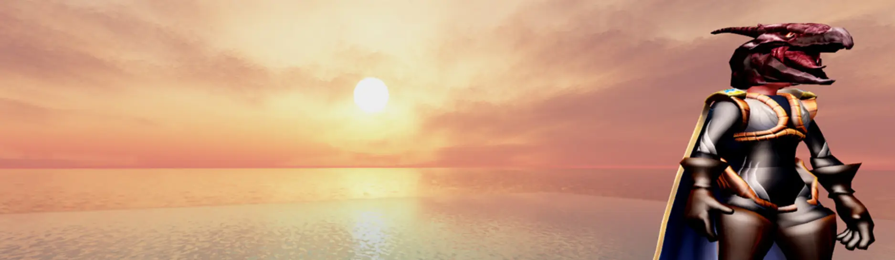
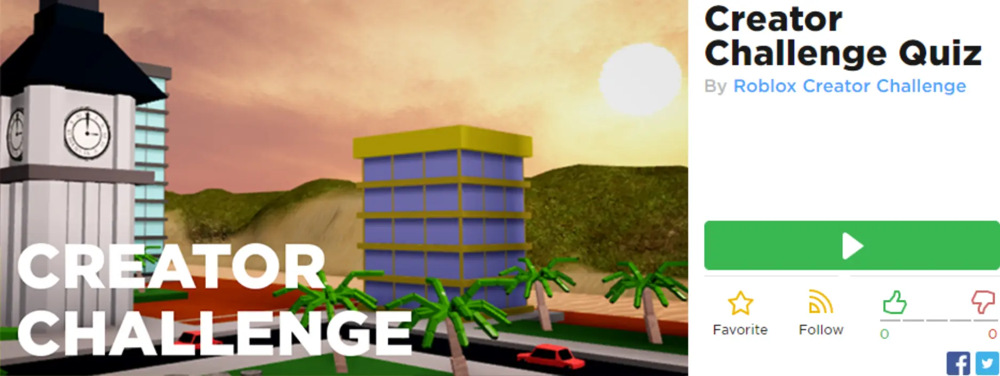

# Take the Challenge!

## 목차
- [Take the Challenge!](#take-the-challenge)
  - [목차](#목차)
  - [출처](#출처)
  - [다음](#다음)

---

지식을 테스트하고 로단의 머리 아바타 아이템과 설계도 초안 배지를 획득하세요!

1. 아래의 **퀴즈 경험 플레이(Play Quiz Experience)** 버튼을 클릭하여 Roblox 경험을 엽니다. 방금 배운 내용을 바탕으로 질문에 답하여 도전을 완료하세요.
   

    <a href="https://www.roblox.com/games/3204381131/Creator-Challenge-Quiz">
    <Button variant="contained">퀴즈 플레이</Button>
    </a>

2. **다시 돌아와서** 도시 건설을 계속하세요.

---
## 출처
[Take the Challenge!](https://create.roblox.com/docs/ko-kr/education/build-it-play-it-create-and-destroy/challenge-1)

---
## [다음](06_06_Build_One_Half.md)
