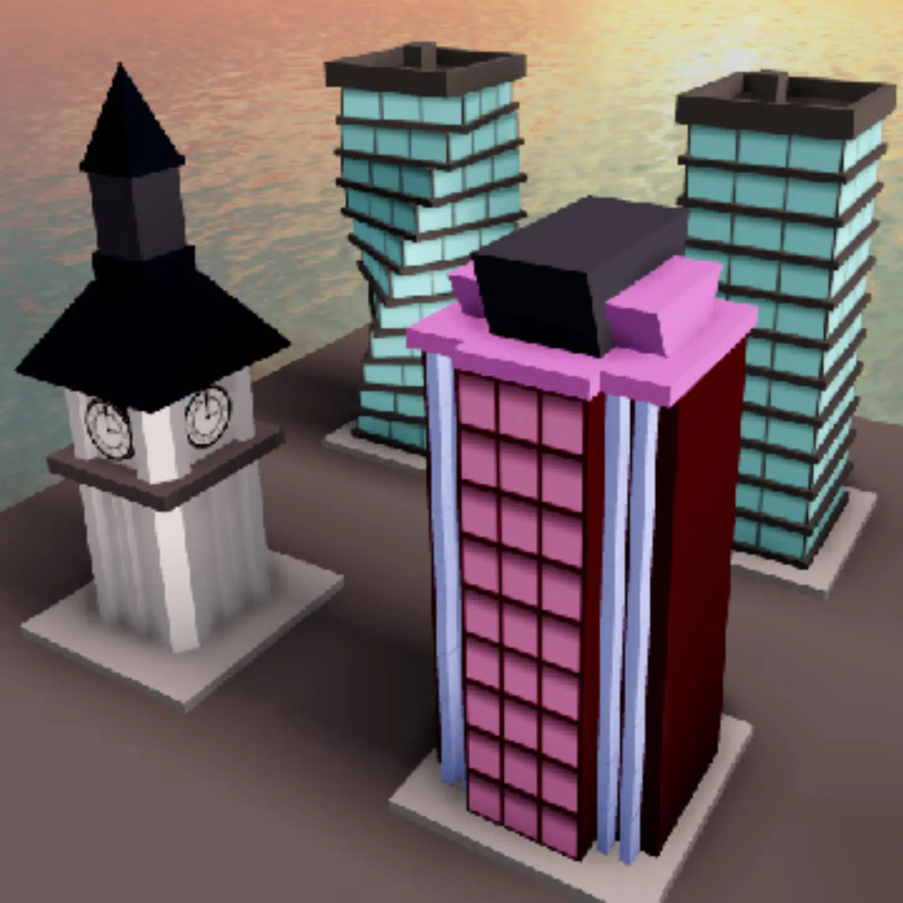
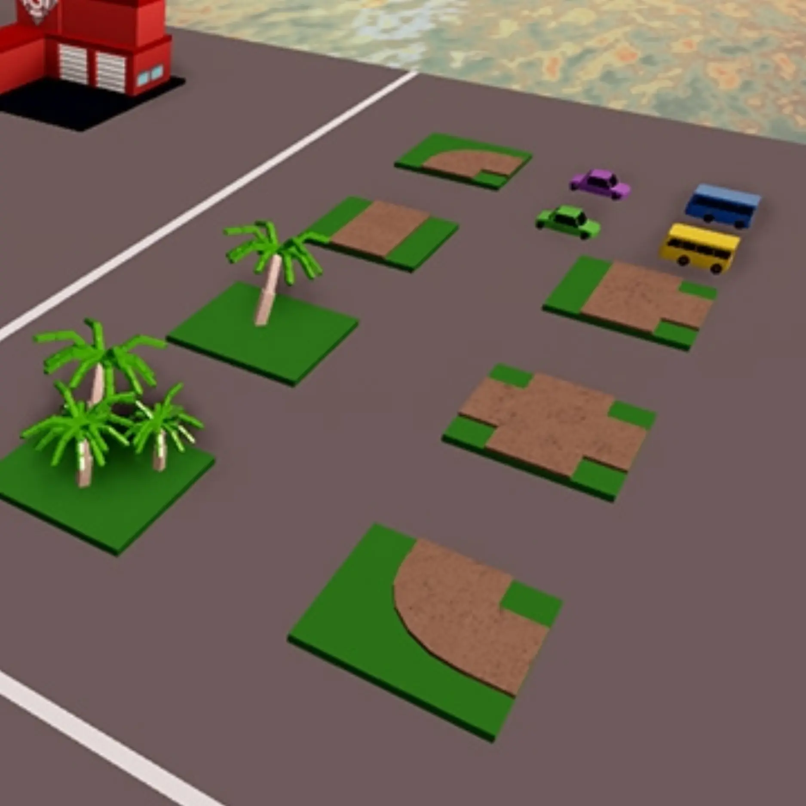
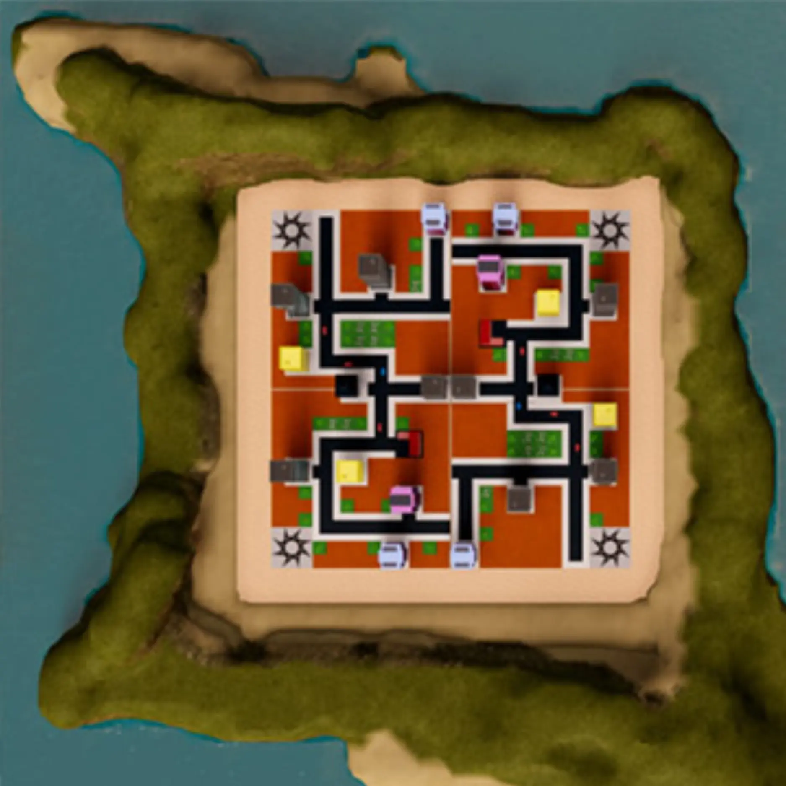
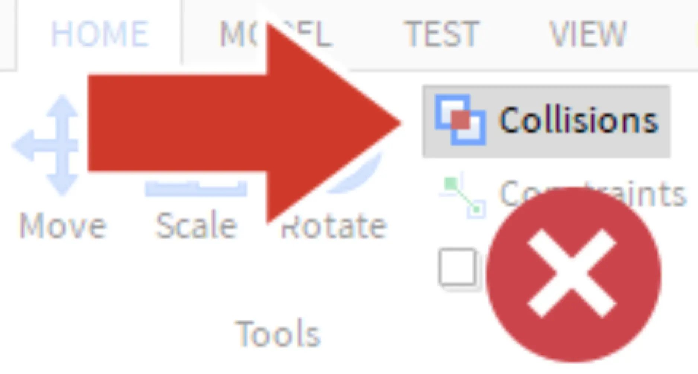
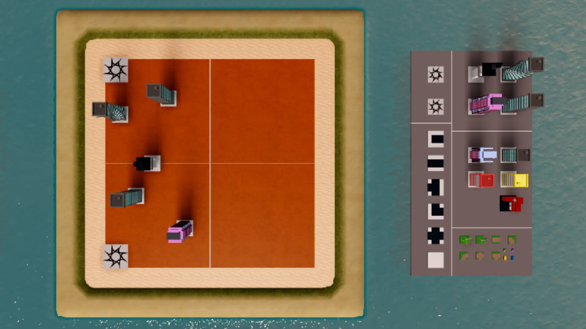
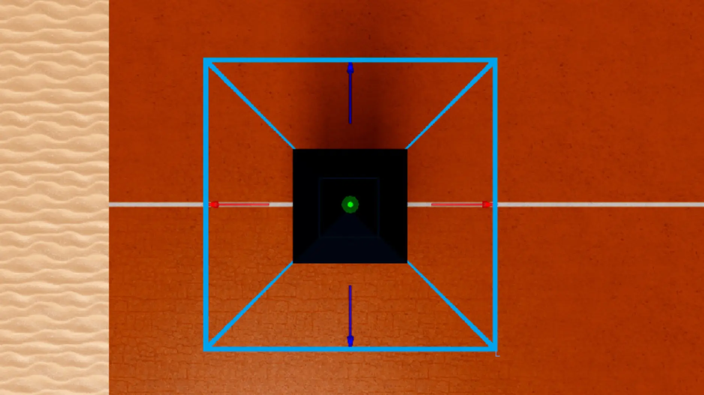

# Build One Half

## 목차
- [Build One Half](#build-one-half)
  - [목차](#목차)
  - [충돌 비활성화](#충돌-비활성화)
  - [건물 배치 시작](#건물-배치-시작)
  - [첫 번째 건물 복제](#첫-번째-건물-복제)
  - [모든 각도 확인](#모든-각도-확인)
  - [추가 대형 건물 배치](#추가-대형-건물-배치)
    - [문제 해결 팁](#문제-해결-팁)
  - [출처](#출처)
  - [다음](#다음)

---

스폰 위치를 설정한 후, 이제 도시를 설계할 시간입니다. 설계는 다음 단계로 진행됩니다:

- **건물 추가**: 건물은 크기에 따라 대형과 중형으로 나뉘며, 파괴 시 각기 다른 점수를 제공합니다.
- **소품 배치**: 도시를 시각적으로 더 흥미롭게 만듭니다.
- **지형 페인팅**: 산, 강, 언덕 등을 추가합니다.

<GridContainer numColumns="3">
  <figure>
    
    <figcaption>건물</figcaption>
  </figure>
  <figure>
    
    <figcaption>소품</figcaption>
  </figure>
  <figure>
    
    <figcaption>지형</figcaption>
  </figure>
</GridContainer>

## 충돌 비활성화

객체들이 서로 겹치지 않고 이동하고 회전할 수 있도록 충돌을 비활성화합니다. **충돌** 설정을 통해 객체가 서로를 통과할 수 있게 할 수 있습니다.

1. **홈** 탭에서 **충돌 비활성화**를 선택합니다. 비활성화되면 회색으로 표시되지 않습니다.

   <GridContainer numColumns="2">
     <figure>
       
       <figcaption>충돌 활성화</figcaption>
     </figure>
     <figure>
       
       <figcaption>충돌 비활성화</figcaption>
     </figure>
   </GridContainer>

2. 건물이 올바르게 이동하고 스냅되도록 **모델** 탭에서 **스냅 설정**이 **4 스터드**로 설정되어 있는지 확인합니다.

## 건물 배치 시작

도시를 건설하려면 게임 세계 오른쪽에 있는 객체 팔레트에서 건물을 복제해야 합니다.

## 첫 번째 건물 복제

1. 팔레트에서 대형 건물을 선택하고 **복제**합니다 (<kbd>Ctrl</kbd> + <kbd>D</kbd> 또는 <kbd>⌘</kbd> + <kbd>D</kbd>). 명확한 변화가 보이지 않을 것입니다. 충돌이 비활성화된 상태에서 새 건물은 원래 건물과 겹쳐질 것입니다.
   <Alert severity="warning">
   오류를 방지하려면 **항상 복제**를 사용하고, 복사 및 붙여넣기를 사용하지 마세요. 복제는 새 객체를 동일한 폴더에 넣지만, 복사 및 붙여넣기는 새 객체를 폴더 밖으로 이동시킵니다.
   </Alert>

    

2. **이동 도구**를 선택하고 **화살표**를 사용하여 **복제된 건물**을 작업 중인 맵의 반쪽으로 이동합니다. 흰색 그리드 라인을 사용하여 건물을 두 스폰 위치 사이의 중간에 배치하고 맵의 반쪽을 유지합니다.
   <video controls src="../img/06_06_Build_One_Half/cc2019_moveFirstBuilding.mp4" width="100%"></video>

## 모든 각도 확인

작업을 진행하면서 건물이 실수로 땅에서 떨어지지 않도록 각도를 확인합니다. 카메라를 회전시켜 다른 각도에서 건물을 자세히 살펴보세요. 측면에서 건물을 확인하는 것으로 시작합니다.

1. 건물을 선택하고, <kbd>F</kbd>를 눌러 카메라를 건물에 초점을 맞춥니다.
   
2. **뷰 선택기**의 작은 화살표를 사용하여 측면 보기로 변경합니다. 뷰 선택기를 찾을 수 없다면 뷰 탭에서 버튼을 찾습니다.
   <video controls src="../img/06_06_Build_One_Half/changeViewSelectorSide_updated.mp4" width="100%"></video>
3. 카메라 컨트롤을 사용하여 건물을 잘 볼 수 있는 위치로 이동합니다.
   <video controls src="../img/06_06_Build_One_Half/cc2019_showCameraControlsBuilding.mp4" width="100%"></video>

   아래는 카메라 컨트롤입니다.
    <table>
    <thead>
    <tr>
      <th>동작</th>
      <th>제어</th>
    </tr>
    </thead>
    <tbody>
    <tr>
      <td><b>이동</b></td>
      <td><kbd>W A S D</kbd> 또는 화살표 키</td>
    </tr>
    <tr>
      <td><b>회전</b></td>
      <td>오른쪽 마우스 버튼을 눌러서 주변을 봅니다.</td>
    </tr>
    <tr>
      <td><b>팬</b></td>
      <td>가운데 마우스 버튼을 눌러 카메라를 드래그합니다.</td>
    </tr>
    </tbody>
    </table>

4. 화살표를 사용하거나 뷰 선택기의 영역을 클릭하여 상단 보기로 돌아갑니다.
   <video controls src="../img/06_06_Build_One_Half/cc2019_switchBackTop.mp4" width="100%"></video>

## 추가 대형 건물 배치

복제하고 동일한 반쪽에 **3 - 5개의 추가** 대형 건물을 배치합니다. 이 반쪽을 복제하여 맵의 나머지 부분을 만들 예정입니다.

맵이 예시와 같을 필요는 없지만, 각 플레이어가 동일한 수의 건물에 접근할 수 있어야 합니다. 여기서는 각 플레이어가 네 개의 건물 중 세 개에 접근할 수 있는 동일한 기회를 가지고 있습니다.

### 문제 해결 팁

맵을 설계하는 동안 건물이 제자리에 스냅되지 않는 경우 다음 단계를 시도하세요.

- 모델 탭에서 이동 스냅 설정이 4 스터드로 설정되어 있는지 확인하세요. 그렇지 않으면 건물이 잘못 스냅될 수 있습니다.
- 가장 정확한 스냅을 위해 상단 보기에서 작업하고 항상 화살표를 사용하여 객체를 이동시키는 것이 좋습니다.
- 객체가 올바르게 스냅되지 않는 경우, 건물을 삭제하고 팔레트에서 새 건물을 복제하여 다시 시작합니다.

---
## 출처
[Build One Half](https://create.roblox.com/docs/ko-kr/education/build-it-play-it-create-and-destroy/build-one-half)

---
## [다음](06_07_Playtest_the_Map.md)
