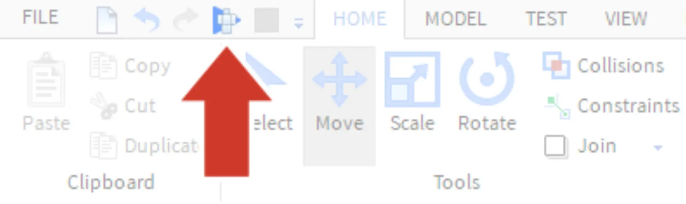
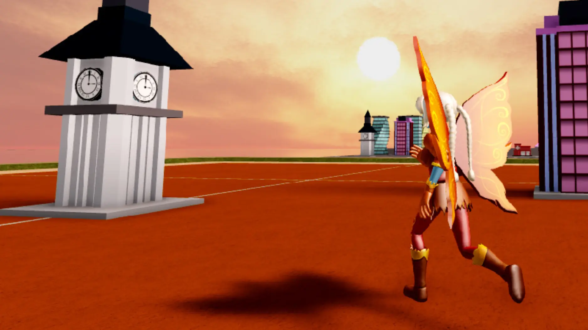
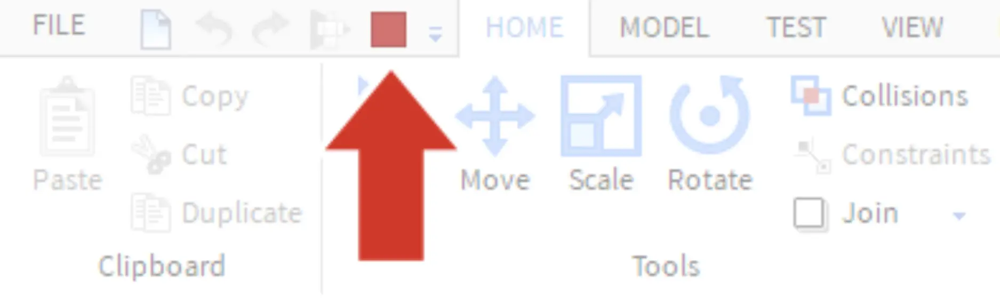

# Playtest the Map

## 목차
- [Playtest the Map](#playtest-the-map)
  - [목차](#목차)
  - [출처](#출처)
  - [다음](#다음)

---

게임 내에서 맵이 어떻게 보일지 테스트하려면 스튜디오에서 맵을 플레이테스트하세요. **플레이테스트**는 게임을 플레이하고 재미있고 버그가 없는지 확인하는 과정입니다.

1. **재생**을 클릭합니다. 로비 영역에서 시작한 후 도시에 전송됩니다.
   
2. 5초의 간격이 끝날 때까지 기다리면 만든 맵으로 이동합니다. 주변을 돌아다니며 수정이 필요한 떠 있는 건물이 없는지 확인하세요. <kbd>E</kbd> 키를 눌러 건물을 파괴하여 경험을 테스트하세요.
   

   아래는 게임 내에서 사용할 수 있는 컨트롤입니다.
    <table>
    <thead>
      <tr>
          <th>동작</th>
          <th>제어</th>
      </tr>
    </thead>
    <tbody>
      <tr>
          <td><b>이동</b></td>
          <td><kbd>W A S D</kbd> 또는 화살표 키</td>
      </tr>
      <tr>
          <td><b>점프</b></td>
          <td><kbd>스페이스바</kbd></td>
      </tr>
      <tr>
          <td><b>뷰 회전</b></td>
          <td>마우스를 클릭하고 드래그하여 주변을 둘러봅니다.</td>
      </tr>
    </tbody>
    </table>

3. **정지** 버튼을 클릭하여 플레이테스트를 종료합니다. 플레이테스트를 종료하지 않으면, 변경한 사항이 모두 사라질 수 있습니다.
   

---
## 출처
[Playtest the Map](https://create.roblox.com/docs/ko-kr/education/build-it-play-it-create-and-destroy/playtest-the-map)

---
## [다음](06_08_Build_the_Roads.md)
