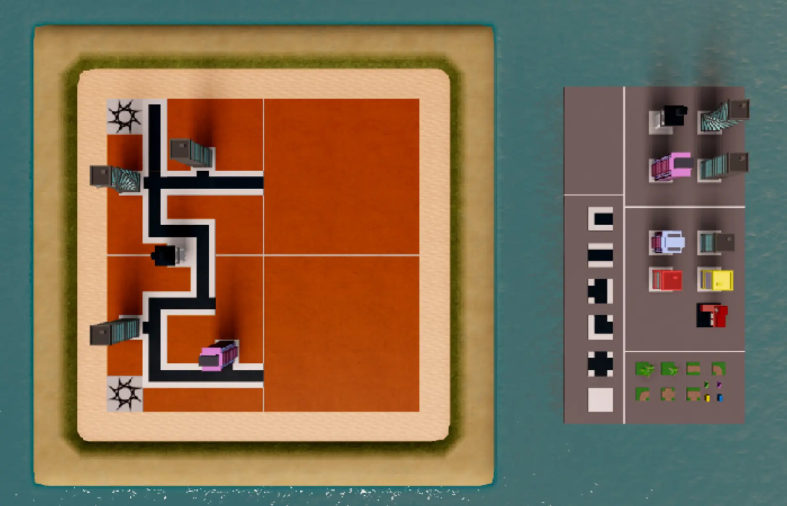

# Build the Roads

## 목차
- [Build the Roads](#build-the-roads)
  - [목차](#목차)
  - [맵 예제](#맵-예제)
  - [출처](#출처)
  - [다음](#다음)

---

다음으로, 팔레트에 있는 도로 타일을 복제하여 건물 사이에 도로를 만드세요. 배치할 때 도로를 올바른 위치로 회전시켜야 합니다.

1. 팔레트에서 도로를 선택하고 **복제**하세요. 그런 다음, **이동**하여 맵으로 옮기세요.
2. 선택한 도로 타일을 원하는 방향으로 회전시키세요. 타일을 회전시키려면 **회전** 도구를 선택하고 초록색 손잡이를 드래그하여 타일을 회전시키세요.
   <video controls src="../img/06_08_Build_the_Roads/cc2019_showRotateBuilding.mp4" width="100%"></video>

  <Alert severity="info">
  팔레트에서 항상 복제하지 않고 경기장에서 도로 타일을 복제하여 도로를 만드는 시간을 절약할 수 있습니다.
  </Alert>

## 맵 예제

다른 건물과 장식물을 위한 충분한 공간을 남겨두세요.

---
## 출처
[Build the Roads](https://create.roblox.com/docs/ko-kr/education/build-it-play-it-create-and-destroy/build-the-roads)

---
## [다음](06_09_Buildings_and_Props.md)
