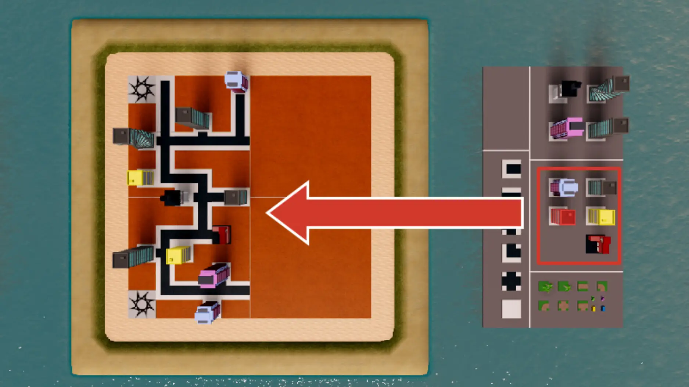
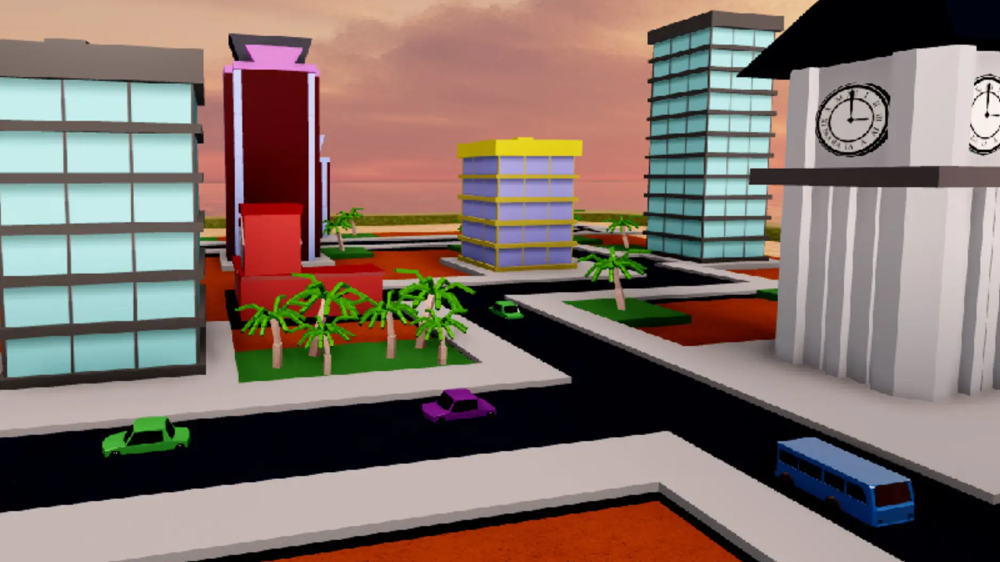
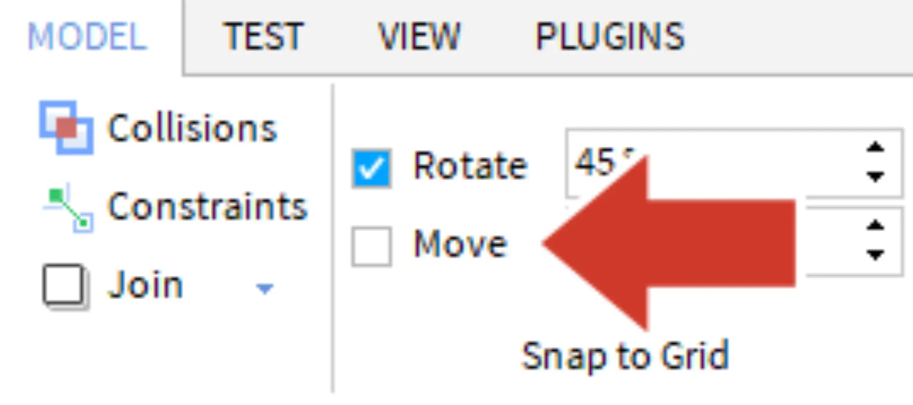
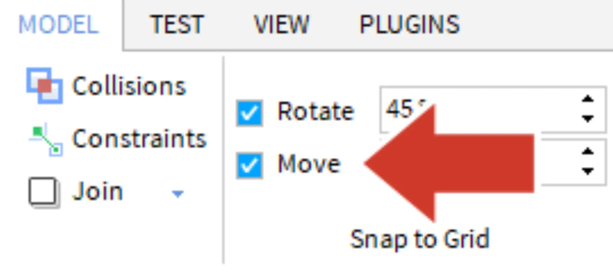

# Buildings and Props

## 목차
- [Buildings and Props](#buildings-and-props)
  - [목차](#목차)
  - [소품으로 마무리하기](#소품으로-마무리하기)
  - [출처](#출처)
  - [다음](#다음)

---

도로 배치가 완료되면 중간 크기의 건물을 배치하세요. 플레이어는 이 건물을 부수면 10점을 얻으므로 각 시작 지점 근처에 동일한 수의 건물을 배치하도록 하세요.

1. **중간 크기의 건물**을 복제하고 맵에 이동하세요.
2. 필요에 따라 도로를 추가하여 8-10개의 중간 크기 건물을 배치하세요.

   

## 소품으로 마무리하기

다음으로, 나무나 자동차 같은 소품을 맵 주변에 배치하세요. 플레이어는 이 소품을 부수어도 점수를 얻지 않지만, 세계에 현실감을 더해줍니다.

아래는 소품이 배치된 예제입니다.

자동차와 같은 일부 소품은 원하는 대로 스냅되지 않을 수 있습니다. 자유롭게 이동하려면 **Model** 탭으로 이동하여 **Move** 옆의 상자를 체크 해제하여 스냅을 끄세요. 소품 배치가 완료되면 스냅 기능을 다시 켜는 것을 잊지 마세요.

<!-- <GridContainer numColumns="2">
  <figure>
    
    <figcaption>소품 사용할 때 스냅 끄기</figcaption>
  </figure>
  <figure>
    
    <figcaption>건물 및 도로에 스냅 켜기</figcaption>
  </figure>
</GridContainer> -->

|소품 사용할 때 스냅 끄기|건물 및 도로에 스냅 켜기|
|---|---|
|||

---
## 출처
[Buildings and Props](https://create.roblox.com/docs/ko-kr/education/build-it-play-it-create-and-destroy/buildings-and-props)

---
## [다음](06_10_Complete_the_City.md)
