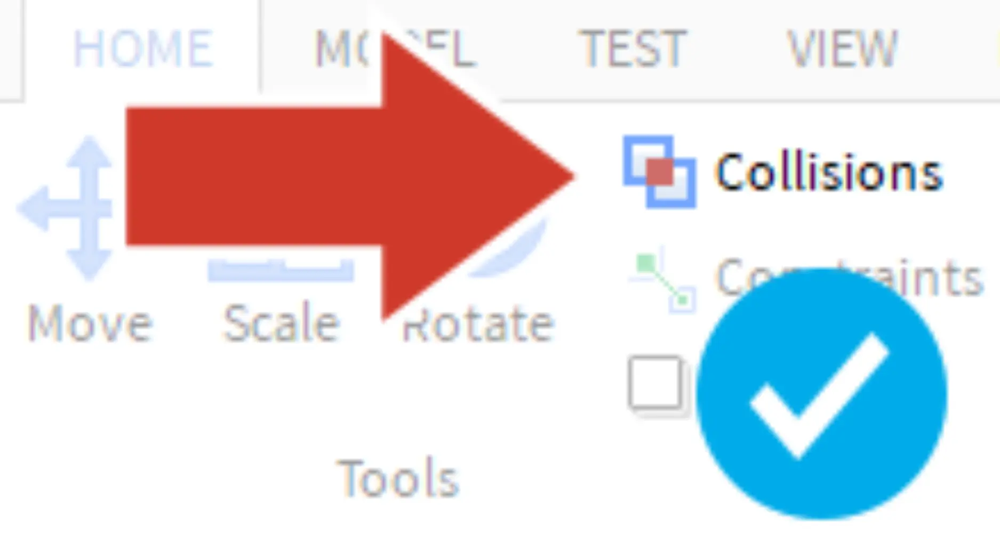

# Complete the City

## 목차
- [Complete the City](#complete-the-city)
  - [목차](#목차)
  - [출처](#출처)
  - [다음](#다음)

---

도시의 첫 번째 절반이 준비되면 다음 단계는 복제를 사용하여 전체 4인용 맵으로 만드는 것입니다. 첫 번째 절반을 복제한 후에도 계속해서 도시에 변경을 가할 수 있습니다.

1. **Model** 탭에서 **충돌**이 **꺼져** 있어야 합니다(강조 표시 안 됨). 충돌이 켜져 있으면 맵을 이동하고 회전하기 어렵습니다.

   

2. 마우스를 클릭하고 드래그하여 **모든** 건물, 도로, 소품을 선택합니다.
   <video controls src="../img/06_10_Complete_the_City/cc2019_showSelectDragCity.mp4" width="100%"></video>

3. 이전에 했던 것처럼 선택한 항목을 **복제**합니다.
4. **Move** 및 **Rotate** 도구를 사용하여 도시를 재배치합니다. 맘에 들지 않으면 **Undo**(<kbd>Ctrl + Z</kbd> 또는 <kbd>⌘ + Z</kbd>)를 눌러 다시 시도하세요.
   <video controls src="../img/06_10_Complete_the_City/cc2019_showDuplicateCity.mp4" width="100%"></video>

도시를 복제하고 회전한 후, 절반이 더 잘 맞도록 타일을 추가하거나 조정할 수 있습니다.

---
## 출처
[Complete the City](https://create.roblox.com/docs/ko-kr/education/build-it-play-it-create-and-destroy/complete-the-city)

---
## [다음](06_11_Island_Terrain.md)
