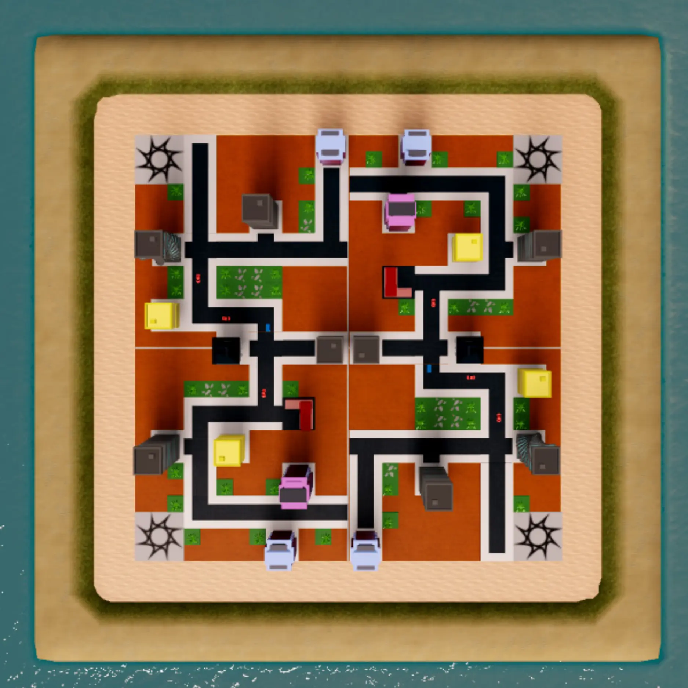
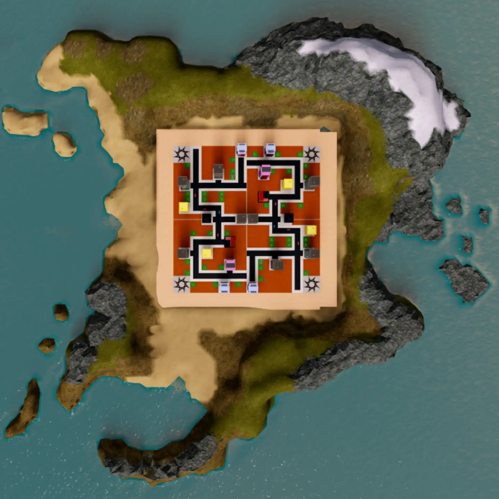
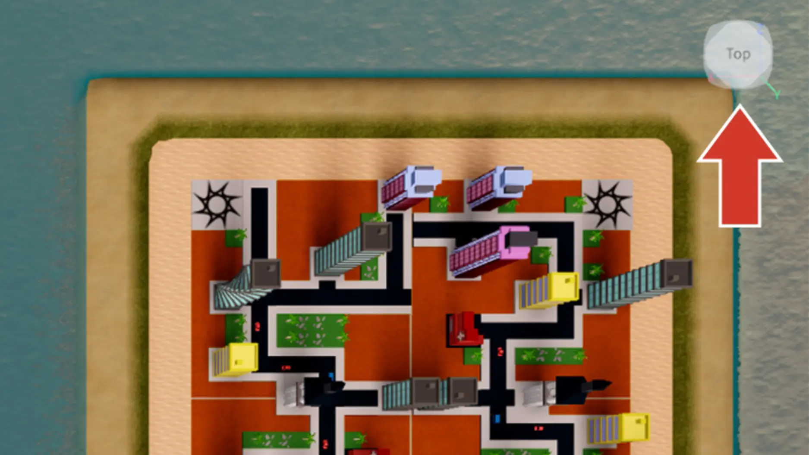
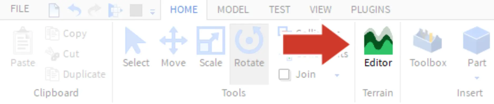

# Island Terrain

## 목차
- [Island Terrain](#island-terrain)
  - [목차](#목차)
  - [지형 편집기 열기](#지형-편집기-열기)
  - [출처](#출처)
  - [다음](#다음)

---

플레이어들에게 정사각형 맵은 자연스럽지 않고 흥미롭지 않습니다. 맵을 완성하기 위해서는 지형 도구를 사용하여 맵의 가장자리를 실제 섬처럼 보이도록 커스터마이징할 것입니다.

<GridContainer numColumns="2">
  <figure>
    
    <figcaption>전</figcaption>
  </figure>
  <figure>
    
    <figcaption>후</figcaption>
  </figure>
</GridContainer>

## 지형 편집기 열기

산이나 풀을 페인팅하는 모든 지형은 지형 편집기를 사용하여 생성됩니다.

1. 시작하기 전에, 지금까지의 경험을 **게시**하세요. 변경 사항이 마음에 들지 않을 경우 저장된 버전으로 쉽게 돌아갈 수 있습니다.
2. **탑-다운** 보기로 돌아가세요(코너 위젯에서 상단을 클릭). 다음 페이지에서 지형을 더 잘 편집할 수 있습니다.

   

3. **Home** 탭에서 **Terrain Editor**를 엽니다.

   

---
## 출처
[Island Terrain](https://create.roblox.com/docs/ko-kr/education/build-it-play-it-create-and-destroy/complete-the-city)

---
## [다음](06_12_Terrain_Tools.md)
