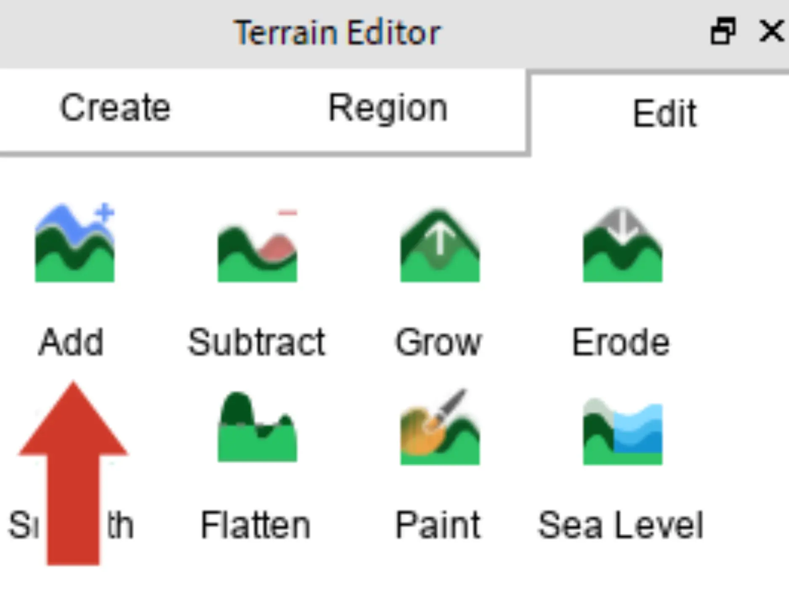
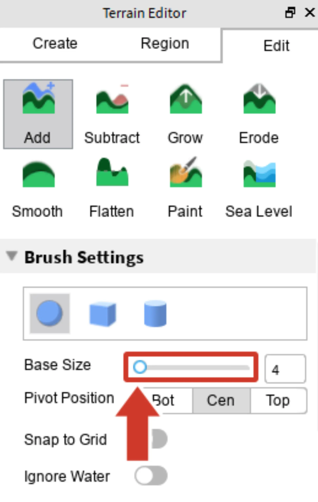
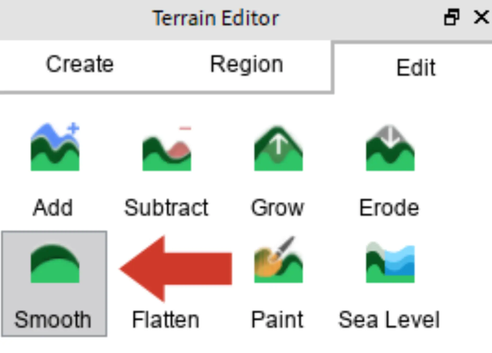
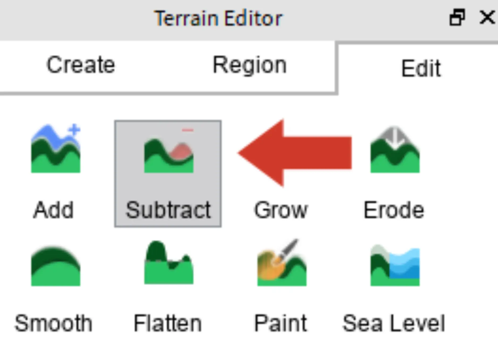
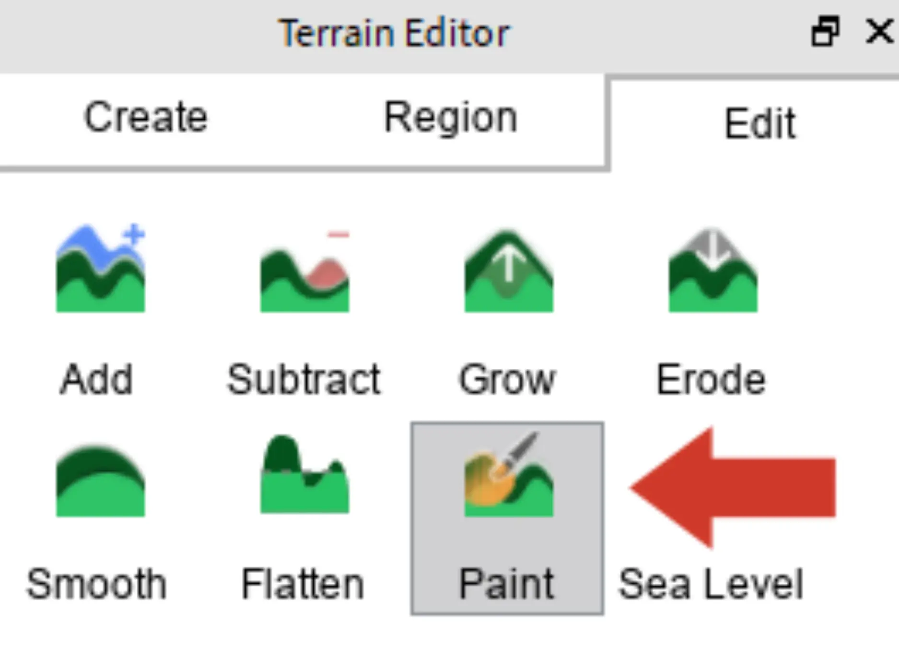
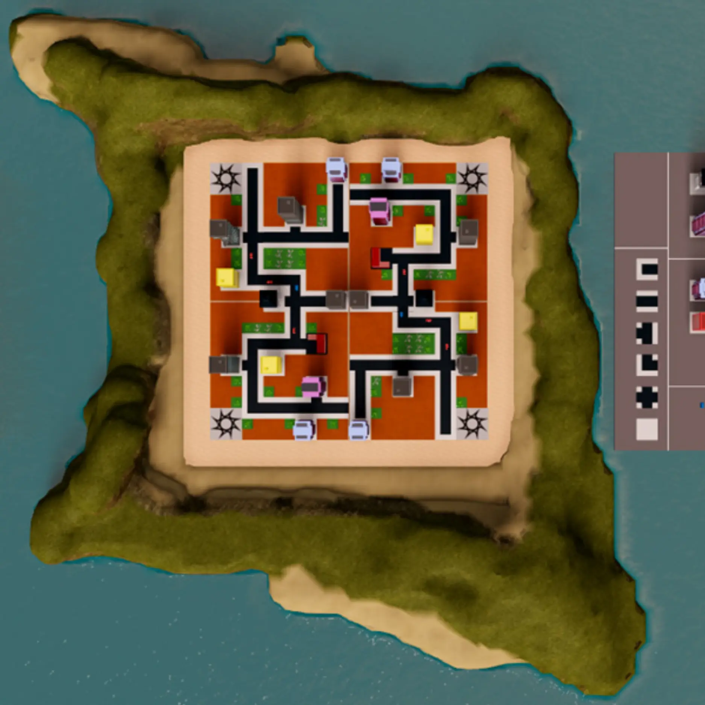

# Terrain Tools

## 목차
- [Terrain Tools](#terrain-tools)
  - [목차](#목차)
  - [모양 만들기](#모양-만들기)
  - [세부 사항 추가](#세부-사항-추가)
  - [출처](#출처)
  - [다음](#다음)

---

**지형 편집기**는 자연 지형을 조각하는 데 사용됩니다. 먼저 섬의 모양을 만들고, 그 다음으로 산과 풍경 페인팅과 같은 세부 사항을 다룰 것입니다.

## 모양 만들기

1. 지형 편집기 창에서 **Edit** 탭을 선택합니다. 그런 다음 **Add** 도구를 클릭합니다.

   

2. **Add**는 파란색 커서를 클릭하거나 드래그할 때마다 땅을 만듭니다. **Base Size** 또는 **Shape**를 변경하여 도구에 대한 제어를 강화합니다.

   

3. 파란색 커서를 클릭하고 드래그하여 자연스러운 섬 모양을 만듭니다. 사각형 건물 구역의 날카로운 가장자리를 덮고 직선 라인을 제거하려고 시도합니다. 결과가 마음에 들지 않으면 <kbd>Ctrl + Z</kbd> 또는 <kbd>⌘ + Z</kbd>를 누릅니다.
   <video controls src="../img/06_12_Terrain_Tools/showTerrainAdd.mp4" width="100%"></video>

## 세부 사항 추가

현재 섬은 약간 울퉁불퉁해 보일 수 있습니다. 다음으로, 지형을 부드럽게 하고 **Subtract** 및 **Paint** 도구를 사용하여 미세 조정할 것입니다.

1. **Smooth** 도구를 선택합니다. 이 도구는 지형의 높고 낮은 부분을 평균화합니다. 이 도구를 사용하여 자연스럽게 보이도록 만듭니다.

   

    <Alert severity="warning">
    지형이 어떻게 생겼는지 더 잘 보기 위해 카메라를 회전시키고 여러 각도에서 지형을 확인하세요. 항상 위에서만 보지 마세요.
    </Alert>

2. **Subtract** 도구로 원하지 않는 지형을 제거합니다. 이 도구는 도시를 침범한 지형을 빠르게 삭제하는 데 유용합니다.

   

3. 가장자리에 모래와 진흙을 **Paint**하여 해변을 만듭니다. 페인트는 모양을 변경하지 않고 텍스처를 변경합니다.

   

   지형이 있는 맵의 예는 아래와 같습니다.

   

---
## 출처
[Terrain Tools](https://create.roblox.com/docs/ko-kr/education/build-it-play-it-create-and-destroy/terrain-tools)

---
## [다음](06_13_Take_the_Challenge.md)
