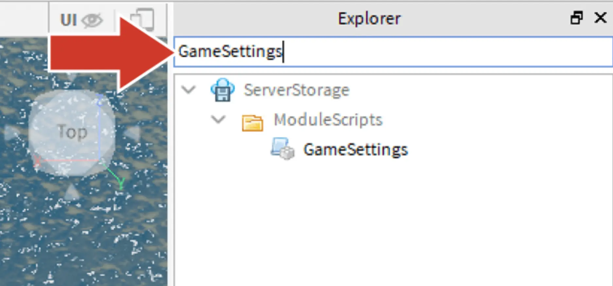
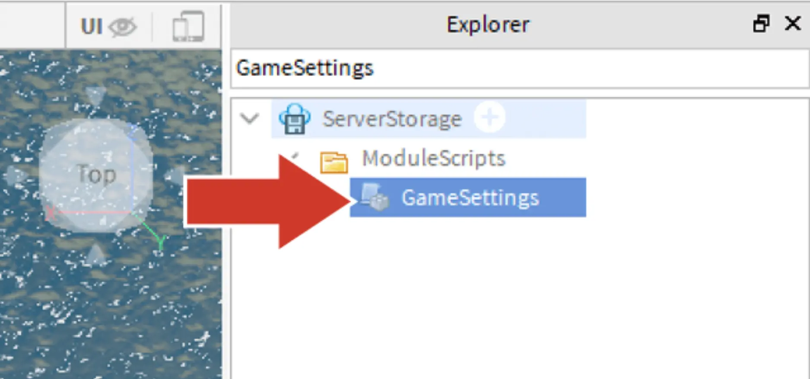
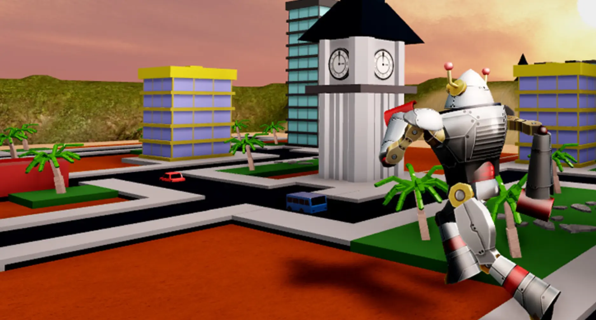

# Change the Script

## 목차
- [Change the Script](#change-the-script)
  - [목차](#목차)
  - [스크립트 열기](#스크립트-열기)
  - [GameSettings 스크립트 내용](#gamesettings-스크립트-내용)
  - [점수 값 변경](#점수-값-변경)
  - [출처](#출처)
  - [다음](#다음)

---

맵이 완성되면 경험을 다듬는 작업으로 넘어갑니다. 다음 기사에서는 다음과 같은 마무리 작업을 다룹니다:

- 건물에 대해 다른 점수를 부여하도록 스크립트를 수정합니다.
- 맞춤 게임 이미지를 업로드합니다.
- 경험을 친구들과 공유합니다.

## 스크립트 열기

맵 외에도 Create and Destroy의 다른 측면은 경험을 실행하는 데 사용되는 코드 컨테이너인 **스크립트**를 통해 사용자 지정할 수 있습니다. 이 경우, 건물을 파괴하여 획득하는 점수를 변경합니다.

1. 오른쪽 상단의 **Explorer**에서 프로젝트에 포함된 모든 항목 목록을 열고 **GameSettings**를 입력합니다.
   

2. **GameSettings**를 더블 클릭하여 스크립트 편집기를 엽니다.
   

## GameSettings 스크립트 내용

스크립트에서 플레이어에게 제공되는 점수 값을 설정하는 세 가지 다른 점수 값을 가진 섹션을 볼 수 있습니다: 큰 건물(HighPoints), 중간 건물(MediumPoints), 소품(LowPoints).

```lua
-- Game Variables
GameSettings.intermissionDuration = 10
GameSettings.roundDuration = 30
GameSettings.minimumPlayers = 1
GameSettings.transitionStart = 3
GameSettings.transitionEnd = 3
GameSettings.pointValues = {
	 -- Value types must match folder names to award points correctly
	LowPoints = 0,
	MediumPoints = 10,
	HighPoints = 15,
}
```

## 점수 값 변경

플레이어에게 더 많은 점수를 주면 건물을 부수는 것이 더욱 보람 있게 느껴질 수 있습니다.

1. 스크립트의 11번째 줄을 찾아 `HighPoints = 15`를 `HighPoints = 150`으로 변경하여 큰 건물의 점수를 150점으로 만듭니다. 숫자 뒤에 쉼표를 유지하십시오.

   ```lua
   GameSettings.pointValues = {
     -- Value types must match folder names to award points correctly
     LowPoints = 0,
     MediumPoints = 10,
     HighPoints = 150,
   }
   ```

2. **Playtest**를 통해 변경된 내용을 확인해보세요. 중간 크기 건물을 부수면 더 많은 점수를 얻도록 하고 싶다면 해당 점수도 변경할 수 있습니다.

   

3. 원하는 경우, 스크립트를 변경해보며 실험해보세요. 예를 들어, `GameSettings.roundDuration`의 숫자를 변경하여 라운드가 더 빠르거나 짧게 진행되도록 할 수 있습니다.
   <Alert severity="warning">
   스크립트에서 변경된 후 프로젝트가 의도한 대로 작동하지 않으면 스크립트 편집기로 돌아가 마지막 변경을 **되돌리기** 하십시오.
   </Alert>

---
## 출처
[Change the Script](https://create.roblox.com/docs/ko-kr/education/build-it-play-it-create-and-destroy/change-the-script)

---
## [다음](06_15_Icons_and_Thumbnails.md)
