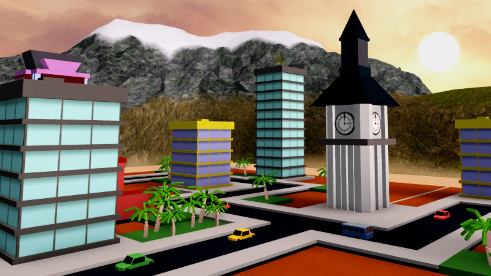
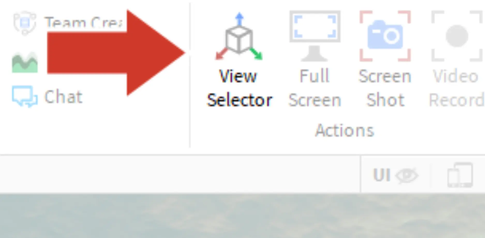
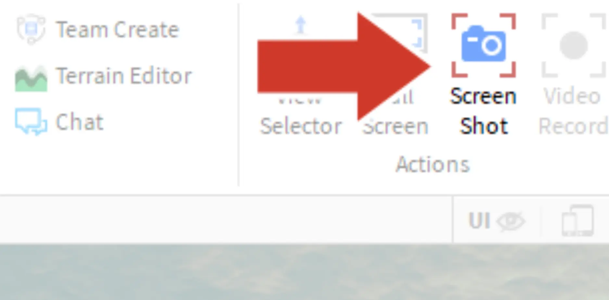
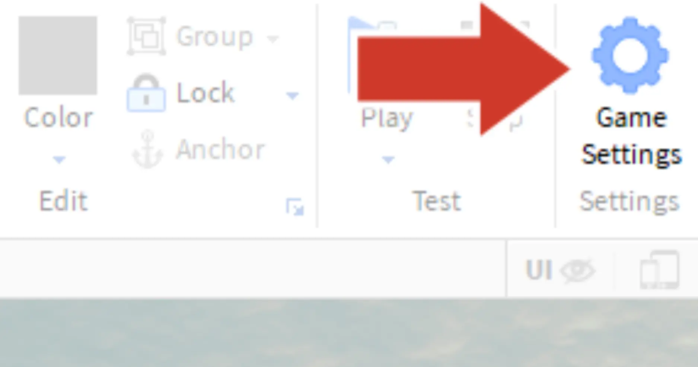
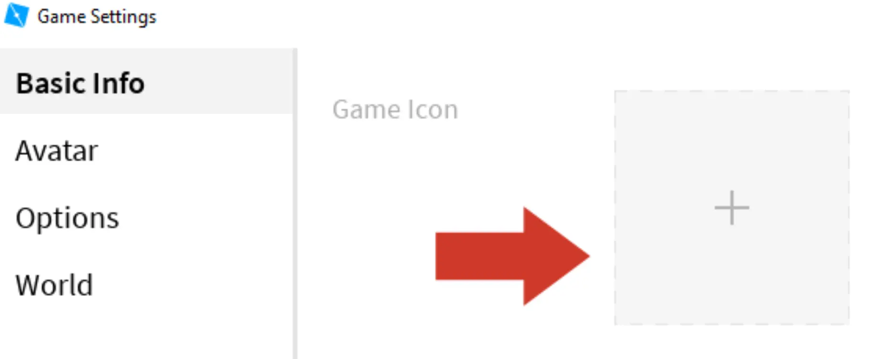
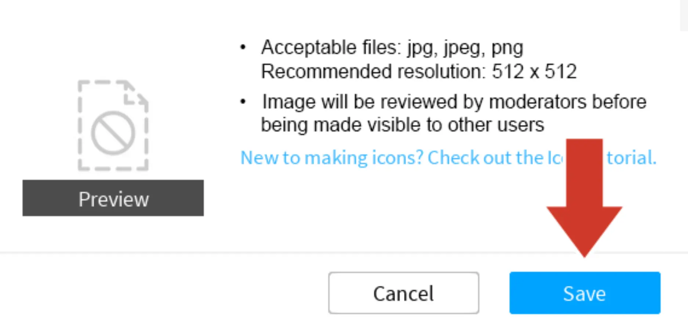
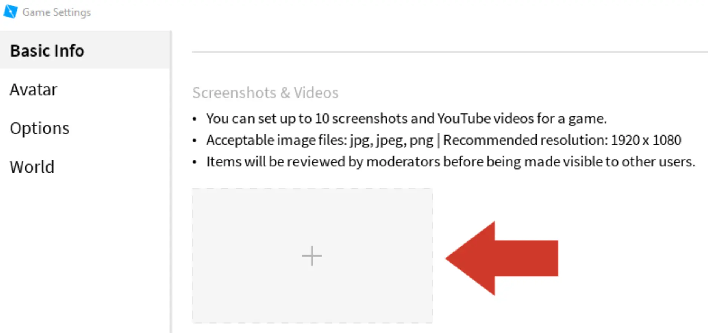
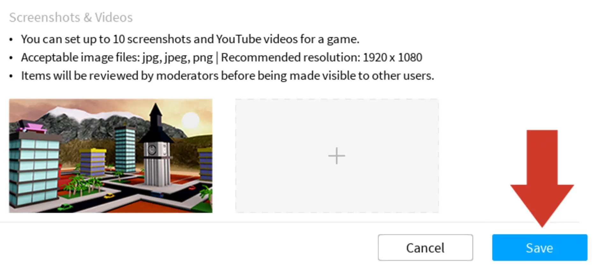
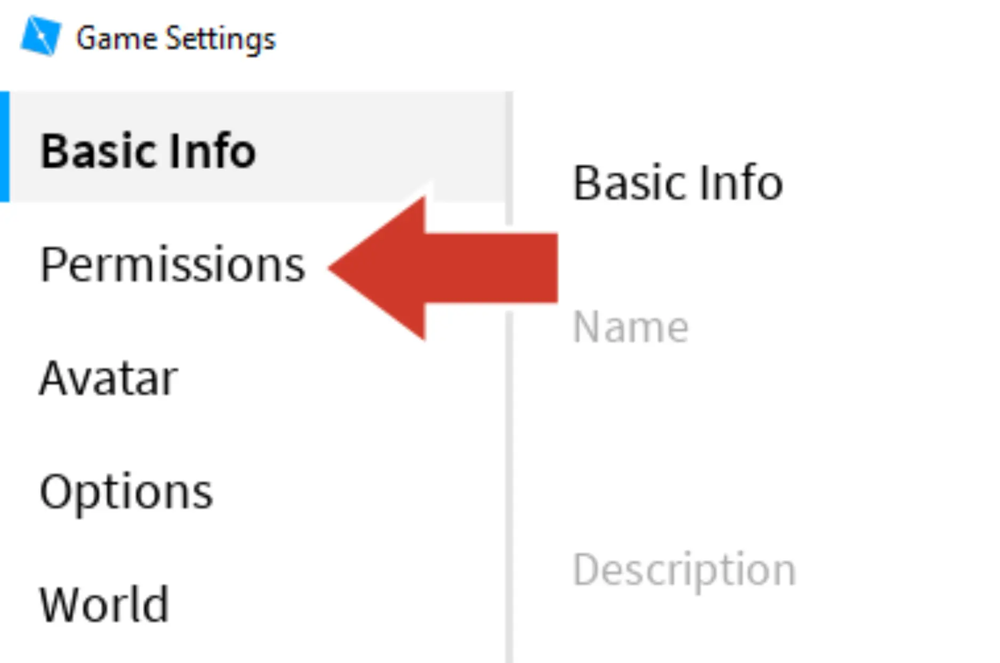
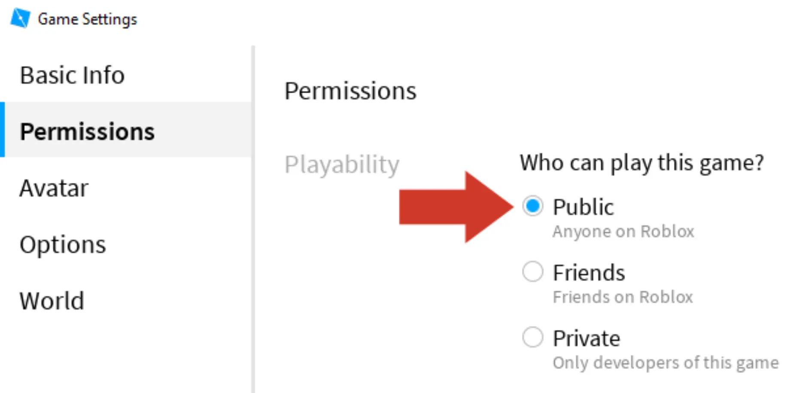

# Icons and Thumbnails

## 목차
- [Icons and Thumbnails](#icons-and-thumbnails)
  - [목차](#목차)
  - [팔레트 삭제](#팔레트-삭제)
  - [게임 아이콘 만들기](#게임-아이콘-만들기)
    - [스크린샷 찍기](#스크린샷-찍기)
  - [스크린샷 찾기](#스크린샷-찾기)
    - [아이콘 업로드](#아이콘-업로드)
  - [썸네일 업로드](#썸네일-업로드)
  - [친구와 공유하기](#친구와-공유하기)
  - [출처](#출처)
  - [다음](#다음)

---

경험을 공유하기 전에 게임 아이콘과 썸네일에 맞춤 이미지를 추가하세요. 이를 변경하면 플레이어들이 경험에 대해 더 잘 알 수 있습니다.

- **게임 아이콘**은 Roblox 게임 페이지에 표시되는 이미지입니다.
- **썸네일**은 게임의 전용 페이지에 표시되는 이미지입니다.

## 팔레트 삭제

썸네일과 아이콘을 위한 경험의 사진을 찍기 전에 팔레트를 삭제하여 표시되지 않도록 할 수 있습니다.

1. 팔레트의 객체 주위에 선택 상자를 드래그하고 Delete를 누릅니다.
2. 탐색기(오른쪽 상단)에서 검색 상자를 클릭하고 'baseplate'를 입력합니다. **PaletteBaseplate** 객체를 찾아 클릭한 후 <kbd>Delete</kbd>를 누릅니다.

## 게임 아이콘 만들기

**게임 아이콘**은 검색 또는 게임 페이지에서 다른 플레이어가 볼 때 경험의 첫인상을 잘 보여주는 이미지입니다. 지금은 세계의 스크린샷을 사용합니다. 나중에 이미지 편집 소프트웨어로 더 나은 것을 만들 수 있습니다.

### 스크린샷 찍기

1. Studio에서 카메라를 게임 아이콘이 보이도록 설정합니다.

   

2. 스크린샷에 보기 선택기가 나타나지 않도록 **View** 탭에서 **View Selector** 아이콘을 클릭하여 **끄기**로 설정합니다.

   

3. **View** 탭에서 **Screen Shot**을 클릭합니다. 아무 변화가 없어 보이지만, 스크린샷이 컴퓨터의 Pictures > Roblox 폴더에 저장됩니다.

   

## 스크린샷 찾기

Roblox에서 스크린샷이 어디에 나타나는지 모를 경우, 다음 단계를 따라 위치를 찾을 수 있습니다.

1. **View** 탭에서 출력 창이 열려 있는지 확인합니다. 열려 있지 않다면, **Output**을 클릭합니다.
2. 일반적으로 스크린샷을 찍고 출력 창에서 메시지를 받습니다. 폴더를 열려면 메시지를 클릭하세요. 스크린샷이 있는 폴더가 열립니다.

### 아이콘 업로드

스크린샷을 찍었으면 이를 업로드하여 다른 사람들이 볼 수 있도록 합니다.

1. **Home** 탭에서 **Game Settings**을 클릭합니다.

   

2. 팝업 창에서 아래로 스크롤하여 **Game Icon** 옆의 점선 사각형을 클릭합니다.

   

3. 컴퓨터의 Pictures 폴더에서 게임 아이콘을 선택한 후 저장을 클릭합니다. 아이콘은 모더레이터에 의해 검토되므로 지금은 미리 보기 섹션에 임시 플레이스홀더가 표시됩니다.

   

## 썸네일 업로드

게임 썸네일의 경우, 같은 스크린샷을 사용하거나 다른 스크린샷을 찍을 수 있습니다. 썸네일은 여전히 Game Settings 섹션에서 생성됩니다.

1. Game Settings 창에서 Basic Info에 있는 상태로 아래로 스크롤하여 **Screenshots & Videos**를 찾습니다. 빈 사각형을 클릭합니다.

   

2. 컴퓨터의 **Pictures** 폴더로 이동하여 이전에 찍은 스크린샷을 선택합니다. **Save**를 클릭합니다.

   

## 친구와 공유하기

경험을 처음 게시할 때 기본적으로 비공개로 설정됩니다. Game Settings 메뉴에서 공개로 설정하면 친구들이 링크로 참여할 수 있습니다.

1. Game Settings 창에서 **Permissions**을 선택합니다.

   

2. **Public**을 선택하고 **Save**를 클릭합니다.

   

---
## 출처
[Icons and Thumbnails](https://create.roblox.com/docs/ko-kr/education/build-it-play-it-create-and-destroy/icons-and-thumbnails)

---
## [다음](06_16_Take_the_Challenge.md)
