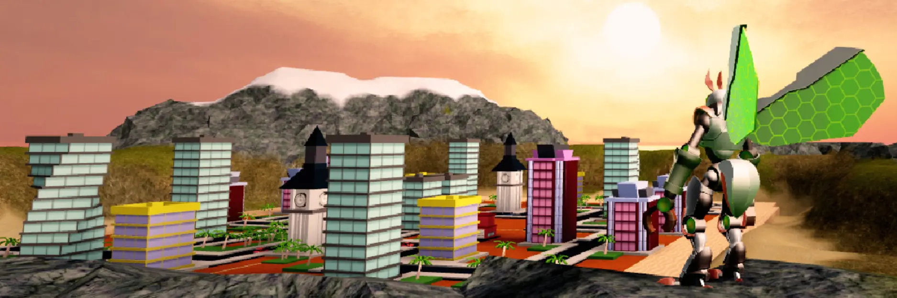
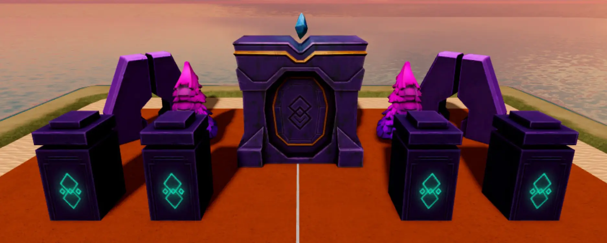
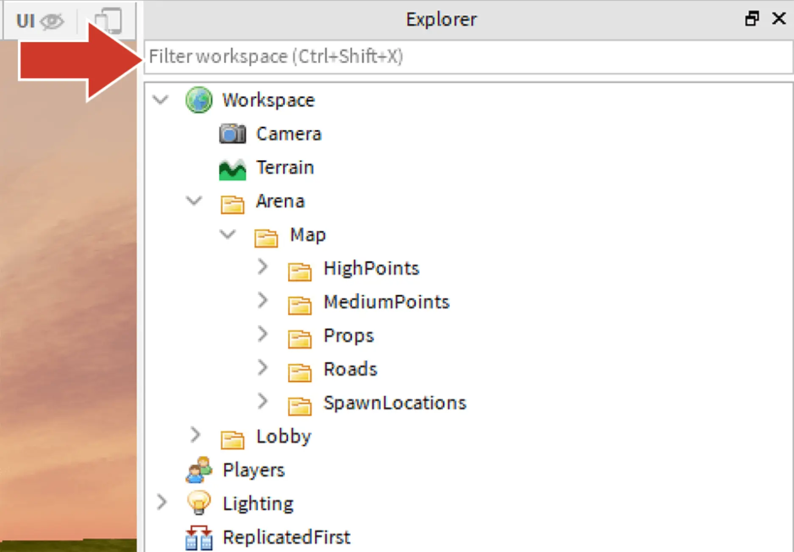
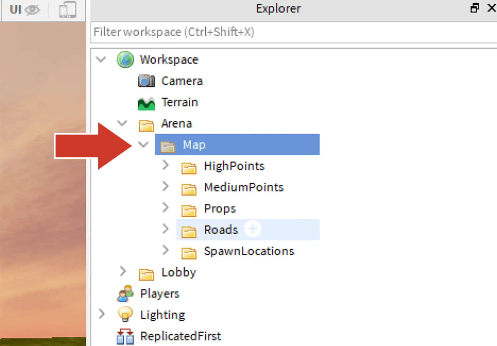
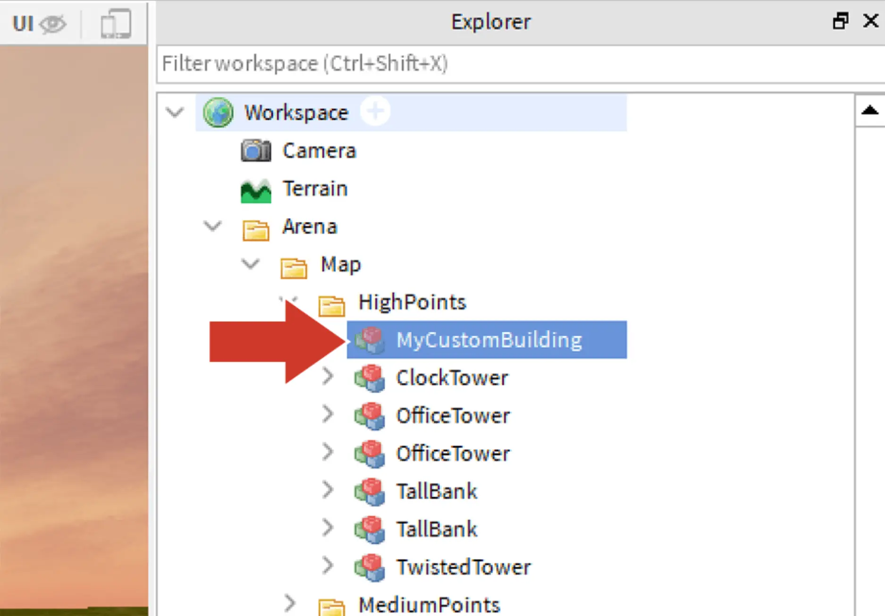

# Finish the Challenge

## 목차
- [Finish the Challenge](#finish-the-challenge)
  - [목차](#목차)
  - [사용자 지정 모델](#사용자-지정-모델)
    - [모델 찾기](#모델-찾기)
    - [모델 추가](#모델-추가)
  - [출처](#출처)
  - [다음](#다음)

---

**축하합니다!** 크리에이터 챌린지를 완료했습니다. 이것은 단지 시작에 불과합니다.

더 배우고 싶다면, 아래의 튜토리얼을 통해 새로운 건물로 지도를 개선하는 방법을 알아보세요.

## 사용자 지정 모델

지도에는 미리 제작된 건물이 포함되어 있지만, 판타지 성이나 거대한 음식물 같은 다른 시각적 요소를 사용할 수도 있습니다.

어떤 모델이든 점수를 위해 파괴될 수 있지만, 특정 폴더에 배치되어야 합니다. 다른 Studio 파일에서 객체를 복사하여 템플릿에 붙여넣을 수도 있습니다.

### 모델 찾기

건물은 Studio에서 구성하는 모든 것이 될 수 있습니다. 모델 구성을 배우거나 마켓플레이스에서 신뢰할 수 있는 객체를 샘플링할 수 있습니다.

### 모델 추가

모델은 게임 내에서 인터랙티브하려면 특정 폴더에 배치되어야 합니다.

1. 탐색기 상단에서 모든 검색 필터를 삭제합니다.

   

2. **Workspace** > **Arena** > **Map**을 확장합니다. **HighPoints**와 같은 폴더는 코드가 파괴할 수 있는 부분을 찾고 점수를 계산하는 위치입니다.

   

3. 건물과 소품을 HighPoints, MediumPoints 또는 LowPoints 폴더에 배치하여 파괴될 때의 가치에 따라 배치합니다.

   

---
## 출처
[Finish the Challenge](https://create.roblox.com/docs/ko-kr/education/build-it-play-it-create-and-destroy/finish-the-challenge)

---
## [다음](07_01_Story_Games_Project.md)
