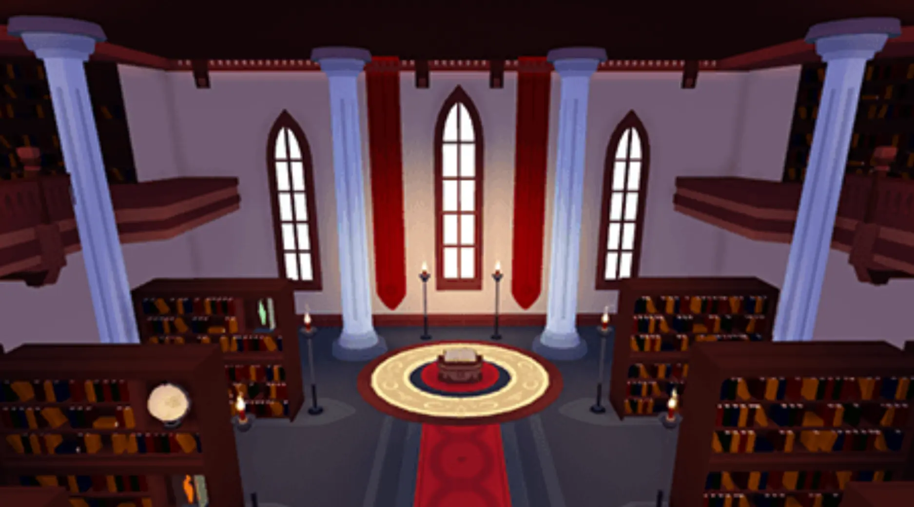
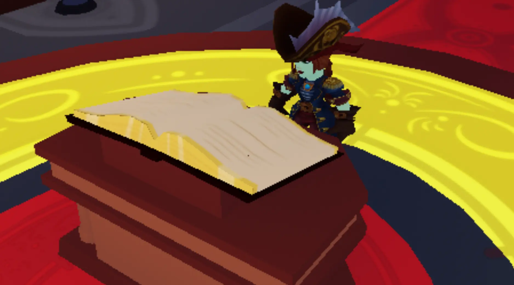
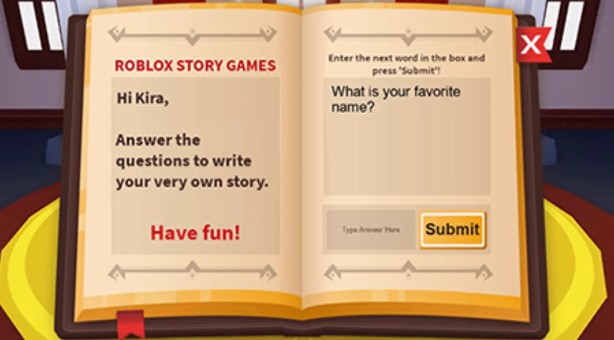
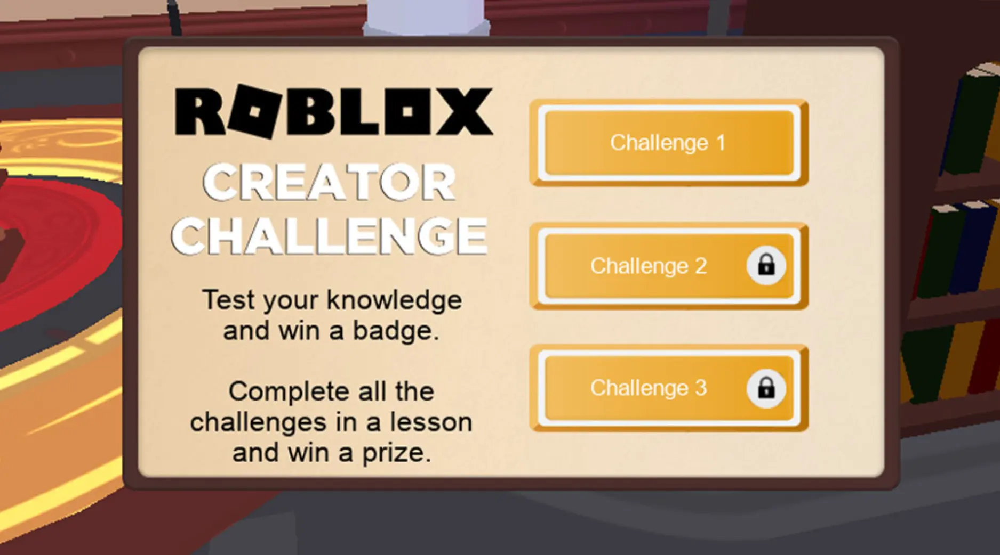

# Story Games Project

## 목차
- [Story Games Project](#story-games-project)
  - [목차](#목차)
    - [코딩 여정](#코딩-여정)
  - [출처](#출처)
  - [다음](#다음)

---

Roblox 스토리 게임에서는 단어가 사라지고 플레이어가 빈칸을 채워야 합니다! Roblox의 무료 코딩 및 디자인 도구를 사용하여 자신만의 스토리 게임을 코딩하여 **Hour of Code**™에 참여하세요. 코딩 지식을 증명하여 독점 배지와 아바타 아이템을 획득하세요.

아래 동영상을 재생하여 작업할 도서관과 게임 실행 모습을 확인하세요.

<video controls src="../img/07_01_Story_Games_Project/wccVideo_final_wSound.mp4" width="100%"></video>

### 코딩 여정

세 가지 다른 레슨을 통해 스토리 게임을 만들 것입니다. 각 레슨에는 처음부터 끝까지 게임을 코딩하는 방법을 가르치는 지침이 포함되어 있습니다.

레슨을 완료한 후에는 Roblox에서 퀴즈 게임을 플레이하여 상품을 획득할 기회를 얻습니다. 상품을 획득한 후 다음 레슨을 계속 진행하세요.

<GridContainer numColumns="3">
  <figure>
    
    <figcaption>1: 변수 생성하기</figcaption>
  </figure>
  <figure>
    
    <figcaption>2: 플레이어의 답변 받기</figcaption>
  </figure>
  <figure>
    
    <figcaption>3: 이야기하기</figcaption>
  </figure>
</GridContainer>

레슨을 완료한 후에는 Roblox에서 퀴즈 게임을 플레이하여 상품을 획득할 기회를 얻습니다. 상품을 획득한 후 다음 레슨을 계속 진행하세요.

---
## 출처
[Story Games Project](https://create.roblox.com/docs/ko-kr/education/build-it-play-it-story-games/landing)

---
## [다음](07_02_Writing_the_Story.md)
