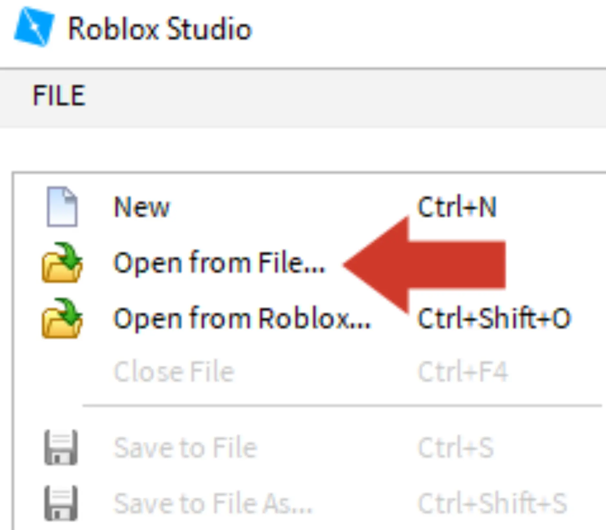
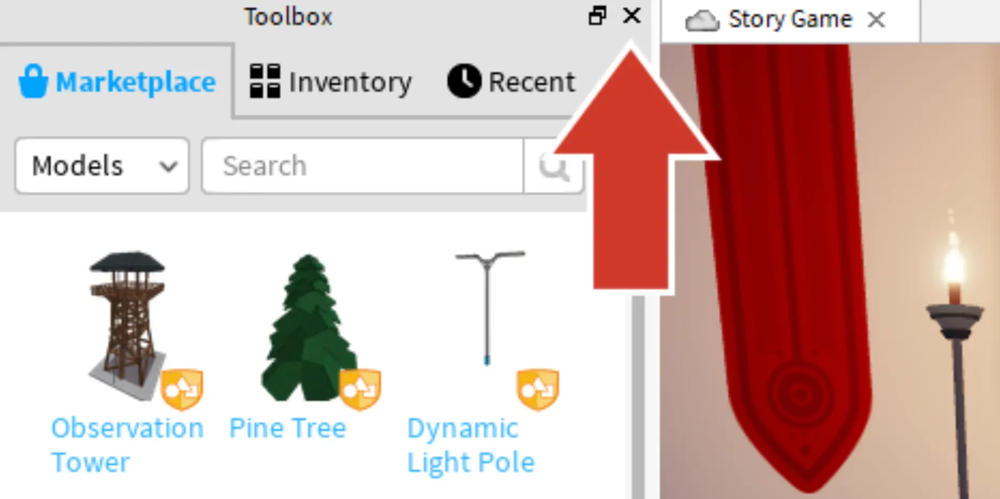
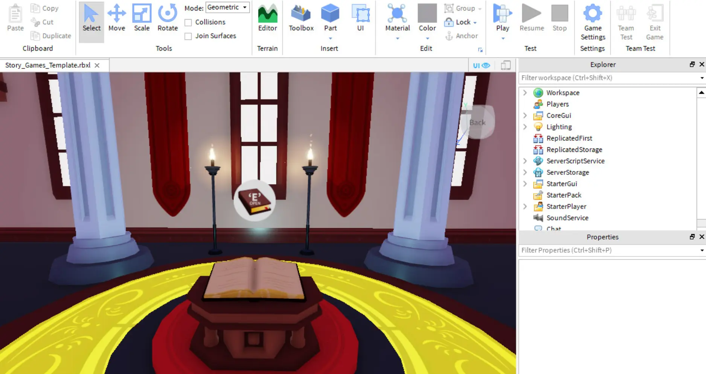

# Opening the Template

## 목차
- [Opening the Template](#opening-the-template)
  - [목차](#목차)
  - [Roblox Studio 시작하기](#roblox-studio-시작하기)
  - [템플릿 열기](#템플릿-열기)
  - [추가 창 닫기](#추가-창-닫기)
  - [출처](#출처)
  - [다음](#다음)

---

이야기를 만들었으니 이제 Roblox를 사용하여 그 비전을 코드로 변환할 시간입니다.

## Roblox Studio 시작하기

이 경험은 **Roblox Studio**를 사용하여 생성됩니다. 무료로 사용할 수 있으며 iPhone, Android, Xbox Live, PC, Mac, VR에 게임을 즉시 게시할 수 있습니다.

1. 바탕 화면의 아이콘을 더블 클릭(Windows)하거나 도크 아이콘을 클릭(Mac)하여 **Roblox Studio**를 엽니다.
2. 로그인 화면에서 Roblox 사용자 이름과 비밀번호를 입력한 후 로그인(Log In) 버튼을 클릭합니다.

## 템플릿 열기

이 경험이 작동하는 데 필요한 모든 것을 갖춘 템플릿이 만들어졌습니다. 템플릿은 실제 이야기 코드를 제외한 모든 것을 포함하고 있습니다. 템플릿은 자신만의 경험을 만들 수 있는 기본 세계입니다.

1. 템플릿을 다운로드합니다.

   <a href="https://prod.docsiteassets.roblox.com/assets/education/story-games/Story_Games_Template.rbxl">
   <Button variant="contained">Download Template</Button>
   </a>

2. Roblox Studio의 왼쪽 상단에서 **파일(File)** > **파일에서 열기(Open from File)**를 클릭하고 다운로드한 파일을 선택합니다.

   

## 추가 창 닫기

Roblox Studio를 처음 실행하면 지금 당장은 필요하지 않은 추가 창이 열릴 수 있습니다. 추가 창을 닫으면 작업 공간이 더 넓어집니다.

1. Studio의 **왼쪽**에 있는 모든 창을 **X**를 클릭하여 닫습니다. 닫을 것이 보이지 않으면 다음 단계로 넘어갑니다.

   

2. 오른쪽에 있는 **Explorer** 창은 그대로 둡니다. Studio를 아래 이미지처럼 설정합니다. Explorer가 보이지 않으면 View 탭을 클릭하고 Explorer 아이콘을 클릭합니다.

   

---
## 출처
[Opening the Template](https://create.roblox.com/docs/ko-kr/education/build-it-play-it-story-games/opening-the-template)

---
## [다음](07_04_First_Challenge.md)
