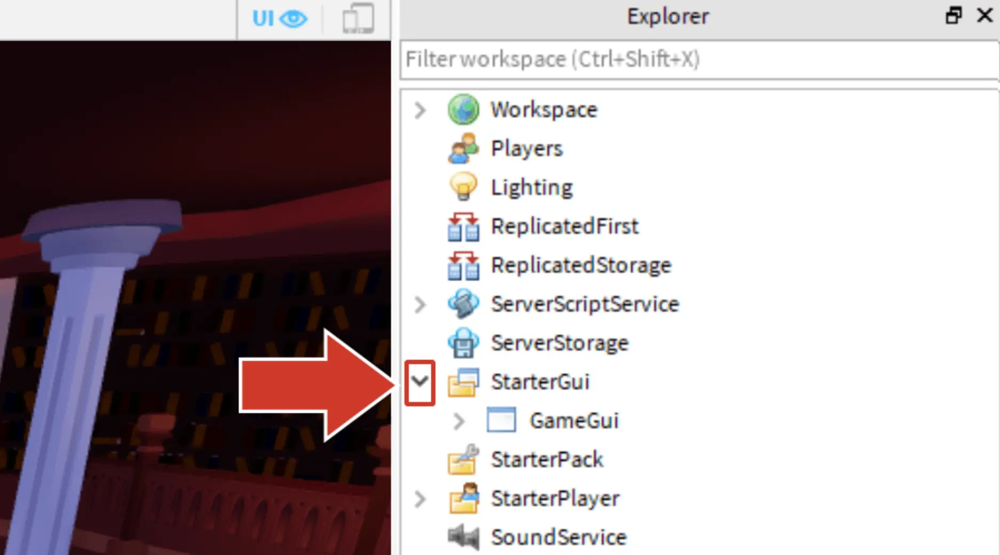
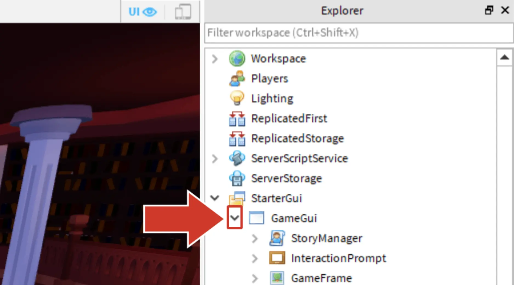
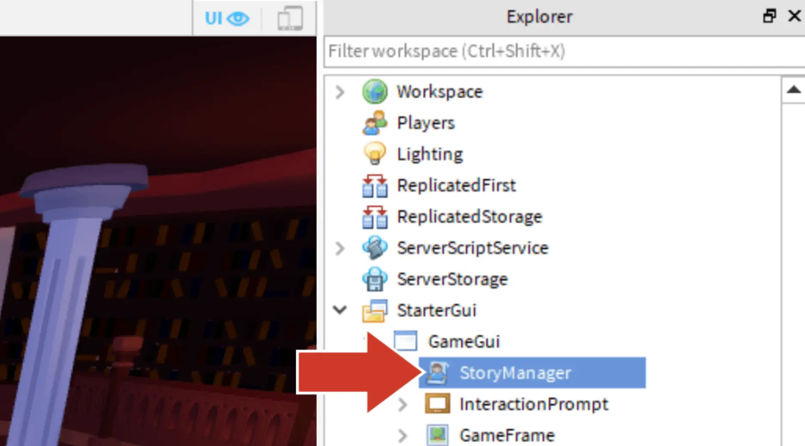

# Start Coding

## 목차
- [Start Coding](#start-coding)
  - [목차](#목차)
  - [StoryManager 찾기](#storymanager-찾기)
  - [스크립트 내용](#스크립트-내용)
  - [출처](#출처)
  - [다음](#다음)

---

Roblox에서는 코드가 Lua라는 코딩 언어를 사용하여 **스크립트** 내부에 작성됩니다. 게임은 보통 각 작업을 수행하는 별도의 스크립트를 갖고 있습니다. 라이브러리 템플릿에는 **StoryManager**라는 스크립트가 이미 포함되어 있으며, 이 스크립트에 단어 게임을 위한 코드를 추가할 것입니다.

## StoryManager 찾기

1. **Explorer** 창에서 **StarterGUI** 옆의 화살표를 클릭하여 그 아래에 있는 모든 항목을 확인합니다.

   

2. **GameGUI** 옆의 화살표를 클릭하여 해당 섹션을 확장합니다.

   

3. **StoryManager** 스크립트를 더블 클릭하여 엽니다.

   

## 스크립트 내용

이 스크립트에는 플레이어에게 완성된 이야기를 보여주기 위해 필요한 코드 중 일부가 이미 포함되어 있습니다. 여러분이 작성할 코드는 대시 라인 아래에 입력됩니다.

현재는 `--` 기호로 시작하는 코드의 큰 부분에 주목하세요. `--`로 시작하는 코드 라인은 **주석**이라고 하며, 이는 코더를 위한 메모를 남기는 데 사용되며 프로그램의 실행 방식에 영향을 미치지 않습니다.

```lua
-- GLOBAL VARIABLES
local storyMaker = require(script:WaitForChild("StoryMaker"))

-- Code controlling the game
local playing = true

while playing do
	storyMaker:Reset()

	-- Code story between the dashes
	-- =============================================


	-- =============================================

	-- Add the story variable between the parenthesis below
	storyMaker:Write()

	-- Play again?
	playing = storyMaker:PlayAgain()
end
```

---
## 출처
[Start Coding](https://create.roblox.com/docs/ko-kr/education/build-it-play-it-story-games/start-coding)

---
## [다음](07_06_Coding_a_Question.md)
