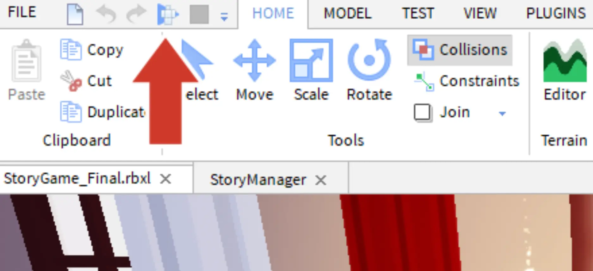
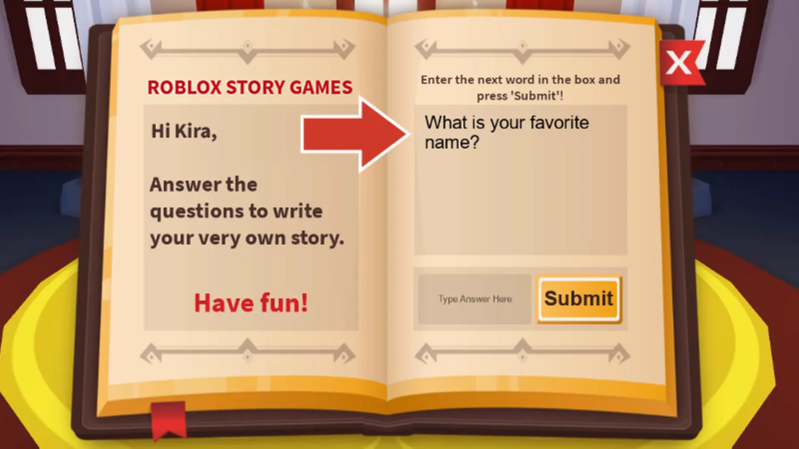
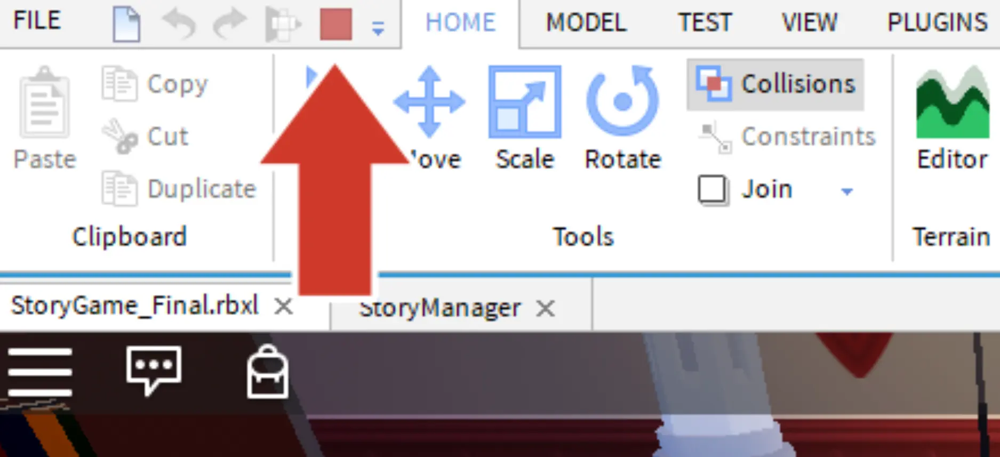
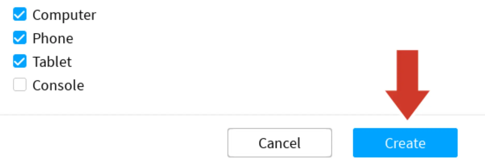

# Test and Save

## 목차
- [Test and Save](#test-and-save)
  - [목차](#목차)
  - [코드 저장하기](#코드-저장하기)
  - [출처](#출처)
  - [다음](#다음)

---

이 시점에서 코드를 점검하고 실행되는지 확인하는 것이 좋습니다. 코드를 자주 테스트하면 어디에서 실수를 했는지 쉽게 파악할 수 있습니다.

1. **Play** 버튼을 클릭하여 코드를 테스트합니다.

   

2. 키보드의 <kbd>W A S D</kbd> 키를 사용하여 단상으로 걸어가서 <kbd>E</kbd> 키를 누릅니다.

   <table>
    <thead>
      <tr>
        <th>조작 키</th>
        <th>동작</th>
      </tr>
    </thead>
    <tbody>
      <tr>
        <td><kbd>W</kbd></td>
        <td>카메라를 앞으로 이동합니다.</td>
      </tr>
        <tr>
        <td><kbd>S</kbd></td>
        <td>카메라를 뒤로 이동합니다.</td>
      </tr>
        <tr>
        <td><kbd>A</kbd></td>
        <td>카메라를 왼쪽으로 이동합니다.</td>
      </tr>
        <tr>
        <td><kbd>D</kbd></td>
        <td>카메라를 오른쪽으로 이동합니다.</td>
      </tr>
        <tr>
        <td><kbd>Spacebar</kbd></td>
        <td>플레이어 캐릭터가 점프합니다.</td>
      </tr>
        <tr>
        <td><kbd>오른쪽 마우스 버튼</kbd>을 누른 채로 드래그</td>
        <td>카메라 뷰를 이동합니다.</td>
      </tr>
    </tbody>
   </table>

3. 질문이 표시되는지 확인합니다. 질문에 답변을 하거나 "Submit" 버튼을 클릭하지 **마세요**. 그 코드가 아직 작성되지 않았습니다.

   

4. **Stop** 버튼을 클릭하여 플레이 테스트를 중지합니다.

   

## 코드 저장하기

전체 프로젝트를 **Roblox에 게시**하여 저장하는 것이 중요합니다. 작업하는 동안 또는 큰 변화를 준 후에 10분마다 게시하는 것이 좋습니다.

1. 파일 선택 → Roblox에 게시를 선택하여 게시 창을 엽니다.

   

2. 장소 이름과 선택적인 설명을 입력합니다.

   

3. **원할 경우** Phone과 Tablet을 체크합니다. 준비가 되면 **Create** 버튼을 클릭합니다. 게시가 완료되면, 게임은 계정에 연결되어 있기 때문에 어떤 컴퓨터에서든 수정할 수 있습니다.

   

---
## 출처
[Test and Save](https://create.roblox.com/docs/ko-kr/education/build-it-play-it-story-games/test-and-save)

---
## [다음](07_08_Second_Challenge.md)
