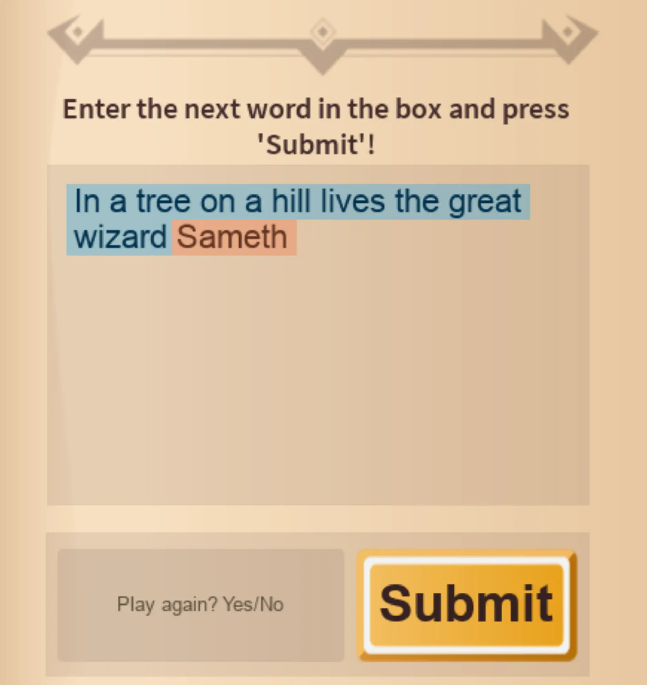

# Coding the Story

## 목차
- [Coding the Story](#coding-the-story)
  - [목차](#목차)
  - [첫 번째 문자열 코딩하기](#첫-번째-문자열-코딩하기)
  - [이름 추가하기](#이름-추가하기)
  - [이야기 보여주기](#이야기-보여주기)
    - [문제 해결 팁](#문제-해결-팁)
  - [출처](#출처)
  - [다음](#다음)

---

플레이어가 모든 질문에 답하면, 그들의 답변이 이야기와 결합된 모습을 볼 수 있습니다. 이야기는 문자열을 사용하여 변수에 저장되고, 플레이어의 답변이 들어있는 문자열과 결합됩니다.

## 첫 번째 문자열 코딩하기

기억하시나요? 당신이 작성한 이야기의 첫 문장입니다. 이제 이를 코드에 추가할 시간입니다.

1. 플레이 테스트가 중지되었는지 확인하세요.
2. 게임 에디터 위의 StoryManager 스크립트 탭을 클릭하여 스크립트로 돌아가세요. 스크립트가 보이지 않으면 Explorer에서 StoryManager를 찾아 더블 클릭하세요.
3. 질문을 입력한 곳 아래에 `story`라는 새 변수를 만드세요. 변수 이름이 **소문자**인지 확인하세요.

   ```lua
     -- Code story between the dashes
     -- =============================================
        local name1 = storyMaker:GetInput("What is your favorite name?")

        local story
     -- =============================================
   end
   ```

4. 첫 번째 문자열을 찾으려면 원래 이야기로 돌아가 첫 번째 플레이스홀더 **이전**의 모든 내용을 원이나 하이라이트로 표시하세요. 변수가 문장의 중간에 있다면, 나머지는 나중에 추가할 수 있습니다.

   **원래 플레이스홀더**: _In a tree on a hill, lives the great wizard_ name1.

5. 이야기 변수가 문자열을 저장하도록 아래와 같이 작성하세요. 마지막 단어 뒤에 공백을 추가한 후 따옴표를 닫는 것을 잊지 마세요.

   ```lua
     -- Code story between the dashes
     -- =============================================
        local name1 = storyMaker:GetInput("What is your favorite name?")

        local story = "In a tree on a hill lives the great wizard "
     -- =============================================
   ```

## 이름 추가하기

다음으로, 이야기의 첫 번째 문자열을 플레이어의 답변과 결합해야 합니다. 여러 가지를 결합하는 것을 **연결(concatenation)**이라고 합니다. 두 문자열을 결합하려면 `..`를 사용하세요.

1. 이야기 변수와 같은 줄에 ..을 입력하세요.

   ```lua
     -- Code story between the dashes
     -- =============================================
        local name1 = storyMaker:GetInput("What is your favorite name?")

        local story = "In a tree on a hill lives the great wizard " ..
     -- =============================================
   ```

2. 같은 줄에서 플레이어의 답변을 저장하는 변수의 이름을 입력하세요.

   ```lua
       -- Code story between the dashes
       -- =============================================
           local name1 = storyMaker:GetInput("What is your favorite name?")

           local story = "In a tree on a hill lives the great wizard " .. name1
       -- =============================================
   ```

## 이야기 보여주기

이제 이야기를 작성했으니, 플레이어에게 보여줘야 합니다.

1. 두 번째 대시 줄 아래에서 `storyMaker:Write()`를 찾으세요. 괄호 `()` 사이에 `story` 변수를 입력하세요. 이는 프로그램이 게임에서 이야기를 작성하도록 지시합니다.

   ```lua
     -- Code story between the dashes
     -- =============================================
         local name1 = storyMaker:GetInput("What is your favorite name?")

         local story = "In a tree on a hill lives the great wizard " .. name1
     -- =============================================


       -- Add the story variable between the parenthesis below
       storyMaker:Write(story)
   ```

2. 게임을 플레이 테스트하세요. 아래 그림에서 다른 색으로 표시된 두 문자열이 결합된 것을 볼 수 있어야 합니다.

   

### 문제 해결 팁

문장이 표시되지 않는다면, 다음 중 하나를 시도해 보세요.

**질문이 표시되지 않는 경우**:

- 질문이 따옴표 안에 있는지 확인하세요.

**이야기가 결합되지 않는 경우**:

- 이야기의 첫 부분이 따옴표 안에 있는지 확인하세요.
- 플레이어의 답변을 저장하는 변수의 이름이 정확하게 일치하는지 확인하세요. 대소문자가 중요합니다!
- 플레이어의 답변을 저장하는 변수의 이름이 따옴표 안에 있지 않은지 확인하세요.
- 두 문자열이 `..`로 분리되어 있는지 확인하세요.

**이야기가 나타나지 않는 경우**:

- `storyMaker:Write()`를 확인하세요. 괄호 `()` 사이에 `story` 변수가 있는지 확인하세요.

---
## 출처
[Coding the Story](https://create.roblox.com/docs/ko-kr/education/build-it-play-it-story-games/code-the-story)

---
## [다음](07_10_Finishing_and_Add_More.md)
