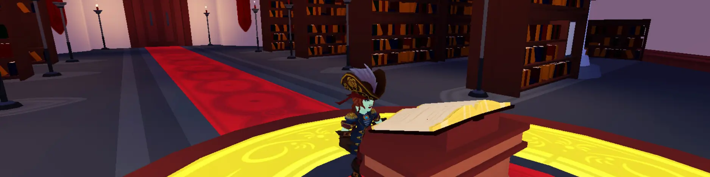

# Finishing and Add More

## 목차
- [Finishing and Add More](#finishing-and-add-more)
  - [목차](#목차)
  - [문장 마무리하기](#문장-마무리하기)
  - [두 번째 질문 추가하기](#두-번째-질문-추가하기)
  - [선택적 추가 사항](#선택적-추가-사항)
    - [변수를 여러 번 사용하기](#변수를-여러-번-사용하기)
    - [줄 바꿈 추가하기](#줄-바꿈-추가하기)
  - [출처](#출처)
  - [다음](#다음)

---



당신의 프로젝트가 거의 완성되었습니다!

남은 작업은 첫 번째 문장을 완성하고, 플레이어에게 더 많은 선택권을 제공하기 위해 다른 질문을 추가하는 것입니다.

## 문장 마무리하기

문장에 더 많은 단어나 구두점을 추가하려면 연결을 사용하여 다른 문자열을 추가하세요.

1. 이야기 변수와 같은 줄에 `..`을 입력하세요.
2. 나머지 문장이나 구두점이 포함된 다른 문자열을 추가하세요. 문장의 끝에 공백을 추가하는 것을 잊지 마세요.

   ```lua
     -- Code story between the dashes
     -- =============================================
        local name1 = storyMaker:GetInput("What is your favorite name?")

        local story = "In a tree on a hill lives the great wizard " .. name1 .. ". "
     -- =============================================
   ```

## 두 번째 질문 추가하기

두 번째 질문을 하려면 새 질문을 만들고 이야기를 저장하는 동일한 변수에 계속 추가하세요.

1. 이야기의 두 번째 문장에서 삭제할 단어를 결정하세요.

   **원래 플레이스홀더:** _Every morning, the wizard loves eating a giant bowl of honey roasted_ **food1**.

2. 첫 번째 변수 아래에 새로운 변수를 만들어 플레이스홀더로 사용하세요.

   ```lua
      local name1 = storyMaker:GetInput("What is your favorite name?")
      local food1

      local story = "In a tree on a hill lives the great wizard " .. name1 .. ". "
   ```

3. `storyMaker:GetInput("")`를 사용하여 플레이어에게 질문을 하고 그들의 답변을 저장하세요.

   ```lua
      local name1 = storyMaker:GetInput("What is your favorite name?")
      local food1 = storyMaker:GetInput("What is your favorite food?")

      local story = "In a tree on a hill lives the great wizard " .. name1 .. ". "
   ```

4. 이야기 변수에서 `..`을 사용하여 다음 이야기 문자열을 연결하세요. 문장의 끝에 공백을 포함하는 것을 잊지 마세요.

   ```lua
   local name1 = storyMaker:GetInput("What is your favorite name?")
   local food1 = storyMaker:GetInput("What is your favorite food?")

   local story = "In a tree on a hill lives the great wizard " .. name1 .. ". " .. "Every morning, the wizard loves eating a giant bowl of honey roasted "
   ```

   <Alert severity="info">
   긴 문장을 위해 코드 에디터 창을 오른쪽으로 스크롤해야 할 수 있습니다.
   </Alert>

5. 새로운 이야기 문자열 다음에 두 번째 질문에 대한 답변을 연결하고 구두점으로 마무리하세요.

   ```lua
   local name1 = storyMaker:GetInput("What is your favorite name?")
   local food1 = storyMaker:GetInput("What is your favorite food?")

   local story = "In a tree on a hill lives the great wizard " .. name1 .. ". " .. "Every morning, the wizard loves eating a giant bowl of honey roasted " .. food1 .. ". "
   ```

## 선택적 추가 사항

이야기를 더 발전시키고 싶다면, 몇 가지 아이디어를 포함했습니다. 예를 들어, 이야기를 개선하는 몇 가지 방법은 다음과 같습니다:

- 이야기의 더 많은 줄을 추가하세요.
- 새로운 변수와 문자열 세트를 추가할 때마다 게임을 플레이 테스트하세요.
- 친구나 동료에게 어떤 단어를 맞춤화하고 싶은지 물어보세요.

또한, 플레이어에게 더 재미있는 이야기를 만들기 위한 몇 가지 **팁과 트릭**도 아래에 포함되어 있습니다.

### 변수를 여러 번 사용하기

변수는 여러 번 사용할 수 있습니다. 단어를 포함하고 싶은 문자열 사이에 연결을 사용하세요.

**예제 코드**:
`"I am " .. name1 .. " and you are in the palace of " .. name1 .. "!"`

**결과**:
I am Sameth and you are in the palace of Sameth!

### 줄 바꿈 추가하기

문자열에 `\n`을 입력하여 줄 바꿈을 추가할 수 있습니다. 또한, `\n\n`과 같이 여러 줄 바꿈을 결합할 수 있습니다.

**예제 코드**:
`"One \n Two \n\n Three"`

**결과**:

One

Two
<br />
<br />
Three

---
## 출처
[Finishing and Add More](https://create.roblox.com/docs/ko-kr/education/build-it-play-it-story-games/finish-and-add)

---
## [다음](07_11_Third_Challenge.md)
