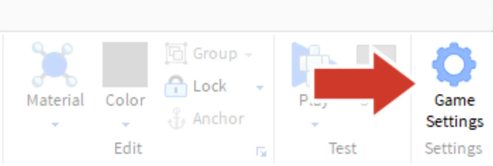
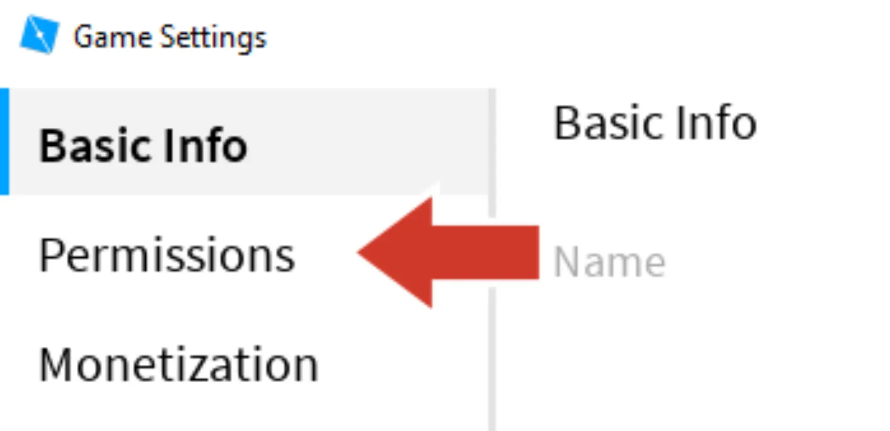
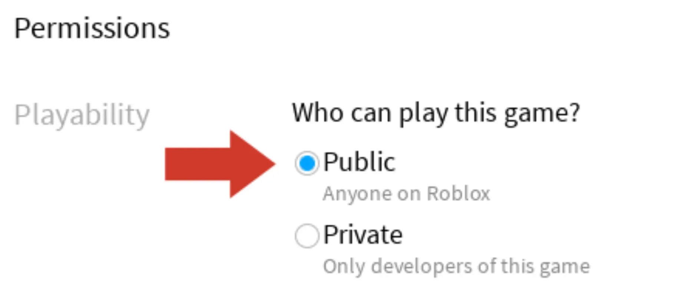
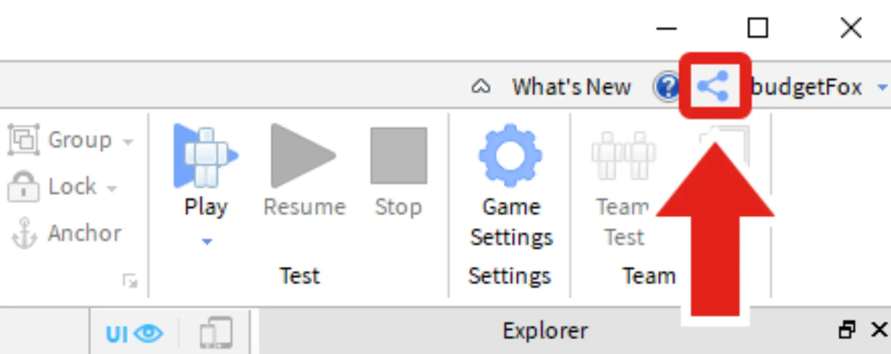
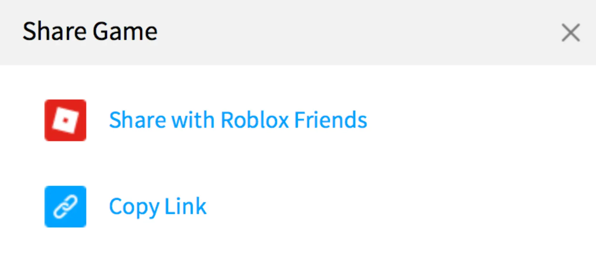

# Completing the Challenge

## 목차
- [Completing the Challenge](#completing-the-challenge)
  - [목차](#목차)
  - [경험 공유하기](#경험-공유하기)
  - [이야기 더하기](#이야기-더하기)
  - [출처](#출처)

---

**축하합니다**, 최신 Roblox Creator Challenge를 완료했습니다!

게임을 완성한 지금, 게임을 더욱 발전시키고 학습을 계속할 수 있는 몇 가지 아이디어를 소개합니다.

## 경험 공유하기

Roblox의 가장 흥미로운 기능 중 하나는 친구들과 쉽게 게임을 공유할 수 있다는 점입니다. 현재 게임은 아마도 비공개 상태일 것입니다. 즉, 오직 당신만이 플레이할 수 있습니다. 친구들이 게임을 보려면 공개로 설정해야 합니다.

1. **홈** 탭에서 **게임 설정**을 클릭합니다.

   

2. 왼쪽 메뉴에서 **권한**을 선택합니다.

   

3. **공개**를 선택한 후 **저장**을 클릭합니다.

   

4. Studio의 오른쪽 상단에서 **공유** 버튼을 클릭합니다. 이렇게 하면 경험을 공유할 수 있는 링크를 얻을 수 있습니다.

   

5. 팝업에서 원하는 공유 방법을 클릭합니다.
   

## 이야기 더하기

도전을 완료했지만, 이야기에는 항상 더 많은 내용을 추가할 수 있습니다.

다음은 몇 가지 아이디어입니다:

**더 많은 캐릭터 추가** – 이야기 속에 한두 명의 캐릭터를 더 생각해보세요. 각 캐릭터에 대해 name2나 name3과 같은 새 변수를 생성하는 것을 잊지 마세요.

**더 많은 문장 추가** – 이야기의 새로운 문장을 작성하고 대체할 수 있는 객체를 선택해보세요.

---
## 출처
[Completing the Challenge](https://create.roblox.com/docs/ko-kr/education/build-it-play-it-story-games/complete-the-challenge)
