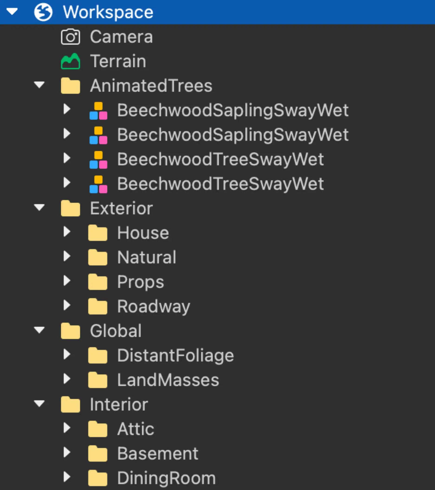
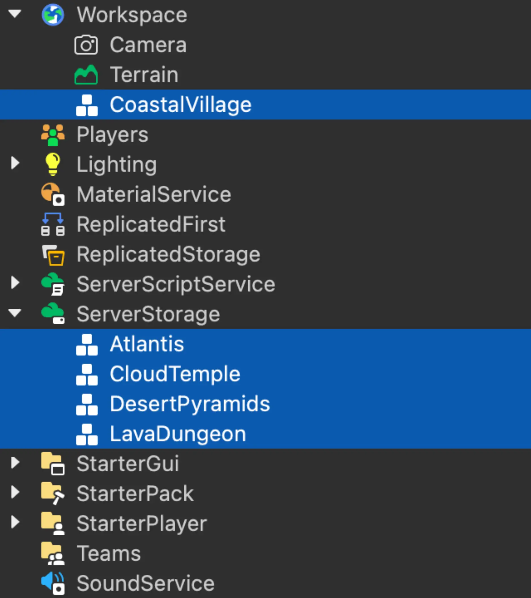

# Data Model

## 목차
- [Data Model](#data-model)
  - [목차](#목차)
  - [객체](#객체)
    - [3D 빌딩 블록](#3d-빌딩-블록)
    - [스크립트](#스크립트)
  - [객체 구성](#객체-구성)
    - [Workspace](#workspace)
    - [환경](#환경)
    - [복제](#복제)
    - [서버](#서버)
    - [클라이언트](#클라이언트)
    - [채팅](#채팅)
  - [폴더 및 모델](#폴더-및-모델)
  - [출처](#출처)
  - [다음](#다음)

---

모든 장소는 해당 장소에 대한 모든 것을 설명하는 객체 계층 구조인 데이터 모델로 표현됩니다. 데이터 모델은 부품, 지형, 조명 및 기타 환경 요소와 같은 3D 세계를 구성하는 모든 객체를 포함합니다. 또한 속성을 수정하고, 메서드 및 함수를 호출하며, 동적 동작 및 상호 작용을 가능하게 하는 이벤트에 응답하는 스크립트와 같은 런타임 동작을 제어할 수 있는 객체도 포함됩니다.

Roblox 엔진은 장소 상태에 대한 진실의 원천으로 데이터 모델을 사용하여 클라이언트 장치에서 이를 시뮬레이션하고 렌더링할 수 있습니다. Roblox 엔진이 데이터 모델을 해석하는 방법에 대한 자세한 내용은 [클라이언트-서버 런타임]을 참조하세요.

## 객체

Roblox에서 장소를 설명하기 위해 데이터 모델에 객체를 배치하고 구성합니다. Roblox의 모든 객체는 `Class.Instance` 클래스에서 상속되며, 이는 모든 객체에 공통된 일반 속성, 메서드 및 이벤트를 정의합니다. 객체는 제공하는 기능에 따라 고유한 특성도 정의합니다. 다양한 용도로 사용되는 여러 범주의 객체가 있지만, 자주 사용하게 될 객체는 `Class.BasePart`와 `Class.LuaSourceContainer` 객체입니다. 이는 일반적으로 부품과 스크립트라고 불립니다.

Roblox 엔진의 모든 기능에 대한 포괄적인 목록은 [참조 문서]를 참조하세요.

### 3D 빌딩 블록

`Class.BasePart`는 물리적으로 시뮬레이션된 세계의 3D 빌딩 블록을 위한 핵심 클래스입니다. 위치, 크기 및 방향과 같은 속성을 포함하여 모든 물리적 객체에 공통된 속성과 메서드를 정의합니다.

<table>
<thead>
  <tr>
    <th>객체</th>
    <th>설명</th>
  </tr>
</thead>
<tbody>
  <tr>
    <td>`Class.Part`</td>
    <td>블록, 공, 실린더, 쐐기 또는 코너 쐐기 모양을 취할 수 있는 기본 [부품](../parts/index.md).</td>
  </tr>
	<tr>
    <td>`Class.MeshPart`</td>
    <td>Maya 또는 Blender와 같은 3D 모델링 소프트웨어에서 가져온 [메시](../parts/meshes.md).</td>
  </tr>
	<tr>
    <td>`Class.TrussPart`</td>
    <td>캐릭터가 사다리처럼 오를 수 있는 트러스 빔.</td>
  </tr>
</tbody>
</table>

단순한 부품만으로 완전히 기능적인 Roblox 경험을 만들 수 있지만, 대부분의 경우 [메시]를 가져오고 원시 부품을 결합하여 더 복잡한 객체와 구조를 만들게 됩니다. [솔리드 모델링]을 통해 이를 수행할 수 있습니다.

### 스크립트

스크립트를 사용하여 장소의 3D 세계에 상호작용 및 동작을 추가하고 논리를 정의할 수 있습니다. Lua 프로그래밍 언어로 스크립트를 작성하여 부품을 이동하고, 다른 스크립트를 호출하며, 이벤트에 응답하는 등의 작업을 수행할 수 있습니다. Roblox는 클라이언트-서버 모델에서 작동하므로 스크립트를 서버에서 실행하거나, 클라이언트에서 실행하거나, 네트워크 경계를 넘어 통신할 수 있습니다.

- `Class.Script` 객체는 서버에서만 실행할 수 있는 스크립트를 나타냅니다.
- `Class.LocalScript` 객체는 클라이언트에서만 실행할 수 있는 스크립트를 나타냅니다.
- `Class.ModuleScript` 객체는 서버 및 클라이언트 스크립트에서 `Global.RobloxGlobals.require()`를 통해 사용할 수 있는 재사용 가능한 스크립트를 나타냅니다.

스크립트가 제대로 동작하려면 데이터 모델에서 올바른 컨테이너에 배치해야 합니다. 자세한 내용은 [서버] 및 [클라이언트] 섹션을 참조하세요.

## 객체 구성

데이터 모델을 어떻게 구성할지는 자유롭지만, Roblox 엔진은 특정 객체가 특정 **컨테이너 서비스**에 있어야 합니다. 컨테이너 서비스는 특정 동작을 가지고 있으며, 그 안에 있는 객체의 동작에 영향을 줄 수 있습니다. 주요 컨테이너 서비스 범주는 다음과 같습니다:

- **Workspace** - `Class.Workspace`는 3D 세계에서 렌더링되는 모든 객체를 저장합니다.
- **Environment** - `Class.Lighting` 및 `Class.SoundService`와 같은 환경 설정 및 요소를 위한 컨테이너입니다.
- **Replication** - 서버와 클라이언트 간에 콘텐츠와 논리를 복제하는 컨테이너입니다. 예를 들어, `Class.ReplicatedStorage` 및 `Class.ReplicatedFirst`가 있습니다.
- **Server** - 서버 측 전용 콘텐츠와 논리를 위한 컨테이너입니다. 예를 들어, `Class.ServerScriptService` 및 `Class.ServerStorage`가 있습니다.
- **Client** - 클라이언트 측 콘텐츠와 논리를 위한 컨테이너입니다. 예를 들어, `Class.StarterPlayer` 및 `Class.StarterGui`가 있습니다.
- **Chat** - 채팅 기능을 활성화하는 객체를 위한 컨테이너입니다. 예를 들어, `Class.VoiceChatService` 및 `Class.TextChatService`가 있습니다.

<Alert severity="info">
Roblox 엔진에는 스크립트 내에서 호출할 수 있는 기본 제공 기능을 제공하는 더 많은 서비스가 있습니다. 데이터 모델에서 이러한 서비스에 특별한 처리를 하지 않습니다. 자세한 내용은 [서비스]를 참조하세요.
</Alert>

또한 다음 객체를 사용하여 객체를 더 조직할 수 있습니다:

- **Folders** - `Class.Folder`는 조직 목적으로 사용되며 동작을 정의하지 않습니다. 예를 들어, 서버 스토리지에 유사한 스크립트 세트를 그룹화하는 데 폴더를 사용할 수 있습니다.
- **Models** - `Class.Model`은 주로 의자, 테이블, 램프를 포함하는 책상 세트와 같이 부품의 기하학적 그룹화를 위해 사용됩니다. 더 복잡한 세트를 구성하기 위해 모델을 모델 내에 중첩할 수도 있습니다.

### Workspace

`Class.Workspace`는 장소의 3D 세계를 구성하는 모든 객체를 포함합니다. 베이스 부품, 메시 부품 및 모델과 같은 객체를 워크스페이스에 추가하여 3D 세계를 사용자 정의할 수 있습니다. 클라이언트는 이 컨테이너에 나타나는 모든 것을 렌더링하고 그 외의 것은 렌더링하지 않으므로 장소에서 사용자가 볼 수 있고 상호작용할 수 있는 것을 제어할 수 있습니다. 렌더링되지 않지만, 관련된 부품과 모델에 속한 스크립트를 추가할 수도 있습니다. 기본적으로 워크스페이스는 `Class.Terrain` 및 `Class.Camera` 객체로 미리 채워져 있습니다.

<h4>카메라</h4>

`Class.Camera`는 클라이언트가 3D 세계를 보는 방식을 결정합니다. 기본적으로 워크스페이스에는 하나의 카메라가 있지만, 다른 관점과 뷰를 생성하기 위해 여러 카메라 객체를 추가할 수 있습니다. 모든 클라이언트는 이러한 설정을 가져와 자체 카메라 뷰를 생성하며, 서버는 이를 직접 수정할 수 없습니다.

예를 들어, 카메라를 사용자의 움직임을 따라가도록 설정하거나 특정 위치에 고정되도록 설정할 수 있습니다. 시야, 거리 및 각도를 조정하여 사용자가 3D 세계를 보는 방식에 다양한 시각적 효과를 생성할 수 있습니다.

자세한 내용은 [카메라 사용자 정의]를 참조하세요.

<h4>지형</h4>

`Class.Terrain`을 사용하여 장소의 풍경을 만들 수 있습니다. 원하는 자연 환경을 시뮬레이션하기 위해 지형에 재료를 적용할 수 있습니다. 예를 들어, 풀, 물, 모래 또는 사용자 정의 재료를 사용할 수 있습니다. 하나의 지형 객체만 가질 수 있으며 그 지형에 하나의 재료만 적용할 수 있지만, [지형 편집기]를 사용하여 지형의 영역을 편집할 수 있습니다.

자세한 내용은 [환경 지형]을 참조하세요.

### 환경

조명 및 음향 효과를 추가하면 3D 세계가 훨씬 더 몰입감 있고 현실감 있게 됩니다. 이러한 효과를 장소에 추가할 필요는 없지만, 시각적 및 청각적으로 더 매력적으로 만들 수 있습니다.

<Alert severity="info">
조명 및 음향 서비스를 사용하는 것 외에도 빛과 소리를 방출하는 부품을 추가할 수 있습니다. 자세한 내용은 [조명 효과] 및 [음향 객체]를 참조하세요.
</Alert>

<h4>조명</h4>

`Class.Lighting`은 장소의 전역 조명 설정을 제어하는 객체를 포함합니다. 예를 들어, 대기 효과를 시뮬레이션하는 `Class.Atmosphere` 또는 환경에서 태양, 달 및 별을 변경하는 `Class.Sky` 객체가 있습니다.

자세한 내용은 [조명]을 참조하세요.

<h4>음향</h4>

`Class.SoundService`는 배경 음악 또는 환경 음향 효과를 위한 자식 `Class.Sound` 객체의 볼륨 및 재생 설정을 제어할 수 있습니다.

자세한 내용은 [음향]을 참조하세요.

### 복제

**복제**는 서버가 장소의 상태를 모든 연결된 클라이언트와 동기화하는 과정입니다. Roblox 엔진은 많은 경우에 대해 데이터, 물리 및 채팅 메시지를 서버와 클라이언트 간에 지능적이고 자동으로 복제하지만, 특정 객체를 복제하려면 특정 컨테이너에 배치해야 합니다.

<h4>ReplicatedFirst</h4>

`Class.ReplicatedFirst`는 클라이언트가 장소에 접속할 때 복제하고 싶은 객체를 포함합니다. 일반적으로 클라이언트를 초기화하는 데 필요한 클라이언트 측 `Class.LocalScript` 객체 및 해당 스크립트와 관련된 객체를 포함합니다. 이 컨테이너의 모든 콘텐츠는 서버에서 클라이언트로 한 번만 복제됩니다.

<h4>ReplicatedStorage</h4>

`Class.ReplicatedStorage`는 서버와 연결된 클라이언트 모두가 사용할 수 있는 객체를 포함합니다. 클라이언트에서 발생하는 변경 사항은 지속되지만 서버로 복제되지 않습니다. 서버는 일관성을 유지하기 위해 클라이언트의 변경 사항을 덮어쓸 수 있습니다. 이 컨테이너는 일반적으로 서버 측 `Class.Script` 및 클라이언트 측 `Class.LocalScript` 객체에서 공유하고 액세스해야 하는 `Class.ModuleScript` 객체에 사용됩니다. 또한, 예를 들어 모든 캐릭터 모델에 복제하고 부모로 설정할 `Class.ParticleEmitter`와 같은 객체를 복제할 필요가 없을 때 이 컨테이너를 사용할 수 있습니다.

복제 방식에 대한 자세한 내용은 [클라이언트-서버 런타임]을 참조하세요.

### 서버

데이터 모델은 클라이언트로 복제되지 않는 서버 측 전용 객체를 위한 전용 컨테이너를 정의합니다. 이를 통해 서버는 서버의 객체와 논리를 클라이언트에 노출하지 않고 클라이언트의 동작과 상태에 영향을 미칠 수 있습니다.

<Alert severity="info">
원격 이벤트 및 함수를 사용하여 클라이언트 측과 서버 간의 통신을 허용할 수 있습니다.
</Alert>

<h4>ServerScriptService</h4>

`Class.ServerScriptService`는 `Class.Script` 객체, 서버 스크립트에서 필요한 `Class.ModuleScript` 객체 및 서버에서만 사용하기 위한 기타 스크립팅 관련 객체를 포함합니다. 스크립트에 다른 비스크립트 객체가 필요한 경우, 이를 `Class.ServerStorage`에 배치해야 합니다. 이 컨테이너의 스크립트는 클라이언트로 복제되지 않으므로 안전한 서버 측 논리를 가질 수 있습니다.

<h4>ServerStorage</h4>

`Class.ServerStorage`는 서버에서만 사용하기 위한 객체를 포함합니다. 이 컨테이너를 사용하여 런타임 시 워크스페이스나 다른 컨테이너에 복제하고 부모로 설정할 객체를 저장할 수 있습니다. 예를 들어, 이 컨테이너에 큰 객체(예: 맵)를 저장하고 필요할 때만 워크스페이스로 이동하여 클라이언트 네트워크 트래픽을 줄일 수 있습니다.

<Alert severity="info">
스크립트가 이 컨테이너에 부모로 설정될 때 실행되지 않지만, `Class.ServerScriptService` 내의 스크립트는 이 컨테이너 내의 `Class.ModuleScript` 객체에 액세스하고 실행할 수 있습니다.
</Alert>

### 클라이언트

클라이언트 컨테이너 서비스는 모든 연결된 클라이언트에 복제되는 객체를 위한 것입니다. 이 범주의 컨테이너는 모든 연결된 클라이언트에 복제되며 일반적으로 3D 객체와 관련된 `Class.LocalScript` 객체를 포함합니다. 이러한 컨테이너에 저장된 모든 객체는 세션 간에 지속되지 않으며 클라이언트가 다시 접속할 때마다 재설정됩니다. 플레이어 GUI, 클라이언트 측 스크립트 및 클라이언트와 관련된 다른 객체와 같은 객체를 이러한 컨테이너에 넣을 수 있습니다.

클라이언트가 서버에 연결되면 `Class.Players` 컨테이너 서비스는 사용자가 장소에 접속하는 것을 감지하고 각 클라이언트에 대해 `Class.Player` 객체를 생성합니다. 서버는 편집 데이터 모델의 클라이언트 컨테이너에서 객체를 런타임 데이터 모델의 해당 위치로 복사합니다. 다음 표는 컨테이너에 있는 원래 위치와 클라이언트에서 복사된 후의 위치를 설명합니다:

<table>
<thead>
  <tr>
    <th>편집 데이터 모델</th>
    <th>런타임 데이터 모델</th>
    <th>비고</th>
  </tr>
</thead>
<tbody>
  <tr>
    <td>`Class.StarterPack`</td>
    <td><code>Player.Backpack</code></td>
    <td>플레이어의 인벤토리를 설정하는 스크립트로, 일반적으로 `Class.Tool` 객체를 포함하지만 종종 로컬 스크립트도 포함합니다.</td>
  </tr>
  <tr>
    <td>`Class.StarterGui`</td>
    <td><code>Player.PlayerGui</code></td>
    <td>플레이어의 로컬 GUI를 관리할 수 있는 스크립트입니다. 플레이어가 리스폰할 때 PlayerGui의 내용이 비워집니다. 서버는 StarterGui 내부의 객체를 PlayerGui로 복사합니다.</td>
  </tr>
  <tr>
    <td>`Class.StarterPlayerScripts`</td>
    <td><code>Player.PlayerScripts</code></td>
    <td>클라이언트를 위한 범용 스크립트입니다. 예를 들어, 특정 조건이 충족될 때 클라이언트에서 특수 효과를 생성하려면 이 컨테이너에 로컬 스크립트를 배치할 수 있습니다. 서버는 이 컨테이너에 접근할 수 없습니다.</td>
  </tr>
  <tr>
    <td>`Class.StarterCharacterScripts`</td>
    <td><code>Player.Character</code></td>
    <td>플레이어가 스폰될 때 클라이언트로 복사되는 스크립트입니다. 플레이어가 리스폰할 때 이 스크립트는 지속되지 않습니다.</td>
  </tr>
	<tr>
    <td>`Class.ReplicatedFirst`</td>
    <td></td>
    <td>이 컨테이너의 내용은 모든 클라이언트에 먼저 복제됩니다(서버로 다시 복제되지 않음).</td>
  </tr>
</tbody>
</table>

<Alert severity="info">
편집 및 런타임 데이터 모델에 대한 자세한 내용은 [클라이언트-서버 런타임]을 참조하세요.
</Alert>

<Alert severity="warning">
`Class.Player` 객체를 `Class.Players` 컨테이너 서비스에 명시적으로 추가하지 않습니다.
</Alert>

### 채팅

<h4>TextChatService</h4>

`Class.TextChatService`는 채널 관리, 메시지 장식, 텍스트 필터링, 명령 생성 및 사용자 정의 채팅 인터페이스 개발과 같은 다양한 인게임 텍스트 채팅 작업을 처리하는 서비스를 나타냅니다.

자세한 내용은 [인게임 텍스트 채팅 시스템]을 참조하세요.

<h4>VoiceChatService</h4>

`Class.VoiceChatService`는 다른 사용자와의 거리 기반으로 현실적인 통신을 시뮬레이션하는 근접 기반 음성 채팅 기능을 나타냅니다. 이 서비스를 사용하여 기능을 켜고 끌 수 있습니다.

자세한 내용은 [음성으로 채팅]을 참조하세요.

## 폴더 및 모델

데이터 모델에서 객체를 그룹화하는 주요 방법에는 **폴더**와 **모델**이 있습니다. 둘 다 객체를 위한 컨테이너이지만, 목적이 다릅니다.

- **폴더**는 로비나 전투 아레나와 같은 환경의 섹션을 저장하는 데 가장 적합합니다.
- **모델**은 의자, 테이블, 램프를 포함하는 책상 세트와 같은 객체 세트를 위해 사용

됩니다. 더 복잡한 세트를 구성하기 위해 모델을 모델 내에 중첩할 수 있습니다.

항상 객체를 설명적으로 이름을 지정해야 합니다. 이렇게 하면 나중에 객체를 찾고 수정하기가 쉬워집니다.

<GridContainer numColumns="2">
  <figure>
    
    <figcaption>`Class.Folder|폴더`로 구성된 객체</figcaption>
  </figure>
  <figure>
    
    <figcaption>`Class.Workspace`와 `Class.ServerStorage` 간에 교체할 다양한 "맵" 모델</figcaption>
  </figure>
</GridContainer>

---
## 출처
 - [Data Model](https://create.roblox.com/docs/ko-kr/projects/data-model)

---
## [다음](./01_02_project_architecture_Client_Server_Runtime.md)