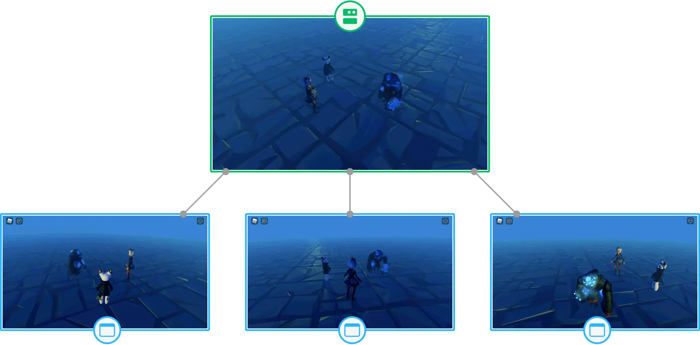
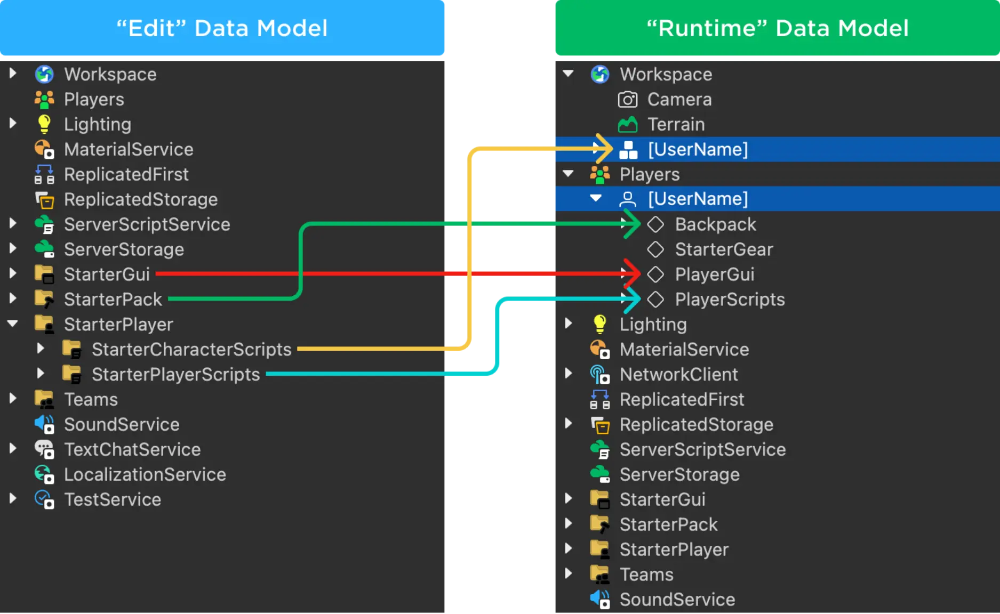
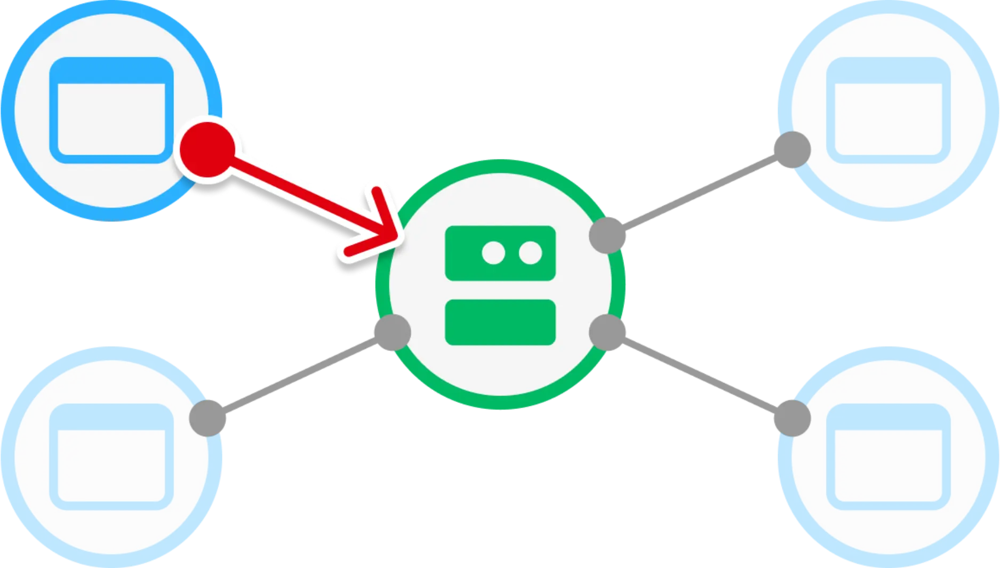
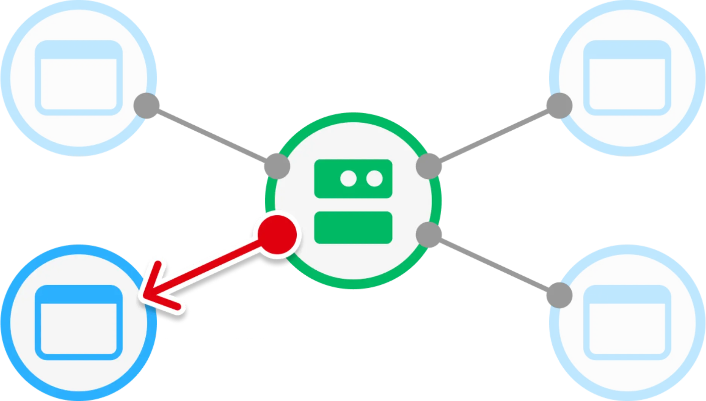
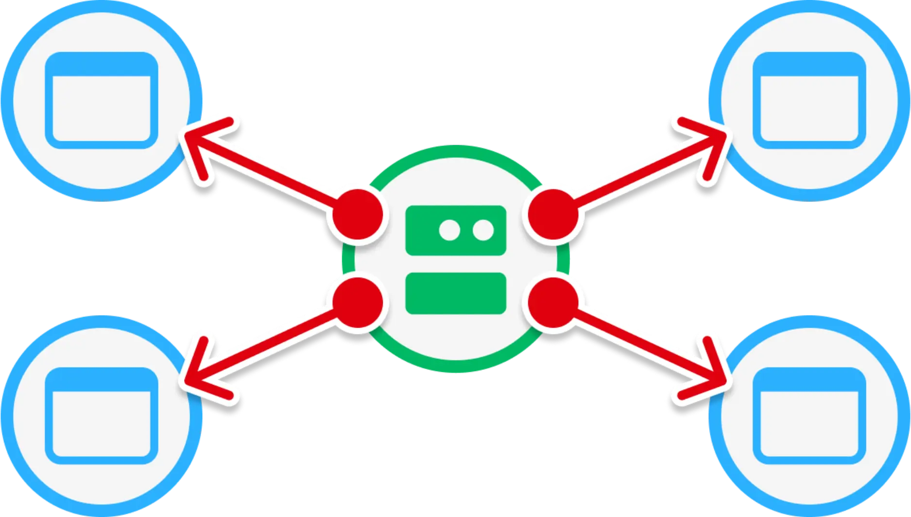
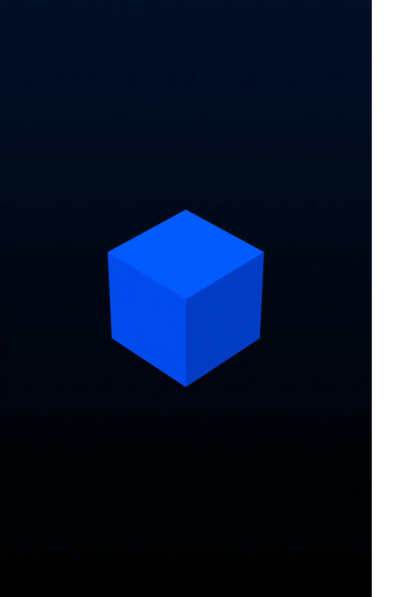
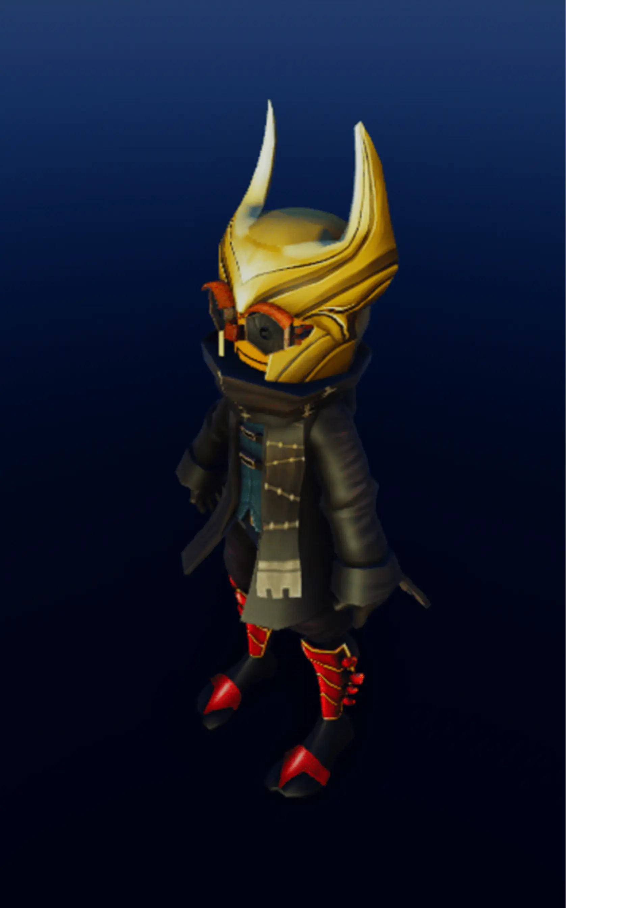

# Client-Server Runtime

## 목차
- [Client-Server Runtime](#client-server-runtime)
  - [목차](#목차)
  - [서버](#서버)
  - [클라이언트](#클라이언트)
  - [복제](#복제)
    - [데이터](#데이터)
    - [물리](#물리)
    - [채팅](#채팅)
  - [출처](#출처)
  - [다음](#다음)

---

## 서버

Roblox 경험은 기본적으로 멀티플레이어이며 클라이언트-서버 모델로 실행됩니다. Roblox **서버**는 경험의 상태를 유지하는 최종 권한을 가지며, 모든 연결된 클라이언트를 서버와 동기화시키는 역할을 합니다.

<figure>
  
  <figcaption>세 개의 클라이언트 장치에 연결된 서버</figcaption>
</figure>

## 클라이언트

경험이 실행될 때, Roblox는 Studio에서 구축하고 게시한 "편집" 데이터 모델의 버전을 Roblox 서버에서 "런타임" 데이터 모델로 실행합니다.

연결된 클라이언트는 런타임 데이터 모델의 사본을 받으며, 플레이어의 배낭(인벤토리)이나 로컬 사용자 인터페이스 초기화와 같은 초기화가 발생합니다. 경험이 `Class.Workspace.StreamingEnabled`로 설정되어 있으면, 서버는 처음에 클라이언트와 가장 가까운 `Class.Workspace` 하위의 콘텐츠 하위 집합만 보냅니다. 클라이언트는 3D 월드를 렌더링하고 해당되는 스크립트를 실행하기 시작합니다.

<figure>
  
  <figcaption></figcaption>
</figure>

## 복제

서버는 **복제**라는 과정을 통해 연결된 클라이언트를 지속적으로 업데이트하여 서버와 클라이언트 간의 모든 것을 동기화 상태로 유지합니다. 복제는 데이터 모델, 물리 시뮬레이션 및 채팅 메시지를 동기화하는 것입니다. 동기화를 보장하기 위해 복제 로직은 클라이언트와 서버 모두에 존재합니다.

### 데이터

데이터 모델 변경은 3D 월드에서 무언가가 생성되거나 3D 월드의 속성이 변경될 때 발생할 수 있습니다. 이는 일반적으로 서버나 클라이언트의 스크립트가 클라이언트-서버 경계의 다른 쪽에 반영해야 하는 변경을 수행할 때 발생합니다. 다음 다이어그램은 데이터 복제의 일반적인 시나리오를 보여줍니다.

<!-- <GridContainer numColumns="3">
<figure>

**클라이언트** &rarr; **서버**

클라이언트에서 서버로의 통신. 예를 들어, 클라이언트가 <kbd>P</kbd> 키를 눌러 투명화 물약을 마시고 서버에 해당 플레이어의 캐릭터를 다른 모든 플레이어에게 투명하게 만들도록 요청합니다.
</figure>
<figure>

**서버** &rarr; **클라이언트**

서버에서 특정 클라이언트로의 통신. 예를 들어, 플레이어가 경험에 참가하면 서버가 해당 플레이어의 인벤토리를 아이템 세트로 채웁니다.
</figure>
<figure>

**서버** &rarr; **모든 클라이언트**

서버와 연결된 모든 클라이언트 간의 통신. 예를 들어, 경주 참가자 모두에게 카운트다운 타이머를 표시합니다.
</figure>
</GridContainer> -->

|**클라이언트** &rarr; **서버**|**서버** &rarr; **클라이언트**|**서버** &rarr; **모든 클라이언트**|
|---|---|---|
||||
|클라이언트에서 서버로의 통신. 예를 들어, 클라이언트가 <kbd>P</kbd> 키를 눌러 투명화 물약을 마시고 서버에 해당 플레이어의 캐릭터를 다른 모든 플레이어에게 투명하게 만들도록 요청합니다.|서버에서 특정 클라이언트로의 통신. 예를 들어, 플레이어가 경험에 참가하면 서버가 해당 플레이어의 인벤토리를 아이템 세트로 채웁니다.|서버와 연결된 모든 클라이언트 간의 통신. 예를 들어, 경주 참가자 모두에게 카운트다운 타이머를 표시합니다.|

### 물리

Roblox는 강체 물리 엔진을 사용하여 3D 월드에서 부품의 움직임과 상호 작용을 계산합니다. 기본적으로 Roblox의 모든 부품은 강체이며 물리 시뮬레이션에 참여합니다. 여러 부품을 어셈블리로 그룹화할 수도 있으며, 물리 엔진은 이를 단일 강체로 처리합니다.

 
<!-- <Grid container spacing={2}>
  <Grid item xs={4} lg={3}>
    
    <figcaption>1&nbsp;어셈블리; 1&nbsp;부품</figcaption>
  </Grid>
  <Grid item xs={4} lg={3}>
    
    <figcaption>1&nbsp;어셈블리; 18&nbsp;부품</figcaption>
  </Grid>
  <Grid item xs={8} lg={6}>
    
    <figcaption>1&nbsp;어셈블리; 179&nbsp;부품</figcaption>
  </Grid>
</Grid> -->

|1&nbsp;어셈블리; 1&nbsp;부품|1&nbsp;어셈블리; 18&nbsp;부품|1&nbsp;어셈블리; 179&nbsp;부품|
|---|---|---|
||||

 

필요할 때 Roblox는 서버와 클라이언트 간에 물리 시뮬레이션 데이터를 복제합니다. 시뮬레이션 성능을 돕기 위해 Roblox는 어셈블리의 소유권을 특정 클라이언트나 서버에 할당할 수 있습니다. 이는 클라이언트나 서버가 해당 어셈블리의 물리 시뮬레이션을 책임질 수 있음을 의미합니다. 다른 클라이언트는 소유 클라이언트나 서버로부터 어셈블리의 위치와 움직임에 대한 업데이트를 받습니다. 소유권은 일반적으로 자동으로 발생하지만, 미세 조정을 위해 직접 할당할 수 있습니다.

<figure>
  <video src="../img/01_02_project_architecture_Client_Server_Runtime/Visualization-Demo.mp4" controls width="90%" alt="플레이어 캐릭터가 바닥에 있는 빛나는 물체를 수집하는 모습. 파트 소유권은 색상 윤곽선으로 표시됨."></video>
  <figcaption>색상 윤곽선으로 표시된 파트 소유권</figcaption>
</figure>

### 채팅

Roblox는 서버와 클라이언트 간에 채팅 메시지를 복제합니다. 서버는 채팅 메시지를 필터링하고 다른 클라이언트로 복제할 메시지를 결정합니다. 예를 들어, 서버는 욕설이 포함된 메시지나 너무 긴 메시지를 필터링할 수 있습니다.

<video src="../img/01_02_project_architecture_Client_Server_Runtime/Player-Conversation-Bubbles.mp4" controls width="90%" alt="두 캐릭터가 머리 위의 채팅 버블을 통해 대화하는 모습."></video>

---
## 출처
 - [Client-Server Runtime](https://create.roblox.com/docs/ko-kr/projects/client-server)

---
## [다음](./01_03_project_architecture_Instance_Streaming.md)