# Instance Streaming

## 목차
- [Instance Streaming](#instance-streaming)
  - [목차](#목차)
  - [인스턴스 스트리밍](#인스턴스-스트리밍)
  - [스트리밍 활성화](#스트리밍-활성화)
  - [기술적 동작](#기술적-동작)
    - [스트리밍 인](#스트리밍-인)
    - [스트리밍 아웃](#스트리밍-아웃)
    - [어셈블리 및 메커니즘](#어셈블리-및-메커니즘)
    - [타이밍 지연](#타이밍-지연)
  - [스트리밍 속성](#스트리밍-속성)
    - [ModelStreamingBehavior](#modelstreamingbehavior)
    - [StreamingIntegrityMode](#streamingintegritymode)
    - [StreamingMinRadius](#streamingminradius)
    - [StreamingTargetRadius](#streamingtargetradius)
    - [StreamOutBehavior](#streamoutbehavior)
  - [모델별 스트리밍 제어](#모델별-스트리밍-제어)
    - [기본 / 비원자](#기본--비원자)
    - [원자적](#원자적)
    - [지속적](#지속적)
    - [PersistentPerPlayer](#persistentperplayer)
  - [영역 스트리밍 요청](#영역-스트리밍-요청)
  - [인스턴스 스트리밍 감지](#인스턴스-스트리밍-감지)
  - [일시 정지 화면 사용자 정의](#일시-정지-화면-사용자-정의)
  - [모델 디테일 수준](#모델-디테일-수준)
  - [출처](#출처)
  - [다음](#다음)

---

## 인스턴스 스트리밍

경험 내 **인스턴스 스트리밍**은 Roblox 엔진이 세계의 특정 지역에서 3D 콘텐츠 및 관련 인스턴스를 동적으로 로드하고 언로드할 수 있게 합니다. 이는 여러 가지 방법으로 플레이어의 전체적인 경험을 향상시킬 수 있습니다. 예를 들어:

- **빠른 접속 시간** &mdash; 플레이어는 더 많은 세계가 배경에서 로드되는 동안 세계의 일부에서 게임을 시작할 수 있습니다.
- **메모리 효율성** &mdash; 콘텐츠가 동적으로 스트리밍되므로 메모리가 적은 장치에서도 경험을 플레이할 수 있습니다. 더 몰입감 있고 세밀한 세계를 더 많은 장치에서 플레이할 수 있습니다.
- **개선된 성능** &mdash; 서버가 세계와 플레이어 간의 변경 사항을 동기화하는 데 소요되는 시간과 대역폭을 줄이면서 더 나은 프레임 속도와 성능을 제공합니다. 클라이언트는 플레이어와 관련 없는 인스턴스를 업데이트하는 데 더 적은 시간을 소비합니다.
- **디테일 수준** &mdash; 스트리밍되지 않는 먼 모델과 지형도 여전히 보이므로 배경 시각 효과를 완전히 희생하지 않고도 경험을 최적화할 수 있습니다.

## 스트리밍 활성화

인스턴스 스트리밍은 Studio의 **Workspace** 객체의 **StreamingEnabled** 속성을 통해 활성화됩니다. 이 속성은 스크립트에서 설정할 수 없습니다. Studio에서 새로 생성된 장소는 기본적으로 스트리밍이 활성화됩니다.

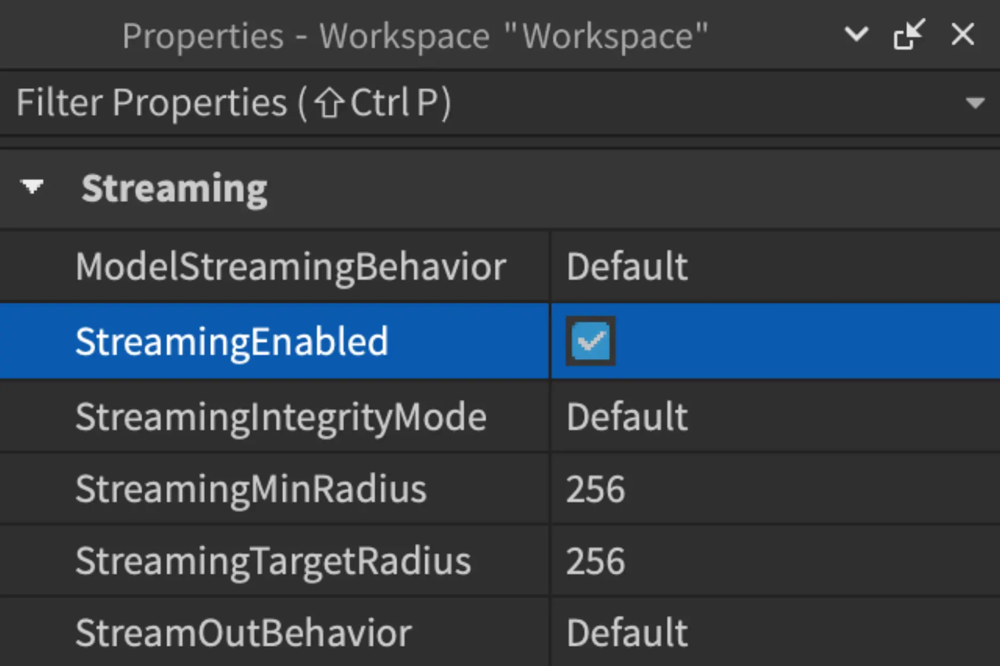

활성화된 후에는 다음 권장 사항을 따르는 것이 좋습니다:

- 클라이언트가 일반적으로 전체 `Class.Workspace`를 로컬에서 사용할 수 없으므로 적절한 도구/API를 사용하여 `Class.LocalScript`에서 액세스하려는 인스턴스가 존재하는지 확인하세요. 예를 들어, [모델별 스트리밍 제어]를 사용하거나, [인스턴스 스트리밍 감지]를 사용하거나, 존재하지 않을 수 있는 객체에 `Class.Instance:WaitForChild()`를 사용합니다.
- `Class.Workspace` 외부에 3D 콘텐츠 배치를 최소화하세요. `Class.ReplicatedStorage` 또는 `Class.ReplicatedFirst`와 같은 컨테이너에 있는 콘텐츠는 스트리밍이 불가능하며 접속 시간과 메모리 사용량에 부정적인 영향을 미칠 수 있습니다.
- 플레이어의 캐릭터를 `Datatype.CFrame`을 설정하여 이동할 경우, 서버 측 `Class.Script`에서 그렇게 하고 [스트리밍 요청]을 사용하여 캐릭터의 새 위치 주위 데이터를 더 빠르게 로드하세요.
- 플레이어의 `Class.Player.ReplicationFocus|ReplicationFocus`를 수동으로 설정하는 것은 `Class.Player.Character`를 사용하지 않는 경험과 같은 고유한 상황에서만 하세요. 이러한 경우, 플레이어가 제어하는 객체 주위에 콘텐츠가 계속 스트리밍되도록 포커스를 설정하세요.

## 기술적 동작

### 스트리밍 인

기본적으로 인스턴스 스트리밍이 활성화된 경험에 플레이어가 접속하면 `Class.Workspace`의 인스턴스가 클라이언트로 복제됩니다. **다음**을 제외한 인스턴스가 복제됩니다:

- `Class.Part` 또는 `Class.MeshPart`
- [Atomic], [Persistent], 또는 [PersistentPerPlayer] 모델
- 위의 인스턴스의 하위 요소
- 복제되지 않는 인스턴스

그 후, 게임 플레이 중에 서버는 필요한 인스턴스를 필요할 때 클라이언트에 스트리밍할 수 있습니다.

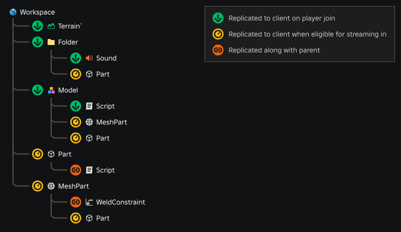

<figcaption><sup>1</sup> 지형은 고유하게 취급되어, 경험이 로드될 때 클라이언트로 복제되지만, 지형 지역은 필요할 때만 스트리밍됩니다.</figcaption><br />

<h4>모델 동작</h4>

[Atomic]과 같은 기본이 아닌 동작으로 설정된 모델은 [모델별 스트리밍 제어]에 설명된 특수 규칙에 따라 스트리밍됩니다. 그러나 기본(비원자) 모델은 [ModelStreamingBehavior]가 **Default** (**Legacy**)로 설정되어 있는지 또는 **Improved**로 설정되어 있는지에 따라 다르게 전송됩니다.

<Tabs>
<TabItem label="기본 / 레거시">

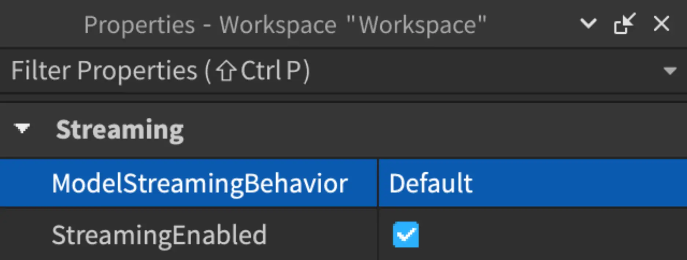

[ModelStreamingBehavior]가 **Default**/**Legacy**로 설정된 경우, `Class.Model` 컨테이너와 그 하위의 비공간적 하위 요소(예: `Class.Script`)는 플레이어가 접속할 때 클라이언트로 복제됩니다. 그런 다음, 적합할 때 모델의 `Class.BasePart` 하위 요소가 스트리밍됩니다.

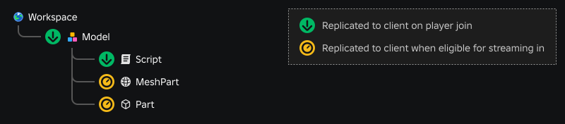

</TabItem>
<TabItem label="개선됨">

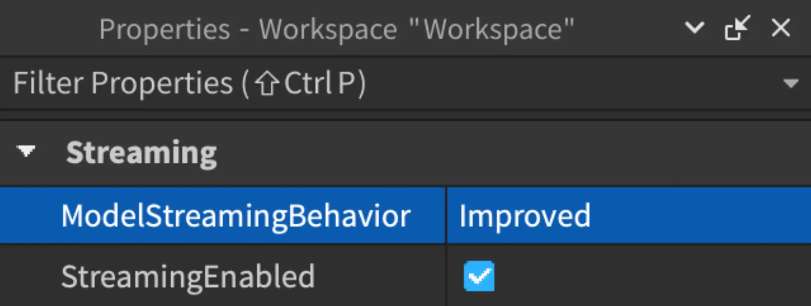

[ModelStreamingBehavior]가 **Improved**로 설정된 경우, 모델 스트리밍 동작은 모델이 **공간적**(`Class.BasePart` 하위 요소 포함)인지 **비공간적**(`Class.BasePart` 하위 요소 없음)인지에 따라 다릅니다.

- 플레이어가 접속할 때 대신, **공간적** 모델(예: `Class.BasePart` 하위 요소 포함)은 해당 `Class.BasePart` 하위 요소가 스트리밍할 자격이 있을 때만 전송됩니다. 이 시점에서 모델과 파트가 복제되며, 모델의 비공간적 하위 요소도 함께 복제됩니다. 그런 다음, 적합할 때 모델의 다른 공간적 하위 요소가 스트리밍됩니다.

  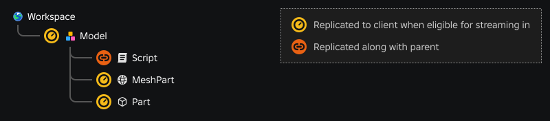

- 중요한 고려 사항은 공간적 모델과 그 모든 `Class.BasePart`가 단일 [네트워크 소유권] 단위에 속하는 경우, 예를 들어 아바타나 NPC 캐릭터 모델과 같은 경우입니다. 이러한 경우, 전체 모델이 원자적으로 스트리밍됩니다.

  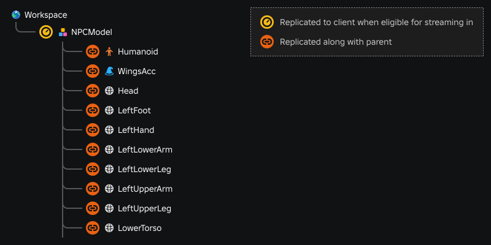

- **비공간적** 모델(예: `Class.BasePart` 하위 요소 없음)의 경우, 모델 컨테이너와 그 하위 요소는 플레이어가 접속한 후 곧바로 클라이언트로 복제되며, 모두 스트리밍 아웃에서 제외됩니다. 모델이 플레이어가 접속할 때 `Class.Workspace`에 존재하는 경우, 이는 `Class.Workspace.PersistentLoaded` 이벤트가 발생하기 전에 발생합니다.

  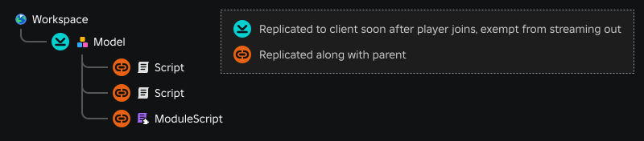

</TabItem>
</Tabs>

### 스트리밍 아웃

게임 플레이 중 클라이언트는 플레이어의 `Class.Workspace`에서 영역과 그 안에 포함된 `Class.BasePart`를 스트리밍 아웃(제거)할 수 있습니다. 이는 [StreamOutBehavior](#streamoutbehavior)에 설정된 동작에 따라 다릅니다. 프로세스는 플레이어의 캐릭터(또는 `Class.Player.ReplicationFocus|ReplicationFocus`)에서 가장 먼 지역부터 시작하여 필요에 따라 가까운 지역으로 이동합니다. [StreamingMinRadius](#streamingminradius) 범위 내의 지역은 절대 스트리밍 아웃되지 않습니다.

인스턴스가 스트리밍 아웃될 때, `nil`에 부모로 설정되어 기존의 Luau 상태가 인스턴스가 다시 스트리밍될 경우 다시 연결됩니다. 결과적으로 `Class.Instance.ChildRemoved

|ChildRemoved` 또는 `Class.Instance.DescendantRemoving|DescendantRemoving`과 같은 제거 신호는 해당 인스턴스의 **부모** 또는 **조상**에서 발생하지만, 해당 인스턴스는 `Class.Instance:Destroy()` 호출과 같은 방식으로 파괴되지 않습니다.

스트리밍 아웃을 예상하려면 다음 시나리오를 참조하십시오:

<table>
  <thead>
    <tr>
      <th>시나리오</th>
      <th>예</th>
	  <th>스트리밍 동작</th>
    </tr>
  </thead>
  <tbody>
    <tr>
      <td>`Class.LocalScript`에서 `Class.Instance.new()`를 통해 로컬에서 **생성된** 파트.</td>
      <td>"깃발 뺏기" 게임에서 `Class.LocalScript`를 통해 파란 팀의 모든 플레이어에게 파란 헬멧 파트를 생성하고 부착합니다.</td>
	  <td>해당 파트는 서버에 복제되지 않으며, 서버에 존재하는 파트(예: 플레이어의 캐릭터 모델 내의 파트)의 하위 요소로 만들지 않는 한 스트리밍 아웃에서 제외됩니다.</td>
    </tr>
    <tr>
      <td>`Class.ReplicatedStorage`에서 `Class.Instance:Clone()`를 통해 로컬에서 **복제된** 파트.</td>
      <td>마법사 캐릭터가 `Class.Tool`을 활성화하여 `Class.ReplicatedStorage`에서 복제된 여러 [특수 효과]를 포함하는 객체를 마법사의 위치에 워크스페이스에 부모로 설정합니다.</td>
	  <td>해당 파트는 서버에 복제되지 않으며, 서버에 존재하는 파트의 하위 요소로 만들지 않는 한 스트리밍 아웃에서 제외됩니다.</td>
    </tr>
	<tr>
      <td>`Class.ReplicatedStorage`에서 워크스페이스로 `Class.LocalScript`를 통해 **재배치된** 파트.</td>
      <td>"마법사의 모자"가 `Class.ReplicatedStorage`에 저장됩니다. 플레이어가 마법사 팀을 선택하면, `Class.LocalScript`를 통해 모자가 그들의 캐릭터 모델에 이동됩니다.</td>
	  <td>해당 파트는 서버에서 왔고 `Class.ReplicatedStorage`에 복제되었기 때문에 스트리밍 아웃에 해당됩니다. 이는 클라이언트와 서버 간의 비동기화를 초래하므로 이 패턴을 피하고, 대신 파트를 **복제**하세요.</td>
    </tr>
  </tbody>
</table>

<h4>모델 동작</h4>

[ModelStreamingBehavior]를 **Improved**로 설정하면, 엔진은 자격이 있는 경우 [기본](비원자) 모델을 스트리밍 아웃할 수 있어, 클라이언트의 메모리를 확보하고 속성 업데이트가 필요한 인스턴스를 줄일 수 있습니다.


**Improved** 모델 스트리밍 동작에서는, [기본] ([비원자]) 모델의 스트리밍 아웃은 모델이 **공간적**(하위 요소에 `Class.BasePart` 포함)인지 **비공간적**(하위 요소에 `Class.BasePart` 없음)인지에 따라 다릅니다.

- 공간적 모델은 마지막 남은 `Class.BasePart` 하위 요소가 스트리밍 아웃될 자격이 있을 때만 완전히 스트리밍 아웃됩니다. 이는 모델의 일부 공간적 부품이 플레이어/복제 포커스에 가깝고 일부는 멀리 있을 수 있기 때문입니다.
- 비공간적 모델은 조상이 스트리밍 아웃될 때만 스트리밍 아웃됩니다. 이는 레거시 스트리밍 아웃 동작과 동일합니다.

### 어셈블리 및 메커니즘

[어셈블리]의 파트 중 하나 이상이 스트리밍 인될 자격이 있을 때, 해당 어셈블리의 모든 파트도 스트리밍 인됩니다. 그러나 모든 파트가 스트리밍 아웃될 자격이 있을 때까지 어셈블리는 스트리밍 **아웃**되지 않습니다. 스트리밍 중에는 모든 `Class.Constraint`와 `Class.Attachment`이 `Class.BasePart`와 원자적 또는 영구적 `Class.Model`의 하위 요소로 스트리밍되어, 클라이언트에서 일관된 물리적 업데이트를 보장합니다.

참고로, **앵커된** 파트가 있는 어셈블리는 앵커되지 않은 파트만 있는 어셈블리와 약간 다르게 취급됩니다:

<table>
  <thead>
    <tr>
      <th>어셈블리 구성</th>
      <th>스트리밍 동작</th>
    </tr>
  </thead>
  <tbody>
    <tr>
      <td>앵커되지 않은 파트만</td>
      <td>전체 어셈블리가 원자 단위로 전송됩니다.</td>
    </tr>
    <tr>
      <td>앵커된 [루트 파트]</td>
      <td>루트 파트에 연결하기 위해 필요한 파트, 부착물 및 제약 조건만 함께 스트리밍 인됩니다.</td>
    </tr>
  </tbody>
</table>

<Alert severity="warning">
필요하지 않은 인스턴스가 많은 이동 어셈블리를 생성하지 마십시오. 모든 인스턴스가 동시에 스트리밍 인될 경우 네트워크/CPU 스파이크가 발생할 수 있습니다.
</Alert>

### 타이밍 지연

서버에서 파트가 생성된 시점과 클라이언트에 복제되는 시점 사이에 약 ~10밀리초의 지연이 있을 수 있습니다. 다음 시나리오에서는 이벤트와 속성 업데이트가 항상 파트 스트리밍과 동시에 발생한다고 가정하는 대신, `WaitForChild()` 및 기타 기술을 사용해야 할 수 있습니다.

<table>
  <thead>
    <tr>
      <th>시나리오</th>
      <th>예</th>
	  <th>스트리밍 동작</th>
    </tr>
  </thead>
  <tbody>
    <tr>
      <td>`Class.LocalScript`가 서버에 `Class.RemoteFunction` 호출을 통해 파트를 생성합니다.</td>
      <td>플레이어가 로컬에서 `Class.Tool`을 활성화하여 모든 플레이어가 보고 상호작용할 수 있는 서버에 파트를 생성합니다.</td>
	  <td>원격 함수가 클라이언트로 반환될 때, 파트가 아직 존재하지 않을 수 있습니다. 비록 파트가 클라이언트 포커스에 가깝고 스트리밍된 영역 내에 있어도 말입니다.</td>
    </tr>
    <tr>
      <td>서버에서 `Class.Script`를 통해 캐릭터 모델에 파트를 추가하고, `Class.RemoteEvent`가 클라이언트로 전송됩니다.</td>
      <td>플레이어가 경찰 팀에 참가하면, `Class.ServerStorage`에 저장된 "경찰 배지" 파트를 복제하여 플레이어의 캐릭터 모델에 부착합니다. `Class.RemoteEvent`가 전송되어 해당 플레이어의 클라이언트에서 로컬 UI 요소를 업데이트합니다.</td>
	  <td>클라이언트가 이벤트 신호를 받더라도, 해당 파트가 이미 해당 클라이언트로 스트리밍되었는지 보장할 수 없습니다.</td>
    </tr>
	<tr>
      <td>서버에서 보이지 않는 영역과 충돌한 파트가 클라이언트에서 `Class.RemoteEvent`를 트리거합니다.</td>
      <td>플레이어가 축구공을 골문에 차 넣어 "골 성공" 이벤트를 트리거합니다.</td>
	  <td>골문에 가까운 다른 플레이어들은 공이 그들에게 스트리밍되기 전에 "골 성공" 이벤트를 볼 수 있습니다.</td>
    </tr>
  </tbody>
</table>

## 스트리밍 속성

다음 속성은 인스턴스 스트리밍이 경험에 적용되는 방식을 제어합니다. 이 모든 속성은 **스크립트로 설정할 수 없으며** Studio의 **Workspace** 객체에 설정해야 합니다.

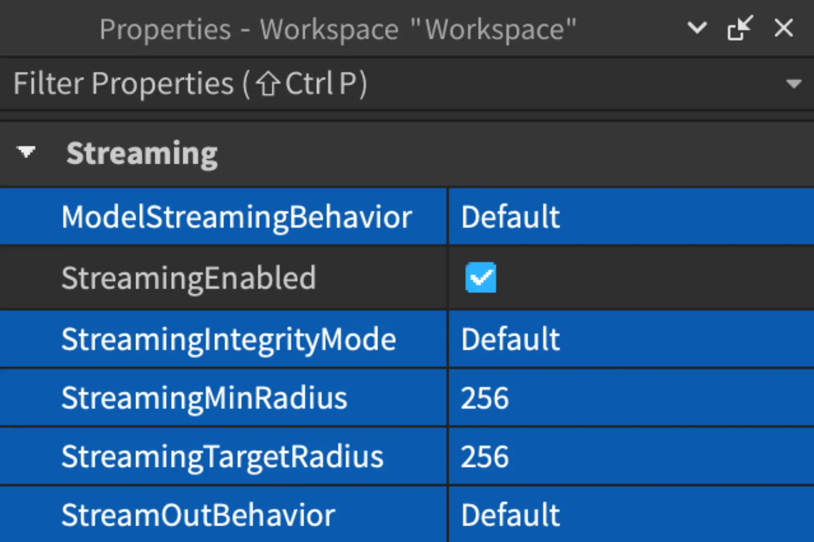

### ModelStreamingBehavior

[기본] ([비원자]) 모델이 플레이어가 접속할 때 복제되는지, 필요할 때만 전송되는지 제어합니다. 이 속성이 **Improved**로 설정된 경우, `Class.Workspace`의 모델은 필요할 때만 클라이언트로 전송되어 접속 시간을 단축할 수 있습니다. 자세한 내용은 [기술적 동작]을 참조하세요.

### StreamingIntegrityMode

플레이어가 스트리밍되지 않은 세계의 영역으로 이동하면 경험이 의도치 않게 동작할 수 있습니다. **스트리밍 무결성** 기능은 이러한 잠재적인 문제 상황을 피할 수 있는 방법을 제공합니다. 자세한 내용은 `Enum.StreamingIntegrityMode` 문서를 참조하세요.

### StreamingMinRadius

**StreamingMinRadius** 속성은 인스턴스가 가장 높은 우선순위로 스트리밍되는 플레이어의 캐릭터(또는 `ReplicationFocus`) 주위의 반경을 나타냅니다. 기본값을 증가시킬 때는 주의해야 합니다. 그렇게 하면 더 많은 메모리와 서버 대역폭을 사용하여 다른 구성 요소에 영향을 미칠 수 있습니다.

### StreamingTargetRadius

**StreamingTargetRadius** 속성은 인스턴스가 스트리밍되는 플레이어의 캐릭터(또는 `ReplicationFocus`)로부터 최대 거리를 제어합니다. 엔진은 메모리가 허용되는 한 대상 반경 너머의 이전에 로드된 인스턴스를 유지할 수 있습니다.

작은 **StreamingTargetRadius**는 서버 작업량을 줄여 추가 인스턴스를 스트리밍할 필요가 없습니다. 그러나 대상 반경은 플레이어가 경험의 전체 디테일을 볼 수 있는 최대 거리이므로 이를 고려하여 균형을 맞춰야 합니다.

<Alert severity="info">
**StreamingTargetRadius**는 **StreamingMinRadius**보다 커야 합니다. 최소 반경과 대상 반경 사이의 3D 콘텐츠는 클라이언트가 서버에서 새 콘텐츠를 일시적으로 받지 않을 경우 버퍼 역할을 합니다. 최소 반경과 대상 반경이 동일하면 버퍼가 없어져 네트워크 일시 정지 또는 비최적화된 사용자 경험이 증가할 수 있습니다.
</Alert>

### StreamOutBehavior

**StreamOutBehavior** 속성은 [스트리밍 아웃] 동작을 다음 값 중 하나에 따라 설정합니다:

<table>
  <thead>
    <tr>
      <th>설정</th>
      <th>스트리밍 동작</th>
    </tr>
  </thead>
  <tbody>
    <tr>
      <td>**기본**</td>
      <td>현재 **LowMemory**와 동일한 기본 동작입니다.</td>
    </tr>
    <tr>
      <td>**LowMemory**</td>
      <td>클라이언트는 메모리가 부족한 상황에서만 파트를 스트리밍 아웃하며, 최소 반경만 남을 때까지 3D 콘텐츠를 제거할 수 있습니다.</td>
    </tr>
	<tr>
      <td>**기회주의적**</td>
      <td>[StreamingTargetRadius] 너머의 영역은 메모리 압박이 없어도 클라이언트에서 제거될 수 있습니다. 이 모드에서는 메모리가 부족한 상황을 제외하고, 클라이언트가 설정된 대상 반경보다 가까운 인스턴스를 제거하지 않습니다.</td>
    </tr>
  </tbody>
</table>

## 모델별 스트리밍 제어

전역적으로 [ModelStreamingBehavior] 속성을 통해 모델이 접속 시 스트리밍되는 방식을 제어할 수 있습니다. 또한, 모델별로 스트리밍 문제를 피하고 `WaitForChild()` 사용을 최소화하려면, `ModelStreamingMode` 속성을 통해 `Models` 및 하위 요소의 스트리밍 방식을 사용자 정의할 수 있습니다.

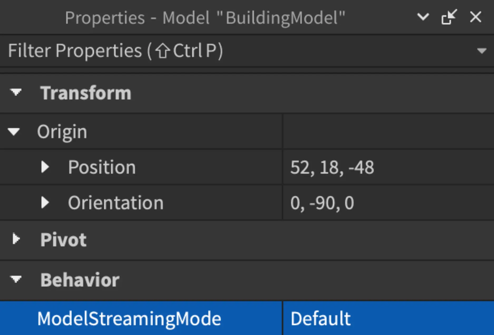

### 기본 / 비원자

`Class.Model`이 **Default** 또는 **Nonatomic**으로 설정된 경우, [ModelStreamingBehavior]가 **Default** (**Legacy**)로 설정되어 있는지 또는 **Improved**로 설정되어 있는지에 따라 스트리밍 동작이 달라집니다.

<table>
  <thead>
    <tr>
      <th>[ModelStreamingBehavior]</th>
      <th>기술적 동작</th>
    </tr>
  </thead>
  <tbody>
    <tr>
      <td>**기본** (**레거시**)</td>
      <td>모델은 플레이어가 접속할 때 복제됩니다. 이는 로딩 중 더 많은 인스턴스가 전송되고, 메모리에 더 많은 인스턴스가 저장되며, 모델의 하위 요소에 액세스하려는 스크립트의 복잡성이 증가할 수 있습니다. 예를 들어, 별도의 `Class.LocalScript`는 모델 내부의 하위 `Class.BasePart`에 `WaitForChild()`를 사용해야 합니다.</td>
    </tr>
    <tr>
      <td>**개선됨**</td>
      <td>모델은 필요할 때만 전송되어 접속 시간을 단축할 수 있습니다.</td>
    </tr>
  </tbody>
</table>

자세한 내용은 [기술적 동작]을 참조하세요.

### 원자적

`Class.Model`을 **Atomic**으로 변경하면 하위 요소가 스트리밍될 자격이 있을 때 모든 하위 요소가 함께 스트리밍됩니다. 결과적으로, 별도의 `Class.LocalScript`는 모델 자체에 `WaitForChild()`를 사용해야 하지만, 모델과 함께 전송되므로 하위 `Class.MeshPart` 또는 `Class.Part`에는 사용할 필요가 없습니다.

원자적 모델은 모든 하위 파트가 스트리밍 아웃될 자격이 있을 때만 스트리밍 아웃되며, 이 시점에서 전체 모델이 함께 스트리밍 아웃됩니다. 원자적 모델의 일부 파트만 스트리밍 아웃될 자격이 있는 경우, 전체 모델과 하위 요소는 클라이언트에 남아 있습니다.

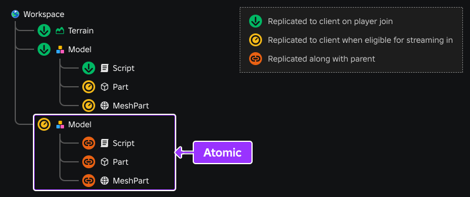

```lua title='LocalScript' highlight='2, 5-6'
-- 원자적 모델은 로드 시 존재하지 않음; WaitForChild() 사용
local model = workspace:WaitForChild("Model")

-- 하위 파트는 모델과 함께 스트리밍되어 즉시 액세스 가능
local meshPart = model.MeshPart
local part = model.Part
```

### 지속적

**Persistent** 모델은 정상적인 스트리밍 인 또는 스트리밍 아웃의 대상이 아닙니다. 플레이어가 접속한 후 곧바로 완전한 원자 단위로 전송되며, `Class.Workspace.PersistentLoaded` 이벤트가 발생하기 전에 스트리밍됩니다. 지속적 모델과 하위 요소는 절대 스트리밍 아웃되지 않지만, 별도의 `Class.LocalScript`에서 안전하게 스트리밍 인을 처리하려면 부모 모델에 `WaitForChild()`를 사용하거나 `PersistentLoaded` 이벤트가 발생할 때까지 기다려야 합니다.

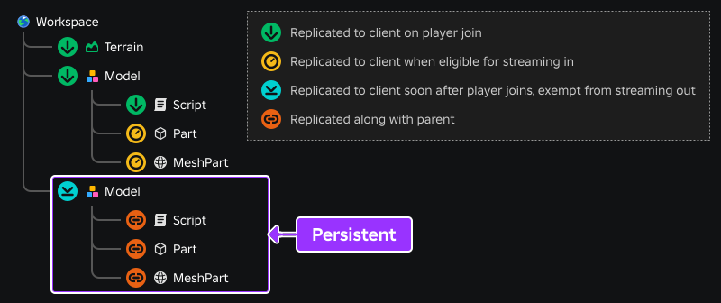

```lua title='LocalScript' highlight='2, 5-6'
-- 지속적 모델은 로드 시 존재하지 않음; WaitForChild() 사용
local model = workspace:WaitForChild("Model")

-- 하위 파트는 모델과 함께 스트리밍되어 즉시 액세스 가능
local meshPart = model.MeshPart
local part = model.Part
```

<Alert severity="warning">
지속적 모델은 매우 드문 상황, 예를 들어 `Class.LocalScript` 사용을 위해 클라이언트에 항상 존재해야 하는 소수의 파트에 의도됩니다. 가능하면 서버 측 `Scripts`를 사용하거나, `LocalScripts`가 파트 스트리밍 인 및 아웃에 대응할 수 있어야 합니다. 지속적 모델은 스트리밍을 우회하기 위한 것이 아니며, 과도한 사용은 성능에 부정적인 영향을 미칠 수 있습니다.

많은 하위 모델을 포함하는 포괄적 지속적 모델을 만들지 마십시오. 예를 들어, 많은 차량이 있는 경험을 만드는 경우, 모든 차량을 포함하는 단일 지속적 모델을 만들지 마십시오. 대신, 각 차량 모델을 개별적으로 지속적으로 설정하십시오.
</Alert>

<Alert severity="info">
복제 후 지속적 모델의 런타임 성능 영향은 대부분 스트리밍이 활성화 되지 않은 일반 모델과 동일합니다. 예외는 모델 내용이 자주 변경되거나, 모델의 파트에 물리적 연결 변경이 있을 때입니다. 이러한 경우, 엔진은 변경 사항이 모든 클라이언트에 올바르게 반영되도록 추가 업데이트를 수행해야 하므로, 지속적 모델에 빈번한 변경을 피하는 것이 좋습니다.
</Alert>

### PersistentPerPlayer

**PersistentPerPlayer**로 설정된 모델은 `Class.Model:AddPersistentPlayer()`를 사용하여 추가된 플레이어에게는 [지속적]과 동일하게 동작합니다. 다른 플레이어에게는 [원자적]과 동일한 동작을 합니다. 모델을 플레이어 지속성에서 되돌리려면 `Class.Model:RemovePersistentPlayer()`를 사용하십시오.

## 영역 스트리밍 요청

플레이어 캐릭터의 `Datatype.CFrame`을 현재 로드되지 않은 영역으로 설정하면, [스트리밍 일시 정지]가 발생할 수 있습니다. 캐릭터가 특정 영역으로 이동할 것을 알고 있다면, `Class.Player:RequestStreamAroundAsync()`를 호출하여 서버가 해당 위치 주위 영역을 클라이언트로 전송하도록 요청할 수 있습니다.

다음 스크립트는 클라이언트-서버 [원격 이벤트]를 사용하여 플레이어를 장소 내에서 텔레포트하고, 스트리밍 요청 후에 캐릭터를 새 `Datatype.CFrame`으로 이동하는 방법을 보여줍니다.

```lua title='Script - Teleport Player Character' highlight='7, 10-14'
local ReplicatedStorage = game:GetService("ReplicatedStorage")

local teleportEvent = ReplicatedStorage:WaitForChild("TeleportEvent")

local function teleportPlayer(player, teleportTarget)
	-- 대상 위치 주위 스트리밍 요청
	player:RequestStreamAroundAsync(teleportTarget)

	-- 캐릭터 텔레포트
	local character = player.Character
	if character and character.Parent then
		local currentPivot = character:GetPivot()
		character:PivotTo(currentPivot * CFrame.new(teleportTarget))
	end
end

-- 클라이언트가 원격 이벤트를 발생시킬 때 텔레포트 함수 호출
teleportEvent.OnServerEvent:Connect(teleportPlayer)
```

```lua title='LocalScript - Fire Remote Event'
local ReplicatedStorage = game:GetService("ReplicatedStorage")

local teleportEvent = ReplicatedStorage:WaitForChild("TeleportEvent")
local teleportTarget = Vector3.new(50, 2, 120)

-- 원격 이벤트 발생
teleportEvent:FireServer(teleportTarget)
```

<Alert severity="error">
영역 주위 스트리밍 요청은 완료 시 콘텐츠가 존재할 것이라는 **보장이 아닙니다**. 스트리밍은 클라이언트의 네트워크 대역폭, 메모리 제한 및 기타 요소에 영향을 받기 때문입니다.
</Alert>

## 인스턴스 스트리밍 감지

일부 경우에는 객체가 스트리밍 인 또는 아웃될 때 이를 감지하고 해당 이벤트에 반응해야 합니다. 스트리밍 감지에 유용한 패턴은 다음과 같습니다:

1. 인스턴스 속성의 [태그] 섹션 또는 Studio의 [태그&nbsp;에디터]를 사용하여 모든 관련 객체에 논리적 `Class.CollectionService` 태그를 할당합니다.

2. 단일 `Class.LocalScript`에서 `GetInstanceAddedSignal()` 및 `GetInstanceRemovedSignal()`을 통해 태그가 있는 객체가 스트리밍 인 또는 아웃될 때 감지하고 해당 객체를 처리합니다. 예를 들어, 다음 코드는 스트리밍 인될 때 태그가 있는 `Class.Light` 객체를 "깜박임" 루프에 추가하고 스트리밍 아웃될 때 제거합니다.

   ```lua title='LocalScript - CollectionService Streaming Detection' highlight='10-15'
   local CollectionService = game:GetService("CollectionService")

   local tagName = "FlickerLightSource"
   local random = Random.new()
   local flickerSources = {}

   -- 현재 태그가 있는 파트 및 새 태그가 있는 파트의 스트리밍 인 또는 아웃 감지
   for _, light in CollectionService:GetTagged(tagName) do
   	flickerSources[light] = true
   end

   CollectionService:GetInstanceAddedSignal(tagName):Connect(function(light)
   	flickerSources[light] = true
   end)

   CollectionService:GetInstanceRemovedSignal(tagName):Connect(function(light)
   	flickerSources[light] = nil
   end)

   -- 깜박임 루프
   while true do
   	for light in flickerSources do
   		light.Brightness = 8 + random:NextNumber(-0.4, 0.4)
   	end

   	task.wait(0.05)
   end
   ```

## 일시 정지 화면 사용자 정의

`Class.Player.GameplayPaused` 속성은 플레이어의 현재 일시 정지 상태를 나타냅니다. 이 속성은 `GetPropertyChangedSignal()` 연결과 함께 사용하여 사용자 정의 GUI를 표시하거나 숨길 수 있습니다.

```lua title='LocalScript'
local Players = game:GetService("Players")
local GuiService = game:GetService("GuiService")
local player = Players.LocalPlayer

-- 기본 일시 정지 모달 비활성화
GuiService:SetGameplayPausedNotificationEnabled(false)

local function onPauseStateChanged()
	if player.GameplayPaused then
		-- 사용자 정의 GUI 표시
	else
		-- 사용자 정의 GUI 숨기기
	end
end

player:GetPropertyChangedSignal("GameplayPaused"):Connect(onPauseStateChanged)
```

## 모델 디테일 수준

스트리밍이 활성화된 경우, 기본적으로 현재 스트리밍된 영역 밖의 `Models`는 보이지 않습니다. 그러나 각 모델의 `LevelOfDetail` 속성을 통해 클라이언트에 존재하지 않는 모델에 대해 저해상도 "임포스터" 메쉬를 렌더링하도록 엔진에 지시할 수 있습니다.

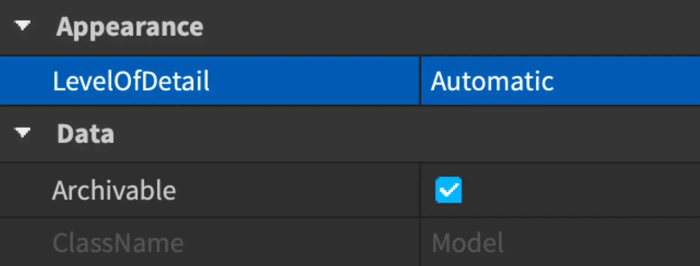

<GridContainer numColumns="2">
  <figure>
    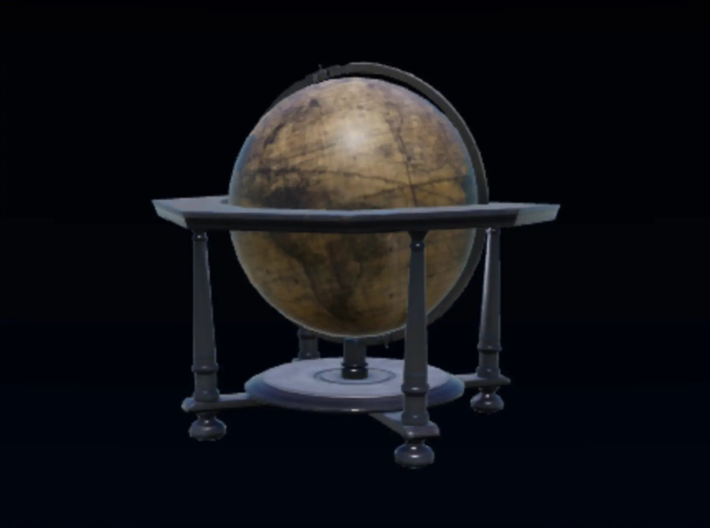
    <figcaption>실제 모델</figcaption>
  </figure>
  <figure>
    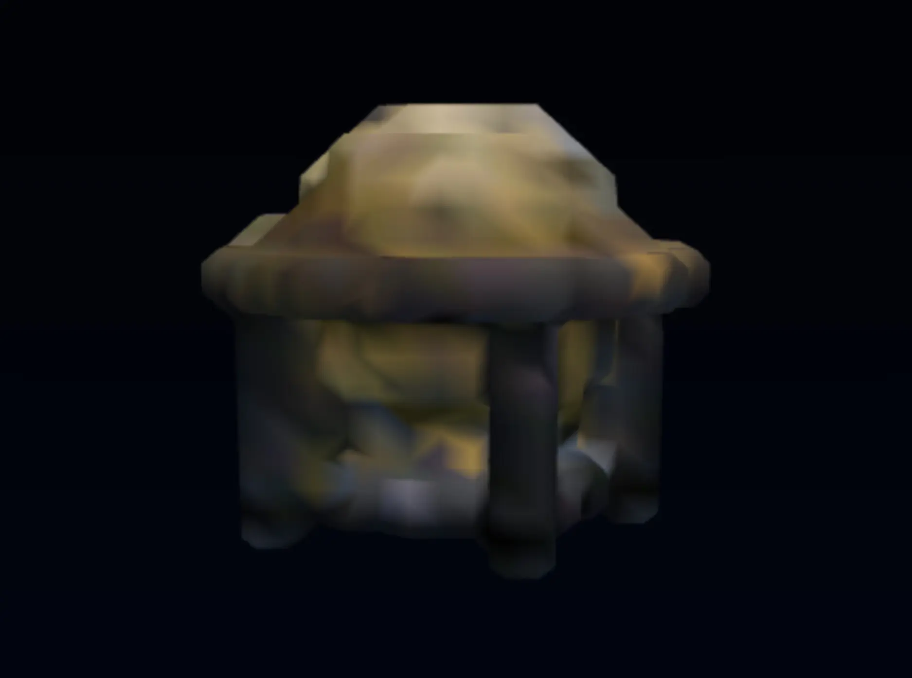
    <figcaption>저해상도 "임포스터" 메쉬</figcaption>
  </figure>
</GridContainer>

<table>
  <thead>
    <tr>
      <th>모델 설정</th>
      <th>스트리밍 동작</th>
    </tr>
  </thead>
  <tbody>
    <tr>
      <td>**StreamingMesh**</td>
      <td>모델이 클라이언트에 존재하지 않을 때 임포스터 메쉬를 비동기적으로 생성하여 표시합니다.</td>
    </tr>
    <tr>
      <td>**비활성화** / **자동**</td>
      <td>모델이 스트리밍 반경 밖에 있을 때 사라집니다.</td>
    </tr>
  </tbody>
</table>

임포스터 메쉬를 사용할 때 다음을 참고하세요:

- 임포스터 메쉬는 **카메라로부터 1024 스터드** 이상의 거리에서 보이도록 설계되었습니다. [StreamingTargetRadius]를 256과 같이 훨씬 작은 값으로 줄였다면, 임포스터 메쉬는 대체하는 모델에 대해 시각적으로 적절하지 않을 수 있습니다.
- 모델 **및** 하위 모델이 모두 **StreamingMesh**로 설정된 경우, 최상위 조상 모델만 임포스터 메쉬로 렌더링되며, 조상 및 하위 모델의 모든 기하학을 포괄합니다. 성능을 위해 하위 모델에는 **비활성화**를 사용하는 것이 좋습니다.
- 텍스처는 지원되지 않으며, 임포스터 메쉬는 부드러운 메쉬로 렌더링됩니다.
- 모델이 완전히 스트리밍되지 않을 때, 임포스터 메쉬는 모델의 개별 파트 대신 렌더링됩니다. 모든 개별 파트가 스트리밍되면, 해당 파트가 렌더링되고 임포스터 메쉬는 무시됩니다.
- 임포스터 메쉬는 물리적으로 아무 의미가 없으며, [광선 캐스팅], [충돌 감지], 물리적 시뮬레이션과 관련하여 존재하지 않는 것처럼 동작합니다.
- Studio에서 모델을 편집할 때, 예를 들어 하위 파트를 추가/삭제/재배치하거나 색상을 재설정할 때, 자동으로 대표 메쉬가 업데이트됩니다.

---
## 출처
 - [Instance Streaming](https://create.roblox.com/docs/ko-kr/workspace/streaming)

---
## [다음](./01_04_Managing_Projects_with_Roblox_Studio.md)