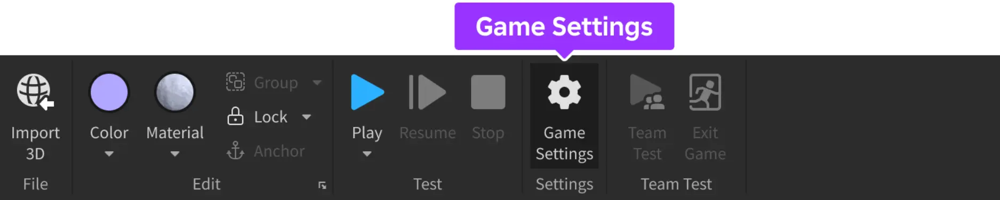
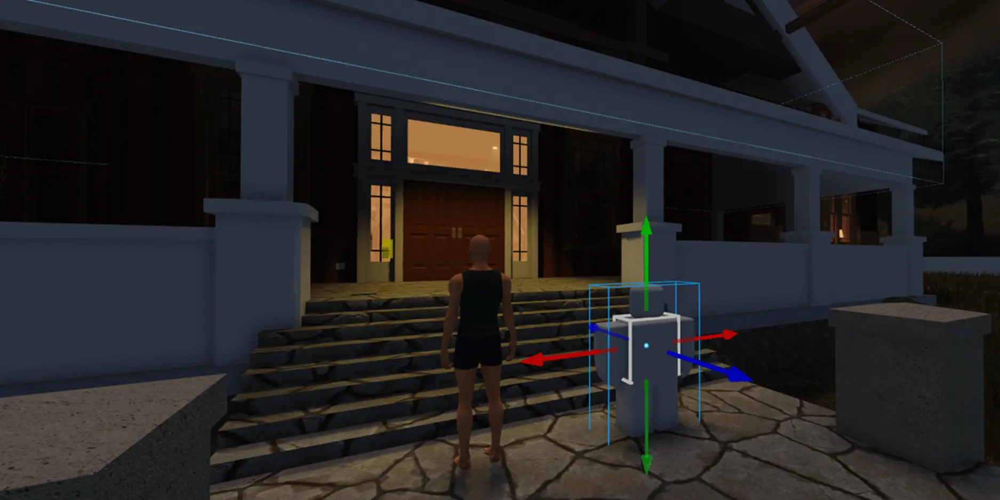
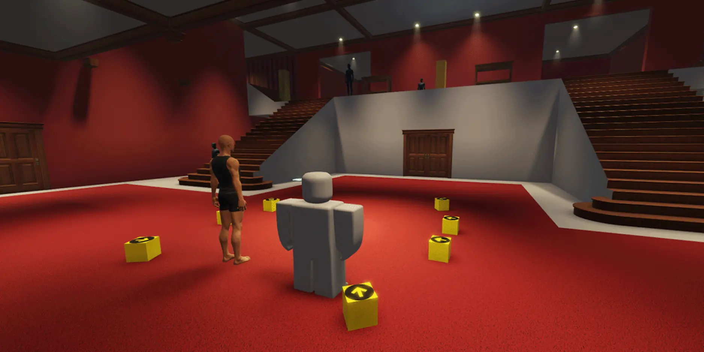
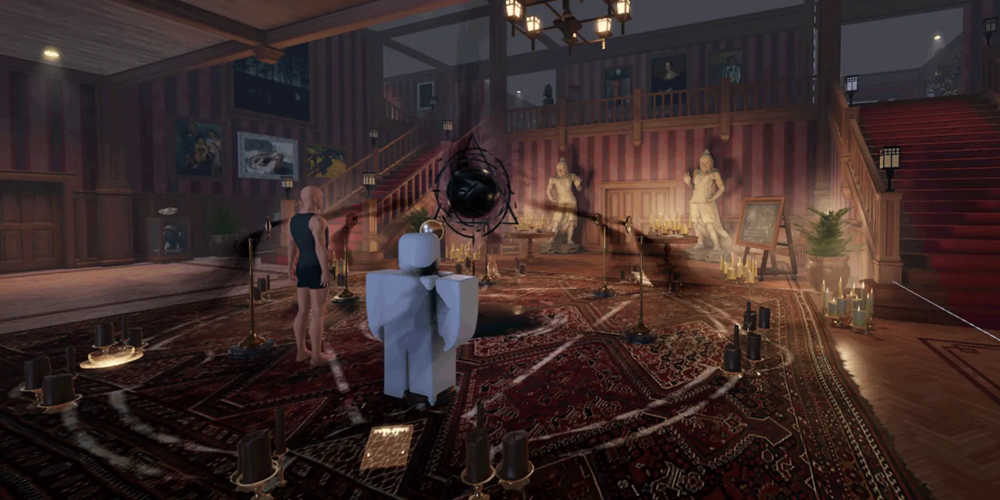
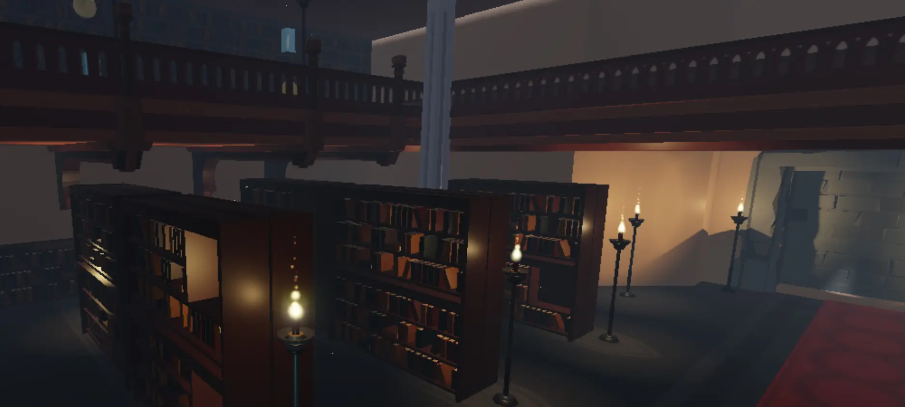

# Managing Projects with Roblox Studio

## 목차
- [Managing Projects with Roblox Studio](#managing-projects-with-roblox-studio)
  - [목차](#목차)
  - [프로젝트 생성](#프로젝트-생성)
  - [프로젝트 설정 정의](#프로젝트-설정-정의)
  - [클라우드 기반 자산](#클라우드-기반-자산)
  - [프로젝트 게시](#프로젝트-게시)
    - [베타](#베타)
    - [전체](#전체)
  - [월드 빌딩 모범 사례](#월드-빌딩-모범-사례)
    - [규모 이해](#규모-이해)
    - [그레이박싱](#그레이박싱)
    - [파트 및 메쉬](#파트-및-메쉬)
    - [재료 적용](#재료-적용)
    - [스냅 및 정렬](#스냅-및-정렬)
    - [패키지 및 자산](#패키지-및-자산)
    - [그래픽 기능](#그래픽-기능)
  - [플러그인 사용](#플러그인-사용)
    - [빌드 플러그인](#빌드-플러그인)
    - [효율성 플러그인](#효율성-플러그인)
    - [성능 도구](#성능-도구)
    - [프로젝트 관리](#프로젝트-관리)
  - [출처](#출처)
  - [다음](#다음)

---

## 프로젝트 생성

프로젝트를 생성하려면 다음 단계를 따르세요:

1. `Roblox Studio`를 엽니다.
2. Studio 시작 화면에서 템플릿을 클릭합니다.
3. 변경 사항을 만든 후 **파일** 메뉴에서 프로젝트를 저장할 수 있습니다:
   - **파일로 저장** - 현재 작업 중인 장소를 `.rbxl` 파일로 디스크에 저장합니다.
   - **Roblox에 저장** - 프로젝트의 기본 시작 장소로 Roblox 서버에 장소를 저장합니다.
     이 옵션을 선택하면 Roblox에서 프로젝트 설정을 정의하도록 요청하여 클라우드에서 프로젝트를 적절히 관리할 수 있습니다.
   - **다른 이름으로 Roblox에 저장...** - 기존 프로젝트에 장소를 추가하여 저장합니다.

## 프로젝트 설정 정의

프로젝트 설정은 Roblox가 클라우드에서 프로젝트의 구성 요소를 관리하는 방법을 알려줍니다. 이러한 설정은 프로젝트를 Roblox에 저장한 후에만 사용할 수 있습니다. 프로젝트 설정을 정의하려면:

1. 메뉴 바에서 **홈** 탭을 선택한 다음 **게임 설정**을 클릭합니다. 프로젝트를 저장하지 않았다면 저장하라는 메시지가 나타납니다.

   

2. **기본 정보** 탭의 필수 필드를 작성하고 **저장**을 클릭합니다.
   이렇게 하면 [게임 설정](../studio/game-settings.md)에서 설명한 대로 다른 프로젝트 설정을 정의할 수 있는 더 많은 탭이 잠금 해제됩니다.

## 클라우드 기반 자산

Roblox에서는 이미지, 메쉬 및 오디오와 같은 자산이 **클라우드 기반 자산**으로 저장되므로, 로컬 복사본을 Studio 경험에 번들로 묶을 필요가 없습니다. 클라우드의 각 자산은 고유한 **자산 ID**가 할당되어 여러 경험에서 이를 활용할 수 있습니다.

인스턴스, 자산 및 Roblox에서의 연관성에 대한 자세한 내용은 [자산](./02_assets.md)을 참조하세요.

## 프로젝트 게시

### 베타

경험을 더 넓은 청중에게 테스트할 준비가 되었을 때, 공개적으로 릴리스 할 수 있지만, 베타 테스트는 여전히 개발 주기의 중요한 부분이어야 합니다. 어떤 국가에서 경험에 접근할 수 있는지 결정할 수 없으므로, 소규모 시장에서 베타 테스트를 실행할 수 있는 능력이 제한되므로 다음과 같은 대체 전략을 고려하십시오:

<Tabs>
  <TabItem label="유료 접근 베타">
    유료 접근 모델에서는 사용자가 플랫폼의 화폐인 **Robux**로 선불 요금을 지불해야 합니다. 이는 사용자 기반을 제한하여 더 작은 서버 채우기로 테스트하고 반복할 수 있지만, 수집된 테스트 결과는 더 넓은 청중 사이의 성능을 반영하지 않을 수 있습니다.
  </TabItem>
  <TabItem label="유령 릴리스">
    "유령 릴리스" 모델에서는 임시 이름과 아이콘으로 경험을 릴리스합니다. 이는 마케팅 매력을 측정하지는 않지만, 평점에 영향을 주지 않고 경험을 테스트할 수 있습니다. 테스트가 완료되면 유령 버전을 제거하고 전체 릴리스를 수행할 수 있습니다.
  </TabItem>
</Tabs>

### 전체

경험을 전 세계에 릴리스할 준비가 되면, 최종 이름과 완전한 설명, 아이콘 및 기타 홍보 이미지를 포함하여 공개적으로 릴리스 할 수 있습니다. 릴리스 이름, 설명 및 홍보 자료에 대한 지침은 메타데이터 모범 사례, 경험 아이콘 및 홍보 썸네일을 검토하십시오.

## 월드 빌딩 모범 사례

다음 팁은 프로젝트를 생성하는 방법부터 Studio에서 레벨 디자인 접근 방식에 이르기까지 더 효율적이고 세련된 방식으로 세계를 구축하는 데 도움이 됩니다.

### 규모 이해

사용자의 표현을 통해 디자이너가 세계의 규모를 이해하고 복도나 문과 같은 크기 민감한 영역을 수용할 수 있습니다. 이 목적을 위해 캐릭터 모델을 삽입하려면:

1. 메뉴 바에서 **아바타** 탭을 선택한 다음 **리그 빌더**를 클릭합니다.
2. 리그 중 하나를 선택하여 경험에 삽입합니다. 빌드하는 동안 주요 영역 근처에 리그를 배치하여 구조물의 규모를 더 잘 이해하십시오.

### 그레이박싱

그레이박싱은 **플레이스홀더** 아트를 사용하여 환경을 구축하는 레벨 디자인 프로세스입니다. 레벨이 생성되면, 게임플레이, 규모 및 시각적 요소를 평가하기 위해 플레이테스트를 수행할 수 있습니다. 그런 다음 그레이박스 자산을 대체할 최종 아트 자산을 제작할 수 있습니다.

Studio의 도구 상자 및 솔리드 모델링 도구는 경험을 디자인하고 빌드할 때 그레이박싱에 완벽합니다. Roblox 쇼케이스 [듀발 드라이브의 미스터리](https://create.roblox.com/docs/ko-kr/resources/the-mystery-of-duvall-drive)에서 그레이박싱의 사용을 참고하십시오.

<GridContainer numColumns="2">
  <figure>
    
    <figcaption>그레이박스 지도</figcaption>
  </figure>
  <figure>
    
    <figcaption>완성된 지도</figcaption>
  </figure>
</GridContainer>

<Alert severity='info'>
Roblox는 다양한 환경을 포함한 다양한 무료 고품질 [아트 키트](https://devforum.roblox.com/t/free-synty-asset-packs-released-in-the-marketplace/1283755)를 마켓플레이스에서 제공하여 귀하의 경험에 사용할 수 있습니다.
</Alert>

### 파트 및 메쉬

환경의 객체는 일반적으로 파트 또는 MeshPart로 구성됩니다. 환경의 섹션을 구축하기 전에 해당 구성 요소가 파트여야 하는지 또는 MeshPart여야 하는지 고려하십시오.

- **파트**는 블록, 구 및 실린더와 같은 기본 제공 모양으로, 그대로 사용하거나 솔리드 모델링을 사용하여 결합할 수 있습니다. 그레이박싱 또는 벽 및 바닥과 같은 간단한 건축 요소에 파트를 사용하십시오.

- **MeshPart**는 복잡한 건축 객체 및 소품에 사용되는 가져온 3D 자산입니다. 또한 `Class.SurfaceAppearance`를 지원하여 노멀 맵과 같은 고급 그래픽 옵션을 허용합니다.

다음 이미지에서는 파트를 사용하여 벽, 바닥 및 난간을 구성했습니다. 촛대 및 책장과 같은 다른 모든 객체는 `Class.MeshPart` 객체입니다. 자세한 내용은 메쉬 및 외부 모델링을 참조하십시오.

### 재료 적용

더 큰 시각적 세련미를 위해 기본 **플라스틱** 재료를 변경하는 것이 좋습니다. 간단히 **콘크리트**로 전환하는 것만으로도 색상에 영향을 주지 않으면서 시각적 잡음과 세부 사항의 수준을 약간 추가할 수 있습니다. 다른 재료 설정 및 사용자 정의 재료 생성에 대한 정보는 재료를 참조하십시오.

### 스냅 및 정렬

항상 객체가 **그리드에 정렬**되어 있는지 확인하십시오. 위치 및 크기 값도 1 또는 0.25의 일반적인 증분으로 설정해야 합니다. 객체가 정렬되지 않거나 크기가 일관되지 않으면 벽

의 작은 틈과 같은 작은 불규칙이 나타날 가능성이 높습니다.

### 패키지 및 자산

패키지는 개발자가 정의한 재사용 가능한 객체 세트로, 여러 장소에서 쉽게 수정 및 업데이트할 수 있습니다. 대규모 프로젝트에서는 패키지가 매우 유용합니다. 패키지를 사용하면 다음과 같은 이점이 있습니다:

- 패키지는 **자산 키트**로 사용할 수 있어 개발자가 필요한 만큼 객체 세트를 복제할 수 있습니다. 경험에 여러 장소가 있는 경우, 자산 키트를 여러 장소에서 재사용하여 일관성을 제공할 수 있습니다.
- 패키지는 자산을 **업데이트**하기 쉽게 만듭니다. 예를 들어, 패키지에는 환경에 여러 번 복제된 나무가 포함될 수 있습니다. 개발자가 텍스처 교체와 같은 변경을 해야 할 경우, 각 개별 인스턴스가 아닌 패키지에서 한 번만 업데이트하면 됩니다.
- 패키지는 **그레이박싱**을 더 빠르게 만듭니다. 패키지는 그레이박스 자산으로 시작할 수 있으며, 결국 최종 아트 자산으로 교체될 수 있습니다. 자산이 교체되면 모든 원래 위치와 방향을 유지합니다.

<Alert severity='info'>

패키지로 자산 키트를 생성하기로 결정한 경우, 모든 자산 키트를 단일 Roblox 장소에 저장하는 것이 좋습니다.

</Alert>

### 그래픽 기능

Roblox는 엔진에 지속적으로 새로운 기능을 추가하고 있습니다. 최신 기능에 대한 소식은 [DevForum 공지 섹션](https://devforum.roblox.com/c/updates/announcements/36)에서 확인할 수 있습니다.

또한, Roblox 쇼케이스 경험에는 최신 기능이 구현된 문서가 있습니다. 예를 들어, [Beyond the Dark Showcase](https://create.roblox.com/docs/ko-kr/resources/beyond-the-dark) 및 [듀발 드라이브의 미스터리](https://create.roblox.com/docs/ko-kr/resources/the-mystery-of-duvall-drive)에서는 자산 패키지, 모듈식 빌딩 등을 포함한 모범 사례를 설명합니다.

## 플러그인 사용

많은 개발자가 프로젝트 관리와 빌드 프로세스를 돕기 위해 플러그인 또는 타사 통합을 사용합니다. 여기에는 몇 가지 예가 나와 있습니다.

<Alert severity='info'>

이 타사 플러그인은 커뮤니티에서 개발했으며 Roblox에서 개발한 것이 아니며, 아래에 포함되었다고 해서 Roblox가 이를 승인하거나 추천한다는 의미는 아닙니다. Roblox는 이러한 플러그인을 제어하지 않으며, 이러한 플러그인이 안전하거나 오류 또는 기타 문제(유해한 구성 요소 포함)로부터 자유롭다는 것을 보장하지 않으며, Roblox는 플러그인의 사용과 관련하여 발생할 수 있는 모든 책임을 부인하며, 플러그인의 사용은 사용자 자신의 책임입니다.

</Alert>

### 빌드 플러그인

다음 도구는 지형을 더 쉽게 생성하거나 환경을 더 빠르게 빌드하는 데 자주 사용됩니다.

- [Brush Tool](https://www.roblox.com/library/2268520847/Brushtool-2-1) &mdash; 개발자가 객체 세트를 "그리는" 방식으로 숲이나 지면 덮개와 같은 관련 요소를 생성할 수 있습니다.

- [Resize Align by Stravant](https://www.roblox.com/library/165534573/Stravant-ResizeAlign) &mdash; 객체를 다른 객체에 맞춰 정렬하도록 크기를 조정합니다. 벽, 복도, 천장과 같은 구조적 및 건축 작업에 매우 유용합니다.

- [Reflect by Stravant](https://www.roblox.com/library/217792838/Stravant-Model-Reflect) &mdash; 선택한 평면을 기준으로 모델을 반사합니다.

- [Archimedes by Scriptos](https://www.roblox.com/library/144938633/Archimedes-v3-1-7) &mdash; 파트를 사용하여 아치나 원형 구조를 생성합니다.

- [Sun Position Plugin](https://www.roblox.com/library/979015838/Sun-Position-Plugin) &mdash; 하늘 상자를 클릭하여 태양의 위치를 설정합니다.

- [Terrain Save and Load](https://www.roblox.com/library/148042198/Terrain-Save-and-Load) &mdash; 한 장소에서 다른 장소로 지형을 복사 및 붙여넣기합니다.

### 효율성 플러그인

이 도구는 더 큰 환경을 관리하는 데 자주 사용되며, 일부 빈번한 프로세스를 가속화하여 찾기 및 선택을 더 쉽게 만듭니다.

- [Selection Plugin](https://www.roblox.com/library/143326409/Selection-Plugin) &mdash; 탐색기 또는 게임 편집기 보기에서 동일한 이름을 가진 여러 객체를 선택할 수 있습니다.

- [Part Picker](https://www.roblox.com/library/2666837095/PartPicker) &mdash; 검색 기준에 맞는 모든 파트를 선택합니다. 예를 들어, 특정 메쉬 ID를 가진 모든 모델 또는 콘크리트 재료를 가진 모든 파트를 선택합니다.

- [Power Selectors](https://www.roblox.com/library/7707654204/Power-Selectors) &mdash; 파트를 더 빠르고 쉽게 선택할 수 있습니다. 원형 또는 사각형을 사용하여 파트를 선택할 수 있습니다. 파트가 모델이나 폴더에 있더라도 선택할 수 있습니다.

- [Particle Emitter Emit()](https://www.roblox.com/library/303835976/ParticleEmitter-Emit-n-V2) &mdash; 파티클 발사기가 선택되면 파티클을 방출하는 버튼을 표시합니다. 파티클 버스트를 테스트하는 데 유용합니다.

### 성능 도구

다음 도구는 빌더가 성능 고려 사항을 테스트하고 관리하는 데 사용됩니다.

- [Mesh Optimization Tools](https://www.roblox.com/library/414923656/Mesh-Optimization-Tools) &mdash; TriangleMeshPart 객체(MeshPart/UnionOperation)의 기하학 및 물리 최적화를 위한 유용한 도구를 제공하는 플러그인입니다. 또한 충돌 볼륨을 시각화합니다.

- [Render Settings Plugin](https://www.roblox.com/library/393398335/Render-Settings-Plugin) &mdash; 엔드 사용자가 다양한 장치에서 볼 수 있는 설정을 시뮬레이션하기 위해 Studio 및 클라이언트 품질 수준을 편집하는 시간을 단축시킵니다.

### 프로젝트 관리

[Rojo](https://rojo.space/)는 팀이 외부 버전 제어 시스템이나 텍스트 편집기를 사용하고자 할 때 유용합니다. 자세한 내용은 [외부 도구](external-tools.md)를 참조하십시오.

---
## 출처
 - [Managing Projects with Roblox Studio](https://create.roblox.com/docs/ko-kr/projects/managing)

---
## [다음](./01_05_Setting_Up_a_Team.md)