# Collaboration

## 목차
- [Collaboration](#collaboration)
  - [목차](#목차)
  - [협력자 관리](#협력자-관리)
    - [그룹 소유 경험](#그룹-소유-경험)
    - [사용자 소유 경험](#사용자-소유-경험)
  - [세션에 접근하기](#세션에-접근하기)
    - [협력자 보기](#협력자-보기)
    - [선택 시각화](#선택-시각화)
    - [협력자 합류](#협력자-합류)
    - [협력자와의 채팅](#협력자와의-채팅)
  - [협력 스크립팅](#협력-스크립팅)
    - [라이브 스크립팅](#라이브-스크립팅)
    - [드래프트 모드](#드래프트-모드)
      - [드래프트 커밋](#드래프트-커밋)
      - [변경 내용 비교 및 병합](#변경-내용-비교-및-병합)
      - [삭제된 스크립트 복원](#삭제된-스크립트-복원)
    - [스크립트 히스토리 보기](#스크립트-히스토리-보기)
  - [저장 및 게시](#저장-및-게시)
  - [이전 버전으로 복원](#이전-버전으로-복원)
  - [협업 비활성화](#협업-비활성화)
  - [출처](#출처)
  - [다음](#다음)

---

고품질의 경험을 만들기 위해서는 모델링, 스크립팅, 사용자 인터페이스 디자인, 오디오 제작 등 다양한 기술이 필요합니다. 한 사람이 이 모든 기술을 갖추는 것은 드물기 때문에, 다양한 역할 간의 협업은 개발 워크플로의 필수적인 부분입니다.

스튜디오의 **내장된** **협업 도구**를 사용하면 창작자들이 각자 독립적으로 작업할 수 있을 뿐만 아니라, 팀원들과 함께 동시에 작업할 수도 있습니다.

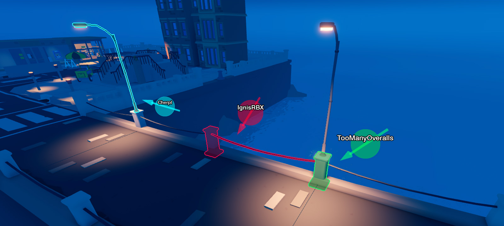

## 협력자 관리

경험에 추가한 협력자는 경험에 대한 접근 수준에 해당하는 권한 설정을 가집니다. 다음은 사용자 권한 설정의 다양한 종류입니다:

<table>
  <thead>
    <tr>
      <th>권한</th>
      <th>설명</th>
    </tr>
  </thead>
  <tbody>
    <tr>
      <td>**소유자**</td>
      <td>사용자는 경험의 소유자이며, 다른 사용자의 권한을 구성할 수 있는 권한을 가집니다.</td>
    </tr>
		<tr>
      <td>**편집**</td>
      <td>사용자는 경험을 편집할 수 있는 권한을 가집니다. 이는 또한 사용자에게 **플레이** 권한을 부여합니다.</td>
    </tr>
		<tr>
      <td>**플레이**</td>
      <td>사용자는 경험을 개인적으로 플레이할 수 있는 권한을 가집니다.</td>
    </tr>
		<tr>
      <td>**접근 없음**</td>
      <td>사용자는 **편집** 또는 **플레이** 권한이 없습니다.</td>
    </tr>
	</tbody>
</table>

`그룹 소유 경험`과 `사용자 소유 경험`을 관리할 때 몇 가지 작은 차이점이 있습니다.

### 그룹 소유 경험

`group` 경험의 경우, 그룹 **소유자**만이 그룹의 역할을 통해 권한을 관리할 수 있습니다. 이는 **모든 그룹 경험** 또는 **개별 경험**에 대해 가능합니다. 그룹 소유자는 또한 개별 협력자를 그룹 소유 경험에 동일한 워크플로로 추가할 수 있지만, 이는 **플레이** 접근만 가능합니다.

<Tabs>
<TabItem label="모든 그룹 경험">
그룹 소유자인 경우, **모든** 그룹 경험에 대해 권한을 설정할 수 있습니다. 예를 들어, "오디오 아티스트" 그룹 역할에 **편집** 권한을 부여하여 모든 경험에서 오디오 재생을 미세 조정할 수 있도록 할 수 있습니다.

1. [그룹](https://www.roblox.com/groups) 페이지로 이동하여 그룹을 선택합니다.
2. 오른쪽 상단 모서리에 있는 **&ctdot;** 버튼을 클릭하고 **그룹 구성**을 선택합니다.

   

3. 그룹 구성 페이지의 왼쪽 열에서 **역할** 탭을 선택합니다.

   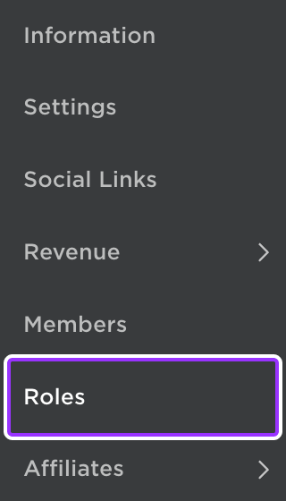

4. 편집 권한을 부여할 각 그룹 역할을 선택하고 **그룹 경험 생성 및 편집**을 활성화합니다.

   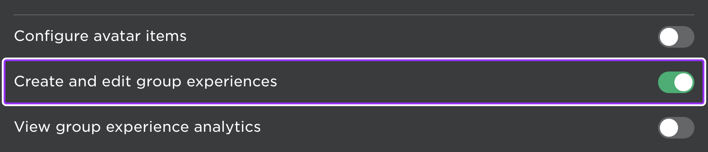

   스튜디오의 **협력자 관리** 창에서 그룹 소유 경험에 대해 이러한 역할은 **편집** 권한으로 표시되지만, 스튜디오에서 권한 수준을 변경할 수 없음을 나타내기 위해 음영처리됩니다.

   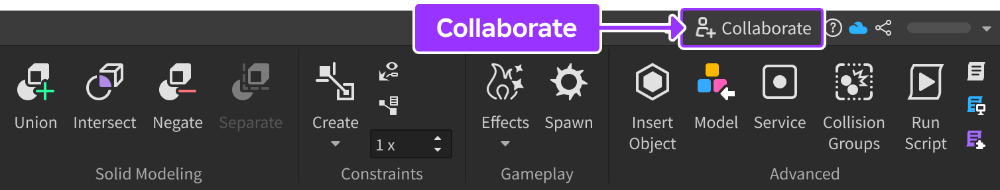

   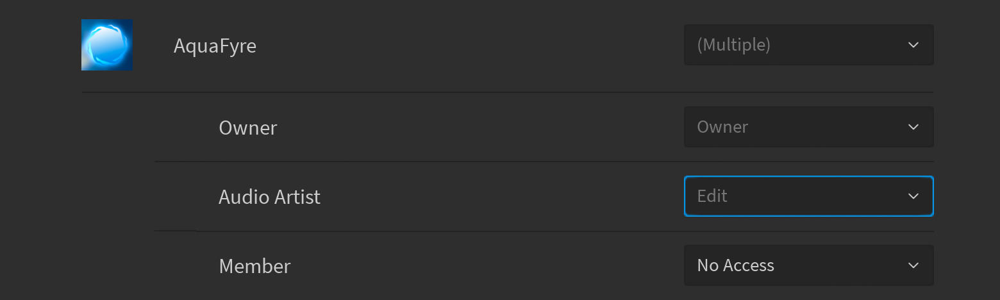

</TabItem>
<TabItem label="개별 경험">
그룹 소유자인 경우, 모든 그룹 경험을 편집할 권한이 없는 역할에 대해 개별 경험에 대한 **편집** 권한을 부여할 수 있습니다. 예를 들어, "FX 아티스트" 그룹 역할에 임시로 **편집** 권한을 부여하여 공개 출시 전에 시각 효과를 미세 조정할 수 있습니다.

1. 스튜디오에서 경험을 열고 오른쪽 상단 모서리에 있는 **협력** 버튼을 클릭합니다.

   

1. 원하는 역할에 대한 권한 드롭다운에서 **편집**을 선택합니다. 이미 모든 그룹 경험에 대한 편집 권한을 가지고 있지 않은 역할만 수정할 수 있음을 기억하세요.

   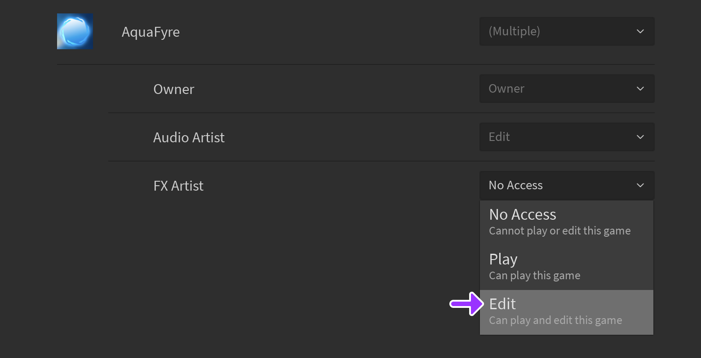

1. 협력 설정을 저장하여 변경 사항을 적용합니다. 수정된 역할의 모든 그룹 구성원은 이제 이 경험에 대해서만 **편집** 권한을 가지게 되며, 다른 그룹 경험에 대한 동일한 권한을 부여하지는 않습니다.

</TabItem>
</Tabs>

### 사용자 소유 경험

사용자 소유 경험의 경우, **플레이** 접근 권한을 모든 사용자 또는 그룹에 부여할 수 있지만, **편집** 권한은 Roblox 친구에게만 부여할 수 있습니다.

소유한 경험에 친구에게 **편집** 권한을 부여하려면:

1. 스튜디오에서 경험을 열고 오른쪽 상단 모서리에 있는 **협력** 버튼을 클릭합니다.

   

2. 상단의 검색창에 추가할 협력자를 검색합니다. 검색창 아래에 일치하는 협력자가 나열되며, 친구는 이름 아래에 **친구** 레이블로 표시됩니다. 추가할 협력자를 선택합니다.

   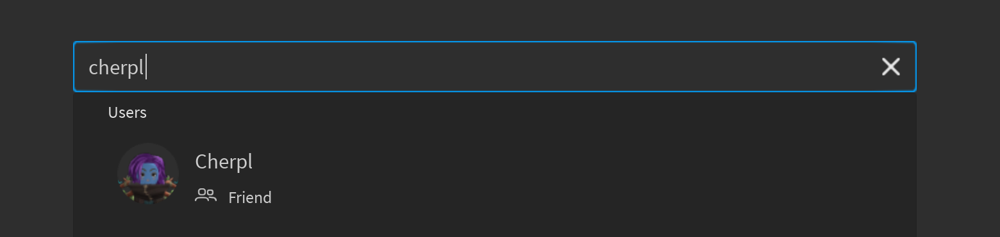

3. 친구에 대한 권한 드롭다운에서 **편집**을 선택합니다.

   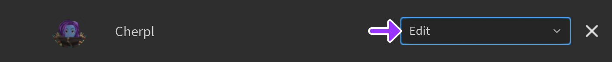

4. 협력 설정을 저장하여 변경 사항을 적용합니다.

## 세션에 접근하기

경험을 편집할 권한이 있는 사람은 다음과 같이 협력 세션에 참여할 수 있습니다:

1. [크리에이터 대시보드](https://create.roblox.com/dashboard/creations)로 이동합니다.
2. 경험이 그룹 소유인지 사용자 소유인지에 따라 경험을 찾습니다.

   <Tabs>
   <TabItem label="그룹 소유 경험">
   왼쪽 상단 선택 메뉴에서 그룹을 선택합니다. 그런 다음, 왼쪽에서 **창작물**이 선택되었는지 확인하고, 메인 패널에서 **내 경험**을 선택합니다.

   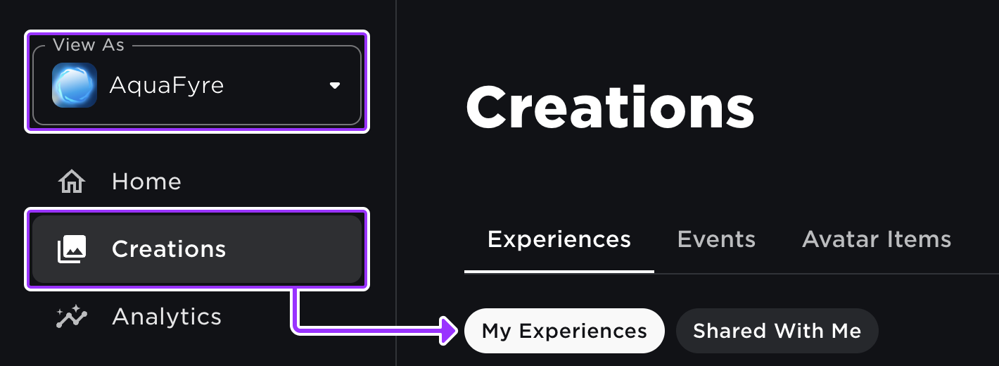

   </TabItem>
   <TabItem label="사용자 소유 경험">
   왼쪽 상단 선택 메뉴에서 개인 계정을 선택합니다. 그런 다음, 왼쪽에서 **창작물**이 선택되었는지 확인하고, 메인 패널에서 **나와 공유된 것**을 선택합니다.

   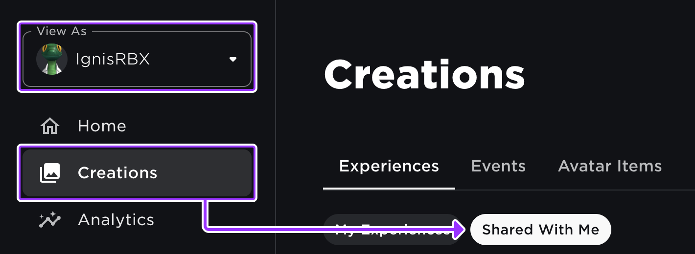

   </TabItem>
   </Tabs>

3. 협력할 경험

 위로 마우스를 올리고 **스튜디오에서 편집** 버튼을 클릭합니다.

   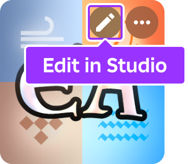

### 협력자 보기

협력 세션에서 작업하는 동안, 스튜디오의 오른쪽 상단 모서리에서 현재 협력자를 볼 수 있으며, 각 협력자는 모든 협력자의 장치에서 일관된 고유 색상이 할당됩니다.

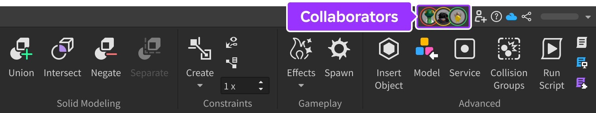

현재 협력자에 대한 자세한 정보를 보려면, 아이콘 중 하나를 클릭하여 **라이브 협력자** 창을 엽니다. 이 창에서 사용자가 스튜디오 내부에서 활성 상태인지 비활성 상태인지를 확인할 수 있으며, 사용자가 작업 중인 위치를 나타내는 표시도 볼 수 있습니다. 사용자가 5분 이상 스튜디오를 사용하지 않으면 비활성 상태가 됩니다.

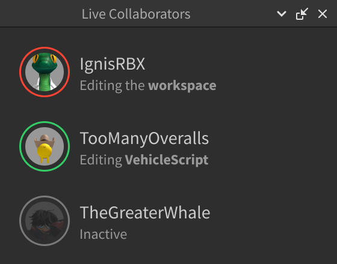

### 선택 시각화

기본적으로 스크립트 편집기에서 선택한 코드와 3D 뷰포트에서 선택한 객체는 각 협력자에게 할당된 고유 색상으로 강조 표시됩니다. 또한, 탐색기 창에서는 다른 협력자가 선택한 객체를 나타내기 위해 이 할당된 색상으로 점이 표시됩니다.

<Grid container spacing={2}>
<Grid item>
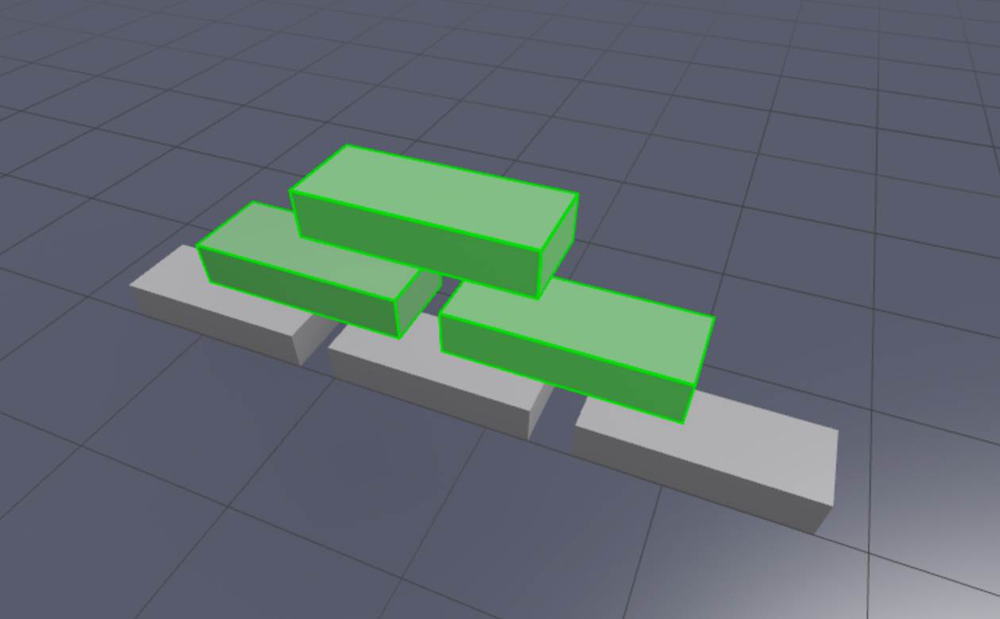
</Grid>
<Grid item>
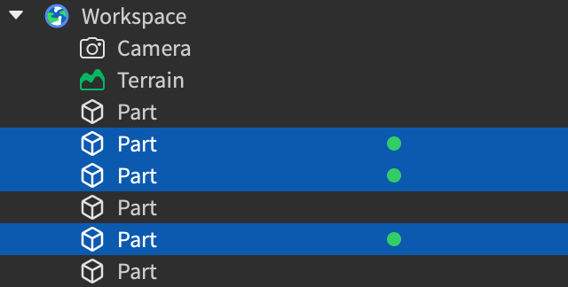
</Grid>
</Grid>

모든 협력자의 선택을 보지 않고도 여전히 작업을 볼 수 있도록 하려면, 라이브 협력자 창 하단에서 **협력자 선택 표시**를 체크 해제합니다.

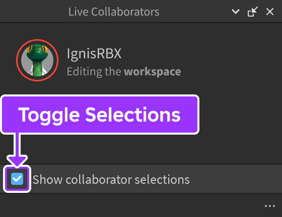

### 협력자 합류

협력자가 편집 중인 스크립트의 정확한 줄이나 작업 공간의 위치로 빠르게 이동하려면, 라이브 협력자 창에서 그들의 이름 위로 마우스를 올리고 **합류** 버튼을 클릭합니다.

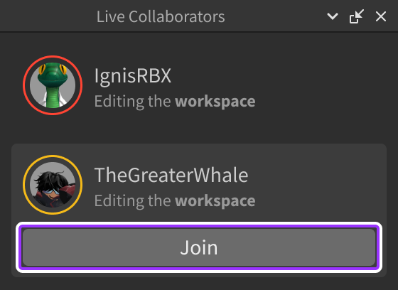

### 협력자와의 채팅

세션 중 협력자와 채팅하려면:

1. 보기 탭에서 **팀 채팅**을 클릭합니다.

   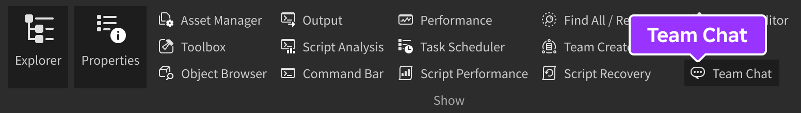

2. 입력 텍스트 필드에 클릭하고 메시지를 입력한 후, <kbd>Enter</kbd> 키를 눌러 메시지를 보냅니다.

## 협력 스크립팅

협력 세션에서는 라이브 스크립팅을 통해 실시간으로 함께 코딩하거나, 더 집중된 환경에서 스크립트를 작성한 후 협력자와 공유된 리포지토리에 커밋하는 드래프트 모드로 작업할 수 있습니다.

### 라이브 스크립팅

**라이브 스크립팅**을 통해 협력자는 실시간으로 함께 코딩할 수 있습니다. 스크립트 편집기에서 각 협력자의 커서 색상은 라이브 협력자 창에서 할당된 색상과 일치합니다.

<Grid container spacing={2}>
<Grid item>
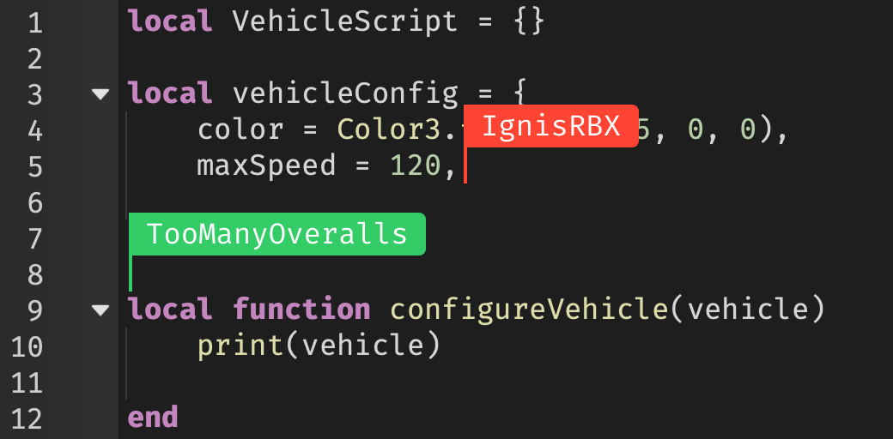
</Grid>
<Grid item>

</Grid>
</Grid>

라이브 스크립팅을 하는 동안 편집 내용은 장소 편집과 마찬가지로 5분마다 자동 저장되며, 협력자는 언제든지 <kbd>Ctrl</kbd><kbd>S</kbd> (<kbd>⌘</kbd><kbd>S</kbd>)를 눌러 스크립트를 수동으로 저장할 수 있습니다. 저장되거나 자동 저장된 버전은 스크립트 기록 창에 기록됩니다.

<Alert severity="info">
라이브 스크립팅은 기본적으로 **활성화**되어 있습니다. 팀이 소스 제어와 유사한 환경에서 스크립트를 협업하기를 선호하는 경우, 드래프트 모드를 탐색해보세요.
</Alert>

### 드래프트 모드

**드래프트** 모드를 통해 다른 사람에게 영향을 주지 않고 독립적으로 스크립트를 편집하고 테스트할 수 있습니다. 스크립트를 작성한 후, 공유된 리포지토리에 커밋하고 협력자와 함께 커밋된 버전을 팀 테스트할 수 있습니다.

<Alert severity="warning">
드래프트 모드는 기본적으로 **비활성화**되어 있습니다. 이를 활성화하려면 게임 설정 창을 열고, **기타** 탭을 선택한 다음 **드래프트 모드 활성화**를 켭니다.

모든 협력자는 변경 사항이 적용되기 위해 세션에서 나가야 합니다. 또는, 협업 비활성화를 한 다음 다시 활성화하여 세션을 재시작할 수 있습니다.
</Alert>

#### 드래프트 커밋

스크립트를 편집한 후, 보기 탭에서 접근할 수 있는 **드래프트** 창에 표시됩니다. 드래프트는 로컬 파일 시스템에 저장되며 동일한 기기에서의 스튜디오 세션 간에도 유지됩니다.

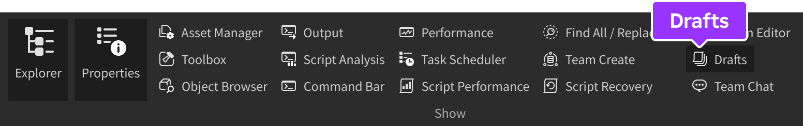

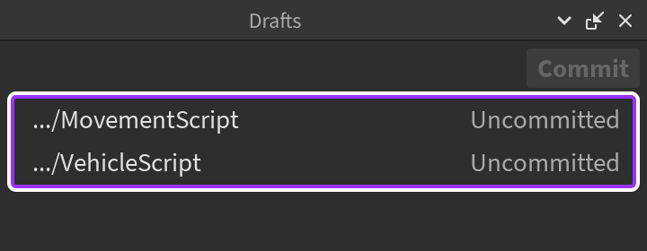

로컬 편집 내용을 리포지토리에 커밋하려면, 스크립트를 마우스 왼쪽 버튼으로 클릭하거나 <kbd>Shift</kbd> 키를 누른 상태에서 여러 스크립트를 왼쪽 버튼으로 클릭하여 선택합니다. 그런 다음 **커밋** 버튼을 클릭하여 선택한 모든 스크립트를 커밋합니다.

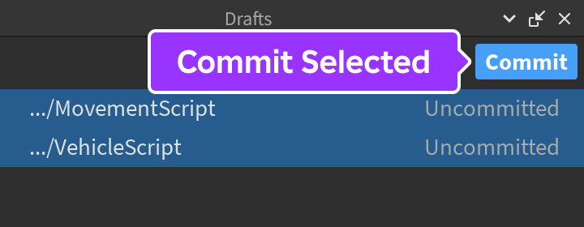

#### 변경 내용 비교 및 병합

다른 협력자가 편집 중인 동일한 스크립트에 변경 내용을 커밋하면, **드래프트** 창에 초록색 **&CirclePlus;** 아이콘이 나타납니다. 변경 내용을 보려면 스크립트를 마우스 오른쪽 버튼으로 클릭하고 **서버와 비교**를 선택합니다.

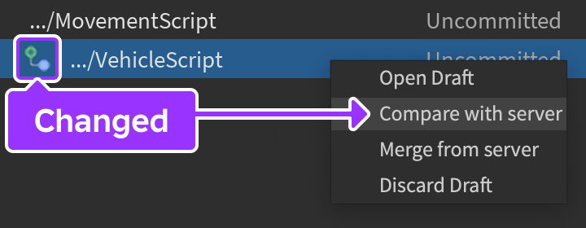

스크립트 편집기에서 열리는 **(Diff)** 탭에서 다른 협력자가 변경하거나 삭제한 코드는 빨간색으로, 사용자가 업데이트한 코드는 초록색으로 나타납니다.

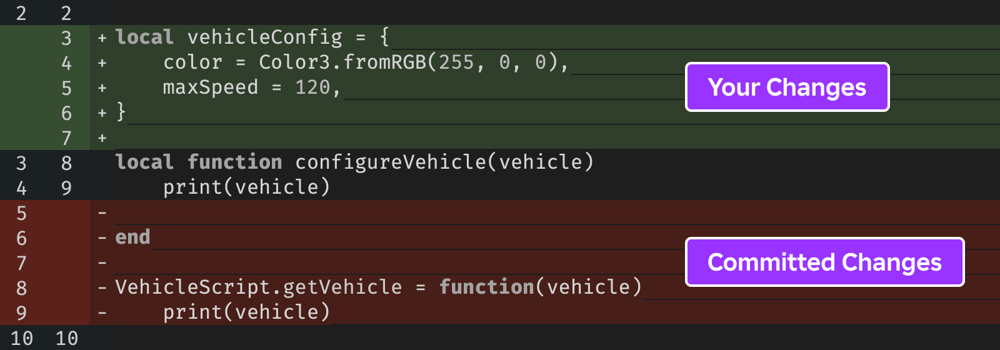

변경 내용을 스크립트에 병합하려면:

1. **드래프트** 창에서 스크립트를 마우스 오른쪽 버튼으로 클릭하고 **서버에서 병합**을 선택합니다.

   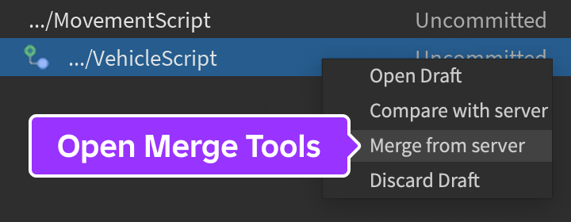

2. 병합 창에서 어떤 코드를 유지할지 선택하거나 수동으로 편집할 수 있습니다.

   - **드래프트**를 체크하여 자신의 변경 내용을 유지하거나, 체크 해제하여 삭제합니다.
   - **서버**를 체크하여 커밋된 변경 내용을 드래프트에 병합하거나, 체크 해제하여 무시합니다.
   - **기타**를 체크하여 수동으로 스크립트를 편집하고 변경 내용을 드래프트에 저장합니다.

3. 병합 결과를 미리 본 후, **모두 병합**을 클릭하여 로컬 스크립트를 업데이트합니다.

#### 삭제된 스크립트 복원

협력자가 편집 중인 스크립트를 삭제한 경우, **드래프트** 창에 빨간색 **&#8856;** 아이콘이 나타납니다. 스크립트를 복원하려면, 스크립트를 마우스 오른쪽 버튼으로 클릭하고 **스크립트 복원**을 선택합니다. 스크립트는 장소의 **워크스페이스** 트리에 복원되므로 원래 위치로 수동으로 다시 부모를 설정해야 할 수도 있습니다.

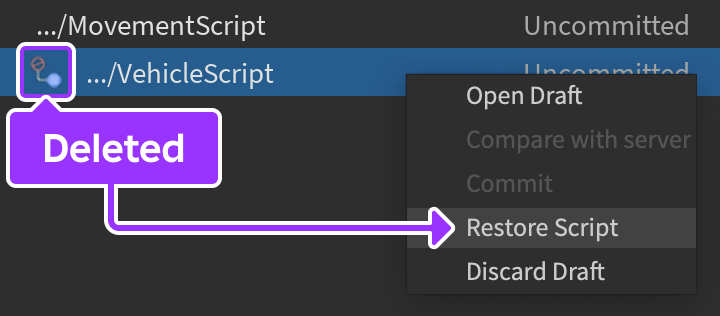

### 스크립트 히스토리 보기

협력자가 저장했거나 자동 저장되었거나 협력자가 드래프트 모드를 통해 커밋한 모든 스크립트 변경 사항은 **버전 히스토리** 창에 기록됩니다. 액세스하려면:

1. 탐색기 창에서 스크립트를 오른쪽 클릭하고 **스크립트 히스토리 보기**를 선택합니다.
2. 열리는 **버전 히스토리** 창에서, 커밋된 모든 스크립트 버전, 커밋 날짜, 커밋한 협력자 등을 확인할 수 있습니다. 이 창에서 다음 작업을 수행할 수 있습니다:

   <Tabs>
   <TabItem label="이전 버전과 비교">
   어떤 버전(가장 오래된 버전 제외)이든 이전 버전과 비교하려면, 선택하고 **이전 버전과 비교**를 클릭합니다. 스크립트 편집기에서 열리는 **(Diff)** 탭에서 최신 버전의 코드는 초록색으로, 이전 버전의 코드는 빨간색으로 나타납니다.
   </TabItem>
   <TabItem label="선택된 버전 비교">
	 어떤 **두** 버전이든 비교하려면, <kbd>Ctrl</kbd> 또는 <kbd>⌘</kbd> 키를 누르고 두 버전을 선택한 후 **선택된 버전 비교**를 클릭합니다. 스크립트 편집기에서 열리는 **(Diff)** 탭에서 최신 버전의 코드는 초록색으로, 이전 버전의 코드는 빨간색으로 나타납니다.
   </TabItem>
	 <TabItem label="열기">
	 버전 **댓글**이 하나의 스크립트만 커밋되었음을 나타내는 경우, 선택하고 **스크립트 열기**를 클릭하여 스크립트 편집기에서 엽니다.

	 버전 **댓글**이 여러 스크립트가 커밋되었음을 나타내는 경우&nbsp;— 일반적으로 여러 개의 저장되지 않은 스크립트에 대한 자동 저장 결과&nbsp;— 버전의 행 내에서 **표시**를 클릭하여 스크립트 및 해당 버전을 표시하는 팝업을 엽니다. 그런 다음, 버전 히스토리 창에서 **배치된 모든 스크립트 열기**를 클릭하여 스크립트 편집기에서 엽니다.
   </TabItem>
   </Tabs>

## 저장 및 게시

협력 세션 동안, 스튜디오는 5분마다 프로젝트를 클라우드에 자동 저장합니다. 저장이 성공한 후, 출력 창에 장소 이름과 저장 위치가 표시됩니다.

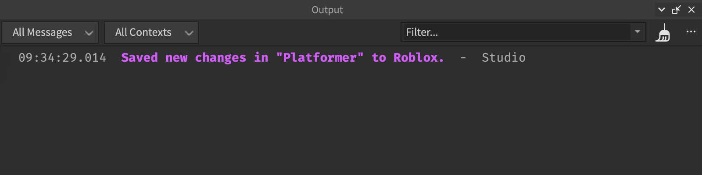

## 이전 버전으로 복원

경험의 소유자는 다른 편집자가 만든 변경 사항을 복원할 수 있습니다. 지침은 [여기](https://create.roblox.com/docs/production/publishing/publishing-experiences-and-places#reverting-to-previous-versions)를 참조하세요.

<Alert severity="error">
변경 사항을 복원할 때 주의하세요. 누군가가 협력 세션에서 경험을 편집 중인 경우, 변경 사항이 자동 저장되어 복원 작업을 덮어쓸 수 있습니다. 복원할 때 아무도 장소를 편집하지 않도록 하려면, 협업을 비활성화하세요.
</Alert>

## 협업 비활성화

**팀 생성**은 협업을 가능하게 하는 핵심 스튜디오 기능입니다. 협력자 관리 대화 상자를 포함하는 워크플로는 기능을 자동으로 활성화하지만 필요에 따라 수동으로 비활성화할 수 있습니다.

1. 라이브 협력자 창이 이미 열려 있지 않은 경우, 아이콘 중 하나를 클릭하여 엽니다.

   

2. 창의 오른쪽 하단에서 **&ctdot;** 버튼을 클릭하고 **팀 생성 비활성화**를 선택합니다.

   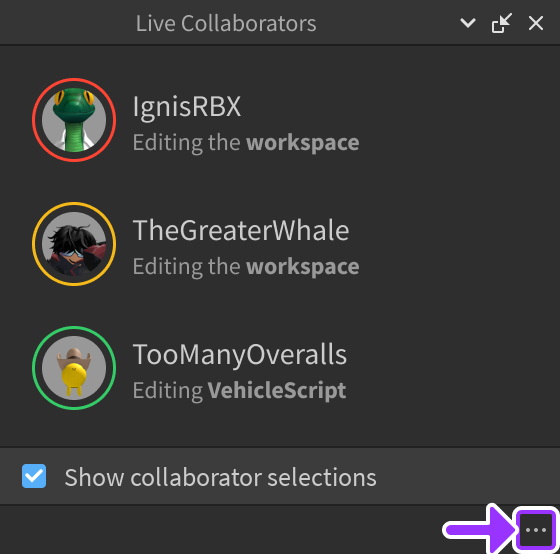

3. 세션을 종료하고 비협업 상태로 장소를 다시 로드할지 확인하라는 메시지가 표시되면 확인합니다.

---
## 출처
 - [Collaboration](https://github.com/Roblox/creator-docs/blob/main/content/en-us/projects/collaboration.md)

---
## [다음](./01_07_groups.md)