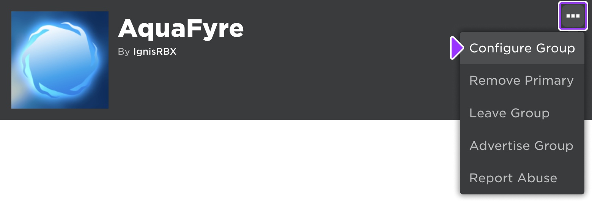
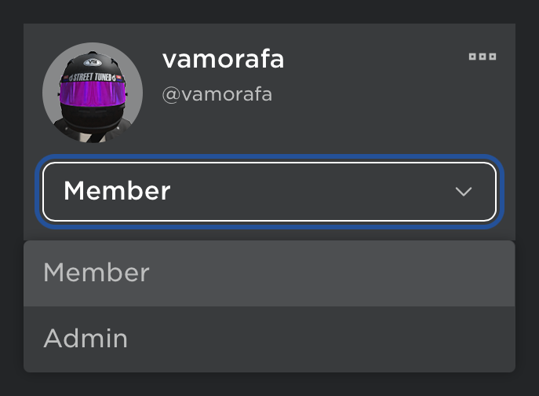
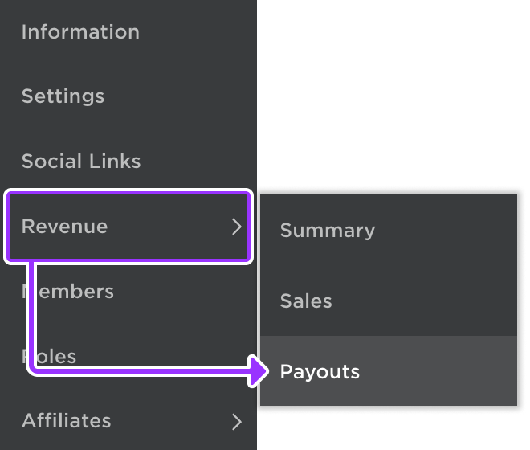
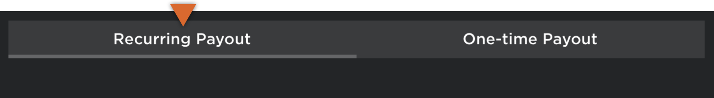
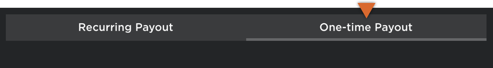

# Group Collaboration

## 목차
- [Group Collaboration](#group-collaboration)
  - [목차](#목차)
  - [새로운 그룹 생성](#새로운-그룹-생성)
  - [역할 및 권한](#역할-및-권한)
    - [역할 설정](#역할-설정)
    - [역할 할당](#역할-할당)
  - [수익 관리](#수익-관리)
  - [그룹 경험의 안전성](#그룹-경험의-안전성)
  - [출처](#출처)
  - [다음](#다음)

---

Roblox **그룹**을 통해 여러 창작자가 동일한 경험을 개발하고, 동일한 자산을 사용하며, 수익을 공유하고 모든 기여자에게 크레딧을 부여할 수 있습니다.

<Alert severity="warning">
경험의 그룹 소유권은 창작자가 협력하고 독립적인 스튜디오로 운영할 수 있도록 돕습니다. 그룹 내에서 갈등이 발생할 경우, Roblox는 분쟁 중재나 해결을 도울 수 없습니다.
</Alert>

## 새로운 그룹 생성

그룹 생성에는 100 로벅스가 필요합니다. 그룹을 생성하려면:

1. [그룹 생성](https://www.roblox.com/groups/create) 페이지로 이동하여 양식을 작성합니다. **이름**과 **엠블럼**은 필수 항목입니다.
1. 녹색 버튼을 클릭하여 새 그룹을 만듭니다.

## 역할 및 권한

### 역할 설정

그룹 소유자는 그룹 내 다른 멤버들의 **역할**을 설정할 수 있습니다. 기본 역할은 **소유자**, **관리자**, **멤버**, **게스트**입니다. 기본 역할의 이름과 설명을 변경할 수 있으며, 각 25 로벅스로 추가 역할을 생성할 수 있습니다. 각 역할에는 0에서 255(가장 낮음에서 가장 높음)까지의 **랭크** 값이 있습니다.

역할을 설정하려면:

1. [그룹](https://www.roblox.com/groups) 페이지로 이동하여 그룹을 선택합니다.
1. 오른쪽 상단의 **&ctdot;** 버튼을 클릭하고 **그룹 설정**을 선택합니다.

   

1. 왼쪽 열에서 **역할** 탭을 선택합니다.

   

1. 각 역할의 권한을 확인하고 조정하여 그룹과 그 창작물을 보호합니다. 일반적으로 관리되는 옵션은 다음과 같습니다:

   <table>
   <thead>
	 <tr>
     <th colspan="2">멤버</th>
   </tr>
   </thead>
   <tbody>
   <tr>
     <td>**하위 랭크 멤버 관리**</td>
     <td>현재 하위 랭크 역할에 할당된 다른 멤버의 역할을 변경합니다.</td>
   </tr>
   <tr>
     <td>**가입 요청 승인**</td>
     <td>그룹이 현재 수동 승인을 요구하도록 설정된 경우, 대기 중인 가입 요청을 승인하거나 거부합니다.</td>
   </tr>
   <tr>
     <td>**하위 랭크 멤버 강제 탈퇴**</td>
     <td>하위 랭크 역할에 할당된 멤버를 강제 탈퇴시킵니다.</td>
   </tr>
   </tbody>
   <thead>
	 <tr>
     <th colspan="2">자산</th>
   </tr>
   </thead>
   <tbody>
   <tr>
     <td>**그룹 자금 사용**</td>
     <td>그룹 관련 작업에 그룹 자금을 사용합니다.</td>
   </tr>
   <tr>
     <td>**그룹 경험 생성 및 편집**</td>
     <td>그룹이 소유한 경험 및 자산을 생성하고 편집합니다. 이 설정이 협력 세션과 어떻게 관련되는지는 [여기](../projects/collaboration.md#group-owned-experiences)를 참조하세요.</td>
   </tr>
   <tr>
     <td>**그룹 경험 분석 보기**</td>
     <td>그룹 경험의 분석을 봅니다. 자세한 내용은 [여기](https://create.roblox.com/docs/production/analytics/analytics-dashboard#granting-group-permission)를 참조하세요.</td>
   </tr>
   </tbody>
   </table>

   <Alert severity="warning">
   기본적으로, 그룹 소유자만이 **그룹 경험 생성 및 편집** 권한을 가지며, 이는 팀 세션에서 [협력자](https://create.roblox.com/docs/projects/collaboration)로서 필요합니다. 이 권한은 신중하게 부여되어야 하며, 이 권한을 가진 멤버는 그룹 경험의 [안전](https://create.roblox.com/docs/projects/groups#safety-in-group-experiences)을 위협할 수 있습니다.
   </Alert>

### 역할 할당

그룹 소유자이거나 그룹 소유자로부터 적절한 권한을 부여받은 역할에 할당된 경우, 자신의 역할보다 낮은 랭크의 멤버를 편집할 수 있습니다.

역할을 할당하려면:

1. 왼쪽 열에서 **멤버** 탭을 선택합니다.
1. 각 그룹 멤버 아래의 드롭다운 메뉴를 사용하여 역할을 선택합니다.

   

## 수익 관리

그룹을 통해 로벅스 수익을 공유할 수 있습니다. 그룹 소유자는 그룹 자금을 일회성 지급 또는 정기 지급으로 기여자에게 지급할 수 있습니다. Roblox는 사기 및 남용을 방지하기 위해 지급을 모니터링합니다.

수익을 관리하려면:

1. [그룹](https://www.roblox.com/groups) 페이지로 이동하여 그룹을 선택합니다.
1. 오른쪽 상단의 **&ctdot;** 버튼을 클릭하고 **그룹 설정**을 선택합니다.

   

1. 왼쪽 열에서 **수익** 위로 마우스를 올리고 **지급**을 클릭합니다.

   

	 지급 화면에서 **정기 지급** 또는 **일회성 지급**을 시작합니다.

	 <Tabs>
	 <TabItem label="정기 지급">
	 그룹 소유자는 그룹이 수익을 올릴 때 자동으로 수익을 공유하도록 정기 지급을 설정할 수 있습니다. 그룹이 자금을 수령한 시점과 멤버에게 분배되는 시점 사이에 짧은 지연이 있습니다. 멤버의 정기 지급을 변경하면 Roblox는 해당 멤버에게 변경 사항을 알리는 메시지 알림을 보냅니다.

   정기 지급을 설정하려면:

   1. **정기 지급** 탭을 선택합니다.

      

   2. **지급 수령자 추가** 버튼을 클릭하여 하나 이상의 지급 수령자를 추가합니다.
   3. 각 멤버 옆에 그룹의 로벅스 수익 중 매달 받고자 하는 비율을 입력합니다. 지급에서 제외하려면 휴지통 버튼을 클릭합니다.
   4. 모든 내용이 올바른지 확인한 후, **저장**을 클릭합니다.

   </TabItem>
   <TabItem label="일회성 지급">
   그룹 소유자는 단일 그룹 멤버 또는 여러 멤버에게 로벅스를 일회성으로 지급할 수 있습니다. 지급은 일시불이거나 그룹 총 자금의 비율일 수 있지만, 로벅스는 정수로만 분배할 수 있습니다. 비율로 분배를 선택한 경우, 금액은 가장 가까운 정수 로벅스로 내림되고 나머지는 그룹 자금에 남아 있습니다.

   일회성 지급을 하려면:

   1. **일회성 지급** 탭을 선택합니다.

      

   2. 드롭다운 메뉴를 사용하여 지급이 설정 금액인지 그룹 총 로벅스 잔액의 비율인지 선택합니다.
   3. **지급 수령자 추가** 버튼을 클릭하여 하나 이상의 지급 수령자를 추가합니다.
   4. 각 멤버 옆에 지급하고자 하는 금액 또는 비율을 입력합니다. 지급에서 제외하려면 휴지통 버튼을 클릭합니다.
   5. 모든 내용이 올바른지 확인한 후, **분배**를 클릭합니다.

   </TabItem>

   </Tabs>

## 그룹 경험의 안전성

**그룹 경험 생성 및 편집** 권한을 가진 그룹 멤버는 창작물에 대한 **복사 허용** 설정을 활성화할 수 있으며, 이는 전체 Roblox 커뮤니티가 이를 복사하고 내부 자산을 사용할 수 있게 할 수 있습니다. 다음 팁은 그룹 경험의 안전성과 지적 재산 보호를 향상시키는 데 도움이 됩니다.

- 각 그룹 역할에 올바른 [권한](https://create.roblox.com/docs/projects/groups#roles-and-permissions)이 있는지 확인하세요. 멤버에게 편집 권한을 부여하고 싶지 않은 경우, 해당 역할에 대해 **그룹 경험 생성 및 편집**을 비활성화합니다.
- 각 멤버가 적절한 역할에 [할당](https://create.roblox.com/docs/projects/groups#assigning-roles)되었는지 확인합니다.
- 복사하고 싶지 않은 자산을 추가하기 전에 [복사 허용](https://create.roblox.com/docs/production/publishing/publishing-experiences-and-places#allowing-copying)이 **비활성화**되어 있는지 확인합니다.

---
## 출처
 - [Group Collaboration](https://create.roblox.com/docs/projects/groups)

---
## [다음](./01_08_Third_Party_Tools.md)