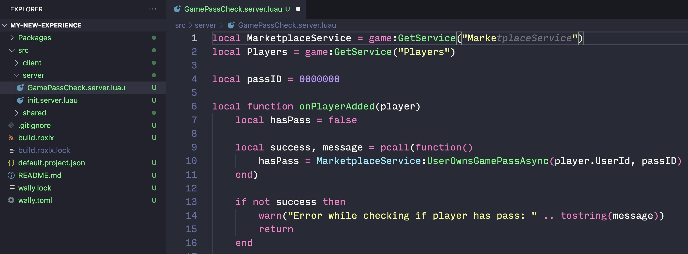
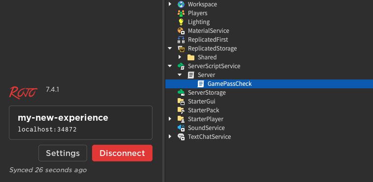

# Third-Party Tools

## 목차
- [Third-Party Tools](#third-party-tools)
  - [목차](#목차)
  - [동기화 문제](#동기화-문제)
  - [Foreman을 사용한 Rojo 설치](#foreman을-사용한-rojo-설치)
  - [Rojo 실행](#rojo-실행)
  - [패키지 관리자](#패키지-관리자)
  - [버전 관리](#버전-관리)
  - [자산](#자산)
  - [모든 것을 되돌리기](#모든-것을-되돌리기)
  - [출처](#출처)
  - [다음](#다음)

---

전문 개발 스튜디오에서는 타사 도구 설정 및 자동화 투자로 개발자의 생산성을 크게 향상시킬 수 있습니다. Roblox의 클라우드 우선 접근 방식에는 많은 장점이 있지만, 개발 워크플로의 일부를 클라우드 **외부**로 이동하면 대규모 팀이 변경 사항을 추적하고, 코드를 검토하며, 익숙한 언어와 도구를 사용할 수 있습니다.

<Alert severity="info">
이 페이지에서는 여러 인기 있는 도구를 다루지만, 이를 엄격히 권장하는 것은 아닙니다. 각 팀의 필요는 다르기 때문에, 이 페이지는 특정 도구를 다운로드하라는 것이 아니라 워크플로를 개선할 수 있는 방법을 검토하는 데 도움이 되도록 작성되었습니다.
</Alert>

## 동기화 문제

본질적으로 Roblox와 외부 도구를 사용하는 것은 **동기화** 문제입니다:

- Roblox 스크립트를 디스크의 `.luau` 파일로 존재하게 하여 자신만의 도구를 사용해 작업할 수 있어야 합니다.
- 작업을 마친 후 파일을 Roblox 프로젝트에 다시 가져와야 합니다.
- 그 동안 다른 사람이 동일한 파일을 변경한 경우, 충돌을 처리해야 합니다.

전체 솔루션이 원활하고 자동화된 느낌을 주기 위해서는 a) 파일 변경 사항을 듣고 b) 이러한 변경 사항을 다시 Studio에 통합해야 합니다. 즉, 서버와 Studio 플러그인이 필요하며, 이것이 [Rojo](https://rojo.space/)가 이 문제를 해결하는 방식입니다.

Roblox의 클라우드 우선 접근 방식과 달리, Rojo는 "파일 시스템 우선" 접근 방식을 허용합니다. 프로젝트의 모든 스크립트 파일을 Luau 파일로 추출한 다음 서버를 실행합니다. Rojo 플러그인은 서버에 연결되어 해당 파일을 Studio와 동기화합니다.

## Foreman을 사용한 Rojo 설치

Rojo 바이너리를 수동으로 다운로드하고 실행할 수 있지만, 이러한 접근 방식은 팀의 각 개발자가 다른 Rojo 버전을 사용할 위험이 있습니다. 더 나은 솔루션은 [Foreman](https://github.com/Roblox/foreman)과 같은 도구 관리자를 사용하는 것입니다. 이는 구성 파일(리포지토리 및 버전 목록)을 사용하여 설치 및 업그레이드 프로세스를 모든 기기에서 일관되게 만듭니다.

Foreman은 프로젝트 내 패키지보다는 기본 개발 환경을 관리하기 때문에 [nvm](https://github.com/nvm-sh/nvm)과 더 비슷하지만 [npm](https://www.npmjs.com/)과의 비교는 완벽하지 않습니다. 간단한 `foreman.toml` 파일은 다음과 같습니다:

```toml
[tools]
rojo = { github = "rojo-rbx/rojo", version = "7.4.1" }
wally = { github = "UpliftGames/wally", version = "0.3.2" }
```

그런 다음 `foreman install`로 이러한 도구를 설치합니다. 전역 `foreman.toml` 파일 외에도 Foreman은 프로젝트별 파일을 지원하므로, Rojo, Wally 또는 다른 도구의 다른 버전을 쉽게 사용할 수 있으며 팀 전체가 동일한 버전을 사용할 수 있습니다.

도구가 새 버전을 출시하면 `.toml` 파일에서 버전 번호를 명시적으로 변경한 후 Foreman을 사용하여 업그레이드를 수행하고 새 버전을 테스트하며 문제가 발생하면 다운그레이드할 수 있습니다. 명령어 및 설치 지침은 [Foreman](https://github.com/Roblox/foreman?tab=readme-ov-file#installation)을 참조하세요.

## Rojo 실행

Foreman을 사용하여 Rojo를 설치한 후에는 실제로 Rojo 서버를 설치한 것입니다. 다음 단계는 Roblox Studio용 Rojo 플러그인을 설치하는 것입니다:

```bash
rojo plugin install
```

그런 다음 새 경험의 프로젝트 구조를 생성하고 빌드합니다:

```bash
rojo init my-new-experience
cd my-new-experience
rojo build -o my-new-experience.rbxl
```

또는 [기존 경험을 포팅](https://rojo.space/docs/v7/getting-started/existing-game/)할 수 있습니다. 어느 쪽이든 프로젝트를 생성한 후 Rojo 서버를 시작합니다:

```bash
rojo serve
```

Roblox Studio에서 방금 빌드한 `.rbxl` 파일을 열고 Rojo 플러그인을 시작한 후 실행 중인 서버에 연결합니다. 이 시점에서 선호하는 텍스트 편집기에서 변경 사항을 시작하고 이러한 변경 사항이 자동으로 Studio에 동기화되는 것을 확인할 수 있습니다.





Rojo 프로젝트는 파일의 특정 네이밍 요구 사항, 수많은 구성 옵션 및 몇 가지 제한 사항이 있으며, 이는 모두 [Rojo 문서](https://rojo.space/docs/v7/)에 설명되어 있습니다.

## 패키지 관리자

Roblox에는 강력한 포함 API 세트가 있지만, 커뮤니티 소프트웨어 패키지를 일관되고 재현 가능한 방식으로 사용하려면 패키지 관리자가 필요합니다. [Wally](https://wally.run/)는 인기 있는 옵션입니다. Rojo와 마찬가지로 Foreman을 통해 설치할 수 있습니다.

경험의 Rojo 디렉토리 내에서 `wally init`을 실행합니다. 그런 다음 원하는 패키지를 `wally.toml`에 추가합니다. 파일은 다음과 같습니다:

```toml
[package]
name = "my-home-directory/my-new-experience"
version = "0.1.0"
registry = "https://github.com/UpliftGames/wally-index"
realm = "shared"

[dependencies]
react = "jsdotlua/react@17.1.0"
react-roblox = "jsdotlua/react-roblox@17.1.0"
cryo = "phalanxia/cryo@1.0.3"
```

그런 다음 `wally install`을 실행합니다. Wally는 `Packages` 디렉토리를 생성하고 지정된 패키지를 해당 위치에 다운로드합니다. 마지막 단계는 `Packages` 디렉토리를 Rojo에 추가하여 해당 내용이 Roblox에 다시 동기화되도록 하는 것입니다. `default.project.json`을 열고 경로를 추가합니다. 간단히 하기 위해 이 예제에서는 모든 패키지를 사용할 수 있도록 전체 디렉토리를 `Class.ReplicatedStorage`에 추가하지만, 특정 패키지를 `Class.ServerScriptService` 또는 `Class.StarterPlayerScripts`에 추가하는 것을 선호할 수 있습니다:

```json
{
  "name": "my-new-experience",
  "tree": {
    "$className": "DataModel",

    "ReplicatedStorage": {
      "Shared": {
        "$path": "src/shared"
      },
      "Packages": {
        "$path": "Packages"
      }
    },

    ...

  }
}
```

그런 다음 다른 `Class.ModuleScript`처럼 스크립트 내에서 패키지를 require할 수 있습니다:

```lua
local Players = game:GetService("Players")
local ReplicatedStorage = game:GetService("ReplicatedStorage")

local React = require(ReplicatedStorage.Packages.react)
local ReactRoblox = require(ReplicatedStorage.Packages["react-roblox"])

local handle = Instance.new("ScreenGui", Players.LocalPlayer.PlayerGui)
local root = ReactRoblox.createRoot(handle)

local helloFrame = React.createElement(
    "TextLabel", {
        Text = "Hello World!",
        Size = UDim2.new(0, 200, 0, 200),
        Position = UDim2.new(0.5, 0, 0.5, 0),
        AnchorPoint = Vector2.new(0.5, 0.5),
        BackgroundColor3 = Color3.fromRGB(248, 217, 109),
        Font = Enum.Font.LuckiestGuy,
        TextSize = 24
    }
)

root:render(helloFrame)
```

대부분의 소프트웨어 프로젝트와 마찬가지로, 기여자들은 리포지토리를 복제하고 Foreman을 설치하고 몇 가지 명령어를 실행하여 팀의 나머지와 동일한 개발 환경을 갖출 수 있습니다.

<Alert severity="success">
React를 사용하여 Roblox UI를 만드는 방법에 대한 자세한 안내는 [React + Roblox](https://devforum.roblox.com/t/how-to-react-roblox/2964543)를 참조하세요.
</Alert>

## 버전 관리

컴퓨터에 일반 텍스트 파일 세트를 보유하면 다양한 기능을 사용할 수 있지만, 주요 기능은 **버전 관리**입니다. [Git](https://git-scm.com/) 또는 [Mercurial](https://www.mercurial-scm.org/) 리포지토리에 스크립트와 구성 파일을 저장할 수 있으며, [GitHub](https://github.com), [GitLab](https://gitlab.com), 또는 [Bitbucket](https://bitbucket.org)에서 원격 리포지토리를 호스팅하고 코드 변경 사항을 검토할 수 있으며, 원하는 텍스트 편집기를 사용할 수 있습니다.

[Visual Studio Code](https://code.visualstudio.com)는 가장 큰 확장 생태계를 가지고 있지만, [Sublime Text](https://www.sublimetext.com), [Notepad++](https://notepad-plus-plus.org), 및 [Vim](https://www.vim.org)은 모두 인기 있는 선택입니다. 어떤 편집기를 선택하든 Studio 스크립트 편집기의 기능에 맞추려면 몇 가지 확장이 필요합니다.

다음과 같은 추가 사항을 고려할 수도 있습니다:

- 일반적인 문제를 잡고 코딩 표준을 적용하는 린터 [selene](https://github.com/Kampfkarren/selene)
- 코드 포맷터 [StyLua](https://github.com/JohnnyMorganz/StyLua)
- 자동 완성, 타입 검사 등을 위한 언어 서버 [Luau Language Server](https://github.com/JohnnyMorganz/luau-lsp)
- [공개 클라우드](https://create.roblox.com/docs/cloud/open-cloud) 스크립트(Studio에 동기화되지 않음)를 사용하여 [게시된 경험 업데이트](https://create.roblox.com/docs/cloud/reference/Universe#Update-Universe) 또는 [서버 재시작](https://create.roblox.com/docs/cloud/reference/Universe#Restart-Universe-Servers)

## 자산

이 페이지의 도구는 대부분 스크립트에 적용되지만, 3D 아티스트는 이미 Blender 및 Maya와 같은 외부 도구를 사용하고 소스 파일을 버전 관리에 저장하며 Studio에 자신의 창작물을 가져옵니다. Studio 자산을 보유한 후에는 가능한 한 패키지를 사용하는 것이 좋습니다.

Roblox의 패키지 구현은 중앙 집중식 리포지토리와 버전 기록을 제공하여 모든 자산 사본을 동기화 상태로 유지하는 원활한 방법을 제공하는 등 이 페이지의 도구와 많은 원칙을 따릅니다. 워크플로를 개선하는 방법에 대한 자세한 내용은 패키지를 참조하세요.

## 모든 것을 되돌리기

타사 도구는 Roblox Studio에 변경 사항을 동기화하는 것이지 대체하는 것이 아니므로, 이 워크플로의 어느 부분도 잠금 상태를 포함하지 않습니다. 언제든지 이러한 도구 중 하나 또는 모두 사용을 중지하고 Studio에서 독점적으로 경험을 편집할 수 있습니다. 위험이 없으므로 타사 도구를 실험하는 것이 특히 매력적입니다.

---
## 출처
 - [Third-Party Tools](https://create.roblox.com/docs/projects/external-tools)

---
## [다음](./02_00_assets.md)