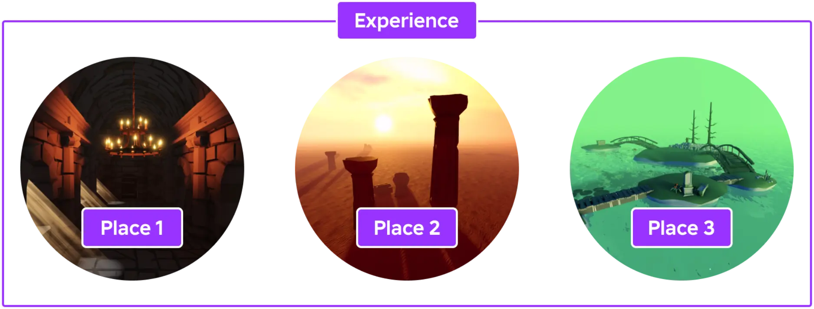
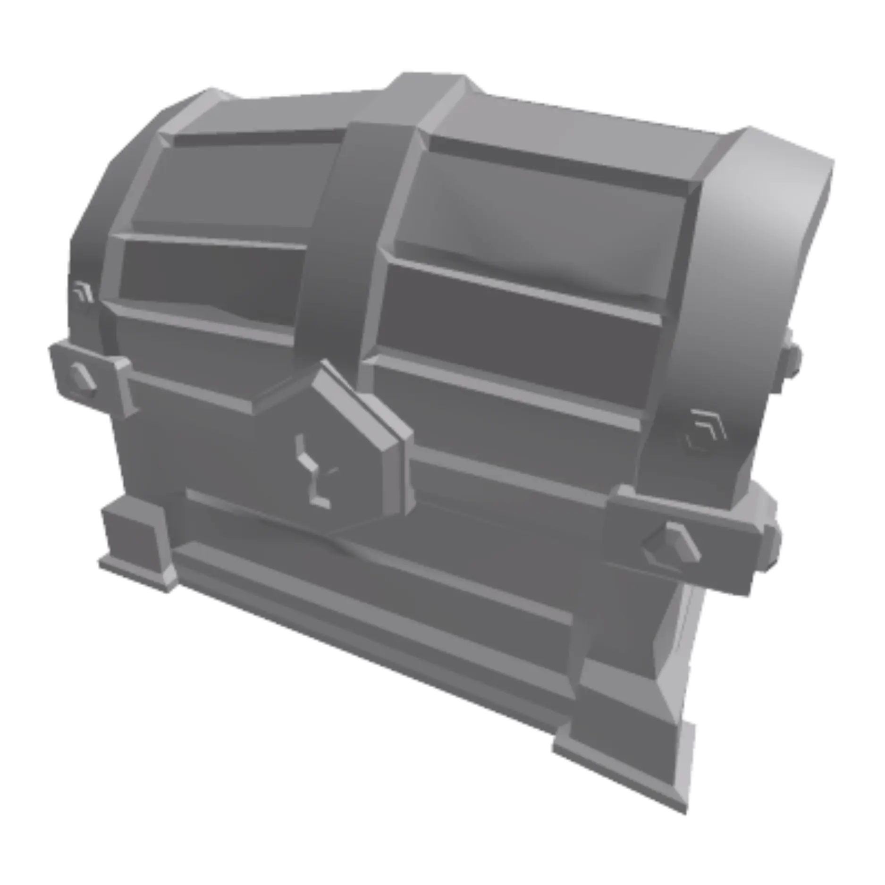

# Project

## 목차
- [Project](#project)
  - [목차](#목차)
  - [장소](#장소)
  - [자산](#자산)
  - [패키지](#패키지)
  - [설정](#설정)
  - [협업](#협업)
  - [테스트](#테스트)
  - [출처](#출처)
  - [다음](#다음)

---

Roblox 프로젝트는 **경험**을 나타내는 장소(places), 자산(assets), 설정(settings) 및 기타 리소스의 모음입니다. Roblox는 협업, 편집 및 버전 관리를 위해 프로젝트를 클라우드에 저장합니다. Roblox Studio는 구축, 스크립팅, 테스트 및 게시 도구를 제공하는 올인원 IDE로, 이를 통해 프로젝트를 생성하고 관리합니다.

## 장소

Roblox의 경험은 개별 **장소**로 구성되며, 이는 Unity의 씬이나 Unreal Engine의 맵과 유사합니다. 각 장소에는 해당 경험의 특정 환경, 파트, 메시, 스크립트 및 사용자 인터페이스를 포함한 모든 구성 요소가 포함됩니다. 경험 및 장소 생성 및 관리에 대한 자세한 내용은 [경험 및 장소](https://create.roblox.com/docs/ko-kr/production/publishing/publishing-experiences-and-places)를 참조하세요.

<figure>

</figure>

각 장소는 장소에 대한 모든 것을 설명하는 객체의 계층 구조인 **데이터 모델**로 표현됩니다. Roblox 엔진은 데이터를 장소 상태의 진실 소스로 사용하여 클라이언트 장치에서 시뮬레이션 및 렌더링할 수 있습니다. Roblox 엔진이 데이터 모델을 해석하는 방법에 대한 자세한 내용은 [클라이언트-서버 런타임](https://create.roblox.com/docs/ko-kr/projects/client-server)을 참조하세요.

데이터 모델 내의 적절하고 의도적인 객체 조직은 프로젝트의 기능성과 유지 관리에 필수적입니다. 사용 가능한 객체와 이를 구성하고 사용하는 방법에 대한 자세한 내용은 [데이터 모델](https://create.roblox.com/docs/ko-kr/projects/data-model)을 참조하세요.

## 자산

Roblox에서 이미지, 메시 및 오디오와 같은 자산은 **클라우드 기반 자산**으로 저장되므로 저장된 Studio 경험에 로컬 사본을 번들로 묶을 필요가 없습니다. 클라우드의 각 자산에는 고유한 **자산 ID**가 할당되며, 이를 통해 여러 경험에서 이를 활용할 수 있습니다. Studio에서 직접 모델과 같은 자산을 생성하거나 다른 도구에서 이미지, 오디오 및 메시를 가져올 수 있습니다.

<table>
  <tbody>
    <tr>
      <td></td>
      <td></td>
      <td><audio controls><source src="../img/01_project/Boom-Impact.mp3" type="audio/mpeg"></source></audio></td>
    </tr>
    <tr>
			<td><code>rbxassetid://7229442422</code></td>
			<td><code>rbxassetid://6768917255</code></td>
			<td><code>rbxassetid://9125402735</code></td>
    </tr>
  </tbody>
</table>

기본적으로 자산은 경험에 대해 비공개로 설정되며 자산 ID를 참조하여 어느 장소에서나 사용할 수 있습니다. 또한 이를 [크리에이터 스토어](https://create.roblox.com/store/)에 배포하여 다른 사람들이 사용할 수 있도록 할 수도 있습니다.

자산을 가져오고 게시하는 방법에 대한 자세한 내용은 [자산](https://create.roblox.com/docs/ko-kr/projects/assets)을 참조하세요.

## 패키지

[패키지](https://create.roblox.com/docs/ko-kr/projects/assets/packages)는 여러 경험에 걸쳐 여러 장소에서 정의하고 재사용할 수 있는 재사용 가능한 객체 계층 구조입니다. 대규모 프로젝트에서는 패키지가 다음과 같은 이점을 제공합니다:

- 패키지는 자산 키트로 사용될 수 있어 필요한 만큼 객체 세트를 복제할 수 있습니다.
- 패키지는 자산 업데이트를 용이하게 합니다. 예를 들어, 패키지에는 환경에서 여러 번 복제된 나무가 포함될 수 있습니다. 텍스처를 교체하는 것과 같은 변경 사항이 필요한 경우 각 개별 인스턴스 대신 패키지에서 한 번만 업데이트하면 됩니다.
- 패키지는 그레이박스 자산으로 시작하여 최종 아트 자산으로 교체할 수 있습니다. 자산이 교체되면 모든 원래 위치와 방향을 유지합니다.

## 설정

경험 설정은 [크리에이터 대시보드](https://create.roblox.com/dashboard/creations) 또는 Studio 내에서 관리되며 다음을 포함합니다:

- **기본 정보** &mdash; 경험의 이름, 설명 및 장르와 같은 기본 정보. 여기의 정보는 경험 목록에 사용됩니다.
- **통신** &mdash; 적격 사용자가 [음성 채팅](https://create.roblox.com/docs/ko-kr/chat/voice-chat) 또는 카메라를 통해 아바타를 애니메이션할 수 있도록 설정합니다.
- **권한** &mdash; 경험에 액세스할 수 있는 사람을 구성합니다. 새로운 경험은 **비공개**로 시작하며, 올바른 권한을 가진 [그룹](https://create.roblox.com/docs/ko-kr/projects/groups) 구성원만 편집하고 참여할 수 있습니다. 적절할 때, 경험을 [공개](https://create.roblox.com/docs/ko-kr/production/publishing/publishing-experiences-and-places#releasing-to-the-public)할 수 있습니다.
- **수익 창출** &mdash; 경험에서 수익을 얻기 위한 옵션은 [수익 창출](https://create.roblox.com/docs/ko-kr/production/monetization)에 설명되어 있습니다.
- **현지화** &mdash; 다양한 [언어 및 지역](https://create.roblox.com/docs/ko-kr/production/localization)을 위한 구성.
- **아바타** &mdash; 아바타 크기 조정 및 의류 오버라이드와 관련된 설정.

## 협업

Studio의 **내장 협업 도구**를 사용하면 팀 구성원이 독립적으로 또는 다른 사람들과 함께 경험에 기여할 수 있습니다. 주요 기능은 다음과 같습니다:

- 그룹 관리자는 어떤 구성원이 협업할 수 있는지, 어떤 구성원이 할 수 없는지를 관리하여 대규모 팀 내 적절한 역할을 유지할 수 있습니다.
- 협업자는 다른 팀 구성원과 실시간으로 함께 빌드하고, 다른 사람이 만든 변경 사항을 자동으로 볼 수 있습니다.
- 협업자는 다른 사람이 편집 중일 수도 있는 동일한 스크립트를 독립적으로 편집하고, 로컬에서 테스트하며, 준비가 되면 클라우드 기반 프로젝트에 변경 사항을 커밋할 수 있습니다.

자세한 내용은 [협업](https://create.roblox.com/docs/ko-kr/projects/collaboration)을 참조하세요.

## 테스트

귀하의 [팀](https://create.roblox.com/docs/ko-kr/projects/setting-up-a-team)은 PC, 모바일, VR 및 지원하려는 기타 장치에서 Roblox 앱을 통해 즉시 경험을 테스트할 수 있습니다. 빌드를 컴파일하거나 앱 스토어에 배포하거나 앱 스토어 승인을 기다릴 필요가 없습니다.

Studio는 경험을 공개하기 전에 테스트할 수 있는 다양한 옵션을 제공합니다:

- Roblox 애플리케이션에서 실행되는 경험과 유사한 시뮬레이션을 제공하는 **빠른 플레이 테스트**.
- 경험 내에서 각 클라이언트가 다른 클라이언트를 "보는" 방식을 비교할 수 있는 **다중 클라이언트 시뮬레이션**.
- 모바일 장치에서의 컨트롤 작동 방식이나 다양한 화면 및 가로 세로 비율에서의 화면 UI 표시 방식을 확인할 수 있는 **장치 에뮬레이션**.
- 팀 구성원과 함께하는 **협업 플레이 테스트**.

각 테스트 옵션에 대한 자세한 내용은 [Studio 테스트 모드](https://create.roblox.com/docs/ko-kr/studio/testing-modes)를 참조하세요.

---
## 출처
 - [Project](https://create.roblox.com/docs/ko-kr/projects)

---
## [다음](./02_assets.md)