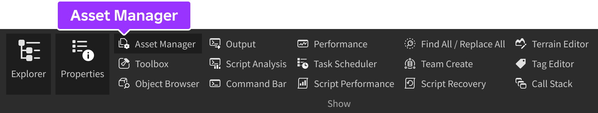
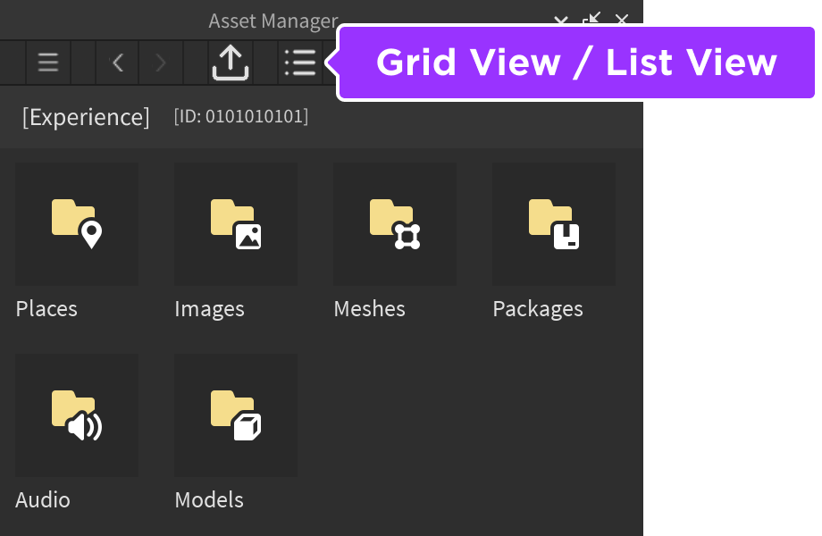
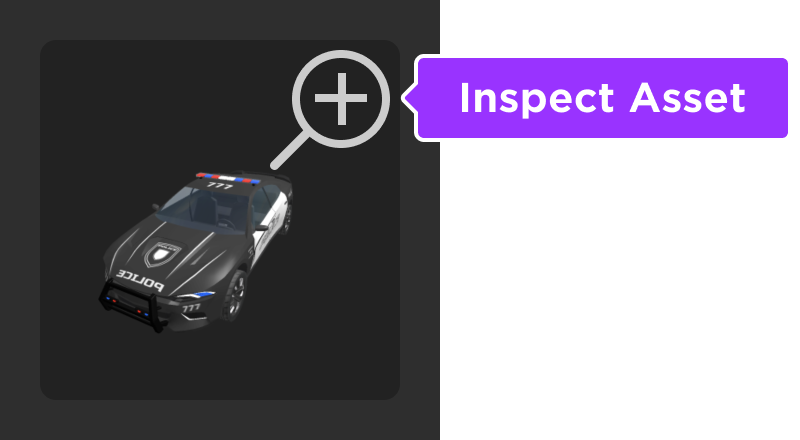
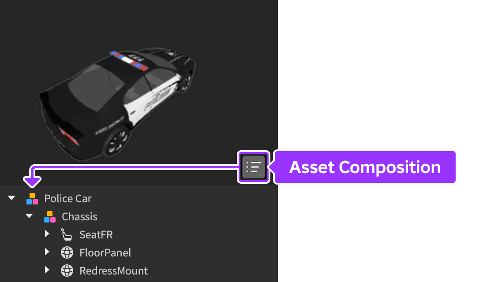

# Asset Manager

## 목차
- [Asset Manager](#asset-manager)
	- [목차](#목차)
	- [에셋 폴더](#에셋-폴더)
	- [에셋 가져오기](#에셋-가져오기)
	- [에셋 삽입](#에셋-삽입)
	- [빠른 작업](#빠른-작업)
	- [에셋 검사](#에셋-검사)
	- [출처](#출처)
	- [다음](#다음)

---

에셋 관리자를 사용하면 장소와 같은 에셋을 관리하고, 이미지, 메시, 패키지, 오디오, 모델 등을 대량으로 가져올 수 있습니다.

## 에셋 폴더

에셋은 유형에 따라 폴더 내에 정리됩니다. 보기 전환 버튼을 클릭하여 그리드 보기와 목록 보기를 전환할 수 있습니다.

## 에셋 가져오기

대량 가져오기 도구는 한 번에 최대 50개의 파일을 가져오는 데 이상적입니다. 가져온 에셋은 검토 대기열에 들어가며, 해당 폴더와 Toolbox의 Inventory 탭에서만 볼 수 있습니다.

<table>
<thead>
  <tr>
    <th>에셋 유형</th>
    <th>세부 사항</th>
  </tr>
</thead>
<tbody>
  <tr>
    <td>이미지</td>
    <td>`.png`, `.jpg`, `.tga`, `.bmp` 형식의 이미지를 가져와서 파트의 텍스처/데칼, UI 요소, 메시 텍스처, 사용자 정의 재료의 텍스처, 특수 효과 텍스처 등으로 사용할 수 있습니다.</td>
  </tr>
  <tr>
    <td>메시</td>
    <td>`.fbx` 또는 `.obj` 형식의 메시를 대량으로 가져올 수 있지만, 리깅, 스키닝 또는 애니메이션 데이터가 포함된 복잡한 메시를 지원하지는 않습니다. 복잡한 메시의 경우 3D 가져오기 도구를 사용하는 것이 좋습니다.</td>
  </tr>
  <tr>
    <td>오디오</td>
    <td>`.mp3` 또는 `.ogg` 형식으로 사용할 권한이 확실한 오디오 에셋을 가져올 수 있습니다. 오디오 파일 사용 권한이 불확실한 경우 크리에이터 스토어에서 100,000개 이상의 전문적으로 제작된 사운드 효과를 포함한 다양한 무료 오디오를 제공합니다. 자세한 내용은 오디오 에셋을 참조하세요.</td>
  </tr>
</tbody>
</table>

## 에셋 삽입

에셋을 Explorer 창 계층 구조에 드래그 앤 드롭하거나 에셋 이름/타일을 마우스 오른쪽 버튼으로 클릭하고 삽입을 선택하여 삽입할 수 있습니다.

3D 뷰포트로 드래그 앤 드롭할 때의 동작은 에셋 유형에 따라 다릅니다:

<table>
<thead>
  <tr>
    <th>에셋 유형</th>
    <th>드래그 앤 드롭 동작</th>
  </tr>
</thead>
<tbody>
  <tr>
    <td>이미지</td>
    <td>유효한 부모 객체(예: `BasePart`) 위에 마우스를 올리면 해당 부모 내에 새로운 `Decal`이 생성되고 `Texture` 속성이 에셋 ID로 설정됩니다.</td>
  </tr>
  <tr>
    <td>메시</td>
    <td>워크스페이스에 새로운 `MeshPart`로 에셋을 삽입하고 `MeshId` 속성이 에셋 ID로 설정됩니다.</td>
  </tr>
  <tr>
    <td>오디오</td>
    <td>워크스페이스에 새로운 `Sound` 객체를 생성하고 `SoundId` 속성이 에셋 ID로 설정됩니다.</td>
  </tr>
	<tr>
    <td>패키지</td>
    <td>워크스페이스에 패키지 사본을 삽입합니다.</td>
  </tr>
</tbody>
</table>

## 빠른 작업

에셋 이름/타일을 마우스 오른쪽 버튼으로 클릭하고 상황에 맞는 옵션을 선택하여 빠른 작업에 액세스할 수 있습니다.

<Tabs>
<TabItem label="장소">
<table>
<thead>
  <tr>
    <th>빠른 작업</th>
    <th>설명</th>
  </tr>
</thead>
<tbody>
  <tr>
    <td>이름 변경</td>
    <td>장소의 새 이름을 입력할 수 있습니다.</td>
  </tr>
  <tr>
    <td>ID를 클립보드에 복사</td>
    <td>장소 ID를 클립보드에 복사합니다.</td>
  </tr>
  <tr>
    <td>기록 보기</td>
    <td>장소 버전 기록을 열어 이전 커밋(게시 작업) 및 날짜/시간을 확인할 수 있습니다. 원하는 경우 해당 버전을 선택하고 <b>열기</b> 버튼을 클릭하여 이전 버전으로 롤백할 수 있습니다.</td>
  </tr>
  <tr>
    <td>게임에서 제거</td>
    <td>경험에서 장소를 완전히 제거합니다. 시작 장소에는 적용되지 않습니다.</td>
  </tr>
</tbody>
</table>
</TabItem>
<TabItem label="이미지">
<table>
<thead>
  <tr>
    <th>빠른 작업</th>
    <th>설명</th>
  </tr>
</thead>
<tbody>
  <tr>
    <td>에셋 편집</td>
    <td>이미지 제목 및 설명과 같은 일반 세부 정보를 편집할 수 있습니다.</td>
  </tr>
  <tr>
    <td>별칭 이름 변경</td>
    <td>에셋 관리자에서 이미지 별칭의 이름을 변경합니다.</td>
  </tr>
  <tr>
    <td>삽입</td>
    <td>선택한 인스턴스(또는 워크스페이스)에 이미지를 삽입합니다.</td>
  </tr>
  <tr>
    <td>ID를 클립보드에 복사</td>
    <td>이미지 ID를 클립보드에 복사합니다.</td>
  </tr>
  <tr>
    <td>게임에서 제거</td>
    <td>에셋 관리자에서 이미지를 제거하지만, 경험에서 인스턴스를 제거하지는 않습니다.</td>
  </tr>
</tbody>
</table>
</TabItem>
<TabItem label="메시">
<table>
<thead>
  <tr>
    <th>빠른 작업</th>
    <th>설명</th>
  </tr>
</thead>
<tbody>
  <tr>
    <td>에셋 편집</td>
    <td>메시 제목 및 설명과 같은 일반 세부 정보를 편집할 수 있습니다.</td>
  </tr>
  <tr>
    <td>별칭 이름 변경</td>
    <td>에셋 관리자에서 메시 별칭의 이름을 변경합니다.</td>
  </tr>
  <tr>
    <td>삽입</td>
    <td>메시를 워크스페이스에 삽입합니다.</td>
  </tr>
  <tr>
    <td>위치와 함께 삽입</td>
    <td>메시 가져오기 프로세스 중에 저장된 위치 데이터를 유지하여 메시를 워크스페이스에 삽입합니다.</td>
  </tr>
  <tr>
    <td>ID를 클립보드에 복사</td>
    <td>메시 ID를 클립보드에 복사합니다.</td>
  </tr>
  <tr>
    <td>메시 ID를 클립보드에 복사</td>
    <td>메시 `MeshPart.TextureID`를 클립보드에 복사합니다.</td>
  </tr>
  <tr>
    <td>게임에서 제거</td>
    <td>에셋 관리자에서 메시를 제거하지만, 경험에서 인스턴스를 제거하지는 않습니다.</td>
  </tr>
</tbody>
</table>
</TabItem>
<TabItem label="패키지">
<table>
<thead>
  <tr>
    <th>빠른 작업</th>
    <th>설명</th>
  </tr>
</thead>
<tbody>
  <tr>
    <td>삽입</td>
    <td>워크스페이스에 패키지 사본을 삽입합니다.</td>
  </tr>
  <tr>
    <td>웹사이트에서 보기</td>
    <td>패키지 에셋 페이지를 브라우저에서 엽니다.</td>
  </tr>
  <tr>
    <td>ID를 클립보드에 복사</td>
    <td>패키지 ID를 클립보드에 복사합니다.</td>
  </tr>
  <tr>
    <td>패키지 세부 사항</td>
    <td>기본 패키지 세부 사항, 액세스 권한 및 패키지 버전을 관리할 수 있습니다.</td>
  </tr>
</tbody>
</table>
</TabItem>
<TabItem label="오디오">
<table>
<thead>
  <tr>
    <th>빠른 작업</th>
    <th>설명</th>
  </tr>
</thead>
<tbody>
  <tr>
    <td>에셋 편집</td>
    <td>오디오 제목 및 설명과 같은 일반 세부 정보를 편집할 수 있습니다.</td>
  </tr>
  <tr>
    <td>별칭 이름 변경</td>
    <td>에셋 관리자에서 항목 별칭의 이름을 변경합니다.</td>
  </tr>
  <tr>
    <td>삽입</td>
    <td>선택한 인스턴스(또는 워크스페이스)에 `Sound` 객체로 오디오를 삽입합니다.</td>
  </tr>
  <tr>
    <td>ID를 클립보드에 복사</td>
    <td>오디오 파일 ID를 클립보드에 복사합니다.</td>
  </tr>
  <tr>
    <td>게임에서 제거</td>
    <td>에셋 관리자에서 오디오를 제거하지만, 경험에서 인스턴스를 제거하지는 않습니다.</td>
  </tr>
</tbody>
</table>
</TabItem>
</Tabs>

## 에셋 검사

그리드 보기에서 썸네일 위에 마우스를 올리고 "확대" 아이콘을 클릭하거나 목록 보기에서 이름을 마우스 오른쪽 버튼으로 클릭하고 에셋 미리보기를 선택하여 이미지, 메시, 패키지 또는 오디오 파일을 자세히 검사할 수 있습니다.

메시와 같은 3D 에셋을 미리 볼 때 가상 카메라를 이동하여 모든 각도에서 더 잘 볼 수 있습니다. 비디오의 경우 팝업에서 전체 비디오를 미리 볼 수 있습니다.

<Grid container spacing={3}>
<Grid item>
<video src="../img/02_01_Asset_Manager/3D-Asset-Preview.mp4" controls width="315"></video>
</Grid>
<Grid item>
<table size="small">
<thead>
  <tr>
    <th>동작</th>
    <th>설명</th>
  </tr>
</thead>
<tbody>
  <tr>
    <td>마우스 왼쪽 버튼&nbsp;+ 드래그</td>
    <td>객체 주변을 회전합니다.</td>
  </tr>
  <tr>
    <td>마우스 오른쪽 버튼&nbsp;+ 드래그</td>
    <td>왼쪽, 오른쪽, 위 또는 아래로 팬합니다.</td>
  </tr>
  <tr>
    <td>마우스 스크롤 휠</td>
    <td>확대 또는 축소합니다.</td>
  </tr>
</tbody>
</table>
</Grid>
</Grid>

미리보기 프레임의 오른쪽 하단에 있는 구성 버튼을 클릭하면 `Script`, `MeshPart`, `Animation` 등을 포함한 에셋의 전체 계층 구조가 표시됩니다.

---
## 출처
 - [Asset Manager](https://create.roblox.com/docs/projects/assets/manager)

---
## [다음](./02_02_Toolbox.md)