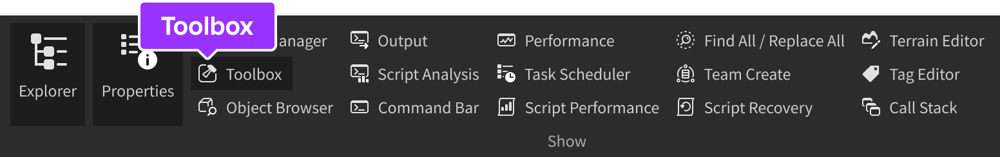
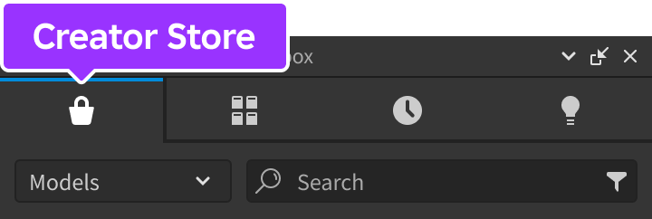
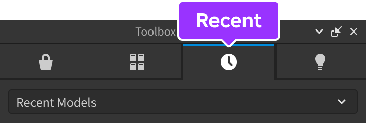
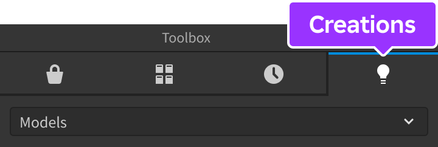
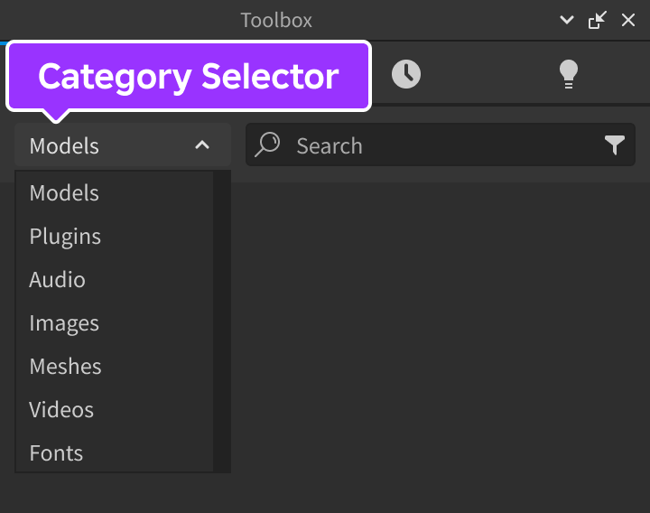
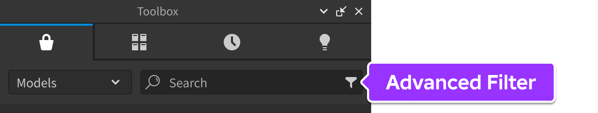
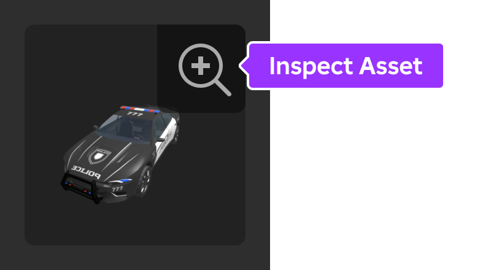

# Toolbox

## 목차
- [Toolbox](#toolbox)
  - [목차](#목차)
  - [섹션](#섹션)
    - [크리에이터 스토어](#크리에이터-스토어)
    - [인벤토리](#인벤토리)
    - [최근 항목](#최근-항목)
    - [창작물](#창작물)
  - [정렬 및 검색](#정렬-및-검색)
  - [에셋 검사](#에셋-검사)
  - [에셋 구성 및 버전 관리](#에셋-구성-및-버전-관리)
  - [출처](#출처)
  - [다음](#다음)

---

**Toolbox**에는 Roblox 또는 Roblox 커뮤니티 멤버들이 만든 모델, 이미지, 메시, 오디오, 플러그인, 비디오, 그리고 폰트가 포함되어 있습니다. 또한, 여러분이 개인적으로 게시한 모든 창작물이나 여러분이 속한 그룹에서 게시한 창작물도 포함됩니다.

## 섹션

Toolbox는 크리에이터 스토어, 인벤토리, 최근 항목, 그리고 창작물이라는 네 가지 구별되는 섹션을 포함합니다.

### 크리에이터 스토어

**크리에이터 스토어** 섹션에는 Roblox 또는 Roblox 커뮤니티 멤버들이 만든 모델, 이미지, 메시, 오디오, 플러그인, 비디오, 그리고 폰트가 포함되어 있습니다.

<Alert severity="warning">
여러분이 만들지 않은 모델을 경험에 삽입할 때는 주의하세요. 이러한 모델에는 성능이나 동작에 영향을 미칠 수 있는 악성 스크립트가 포함될 수 있습니다. 에셋을 가져오기 전에 항상 에셋 검사를 수행하고 내장된 스크립트를 조사하는 것이 좋습니다.
</Alert>

### 인벤토리

**인벤토리** 섹션에는 여러분이 개인적으로 게시한 모델, 이미지, 메시, 오디오, 패키지, 비디오, 플러그인, 애니메이션, 그리고 폰트가 포함되어 있으며, 여러분이 속한 그룹에서 게시한 창작물이나 크리에이터 스토어에서 가져온 창작물도 포함됩니다.

### 최근 항목

**최근 항목** 탭은 인벤토리와 유사하지만, 최근에 사용한 모델, 이미지, 메시, 오디오, 비디오, 그리고 애니메이션을 필터링합니다.

### 창작물

**창작물** 탭은 인벤토리와 유사하지만, 여러분이 개인적으로 게시한 모델, 이미지, 메시, 오디오, 플러그인, 애니메이션만을 필터링한다는 중요한 차이점이 있습니다. 이 섹션 내에서 모든 에셋을 Studio에서 직접 구성할 수 있습니다.

## 정렬 및 검색

<Tabs>
<TabItem label="에셋 카테고리">
Toolbox 섹션 내에서 **카테고리 선택기** 드롭다운을 사용하여 에셋을 카테고리별로 정렬할 수 있습니다. 드롭다운의 옵션은 섹션에 따라 다릅니다.

</TabItem>
<TabItem label="크리에이터 스토어 정렬">

크리에이터 스토어 섹션 내에서 고급 필터 버튼을 클릭하여 인증된 크리에이터 상태, 특정 크리에이터, 삼각형 수, 시각 스타일, 포함된 객체, 물리 기반 렌더링, 휴일 테마, 그리고 오디오 에셋 길이로 결과를 제한할 수 있습니다.

- 삼각형 수: 모델의 모든 3D 객체의 삼각형 수의 합으로, 초고화질부터 초저화질까지 나뉩니다. 높은 삼각형 수가 반드시 좋거나 나쁜 것은 아니며, 높은 정밀도 또는 최적화의 부족을 나타낼 수 있습니다.
- 포함: 선택한 객체 중 하나 이상을 포함하는 모델을 찾기 위해 이 필터를 사용하세요.
- 시각 스타일: 애니메이션이나 현실적 스타일 등 특정 스타일의 모델을 찾는 데 도움이 되는 필터입니다.
- 물리 기반 렌더링: [물리 기반 렌더링](https://create.roblox.com/docs/art/modeling/surface-appearance)을 특징으로 하는 모델을 검색하세요.
- 휴일: 시각 스타일 필터와 유사하게 휴일 테마가 있는 모델을 찾는 데 도움이 됩니다.

</TabItem>
</Tabs>

## 에셋 검사

모델, 이미지, 메시, 플러그인, 비디오, 또는 폰트 에셋을 자세히 검사하려면 썸네일 위에 마우스를 올리고 돋보기 아이콘을 클릭하세요.

메시와 같은 3D 에셋을 미리 볼 때 가상 카메라를 이동하여 모든 각도에서 더 잘 볼 수 있습니다. 비디오의 경우 팝업에서 전체 비디오를 미리 볼 수 있습니다.

<Grid container spacing={3}>
<Grid item>
<video src="../img/02_02_Toolbox/3D-Asset-Preview.mp4" controls width="315"></video>
</Grid>
<Grid item>
<table size="small">
<thead>
  <tr>
    <th>동작</th>
    <th>설명</th>
  </tr>
</thead>
<tbody>
  <tr>
    <td>마우스 왼쪽 버튼&nbsp;+ 드래그</td>
    <td>객체 주변을 회전합니다.</td>
  </tr>
  <tr>
    <td>마우스 오른쪽 버튼&nbsp;+ 드래그</td>
    <td>왼쪽, 오른쪽, 위 또는 아래로 팬합니다.</td>
  </tr>
  <tr>
    <td>마우스 스크롤 휠</td>
    <td>확대 또는 축소합니다.</td>
  </tr>
</tbody>
</table>
</Grid>
</Grid>

미리보기 프레임의 오른쪽 하단에 있는 **구성** 버튼을 클릭하면 `Script`, `MeshPart`, `Animation` 등을 포함한 에셋의 전체 계층 구조가 표시됩니다. 여러분이 작성하지 않은 스크립트는 성능이나 동작에 영향을 미칠 수 있는 악성 코드가 포함될 수 있으므로 모델을 파일에 가져오기 전에 항상 내장된 스크립트를 검사하는 것이 좋습니다.

## 에셋 구성 및 버전 관리

에셋을 마우스 오른쪽 버튼으로 클릭하고 **에셋 편집**을 선택하면 **에셋 구성** 창이 열립니다. 이 창에서 에셋의 세부 사항을 편집하거나 이전 버전으로 복원할 수 있습니다.

<Alert severity="warning">
에셋 구성은 여러분이 개인적으로 게시한 에셋이나 여러분이 속한 그룹에서 게시한 에셋에만 가능합니다. 창작물 탭은 이러한 방식으로 에셋을 필터링하는 데 특히 유용합니다.
</Alert>

---
## 출처
 - [Toolbox](https://create.roblox.com/docs/projects/assets/toolbox)

---
## [다음](./02_03_External_Catalog_Queries.md)