# Packages

## 목차
- [Packages](#packages)
  - [목차](#목차)
  - [패키지 생성](#패키지-생성)
  - [패키지 삽입](#패키지-삽입)
  - [패키지 수정](#패키지-수정)
    - [구성 추가 또는 업데이트](#구성-추가-또는-업데이트)
    - [중첩 패키지](#중첩-패키지)
    - [패키지 스크립트](#패키지-스크립트)
  - [패키지 변경 사항 게시](#패키지-변경-사항-게시)
  - [오래된 복사본 업데이트](#오래된-복사본-업데이트)
    - [대량 업데이트](#대량-업데이트)
    - [자동 업데이트](#자동-업데이트)
  - [공유 및 접근 수준](#공유-및-접근-수준)
  - [패키지 변경 사항 되돌리기](#패키지-변경-사항-되돌리기)
    - [게시되지 않은 변경 사항 되돌리기](#게시되지-않은-변경-사항-되돌리기)
    - [버전으로 복원](#버전으로-복원)
    - [구성 되돌리기](#구성-되돌리기)
  - [패키지 버전 비교](#패키지-버전-비교)
  - [출처](#출처)
  - [다음](#다음)

---

팀 전체 또는 여러 프로젝트에 걸쳐 자산 관리를 최적화하려면 단일 자산 또는 자산 계층을 패키지로 변환하고 여러 경험에서 재사용할 수 있습니다. 패키지가 업데이트되면 팀원들이 특정 복사본을 최신 버전으로 업데이트하거나, 경험 전체에서 모든 복사본을 업데이트하거나, 특정 복사본을 자동 업데이트하도록 설정할 수 있습니다. 패키지에는 패키지 생성자와 편집자가 패키지의 동작을 사용자 정의할 수 있는 옵션을 포함하는 구성 메커니즘도 포함되어 있습니다.

## 패키지 생성

단일 객체 또는 단일 부모와 자식 객체의 분기를 사용하여 패키지를 생성할 수 있습니다. 단일 객체에 대해 패키지를 생성할 때, 나중에 패키지 내에서 객체를 추가, 제거 또는 확장해도 패키지가 깨지지 않도록 해당 객체를 `Model` 그룹에 먼저 추가하는 것이 좋습니다.

1. 탐색기 창에서 원하는 객체 또는 부모 객체를 마우스 오른쪽 버튼으로 클릭한 다음 상황에 맞는 메뉴에서 패키지로 변환을 선택합니다.

   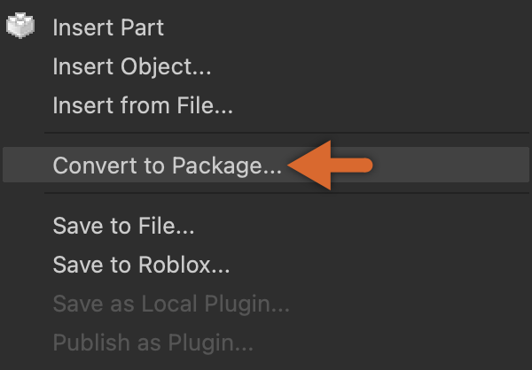

2. 상황에 맞는 창에서 요청된 세부 정보를 작성합니다. 특히 그룹에서 작업 중인 경우, 소유권을 그룹에서 생성/편집 권한이 있는 원하는 그룹으로 설정합니다.

   <Alert severity="warning">
   자산 시스템에서는 소유권 이전이 지원되지 않으므로, 패키지를 생성할 때 소유자를 신중하게 고려해야 합니다.
   </Alert>

3. 제출 버튼을 클릭합니다.
4. 완료되면 객체 아이콘 위에 "체인 링크" 기호가 표시되어 패키지임을 나타냅니다. 또한 객체에 PackageLink 객체가 부모로 추가된 것을 볼 수 있습니다.

   <Grid container spacing={5}>
     <Grid item>
       

       <figcaption>
기본 `Model`
</figcaption>
     </Grid>
     <Grid item>
       

       <figcaption>
패키지화된 `Model`
</figcaption>
     </Grid>
     <Grid item>
       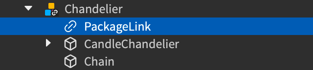
       <figcaption><b>PackageLink</b> 자식 패키지</figcaption>
      </Grid>
   </Grid>
    

   <Alert severity="error">
   PackageLink 객체는 삭제하거나 다시 부모로 설정해서는 안 됩니다. 이렇게 하면 패키지 복사본과 게시된 버전 간의 연결이 끊어지고 복사본이 일반 객체로 변환됩니다.
   </Alert>

## 패키지 삽입

현재 장소에 존재하지 않는 패키지를 삽입하려면 초기에는 다음 지침에 따라 도구 상자에서 삽입해야 합니다:

- 인벤토리 &rarr; 내 패키지에서 자신이 게시했거나 `Creator Store`에서 얻은 패키지.
- 창작물 &rarr; 그룹 패키지에서 그룹 구성원이 게시한 패키지 (자신 포함).

<GridContainer numColumns="2">
  <figure>
    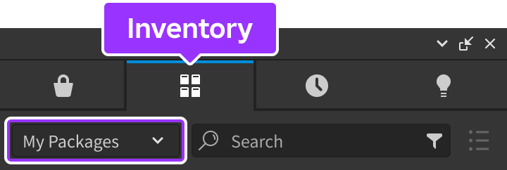
    <figcaption>도구 상자 &rarr; 인벤토리 &rarr; 내 패키지</figcaption>
  </figure>
  <figure>
    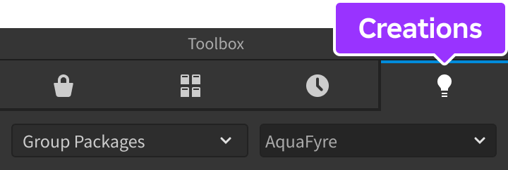
    <figcaption>도구 상자 &rarr; 창작물 &rarr; 그룹 패키지</figcaption>
  </figure>
</GridContainer>

한 번 패키지를 장소의 데이터 모델에 삽입하면 자산 관리자의 패키지 폴더에 나타나며 나중에 모든 복사본을 삭제하더라도 남아 있습니다. 그러나 장소를 게시할 때는 해당 폴더가 장소 내에서 사용된 패키지로만 업데이트됩니다.

<figure>
  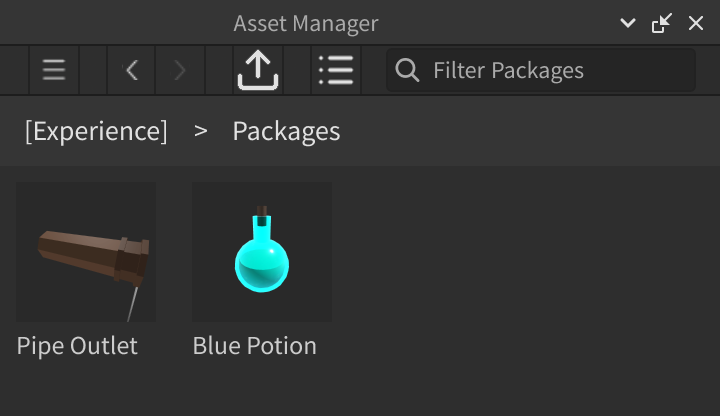
  <figcaption>자산 관리자에 있는 패키지</figcaption>
</figure>

<Alert severity="warning">
자신이 생성하지 않은 패키지를 경험에 삽입할 때는 주의해야 합니다. 이러한 패키지에는 경험의 성능에 영향을 미칠 수 있는 악성 스크립트가 포함될 수 있습니다. 악성 패키지는 경험의 이전 버전으로 되돌리지 않고는 문제를 해결하기 어려울 수 있으므로, 경험을 저장하고 낯선 패키지 내의 스크립트를 조사한 후 장소 파일에 가져오는 것이 좋습니다.
</Alert>

## 패키지 수정

다른 객체와 마찬가지로 패키지 및 자식 객체를 편집할 수 있습니다. 패키지 인스턴스를 수정하는 첫 번째 편집 시, 수정된 패키지는 어떤 수단으로도 업데이트할 수 없으며 일련의 편집을 취소하려면 되돌려야 한다는 고지 대화 상자가 나타납니다.

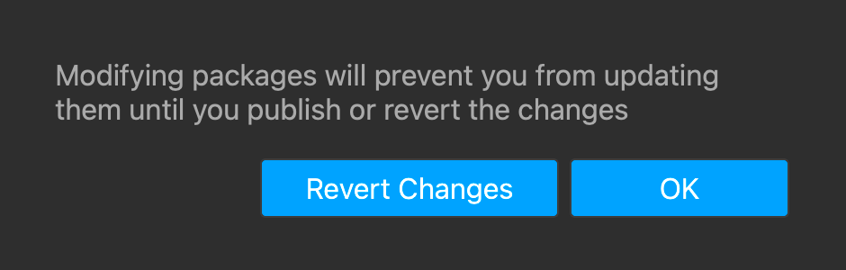

대부분의 편집은 패키지를 수정된 것으로 표시하지만, 다음 변경 사항은 패키지 수정으로 간주되지 않습니다:

<table>
  <thead>
    <tr>
      <th>편집</th>
	  <th>패키지 수정</th>
    </tr>
  </thead>
  <tbody>
    <tr>
      <td>루트 노드의 이름 변경.</td>
	  <td>아니요</td>
    </tr>
    <tr>
      <td>`BasePart`, `Model`, `GuiObject`인 패키지 루트 노드의 위치 또는 회전 변경.</td>
	  <td>아니요</td>
    </tr>
    <tr>
      <td>`GuiObject` 루트 노드(예: `ScreenGui`, `SurfaceGui`, `BillboardGui`)의 Enabled 속성 변경.</td>
	  <td>아니요</td>
    </tr>
	<tr>
      <td>패키지 내부의 `Weld`의 일부 참조를 패키지 외부의 인스턴스로 변경.</td>
	  <td>아니요</td>
    </tr>
  </tbody>
</table>

수정된 경우, 게시되지 않은 변경 사항이 있는 패키지는 탐색기 계층 구조에서 노란 점으로 표시됩니다.

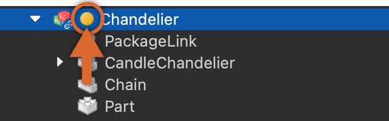

### 구성 추가 또는 업데이트

패키지의 동작을 사용자 정의하기 위해 패키지 루트에 인스턴스 속성을 포함할 수 있습니다. 예를 들어, 패키지화된 차량의 최대 속도나 패키지화된 버튼의 디바운스 시간 등을 설정할 수 있습니다.

패키지를 게시하면 현재 속성/값 세트가 패키지의 기본 구성이 됩니다. 패키지의 각 복사본에서 구성은 굵은 이탤릭체로 표시되며, 이러한 속성 값은 인스턴스별로 변경

할 수 있습니다. 패키지 복사본을 업데이트할 때, 수정된 구성 값은 유지되며, 다른 속성은 최신 기본값으로 업데이트됩니다.

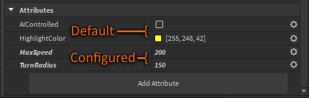

<Alert severity="info">
현재 구성 값을 처리하는 유일한 방법은 런타임 시 구성을 읽고 적용하는 스크립트를 패키지에 추가하는 것입니다.
</Alert>

<Alert severity="info">
기본 값을 업데이트하려면, 속성 값을 변경하고 패키지를 다시 게시하면 됩니다. 이 경우 패키지가 수정된 것으로 표시되지 않습니다. 다른 수정 사항을 게시하려면, 값 변경 없이 게시하거나, 게시하기 전에 구성을 기본값으로 되돌려야 합니다.
</Alert>

### 중첩 패키지

다른 패키지 내에 패키지를 중첩하여 복잡한 계층 구조를 유지하고 협업할 수 있습니다. 예를 들어, 부모 패키지의 차량 메커니즘을 독립적으로 수정할 수 있습니다.

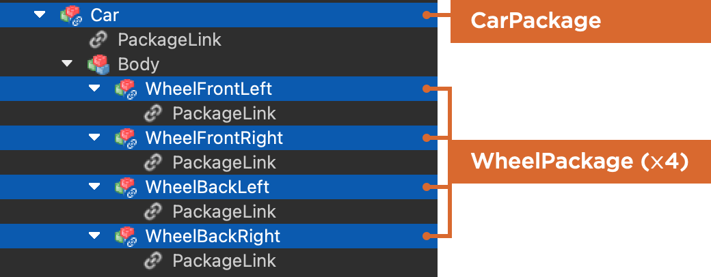

<Alert severity="warning">
중첩된 패키지를 수정하면 중첩된 패키지 및 부모 패키지가 수정된 것으로 간주됩니다. 부모 패키지의 수정 사항을 게시하려면 중첩된 패키지의 수정 사항을 먼저 게시해야 합니다. 그렇지 않으면 부모 패키지가 현재/수정되지 않은 상태로 표시되어 중첩된 패키지의 수정 사항과 충돌할 수 있습니다.
</Alert>

### 패키지 스크립트

수정되지 않은 패키지 내의 각 스크립트는 읽기 전용이며, 상단에 스크립트를 수정할 수 있도록 하는 하이퍼링크 알림이 표시됩니다.

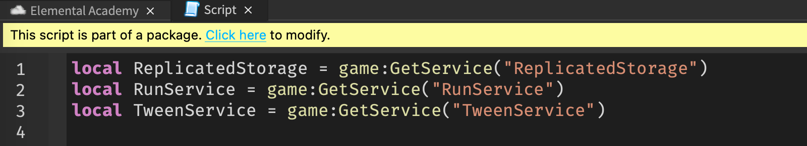

하이퍼링크를 클릭하면:

- 스크립트를 편집하지 않더라도 패키지가 수정된 것으로 표시됩니다.
- 패키지 내 다른 스크립트에서 알림/하이퍼링크가 제거됩니다.

패키지가 게시되고 수정되지 않은 상태로 돌아가면, 패키지 하의 스크립트는 읽기 전용이 되며 수정할 수 있는 하이퍼링크가 표시됩니다.

## 패키지 변경 사항 게시

수정된 패키지(노란 점으로 표시)를 게시하여 해당 수정 사항을 장소와 모든 경험에 있는 패키지 복사본에 제공할 수 있습니다. 수정된 패키지를 게시하기 전에는 장소를 게시할 필요가 없으며, 수정된 버전은 나중에 반복할 수 있도록 장소와 함께 저장됩니다.

패키지의 변경 사항을 게시하려면:

1. 탐색기 창에서 수정된 복사본(노란 점으로 표시)을 마우스 오른쪽 버튼으로 클릭하고 패키지로 게시를 선택합니다.

   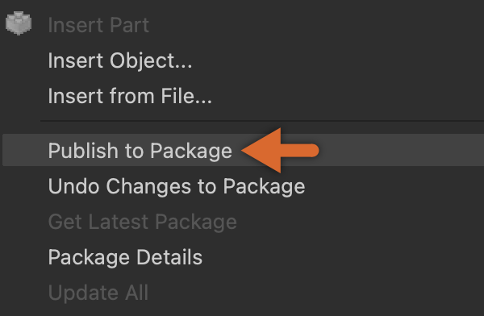

2. 자동 업데이트로 설정된 패키지 복사본은 즉시 업데이트된 버전을 가져옵니다. 다른 복사본은 이름 옆에 녹색 동기화 아이콘으로 표시되며, 필요에 따라 개별적으로 업데이트하거나 대량 업데이트할 수 있습니다.

   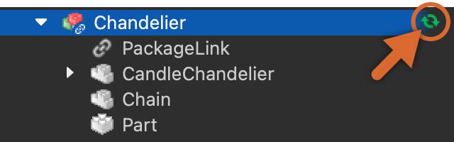

## 오래된 복사본 업데이트

오래된 패키지 복사본을 최신 버전으로 업데이트하거나, 계속해서 이전 버전을 사용할 수 있습니다.

오래된 패키지 복사본을 최신 버전으로 업데이트하려면:

1. 탐색기 창에서 이름 옆에 녹색 동기화 아이콘으로 표시된 오래된 복사본을 찾습니다.

   

2. 단일 오래된 복사본을 마우스 오른쪽 버튼으로 클릭하고 상황에 맞는 메뉴에서 최신 패키지 가져오기를 선택하거나, 여러 복사본(적어도 하나는 수정된 상태)을 선택하고 마우스 오른쪽 버튼을 클릭한 다음 선택된 패키지에 대한 최신 정보 가져오기를 선택합니다.

<Alert severity="info">
패키지 복사본 중 일부가 수정된 경우 최신 정보 [] 메뉴 옵션이 비활성화됩니다. 게시되지 않은 변경 작업을 수행 중인 경우, 최신 버전을 가져오기 전에 변경 사항을 되돌려야 합니다.
</Alert>

### 대량 업데이트

패키지를 광범위하게 사용하면 경험 내 여러 장소에 많은 패키지 복사본이 생성될 수 있습니다. 개별 동기화 및 자동 업데이트 외에도 대량 업데이트를 통해 패키지의 모든 복사본을 업데이트할 수 있습니다.

1. (권장) 경험의 장소가 열린 다른 Studio 인스턴스를 닫아 두십시오. 이렇게 하면 저장되지 않은 다른 인스턴스가 업데이트를 덮어쓰지 않도록 방지할 수 있습니다.
2. 탐색기 창에서 원하는 패키지를 마우스 오른쪽 버튼으로 클릭하고 상황에 맞는 메뉴에서 모두 업데이트를 선택합니다.
3. 팝업 창에서 버전/날짜 세부 정보 아래의 모두를 선택하여 경험의 모든 장소를 선택하거나, 대량 업데이트를 적용할 특정 장소만 선택합니다.

   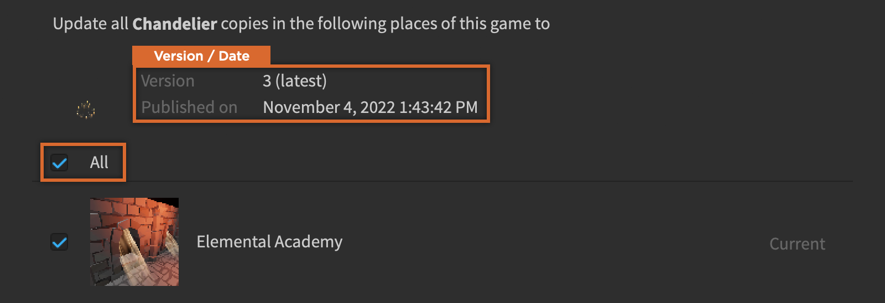

4. 업데이트 버튼을 클릭합니다.

<Alert severity="info">
패키지 대량 업데이트는 선택한 장소를 자동으로 저장하지만, 게시하지는 않으므로 변경 사항을 확인하려면 별도로 게시해야 합니다.
</Alert>

<Alert severity="warning">
원치 않는 덮어쓰기를 방지하기 위해, 대량 업데이트는 수정된 패키지 버전에 영향을 미치지 않습니다. Studio는 프로세스를 통해 업데이트되지 않은 패키지의 수를 알립니다.
</Alert>

### 자동 업데이트

동기화를 쉽게 하기 위해, 새 버전이 게시될 때마다 그리고 열린 Studio 세션 내에 있을 때 패키지 복사본이 자동으로 업데이트되도록 설정할 수 있습니다.

1. 탐색기 창에서 패키지의 계층 구조 트리를 확장하고 PackageLink 객체를 선택합니다.

   

2. 속성 창에서 자동 업데이트 속성을 활성화합니다. 이 속성은 중첩 패키지 계층 구조의 최상위 부모 패키지에만 적용되며, 부모 패키지가 업데이트될 때만 자동 업데이트가 발생합니다.

<Alert severity="warning">
자동 업데이트는 수정된 패키지 복사본에는 적용되지 않습니다. 패키지 인스턴스를 수정하면 자동 업데이트 속성이 비활성화되고 무시됩니다.
</Alert>

## 공유 및 접근 수준

원하는 경우, 패키지를 친구와 공유하거나 그룹 내 특정 사용자 역할에 대한 접근 권한을 부여할 수 있습니다.

1. 탐색기, 도구 상자 또는 자산 관리자에서 원하는 패키지를 마우스 오른쪽 버튼으로 클릭하고 상황에 맞는 메뉴에서 패키지 세부 정보를 선택합니다.
1. 팝업 창의 왼쪽 열에서 권한을 선택하여 그룹 소유 또는 사용자 소유 패키지에 대한 공유/액세스 옵션을 확인합니다.

   - 그룹 소유 패키지의 경우, 그룹 아이콘 옆의 `›`를 클릭하여 역할 트리를 확장한 다음 각 역할에 대한 권한 수준을 선택합니다. 회색/비활성화된 선택 상자는 해당 역할에 대해 이미 구성된 권한을 나타내며 이 창에서 변경할 수 없습니다.

      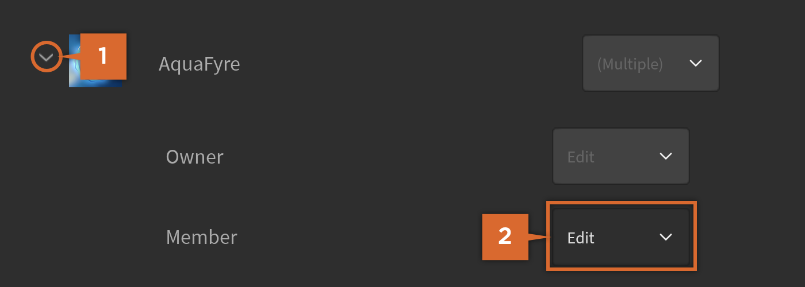

     <table>
     <thead>
     	<tr>
     	<th>권한</th>
     	<th>설명</th>
     	</tr>
     </thead>
     <tbody>
     	<tr>
     	<td>편집</td>
     	<td>역할 구성원은 현재 및 이전 패키지 버전을 사용, 보기 및 편집할 수 있으며, 변경 사항을 게시할 수 있습니다. 이 창에서 역할에 대한 편집 액세스를 부여하는 것은 특정 패키지에만 접근 권한을 부여합니다.</td>
     	</tr>
     	<tr>
     	<td>접근 불가</td>
     	<td>역할 구성원은 패키지의 새로운 버전에 접근할 수 없지만, 현재 및 이전 버전에 대한 접근 권한을 유지합니다.</td>
     	</tr>
     </tbody>
     </table>

   - 사용자 소유 패키지의 경우, 검색 필드를 통해 친구를 검색하고 아바타/사용자 이름을 클릭하여 권한 수준을 선택합니다.

     <table>
     <thead>
     	<tr>
     	<th>권한</th>
     	<th>설명</th>
     	</tr>
     </thead>
     <tbody>
     	<tr>
     	<td>사용 및 보기</td>
     	<td>사용자는 현재 및 이전 패키지 버전을 사용할 수 있고 볼 수 있습니다(편집할 수 없음). 사용자가 이 기능을 부여받으면, 이미 경험에 삽입된 복사본에 대한 접근을 취소할 수 없으며, 접근 권한을 취소하면 재삽입이나 패키지 업데이트를 방지할 수 있지만, 데이터 모델의 패키지 복사본은 그대로 유지됩니다.</td>
     	</tr>
     	<tr>
     	<td>편집</td>
     	<td>사용자는 현재 및 이전 패키지 버전을 사용할 수 있고 볼 수 있으며, 편집할 수 있으며, 변경 사항을 게시할 수 있습니다.</td>
     	</tr>
     </tbody>
     </table>

## 패키지 변경 사항 되돌리기

패키지 변경 사항을 하나씩 되돌리는 대신, 게시되지 않은 변경 사항을 되돌리거나, 이전 버전으로 복원하거나, 특정 구성을 되돌릴 수 있습니다.

### 게시되지 않은 변경 사항 되돌리기

게시되지 않은 변경 사항 전체를 되돌리려면:

1. 탐색기 창에서 이름 옆에 노란 점이 있는 수정된 복사본을 찾습니다.

1. 단일 수정된 복사본을 마우스 오른쪽 버튼으로 클릭하고 상황에 맞는 메뉴에서 패키지 변경 사항 취소를 선택하거나, 여러 복사본(적어도 하나는 수정된 상태)을 선택하고 마우스 오른쪽 버튼을 클릭한 다음 선택된 패키지에 대한 변경 사항 취소를 선택합니다.

### 버전으로 복원

이전에 게시된 버전으로 패키지를 복원하려면:

1. 탐색기 창, 도구 상자 또는 자산 관리자에서 원하는 패키지를 마우스 오른쪽 버튼으로 클릭하고 상황에 맞는 메뉴에서 패키지 세부 정보를 선택합니다.
1. 팝업 창의 왼쪽 열에서 버전을 선택합니다. 현재 게시된 버전과 이전에 게시된 버전(V1, V2, &hellip;)이 표시되며 게시된 날짜/시간이 나타납니다.
1. 복원하려는 버전 옆의 체크 표시를 클릭하고 제출 버튼을 클릭합니다.

   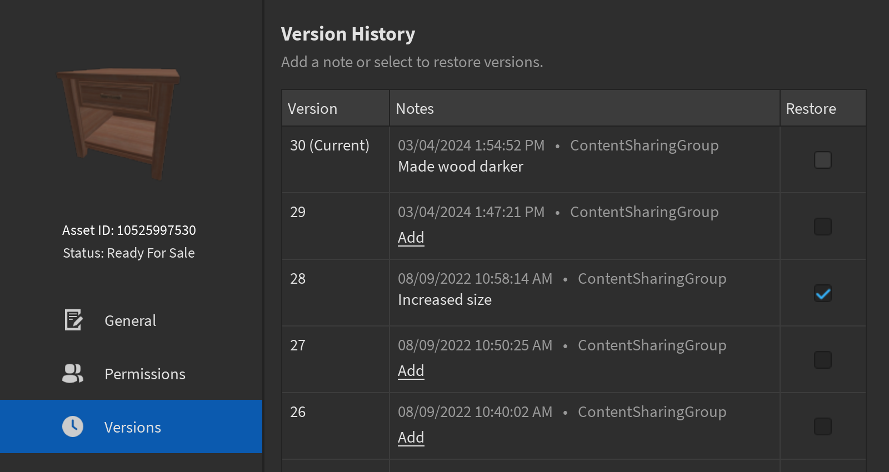

<Alert severity="warning">
패키지의 변경 사항을 되돌려도 구성은 기본값으로 재설정되지 않습니다. 구성 되돌리기를 참조하십시오.
</Alert>

### 구성 되돌리기

구성 속성을 기본값으로 되돌리려면, 속성 창의 속성 섹션에서 기어 메뉴의 재설정 옵션을 선택합니다.

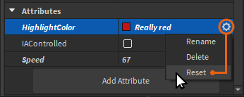

## 패키지 버전 비교

패키지에 여러 버전이 있는 경우, 차이 뷰어를 사용하여 버전 간의 변경 사항을 비교할 수 있습니다. 이 도구는 패키지 업데이트를 검토하고, 로컬 변경 사항을 최신 버전과 비교하며, 이전 버전의 내용을 복원하기 전에 확인하는 데 유용합니다.

도구에는 추가, 제거 또는 수정된 인스턴스를 나타내는 패키지 계층 구조 메뉴와 다음 탭이 있습니다:

- 시각적 개요 탭은 다양한 카메라 위치에서 3D 렌더링의 시각적 차이점을 보여줍니다. 3D 객체(모델, 파트)가 루트 객체인 패키지의 기본 보기이며, 현재는 루트 객체에만 적용됩니다.

   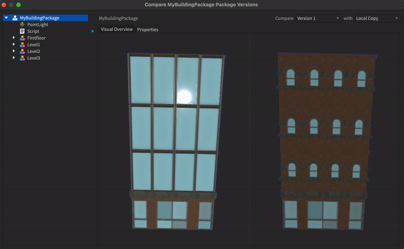

- 속성 탭은 속성과 속성의 변경 사항을 보여줍니다. 비 3D 객체(스크립트, 조명, 2D 객체)가 루트 객체인 패키지의 기본 보기이며, 패키지의 모든 인스턴스에 사용할 수 있습니다.

   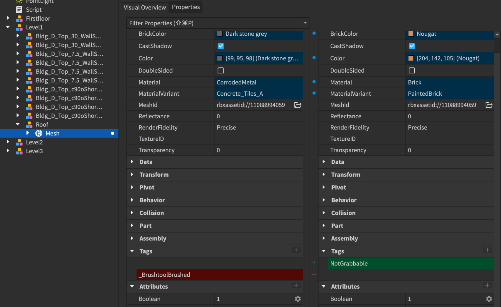

- 스크립트 탭은 줄 단위로 스크립트 차이점을 보여줍니다. 스크립트가 루트 객체인지 여부와 상관없이 스크립트를 포함하는 패키지에 사용할 수 있습니다.

   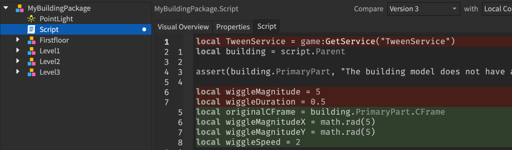

패키지 버전을 비교하려면:

1. 탐색기 창에서 대상 패키지를 마우스 오른쪽 버튼으로 클릭합니다.
2. 상황에 맞는 메뉴에서 패키지 버전 비교를 선택합니다.
3. 차이 뷰어 창에서 기본적으로 로컬 복사본과 최신 버전 간의 변경 사항을 비교할 수 있습니다. 드롭다운 메뉴를 사용하여 두 버전을 선택하여 비교할 수도 있습니다.

   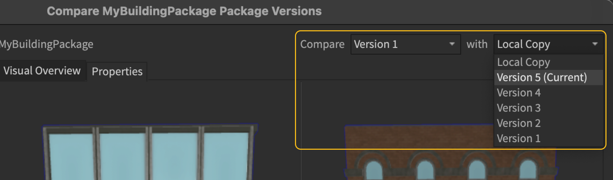

   <Alert severity="warning">
   일부 이전 버전은 패키지 차이 도구와 호환되지 않을 수 있습니다. 호환되지 않는 버전이 선택되면 시스템이 다른 버전을 선택하도록 안내합니다.
   </Alert>

4. 버전을 선택한 후:

   - 시각적 렌더링을 비교하려면, 시각적 개요 탭을 선택하고 원하는 각도로 카메라 제어를 조정합니다. 제어는 보기를 통해 동기화됩니다:

     - 왼쪽 마우스 클릭을 사용하여 카메라를 팬합니다.
     - 오른쪽 마우스 클릭을 사용하여 카메라를 회전합니다.

     - 마우스 휠을 사용하여 카메라를 확대하거나 축소합니다.
     - 키보드 단축키 `-F`를 사용하여 재중심합니다.

   - 인스턴스의 속성과 속성을 비교하려면, 인스턴스를 선택하고 속성 탭을 선택합니다.

   - 스크립트 차이점을 비교하려면, 스크립트를 선택하여 스크립트의 줄 단위 변경 사항을 확인합니다.

대안으로 탐색기 창에서 스크립트 차이 도구를 직접 열 수 있습니다.

<Alert severity="warning">
이 방법은 현재 버전과 최신 게시된 버전 또는 로컬 버전 간의 스크립트 변경 사항만 비교할 수 있으며, 변경을 수행한 협력자는 표시되지 않습니다.
</Alert>

1. 스크립트이거나 스크립트를 포함하는 대상 패키지를 마우스 오른쪽 버튼으로 클릭합니다.
2. 상황에 맞는 메뉴에서 스크립트 변경 사항 보기를 선택합니다.
3. 열리는 차이 결과 탭에서 선택한 스크립트의 현재 패키지 복사본과 최신 게시된 버전 또는 로컬 버전 간의 모든 변경 사항을 비교합니다.

---
## 출처
 - [Packages](https://create.roblox.com/docs/projects/assets/packages)

---
## [다음](./02_05_Asset_Privacy.md)