# Asset Privacy

## 목차
- [Asset Privacy](#asset-privacy)
  - [목차](#목차)
  - [권한 부여](#권한-부여)
    - [제작자에게 권한 부여](#제작자에게-권한-부여)
    - [경험에 권한 부여](#경험에-권한-부여)
    - [교차 게시](#교차-게시)
  - [권한 보기](#권한-보기)
  - [권한 취소](#권한-취소)
  - [출처](#출처)
  - [다음](#다음)

---

**자산 프라이버시 시스템**을 통해 Roblox에서 오디오 및 비디오 자산의 사용 및 배포를 제어할 수 있습니다. 플랫폼에는 두 가지 자산 프라이버시 상태가 있습니다:

- **공개** — 모든 제작자가 해당 자산을 자신의 경험에서 사용할 수 있습니다.
- **비공개** — 자산 소유자가 허가한 후에만 제작자나 경험이 해당 자산을 사용할 수 있습니다.

제작자에게 비공개 자산을 사용할 수 있는 권한을 부여하면, 제작자는 자신의 모든 경험에서 해당 자산을 사용할 수 있습니다. 또한 경험에 권한을 부여하면 경험 소유자는 해당 자산이 런타임 동안 보이거나 들리도록 경험을 게시할 수 있습니다.

제작자나 경험이 자산을 사용할 권한이 없는 경우, 스튜디오에서 로드할 수 없으며 출력 창에 오류 메시지가 표시됩니다.

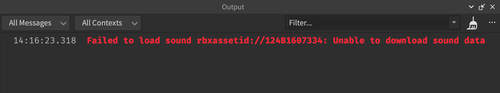

<Alert severity="info">
자산 프라이버시 시스템은 자산을 사용할 수 있는 사용자와 경험을 제어하지만, 다른 제작자는 여전히 자산의 메타데이터(예: 이름 및 설명)를 볼 수 있습니다.
</Alert>

## 권한 부여

제작자나 경험이 비공개 자산을 사용하려면 명시적으로 권한을 부여해야 합니다. 제작자나 경험이 비공개 자산을 사용할 **명시적** 권한을 받으면, 다양한 추가 시나리오에서 해당 자산을 사용할 수 있는 **암묵적** 권한도 받게 됩니다. 자세한 내용은 다음 하위 섹션을 참조하세요.

<Alert severity="warning">
비공개 자산이 크리에이터 스토어의 공개 모델 또는 패키지의 자식인 경우, 런타임 동안 비공개 자산이 보이거나 들리도록 하려면 제작자와 경험 모두 명시적 권한이 필요합니다. 예를 들어, 모델에 비공개 자산 ID가 있는 `Sound` 객체가 포함된 경우, 공개 모델은 보이지만 비공개 오디오는 재생되지 않습니다.
</Alert>

### 제작자에게 권한 부여

제작자가 비공개 자산을 사용하려면 플랫폼에서 [친구](https://en.help.roblox.com/hc/en-us/articles/203313580-How-to-Make-Friends)여야 합니다. 친구에게 명시적 권한을 부여하면, 친구는 자신의 개인 및 그룹 소유 경험에서 자산을 사용할 수 있는 암묵적 권한을 얻으며, 비공개 자산을 사용하도록 `경험에 권한 부여`할 수도 있습니다.

제작자가 비공개 자산을 사용할 권한을 얻으면 **도구 상자**의 **인벤토리** 탭을 통해 또는 속성 창에서 비공개 자산 ID를 사용하여 자산을 경험에 삽입할 수 있습니다.

<GridContainer numColumns="2">
  <figure>
    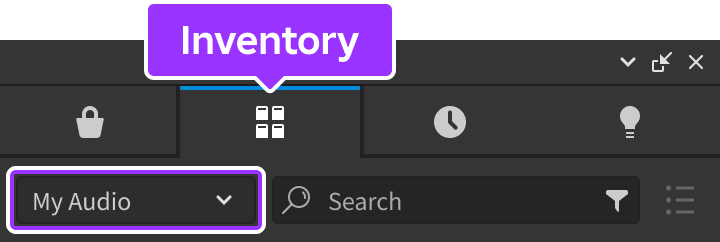
    <figcaption>도구 상자를 통해 비공개 자산 삽입</figcaption>
  </figure>
  <figure>
    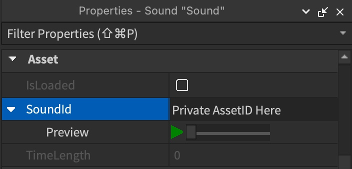
    <figcaption>속성 창에서 비공개 자산 삽입</figcaption>
  </figure>
</GridContainer>

그러나 제작자가 스크립트에서 비공개 자산을 사용하거나 비공개 자산을 포함한 템플릿 장소를 저장 또는 게시하려면, `경험에 권한 부여`를 통해 경험 자체에 권한을 부여해야 합니다. 이 단계를 완료하지 않으면, 런타임 동안 자산이 보이거나 들리지 않으며 **출력** 창에 오류 메시지가 표시됩니다.

제작자가 이러한 시나리오에서 비공개 자산을 사용할 권한을 부여하려면:

1. [크리에이터 대시보드](https://create.roblox.com/dashboard/creations)로 이동합니다.
2. 상단 탭 바에서 **개발 항목**을 선택한 후 **오디오** 또는 **비디오**를 클릭합니다. 모든 오디오 또는 비디오 자산이 표시됩니다.

   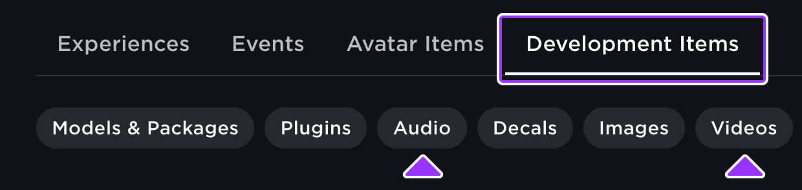

3. 제작자가 자신의 경험에서 사용할 수 있도록 허가하고자 하는 자산을 선택합니다. 자산의 **구성** 페이지가 표시됩니다.
4. 자산의 왼쪽 탐색에서 **권한**을 선택합니다. 자산의 **권한** 페이지가 표시됩니다.

   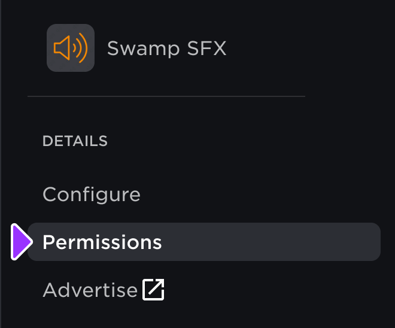

5. **협력자 접근** → **제작자**에서 권한을 부여할 친구를 검색합니다. 제작자가 검색 창 아래에 표시되며 해당 사용 권한이 보입니다.

   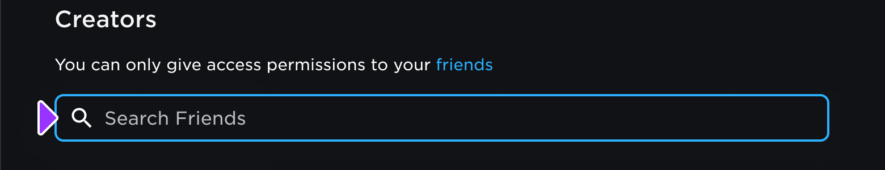

6. 페이지 하단의 **변경 사항 저장** 버튼을 클릭합니다.

### 경험에 권한 부여

<Alert severity="error">
경험이 비공개 자산을 사용할 권한을 얻으면 해당 자산에 대한 접근 권한을 취소할 수 없습니다.
</Alert>

경험이 비공개 자산을 사용할 수 있는 권한을 부여하려면 해당 경험을 편집할 수 있어야 하며, 그룹에 속한 경우 **그룹 경험 생성 및 편집** 역할 권한이 있어야 합니다. 제작자가 비공개 자산을 사용할 권한을 부여한 경험에 대해 명시적 권한을 부여하면, 해당 경험을 편집할 수 있는 모든 사람은 암묵적으로 다음과 같은 권한을 얻습니다:

- 자산을 해당 경험의 다른 장소 파일에 복사 및 붙여넣기.
- **속성** 창이나 스크립트에서 자산 ID를 사용하기.

<GridContainer numColumns="2">
  <figure>
    
    <figcaption>속성 창에서 비공개 자산 삽입</figcaption>
  </figure>
  <figure>
    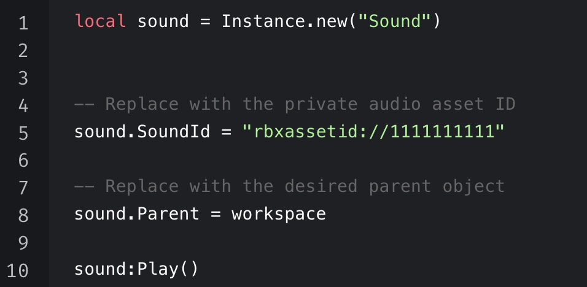
    <figcaption>스크립트를 통해 비공개 자산 삽입</figcaption>
  </figure>
</GridContainer>

<Tabs>
  <TabItem key = "1" label="자산 수준에서">

비공개 자산을 사용할 수 있는 권한을 경험에 부여하려면:

1. [크리에이터 대시보드](https://create.roblox.com/dashboard/creations)로 이동합니다.
1. 상단 탭 바에서 **개발 항목**을 선택한 후 **오디오** 또는 **비디오**를 클릭합니다. 모든 오디오 또는 비디오 자산이 표시됩니다.

   

1. 경험이 사용할 수 있도록 허가하고자 하는 자산을 선택합니다. 자산의 **구성** 페이지가 표시됩니다.
1. **경험 접근**에서 경험의 유니버스 ID를 **유니버스 ID 입력** 입력란에 입력한 후 **추가** 버튼을 클릭합니다. 입력란 아래에 경험이 표시되고 접근 권한이 보입니다.

	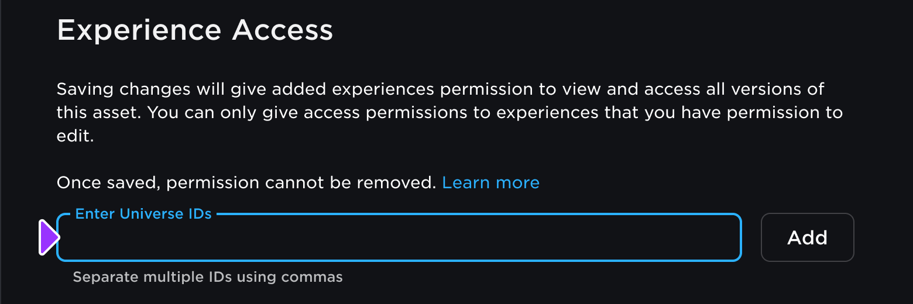

  

 <Alert severity="info">
   여러 경험에 동시에 비공개 자산을 사용할 수 있는 권한을 부여하려면, 유니버스 ID를 쉼표로 구분하여 입력할 수 있습니다.
   </Alert>

1. 페이지 하단의 **변경 사항 저장** 버튼을 클릭합니다.

  </TabItem>
  <TabItem key = "2" label="경험 수준에서">

위의 시나리오에서 많은 비공개 자산을 사용할 수 있도록 경험에 권한을 부여하려면:

1. [크리에이터 대시보드](https://create.roblox.com/dashboard/creations)로 이동합니다.
1. 자신 또는 그룹의 경험 중 하나를 선택합니다. 경험의 개요 페이지가 표시됩니다.
1. 경험의 왼쪽 탐색에서 **구성** 섹션으로 이동한 후 **권한**을 선택합니다. 자산의 **권한** 페이지가 표시됩니다.

   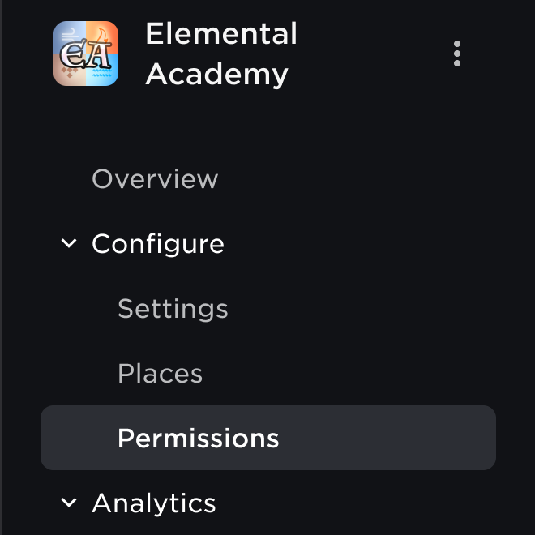

1. **자산 ID 입력** 입력란에 경험이 접근할 모든 자산 ID를 쉼표로 구분하여 입력한 후 **추가** 버튼을 클릭합니다. 경험이 접근할 수 있는 모든 비공개 자산이 입력란 아래에 자산 이름, ID, 소유자 및 자산 유형과 함께 표시됩니다.

   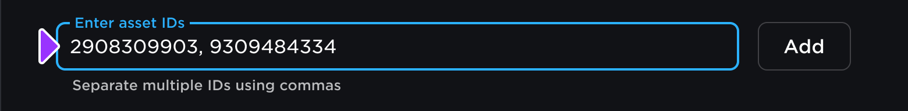

1. 페이지 하단의 **변경 사항 저장** 버튼을 클릭합니다.

  </TabItem>
</Tabs>

### 교차 게시

비공개 자산이 포함된 경험에서 전체적으로 다른 경험으로 장소를 교차 게시하려면, 소스 경험과 게시자는 비공개 자산을 사용할 권한이 있어야 합니다. 이 조건이 충족되면 장소 파일을 받는 경험도 비공개 자산을 사용할 수 있는 암묵적 권한을 얻습니다.

그러나 게시자가 게시되지 않은 장소를 완전히 다른 경험으로 교차 게시하려고 하면, 비공개 자산을 관리할 방법을 선택할 수 있는 팝업이 표시됩니다. 게시자가 새로운 경험에 권한을 부여할 자격이 있는 경우(예: 경험의 소유자인 경우), 팝업의 **모든 권한 부여** 버튼을 클릭하여 새로운 경험에 장소의 비공개 자산을 사용할 권한을 명시적으로 부여할 수 있습니다.

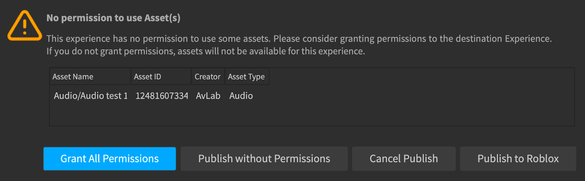

그러나 권한을 부여할 자격이 없는 경우에도 장소를 경험으로 게시할 수 있지만, 경험은 비공개 자산에 대한 권한을 얻지 못하며 **출력** 창에 오류 메시지가 표시됩니다.

## 권한 보기

자신이나 소속된 그룹의 경험이 사용할 수 있는 모든 비공개 자산을 크리에이터 대시보드의 **권한** 페이지에서 확인할 수 있습니다.

1. [크리에이터 대시보드](https://create.roblox.com/dashboard/creations)로 이동합니다.
1. 자신 또는 그룹의 경험 중 하나를 선택합니다. 경험의 개요 페이지가 표시됩니다.
1. 경험의 왼쪽 탐색에서 **구성** 섹션으로 이동한 후 **권한**을 선택합니다. 자산의 **권한** 페이지가 표시됩니다.

   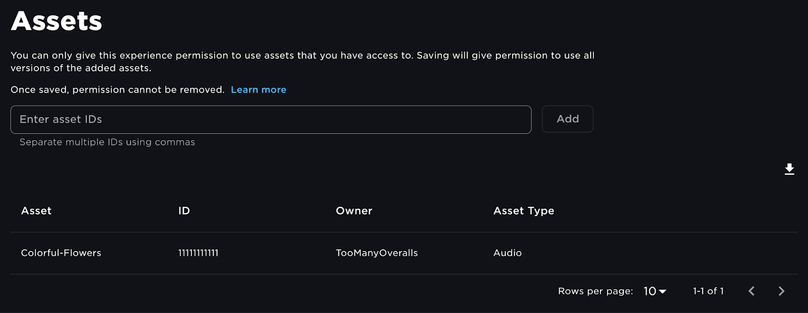

1. **(선택 사항)** 다운로드 아이콘을 클릭하여 오프라인 처리용 데이터를 다운로드할 수 있습니다.

   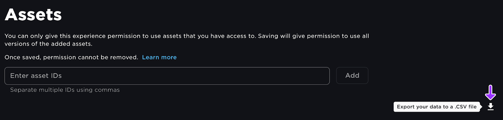

## 권한 취소

<Alert severity="warning">
친구를 삭제해도 비공개 자산 사용 권한이 자동으로 취소되지는 않습니다.
</Alert>

친구의 비공개 자산 사용 권한을 취소하면, 더 이상 **추가적인** 경험에서 자산을 사용할 수 없지만, 이미 자산을 사용한 경험에서는 계속 액세스할 수 있습니다.

친구가 현재 사용하지 않는 추가적인 경험에서 비공개 자산을 사용할 수 있는 권한을 취소하려면:

1. [크리에이터 대시보드](https://create.roblox.com/dashboard/creations)로 이동합니다.
1. 상단 탭 바에서 **개발 항목**을 선택한 후 **오디오** 또는 **비디오**를 클릭합니다. 모든 오디오 또는 비디오 자산이 표시됩니다.

   

1. 한 명 이상의 제작자가 자신의 경험에서 사용할 수 있는 권한을 취소할 자산을 선택합니다. 자산의 **구성** 페이지가 표시됩니다.
1. 자산의 왼쪽 탐색에서 **권한**을 선택합니다. 자산의 **권한** 페이지가 표시되고, **협력자 접근** → **제작자** 아래에 자산을 사용할 수 있는 모든 제작자가 표시됩니다.

   

1. 권한을 취소하려는 제작자 옆에 있는 **제거** 버튼을 클릭합니다.

   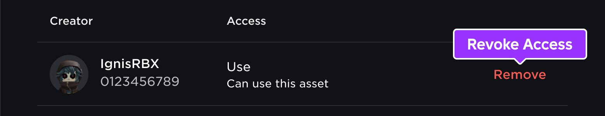

1. 페이지 하단의 **변경 사항 저장** 버튼을 클릭합니다.

---
## 출처
 - [Asset Privacy](https://create.roblox.com/docs/projects/assets/privacy)

---
## [다음](./02_06_In_Experience_Asset_Creation.md)