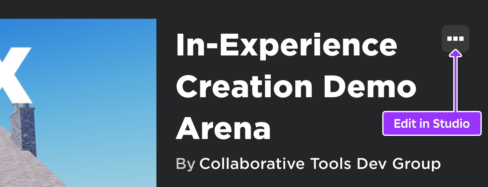
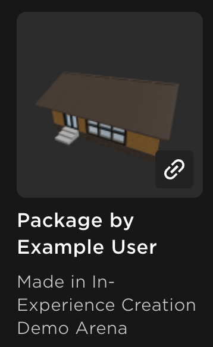

# In-Experience Asset Creation

## 목차
- [In-Experience Asset Creation](#in-experience-asset-creation)
  - [목차](#목차)
  - [지원되는 자산 유형 및 제한](#지원되는-자산-유형-및-제한)
  - [경험 내 자산 생성 활성화](#경험-내-자산-생성-활성화)
  - [생성 후 및 귀속](#생성-후-및-귀속)
  - [출처](#출처)
  - [다음](#다음)

---

경험 내 자산 생성 기능을 사용하면 사용자가 경험 내에서 만든 창작물을 인벤토리에 저장할 수 있도록 허용할 수 있습니다. 사용자는 이러한 경험 내 창작물을 다른 자산처럼 사용할 수 있습니다. 또한, 이러한 창작물은 Roblox 플랫폼에 표시될 때 귀하의 경험에 귀속되므로, 사용자는 귀속 링크를 통해 귀하의 경험으로 이동하여 자신만의 창작물을 만들 수 있습니다.

예를 들어, 사용자가 경험 내에서 애완동물로 사용할 수 있는 맞춤형 생물을 만들고, 좋아하는 애완동물을 인벤토리에 저장할 수 있도록 할 수 있습니다. 귀하는 사용자가 수정하고 저장할 수 있는 객체를 지정할 수 있는 완전한 제어 권한을 갖습니다. 사용자는 창작물을 프로필에 표시하여 귀하의 경험에 대한 가시성을 높일 수 있습니다.

## 지원되는 자산 유형 및 제한

모든 플랫폼 자산과 마찬가지로, 경험 내 창작물도 자산 검토의 대상이 됩니다. 현재, 사용자가 경험 내에서 패키지를 생성할 수 있도록 허용할 수 있습니다. 이러한 패키지에는 스크립트나 오디오, 비디오, 중첩된 패키지와 같은 비공개 자산이 포함될 수 없습니다. 사용자가 저장할 수 있는 패키지에 스크립트나 비공개 자산이 포함되어 있으면, 시스템이 사용자에게 저장 프롬프트를 숨겨 저장 동작을 차단합니다.

경험을 실행하거나 테스트하는 동안 경험 내 창작물의 일부로 스크립트나 비공개 자산을 추가하면 저장에 실패하고 Studio 출력 창 또는 개발자 콘솔에 오류 메시지가 표시됩니다.

## 경험 내 자산 생성 활성화

사용자가 경험 내 자산 생성을 사용할 수 있도록 하려면 서버 측 스크립트에서 `AssetService:PromptCreateAssetAsync()` API 메서드를 사용하고 다른 생성 로직과 함께 사용합니다. 이 기능을 사용하려는 경험 내 인스턴스를 지정하고, 메서드를 호출하기 위한 사용자 정의 트리거(UI 아이콘 등)를 설정하고, 자산 저장을 위한 클라이언트 원격 이벤트를 수신합니다.

`AssetService:PromptCreateAssetAsync()`는 다음 매개변수를 받습니다:

- 자산 생성을 제출하는 사용자를 나타내는 `Player` 객체.
- 생성할 자산을 나타내는 `Instance` 객체.
- 현재 `Enum.AssetType.Model`로 제한된 `Enum.AssetType`.

서버가 `AssetService:PromptCreateAssetAsync()`를 호출하면, 클라이언트에 **패키지 제출** 대화 상자가 표시되어 저장 작업을 트리거한 사용자가 패키지의 이름과 설명을 입력할 수 있습니다. Roblox는 저장 워크플로가 플랫폼 수준의 기능이므로 대화 상자 UI를 기본 제공합니다.

다음 예제 서버 측 스크립트는 사용자가 경험 내에서 자동차를 페인트할 때 저장을 요청하는 예제입니다:

```lua title="경험 내 자산 생성 예제 스크립트"

-- Define the AssetService variable
local AssetService = game:GetService("AssetService")

-- Set up PromptCreateAssetAsync() for prompting the submission dialog
local function CreateAsset(player, instance)
	local complete, result, assetId = pcall(function()
		return AssetService:PromptCreateAssetAsync(player, instance, Enum.AssetType.Model)
	end)

	if complete then
		if result == Enum.PromptCreateAssetResult.Success then
			print("successfully uploaded, AssetId:", assetId)
		else
			print("Received result", result)
		end
	else
		print("error")
		print(result)
	end
end

-- Car painting logic omitted

-- Add an event handler
local function onUserPublish(player, promptObject)
	-- User saves the car instance with the experience's default color
	if promptObject.Name == "car" then
		CreateAsset(player, car)
	elseif promptObject.Name == "CarPaintYellow" or promptObject.Name == "CarPaintBlue" or promptObject.Name == "CarPaintBlack" or promptObject.Name == "CarPaintRed" then
		PaintCarColor(promptObject.Name)
	end
end

PublishEvent.OnServerEvent:Connect(onUserPublish)

```

[경험 내 생성 데모 아레나](https://www.roblox.com/games/12992503026/In-Experience-Creation-Demo-Arena)는 이 기능을 사용하는 방법을 보여주는 예제를 제공합니다. 데모에 참여하여 사용자로서 경험 내 생성 워크플로를 체험하고, **스튜디오에서 편집** 옵션을 사용하여 장소 파일을 참조할 수 있습니다.



## 생성 후 및 귀속

사용자가 경험에서 자산을 생성하고 저장한 후, 다음 위치에서 찾을 수 있습니다:

- [내 인벤토리](https://en.help.roblox.com/hc/en-us/articles/360000463726-How-to-View-or-Hide-Your-Inventory-in-a-Browser) 페이지.
- [프로필](https://en.help.roblox.com/hc/en-us/articles/203313660-All-About-Profiles-Blurbs-and-Profile-Customization) 페이지의 **생성물** 탭.
- 크리에이터 대시보드의 **개발 항목** 탭의 [생성물](https://create.roblox.com/dashboard/creations?activeTab=Model) 페이지.
- 스튜디오의 도구 상자에서 **인벤토리** 탭.

사용자가 친구의 프로필이나 인벤토리에서 경험 내 창작물을 볼 때, 해당 자산이 생성된 원래 경험에 대한 귀속을 볼 수 있습니다. 사용자는 귀속 링크를 클릭하여 경험 페이지로 리디렉션되어 해당 경험에 참여하고 자신만의 창작물을 만들 수 있습니다.



<Alert severity="warning">
귀속은 생성된 자산의 특정 버전에 연결됩니다. 사용자가 경험에서 패키지를 저장하고 스튜디오에서 추가 편집하여 새 버전을 만들면, 새 버전에 대한 귀속이 더 이상 표시되지 않습니다.
</Alert>

---
## 출처
 - [In-Experience Asset Creation](https://create.roblox.com/docs/projects/assets/in-experience-asset-creation)

---
## [다음](./03_00_3D_workspace.md)