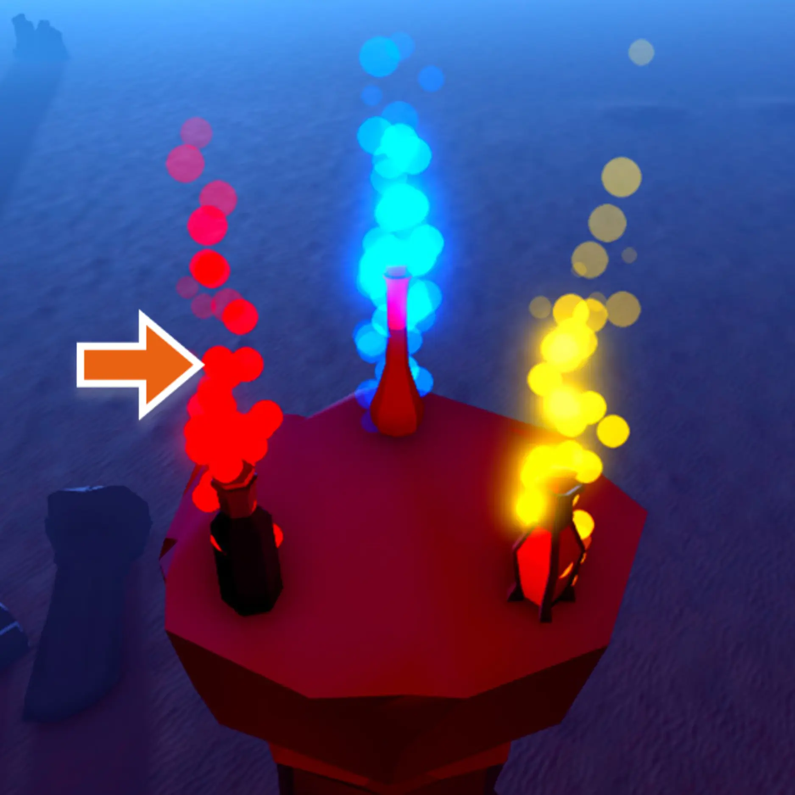
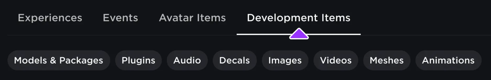
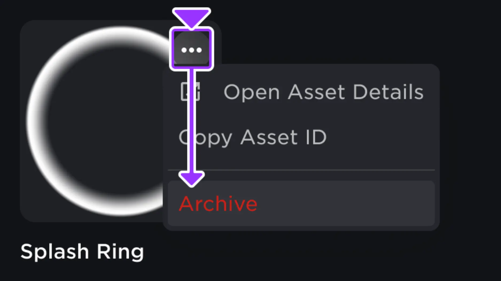

# Assets

## 목차
- [Assets](#assets)
  - [목차](#목차)
  - [자산 유형](#자산-유형)
    - [경험을 위한 자산](#경험을-위한-자산)
    - [장소를 위한 자산](#장소를-위한-자산)
    - [아바타를 위한 자산](#아바타를-위한-자산)
  - [패키지](#패키지)
  - [자산 형식 문자열](#자산-형식-문자열)
    - [rbxassetid](#rbxassetid)
    - [rbxasset](#rbxasset)
    - [rbxthumb](#rbxthumb)
    - [rbxhttp](#rbxhttp)
    - [https / http](#https--http)
  - [자산 권한](#자산-권한)
  - [자산 검토](#자산-검토)
  - [자산 관리](#자산-관리)
  - [자산 보관](#자산-보관)
  - [출처](#출처)
  - [다음](#다음)

---

Roblox의 거의 모든 것은 고유한 ID와 함께 클라우드 기반 자산으로 표현됩니다. 이 ID는 일반적으로 `rbxassetid://[ID]` 형식으로, 해당 자산 유형에 적합한 속성으로 다양한 인스턴스에 적용됩니다. 예를 들어, `Texture`, `MeshPart`, 및 `Sound` 인스턴스는 각각 `Texture.TextureID|TextureID`, `MeshPart.MeshID|MeshID`, 및 `Sound.SoundID|SoundID` 속성을 통해 이미지, 메시 및 오디오 자산을 참조합니다.

<table>
  <tbody>
    <tr>
      <td></td>
      <td></td>
      <td><audio controls><source src="../img/02_assets/Boom-Impact.mp3" type="audio/mpeg"></source></audio></td>
    </tr>
    <tr>
			<td><code>rbxassetid://7229442422</code></td>
			<td><code>rbxassetid://6768917255</code></td>
			<td><code>rbxassetid://9125402735</code></td>
    </tr>
  </tbody>
</table>

이 클라우드 기반 자산 시스템을 통해 자산을 Roblox를 통해 저장하고 다양한 컨텍스트에서 재사용할 수 있습니다. 예를 들어, 다른 객체 및 장소에서 로컬 사본을 유지 관리하지 않고도 사용할 수 있습니다. [크리에이터 스토어][CreatorMarketplaceURL]에서 수백만 개의 프로젝트 자산을 찾거나, [마켓플레이스][MarketplaceURL]에서 아바타 자산을 장착하거나, 직접 자산을 생성하고 자산 관리 도구를 통해 Studio로 가져올 수 있습니다.

자산을 가져오면 게시된 경험에서 사용자가 이를 보고 상호 작용할 수 있도록 하기 전에 검토를 거쳐야 합니다. 가져온 자산이 Roblox의 승인을 받으면 플랫폼에서의 사용 권한을 유지하거나 자산 권한에 자세히 설명된 대로 공개적으로 사용할 수 있습니다.

## 자산 유형

플랫폼에서 사용할 수 있는 모든 자산 유형은 일반적으로 세 가지 범주 중 하나에 속합니다:

- 프로젝트 수준 항목에 매핑되는 자산. 특정 경험에 대해 [크리에이터 대시보드][CreatorDashboardURL]에서 이러한 자산을 찾고 구성할 수 있습니다.
- 장소 내 객체의 외관이나 동작을 변경하는 객체 또는 자산. 이러한 자산을 [가져오](#asset-management)거나 [크리에이터 스토어][CreatorMarketplaceURL]에서 찾을 수 있습니다.
- 아바타 및 NPC의 신체, 의류 또는 애니메이션을 변경하는 자산. 이러한 자산은 [마켓플레이스][MarketplaceURL]에서 찾을 수 있습니다.

각 자산 유형은 플랫폼에서 어디에 위치하느냐에 따라 다르게 작동합니다. 각 자산 유형을 경험, 장소, 및 아바타에서 사용하는 방법에 대한 정보를 보려면 다음 섹션을 참조하세요.

### 경험을 위한 자산

프로젝트 수준 항목에 매핑되는 세 가지 자산 유형이 있습니다. 이러한 자산 유형은 해당 경험에 고유하며 다른 프로젝트로 이전할 수 없습니다.

- **장소** — 모든 경험에는 하나 이상의 장소 또는 개별 3D 세계가 있습니다. 각 장소는 장소의 3D 세계와 논리를 설명하는 데이터 모델로 표현됩니다.
- **배지** — 배지는 사용자가 경험 내에서 목표를 달성할 때 수여할 수 있는 특별한 상입니다.
- **패스** — 패스는 사용자가 경험 내에서 특별한 권한을 얻기 위해 한 번의 Robux 요금을 지불하게 하는 수익 창출 제품입니다.

### 장소를 위한 자산

일반적으로, 장소를 위한 자산 유형은 두 가지 범주로 나뉩니다. 가져오거나 크리에이터 스토어에서 찾을 수 있습니다:

- 모델 및 메시와 같은 데이터 모델 내의 객체로 존재하는 자산.
- 오디오, 이미지, 폰트 및 비디오와 같은 객체의 속성으로 적용되는 자산.

장소를 위한 이러한 두 가지 자산 유형에 대한 자세한 정보는 아래 표를 참조하세요.

<table>
	<thead>
		<tr>
			<th>자산 유형</th>
			<th>설명</th>
		</tr>
	</thead>
	<tbody>
		<tr>
			<td>**모델**</td>
			<td>`Model`은 `BasePart`, `MeshPart` 및 기타 `Model` 객체와 같은 기하학적 그룹의 컨테이너 객체입니다. 모델에는 `Script`와 같은 객체도 포함될 수 있습니다. Studio에서 객체를 그룹화하면 자동으로 `Model` 객체가 됩니다. 자세한 내용은 모델을 참조하세요.</td>
		</tr>
		<tr>
			<td>**메시**</td>
			<td>`MeshPart`는 물리적으로 시뮬레이션된 사용자 정의 메시를 포함하는 파트 객체 유형입니다. 자세한 내용은 메시를 참조하세요.</td>
		</tr>
		<tr>
			<td>**오디오**</td>
			<td>`Sound` 객체는 오디오 자산 ID를 `SoundId` 속성에 적용할 때 오디오를 방출하는 객체입니다. 데이터 모델 내에서 `Sound` 객체를 배치하는 위치는 경험 내에서 소리가 방출되는 위치와 방식을 변경합니다. 자세한 내용은 오디오 자산 및 사운드 객체를 참조하세요.</td>
		</tr>
		<tr>
			<td>**이미지**</td>
			<td>이미지는 파트의 텍스처/데칼, UI 요소, 메시 텍스처, 사용자 정의 재료 텍스처, 특수 효과 텍스처 등 다양한 방식으로 장소 내에서 사용됩니다.</td>
		</tr>
		<tr>
			<td>**폰트**</td>
			<td>`TextButton`, `TextLabel`, 및 `TextBox` 객체는 폰트 자산 ID를 적용할 때 특정 스타일로 타이포그래피를 표시합니다. 폰트를 가져올 수는 없지만, [크리에이터 스토어][CreatorMarketplaceURL]에는 사용할 수 있는 80개 이상의 다양한 폰트가 제공됩니다.</td>
		</tr>
		<tr>
			<td>**비디오**</td>
			<td>`VideoFrame` 객체는 `VideoFrame.Video|비디오` 자산 속성을 통해 비디오를 표시합니다. 자세한 내용은 비디오 프레임을 참조하세요.</td>
		</tr>
	</tbody>
</table>

### 아바타를 위한 자산

아바타를 위한 자산 유형은 세 가지 범주로 나뉘며, 이를 [마켓플레이스][MarketplaceURL]에서 찾아 아바타에 장착할 수 있습니다:

- **신체 부위** — 아바타 캐릭터 모델의 머리, 몸통, 다리 등의 부분을 나타내는 자산.
- **의류 및 액세서리** — 신체 부위 위에 착용하는 의류 및 액세서리를 나타내는 자산.
- **애니메이션** — 아바타 캐릭터 모델의 달리기, 점프, 수영 등의 애니메이션을 나타내는 자산.

모든 캐릭터 모델에는 캐릭터의 신체 부위, 의류, 액세서리 및 애니메이션의 자산 ID가 포함된 `HumanoidDescription` 객체가 포함되어 있습니다. 기본적으로 사용자의 플레이어블 캐릭터는 개인 Roblox 아바타를 참조하지만, 원할 경우 사용자 정의 `HumanoidDescription`을 적용할 수 있습니다. 자세한 내용은 캐릭터 외관을 참조하세요.

## 패키지

Studio 내에서 단일 자산 또는 자산 계층 구조를 **패키지**로 변환하고 여러 경험에서 재사용할 수 있으며, 이를 통해 팀 전체 또는 여러 프로젝트에서 자산 관리를 최적화할 수 있습니다. 패키지가 업데이트되면 특정 사본을 최신 버전으로 업데이트하거나 경험 전체의 모든 사본을 업데이트하거나 특정 사본을 자동 업데이트로 설정할 수 있습니다.

자세한 내용은 패키지를 참조하세요.

## 자산 형식 문자열

자산은 온라인 파일이나 클라이언트 장치에 저장된 파일을 가리키는 형식화된 문자열을 통해 반영됩니다. 기본 구조는 **프로토콜**에 이어 `://`가 오고, 그 뒤에 프로토콜에 따라 달라지는 **문자열**이 옵니다.

<span><Chip label='[Protocol]://[String]' color='primary' size='large' /></span>

### rbxassetid

`rbxassetid`는 Roblox에 업로드된 사용자 자산을 가리킵니다. 이 형식은 `Decal.Texture`, `ParticleEmitter.Texture`, 및 `Sound.SoundId`와 같은 속성에 대한 일반적인 표준입니다.

<GridContainer numColumns="3">
  <figure>
    <figcaption><Chip label='rbxassetid://7229442422' color='primary' size='large' /></figcaption>
    <br />
    
  </figure>
  <figure>
    <figcaption><Chip label='rbxassetid://3845386987' color='primary' size='large' /></figcaption>
    <br />
    
  </figure>
  <figure>
    <figcaption><Chip label='rbxassetid://9125402735' color='primary' size='large' /></figcaption>
    <br />
    <audio controls>
<source src="../img/02_assets/Boom-Impact.mp3" type="audio/mpeg"></source></audio>
  </figure>
</GridContainer>

### rbxasset

`rbxasset`는 사용자의 장치에 있는 Roblox의 콘텐츠 폴더를 가리킵니다. 예를 들어:

<span><Chip label='rbxasset://textures/face.png' color='primary' size='large' /></span><br />

콘텐츠 폴더의 위치는 사용자의 운영 체제에 따라 다릅니다:

<Tabs>
  <TabItem label="Windows">
    `%localappdata%\Roblox\Versions\<version>\content`
  </TabItem>
  <TabItem label="Mac">
    `Applications/RobloxStudio.app/Contents/Resources/content`
  </TabItem>
</Tabs>

### rbxthumb

`rbxthumb`는 제공된 자산의 썸네일 이미지를 가리킵니다. 문자열 형식은 썸네일 유형(`type`), 자산 ID(`id`), 및 너비/높이(`w`/`h`)를 사용합니다.

<span><Chip label='rbxthumb://type=Asset&id=24813339&w=150&h=150' color='primary' size='large' /></span><br />

<table size="small">
	<thead>
		<tr>
			<th>유형 (`type`)</th>
			<th>예상 `id` 값</th>
			<th>지원되는 크기 (`w`&times;`h`)</th>
		</tr>
	</thead>
	<tbody>
		<tr>
			<td>`Asset`</td>
			<td>2D 또는 3D 자산의 ID</td>
			<td scope="row">150&times;150, 420&times;420</td>
		</tr>
		<tr>
			<td>`Avatar`</td>
			<td>Roblox 사용자의 ID (`Player.UserId`)</td>
			<td scope="row">48&times;48, 60&times;60, 100&times;100, 150&times;150, 180&times;180, 352&times;352, 420&times;420, 720&times;720</td>
		</tr>
		<tr>
			<td>`AvatarBust`</td>
			<td>Roblox 사용자의 ID (`Player.UserId`)</td>
			<td scope="row">50&times;50, 60&times;60, 75&times;75, 100&times;100, 150&times;150, 180&times;180, 352&times;352, 420&times;420</td>
		</tr>
		<tr>
			<td>`AvatarHeadShot`</td>
			<td>Roblox 사용자의 ID (`Player.UserId`)</td>
			<td scope="row">48&times;48, 60&times;60, 100&times;100, 150&times;150, 180&times;180, 352&times;352, 420&times;420</td>
		</tr>
		<tr>
			<td>`BadgeIcon`</td>
			<td>[배지](../../production/publishing/badges.md#locating-badge-ids)의 ID</td>
			<td scope="row">150&times;150</td>
		</tr>
		<tr>
			<td>`BundleThumbnail`</td>
			<td>[마켓플레이스][MarketplaceURL] 번들의 ID. 예: [캐릭터](https://www.roblox.com/catalog?Category=17), [머리](https://www.roblox.com/catalog?Category=4&Subcategory=66), 또는 [신발](https://www.roblox.com/catalog?Category=3&Subcategory=64)</td>
			<td scope="row">150&times;150, 420&times;420</td>
		</tr>
		<tr>
			<td>`FontFamily`</td>
			<td>[크리에이터 스토어](../../production/creator-store.md) 또는 [툴박스](../../projects/assets/toolbox.md) 인벤토리의 폰트 ID</td>
			<td scope="row">1200&times;80</td>
		</tr>
		<tr>
			<td>`GameIcon`</td>
			<td>경험의 ID (`DataModel.GameId`); 경험의 [아이콘](../../production/publishing/experience-icons.md)을 표시합니다.</td>
			<td scope="row">50&times;50, 150&times;150</td>
		</tr>
		<tr>
			<td>`GamePass`</td>
			<td>[패스](../../production/monetization/game-passes.md#locating-pass-ids)의 ID</td>
			<td scope="row">150&times;150</td>
		</tr>
		<tr>
			<td>`GameThumbnail`</td>
			<td>경험의 ID (`DataModel.GameId`); 경험의 주요 썸네일을 표시합니다.</td>
			<td scope="row">256&times;144, 384&times;216, 480&times;270, 576&times;324, 768&times;432</td>
		</tr>
		<tr>
			<td>`GroupIcon`</td>
			<td>그룹의 ID</td>
			<td scope="row">150&times;150, 420&times;420</td>
		</tr>
		<tr>
			<td>`Outfit`</td>
			<td>`OutfitPages` 테이블에서 수집한 ID</td>
			<td scope="row">150&times;150, 420&times;420</td>
		</tr>
	</tbody>
</table>

```lua title='아바타 헤드 샷 썸네일 적용'
local Players = game:GetService("Players")

local player = Players.LocalPlayer
local playerGui = player.PlayerGui
local screenGui = Instance.new("ScreenGui")
screenGui.Parent = playerGui

local imageLabel = Instance.new("ImageLabel")
imageLabel.AnchorPoint = Vector2.new(0, 0)
imageLabel.Size = UDim2.new(0, 150, 0, 150)
imageLabel.Position = UDim2.new(0, 16, 0, 16)
imageLabel.BorderSizePixel = 0
imageLabel.BackgroundColor3 = Color3.new(0, 0, 0)
imageLabel.BackgroundTransparency = 0.8
imageLabel.Parent = screenGui

local success, content

, isReady = pcall(function()
	return Players:GetUserThumbnailAsync(player.UserId, Enum.ThumbnailType.HeadShot, Enum.ThumbnailSize.Size352x352)
end)
if success then
	-- 썸네일 콘텐츠를 이미지 레이블에 적용
	imageLabel.Image = content
	-- 썸네일을 원형으로 자르기
	local corner = Instance.new("UICorner")
	corner.CornerRadius = UDim.new(1, 0)
	corner.Parent = imageLabel
end
```

### rbxhttp

`rbxhttp`는 `ContentProvider.BaseUrl`의 줄임말입니다. 예를 들어:

<span><Chip label='rbxhttp://Thumbs/Avatar.ashx?x=100&y=100&format=png' color='primary' size='large' /></span>

### https / http

`https` 또는 `http`는 인터넷에서 무언가의 정확한 위치를 가리킵니다. 이는 Roblox가 승인한 도메인에서만 작동하며, 다른 곳에서 사용하면 오류가 발생합니다.

<span><Chip label='https://www.roblox.com/asset/?id=9723979220' color='primary' size='large' /></span>

## 자산 권한

자산의 개인 정보 상태는 해당 자산을 자신의 경험에서 사용할 수 있는 사용자를 결정합니다. 기본적으로 모든 자산은 Studio에 가져올 때 **개인** 상태로 설정됩니다. 모든 사용자가 자산 ID에 액세스할 수 있도록 하려면 해당 자산을 [크리에이터 스토어][CreatorMarketplaceURL]에 배포해야 합니다.

<Alert severity="warning">
특별한 개인 정보 규칙과 워크플로는 **오디오** 및 **비디오** 자산에 적용됩니다. 이러한 자산 유형을 친구 및 경험 간에 공유하는 방법에 대한 자세한 내용은 자산 개인 정보를 참조하세요.
</Alert>

## 자산 검토

Roblox는 자산이 [커뮤니티 규칙](https://en.help.roblox.com/hc/articles/203313410), [사용 약관](https://en.help.roblox.com/hc/articles/115004647846) 및 디지털 밀레니엄 저작권법 (DMCA)을 준수하도록 하기 위해 인간 및 자동 자산 검토를 사전 및 사후적으로 수행합니다. 자산이 이러한 검토 정책을 위반하는 경우, 예를 들어 차별적이거나 성인 콘텐츠를 포함하는 경우, 검토 팀이 자산을 플래그 지정 및 제거하여 사용자를 유해하거나 비준수 콘텐츠로부터 보호합니다. 이 프로세스는 일반적으로 자산을 가져온 후 몇 시간 이내에 완료됩니다.

자산이 검토 대기 중인 경우, Roblox가 이를 승인하기 전까지 사용자는 자산을 보고 상호 작용할 수 없습니다. 자산이 검토를 통과하지 못하면 플랫폼에서 현재 상태로 자산을 사용할 수 없는 이유를 설명하는 [알림](https://en.help.roblox.com/hc/en-us/articles/360020870412-Understanding-Moderation-Messages)을 받게 됩니다. 자세한 내용은 Working with Assets - Asset Moderation을 참조하세요.

<Alert severity="warning">
  커뮤니티의 안전과 예의를 유지하기 위해, Roblox는 비준수 자산을 악의적으로 가져오거나 게시하는 경험을 중단시키거나 계정을 해지할 수 있습니다.
</Alert>

## 자산 관리

Roblox는 자산을 가져오고 저장하며 게시할 수 있는 여러 도구를 제공합니다:

<table>
    <thead>
        <tr>
            <th>도구</th>
            <th>설명</th>
        </tr>
    </thead>
    <tbody>
        <tr>
            <td>자산 관리자</td>
            <td>이미지, 메시, 패키지, 오디오 및 모델을 가져오고 저장합니다. 현재 열려 있는 경험에 가져온 자산만 표시합니다.</td>
        </tr>
				<tr>
            <td>툴박스</td>
            <td>현재 열려 있는 경험에 관계없이 Studio에 가져온 모든 자산을 저장합니다. 또한 [크리에이터 스토어][CreatorMarketplaceURL]의 자산도 포함되어 있어 사용자가 생성한 자산을 경험에 빠르게 추가할 수 있습니다.</td>
        </tr>
        <tr>
            <td>3D 임포터</td>
            <td>타사 모델링 도구에서 `.fbx` 또는 `.obj` 3D 모델을 사용자 정의 `Model` 인스턴스로 가져옵니다.</td>
        </tr>
    </tbody>
</table>

## 자산 보관

조직을 돕기 위해, 대부분의 자산 유형을 [크리에이터 대시보드][CreatorDashboardURL]의 **개발 항목** 섹션에 보관할 수 있습니다.





자산을 보관한 후에는 웹사이트에서 사라지고 자신의 경험을 포함한 Roblox 경험에서 더 이상 사용하거나 볼 수 없습니다.

<Alert severity = 'warning'>
아바타 항목 자산을 보관하려면 보관 요청 제출을 통해 보관할 수 있습니다.
</Alert>

[CreatorMarketplaceURL]: https://create.roblox.com/store
[MarketplaceURL]: https://www.roblox.com/catalog
[CreatorDashboardURL]: https://create.roblox.com/dashboard/creations

---
## 출처
 - [Assets](https://create.roblox.com/docs/ko-kr/projects/assets)

---
## [다음](./03_3D_workspace.md)