# Parts

## 목차
- [Parts](#parts)
	- [목차](#목차)
	- [기본 파트 유형](#기본-파트-유형)
	- [파트 속성](#파트-속성)
	- [파트 삽입](#파트-삽입)
	- [파트 선택](#파트-선택)
	- [파트 조작](#파트-조작)
		- [파트 이동](#파트-이동)
		- [파트 크기 조정](#파트-크기-조정)
		- [파트 회전](#파트-회전)
	- [파트 색상 변경](#파트-색상-변경)
		- [육각형 지도](#육각형-지도)
		- [색상 팝업](#색상-팝업)
		- [RGB 값](#rgb-값)
	- [재료 적용](#재료-적용)
	- [출처](#출처)
	- [다음](#다음)

---

`Parts`는 `BasePart` 클래스의 하위 클래스이며, 위치, 크기, 방향 및 색상과 같은 속성을 가진 Roblox의 기본 빌딩 블록입니다. 기본 파트를 그대로 사용할 수도 있고, 솔리드 모델링 작업을 적용하여 파트를 결합해 더 복잡한 모양으로 만들 수도 있습니다.

고급 및 정교한 3D 모델의 경우, 메쉬에서 설명된 대로 `MeshParts`로 타사 모델 파일을 가져올 수도 있습니다.

<GridContainer numColumns="3">
  <figure>
    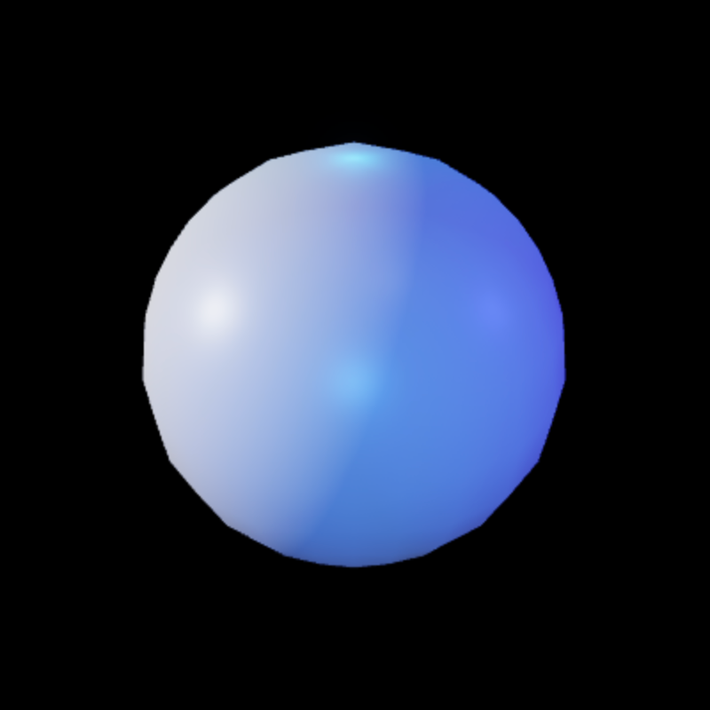
    <figcaption>기본 구형 파트</figcaption>
  </figure>
  <figure>
    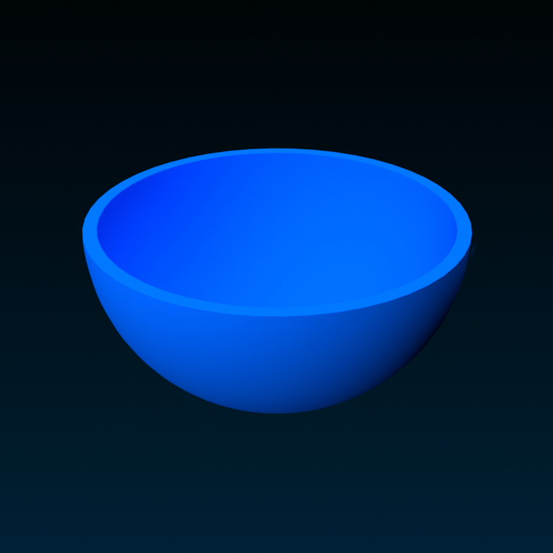
    <figcaption>솔리드 모델링으로 만든 그릇</figcaption>
  </figure>
  <figure>
    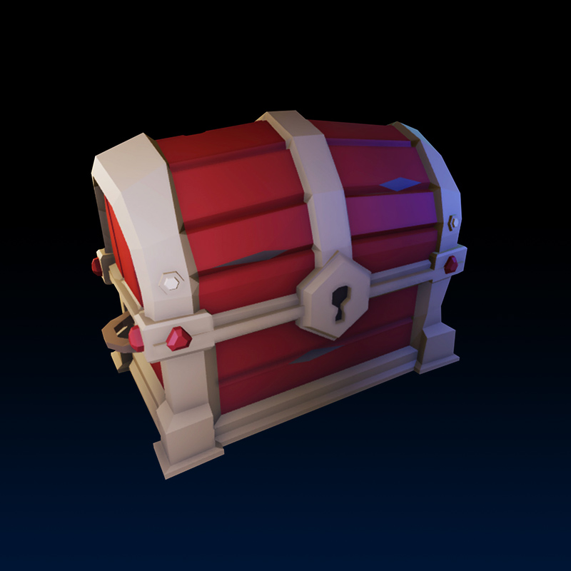
    <figcaption>텍스처가 있는 메쉬</figcaption>
  </figure>
</GridContainer>

기본적으로, 파트는 중력, 충돌 및 운동량과 같은 실제 물리적 메커니즘을 따르는 강체입니다. `WeldConstraint` 또는 `Motor6D`나 `Bone`과 같은 조인트를 사용하여 관련 파트를 단일 어셈블리로 연결할 수 있습니다. 어셈블리로 연결된 파트는 단일 강체로 작동하며, 공통의 위치, 방향 및 스케일을 참조합니다.

`Model` 컨테이너를 사용하여 관련 파트를 그룹화하고 Explorer에서 그룹을 단일 어셈블리로 액세스할 수 있습니다. 자세한 내용은 `모델`을 참조하세요.

## 기본 파트 유형

`Part` 객체는 블록, 구, 실린더, 쐐기 또는 코너 쐐기 모양을 가질 수 있습니다. 또한, `TrussPart`는 캐릭터가 사다리처럼 오를 수 있는 트러스 빔으로 작동합니다.

<table>
<thead>
<tr>
<th>
블록
</th>
<th>
구
</th>
<th>
실린더
</th>
<th>
쐐기
</th>
<th>
코너 쐐기
</th>
</tr>
</thead>
<tbody>
<tr>
<td>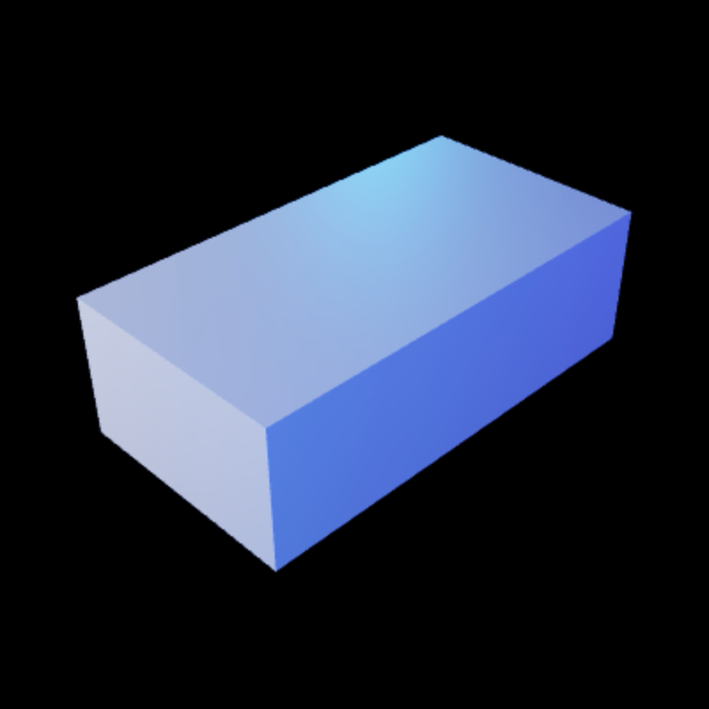</td>
<td></td>
<td>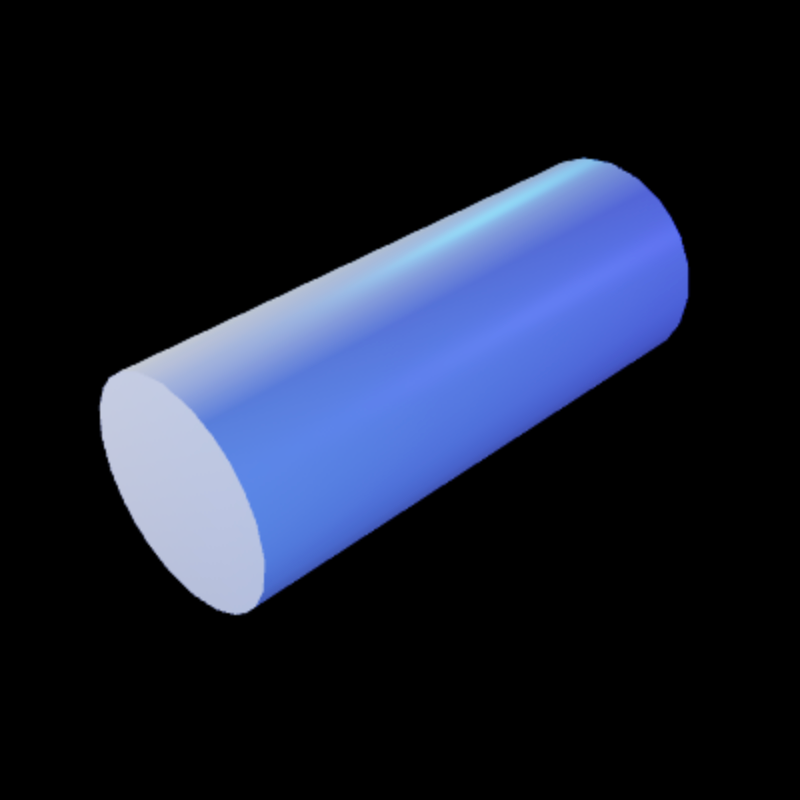</td>
<td>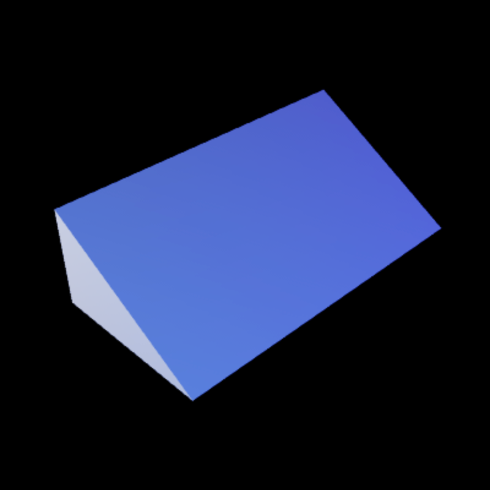</td>
<td>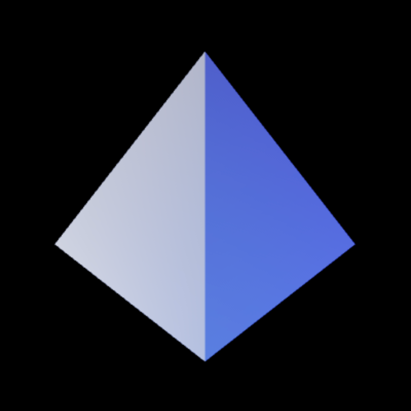</td>
</tr>
</tbody>
</table>

## 파트 속성

각 파트에는 속성 창을 통해 사용자 정의할 수 있는 다양한 속성이 있습니다.

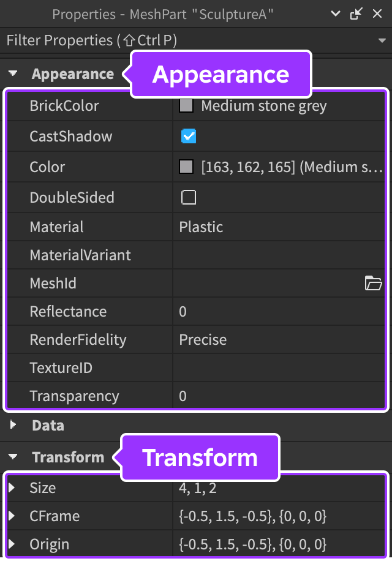

다음은 자주 사용되는 속성들입니다:

- `Anchored`는 물리가 파트의 위치에 영향을 미치는지 여부를 제어합니다. 이 속성이 true로 설정되면 파트는 중력이나 다른 힘으로 인해 위치가 변경되지 않습니다. 경험 내의 대부분의 파트를 고정해야 하며, 그렇지 않으면 중력과 물리가 경험이 시작되자마자 파트에 영향을 미쳐 장면 및 소품에 원치 않는 변경이 생길 수 있습니다.
- `CanCollide`는 파트가 다른 파트와 충돌할 수 있는지 여부를 제어합니다. 이 속성이 true로 설정되면 파트는 침투할 수 없으며 물리 엔진이 경험 내에서 이를 고려합니다. 반대로 이 속성이 false로 설정되면 파트는 모든 것을 통과할 수 있으며 물리 엔진이 이를 고려하지 않습니다.
- `Transparency`는 파트의 가시성을 기본값 0(완전히 가시적)에서 1(완전히 투명) 사이의 값으로 설정합니다. 부분적으로 투명한 파트가 많으면 성능이 저하될 수 있습니다. 이를 완화하기 위해, 이를 솔리드 모델링을 사용해 병합하십시오.

## 파트 삽입

**파트** 버튼은 워크스페이스에 새 파트를 삽입합니다. 버튼의 작은 드롭다운 화살표를 클릭하면 **블록**, **구**, **쐐기**, **코너 쐐기** 또는 **실린더**를 선택할 수 있습니다.

## 파트 선택

뷰포트에서 파트를 가리키면 선택 가능성을 나타내기 위해 윤곽이 표시됩니다. 윤곽이 있는 파트를 클릭하여 선택하거나, <kbd>Shift</kbd>, <kbd>Ctrl</kbd> 또는 <kbd>⌘</kbd>를 누른 상태에서 파트를 클릭하여 여러 파트를 선택할 수 있습니다.

3D 뷰포트에서 파트를 선택하는 고급 방법에 대해서는 [여기](https://create.roblox.com/docs/studio/ui-overview#selecting-objects)를 참조하십시오.

## 파트 조작

선택한 파트를 모델링 도구를 사용하거나 속성 창에서 새 위치, 크기 또는 방향을 설정하여 이동, 크기 조정 및 회전할 수 있습니다.

도구를 사용할 때는 **월드** 방향 또는 **로컬** 방향으로 파트를 이동, 크기 조정 또는 회전할 수 있으며, Windows에서는 <kbd>Ctrl</kbd><kbd>L</kbd> 키를, Mac에서는 <kbd>⌘</kbd><kbd>L</kbd> 키를 누르면 됩니다. 로컬 방향을 활성화하면 화살표 축 표시기가 파트의 로컬 방향으로 변경되며, **L** 표시기가 표시됩니다. 자세한 내용은 [객체 및 월드 공간](https://create.roblox.com/docs/workspace)을 참조하십시오.

<Tabs>
  <TabItem label="월드">
    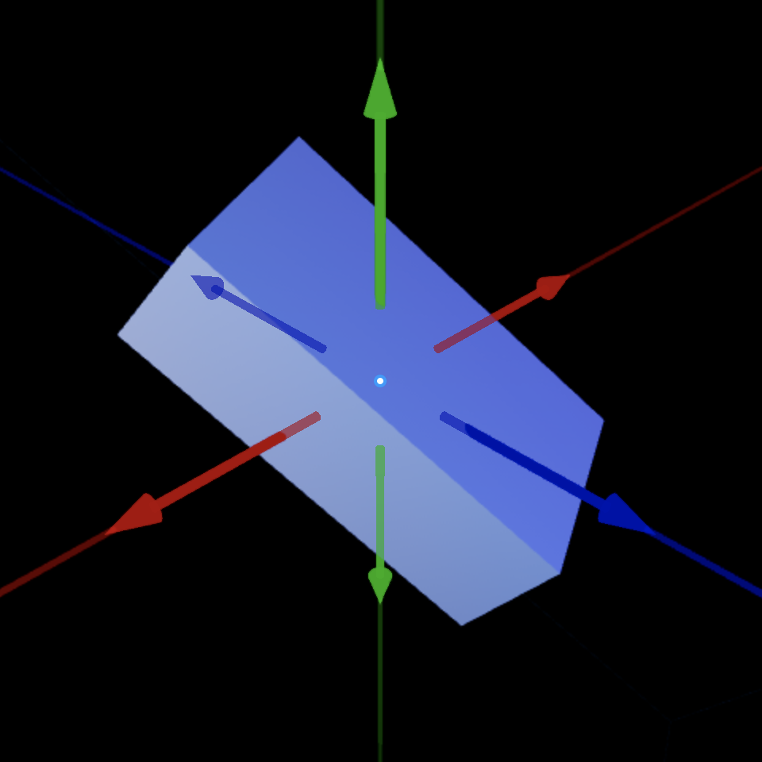
  </TabItem>
  <TabItem label="로컬">
    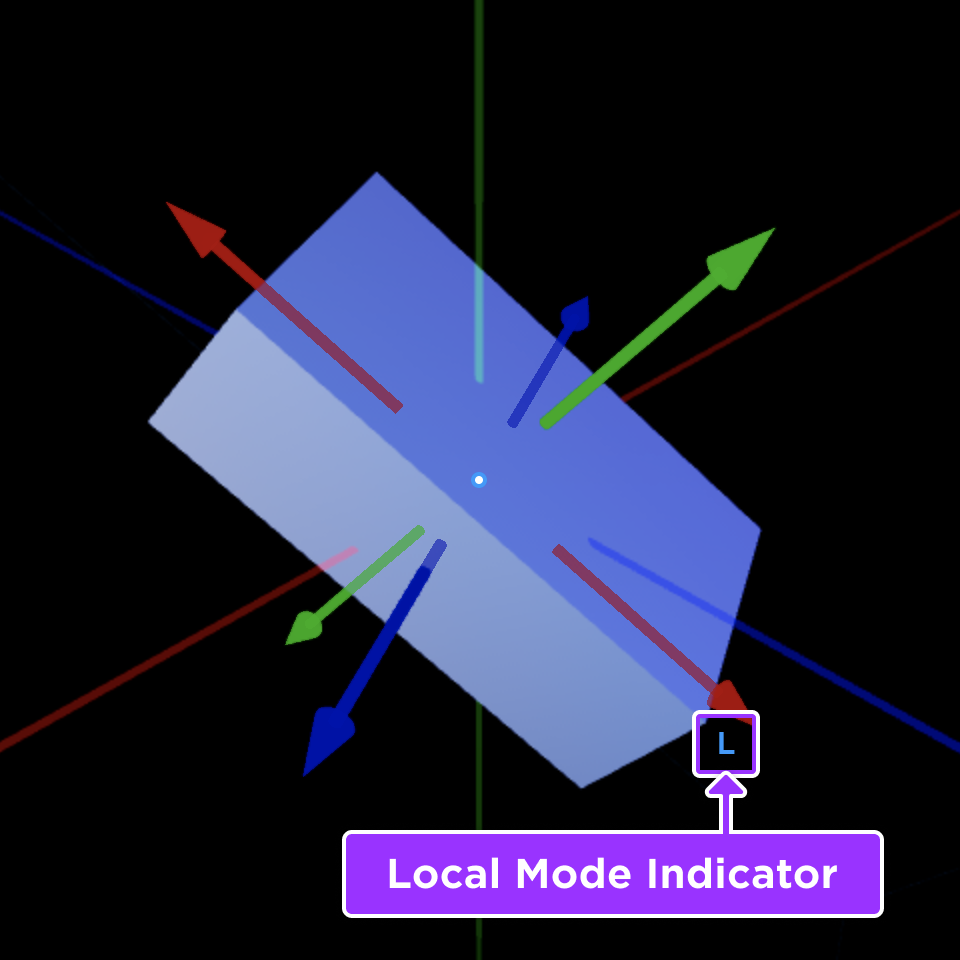
  </TabItem>
</Tabs>

### 파트 이동

파트는 **X**(빨간색), **Y**(녹색), **Z**(파란색) 축을 따라 이동합니다. **이동** 도구를 사용하여 파트를 새로운 위치로 이동할 수 있습니다.

1. **도구** 섹션에서 **이동** 도구를 선택한 다음, 이동할 파트를 선택합니다.

   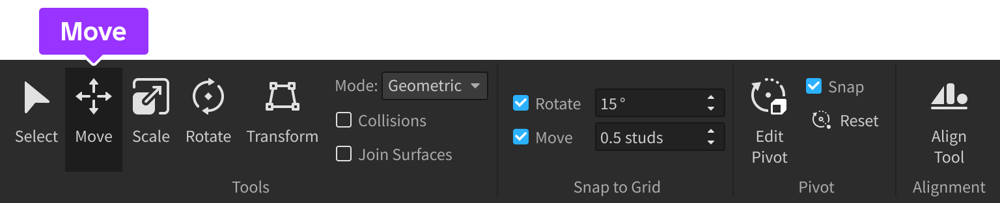

2. 원하는 방향으로 이동하려는 화살표를 클릭하고 드래그합니다.

   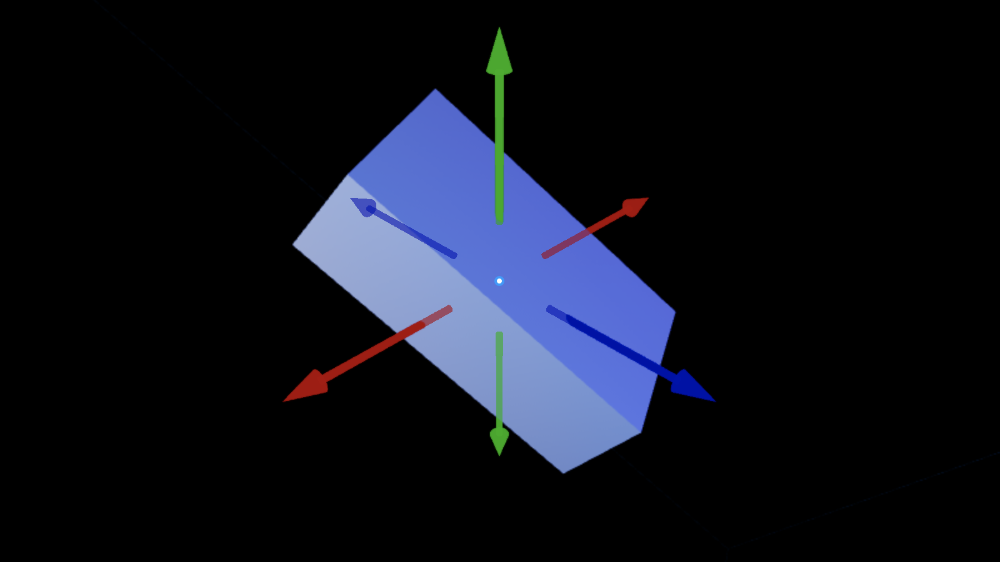

### 파트 크기 조정

파트는 **X**(빨간색), **Y**(녹색), **Z**(파란색) 축을 따라 크기를 조정합니다. **크기 조정** 도구를 사용하여 파트를

 더 크게 또는 더 작게 만들 수 있습니다.

1. **도구** 섹션에서 **크기 조정** 도구를 선택한 다음, 크기를 조정할 파트를 선택합니다.

   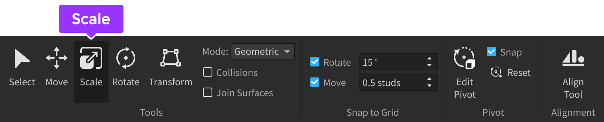

2. 원하는 방향으로 크기를 조정하려는 공을 클릭하고 드래그합니다.

   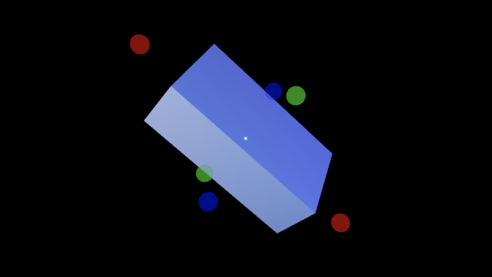

### 파트 회전

파트는 **X**(빨간색), **Y**(녹색), **Z**(파란색) 축을 따라 회전합니다. **회전** 도구를 사용하여 파트를 새로운 각도로 회전할 수 있습니다.

1. **도구** 섹션에서 **회전** 도구를 선택한 다음, 회전할 파트를 선택합니다.

   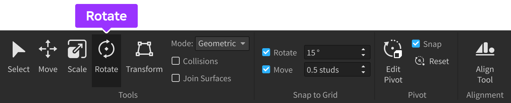

2. 원하는 방향으로 회전하려는 원을 클릭하고 드래그합니다.

   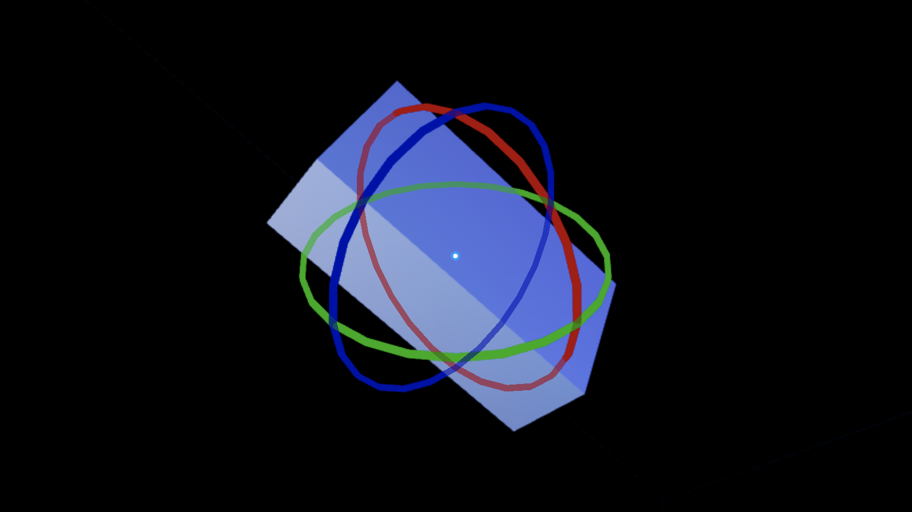

## 파트 색상 변경

파트는 기본적으로 회색이지만, 다음 방법을 통해 원하는 색상으로 변경할 수 있습니다.

### 육각형 지도

**색상** 위젯의 작은 드롭다운 화살표를 클릭하면 육각형 색상 선택기가 표시되며, 기본적으로 선택한 모든 파트에 선택한 색상이 적용됩니다. 색상을 선택한 후, 다른 파트에 빠르게 적용하려면 해당 파트를 선택하고 **색상** 버튼을 클릭합니다.

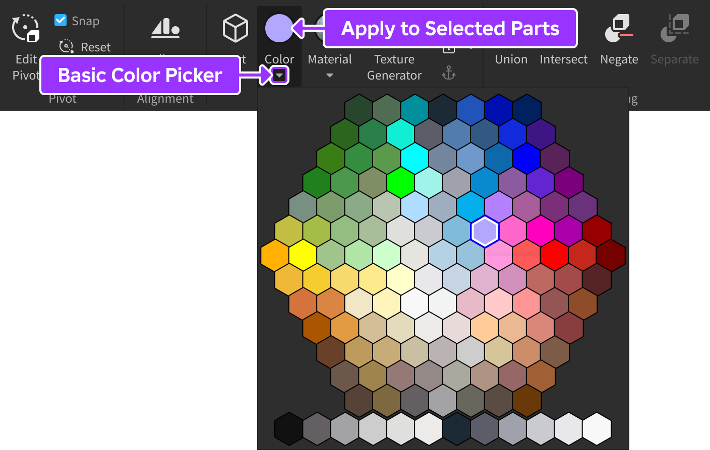

### 색상 팝업

**색상** 팝업을 통해 운영 체제의 색상 선택기 위젯을 사용하여 색상을 설정할 수 있습니다. 속성 창으로 이동하여 `Color` 속성의 왼쪽에 있는 작은 상자를 클릭합니다.

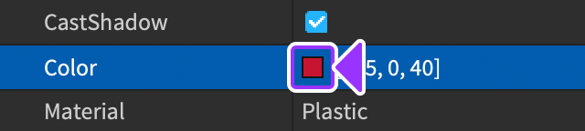

### RGB 값

파트에 특정 RGB 색상 값을 정의하려면 `Color` 속성 필드에 RGB 값을 입력합니다.

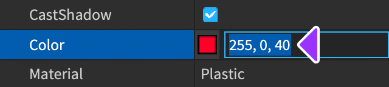

## 재료 적용

색상과 유사하게, 파트의 **재료**를 실제 재료(예: 나무, 유리, 직물 등)와 유사하게 사용자 정의할 수 있습니다. 재료를 선택할 때 다음 사항을 고려하십시오:

- **재료는 파트의 외관뿐만 아니라 물리적 특성에도 영향을 미칩니다**. 예를 들어, **콘크리트** 재료는 **플라스틱** 재료보다 무거워서 콘크리트 벽돌이 플라스틱 벽돌보다 밀도가 높아 물에 더 빨리 가라앉습니다.

- 일부 재료는 특수한 물리적 효과를 가지고 있습니다. 예를 들어, 파트가 **네온** 재료로 설정되면 빛나게 보입니다.

  <GridContainer numColumns="2">
    <figure>
      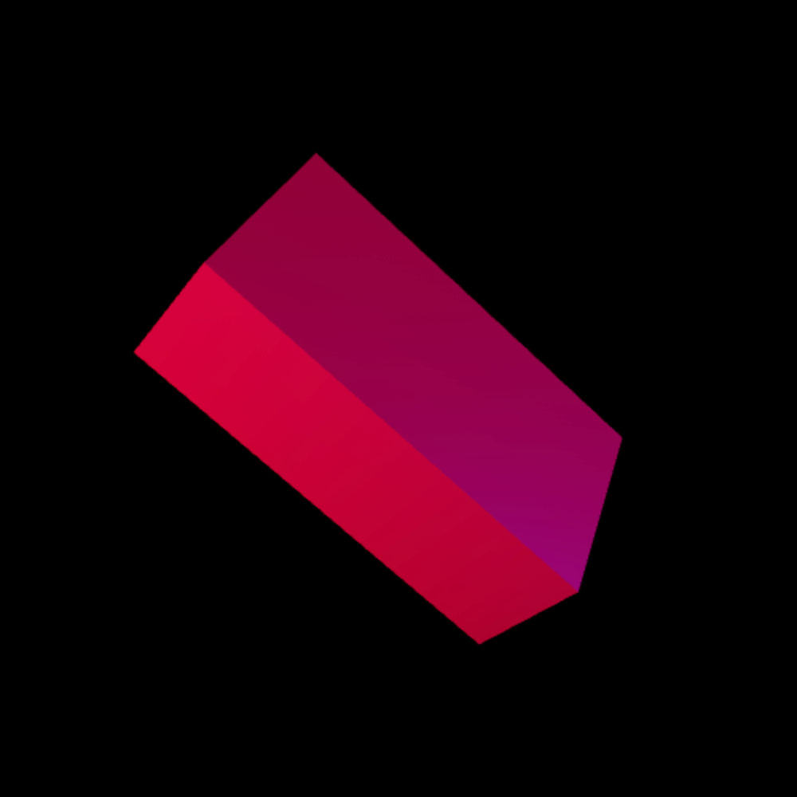
      <figcaption>SmoothPlastic</figcaption>
    </figure>
    <figure>
      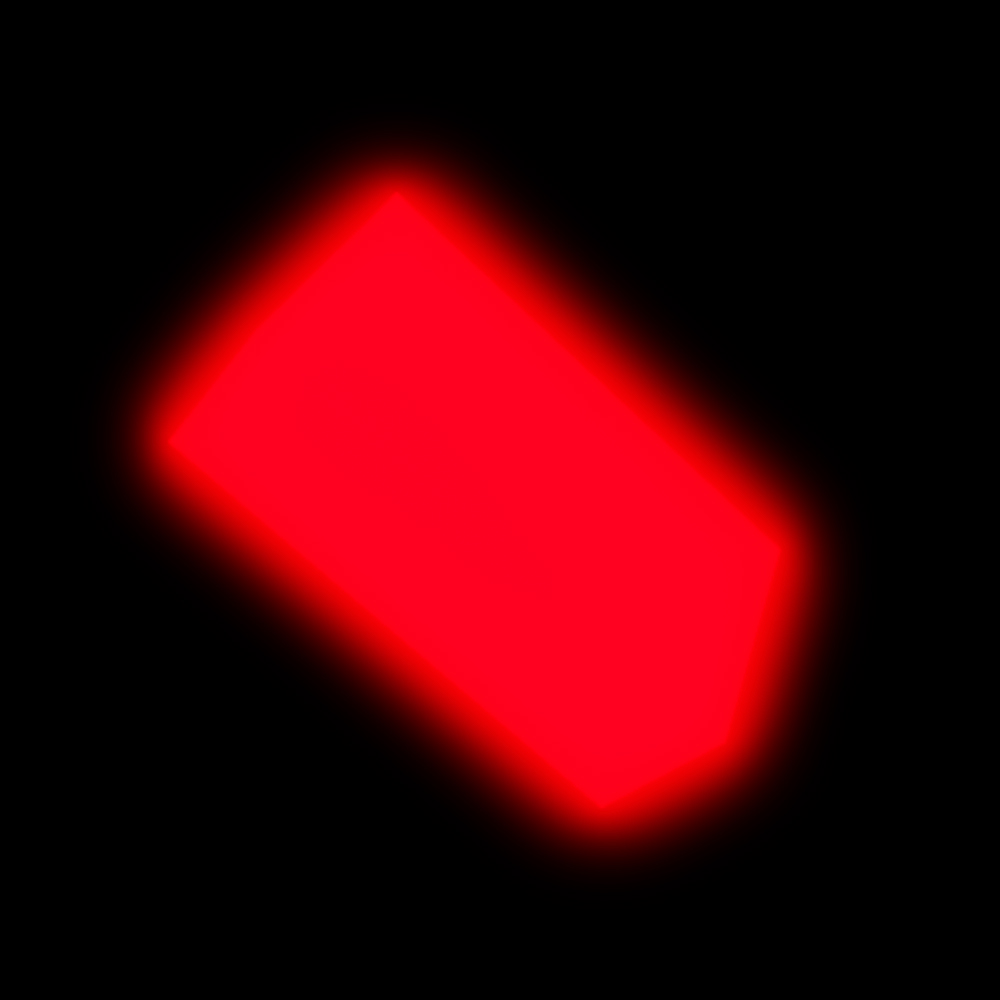
      <figcaption>Neon</figcaption>
    </figure>
  </GridContainer>

자세한 내용은 재료를 참조하여 기본 및 사용자 정의 재료를 파트에 적용하는 방법을 확인하십시오.

---
## 출처
 - [Parts](https://create.roblox.com/docs/parts)

---
## [다음](./03_02_Meshes.md)