# Meshes

## 목차
- [Meshes](#meshes)
  - [목차](#목차)
  - [메쉬 가져오기](#메쉬-가져오기)
  - [메쉬 사용자 정의](#메쉬-사용자-정의)
    - [텍스처](#텍스처)
    - [디테일 수준](#디테일-수준)
    - [충돌 충실도](#충돌-충실도)
  - [메쉬 리깅 및 스키닝](#메쉬-리깅-및-스키닝)
  - [출처](#출처)
  - [다음](#다음)

---

`MeshPart` 객체는 `BasePart` 클래스의 하위 클래스입니다. 이들은 3D 객체를 구성하는 정점, 모서리 및 면의 집합인 **메쉬**를 나타냅니다. Studio에서 직접 만들 수 있는 파트와 달리, 메쉬는 Blender나 Maya와 같은 타사 모델링 응용 프로그램을 사용하여 만들어야 하며, 이후 `MeshPart` 객체로 Studio에 가져와야 합니다.

메쉬를 Studio에 가져온 후에는 텍스처, 디테일 수준 및 충돌 충실도와 같은 렌더링 속성을 사용자 정의할 수 있습니다. 또한, 자신의 메쉬를 가져오는 것 외에도 크리에이터 스토어를 사용하여 사용자 업로드 메쉬를 검색하고 선택할 수 있습니다.

Roblox는 [일반 메쉬 사양](https://create.roblox.com/docs/art/modeling/specifications)을 준수하는 한 다양한 유형의 메쉬를 지원합니다. 기본 메쉬는 최소 하나의 메쉬 객체와 하나의 텍스처로 구성됩니다:

<GridContainer numColumns="3">
  <figure>
    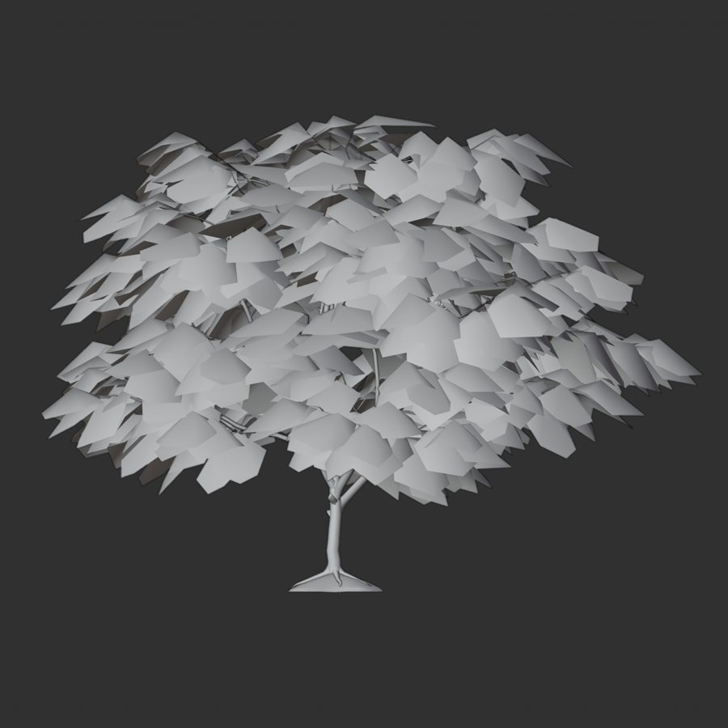
    <figcaption>메쉬 객체는 3D 객체의 모양과 기하학을 설정합니다</figcaption>
  </figure>
  <figure>
    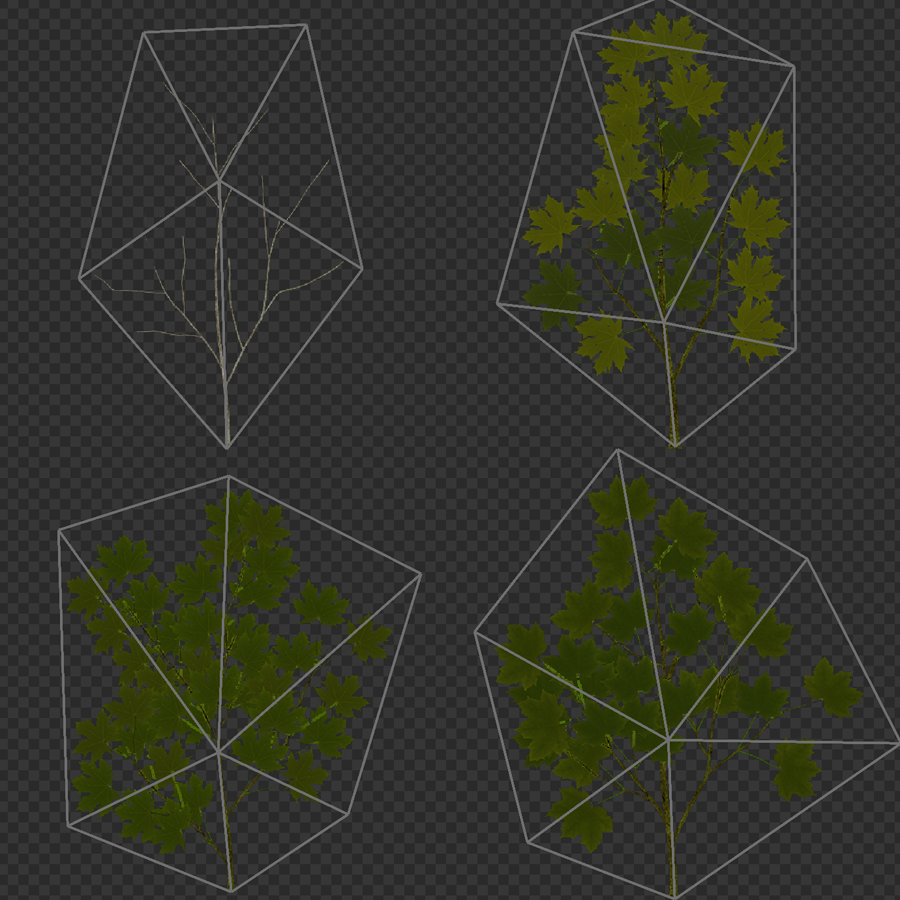
    <figcaption>텍스처 이미지 맵은 표면 외관과 색상을 적용합니다</figcaption>
  </figure>
  <figure>
    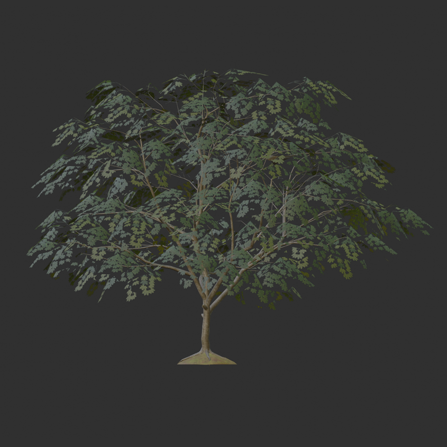
    <figcaption>메쉬와 텍스처가 결합되어 고유한 커스텀 3D 객체를 만듭니다</figcaption>
  </figure>
</GridContainer>

Studio는 또한 아바타 캐릭터 모델이나 액세서리, 예를 들어 리깅 및 스키닝 데이터와 같은 컴포넌트를 포함하는 메쉬도 지원합니다.

<Alert severity='info'>
`MeshPart` 자산을 아바타 몸체, 액세서리 및 의류로 마켓플레이스에서 판매할 수 있습니다. 자세한 내용은 아바타를 참조하십시오.
</Alert>

## 메쉬 가져오기

3D 임포터를 사용하여 Studio에 메쉬를 가져올 수 있습니다. 이 도구를 사용하면 메쉬를 워크스페이스 또는 도구 상자에 가져오기 전에 미리 보고 검사할 수 있으며, 텍스처, 리깅, 스키닝 및 애니메이션 데이터를 확인할 수 있습니다. 또한 문제를 표시하고 오류가 있는 메쉬를 거부합니다.

가져오는 메쉬 파일에 특정 명명 규칙을 사용하는 객체나 얼굴 애니메이션 데이터가 포함된 경우, 3D 임포터는 이를 자동으로 감지하여 다음 객체로 변환합니다:

- `Attachment`: 이름 끝에 `_Att`가 있는 객체.
- `WrapTarget`: 이름 끝에 `_OuterCage`가 있는 객체.
- `WrapLayer`: 이름 끝에 `_InnerCage` 및 `_OuterCage`가 있는 객체.
- `FaceControls`: 아바타 캐릭터 머리와 적절한 얼굴 애니메이션 데이터를 포함하는 객체.

이미지 및 오디오와 같은 3D가 아닌 자산과 함께 메쉬를 일괄 가져오려면 자산 관리자를 사용할 수 있습니다. 그러나 자산 관리자는 리깅, 스키닝, 애니메이션 데이터, 액세서리 또는 얼굴 애니메이션이 있는 캐릭터를 포함한 메쉬의 가져오기를 지원하지 않습니다.

## 메쉬 사용자 정의

기본 파트와 달리 메쉬는 고급 렌더링 충실도를 조정할 수 있는 더 많은 사용자 정의 옵션을 제공합니다.

### 텍스처

**텍스처**는 메쉬의 시각적 외관을 결정합니다. Studio는 `MeshPart.TextureID` 속성을 사용하여 하나의 텍스처를 적용하거나, 메쉬의 자식 객체인 `SurfaceAppearance` 또는 `MaterialVariant` 내에 최대 네 개의 물리 기반 렌더링(PBR) 텍스처를 적용할 수 있습니다. PBR 텍스처를 사용하면 단일 객체에 여러 유형의 텍스처 이미지 또는 맵을 사용하여 현실적인 음영 및 조명을 표현할 수 있습니다.

<Tabs>
<TabItem label="PBR 텍스처">
Studio는 객체의 표면 외관과 관련된 네 가지 PBR 텍스처 맵을 지원합니다. 여러 텍스처 맵을 결합하면 어떤 조명 환경에서도 색상, 거칠기 및 반사성을 보다 정확하게 시뮬레이션할 수 있으며, 자산 및 환경의 시각적 요소를 향상시킬 수 있습니다. PBR 텍스처 및 텍스처 맵에 대한 자세한 내용은 PBR 텍스처를 참조하십시오.

<GridContainer numColumns="2">
  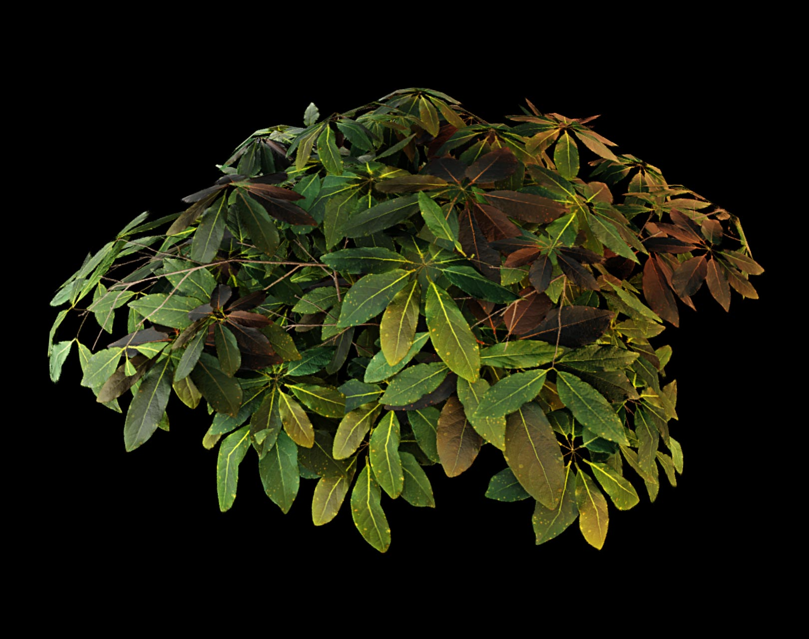
  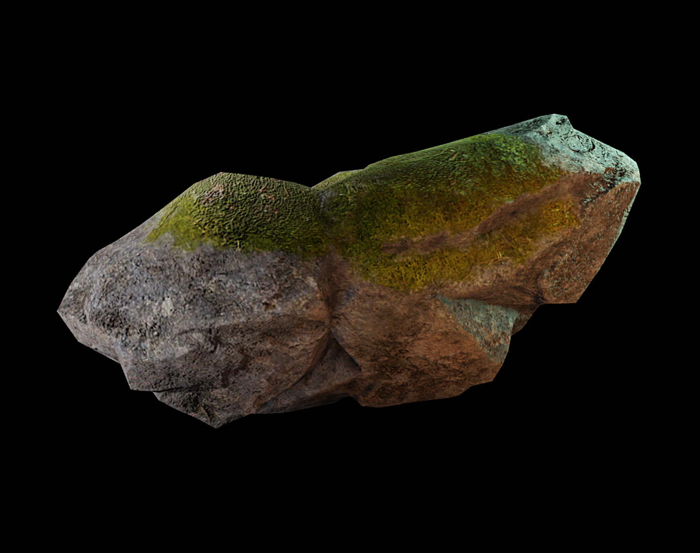
</GridContainer>

PBR 텍스처를 적용하려면 다음 객체 중 하나를 사용하십시오:

- `SurfaceAppearance`: PBR 텍스처를 메쉬 표면에 적용하고 기하학에는 영향을 미치지 않습니다.
- `MaterialVariant`: PBR 텍스처를 메쉬 표면에 적용할 뿐만 아니라 물리적 특성도 추가하는 사용자 정의 재료를 나타냅니다.

메쉬에 PBR 텍스처를 추가하려면:

1. **Explorer** 창에서 MeshPart 객체를 가리킵니다. **⊕** 버튼을 클릭하고 **SurfaceAppearance** 또는 **MaterialVariant**를 선택합니다.

2. **Properties** 창에서 PBR 텍스처 맵에 해당하는 속성을 편집합니다.

<Alert severity="info">
`SurfaceAppearance`와 `MaterialVariant`를 메쉬의 자식 객체로 모두 추가하면 Studio는 메쉬에 `SurfaceAppearance` 객체의 텍스처 맵 설정만 적용합니다. 메쉬는 여전히 `MaterialVariant` 객체의 다른 모든 설정, 예를 들어 사용자 정의 물리적 특성을 가집니다.
</Alert>

</TabItem>
<TabItem label="단일 텍스처">
Studio로 가져온 메쉬에 텍스처 데이터가 없거나 기존 텍스처를 변경하려면 다음 단계를 사용하여 단일 텍스처를 추가하십시오:

1. 자산 관리자에 텍스처 파일을 가져옵니다. 파일은 텍스처 사양을 따라야 합니다. 완료되면 Studio가 자동으로 자산 ID를 할당하고 표시합니다.
2. 자산 ID를 복사합니다.
3. **Explorer** 창에서 **MeshPart** 객체를 선택합니다.
4. **Properties** 창에서 **TextureID** 필드를 선택하고 텍스처의 자산 ID를 붙여넣습니다.

<Alert severity="warning">
    메쉬에 기존 PBR 텍스처가 있는 경우, 텍스처 ID 설정으로 PBR 텍스처를 덮어쓸 수 없습니다.
</Alert>

</TabItem>
</Tabs>

### 디테일 수준

**디테일 수준** 설정은 메쉬의 렌더링 충실도를 결정합니다. 기본적으로 메쉬는 카메라에서 얼마나 떨어져 있는지와 상관없이 항상 가장 정밀한 충실도로 표시되지만, `Enum.RenderFidelity` 속성을 사용하여 메쉬의 디테일 수준을 동적으로 제어할 수 있습니다.

많은 세부 메쉬가 있는 경우, 필요 없는 메쉬를 낮은 충실도로 설정하면 경험의 성능이 향상될 수 있습니다. 또는 모든 메쉬에 대해 속성을 **자동**으로 설정하여 카메라와의 거리 기반으로 디테일 수준을 렌더링할 수 있습니다:

<table>
<thead>
  <tr>
    <th>카메라와의 거리</th>
    <th>렌더링 충실도</th>
    <th>예시</th>
  </tr>
</thead>
<tbody>
  <tr>
    <td>250 스터드 미만</td>
    <td>최고</td>
    <td>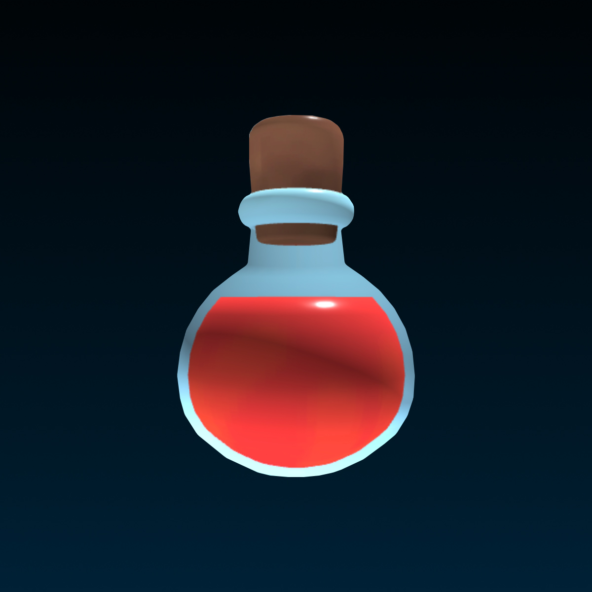</td>
  </tr>
  <tr>
    <td>250-500 스터드</td>
    <td>중간</td>
    <td>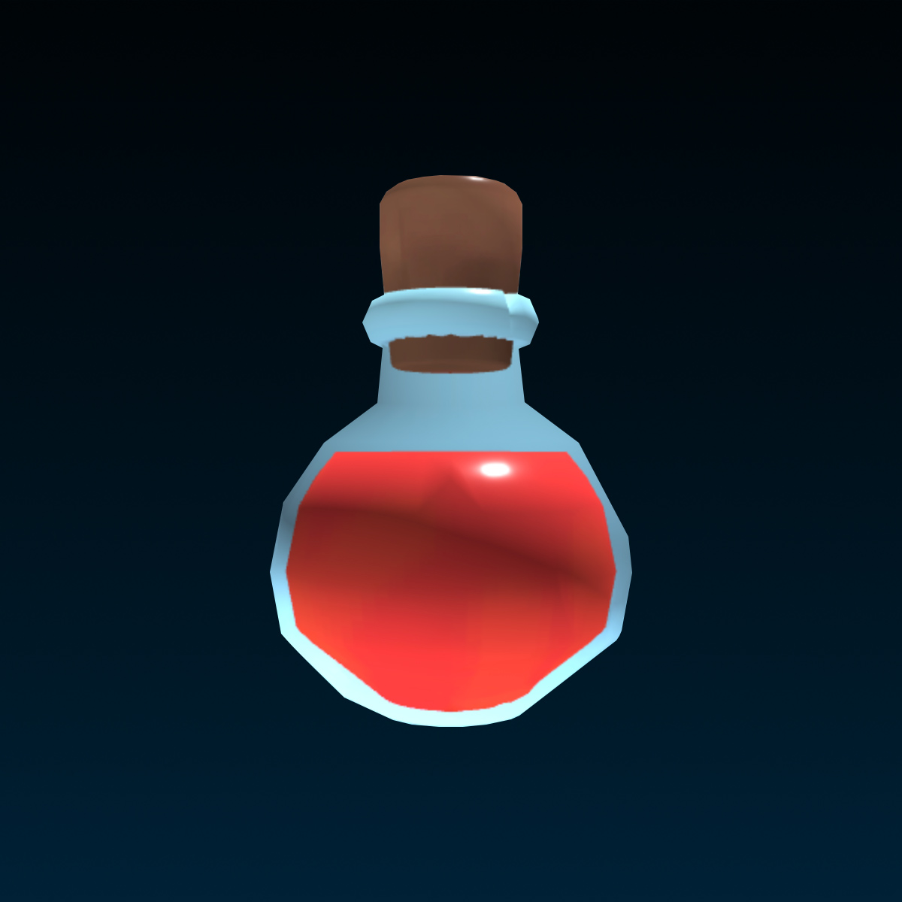</td>
  </tr>
  <tr>
    <td>500 스터드 이상</td>
    <td>최저</td>
    <td></td>
  </tr>
</tbody>
</table>

### 충돌 충실도

**충돌 충실도**는 메쉬의 시각적 표현이 물리적 경계와 얼마나 잘 일치하는지를 결정합니다. `MeshPart.CollisionFidelity` 속성은 다음과 같은 옵션을 제공하며, 낮은 충실도에서 높은 성능 영향을 기준으로 정렬되어 있습니다:

- **Box**: 바운딩 충돌 상자를 생성하여, 작은 객체나 비상호작용 객체에 적합합니다.
- **Hull**: 볼록 껍질을 생성하여, 덜 뚜렷한 함몰이나 구멍이 있는 객체에 적합합니다.
- **Default**: 복잡한 객체에 대한 반세밀한 상호작용 요구를 지원하는 대략적인 충돌 모양을 생성합니다.
- **PreciseConvexDecomposition**: 가장 정확한 충실도를 제공하지만 여전히 시각적 표현과 1:1로 일치하지는 않습니다. 이 옵션은 성능 비용이 가장 크며 엔진이 계산하는 데 더 많은 시간이 소요됩니다.

Studio에서 충돌 충실도를 시각화하려면 **파일** > **Studio 설정** > **Studio** > **시각화**로 이동한 다음 **분해 기하학 표시**를 활성화합니다.

<Tabs>
  <TabItem label="원본 메쉬">
    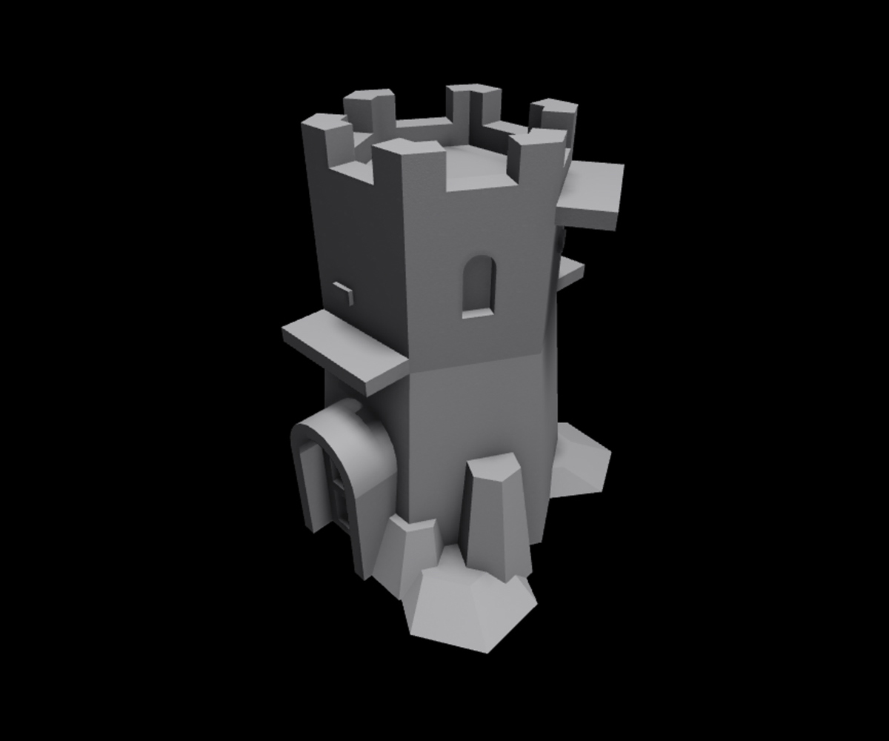
  </TabItem>
	<TabItem label="기본">
    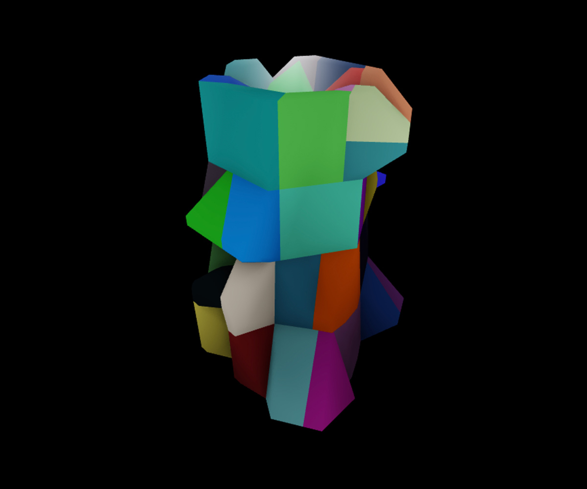
  </TabItem>
  <TabItem label="박스">
    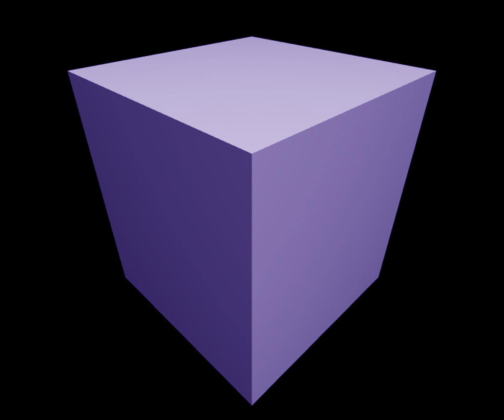
  </TabItem>
	<TabItem label="껍질">
    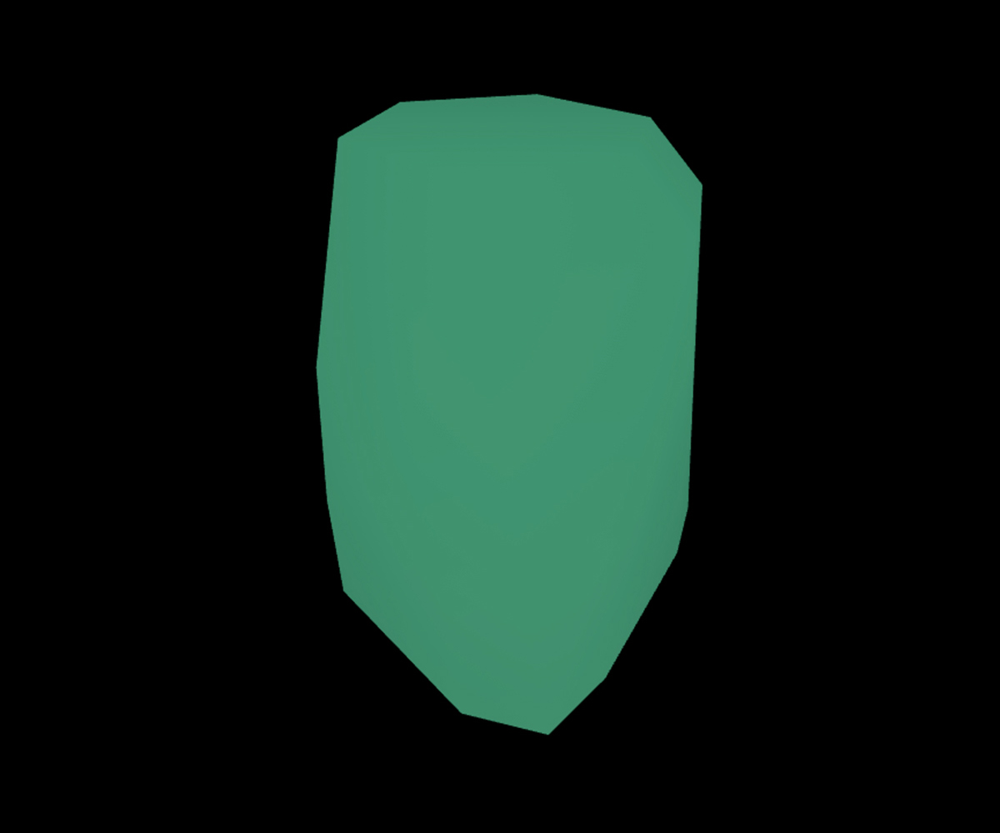
  </TabItem>
	<TabItem label="정밀">
    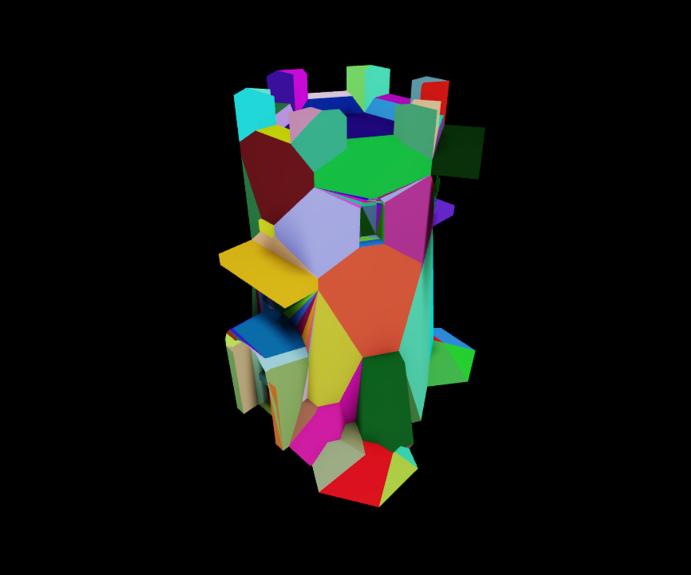
  </TabItem>
</Tabs>

충돌 충실도 옵션의 성능 영향과 이를 완화하는 방법에 대한 자세한 내용은 성능 최적화를 참조하십시오. 정밀도와 성능 요구 사항의 균형을 맞추는 충돌 충실도 옵션을 선택하는 방법에 대한 심층적인 안내는 물리 및 렌더링 매개 변수 설정을 참조하십시오.

## 메쉬 리깅 및 스키닝

**리깅**은 메쉬를 내부적으로 포즈 가능한 스켈레톤 리그와 연결하는 과정입니다. 리깅된 메쉬는 모델 내의 뼈를 사용하여 메쉬 표면을 회전하고 이동할 수 있습니다. 예를 들어 캐릭터의 무릎이나 팔꿈치와 같은 부분입니다. **스키닝**된 리깅 메쉬는 리깅된 메쉬 객체가 보다 현실적으로 변형, 스트레칭 및 구부러질 수 있도록 합니다.

<GridContainer numColumns="2">
  <figure>
    <video controls src="../img/03_02_Meshes/Head-Rigid-Example.mp4"></video>
    <figcaption>스키닝 없이 전체 머리 메쉬가 단일 축으로 회전합니다</figcaption>
  </figure>
  <figure>
    <video controls src="../img/03_02_Meshes/Head-Skinned-Example.mp4"></video>
    <figcaption>스키닝으로 인해 머리 메쉬가 목에서 자연스럽게 구부러지며 목의 아래 부분은 몸통에 연결된 상태를 유지합니다</figcaption>
  </figure>
</GridContainer>

리깅 및 스키닝에 대한 자세한 내용은 리깅 및 스키닝을 참조하십시오. 메쉬를 리깅한 후에는 애니메이션 에디터를 사용하여 애니메이션 및 포즈를 추가할 수 있습니다. 자세한 내용은 애니메이션 만들기를 참조하십시오. 아바타 의류 및 신체와 같은 마켓플레이스 3D 자산에도 리깅 및 스키닝이 필요합니다. 마켓플레이스 자산의 요구 사항에 대한 자세한 내용은 아바타를 참조하십시오.

---
## 출처
 - [Meshes](https://create.roblox.com/docs/parts/meshes)

---
## [다음](./03_03_Models.md)