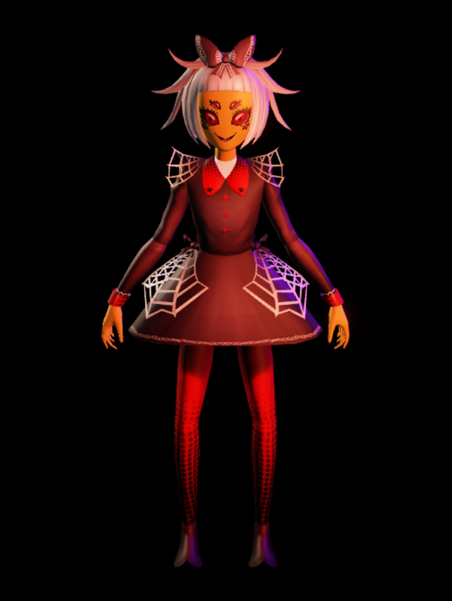
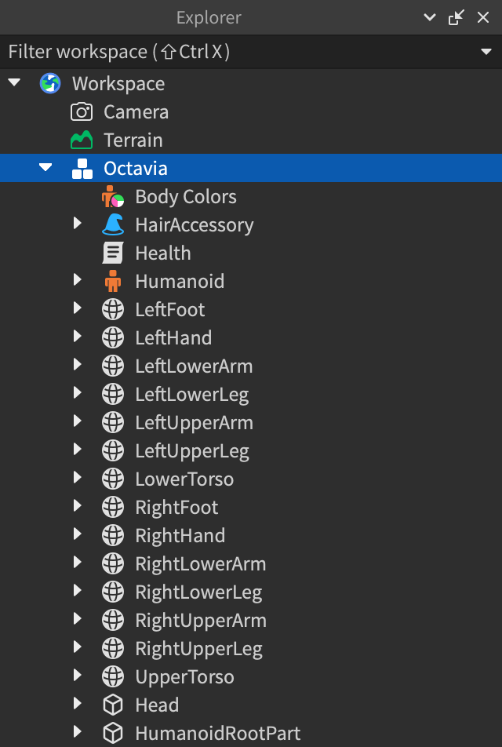
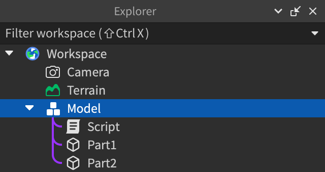
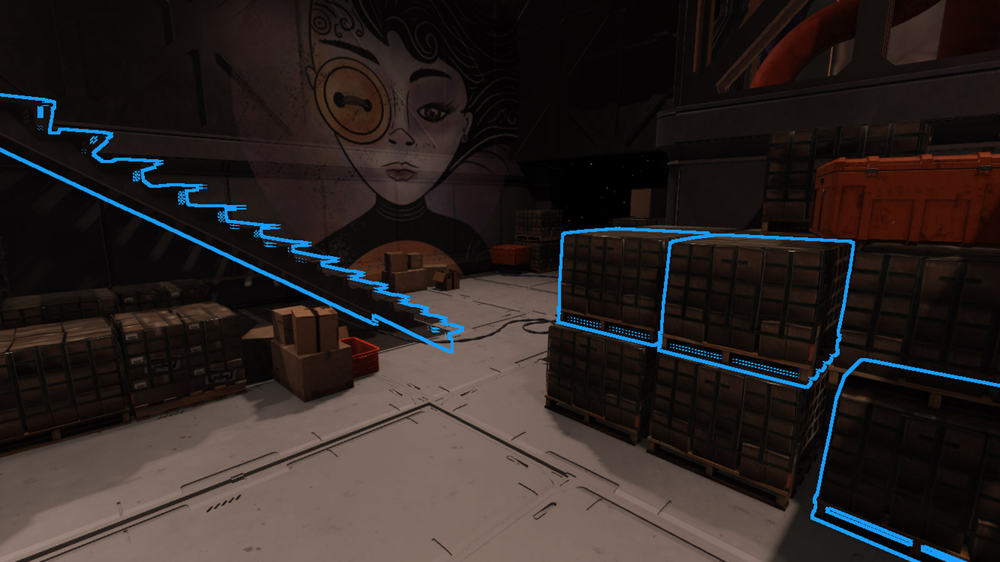
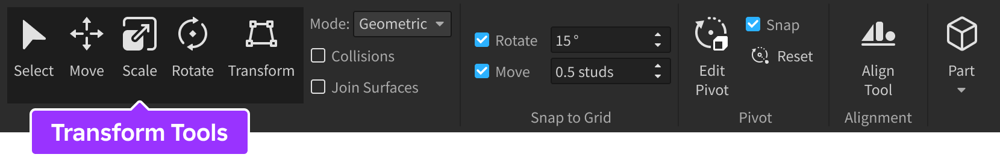
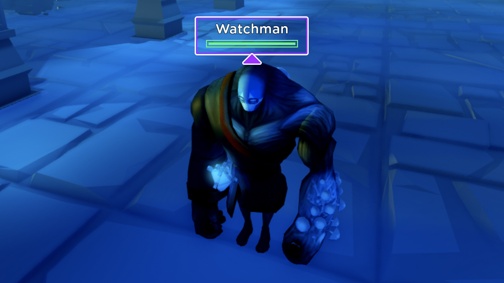

# Models

## 목차
- [Models](#models)
  - [목차](#목차)
  - [모델 만들기](#모델-만들기)
    - [기본 파트 설정](#기본-파트-설정)
  - [모델 선택](#모델-선택)
  - [모델 변환](#모델-변환)
  - [모델 동작](#모델-동작)
    - [캐릭터 모델](#캐릭터-모델)
    - [파괴 높이](#파괴-높이)
  - [모델 스트리밍](#모델-스트리밍)
  - [모델 업로드 및 배포](#모델-업로드-및-배포)
    - [3D 모델 파일](#3d-모델-파일)
    - [기존 Roblox 인스턴스](#기존-roblox-인스턴스)
  - [출처](#출처)
  - [다음](#다음)

---

**모델**은 파트, 용접, 조인트와 같은 물리적 객체를 포함하는 컨테이너로, 작업 공간을 정리하고 자산을 그룹화하는 데 사용할 수 있습니다. 모델은 연결된 파트(일명 어셈블리)를 종종 포함하지만, 스크립트와 첨부 파일과 같은 개별 파트와 기타 객체를 포함할 수 있습니다.

캐릭터(아바타 또는 NPC와 같은)는 적절한 인간형 파트, 조인트 및 추가 구성 요소를 포함하는 단일 `Model`입니다:

<GridContainer numColumns="2">
	<figure>
		
		<figcaption>Octavia라는 이름의 모델</figcaption>
	</figure>
	<figure>
    	
    	<figcaption>모델을 구성하는 그룹화</figcaption>
    </figure>
</GridContainer>

## 모델 만들기

객체를 **그룹화**하면 자동으로 `Model` 객체가 됩니다.

1. 3D 뷰포트 또는 Explorer 창에서 모델로 그룹화할 모든 객체를 선택합니다.
2. 객체 중 하나를 오른쪽 클릭하고 **그룹화**를 선택하거나 Windows에서 <kbd>Ctrl</kbd><kbd>G</kbd>를, Mac에서 <kbd>⌘</kbd><kbd>G</kbd>를 누릅니다. 모델을 구성하는 모든 객체가 중첩된 상태로 새로운 `Model` 객체가 표시됩니다.

   

<Alert severity="info">
모델을 원래 객체로 완전히 그룹 해제하려면, 모델을 오른쪽 클릭하고 **그룹 해제**를 선택하거나 Windows에서 <kbd>Ctrl</kbd><kbd>U</kbd>를, Mac에서 <kbd>⌘</kbd><kbd>U</kbd>를 누릅니다.
</Alert>

### 기본 파트 설정

`WeldConstraints` 또는 `Motor6Ds`와 같은 물리적 조인트를 통해 연결된 파트가 있는 모델이 있는 경우, 모델 내의 `BasePart`를 `PrimaryPart`로 지정해야 합니다. 모델의 `PrimaryPart`는 모델의 위치나 방향이 변경될 때 피벗 포인트와 바운딩 박스가 이동해야 하는 물리적 기준을 지정합니다.

기본 파트를 설정하려면:

1. Explorer 창에서 모델을 선택합니다.
2. Properties 창에서 **PrimaryPart** 속성을 선택합니다. 커서가 변경됩니다.
3. Explorer 창에서 기본 파트로 설정할 `BasePart`를 선택합니다.

## 모델 선택

뷰포트에서 모델을 가리키면 선택 가능성을 나타내기 위해 모델이 윤곽선으로 표시됩니다. 윤곽선이 표시된 모델을 클릭하여 선택할 수 있으며, <kbd>Shift</kbd>, <kbd>Ctrl</kbd> 또는 <kbd>⌘</kbd>를 누르고 클릭하여 여러 모델을 선택할 수도 있습니다.

모델에는 일반적으로 여러 자식 파트 또는 메쉬가 포함되어 있어 일부 자식이 보이지 않을 수 있습니다. 카메라를 이동하지 않고 특정 자식을 선택하려면 Windows에서는 <kbd>Alt</kbd> 키를, Mac에서는 <kbd>⌥</kbd> 키를 누르고 클릭하여 선택 순환을 수행합니다.

<figure>
  <video src="../img/03_03_Models/Selection-Cycling.mp4" controls width="80%" alt="모델을 통해 선택 순환을 보여주는 비디오"></video>
  <figcaption>선택 순환</figcaption>
</figure>

## 모델 변환

홈 및 모델 탭 내에서 Studio 변환 도구를 사용하여 모델을 이동, 확장 또는 회전할 수 있습니다. 기본 파트를 설정하지 않은 경우 모델은 바운딩 박스의 중심을 기준으로 변환됩니다.

또한, `Script` 또는 `LocalScript` 내에서 다음 방법을 통해 모델을 이동하거나 회전할 수 있습니다:

<table>
<thead>
  <tr>
    <th>방법</th>
    <th>설명</th>
  </tr>
</thead>
<tbody>
  <tr>
    <td>`MoveTo()`</td>
	<td>모델의 `Model.PrimaryPart|PrimaryPart`를 지정된 위치로 이동합니다. 기본 파트를 지정하지 않은 경우 모델의 루트 파트가 사용됩니다.</td>
  </tr>
  <tr>
    <td>`PivotTo()`</td>
	<td>모델과 모든 하위 `PVInstance|PVInstances`를 지정된 `Datatype.CFrame`에 피벗이 위치하도록 변환합니다.</td>
  </tr>
  <tr>
    <td>`TranslateBy()`</td>
	<td>지정된 `Datatype.Vector3` 오프셋만큼 모델을 이동하여 모델의 방향을 유지합니다.</td>
  </tr>
</tbody>
</table>

## 모델 동작

모델은 대부분의 용도에서 `Folder` 객체와 유사하게 동작하지만, 몇 가지 고유한 동작도 있습니다.

### 캐릭터 모델

모델 내에 `Humanoid`가 포함되고 `Head`라는 이름의 `Part`가 포함되어 있으면 Roblox는 해당 파트 위에 이름 및/또는 체력 바를 표시합니다. 자세한 내용은 `캐릭터 이름/체력 표시`를 참조하십시오.

### 파괴 높이

경험의 맵에서 떨어진 파트가 계속해서 떨어지는 것을 방지하기 위해 Studio는 `Workspace.FallenPartsDestroyHeight` 값 아래로 떨어지는 파트를 자동으로 파괴합니다. 이 동작으로 인해 파괴된 파트가 모델의 마지막 파트인 경우 해당 모델도 파괴됩니다.

## 모델 스트리밍

인스턴스 스트리밍은 플레이어의 캐릭터가 3D 세계를 탐험할 때 플레이어 장치에서 `Models`를 동적으로 로드하고 언로드합니다. 스트리밍이 활성화된 경우, 각 모델이 스트리밍 동작에서 어떻게 처리되어야 하는지 지정할 수 있습니다. 예를 들어, Persistent로 설정된 모델은 결코 스트림 아웃되지 않으며, Atomic으로 설정된 모델은 모든 하위 객체와 함께 단일 단위로 스트림 인 및 아웃됩니다.

스트리밍이 활성화된 경험에서는 클라이언트에 존재하는 3D 콘텐츠가 동적으로 변경되므로 모델이 갑자기 사라질 수 있습니다. 이를 완화하기 위해 특정 모델을 스트림 아웃될 때 더 낮은 해상도의 "임포스터" 메쉬로 렌더링하도록 설정할 수 있습니다. 자세한 내용은 모델 디테일 수준을 참조하십시오.

모델 수준의 스트리밍 제어에 대한 자세한 내용은 모델 스트리밍 제어를 참조하십시오.

## 모델 업로드 및 배포

모델을 크리에이터 스토어에 배포하여 다른 크리에이터가 자신의 경험에서 사용할 수 있도록 할 수 있습니다. 모든 자산과 마찬가지로 모든 모델은 [커뮤니티 규칙](https://en.help.roblox.com/hc/articles/203313410), [이용 약관](https://en.help.roblox.com/hc/articles/115004647846), 저작권 및 크리에이터 스토어 [자산 심사](production/creator-store.md#asset-moderation) 규칙에 관한 DMCA 지침을 준수해야 합니다.

<Alert severity="info">
곧 크리에이터 스토어에서 모델을 **미국 달러**(USD)로 판매할 수 있습니다. 자세한 내용 및 온보딩 시작에 대한 정보는 크리에이터 스토어에서 판매하기를 참조하십시오.
</Alert>

### 3D 모델 파일

Roblox Studio에 `.gltf`, `.fbx`, `.obj` 모델 파일을 가져올 수 있습니다. 자세한 내용은 Studio의 3D 임포터 사용을 참조하십시오. 크리에이터 스토어용 콘텐츠를 생성하려면 다음을 권장합니다:

- Roblox [텍스처 사양 및 한계](https://create.roblox.com/docs/art/modeling/texture-specifications)에 대해 읽어보세요.
- 각 메쉬를 최대 20,000 삼각형으로 제한합니다.
- 가져오기 과정에서 표시되는 경고를 읽고 해결합니다.
- 가져오는 동안 모델을 적절하게 스케일 및 방향을 조정하여 크리에이터 스토어에서 삽입할 때 바로 사용할 수 있도록 합니다.

### 기존 Roblox 인스턴스

Explorer 창에서 기존 Studio에서 생성된 `Model` 인스턴스를 [여기](https://create.roblox.com/docs/production/creator-store#through-studio)에 설명된 대로 업로드할 수 있습니다.

---
## 출처
 - [Models](https://create.roblox.com/docs/parts/models)

---
## [다음](./03_04_Materials.md)