# Materials

## 목차
- [Materials](#materials)
  - [목차](#목차)
  - [재료 적용](#재료-적용)
    - [Material Widget](#material-widget)
    - [Material Manager](#material-manager)
  - [사용자 지정 재료](#사용자-지정-재료)
    - [사용자 지정 재료 생성](#사용자-지정-재료-생성)
    - [사용자 지정 재료 적용](#사용자-지정-재료-적용)
    - [재료 재정의](#재료-재정의)
      - [재정의 설정](#재정의-설정)
      - [지형 세부 정보](#지형-세부-정보)
      - [재정의 비활성화](#재정의-비활성화)
  - [물리적 속성](#물리적-속성)
  - [적응형 재료](#적응형-재료)
  - [출처](#출처)
  - [다음](#다음)

---

Roblox의 재료는 다른 플랫폼의 재료와는 달리 시각적 외형 **및** 물리적 속성이 실제 세계의 재료와 유사합니다. 예를 들어, 콘크리트는 플라스틱보다 무겁고 물에 더 빨리 가라앉습니다. 파트 또는 지형의 재료를 설정하면, Roblox는 이러한 물리적 재료 속성을 시뮬레이션하여 이 동작이 자연스럽게 작동하도록 합니다.

Roblox 엔진은 다양한 경험을 구축하는 데 적합한 다양한 기본 재료를 제공합니다. 여기에는 다양한 금속, 암석, 유기 재료가 포함됩니다.

또한 사용자 지정 재료를 만들어 파트 또는 지형에 적용할 수 있습니다. 사용자 지정 재료는 적응형 재료 기능을 추가로 제공하여, 다른 사람이 만든 모델이라도 사용자의 아트 스타일과 사용자 지정 재료를 사용하도록 모델을 적응시킬 수 있습니다.

## 재료 적용

Material 위젯을 통해 파트에 재료를 빠르게 적용할 수 있습니다. Material Manager는 동일한 기능을 제공하며 추가로 "페인트 도구" 적용 모드를 제공합니다.

### Material Widget

**Material** 위젯은 Home 또는 Model 탭에서 액세스할 수 있습니다.

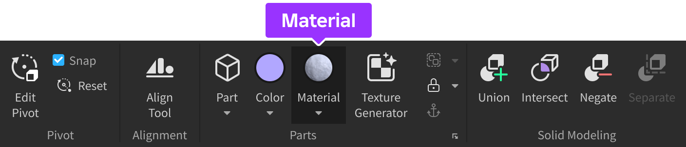

작은 드롭다운 화살표를 클릭하면 재료 선택기가 나타나며, 기본적으로 선택된 모든 파트에 선택한 재료를 적용합니다. 재료를 선택한 후, 다른 파트를 선택하고 **Material** 버튼을 클릭하여 빠르게 적용할 수 있습니다.

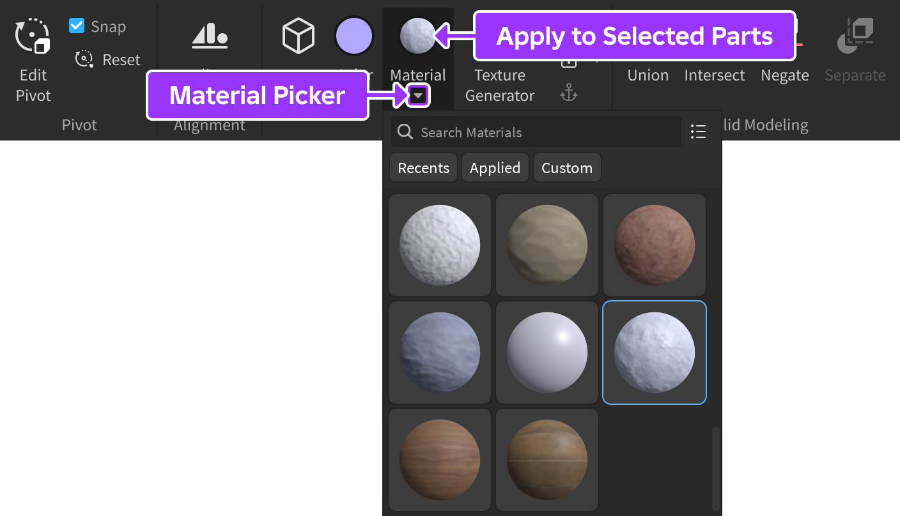

### Material Manager

Material Picker 베타를 활성화한 경우, 선택기 창에서 **Material Manager**에 액세스할 수 있습니다. 베타를 활성화하지 않은 경우, Home 또는 Model 탭에서 **Color** 버튼 왼쪽에 있는 전용 버튼을 찾습니다.

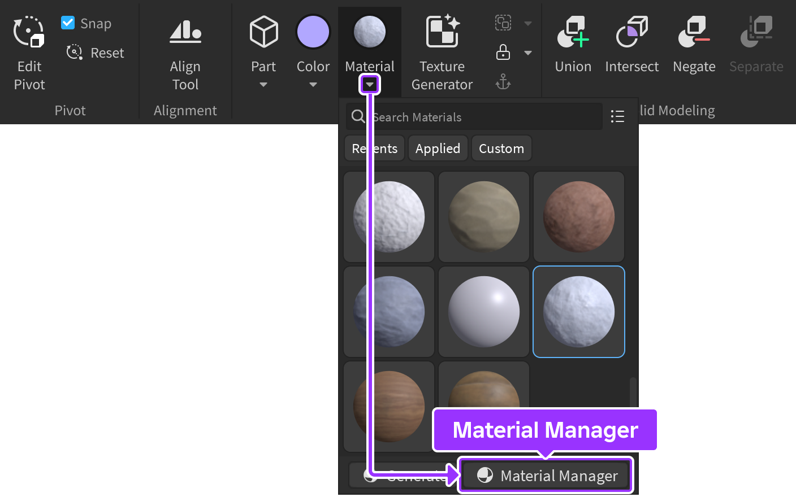

관리자 창에서 다음 워크플로를 통해 파트에 재료를 적용할 수 있습니다.

<Tabs>
<TabItem label="선택한 항목에 적용">
새로운 `Part` 인스턴스의 기본 `Material` 속성은 Plastic입니다. 다른 재료를 파트에 적용하려면:

1. 3D 뷰포트 또는 Explorer에서 하나 이상의 파트를 선택합니다.
2. **Material Manager** 팔레트에서 원하는 재료 위에 마우스를 올리고 **Apply to Selected Parts** 버튼을 클릭합니다.

   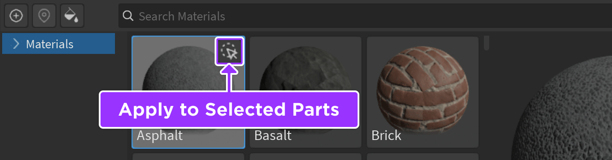

</TabItem>
<TabItem label="페인트 도구">
재료를 페인트 도구로 사용하여 파트에 적용할 수도 있습니다:

1. **Material Manager**에서 적용할 재료를 선택합니다.
2. 왼쪽 상단에서 **Paint Parts With Selected Material** 버튼을 클릭하여 재료를 페인트 도구로 활성화합니다.

   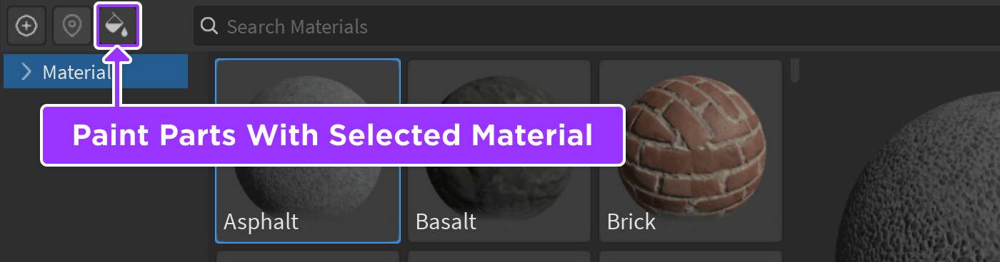

3. 3D 뷰포트에서 재료를 적용할 파트 위에 마우스를 올리고 클릭합니다.
4. 페인팅을 완료하면 버튼을 다시 클릭하여 도구를 비활성화합니다.

</TabItem>
</Tabs>

## 사용자 지정 재료

Material Manager는 `MaterialService`의 다양한 측면과 상호 작용하는 사용자 인터페이스를 제공하여 새로운 사용자 지정 재료를 생성하고 이를 파트 및 지형에 적용할 수 있습니다. 사용자 지정 재료는 `MaterialService` 내의 `MaterialVariant` 인스턴스로 표현됩니다.

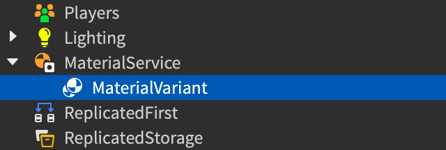

사용자 지정 재료를 파트별로 또는 지형과 함께 전역적으로 적용할 수 있으며, `TerrainDetail` 인스턴스를 사용하여 지형의 면에 사용자 지정 재료를 세밀하게 적용할 수 있습니다.

<Alert severity="info">
`MaterialVariant`와 `SurfaceAppearance` 인스턴스는 모두 PBR 텍스처를 사용하여 객체의 외형을 사용자 지정합니다. 차이점은 `MaterialVariant`는 재사용 가능한 타일 형식의 재료의 외형을 사용자 지정하는 데 사용되고, `SurfaceAppearance`는 UV 매핑을 통해 특정 메쉬의 시각적 외형을 사용자 지정하는 데 사용됩니다. `MaterialVariant` 인스턴스는 또한 `SurfaceAppearance` 인스턴스가 가지지 않은 물리적 속성을 가지고 있습니다.
</Alert>

### 사용자 지정 재료 생성

Material Manager 또는 `MaterialVariant` 인스턴스의 속성을 통해 사용자 지정 재료의 모든 속성을 편집할 수 있습니다. 또한 프롬프트 기반 Material Generator를 통해 사용자 지정 재료를 생성할 수 있습니다.

Material Manager에서 사용자 지정 재료를 생성하려면:

1. 사용자 지정 재료가 물리적 속성을 상속받을 **기본 재료**를 클릭합니다. 이 단계를 건너뛰면 기본 재료는 **Plastic**이지만 나중에 변경할 수 있습니다.

   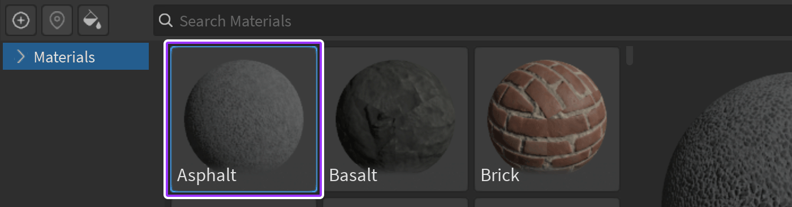

2. 왼쪽 상단에서 **Create Material Variant**를 클릭합니다.

   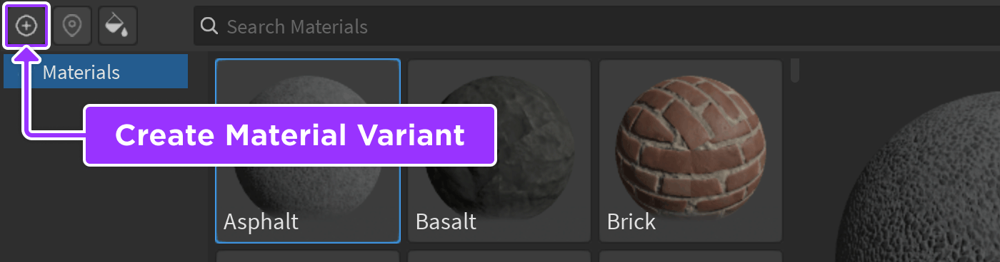

   팔레트에 사용자 지정 재료 아이콘이 있는 새로운 변형이 나타납니다.

   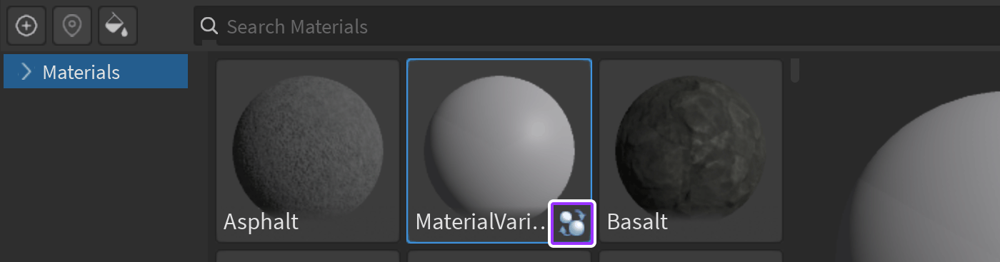

3. 인스펙터에서 사용자 지정 재료의 목적을 설명하는 이름으로 이름을 변경합니다. 나중에 이름을 변경할 수 있지만, 재료를 파트에 적용한 후 이름을 변경하면 해당 파트에 재료를 다시 적용해야 합니다.
4. **Color** 또는 **Normal**과 같은 각 **텍스처 맵** 옵션에 대해 자산&nbsp;ID를 붙여넣거나 컴퓨터에서 새로운 텍스처를 가져옵니다. 사각형 텍스처가 가장 적합합니다. 텍스처 맵에 자산을 지정하지 않으면 해당 텍스처는 비어 있습니다.
5. 필요한 경우, 재료의 외형을 변경하기 위해 **Studs Per Tile** 및 **Pattern** 값을 조정합니다.

<Alert severity="info">
필요한 경우, Material Manager에서 사용자 지정 재료를 선택하고 미리보기 글로브 아래의 **Delete** 버튼을 클릭하여 삭제할 수 있습니다. 또는 Explorer에서 **MaterialService** 내의 관련 `MaterialVariant` 인스턴스를 삭제할 수 있습니다.
</Alert>

### 사용자 지정 재료 적용

파트에 사용자 지정 재료를 적용하는 방법은 다른 재료와 동일합니다. Material 위젯 또는 Material Manager를 통해 선택한 파트에 적용할 수 있습니다.&sup1;

파트에 새로운 재료를 적용하려면 Properties 창에서 **MaterialVariant** 속성을 설정합니다. 이 경우 Studio는 사용자가 재료를 생성할 때 선택한 기본 재료로 **Material** 속성을 자동으로 설정합니다.

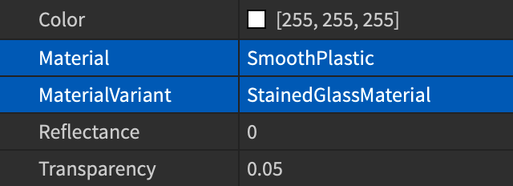

<Alert severity="warning">
재료 이름을 **재설정한 후** 재료를 파트에 다시 적용하지 않으면, 파트가 자동으로 새로운 이름의 사용자 지정 재료를 사용하지 않습니다. 이 동작은 적응형 재료 기능을 허용합니다. 파트가 사용자 지정 재료를 계속 사용하도록 하려면 재료를 다시 적용해야 합니다.
</Alert>

<figcaption>&sup1; 파트와는 달리, 지형에는 사용자 지정 재료를 **직접** 적용할 수 없습니다. 그러나 재료 재정의로 사용자 지정 재료를 기존 기본 재료에 설정하여 모든 지형에 적용할 수 있습니다.</figcaption>

### 재료 재정의

기본 재료를 참조하는 사용자 지정 재료를 **재료 재정의**로 설정할 수 있습니다. 이렇게 하면 Studio는 파트 또는 지형에서 해당 재료를 사용할 때 사용자 지정 재료의 텍스처 및 물리적 속성을 사용합니다.

<Alert severity="info">
재료 재정의는 사용자 지정 재료를 지형에 적용하는 유일한 방법입니다. 또한 지형의 재료는 장소당 전역이므로 한 장소에서 동일한 기본 재료의 여러 변형을 지형에 적용할 수 없습니다.
</Alert>

#### 재정의 설정

Material Manager에서 재료 재정의를 설정하려면:

1. 재정의로 설정할 사용자 지정 재료를 클릭합니다.
2. 인스펙터에서 **Overrides**로 스크롤하여 **Set as Override**를 활성화합니다.

   

   새로운 재정의가 Properties 창의 **MaterialService** 속성으로 표시됩니다.

   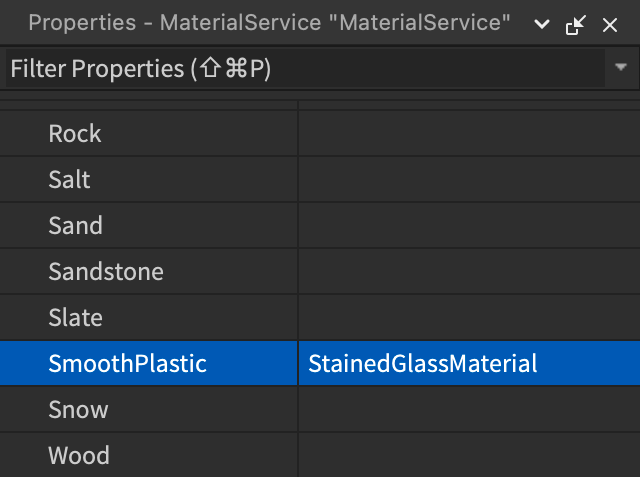

#### 지형 세부 정보

기본적으로 사용자 지정 재료를 파트 또는 재정의로 적용하면 해당 사용자 지정 재료가 각 면에 타일 형식으로 적용됩니다. 지형의 경우, `TerrainDetail` 인스턴스를 구성하여 사용자 지정 재료를 사용하는 지형 복셀의 **상단**, **측면**, **하단**을 사용자 지정할 수 있습니다.

사용자 지정 재료를 사용하여 지형의 면을 사용자 지정하려면:

1. Material Manager의 팔레트에서 사용자 지정 재료를 클릭합니다.
2. 인스펙터에서 **Set as Override** 토글이 활성화되어 있는지 확인합니다.

   

3. **Terrain Details** 섹션에서 사용자 지정할 각 면에 대해 **Create**를 클릭합니다.

   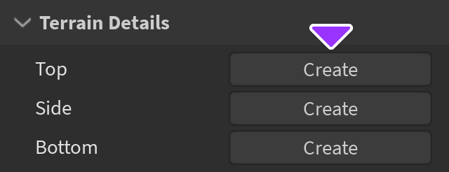

4. 활성화한 각 면에 대해, 화살표를 확장하여 이름, 텍스처 맵, 타일당 스터드 및 패턴과 같은 세부 정보를 편집합니다.

   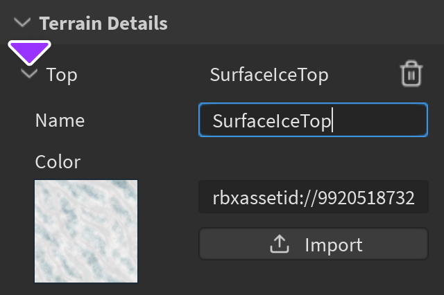

#### 재정의 비활성화

전체 재료 재정의 및 현재 재정의 중인 모든 기본 재료를 비활성화하거나 특정 기본 재료에 대한 재정의만 비활성화할 수 있습니다.

<Tabs>
<TabItem label="전체 재정의 비활성화">
1. Material Manager의 팔레트에서 **재정의에 사용되는** 사용자 지정 재료를 클릭합니다.
2. 인스펙터에서 **Overrides**로 스크롤하여 **Set as Override**를 비활성화합니다.

   
</TabItem>
<TabItem label="특정 재료에 대한 재정의 비활성화">
1. Material Manager의 팔레트에서 **사용자 지정 재료에 의해 재정의된** 기본 재료를 클릭합니다.
2. 인스펙터에서 **Material Override**로 스크롤하여 메뉴에서 **None**을 선택합니다.

   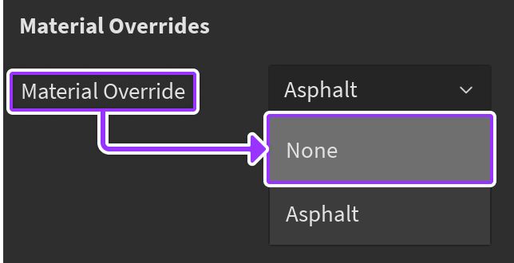
</TabItem>
</Tabs>

## 물리적 속성

모든 재료에는 밀도, 탄성, 마찰과 같은 **물리적 속성**이 내장되어 있습니다. 사용자 지정 재료와 고유한 물리적 속성을 적용하여, 해당 재료를 사용하는 모든 파트 및 지형의 글로벌 재료 동작에 영향을 미칠 수 있습니다. 예를 들어, 매우 미끄러운 **얼음** 재료 변형을 생성할 수 있습니다.

물리적 속성을 고려할 때, 엔진은 더 세분화된 파트별 설정을 우선적으로 고려하여 표면의 실제 물리적 속성을 결정합니다:

 
<Grid container spacing={0} alignItems="center">
	<Grid item xs={1}>
		

	</Grid>
	<Grid item xs={11}>
		
특정 파트의 사용자 지정 물리적 속성.

	</Grid>
	<Grid item xs={1}>
		

	</Grid>
	<Grid item xs={11}>
		
파트의 사용자 지정 재료의 사용자 지정 물리적 속성.

	</Grid>
	<Grid item xs={1}>
		

	</Grid>
	<Grid item xs={11}>
		
파트의 재료의 재료 재정의 사용자 지정 물리적 속성.

	</Grid>
	<Grid item xs={1}>
		

	</Grid>
	<Grid item xs={11}>
		
파트의 재료의 기본 물리적 속성.

	</Grid>
</Grid>

<Tabs>
<TabItem label="사용자 지정 재료에 적용">
사용자 지정 재료에 고유한 물리적 속성을 설정하고 해당 재료를 사용하는 모든 파트 및 지형에 자동으로 적용하려면:

1. Material Manager의 팔레트에서 사용자 지정 재료를 클릭합니다.
2. 인스펙터에서 **Physics** 섹션으로 스크롤하여 `Datatype.PhysicalProperties` 참조에 자세히 설명된 대로 사용자 지정 물리적 속성을 설정합니다.

   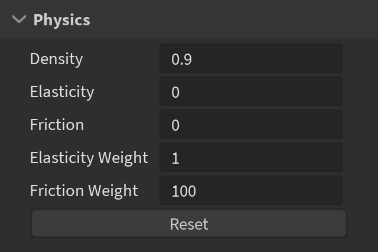

   사용자 지정 재료를 사용하는 모든 파트에 파트별 재정의가 없는 경우, Properties 창의 **CurrentPhysicalProperties** 분기에서 기본 물리적 속성이 사용자 지정 재료의 속성으로 재정의되었음을 나타냅니다.

   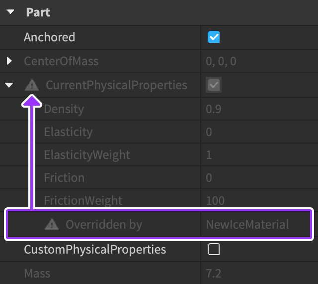

</TabItem>
<TabItem label="파트별 재정의">
특정 파트의 사용자 지정 재료 속성을 재정의하고 해당 파트에 대한 물리적 속성을 설정하려면 **CustomPhysicalProperties** 토글을 사용합니다.

1. 파트를 선택한 상태에서, Properties 창에서 **CustomPhysicalProperties**를 활성화합니다.

   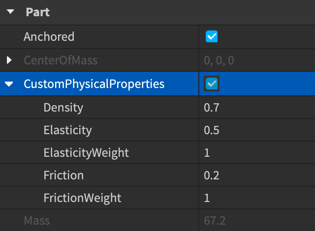

2. `Datatype.PhysicalProperties` 참조에 자세히 설명된 대로 사용자 지정 물리적 속성을 설정합니다.

</TabItem>
</Tabs>

## 적응형 재료

사용자 지정 재료를 파트에 적용하면, 파트의 `Part.MaterialVariant` 속성은 특정 인스턴스가 아닌 `MaterialVariant`의 이름이 됩니다. 이는 모델 또는 패키지로 동일하거나 다른 장소에서 파트를 재사용할 때, 다른 사용자 지정 재료를 쉽게 적용하여 파트의 외형을 조정할 수 있음을 의미합니다. 사용자 지정 재료의 적응형 동작은 다음과 같은 효과를 가집니다:

- 동일한 이름이지만 다른 텍스처를 가진 사용자 지정 재료 컬렉션을 생성하면, `MaterialService`의 컬렉션을 변경하여 장소의 스타일을 빠르게 변경할 수 있습니다.
- 사용자 지정 재료를 사용하는 파트를 가진 모델을 삽입하면, 새로운 재료를 모델의 파트에 적용하지 않고 `MaterialService`에 `MaterialVariant` 인스턴스를 생성하여 이전 사용자 지정 재료와 동일한 이름으로 변경하여 외형을 수정할 수 있습니다.

모델 및 패키지에서 사용자 지정 재료를 재사용하려면, 각 `MaterialVariant` 인스턴스가 `MaterialService`에 있어야 합니다.

- 사용자 지정 재료를 포함한 모델을 Creator Store에 배포하려면, 모델에 `MaterialVariant` 인스턴스를 포함하세요. 모델을 Creator Store에 배포하는 방법에 대한 자세한 내용은 Distributing Assets을 참조하세요.
- Creator Store에서 모델을 삽입할 때, `MaterialVariant` 인스턴스를 찾아 `MaterialService`로 복사하세요. Creator Store에서 모델을 가져오는 방법에 대한 자세한 내용은 Creator Store를 참조하세요.
- 패키지와 함께 사용자 지정 재료를 사용하려면, 패키지를 `MaterialService`에 넣으세요. 패키지에 대한 자세한 내용은 Packages를 참조하세요.

Creator Store에는 `MaterialVariant`, `TerrainDetail`, `Folder`, `Model` 인스턴스만 포함된 "재료 팩" 모델을 위한 Materials 카테고리가 있습니다. Materials 카테고리는 다른 제작자의 사용자 지정 재료를 홍보하고 발견하는 방법입니다.

<Alert severity="success">
적응형 재료를 최대한 활용하려면, `MaterialVariant` 인스턴스에 일관된 이름 규칙을 사용하세요. 예를 들어, `PascalCase`를 사용하여 사용자 지정 재료의 기본 재료를 첫 단어로 하여 `GrassWet`, `GrassDry`, `GrassBurned`와 같이 사용할 수 있습니다.
</Alert>

---
## 출처
 - [Materials](https://create.roblox.com/docs/parts/materials)

---
## [다음](./03_05_Environmental_Terrain.md)