# Environmental Terrain

## 목차
- [Environmental Terrain](#environmental-terrain)
  - [목차](#목차)
  - [지형 재료](#지형-재료)
    - [물의 외형](#물의-외형)
    - [애니메이션 잔디](#애니메이션-잔디)
    - [사용자 지정 지형 색상](#사용자-지정-지형-색상)
  - [지형 생성](#지형-생성)
    - [생성 도구](#생성-도구)
    - [높이맵과 색맵](#높이맵과-색맵)
    - [스크립팅](#스크립팅)
  - [대규모 편집](#대규모-편집)
    - [지역 선택](#지역-선택)
    - [지역 변환](#지역-변환)
    - [채우기 및 교체](#채우기-및-교체)
    - [해수면 설정](#해수면-설정)
  - [세부 편집](#세부-편집)
    - [그리기](#그리기)
    - [조각](#조각)
    - [부드럽게](#부드럽게)
    - [평평하게](#평평하게)
    - [칠하기](#칠하기)
  - [출처](#출처)
  - [다음](#다음)

---

Roblox 스튜디오의 지형 편집기는 산, 물, 잔디로 덮인 언덕, 또는 평평한 사막과 같은 상세하고 현실적인 지형 환경을 생성하고 조각할 수 있게 합니다. 지형은 3D 세계의 4×4×4 스터드 영역으로 구성된 복셀 그리드로 이루어져 있으며, 특정 재료로 구성됩니다.

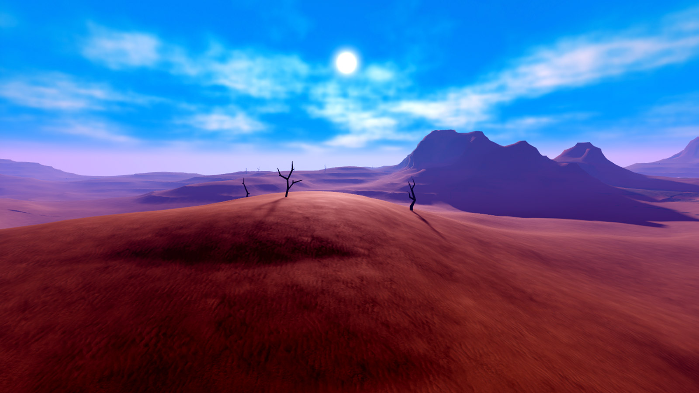

지형 편집기를 사용하여, 복셀 수준이나 지역 수준에서 지형을 쉽게 생성하고 편집할 수 있으며, 높이맵과 색맵을 가져올 수도 있습니다. 보다 정밀하고 동적인 지형 편집을 위해 스크립팅을 통해 지형을 생성할 수도 있습니다.

## 지형 재료

다음 기본 재료가 지형에 사용 가능하며, 사용자 지정 재료를 적용할 수도 있습니다. 재료는 세계에서 지형의 모양과 외형에 모두 영향을 미칩니다. 예를 들어, 애니메이션 잔디는 Grass 재료에서만 렌더링되며, Water 재료는 미묘한 움직임으로 잔물결과 반짝임을 나타냅니다.

<GridContainer numColumns="4">
  <figure>
    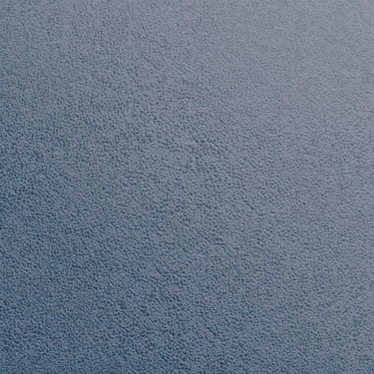
    <figcaption>아스팔트</figcaption>
  </figure>
  <figure>
    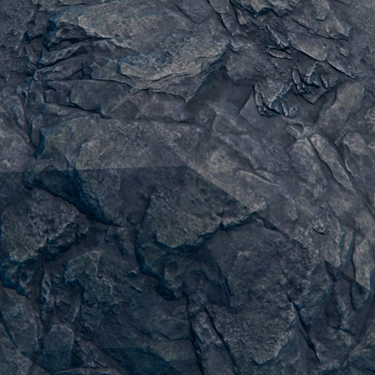
    <figcaption>현무암</figcaption>
  </figure>
  <figure>
    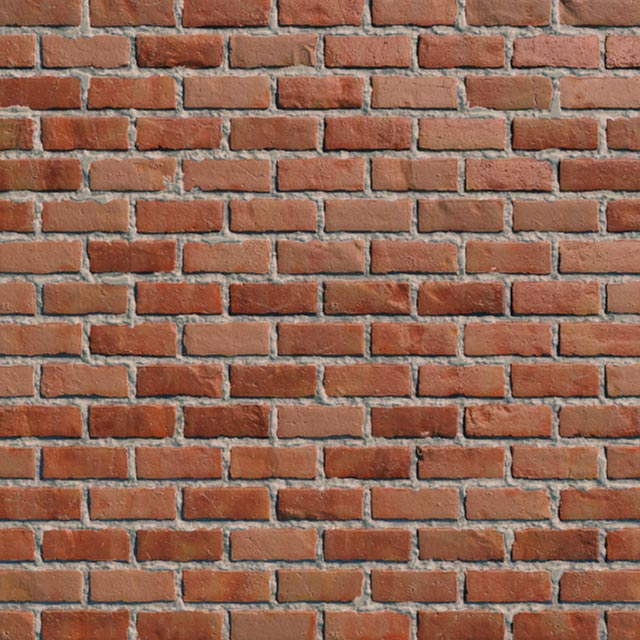
    <figcaption>벽돌</figcaption>
  </figure>
  <figure>
    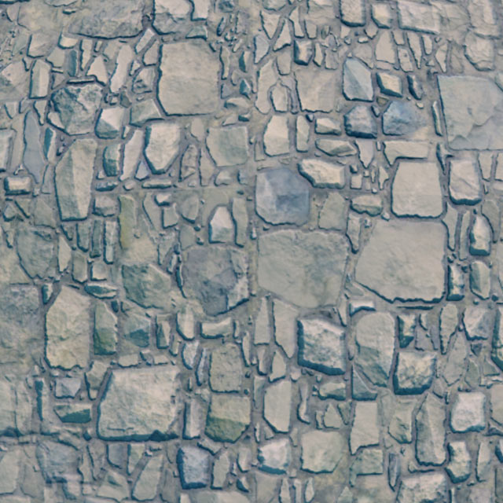
    <figcaption>자갈길</figcaption>
  </figure>
  <figure>
    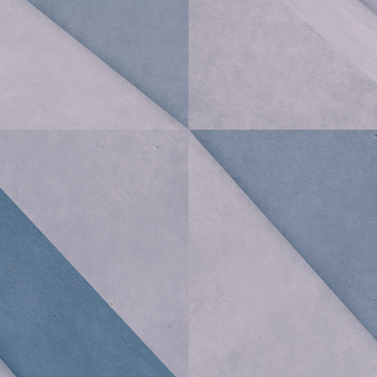
    <figcaption>콘크리트</figcaption>
  </figure>
  <figure>
    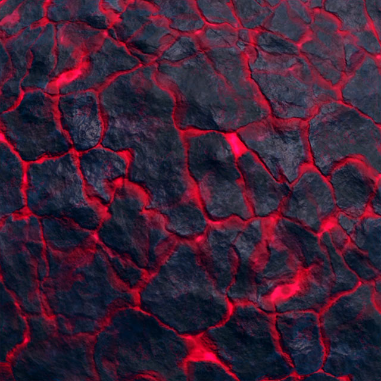
    <figcaption>갈라진 용암</figcaption>
  </figure>
  <figure>
    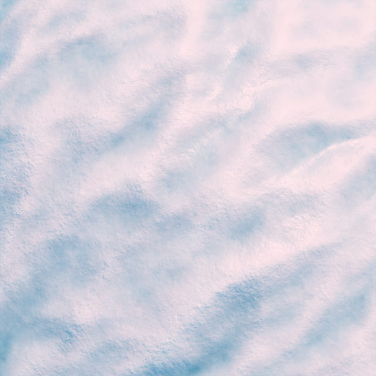
    <figcaption>빙하</figcaption>
  </figure>
  <figure>
    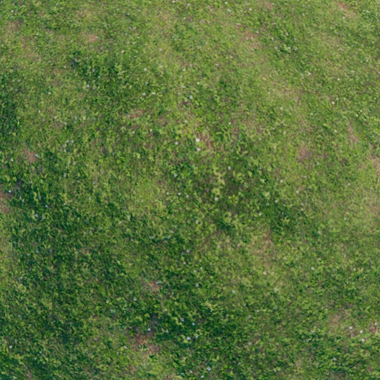
    <figcaption>잔디</figcaption>
  </figure>
  <figure>
    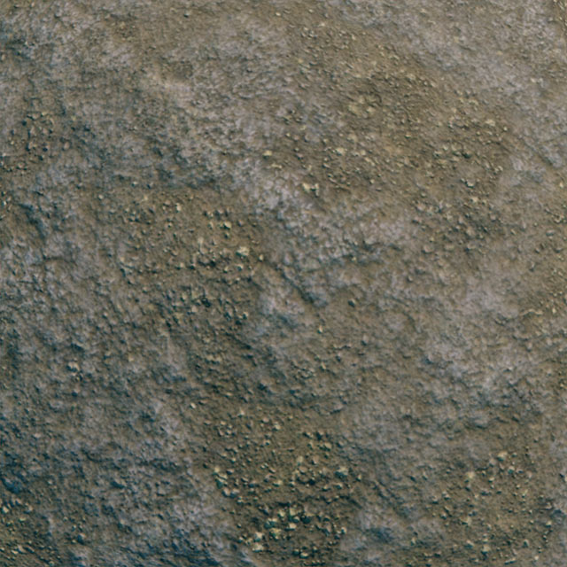
    <figcaption>땅</figcaption>
  </figure>
  <figure>
    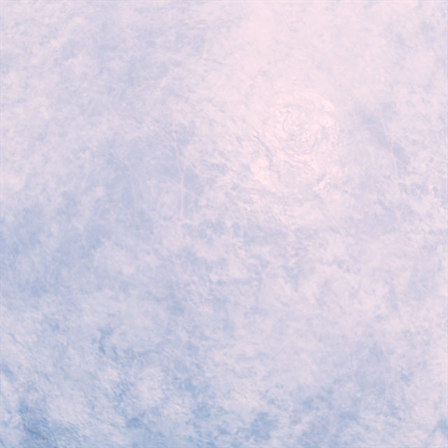
    <figcaption>얼음</figcaption>
  </figure>
  <figure>
    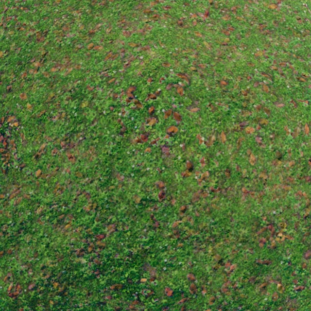
    <figcaption>잎이 무성한 잔디</figcaption>
  </figure>
  <figure>
    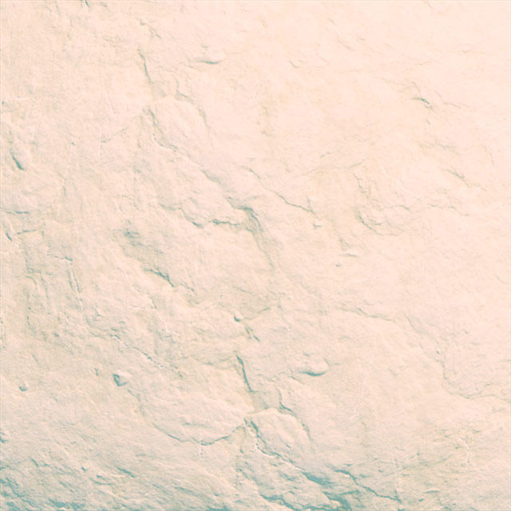
    <figcaption>석회암</figcaption>
  </figure>
  <figure>
    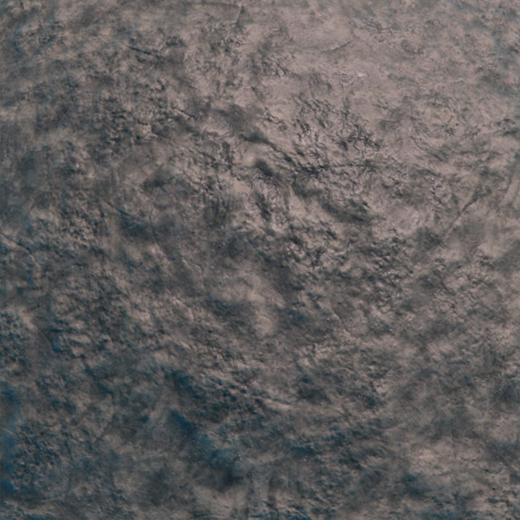
    <figcaption>진흙</figcaption>
  </figure>
  <figure>
    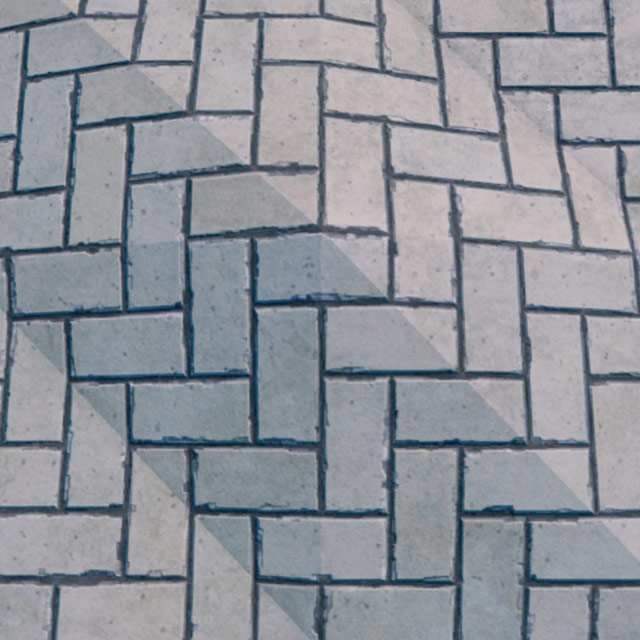
    <figcaption>포장도로</figcaption>
  </figure>
  <figure>
    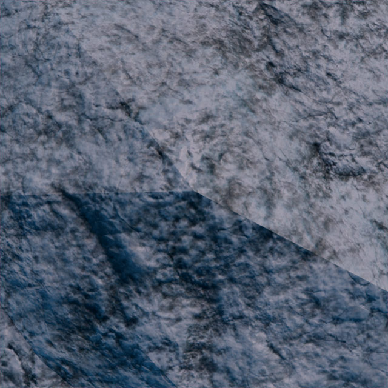
    <figcaption>바위</figcaption>
  </figure>
  <figure>
    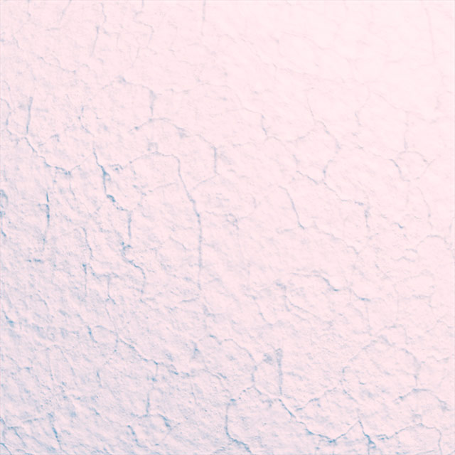
    <figcaption>소금</figcaption>
  </figure>
  <figure>
    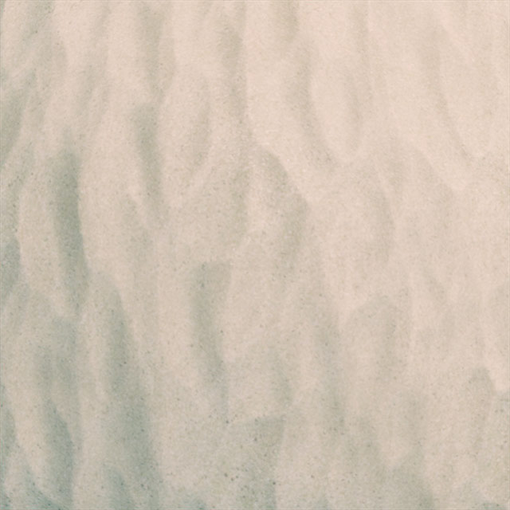
    <figcaption>모래</figcaption>
  </figure>
  <figure>
    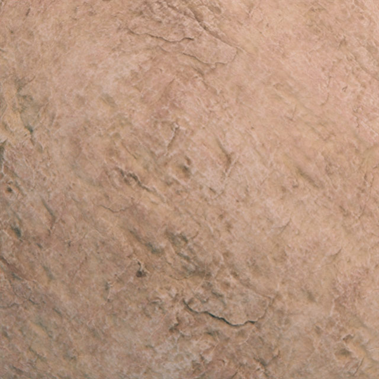
    <figcaption>사암</figcaption>
  </figure>
  <figure>
    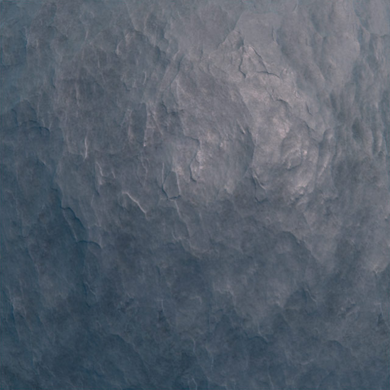
    <figcaption>슬레이트</figcaption>
  </figure>
  <figure>
    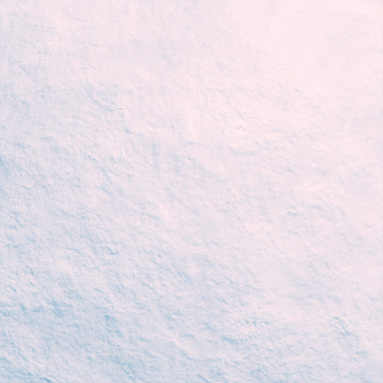
    <figcaption>눈</figcaption>
  </figure>
  <figure>
    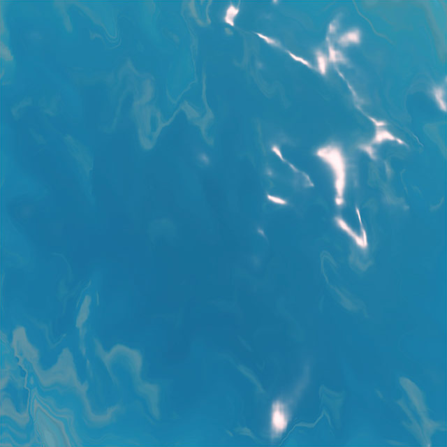
    <figcaption>물</figcaption>
  </figure>
  <figure>
    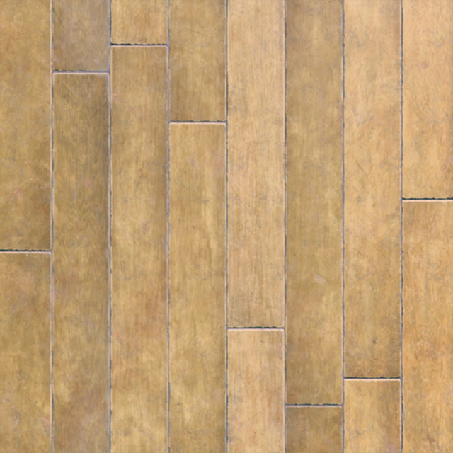
    <figcaption>나무 판자</figcaption>
  </figure>
	<figure>
    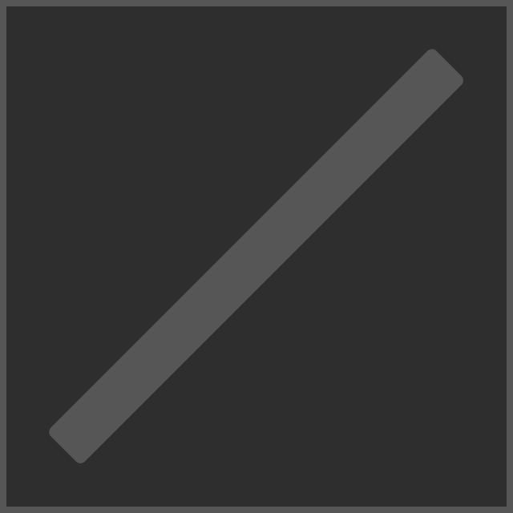
    <figcaption>공기</figcaption>
  </figure>
</GridContainer>

### 물의 외형

기본적으로 지형의 물은 미묘한 움직임으로 잔물결이 일고, 진동하며 반짝입니다.

<video src="../img/03_05_Environmental_Terrain/Water-Appearance.mp4" controls width="800" alt="Terrain water rippling, oscillating, and shimmering with a subtle motion"></video>

물의 색상과 움직임을 사용자 지정하려면:

1. Explorer 창에서 **Workspace** 아래의 **Terrain** 객체를 선택합니다.

   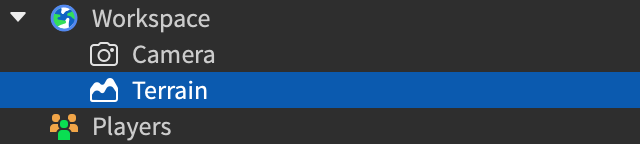

2. Properties 창에서 다음 속성을 통해 물의 외형을 사용자 지정합니다.

   <table>
   <thead>
     <tr>
       <th>속성</th>
       <th>설명</th>
     </tr>
   </thead>
   <tbody>
     <tr>
       <td>**WaterColor**</td>
       <td>경험 내 모든 지형 물의 전체적인 색조를 조정합니다.</td>
     </tr>
     <tr>
       <td>**WaterReflectance**</td>
       <td>물 표면이 하늘과 주변 물체를 반사하는 정도를 1(높음)에서 0(없음) 값으로 조정합니다.</td>
     </tr>
     <tr>
       <td>**WaterTransparency**</td>
       <td>물의 투명도를 1(투명)에서 0(불투명) 값으로 조정합니다.</td>
     </tr>
     <tr>
       <td>**WaterWaveSize**</td>
       <td>파도의 크기를 1(크게)에서 0(없음) 값으로 조정합니다.</td>
     </tr>
     <tr>
       <td>**WaterWaveSpeed**</td>
       <td>파도의 속도를 100(거칠게)에서 0(정지) 값으로 조정합니다.</td>
     </tr>
   </tbody>
   </table>

<Alert severity="success">
해안선 지형(물이 육지와 만나는 부분)이 있는 장소의 경우, 물이 육지와 접합되는 방식을 개선하기 위해 해안선을 업그레이드하는 것이 좋습니다. 스튜디오의 모든 템플릿은 이미 업그레이드된 기술을 사용하며, 지형 편집기를 열어 **업그레이드** 프롬프트를 확인하여 이전에 저장된 장소를 확인할 수 있습니다.
</Alert>

<Alert severity="info">
일부 물 속성은 플레이테스트 중에만 볼 수 있습니다. 모든 속성을 편집 중에 미리 보려면 **Studio&nbsp;Settings**을 열고, **Editor&nbsp;Quality&nbsp;Level**을 검색하여 최고 수준으로 설정하세요.
</Alert>

### 애니메이션 잔디

대부분의 재료는 정적이지만, Grass 지형 재료에 애니메이션 잔디 블레이드를 추가할 수 있습니다. 기본적으로 잔디는 시뮬레이션된 바람에 부드럽게 흔들리며, 글로벌 바람을 통해 애니메이션의 방향과 강도를 조정할 수 있습니다.

<video src="../img/03_05_Environmental_Terrain/Global-Wind-Showcase.mp4" controls width="800" alt="Video of wind blowing clouds and grass across rolling hills in the 3D world"></video>

**Grass** 재료에 애니메이션 잔디를 추가하려면:

1. Explorer 창에서 **Workspace** 아래의 **Terrain** 객체를 선택합니다.

   

2. Properties 창에서 **Decoration** 속성을 켭니다.

   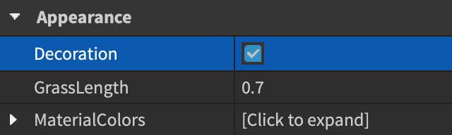

3. **GrassLength** 속성에 0.1에서 1 사이의 값을 입력하여 잔디 길이를 조정합니다.

   <BetaAlert betaName="Grass Length Customization" leadIn="이 기능은 현재 베타 버전입니다. " leadOut="를 통해 활성화할 수 있습니다." components={props.components} />

   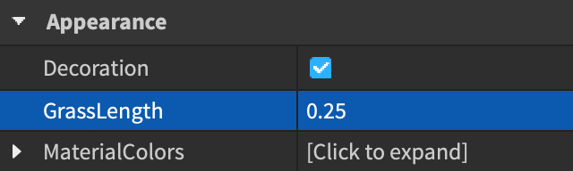

	 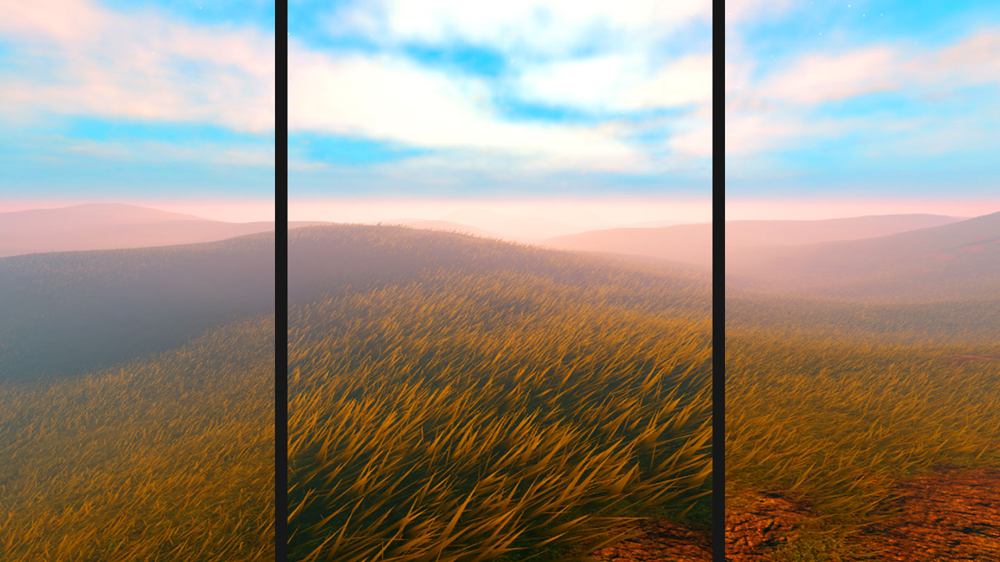

4. 필요한 경우, 글로벌 바람을 통해 애니메이션의 방향과 강도를 조정하세요.

### 사용자 지정 지형 색상

각 지형 재료에는 기본 색상이 지정되어 있지만, 경험에 맞게 모든 재료의 색상을 사용자 지정할 수 있습니다.

<Tabs>
  <TabItem label="기본값">
    
  </TabItem>
	<TabItem label="판타지">
    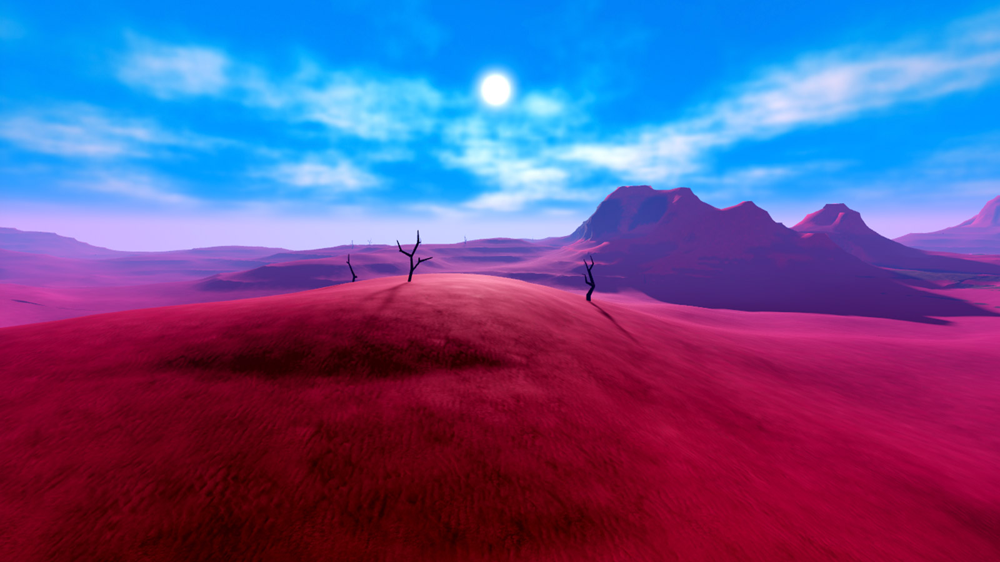
  </TabItem>
	<TabItem label="툰드라">
    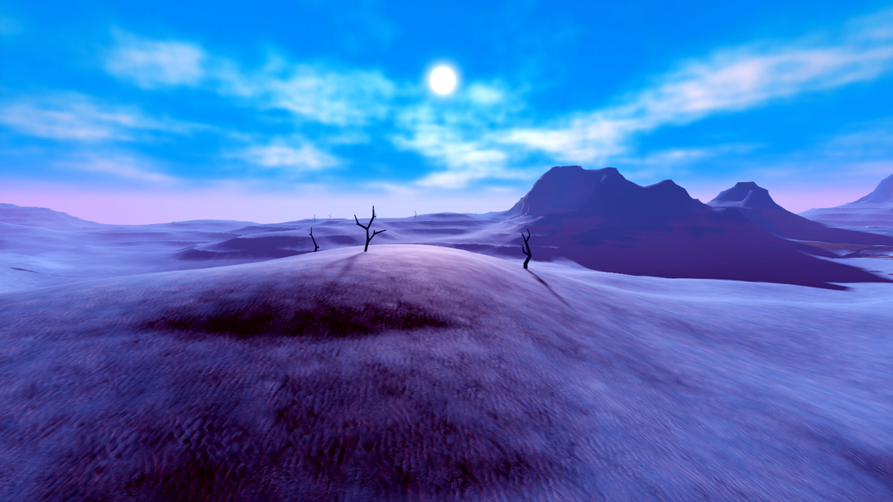
  </TabItem>
</Tabs>

물 이외의 모든 재료 색상을 사용자 지정하려면:

1. Explorer 창에서 **Workspace** 아래의 **Terrain** 객체를 선택합니다.

   

2. Properties 창에서 **MaterialColors**를 확장합니다. 모든 재료가 RGB 코드와 함께 표시됩니다.

   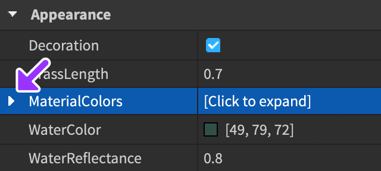

3. 주어진 재료에 대해 새 RGB 코드를 입력하거나 색상 상자를 클릭하여 색상 팝업을 엽니다.

## 지형 생성

다음 도구와 방법을 사용하여 생성 도구나 스크립팅을 통해 절차적으로 대규모 지형을 생성하거나, 높이맵 및 선택적 색맵을 기반으로 자동으로 생성할 수 있습니다.

### 생성 도구

생성 도구를 사용하면 몇 초 만에 절차적으로 지형을 생성할 수 있습니다. 이는 큰 지도를 만들고 지형 세부 사항을 미세 조정하고자 할 때 유용합니다.

1. 지형 편집기의 생성 탭으로 이동하여 생성 도구를 선택합니다.

   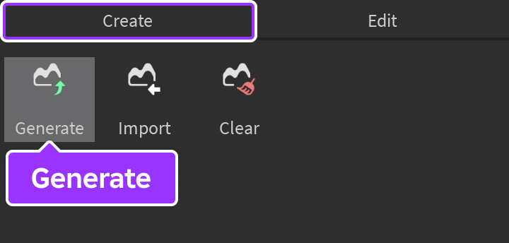

2. 도구의 **Material Settings** 섹션에서 새 지형에 포함할 다음 생물 군계를 선택합니다:

   <Grid container spacing={1}>
   <Grid item>
   <ul>
   <li>물</li>
   <li>평원</li>
   <li>사구</li>
   </ul>
   </Grid>
   <Grid item>
   <ul>
   <li>산</li>
   <li>북극</li>
   <li>습지</li>
   </ul>
   </Grid>
   <Grid item>
   <ul>
   <li>언덕</li>
   <li>협곡</li>
   <li>용암지대</li>
   </ul>
   </Grid>
   </Grid>

3. 다른 원하는 설정을 조정합니다.
4. 3D 뷰포트에서 지형을 생성할 **선택 영역**을 이동/크기 조정합니다. 또는 Select 도구의 **X**/**Y**/**Z** 입력에 값을 입력하여 특정 위치와 크기를 설정합니다.
5. **Generate** 버튼을 클릭합니다.

   <video src="../img/03_05_Environmental_Terrain/Generate-Tool.mp4" controls width="800" alt="Video of terrain generating procedurally via the Generate tool"></video>

### 높이맵과 색맵

**높이맵**은 3D 지형 지도의 2D 표현으로, 바로 위에서 본 모습입니다. 높이맵의 밝은 영역은 산과 같은 높은 지형을 나타내고, 어두운 영역은 계곡과 같은 낮은 지역을 나타냅니다.

선택적인 **색맵**은 높이맵과 함께 색상을 지형 재료로 변환하며, 색상 키를 사용합니다.

<GridContainer numColumns="3">
  <figure>
    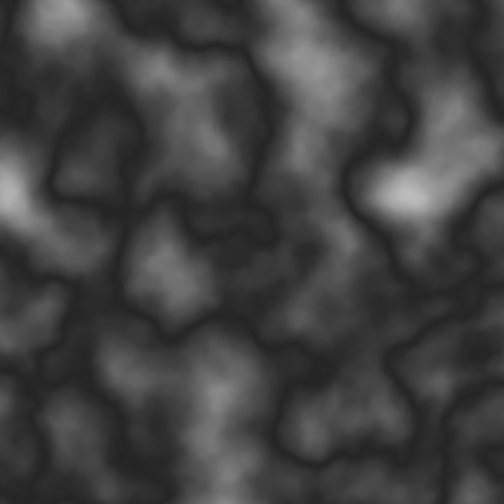
    <figcaption>높이맵</figcaption>
  </figure>
	<figure>
    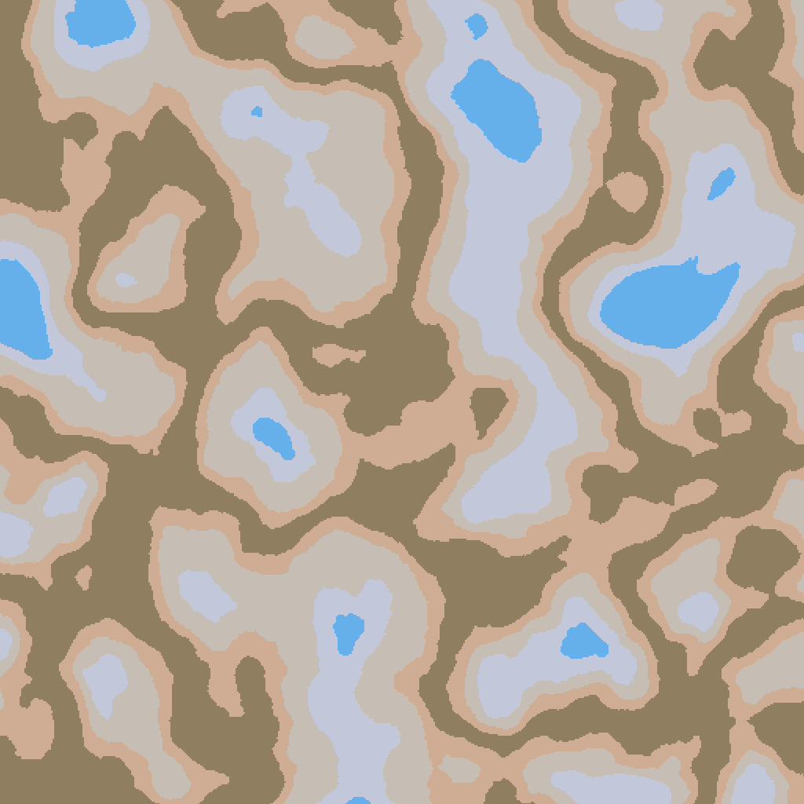
    <figcaption>색맵</figcaption>
  </figure>
  <figure>
    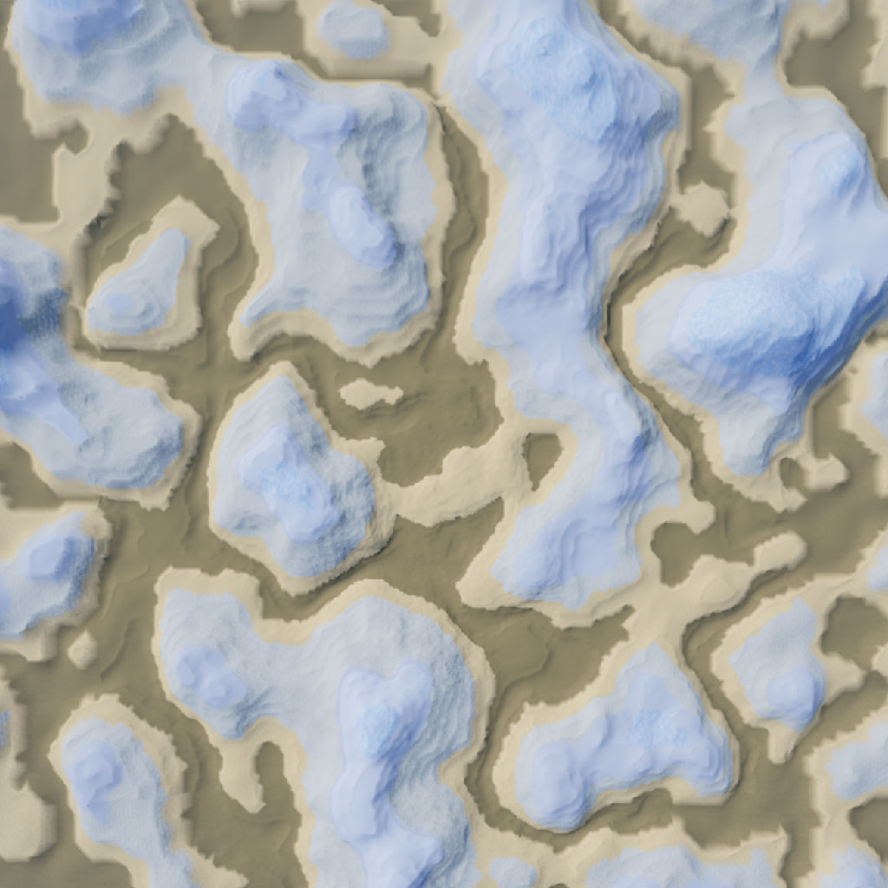
    <figcaption>생성된 지형</figcaption>
  </figure>
</GridContainer>

높이맵의 1 픽셀은 스튜디오에서 4 스터드를 나타내며, 스튜디오는 최대 4096&times;4096 픽셀의 `.jpg` 또는 `.png` 형식을 지원합니다.

높이맵과 선택적인 색맵을 가져오려면:

1. 지형 편집기의 생성 탭으로 이동하여 가져오기 도구를 선택합니다.

   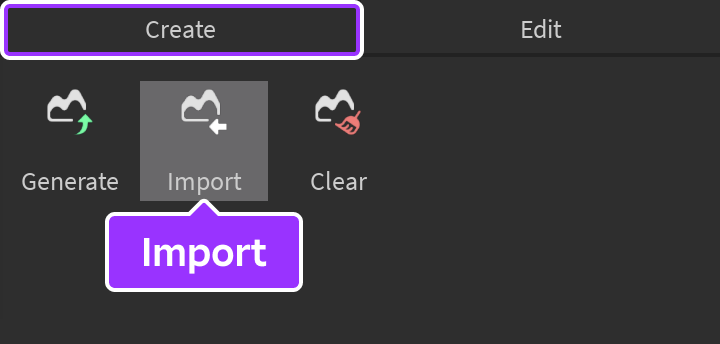

2. 도구의 **Map Settings** 섹션에서 가져오기 버튼을 클릭하고 높이맵으로 가져올 이미지를 선택합니다.
3. 도구의 **Material Settings** 섹션에서 지형 재료를 선택하거나, 색맵을 업로드합니다.

   - 생성된 모든 지형에 일관된 재료를 적용하려면, **Material** 탭을 선택하고 원하는 지형 재료를 선택합니다.
   - 색맵을 적용하려면, **Colormap** 탭을 클릭하고 가져오기 버튼을 클릭하여 가져올 파일을 선택합니다. 이미지의 색상은 색상 키 값을 일치시켜야 하며, 가장자리를 부드럽게 처리하지 말아야 합니다. 안티 앨리어싱이나 가장자리 부드럽게 처리가 예상 값 범위를 벗어난 픽셀 색상을 생성할 수 있기 때문입니다.

4. 3D 뷰포트에서 지형을 생성할 **선택 영역**을 이동/크기 조정합니다. 또는 Select 도구 필드에 값을 입력하여 보다 구체적인 위치와 크기를 설정합니다.

   <Alert severity="info">
   	최소 및 최대 지형 높이는 선택 영역의 **Y** 크기(높이)와 관련된 높이맵 이미지의 가장 어두운 영역과 가장 밝은 영역에 따라 다릅니다. 예를 들어, 높이 128을 선택하면, 완전한 검은색 영역은 중심 위치에서 64 스터드 아래이고, 완전한 흰색 영역은 중심 위치에서 64 스터드 위입니다.
   </Alert>

5. **Generate** 버튼을 클릭합니다.

   <video src="../img/03_05_Environmental_Terrain/Import-Tool.mp4" controls width="800" alt="Video of terrain generating automatically via the Import tool"></video>

### 스크립팅

`Terrain` 클래스를 사용하여 지형 생성을 스크립트할 수 있습니다. 예를 들어, 볼륨을 채우는 잔디 재료의 지형을 생성하려면, `FillBall()`, `FillBlock()`, `FillCylinder()`, `FillRegion()`, 또는 `FillWedge()`와 같은 메서드를 사용할 수 있습니다.

```lua title='Fill Block Volume'
workspace.Terrain:FillBlock(CFrame.new(0, 0, 0), Vector3.new(4, 4, 4), Enum.Material.Grass)
```

## 대규모 편집

지형 편집기의 편집 탭에는 지역 선택, 변환, 채우기, 교체, 또는 해수면 설정을 통해 대규모 편집을 위한 도구가 포함되어 있습니다.

### 지역 선택

선택 도구는 지형의 직사각형 지역을 선택하기 위한 범용 도구입니다.

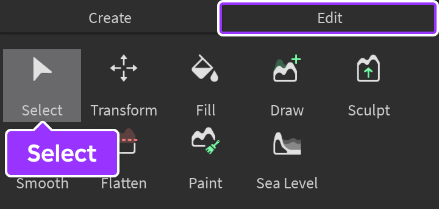

3D 뷰포트에서 클릭하고 드래그하여 영역을 선택하고, **이동** 드래거로 다시 배치하고, **크기 조절** 핸들로 크기를 조정합니다. 또는 도구의 **X**/**Y**/**Z** 입력에 값을 입력하여 특정 위치와 크기를 설정합니다.

<figure>
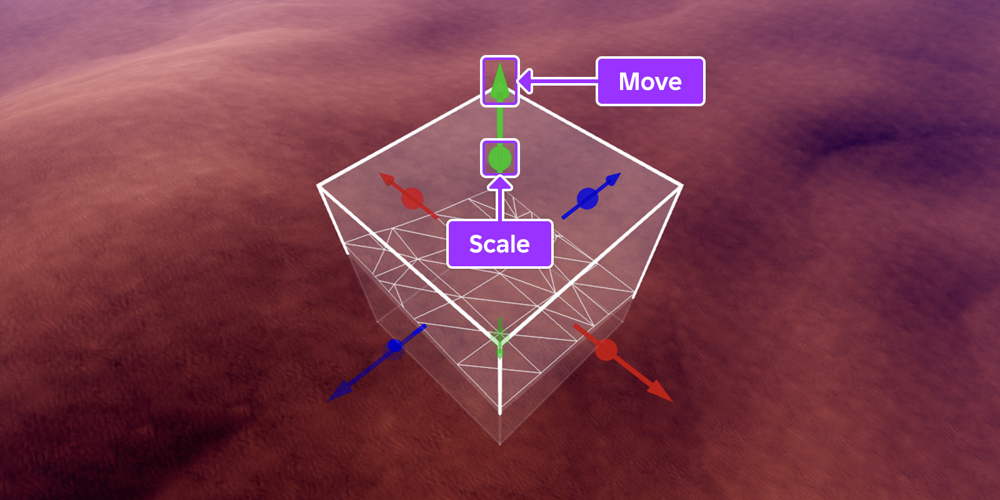
<figcaption>선택된 지역의 이동 드래거와 크기 조절 핸들</figcaption>
</figure>

스튜디오는 선택 도구가 활성화되고 Explorer 계층 구조에 아무것도 선택되지 않은 상태에서 다음 키보드 및 마우스 바로 가기를 지원합니다.

<table size="small">
  <thead>
    <tr>
      <th>Windows</th>
			<th>Mac</th>
      <th>작업</th>
    </tr>
	</thead>
	<tbody>
    <tr>
      <td><kbd>Ctrl</kbd><kbd>C</kbd></td>
			<td><kbd>⌘</kbd><kbd>C</kbd></td>
      <td>선택된 영역 내의 지형을 클립보드에 복사합니다.</td>
    </tr>
    <tr>
      <td><kbd>Ctrl</kbd><kbd>V</kbd></td>
			<td><kbd>⌘</kbd><kbd>V</kbd></td>
      <td>클립보드에 복사된 지형을 붙여넣고 변환 도구로 전환하여 새 지형을 변환할 수 있습니다.</td>
    </tr>
		<tr>
      <td><kbd>Ctrl</kbd><kbd>X</kbd></td>
			<td><kbd>⌘</kbd><kbd>X</kbd></td>
      <td>선택된 영역 내의 지형을 클립보드에 잘라내기 합니다.</td>
    </tr>
		<tr>
      <td><kbd>Ctrl</kbd><kbd>D</kbd></td>
			<td><kbd>⌘</kbd><kbd>D</kbd></td>
      <td>선택된 영역 내의 지형을 복제하고 변환 도구로 전환하여 새 지형을 변환 할 수 있습니다.</td>
    </tr>
		<tr>
      <td><kbd>Delete</kbd></td>
			<td><kbd>Delete</kbd></td>
      <td>선택된 영역 내의 지형을 삭제합니다.</td>
    </tr>
		<tr>
      <td><kbd>Shift</kbd></td>
			<td><kbd>Shift</kbd></td>
      <td>모든 **크기 조절** 핸들을 드래그하는 동안 누르고 있으면 모든 다른 축에서 비례적으로 영역의 크기를 조정합니다.</td>
    </tr>
		<tr>
      <td><kbd>Ctrl</kbd></td>
			<td><kbd>⌘</kbd></td>
      <td>모든 **크기 조절** 핸들을 드래그하는 동안 누르고 있으면 해당 축의 양의 방향과 음의 방향 모두에서 영역의 크기를 동일하게 조정합니다.</td>
    </tr>
	</tbody>
</table>

### 지역 변환

변환 도구를 사용하여 전체 선택 영역을 새로운 위치, 크기 또는 방향으로 변환할 수 있습니다.

지역을 변환하려면:

1. 지역을 선택하고 변환 도구를 활성화합니다. 지형을 붙여넣거나 복제하면 도구가 자동으로 활성화됩니다.

   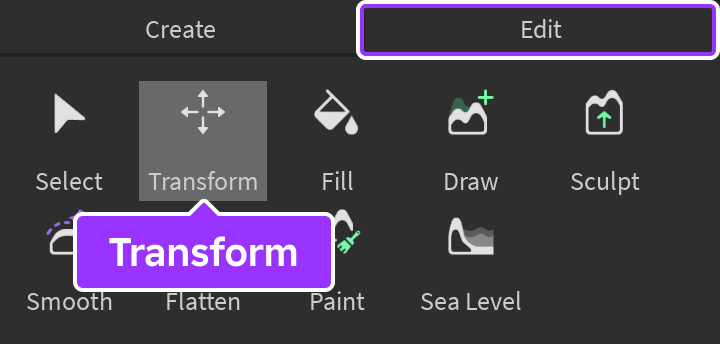

2. 스튜디오의 모델 탭에서 회전 스냅핑 설정을 확인합니다. 이 설정은 지형 회전에 영향을 미칩니다. 회전 스냅핑을 완전히 비활성화하여 자유 형식 회전을 할 수 있습니다.
3. 3D 뷰포트에서 **이동** 드래거, **회전** 링, 및 **크기 조절** 핸들을 사용하여 지역을 변환합니다. 또는 도구의 **X**/**Y**/**Z** 입력에 값을 입력하여 특정 위치, 크기 및 회전을 설정합니다.

   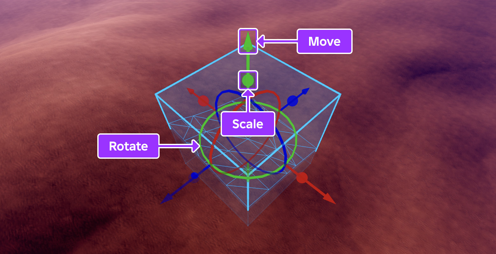

   <Alert severity="info">
   지역을 선택하는 것과 유사하게, <kbd>Shift</kbd> 키를 누르고 있는 동안 모든 **크기 조절** 핸들을 드래그하면 모든 다른 축에서 비례적으로 영역의 크기를 조정합니다. <kbd>Ctrl</kbd> 또는 <kbd>⌘</kbd> 키를 누르고 있는 동안 드래그하면 해당 축의 양의 방향과 음의 방향 모두에서 영역의 크기를 동일하게 조정합니다.
   </Alert>

   <Alert severity="success">
   기본적으로 이 도구는 **라이브 편집** 모드를 사용하여 지형을 변환하는 동안 지속적으로 업데이트합니다. 변환하는 동안 지형의 와이어프레임 미리보기를 보려면 라이브 편집 모드를 비활성화하고, 변환 중에 <kbd>Enter</kbd>/<kbd>Return</kbd> 키를 누르거나 **Apply** 버튼을 클릭하여 변경 사항을 적용하세요.
   </Alert>

### 채우기 및 교체

채우기 도구를 사용하여 특정 재료로 선택된 전체 영역을 채우거나, 해당 영역 내의 모든 재료를 다른 재료로 교체할 수 있습니다.

지형을 채우거나 교체하려면:

1. 지역을 선택하고 채우기 도구를 활성화합니다.

   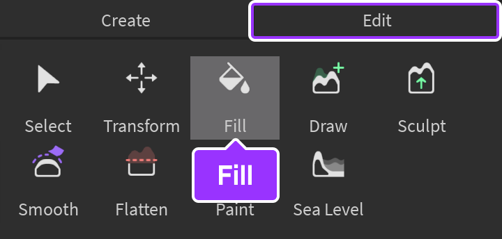

2. 도구의 **Material Settings** 섹션에서:
   - 특정 재료로 영역을 채우려면 **Fill**을 선택하고 원하는 재료를 선택합니다.
   - 한 재료의 모든 지형을 다른 재료로 교체하려면 **Replace**를 선택하고 **source** 재료와 **target** 재료를 선택합니다.
3. **Apply** 버튼을 클릭하거나 <kbd>Enter</kbd>/<kbd>Return</kbd> 키를 누릅니다.

   <figure>
   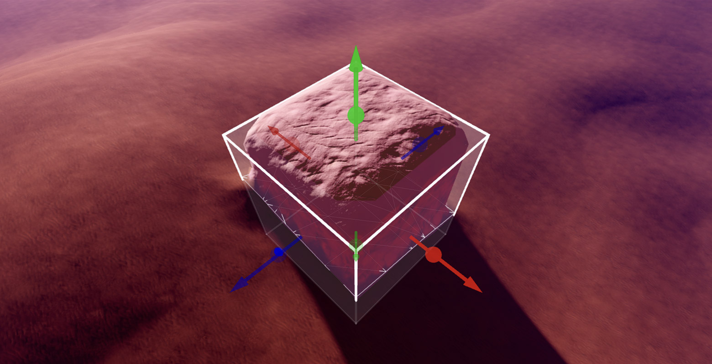
    <figcaption>Salt 재료로 채워진 선택된 영역</figcaption>
   </figure>

### 해수면 설정

해수면 도구를 사용하여 일정한 수위를 생성하거나 지역 내의 모든 물을 제거할 수 있습니다.

1. 해수면 도구를 활성화합니다.

   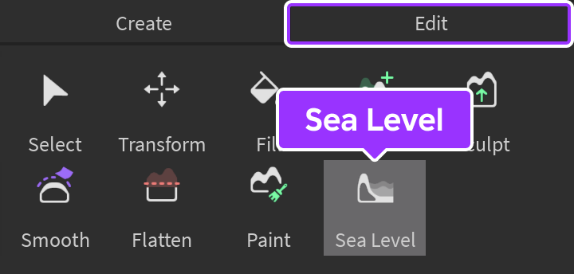

2. 3D 뷰포트에서 **이동** 드래거와 **크기 조절** 핸들을 클릭하고 드래그하여 의도한 영역을 선택합니다. 또는 도구의 **X**/**Y**/**Z** 입력에 값을 입력하여 특정 위치와 크기를 설정합니다.

3. 선택된 영역 내의 물을 제거하려면 **Evaporate** 버튼을 클릭하고, 선택된 영역을 물로 채우려면 **Create** 버튼을 클릭합니다.

   <video src="../img/03_05_Environmental_Terrain/Sea-Level-Tool.mp4" controls width="800" alt="Video of sea level being created and modified using the Sea Level tool"></video>

## 세부 편집

지형 편집기의 편집 탭에는 그리기, 조각, 부드럽게, 평평하게, 또는 칠하기 등의 "브러시" 도구를 사용하여 정밀한 편집을 할 수 있는 도구가 포함되어 있습니다.

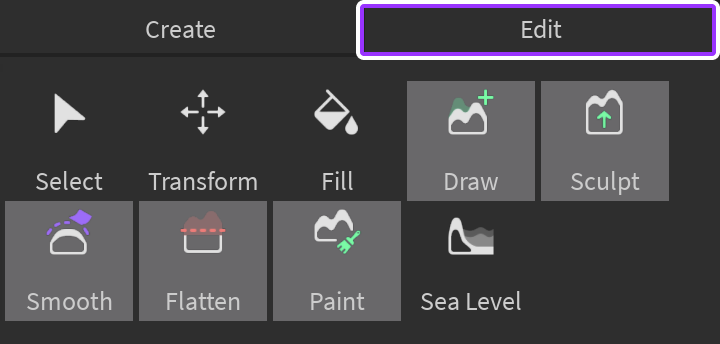

각 도구는 **구**, **상자**, 또는 **원통** 브러시 모양과 1–64 스터드 사이의 기본 크기를 선택할 수 있습니다.

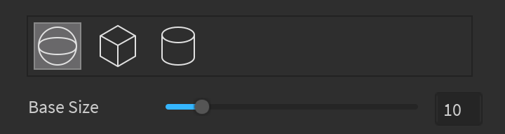

브러시를 사용하는 도구에 대해 스튜디오는 다음 키보드 및 마우스 바로 가기를 지원합니다.

<table size="small">
  <thead>
    <tr>
      <th>Windows</th>
			<th>Mac</th>
      <th>작업</th>
    </tr>
	</thead>
	<tbody>
		<tr>
      <td><kbd>Ctrl</kbd></td>
			<td><kbd>⌘</kbd></td>
      <td>Draw 및 Sculpt 도구를 사용하는 동안 누르고 있으면 대체 브러시 모드를 켭니다. 예를 들어, 기본 "추가" 모드 대신 "제거" 모드를 켭니다.</td>
    </tr>
		<tr>
      <td><kbd>Shift</kbd></td>
			<td><kbd>Shift</kbd></td>
      <td>Draw 및 Sculpt 도구를 사용하는 동안 누르고 있으면 Smooth 도구를 일시적으로 활성화합니다.</td>
    </tr>
    <tr>
      <td><kbd>B</kbd></td>
			<td><kbd>B</kbd></td>
      <td>마우스를 드래그하거나 스크롤 휠을 사용하는 동안 누르고 있으면 브러시의 **기본 크기**를 조정합니다.</td>
    </tr>
    <tr>
      <td><kbd>Ctrl</kbd><kbd>B</kbd></td>
			<td><kbd>⌘</kbd><kbd>B</kbd></td>
      <td>마우스를 드래그하거나 스크롤 휠을 사용하는 동안 누르고 있으면 브러시의 **높이**를 조정합니다. 브러시 모양이 **상자** 또는 **원통**으로 설정된 경우에만 적용됩니다.</td>
    </tr>
		<tr>
      <td><kbd>Shift</kbd><kbd>B</kbd></td>
			<td><kbd>Shift</kbd><kbd>B</kbd></td>
      <td>마우스를 드래그하거나 스크롤 휠을 사용하는 동안 누르고 있으면 브러시의 **강도**를 조정합니다. Sculpt, Smooth, 또는 Flatten 도구를 사용할 때만 적용됩니다.</td>
    </tr>
		<tr>
      <td><kbd>Alt</kbd></td>
			<td><kbd>⌥</kbd></td>
      <td>마우스를 클릭하는 동안 누르고 있으면 재료 선택기가 나타납니다.</td>
    </tr>
	</tbody>
</table>

### 그리기

Draw 도구는 브러시를 사용하여 지형을 추가하거나 제거합니다. 이 도구는 이중 모드로 작동하여 <kbd>Ctrl</kbd> 또는 <kbd>⌘</kbd>를 누르고 있으면 기본 "추가" 모드 대신 "제거" 모드를 켭니다. 또한, <kbd>Shift</kbd>를 누르고 있으면 Smooth 도구가 일시적으로 활성화됩니다.

<video src="../img/03_05_Environmental_Terrain/Draw-Tool.mp4" controls width="800" alt="Video of terrain being added and subtracted using the Draw tool"></video>

### 조각

Sculpt 도구는 브러시를 사용하여 지형을 추가하거나 제거합니다. Draw 도구와 달리, 이 도구에는 지형을 더 부드럽게 조작할 수 있는 강도 슬라이더가 포함되어 있습니다.

Draw 도구와 유사하게, Sculpt 도구는 이중 모드로 작동하여 <kbd>Ctrl</kbd> 또는 <kbd>⌘</kbd>를 누르고 있으면 기본 "추가" 모드 대신 "제거" 모드를 켭니다. 또한, <kbd>Shift</kbd>를 누르고 있으면 Smooth 도구가 일시적으로 활성화됩니다.

<video src="../img/03_05_Environmental_Terrain/Sculpt-Tool.mp4" controls width="800" alt="Video of terrain being added and subtracted using the Sculpt tool"></video>

### 부드럽게

Smooth 도구는 브러시를 사용하여 지형의 갑작스러운 가장자리를 부드럽게 합니다. 이 도구는 독립적으로 사용할 수 있으며, 또는 Draw 또는 Sculpt 도구를 사용하는 동안 <kbd>Shift</kbd>를 눌러서 켤 수 있습니다.

<video src="../img/03_05_Environmental_Terrain/Smooth-Tool.mp4" controls width="800" alt="Video of terrain being smoothed using the Smooth tool"></video>

### 평평하게

Flatten 도구는 지형을 시각화된 평면을 따라 일관된 수준으로 평평하게 합니다. 기본적으로 이 도구는 평면 위의 지형을 낮추고 평면 아래의 지형을 평면으로 올립니다. 그러나 도구의 Flatten Mode 옵션을 통해 선택적으로 낮추거나 올릴 수 있습니다.

<video src="../img/03_05_Environmental_Terrain/Flatten-Tool.mp4" controls width="800" alt="Video of terrain being flattened to a plane using the Flatten tool"></video>

### 칠하기

Paint 도구는 브러시를 사용하여 기존 재료 위에 지형 재료를 칠하거나, 한 재료를 다른 재료로 교체합니다.

<video src="../img/03_05_Environmental_Terrain/Paint-Tool.mp4" controls width="800" alt="Video of terrain being painted and replaced using the Paint tool"></video>

---
## 출처
 - [Environmental Terrain](https://create.roblox.com/docs/parts/terrain)

---
## [다음](./03_06_Pysics.md)