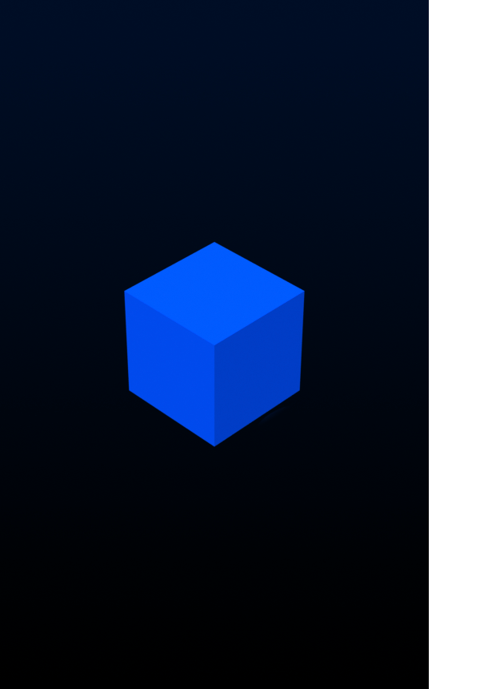
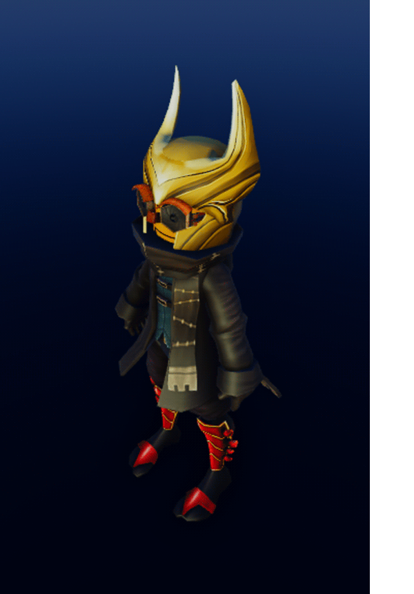
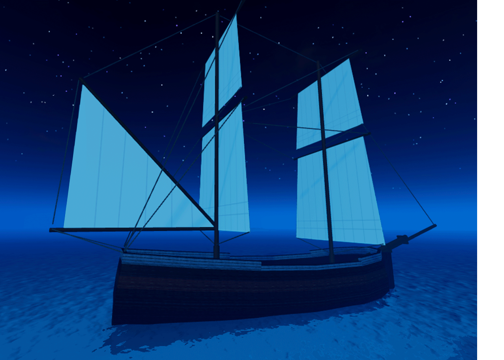

# Physics

## 목차
- [Physics](#physics)
  - [목차](#목차)
  - [Assemblies](#assemblies)
  - [Constraints](#constraints)
    - [Mechanical Constraints](#mechanical-constraints)
    - [Mover Constraints](#mover-constraints)
  - [Collisions](#collisions)
  - [Network Ownership](#network-ownership)
  - [Adaptive Timestepping](#adaptive-timestepping)
  - [출처](#출처)
  - [다음](#다음)

---

Roblox는 강체 물리 엔진을 사용합니다. 파트는 `anchored`되지 않는 한 물리적 힘의 영향을 받습니다. 부착물과 제약을 사용하여 물리적 assemblies를 만들 수 있으며, 이벤트와 충돌 필터링을 통해 객체 간의 collisions를 감지하고 제어할 수 있습니다.

## Assemblies

Assembly는 강체 제약이나 모터(애니메이션 강체 관절)로 연결된 하나 이상의 `BaseParts`입니다. Assembly는 초기 선형 또는 각속도로 설정할 수 있으며, 제약을 통해 동작을 조정할 수 있습니다.

<Grid container spacing={0}>
  <Grid item xs={6} lg={3}>
    
    <figcaption>1&nbsp;assembly; 1&nbsp;part</figcaption>
  </Grid>
  <Grid item xs={6} lg={3}>
    
    <figcaption>1&nbsp;assembly; 18&nbsp;parts</figcaption>
  </Grid>
  <Grid item xs={12} lg={6}>
    
    <figcaption>1&nbsp;assembly; 179&nbsp;parts</figcaption>
  </Grid>
</Grid>

## Constraints

앵커되지 않은 assembly는 중력과 충돌의 힘에 반응하지만, 물리적 힘은 **기계적 제약** 또는 **이동 제약**을 통해서도 적용될 수 있습니다.

### Mechanical Constraints

기계적 제약에는 경첩, 스프링, 밧줄과 같은 익숙한 객체가 포함되며, 이를 사용하여 메커니즘을 구축할 수 있습니다. 각 객체는 Mechanical Constraints에서 다룹니다.

<video src="../img/03_06_Pysics/Spring-Demo.mp4" controls width="100%"></video>

### Mover Constraints

이동 제약은 하나 이상의 assembly를 움직이기 위해 힘이나 토크를 적용합니다. 각 제약은 Mover Constraints에서 설명합니다.

<video src="../img/03_06_Pysics/Torque-RelativeTo-Attachment0.mp4" controls width="100%"></video>

## Collisions

충돌 이벤트는 두 `BaseParts`가 3D 세계에서 접촉하거나 접촉을 멈출 때 자동으로 발생합니다. 이러한 충돌은 `Touched` 및 `TouchEnded` 이벤트를 통해 감지할 수 있으며, 이는 각 파트의 `CanCollide` 속성 값에 관계없이 발생합니다.

충돌 그룹 또는 파트 간 필터링과 같은 충돌 필터링 기술을 통해 물리적 assembly 간의 충돌을 제어할 수 있습니다.

충돌 감지 및 필터링에 대한 자세한 내용은 Collisions를 참조하십시오.

## Network Ownership

복잡한 물리적 메커니즘을 지원하면서도 플레이어에게 원활하고 반응성 높은 경험을 제공하기 위해, Roblox 물리 엔진은 서버와 모든 연결된 클라이언트 간에 계산을 분산하는 **분산 물리** 시스템을 사용합니다. 이 시스템 내에서 엔진은 물리적으로 시뮬레이션된 `BaseParts`의 **네트워크 소유권**을 클라이언트 또는 서버에 할당하여 물리 계산 작업을 분산합니다. 자세한 내용은 Network Ownership을 참조하십시오.

## Adaptive Timestepping

엔진은 조립품을 세 가지 시뮬레이션 속도 중 하나로 자동 할당하여 최상의 성능을 강조합니다. 탱크와 같은 복잡한 메커니즘이 있는 시나리오의 경우 고정된 시간 간격을 설정하여 안정성을 향상시킬 수 있습니다. 자세한 내용은 Adaptive Timestepping을 참조하십시오.

---
## 출처
 - [Physics](https://create.roblox.com/docs/physics)

---
## [다음](./03_07_Effects.md)