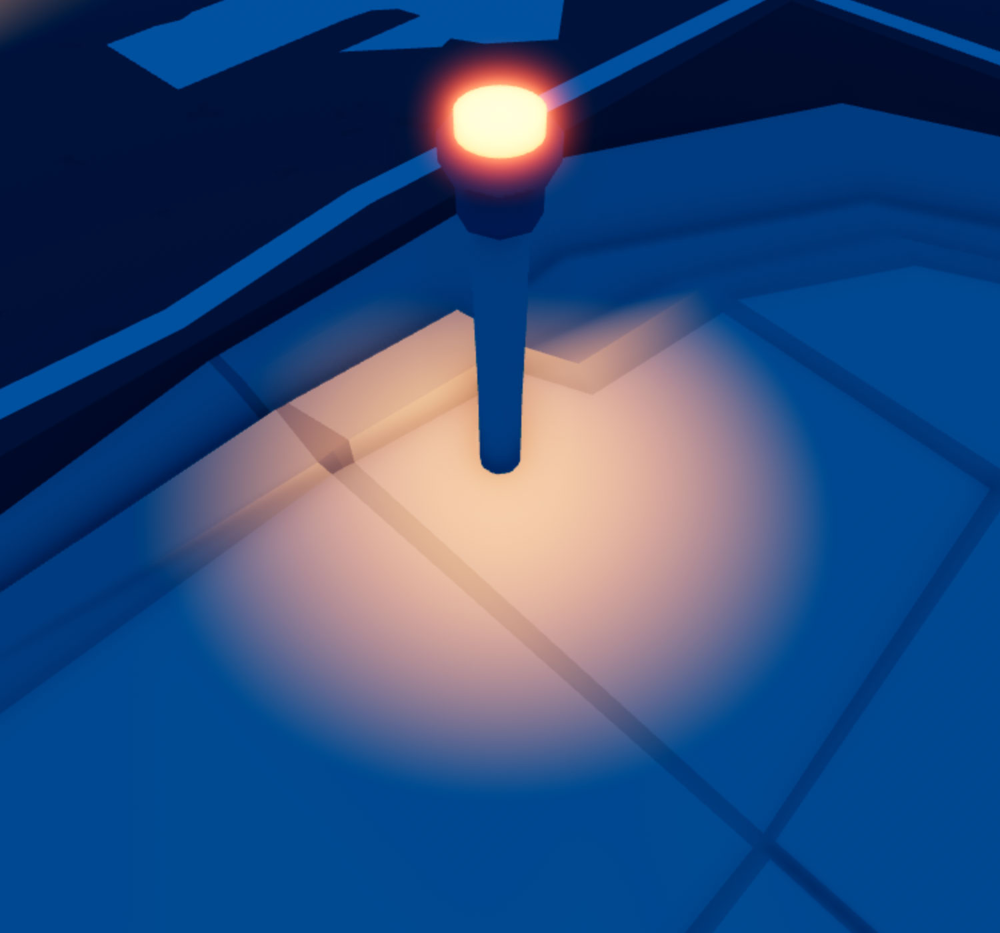
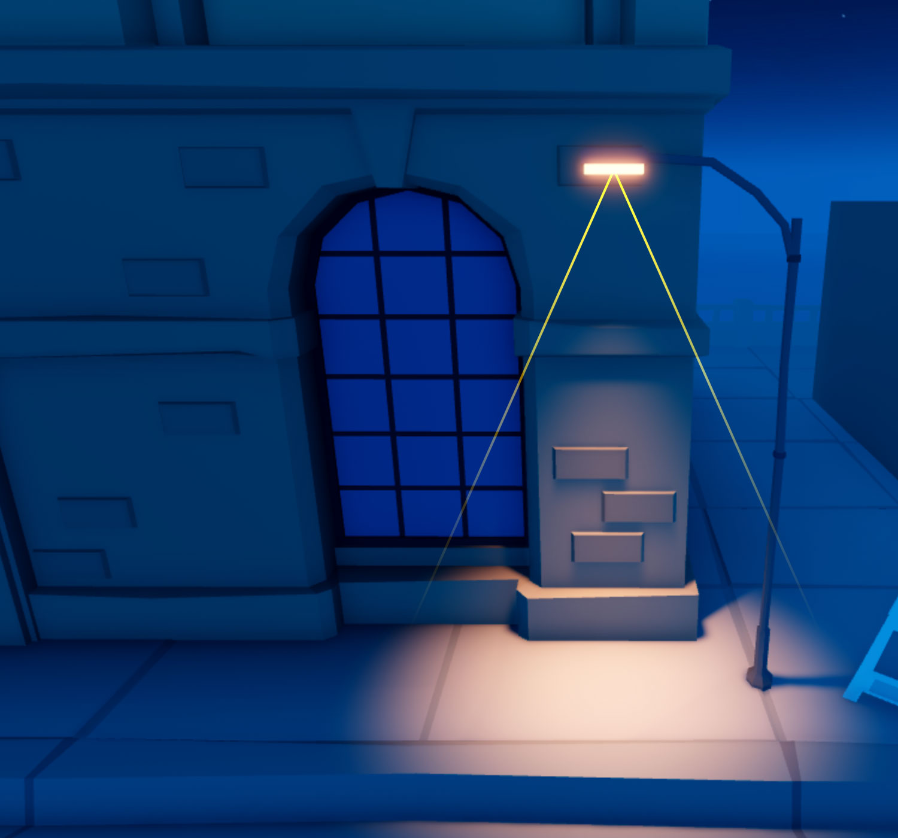
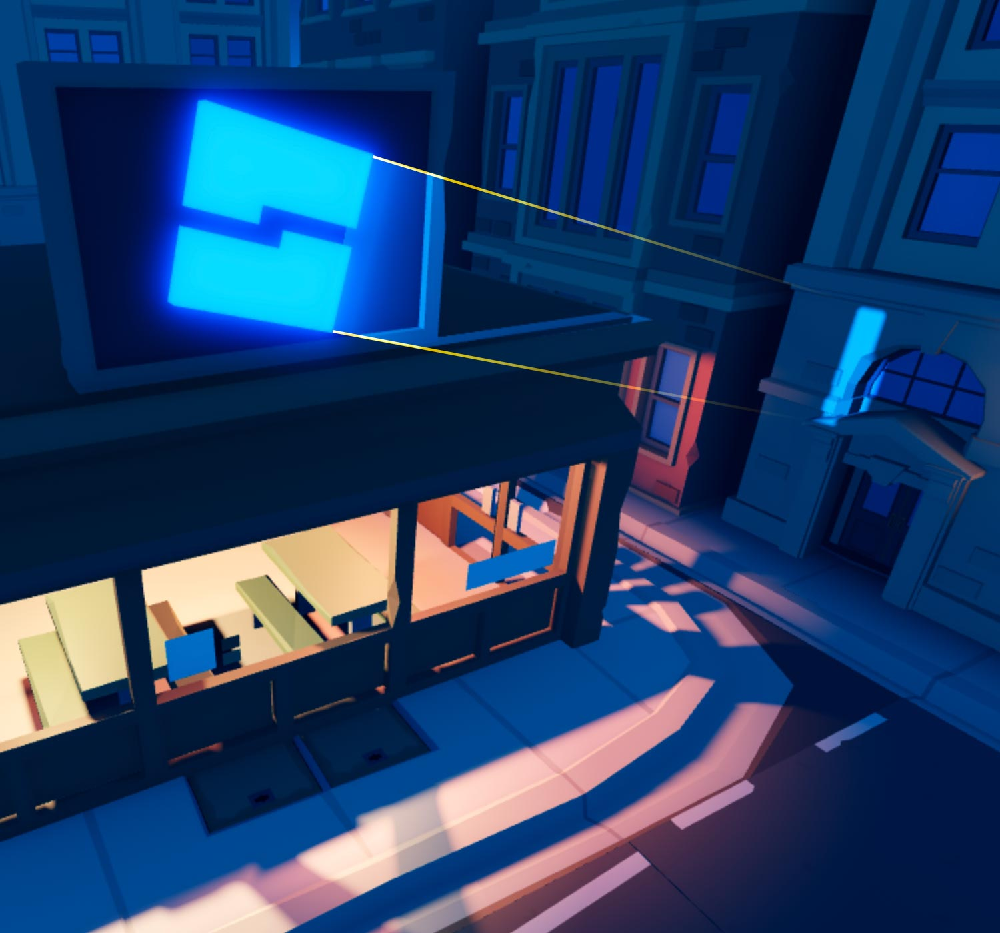
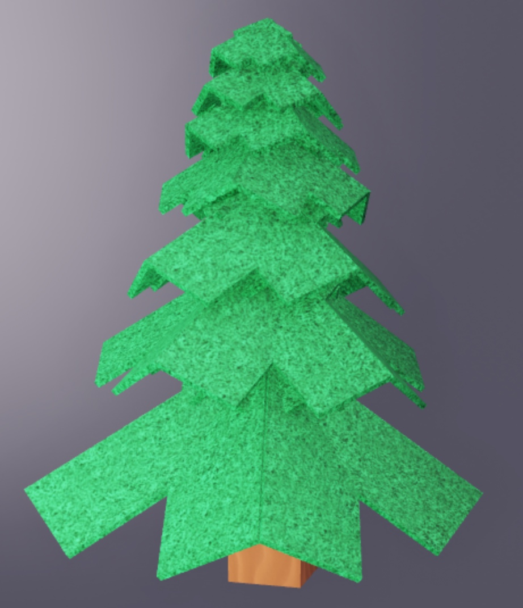
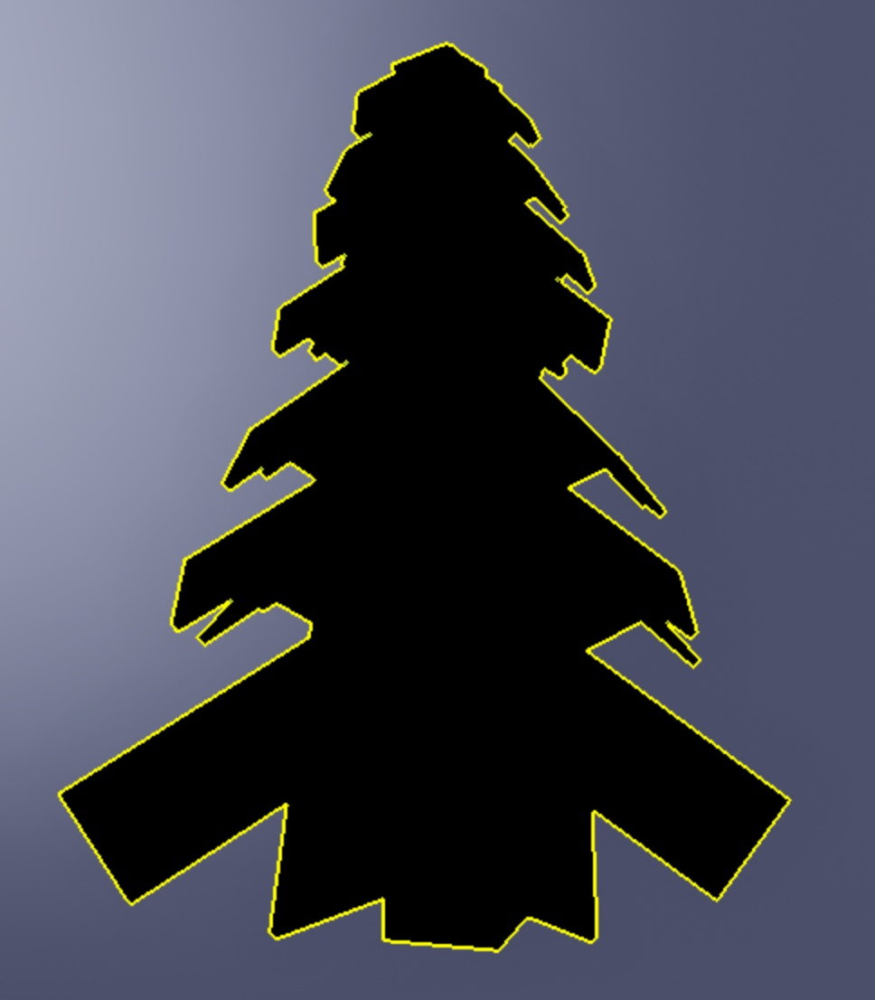
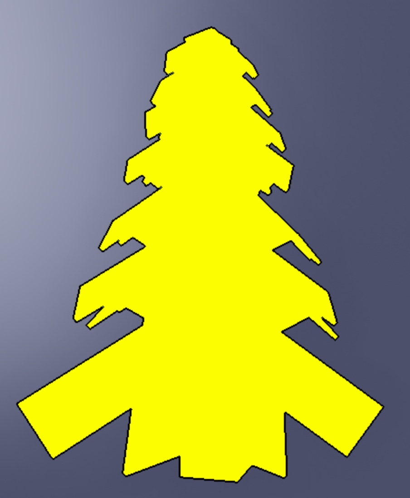

# Effects

## 목차
- [Effects](#effects)
  - [목차](#목차)
  - [Light Sources](#light-sources)
  - [Particle Emitters](#particle-emitters)
  - [Beams](#beams)
  - [Trails](#trails)
  - [Highlighting](#highlighting)
  - [출처](#출처)
  - [다음](#다음)

---

특수 효과 객체를 다른 객체나 부착물에 연결하여 특수 효과를 만들 수 있습니다.

## Light Sources

광원은 객체나 부착물에 조명 효과를 부여할 수 있습니다. 광원에는 세 가지 유형이 있습니다:

- `PointLight`는 단일 지점에서 구형으로 빛을 발산합니다. 이 객체는 전구, 횃불, 불덩이와 같은 비방향성 조명에 적합합니다.
- `SpotLight`는 구형 바닥을 가진 원뿔 모양으로 빛을 발산합니다. 이 객체는 가로등, 손전등, 헤드라이트와 같은 방향성 조명에 적합합니다.
- `SurfaceLight`는 BasePart의 면에서 빛을 발산합니다. 이 객체는 TV나 컴퓨터 화면, 광고판, 형광 패널에서 조명을 제공하는 데 적합합니다.

<GridContainer numColumns="3">
  <figure>
    
    <figcaption>Point Lights</figcaption>
  </figure>
  <figure>
    
    <figcaption>Spotlights</figcaption>
  </figure>
  <figure>
    
    <figcaption>Surface Lights</figcaption>
  </figure>
</GridContainer>

## Particle Emitters

Particle emitter는 세계에 사용자 정의 가능한 2D 이미지(입자)를 방출하는 객체로, 불, 연기, 불꽃과 같은 특수 효과를 시뮬레이션하는 데 유용합니다.

<video src="../img/03_07_Effects/Showcase.mp4"
controls width="100%"></video>

## Beams

Beam은 두 `Attachment` 객체 `Beam.Attachment0`와 `Beam.Attachment1` 사이에 텍스처를 렌더링하는 객체입니다. Beam 속성을 설정하여 다음을 수행할 수 있습니다:

- 텍스처와 색상 그라데이션을 추가하여 폭포나 힘장과 같은 흥미로운 시각 효과를 만들 수 있습니다.
- Beam의 투명도를 수정하여 시간이 지남에 따라 사라지게 할 수 있습니다.
- 각 부착 지점의 너비나 곡선을 변경하여 모양을 왜곡할 수 있습니다.

<video src="../img/03_07_Effects/Showcase2.mp4" controls
width="100%"></video>

## Trails

Trail은 두 `Attachment` 객체가 공간을 이동할 때 그 사이와 뒤에 자취를 만드는 객체입니다. Trails는 칼이 공중을 가로지르는 움직임, 목표물로 날아가는 발사체, 또는 발자국을 시각화하는 데 도움이 됩니다.

Trail 속성을 설정하여 다음을 수행할 수 있습니다:

- 텍스처를 추가하여 흥미로운 시각 효과를 만들 수 있습니다.
- 일정하거나 그라데이션 색상을 설정할 수 있습니다.
- Trail의 수명을 수정할 수 있습니다.

<video src="../img/03_07_Effects/Showcase3.mp4" controls
width="100%"></video>

## Highlighting

`Class.Highlight`는 경험 내에서 특정 객체에 주의를 끌기 위해 사용할 수 있는 시각적 효과입니다.

<GridContainer numColumns="3">
  <figure>
    
    <figcaption>Original Object</figcaption>
  </figure>
  <figure>
    
    <figcaption>Object with a yellow outline and black interior</figcaption>
  </figure>
  <figure>
    
    <figcaption>Object with a black outline and yellow interior</figcaption>
  </figure>
</GridContainer>

---
## 출처
 - [Effects](https://create.roblox.com/docs/effects)

---
## [다음](./03_08_Camera.md)