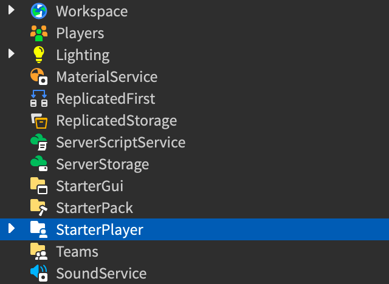
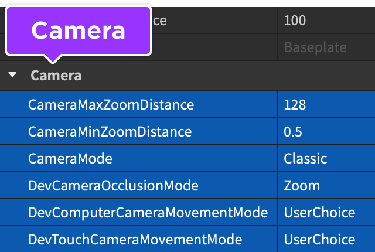

# Customizing the Camera

## 목차
- [Customizing the Camera](#customizing-the-camera)
  - [목차](#목차)
  - [Basic Settings](#basic-settings)
    - [Zoom Distance](#zoom-distance)
    - [Camera Mode](#camera-mode)
    - [Occlusion Mode](#occlusion-mode)
    - [Movement Mode](#movement-mode)
  - [Scripting the Camera](#scripting-the-camera)
  - [출처](#출처)
  - [다음](#다음)

---


Roblox의 내장 카메라는 기본 3인칭 모드와 선택 가능한 1인칭 모드를 지원하므로 따라다니는 카메라를 직접 만들 필요가 없습니다. 더 맞춤화된 시나리오의 경우 `Camera`의 기본 속성을 조정하거나 완전히 교체하여 어깨 너머 보기, 아이소메트릭 뷰, 무기 조준 뷰 등을 구현할 수 있습니다.

## Basic Settings

Studio의 `StarterPlayer` 객체 내에서 일반적인 카메라 설정을 직접 구성할 수 있습니다. 이러한 설정에는 줌 거리와 다양한 카메라 모드, 가려짐 모드, 이동 모드가 포함됩니다.

1. [Explorer] 창에서 StarterPlayer 객체를 선택합니다.

   

1. [Properties] 창에서 아래로 스크롤하여 Camera 섹션을 찾습니다. 이러한 속성은 직접 또는 스크립트를 통해 구성할 수 있습니다.

   

### Zoom Distance

`CameraMaxZoomDistance`와 `CameraMinZoomDistance`를 함께 설정하여 플레이어 캐릭터에 대한 카메라 줌 범위를 설정할 수 있습니다. 최대 값을 500과 같이 매우 높게 설정하면 플레이어가 카메라를 멀리까지 줌할 수 있습니다. 카메라를 특정 거리로 고정하고 줌을 방지하려면 두 속성을 동일한 값으로 설정하십시오.

```lua title='LocalScript - Camera Zoom Range' highlight='5,6'
local Players = game:GetService("Players")

local player = Players.LocalPlayer

player.CameraMaxZoomDistance = 25
player.CameraMinZoomDistance = 50
```

### Camera Mode

`CameraMode` 속성은 카메라의 전체 동작을 두 가지 옵션으로 설정합니다:

<table>
<thead>
  <tr>
    <th>Setting</th>
    <th>Description</th>
  </tr>
</thead>
<tbody>
  <tr>
    <td>Classic</td>
    <td>클래식 Roblox 3인칭 카메라로, 1인칭으로 줌할 수 있습니다. 플레이어는 줌인 및 줌아웃(줌이 잠기지 않은 경우)을 할 수 있으며 캐릭터 주변에서 카메라를 회전할 수 있습니다.</td>
  </tr>
  <tr>
    <td>LockFirstPerson</td>
    <td>카메라를 1인칭 모드로 고정합니다. 이 모드에서는 장착된 `Tools`를 제외한 플레이어 캐릭터의 모든 부분/요소가 보이지 않습니다.</td>
  </tr>
</tbody>
</table>

### Occlusion Mode

`DevCameraOcclusionMode` 속성은 플레이어가 캐릭터를 볼 수 없을 때, 예를 들어 `BasePart`에 의해 가려질 때 카메라 동작을 제어합니다.

<table>
<thead>
  <tr>
    <th>Setting</th>
    <th>Description</th>
  </tr>
</thead>
<tbody>
  <tr>
    <td>Zoom</td>
    <td>플레이어의 캐릭터가 투명도가 0.25 미만인 객체 뒤로 이동하면 카메라가 캐릭터를 볼 수 있도록 매우 가까이 줌합니다. 캐릭터가 다시 볼 수 있는 위치로 이동하면 카메라가 다시 줌아웃합니다.</td>
  </tr>
  <tr>
    <td>Invisicam</td>
    <td>플레이어의 캐릭터가 투명도가 0.75 미만인 객체 뒤로 이동하면 카메라는 이동하지 않지만 객체가 반투명해져서 캐릭터를 볼 수 있습니다. 캐릭터가 다시 볼 수 있는 위치로 이동하면 객체는 정상 불투명도로 돌아갑니다.</td>
  </tr>
</tbody>
</table>

<figure>
  <video controls src="../img/03_08_Camera/Camera-Occlusion.mp4" width="90%" alt="Camera occlusion mode: Zoom vs. Invisicam"></video>
  <figcaption>Zoom 및 Invisicam 가려짐 모드</figcaption>
</figure>

### Movement Mode

`DevComputerCameraMovementMode` (컴퓨터) 및 `DevTouchCameraMovementMode` (전화/태블릿)은 플레이어가 카메라를 이동할 수 있는 방법을 결정합니다.

<table>
<thead>
  <tr>
    <th>Setting</th>
    <th>Description</th>
  </tr>
</thead>
<tbody>
  <tr>
    <td>UserChoice</td>
    <td>카메라는 플레이어의 인경험 카메라 설정에 따라 이동합니다.</td>
  </tr>
  <tr>
    <td>Classic</td>
    <td>카메라는 [줌 거리]에 유지되며 플레이어의 캐릭터가 세계를 이동할 때 이를 추적합니다. 플레이어는 또한 카메라 뷰를 위/아래로 기울이고 캐릭터 주변을 돌릴 수 있습니다.</td>
  </tr>
  <tr>
    <td>Follow</td>
    <td>Classic과 유사하지만 플레이어의 캐릭터가 카메라의 앞 방향과 평행하지 않은 방향으로 이동하면 카메라가 약간 회전하여 캐릭터를 향할 수 있습니다.</td>
  </tr>
  <tr>
    <td>Orbital</td>
    <td>카메라는 고정된 줌 거리에서 유지되며 플레이어의 캐릭터가 세계를 이동할 때 이를 추적합니다. 플레이어는 캐릭터 주변에서 카메라를 회전할 수 있지만 뷰를 위/아래로 기울일 수는 없습니다.</td>
  </tr>
  <tr>
    <td>CameraToggle</td>
    <td>컴퓨터에서만 작동하며(전화/태블릿에서는 작동하지 않음), `DevComputerCameraMovementMode`를 통해 작동합니다. 플레이어가 마우스 오른쪽 버튼을 클릭하면 카메라가 Classic 모드와 마우스를 움직여 세계를 둘러보는 "자유 시점" 모드 간에 전환됩니다.</td>
  </tr>
</tbody>
</table>

## Scripting the Camera

각 플레이어 클라이언트에는 로컬 `Workspace`에 있는 고유한 `Camera` 객체가 있으며, `Workspace.CurrentCamera` 속성을 통해 접근할 수 있습니다. `Camera.CameraType`을 `Scriptable`로 설정하여 Roblox의 기본 카메라 스크립트를 재정의한 다음, 일반적으로 다음 속성을 통해 카메라를 제어할 수 있습니다.

<table>
<thead>
  <tr>
    <th>Property</th>
    <th>Description</th>
  </tr>
</thead>
<tbody>
  <tr>
    <td>`Camera.CFrame`</td>
    <td>카메라의 `Datatype.CFrame`입니다. 이는 경험 내에서 `Scriptable` 카메라를 위치 지정하고 방향을 설정하는 데 가장 자주 사용되는 속성입니다.</td>
  </tr>
  <tr>
    <td>`Camera.FieldOfView`</td>
<td>화면에 보이는 3D 공간의 범위로, `Camera.FieldOfViewMode`에서 정의된 방향으로 1–120도 사이에서 측정됩니다. 기본값은 70입니다.</td>
  </tr>
	<tr>
    <td>`Camera.CameraType`</td>
    <td>`Enum.CameraType`에 나열된 다양한 카메라 동작 간 전환을 토글합니다. 이를 `Scriptable`로 설정하면 카메라를 완전히 제어할 수 있습니다.</td>
  </tr>
	<tr>
    <td>`Camera.Focus`</td>
    <td>카메라가 바라보는 3D 공간의 지점입니다. `Camera.CameraType`을 `Scriptable`로 설정한 경우 이 속성을 매 프레임마다 업데이트해야 합니다. 특정 시각 요소는 초점 지점과의 거리로 인해 더 자세히 나타납니다.</td>
  </tr>
</tbody>
</table>

---
## 출처
 - [Customizing the Camera](https://create.roblox.com/docs/workspace/camera)

---
## [다음](./04_00_Scripting.md)