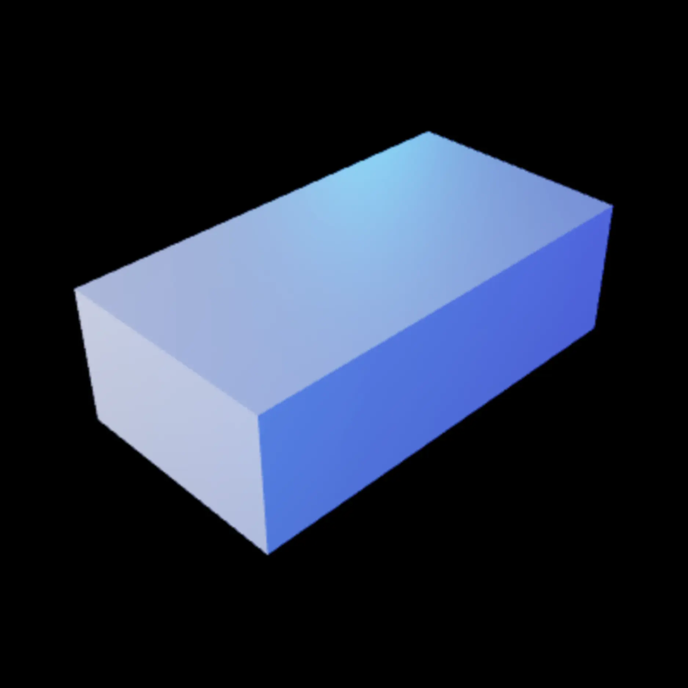
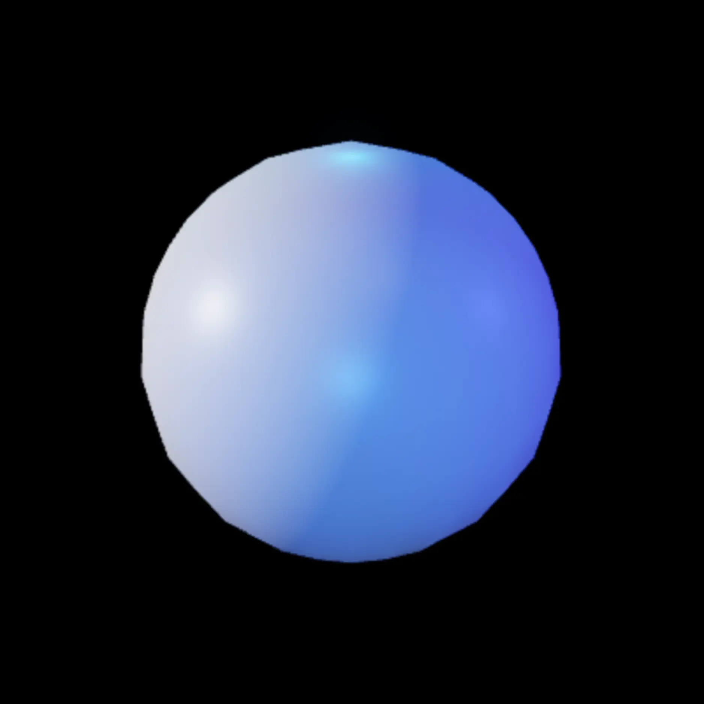
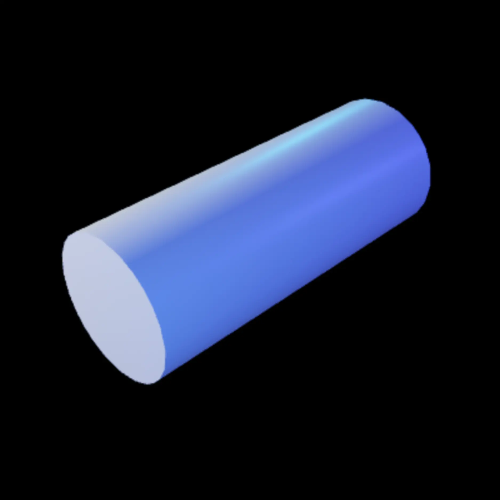
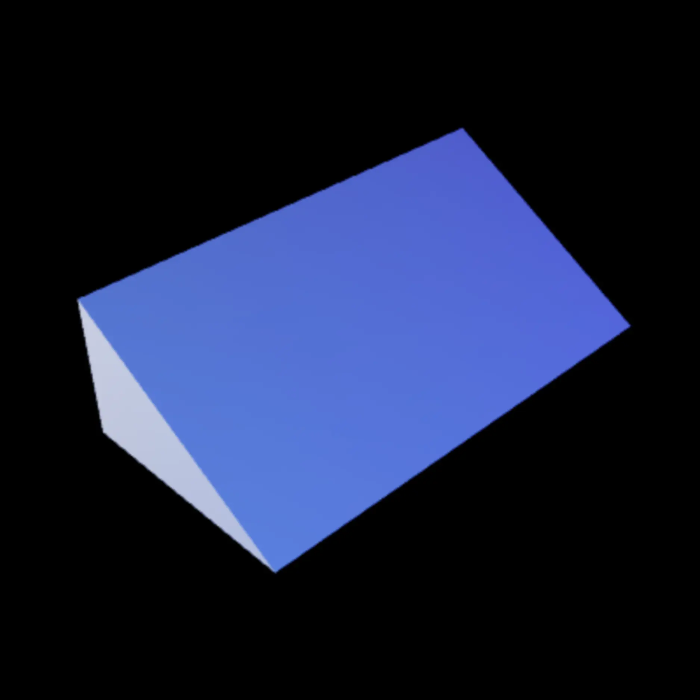
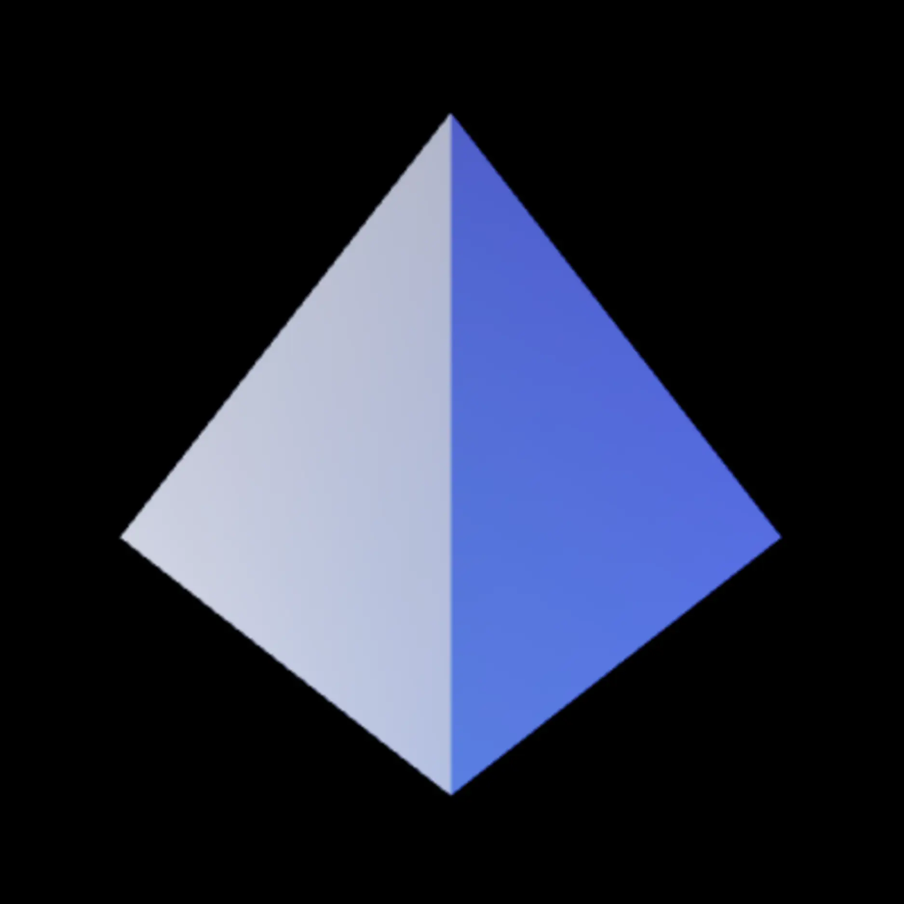
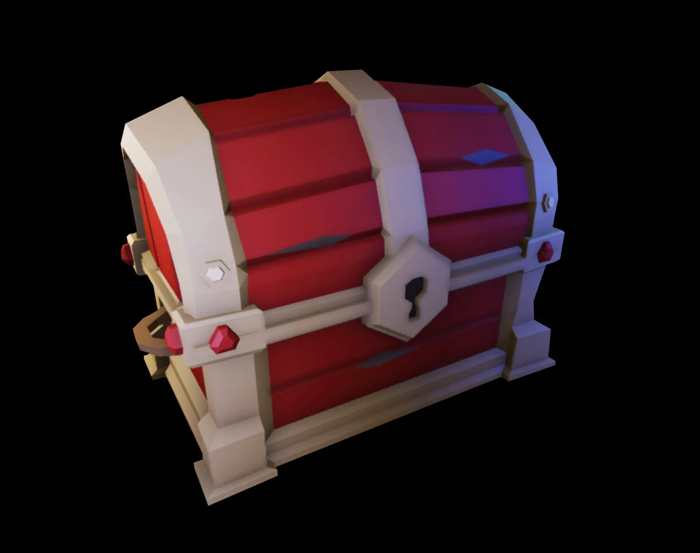
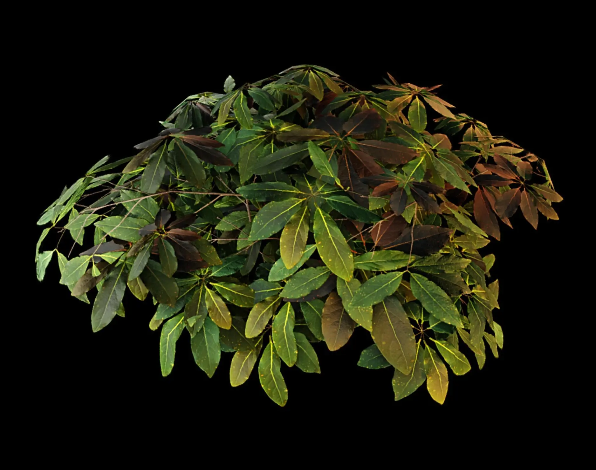
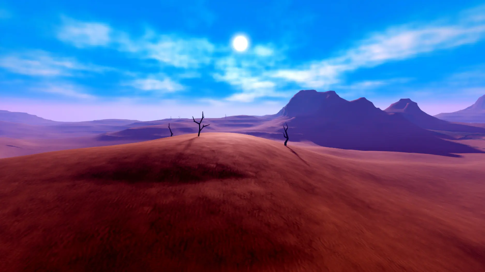
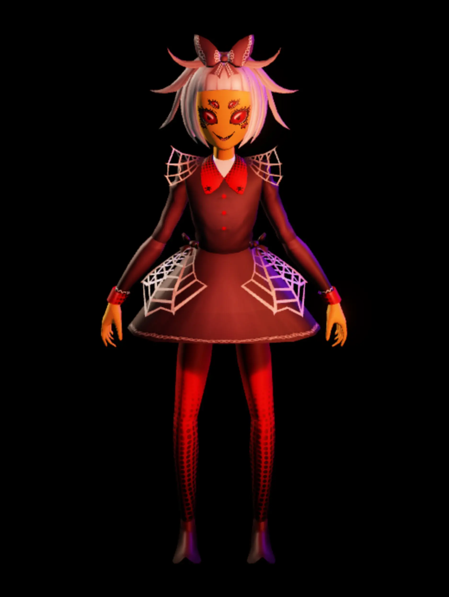
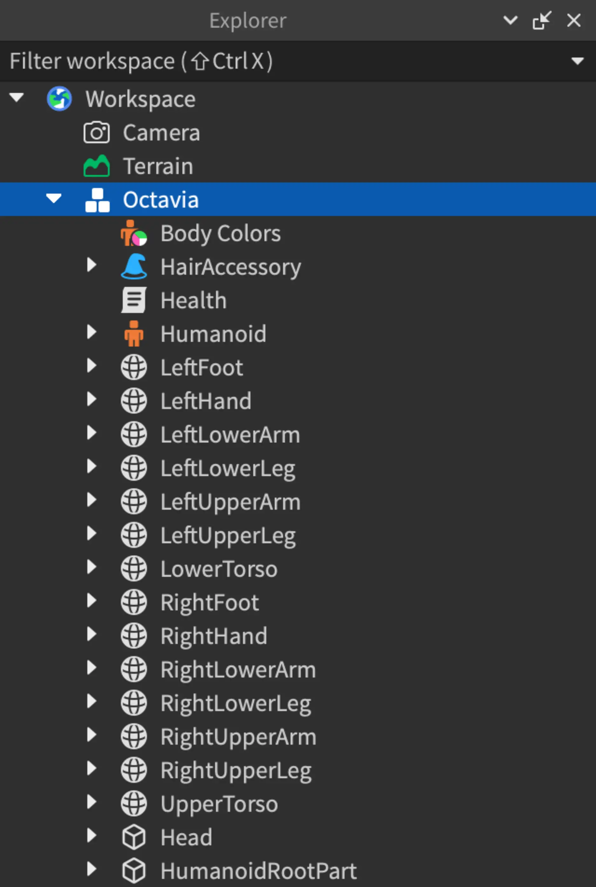

# 3D Workspace

## 목차
- [3D Workspace](#3d-workspace)
	- [목차](#목차)
	- [파트](#파트)
	- [메쉬](#메쉬)
	- [지형](#지형)
	- [모델](#모델)
	- [스크립트에서 작업공간에 접근하기](#스크립트에서-작업공간에-접근하기)
	- [출처](#출처)
	- [다음](#다음)

---

`Workspace`는 Roblox 엔진이 3D 월드에서 렌더링할 객체를 포함하는 컨테이너 서비스입니다. 일반적으로 다음과 같은 객체를 작업공간에 추가합니다:

- `BasePart` 객체, 여기에는 `Part`와 `MeshPart` 객체가 포함됩니다.
- `Attachment` 객체, 이는 `ParticleEmitter`와 같은 특수 효과 생성기, `BillboardGui`와 같은 UI 객체, 물리적 `Constraint` 등과 연결할 수 있습니다.
- 기하학적 그룹을 조직하는 `Model` 객체.
- 작업공간 내의 다른 객체에 종속된 `Script` 객체. 스크립트는 렌더링되지 않지만 다른 객체의 렌더링에 영향을 미칠 수 있습니다.

## 파트

`Part` 객체는 Roblox의 기본 빌딩 블록을 나타냅니다. 기본적으로 모든 파트는 물리적으로 시뮬레이션되며 3D 작업공간에 나타나면 렌더링됩니다. 파트는 블록, 구, 실린더, 쐐기, 코너 쐐기의 모양을 취할 수 있습니다. 또한 `TrussPart`는 캐릭터가 사다리처럼 오를 수 있는 트러스 빔으로 작동합니다.

<table>
<thead>
<tr>
<th>
블록
</th>
<th>
구
</th>
<th>
실린더
</th>
<th>
쐐기
</th>
<th>
코너 쐐기
</th>
</tr>
</thead>
<tbody>
<tr>
<td></td>
<td></td>
<td></td>
<td></td>
<td></td>
</tr>
</tbody>
</table>

또한 고체 모델링 작업을 파트에 적용하여, 유니온 또는 네게이트와 같은 작업을 통해 그릇이나 중공 파이프와 같은 더 복잡한 구조로 결합할 수 있습니다.

## 메쉬

`MeshPart`는 메쉬(3D 객체를 구성하는 꼭짓점, 모서리, 면의 집합)를 나타내는 객체입니다. 일반적으로 [Blender](https://www.blender.org) 또는 [Maya](https://www.autodesk.com/products/maya/overview)와 같은 서드파티 소프트웨어를 사용하여 메쉬를 생성한 후, Studio를 사용하여 `MeshPart`로 가져옵니다.

메쉬는 Studio에서 수행할 수 있는 어떤 고체 모델링보다 더 많은 세부 사항을 포함할 수 있습니다. 또한 내부 리그와 텍스처를 포함할 수 있어 생동감 있는 객체를 생성하고 포즈를 취하고 애니메이션할 수 있습니다.

<GridContainer numColumns="2">
  <figure>
    
    <figcaption>텍스처가 적용된 메쉬</figcaption>
  </figure>
  <figure>
    
    <figcaption>SurfaceAppearance가 적용된 메쉬</figcaption>
  </figure>
</GridContainer>

## 지형

`Terrain` 객체를 사용하여 산, 수역, 잔디 언덕 또는 평평한 사막과 같은 자세하고 현실적인 지형 환경을 생성하고 조각할 수 있습니다. 지형 편집기를 사용하여 쉽게 넓은 지형 영역을 생성하고 변경할 수 있습니다.

## 모델

`Model`은 `BasePart`, `Motor6D` 객체 및 기타 모델과 같은 **기하학적 그룹**을 위한 컨테이너 객체입니다. 모델은 단순한 그룹일 수 있으며 모델 내에서 기본 파트를 설정하여 물리 엔진이 단일 강체로 처리하는 어셈블리로 작동하게 할 수 있습니다. 모델에는 모델의 개별 객체에 작용하는 스크립트도 포함될 수 있습니다.

<GridContainer numColumns="2">
	<figure>
		
		<figcaption>옥타비아라는 이름의 모델</figcaption>
	</figure>
	<figure>
    	
    	<figcaption>모델을 구성하는 그룹</figcaption>
    </figure>
</GridContainer>

## 스크립트에서 작업공간에 접근하기

스크립트 내에서 `Workspace`에 세 가지 다른 방법으로 접근할 수 있으며, 모두 유효합니다.

- `workspace`
- `game.Workspace`
- `game:GetService("Workspace")`

이후에는 다양한 사용 사례를 수행하여 경험을 위한 스크립트 논리를 작성하고 동적 세계와 상호작용을 생성할 수 있습니다. 예를 들어:

- 런타임 중에 속성을 변경하기 위해 작업공간의 모든 객체에 대한 참조를 얻습니다.
- 사용자의 `Camera` 객체에 대한 참조를 얻어 작업공간의 뷰를 조작합니다.
- 특정 시간에 논리를 수행하기 위해 작업공간의 객체에서 이벤트를 수신합니다. (예를 들어 사용자의 플레이 가능한 캐릭터가 객체를 터치할 때.)

---
## 출처
 - [3D Workspace](https://create.roblox.com/docs/ko-kr/workspace)

---
## [다음](./04_Scripting.md)