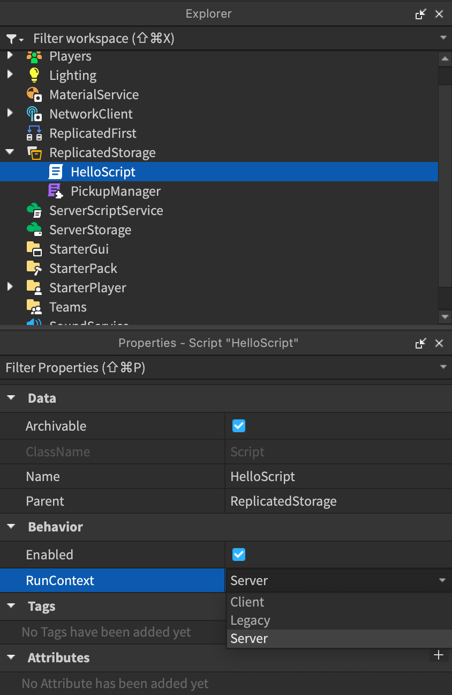
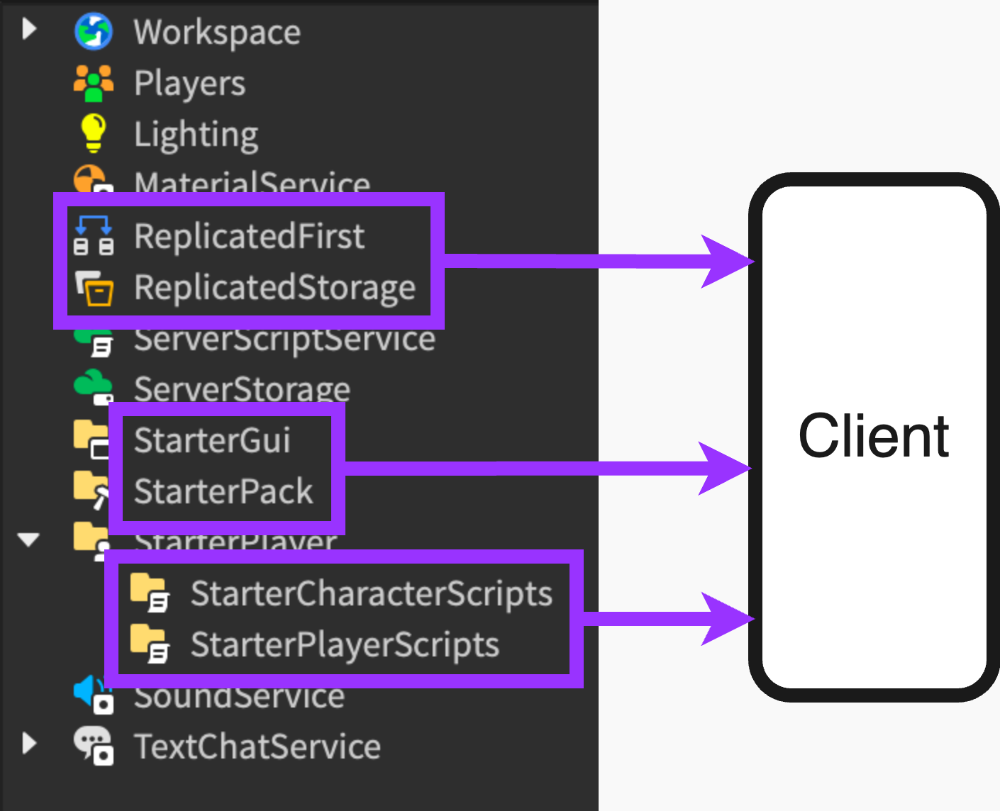

# Script Types and Locations

## 목차
- [Script Types and Locations](#script-types-and-locations)
  - [목차](#목차)
  - [스크립트 유형](#스크립트-유형)
    - [권장 사항](#권장-사항)
  - [스크립트 위치](#스크립트-위치)
  - [예제 프로젝트 구조](#예제-프로젝트-구조)
  - [출처](#출처)
  - [다음](#다음)

---

많은 개발자들에게 Roblox 스크립팅에 적응하는 기본적인 도전 과제는 파일 위치와 `Script.RunContext` 속성의 중요성입니다. 스크립트 유형, Explorer 내의 위치, 실행 컨텍스트에 따라 스크립트의 동작이 크게 달라질 수 있습니다. 특정 메서드 호출이 실패하거나, 경험의 객체에 접근할 수 없거나, 스크립트가 전혀 실행되지 않을 수 있습니다.

이러한 복잡성의 이유는 Roblox 경험이 기본적으로 멀티플레이어라는 점입니다. 스크립트는 서버에서만 실행되거나, 클라이언트에서만 실행되거나, 또는 두 곳 모두에서 공유되어 실행될 수 있는 능력이 필요합니다. Roblox 플랫폼의 진화는 상황을 더욱 복잡하게 만들었습니다.

## 스크립트 유형

Roblox에는 세 가지 유형의 스크립트가 있습니다:

- `Script`: 위치와 `Script.RunContext` 속성에 따라 서버 또는 클라이언트에서 실행되는 코드입니다.
- `LocalScript`: 클라이언트에서만 실행되는 코드입니다. 실행 컨텍스트가 없습니다.
- `ModuleScript`: 다른 스크립트에서 재사용할 수 있는 코드입니다. 실행 컨텍스트가 없습니다.

`Script`를 생성하면 기본 실행 컨텍스트는 Legacy로 설정됩니다. 이는 a) 서버 측 스크립트이고 b) `Workspace` 또는 `ServerScriptService`와 같은 서버 컨테이너에 있는 경우에만 실행됨을 의미합니다.

- 스크립트의 실행 컨텍스트를 Server로 변경하면 `ReplicatedStorage`에서도 실행할 수 있지만, 이는 권장되지 않습니다. 해당 위치의 내용이 클라이언트에 복제되므로 서버 측 스크립트에는 적합하지 않습니다.
- 스크립트의 실행 컨텍스트를 Client로 변경하면 `ReplicatedStorage`에서 실행할 수 있으며, `StarterCharacterScripts`와 `StarterPlayerScripts`에서도 실행할 수 있습니다. 이들 시작 컨테이너는 클라이언트에 복사되므로 원본 스크립트와 복사본이 모두 실행됩니다. 이는 바람직하지 않습니다.

스크립트 실행 컨텍스트를 변경하려면 Explorer에서 스크립트를 선택하고 속성 창에서 값을 변경하십시오.

### 권장 사항

- 특별한 이유가 없는 한 기본 RunContext 값을 사용하십시오. Legacy라는 이름은 Roblox 스크립트가 전통적으로 이렇게 작동해 왔음을 전달하기 위한 것이며, 해당 동작이 사용 중지되었거나 최적이 아님을 의미하지 않습니다.
- 기본 RunContext 값을 사용하지 않는 두 가지 좋은 사용 사례가 있습니다:
  - 클라이언트 스크립트를 `ReplicatedStorage` 또는 `ReplicatedFirst`에서 실행하려는 경우.
  - 모델 및 패키지 내에 포함된 서버 또는 클라이언트 스크립트. 실행 컨텍스트를 명시적으로 설정하면 다양한 위치에서 모델과 패키지가 제대로 작동할 가능성이 높아집니다.

- 서버와 클라이언트 스크립트 간에 코드를 공유하려면 `ModuleScripts`를 `ReplicatedStorage`에 사용하십시오.
- `LocalScripts`는 `StarterCharacterScripts`, `StarterPlayerScripts`, `StarterGui`, `StarterPack`에 사용하십시오.

## 스크립트 위치

위치 | 설명
:--- | :---
`Workspace` | 게임 세계를 나타냅니다. 서버 스크립트만 실행됩니다. 객체에 직접 부착하여 동작을 제어하는 스크립트에 적합합니다.
`ReplicatedFirst` | 다른 모든 것보다 먼저 클라이언트에 복제되는 객체를 포함합니다. 로딩 화면을 표시하는 데 필요한 최소 객체 및 스크립트에 이상적입니다.
`ReplicatedStorage` | 클라이언트와 서버에 복제되는 객체를 포함합니다. 서버와 클라이언트 모두에서 사용할 `ModuleScripts`에 이상적입니다. `LocalScripts`는 이 위치에서 실행되지 않지만, 실행 컨텍스트가 Client인 `Scripts`는 실행됩니다.
`ServerScriptService` | 서버 측 스크립트를 포함합니다. 게임 로직 및 클라우드 저장소와 같은 서버 측 기능이나 객체에 액세스해야 하는 스크립트에 이상적입니다.
`ServerStorage` | 서버 측 객체를 포함합니다. 경험에 참가할 때 즉시 클라이언트에 복제될 필요가 없는 대형 객체에 이상적입니다. 이 위치에서는 스크립트가 실행되지 않지만 서버 측 `ModuleScripts`를 저장할 수 있습니다.
`StarterPlayer.StarterCharacterScripts` | 캐릭터가 처음 생성될 때 실행되는 `LocalScripts`를 포함합니다. 플레이어가 다시 생성될 때 이 스크립트는 다시 실행되지 않습니다.
`StarterPlayer.StarterPlayerScripts` | 플레이어가 경험에 참가할 때 실행되는 범용 `LocalScripts`를 포함합니다.
`StarterGui` | 게임을 로드할 때 클라이언트가 표시하는 GUI 요소를 포함합니다. `LocalScripts`는 이 위치에서 실행될 수 있습니다. 버튼, 메뉴 및 팝업 추가와 같은 게임의 사용자 인터페이스를 수정하는 스크립트에 이상적입니다.
`StarterPack` | 일반적으로 `Tools`만 포함하지만, 플레이어 백팩을 설정하는 `LocalScripts`도 포함할 수 있습니다.

이 이미지는 클라이언트 스크립트를 포함할 수 있는 Explorer 창 위치를 보여줍니다. `ReplicatedFirst`와 `ReplicatedStorage`는 실행 컨텍스트가 Client인 스크립트를 포함할 수 있으며, 시작 컨테이너는 로컬 스크립트를 사용해야 함을 기억하십시오.

## 예제 프로젝트 구조

[Plant](https://create.roblox.com/docs/resources/plant-reference-project) 참조 프로젝트는 대규모 복잡한 경험에서 코드를 구성하는 방법을 보여줍니다.

특히 주목할 점은 대부분의 코드를 `ReplicatedStorage`와 `ServerStorage`의 재사용 가능한 `ModuleScripts`로 저장하는 방법입니다.

---
## 출처
 - [Script Types and Locations](https://create.roblox.com/docs/scripting/locations)

---
## [다음](./04_02_Reusing_Code.md)