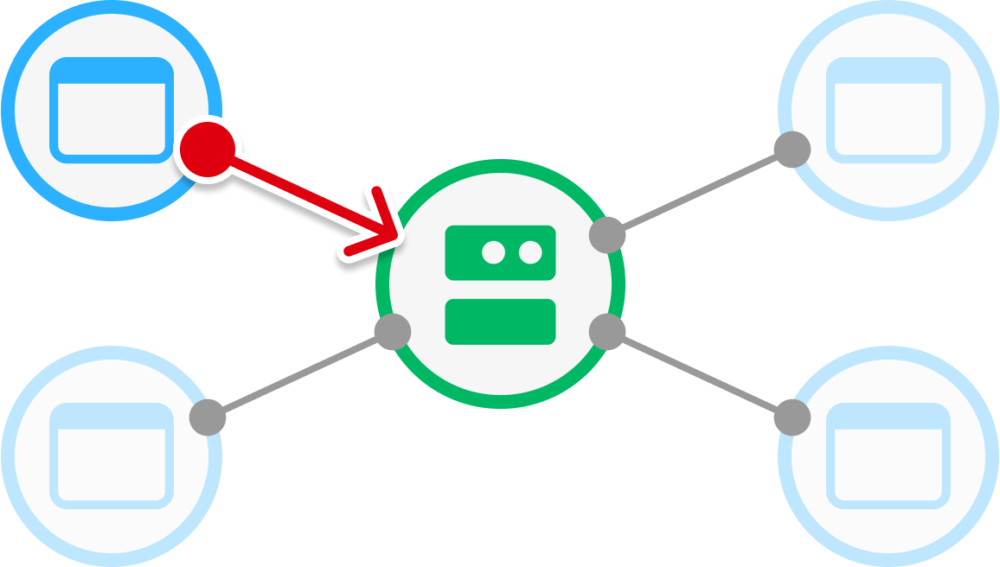
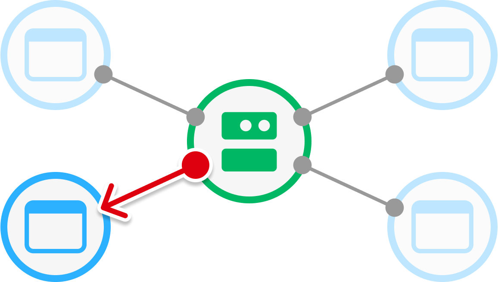
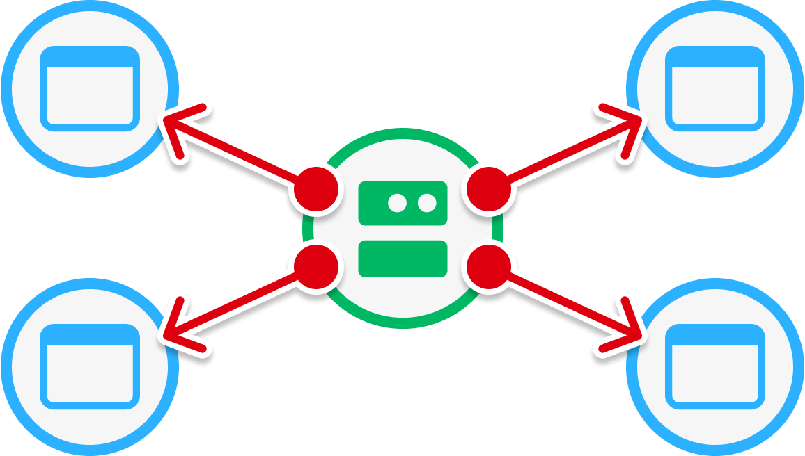
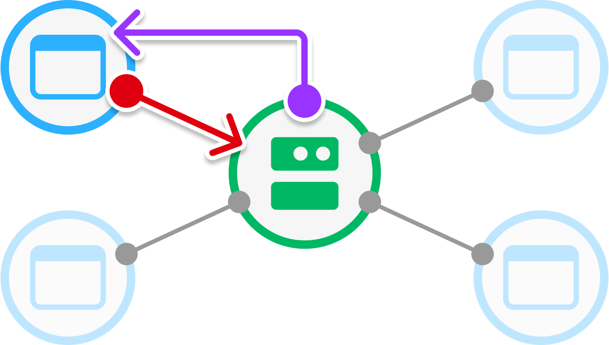
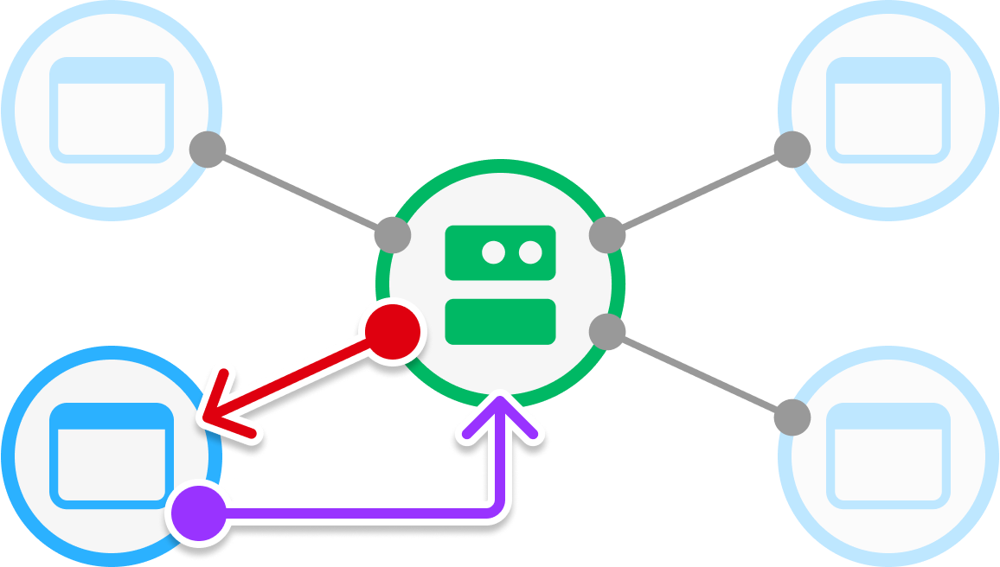

# Remote Events and Callbacks

## 목차
- [Remote Events and Callbacks](#remote-events-and-callbacks)
  - [목차](#목차)
  - [빠른 참조](#빠른-참조)
  - [원격 이벤트](#원격-이벤트)
    - [클라이언트 → 서버](#클라이언트-서버)
    - [서버 → 클라이언트](#서버-클라이언트)
    - [서버 → 모든 클라이언트](#서버-모든-클라이언트)
  - [원격 콜백](#원격-콜백)
    - [클라이언트 → 서버 → 클라이언트](#클라이언트-서버-클라이언트)
    - [서버 → 클라이언트 → 서버](#서버-클라이언트-서버)
  - [인수 제한](#인수-제한)
    - [문자열이 아닌 인덱스](#문자열이-아닌-인덱스)
    - [전달된 함수](#전달된-함수)
    - [테이블 인덱싱](#테이블-인덱싱)
    - [테이블 동일성](#테이블-동일성)
    - [메타테이블](#메타테이블)
    - [비복제 인스턴스](#비복제-인스턴스)
  - [출처](#출처)
  - [다음](#다음)

---

Roblox 경험은 기본적으로 멀티플레이어로 설정되어 있어 모든 경험은 서버와 플레이어의 클라이언트 간에 본질적으로 통신합니다. 가장 간단한 경우, 플레이어가 캐릭터를 이동할 때 특정 `Humanoid` 속성(예: 상태)이 서버로 전달되고, 이 정보는 다른 연결된 클라이언트에 전달됩니다.

원격 이벤트와 콜백을 사용하면 클라이언트-서버 경계를 **넘어** 통신할 수 있습니다:

- `RemoteEvents`는 단방향 통신을 가능하게 합니다(요청을 보내고 응답을 기다리지 않음).
- `UnreliableRemoteEvents`는 지속적으로 변경되거나 게임 상태에 중요하지 않은 데이터를 위한 단방향 통신을 가능하게 합니다. 이러한 이벤트는 네트워크 성능 향상을 위해 순서 및 신뢰성을 희생합니다.
- `RemoteFunctions`는 양방향 통신을 가능하게 합니다(요청을 보내고 수신자로부터 응답을 받을 때까지 기다림).

Bindable Events보다 제한된 유틸리티를 가지지만, 원격 이벤트와 함수의 사용 사례는 너무 많아 나열하기 어렵습니다:

- **게임 플레이** - 플레이어가 레벨 끝에 도달할 때와 같은 기본 게임 플레이는 원격 이벤트가 필요할 수 있습니다. 클라이언트 스크립트가 서버에 알리고, 서버 스크립트는 플레이어의 위치를 초기화합니다.
- **서버 검증** - 플레이어가 포션을 마시려고 할 때, 그 포션을 실제로 가지고 있나요? 공정성을 보장하기 위해 서버는 경험의 진실의 원천이 되어야 합니다. 클라이언트 스크립트는 원격 이벤트를 사용하여 플레이어가 포션을 마신다고 서버에 알릴 수 있으며, 서버 스크립트는 플레이어가 실제로 그 포션을 가지고 있는지 확인하고 이점을 부여할지 여부를 결정할 수 있습니다.
- **사용자 인터페이스 업데이트** - 게임 상태가 변경됨에 따라 서버 스크립트는 원격 이벤트를 사용하여 클라이언트에 점수, 목표 등의 변경 사항을 알릴 수 있습니다.
- **경험 내 마켓플레이스 구매** - 원격 함수를 사용하는 구현 예시는 [구독 구매 요청](https://create.roblox.com/docs/production/monetization/subscriptions#prompting-subscription-purchases)을 참조하세요.

## 빠른 참조

다음 표는 클라이언트와 서버 간 통신을 위해 `RemoteEvents`와 `RemoteFunctions`을 사용하는 방법에 대한 빠른 참조를 제공합니다.

<Tabs>
<TabItem label="Remote Events">
<table>
<thead>
  <tr><td colspan="2">클라이언트 &rarr; 서버</td></tr>
</thead>
<tbody>
  <tr>
    <td width="12%">클라이언트</td>
    <td>`RemoteEvent:FireServer(args)`</td>
  </tr>
  <tr>
    <td>서버</td>
    <td>`RemoteEvent.OnServerEvent:Connect(function(player, args))`</td>
  </tr>
</tbody>
<thead>
  <tr><td colspan="2">서버 &rarr; 클라이언트</td></tr>
</thead>
<tbody>
  <tr>
    <td width="12%">서버</td>
    <td>`RemoteEvent:FireClient(player, args)`</td>
  </tr>
  <tr>
    <td>클라이언트</td>
    <td>`RemoteEvent.OnClientEvent:Connect(function(args))`</td>
  </tr>
</tbody>
<thead>
  <tr><td colspan="2">서버 &rarr; 모든 클라이언트</td></tr>
</thead>
<tbody>
  <tr>
    <td width="12%">서버</td>
    <td>`RemoteEvent:FireAllClients(args)`</td>
  </tr>
  <tr>
    <td>클라이언트</td>
    <td>`RemoteEvent.OnClientEvent:Connect(function(args))`</td>
  </tr>
</tbody>
</table>
</TabItem>
<TabItem label="Remote Functions">
<table>
<thead>
  <tr><td colspan="2">클라이언트 &rarr; 서버 &rarr; 클라이언트</td></tr>
</thead>
<tbody>
  <tr>
    <td width="12%">클라이언트</td>
    <td>`serverResponse = RemoteFunction:InvokeServer(args)`</td>
  </tr>
  <tr>
    <td>서버</td>
    <td>`RemoteFunction.OnServerInvoke = function(player, args)`</td>
  </tr>
</tbody>
<thead>
  <tr><td colspan="2">서버 &rarr; 클라이언트 &rarr; 서버</td></tr>
</thead>
<tbody>
  <tr>
    <td colspan="2">(심각한 위험이 따름. 자세한 내용은 `서버-클라이언트-서버`를 참조)</td>
  </tr>
</tbody>
</table>
</TabItem>
</Tabs>

## 원격 이벤트

`RemoteEvent` 객체는 클라이언트-서버 경계를 넘는 비동기 단방향 통신을 가능하게 하며, 응답을 기다리지 않습니다.

Explorer 창을 통해 새 `RemoteEvent`를 생성하려면:

1. `RemoteEvent`를 삽입할 컨테이너 위에 마우스를 올립니다. 서버와 클라이언트 모두 접근할 수 있도록 `ReplicatedStorage`와 같은 위치에 있어야 합니다. 일부 경우에는 `Workspace`나 `Tool` 내부에 저장하는 것이 적절할 수 있습니다.
2. 컨테이너 이름 오른쪽에 나타나는 **&CirclePlus;** 버튼을 클릭하고 **RemoteEvent** 인스턴스를 삽입합니다.
3. 인스턴스의 목적을 설명하는 이름으로 바꿉니다.

`RemoteEvent`를 생성한 후, 클라이언트에서 서버로, 서버에서 클라이언트로, 또는 서버에서 모든 클라이언트로 단방향 통신을 가능하게 합니다.

<GridContainer numColumns="3">
  <figure>
	  <center>
    
    <figcaption>클라이언트 &rarr; 서버</figcaption>
		</center>
  </figure>
  <figure>
    <center>
    
    <figcaption>서버 &rarr; 클라이언트</figcaption>
		</center>
  </figure>
	<figure>
    <center>
    
    <figcaption>서버 &rarr; 모든 클라이언트</figcaption>
		</center>
  </figure>
</GridContainer>

<Alert severity="info">
클라이언트는 다른 클라이언트와 직접 통신할 수 없지만, `RemoteEvent:FireServer()` 메서드를 사용한 후 `RemoteEvent:FireClient()|FireClient()` 또는 `RemoteEvent:FireAllClients()|FireAllClients()`를 이벤트 핸들러에서 호출하여 효과적으로 한 클라이언트에서 다른 클라이언트로 이벤트를 디스패치할 수 있습니다.
</Alert>

### 클라이언트&nbsp;→ 서버

`LocalScript`를 사용하여 `RemoteEvent`에서 `FireServer()` 메서드를 호출하여 서버에서 이벤트를 트리거할 수 있습니다. `FireServer()`에 인수를 전달하면, 이러한 인수는 특정 제한 사항과 함께 서버의 이벤트 핸들러에 전달됩니다. 이벤트 핸들러의 첫 번째 매개변수는 항상 이를 호출한 클라이언트의 `Player` 객체이며, 추가 매개변수가 그 뒤를 따릅니다.

<table size="small">
  <tr>
    <td width="12%">클라이언트</td>
    <td>`RemoteEvent:FireServer(args)`</td>
  </tr>
  <tr>
    <td>서버</td>
    <td>`RemoteEvent.OnServerEvent:Connect(function(player, args))`</td>
  </tr>
</table>

다음 `Script`는 서버에서 새로운 `Part`를 생성하는 `OnServerEvent`에 이벤트 핸들러를 연결합니다. 동반된 `LocalScript`는 `RemoteEvent` 인스턴스에서 원하는 `Color`와 `Position`을 추가 인수로 `FireServer()`를 호출합니다.

```lua title='이벤트 연결 - Script'
local ReplicatedStorage = game:GetService("ReplicatedStorage")

-- 원격 이벤트 인스턴스 참조 얻기
local remoteEvent = ReplicatedStorage:FindFirstChildOfClass("RemoteEvent")

local function onCreatePart(player, partColor, partPosition)
	print(player.Name .. "가 RemoteEvent를 발생시켰습니다")
	local newPart = Instance.new("Part")
	newPart.Color = partColor
	newPart.Position = partPosition
	newPart.Parent = workspace
end

-- 이벤트에 함수 연결
remoteEvent.OnServerEvent:Connect(onCreatePart)
```

```lua title='이벤트 발생 - LocalScript'
local ReplicatedStorage = game:GetService("ReplicatedStorage")

-- 원격 이벤트 인스턴스 참조 얻기
local remoteEvent = ReplicatedStorage:FindFirstChildOfClass("RemoteEvent")

-- 원격 이벤트 발생 및 추가 인수 전달
remoteEvent:FireServer(Color3.fromRGB(255, 0, 0), Vector3.new(0, 25, -20))
```

### 서버&nbsp;→ 클라이언트

`Script`를 사용하여 `RemoteEvent`에서 `FireClient()` 메서드를 호출하여 클라이언트에서 이벤트를 트리거할 수 있습니다. `FireClient()`의 첫 번째 인수는 이벤트에 응답하기를 원하는 클라이언트의 `Player` 객체이며, 추가 인수는 특정 제한 사항과 함께 클라이언트에 전달됩니다. 이벤트 핸들러는 `Player` 객체를 첫 번째 인수로 포함할 필요가 없으며, 클라이언트에서 `Players.LocalPlayer`로 플레이어를 확인할 수 있기 때문입니다.

<table size="small">
  <tr>
    <td width="12%">서버</td>
    <td>`RemoteEvent:FireClient(player, args)`</td>
  </tr>
  <tr>
    <td>클라이언트</td>
    <td>`RemoteEvent.OnClientEvent:Connect(function(args))`</td>
  </tr>
</table>

다음 `LocalScript`는 `OnClientEvent` 이벤트에 이벤트 핸들러를 연결합니다. 동반된 `Script`는 서버에 연결된 플레이어를 수신 대기하고 각 플레이어에 임의의 데이터를 포함한 원격 이벤트를 호출합니다.

```lua title='이벤트 연결 - LocalScript'
local ReplicatedStorage = game:GetService("ReplicatedStorage")
local Players = game:GetService("Players")

-- 원격 이벤트 인스턴스 참조 얻기
local remoteEvent = ReplicatedStorage:FindFirstChildOfClass("RemoteEvent")

local player = Players.LocalPlayer

local function onNotifyPlayer(maxPlayers, respawnTime)
   print("[클라이언트] 이벤트가 플레이어에게 수신됨", player.Name)
   print(maxPlayers, respawnTime)
end

-- 이벤트에 함수 연결
remoteEvent.OnClientEvent:Connect(onNotifyPlayer)
```

```lua title='이벤트 발생 - Script'
local ReplicatedStorage = game:GetService("ReplicatedStorage")
local Players = game:GetService("Players")

-- 원격 이벤트 인스턴스 참조 얻기
local remoteEvent = ReplicatedStorage:FindFirstChildOfClass("RemoteEvent")

-- 서버에 연결된 플레이어를 수신 대기하고 각 플레이어에게 원격 이벤트 디스패치
local function onPlayerAdded(player)
   print("[서버] 이벤트를 플레이어에게 발생", player.Name)
   remoteEvent:FireClient(player, Players.MaxPlayers, Players.RespawnTime)
end
Players.PlayerAdded:Connect(onPlayerAdded)
```

### 서버&nbsp;→ 모든 클라이언트

`Script`를 사용하여 모든 클라이언트에서 이벤트를 트리거하려면 `RemoteEvent`에서 `FireAllClients()` 메서드를 호출할 수 있습니다. `FireClient()`와 달리, `FireAllClients()` 메서드는 `Player` 객체를 필요로 하지 않습니다.

<table size="small">
  <tr>
    <td width="12%">서버</td>
    <td>`RemoteEvent:FireAllClients(args)`</td>
  </tr>
  <tr>
    <td>클라이언트</td>
    <td>`RemoteEvent.OnClientEvent:Connect(function(args))`</td>
  </tr>
</table>

다음 `LocalScript`는 남은 카운트다운 시간을 출력하는 `OnClientEvent` 이벤트에 이벤트 핸들러를 연결합니다. 동반된 `Script`는 `FireAllClients()`를 루프 내에서 매초 호출하여 모든 클라이언트에 대해 `RemoteEvent`를 발생시킵니다.

```lua title='이벤트 연결 - LocalScript'
local ReplicatedStorage = game:GetService("ReplicatedStorage")

-- 원격 이벤트 인스턴스 참조 얻기
local remoteEvent = ReplicatedStorage:FindFirstChildOfClass("RemoteEvent")

local function onTimerUpdate(seconds)
	print(seconds)
end

-- 이벤트에 함수 연결
remoteEvent.OnClientEvent:Connect(onTimerUpdate)
```

```lua title='이벤트 발생 - Script'
local ReplicatedStorage = game:GetService("ReplicatedStorage")

-- 원격 이벤트 인스턴스 참조 얻기
local remoteEvent = ReplicatedStorage:FindFirstChildOfClass("RemoteEvent")

local countdown = 5

-- 시간 만료될 때까지 매초 RemoteEvent 발생
for timeRemaining = -1, countdown do
	remoteEvent:FireAllClients(countdown - timeRemaining)
	task.wait(1)
end
```

## 원격 콜백

`RemoteFunction` 객체는 클라이언트-서버 경계를 넘는 동기식 양방향 통신을 가능하게 합니다. 원격 함수를 호출한 사람은 수신자로부터 응답을 받을 때까지 대기합니다.

Explorer 창을 통해 새 `RemoteFunction`을 생성하려면:

1. `RemoteFunction`을 삽입할 컨테이너 위에 마우스를 올립니다. 서버와 클라이언트 모두 접근할 수 있도록 `ReplicatedStorage`와 같은 위치에 있어야 합니다. 일부 경우에는 `Workspace`나 `Tool` 내부에 저장하는 것이 적절할 수 있습니다.
2. 컨테이너 이름 오른쪽에 나타나는 **&CirclePlus;** 버튼을 클릭하고 **RemoteFunction** 인스턴스를 삽입합니다.
3. 인스턴스의 목적을 설명하는 이름으로 바꿉니다.

`RemoteFunction`을 생성한 후, 클라이언트와 서버 간 또는 서버와 클라이언트 간 양방향 통신을 가능하게 합니다.

<GridContainer numColumns="3">
  <figure>
	  <center>
    
    <figcaption>클라이언트 &rarr; 서버 &rarr; 클라이언트</figcaption>
		</center>
  </figure>
  <figure>
    <center>
    
    <figcaption>서버 &rarr; 클라이언트 &rarr; 서버</figcaption>
		</center>
  </figure>
</GridContainer>

### 클라이언트&nbsp;→ 서버&nbsp;→ 클라이언트

`LocalScript`를 사용하여 `RemoteFunction`에서 `InvokeServer()` 메서드를 호출하여 서버에서 함수를 호출할 수 있습니다. 원격 이벤트와 달리, `RemoteFunction`을 호출한 `LocalScript`는 콜백이 반환될 때까지 대기합니다. `InvokeServer()`에 전달된 인수는 특정 제한 사항과 함께 `OnServerInvoke` 콜백으로 전달됩니다. 여러 콜백을 동일한 `RemoteFunction`에 정의한 경우, 마지막으로 정의된 콜백만 실행됩니다.

<table size="small">
  <tr>
    <td width="10%">클라이언트</td>
    <td>`RemoteFunction:InvokeServer(args)`</td>
  </tr>
  <tr>
    <td>서버</td>
    <td>`RemoteFunction.OnServerInvoke = function(player, args)`</td>
  </tr>
</table>

다음 `Script`는 `OnServerInvoke`를 통해 콜백 함수를 정의하고, 요청된 `Part`를 `return` 값으로 반환합니다. 동반된 `LocalScript`는 추가 인수로 요청된 파트의 색상과 위치를 정의하여 `InvokeServer()`를 호출합니다.

```lua title='콜백 연결 - Script'
local ReplicatedStorage = game:GetService("ReplicatedStorage")

-- 원격 함수 인스턴스 참조 얻기
local remoteFunction = ReplicatedStorage:FindFirstChildOfClass("RemoteFunction")

-- 콜백 함수
local function createPart(player, partColor, partPosition)
	print(player.Name .. "가 새로운 파트를 요청했습니다")
	local newPart = Instance.new("Part")
	newPart.Color = partColor
	newPart.Position = partPosition
	newPart.Parent = workspace
	return newPart
end

-- 함수로 원격 함수의 콜백 설정
remoteFunction.OnServerInvoke = createPart
```

```lua title='이벤트 호출 - LocalScript'
local ReplicatedStorage = game:GetService("ReplicatedStorage")

-- 원격 함수 인스턴스 참조 얻기
local remoteFunction = ReplicatedStorage:FindFirstChildOfClass("RemoteFunction")

-- 콜백을 호출할 때 색상과 위치 전달
local newPart = remoteFunction:InvokeServer(Color3.fromRGB(255, 0, 0), Vector3.new(0, 25, -20))

-- 반환된 파트 참조 출력
print("서버가 요청된 파트를 생성했습니다:", newPart)
```

### 서버&nbsp;→ 클라이언트&nbsp;→ 서버

`Script`를 사용하여 클라이언트에서 함수를 호출하려면 `RemoteFunction`에서 `InvokeClient()` 메서드를 호출할 수 있지만, 다음과 같은 심각한 위험이 따릅니다:

- 클라이언트가 오류를 발생시키면 서버도 오류를 발생시킵니다.
- 호출 중에 클라이언트가 연결이 끊기면 `InvokeClient()`가 오류를 발생시킵니다.
- 클라이언트가 값을 반환하지 않으면 서버는 영원히 대기합니다.

GUI 업데이트와 같은 양방향 통신이 필요 없는 작업의 경우, `RemoteEvent`를 사용하고 서버에서 클라이언트로 통신하세요.

## 인수 제한

`RemoteEvent`를 발생시키거나 `RemoteFunction`을 호출할 때 이벤트와 함께 전달된 인수 또는 콜백 함수로 전달된 인수를 전달합니다. `Datatype.Enum`, `Instance` 등과 같은 Roblox 객체 유형뿐만 아니라 숫자, 문자열, 부울과 같은 Luau 유형도 전달할 수 있지만 다음 제한 사항을 신중히 고려해야 합니다.

### 문자열이 아닌 인덱스

전달된 테이블의 **인덱스**가 `Instance`, userdata, 또는 function과 같은 문자열이 아닌 유형인 경우, Roblox는 이러한 인덱스를 자동으로 문자열로 변환합니다.

```lua title="이벤트 연결 - LocalScript"
local ReplicatedStorage = game:GetService("ReplicatedStorage")

local remoteEvent = ReplicatedStorage:FindFirstChildOfClass("RemoteEvent")

local function onEventFire(passedTable)
	for k, v in passedTable do
		print(typeof(k))  --> string
	end
end

-- 이벤트에 함수 연결
remoteEvent.OnClientEvent:Connect(onEventFire)
```

```lua title="이벤트 발생 - Script"
local ReplicatedStorage = game:GetService("ReplicatedStorage")
local Players = game:GetService("Players")

local remoteEvent = ReplicatedStorage:FindFirstChildOfClass("RemoteEvent")

-- 수신 대기 및 각 플레이어에게 원격 이벤트 디스패치
local function onPlayerAdded(player)
	remoteEvent:FireClient(player,
		{
			[workspace.Baseplate] = true
		}
	)
end
Players.PlayerAdded:Connect(onPlayerAdded)
```

### 전달된 함수

`RemoteEvent`나 `RemoteFunction`의 인수로 포함된 함수는 클라이언트-서버 경계를 넘어서 복제되지 않으므로 원격으로 함수를 전달할 수 없습니다. 대신 수신 측의 결과 인수는 `nil`이 됩니다.

```lua title='이벤트 연결 - LocalScript'
local ReplicatedStorage = game:GetService("ReplicatedStorage")

local remoteEvent = ReplicatedStorage:FindFirstChildOfClass("RemoteEvent")

local function onClientEvent(func)
	print(func)  --> nil
end

remoteEvent.OnClientEvent:Connect(onClientEvent)
```

```lua title='이벤트 발생 - Script'
local ReplicatedStorage = game:GetService("ReplicatedStorage")

local remoteEvent = ReplicatedStorage:FindFirstChildOfClass("RemoteEvent")

local function testFunction()
	print("Hello world!")
end

-- 인수를 함수로 포함하여 원격 이벤트 발생
remoteEvent:FireAllClients(testFunction)
```

### 테이블 인덱싱

데이터 테이블을 전달할 때 숫자와 문자열 키가 혼합된 테이블을 전달하지 마세요. 대신 **키-값 쌍**(딕셔너리) 또는 **숫자 인덱스**(배열)로 구성된 테이블을 전달하세요.

<Alert severity="warning">
딕셔너리 테이블이든 숫자 인덱스가 있는 테이블이든 상관없이, 인덱스에 대해 `nil` 값을 피하세요.
</Alert>

```lua title="이벤트 연결 - Script"
local ReplicatedStorage = game:GetService("ReplicatedStorage")

local remoteEvent = ReplicatedStorage:FindFirstChildOfClass("RemoteEvent")

local function onEventFire(player, passedTable)
	for k, v in passedTable do
		print(k .. " = " .. v)
		--> 1 = Sword
		--> 2 = Bow
		--> CharName = Diva Dragonslayer
		--> CharClass = Rogue
	end
end

-- 이벤트에 함수 연결
remoteEvent.OnServerEvent:Connect(onEventFire)
```

```lua title="이벤트 발생 - LocalScript"
local ReplicatedStorage = game:GetService("ReplicatedStorage")

local remoteEvent = ReplicatedStorage:FindFirstChildOfClass("RemoteEvent")

-- 숫자 인덱스가 있는 테이블
local inventoryData = {
	"Sword", "Bow"
}
-- 딕셔너리 테이블
local characterData = {
	CharName = "Diva Dragonslayer",
	CharClass = "Rogue"
}

remoteEvent:FireServer(inventoryData)
remoteEvent:FireServer(characterData)
```

### 테이블 동일성

원격 이벤트/콜백으로 전달된 테이블은 복사되므로 이벤트를 발생시키거나 콜백을 호출할 때 제공된 것과 정확히 동일하지 않습니다. 반환된 테이블도 제공된 것과 정확히 동일하지 않습니다. 다음 스크립트를 `RemoteFunction`에서 실행하여 테이블 동일성이 어떻게 다른지 확인할 수 있습니다.

```lua title="콜백 연결 - Script"
local ReplicatedStorage = game:GetService("ReplicatedStorage")

local remoteFunction = ReplicatedStorage:FindFirstChildOfClass("RemoteFunction")

-- 콜백 함수
local function returnTable(player, passedTable)
	-- 호출 시 테이블 동일성 출력
	print(tostring(passedTable))  --> table: 0x48eb7aead27563d9
	return passedTable
end

-- 함수로 원격 함수의 콜백 설정
remoteFunction.OnServerInvoke = returnTable
```

```lua title="이벤트 호출 - LocalScript"
local ReplicatedStorage = game:GetService("ReplicatedStorage")

local remoteFunction = ReplicatedStorage:FindFirstChildOfClass("RemoteFunction")

local inventoryData = {
	"Sword", "Bow"
}
-- 원본 테이블 동일성 출력
print(tostring(inventoryData))  --> table: 0x059bcdbb2b576549

local invokeReturn = remoteFunction:InvokeServer(inventoryData)

-- 반환 시 테이블 동일성 출력
print(tostring(invokeReturn))  --> table: 0x9fcae7919563a0e9
```

### 메타테이블

테이블에 메타테이블이 있는 경우 모든 메타테이블 정보가 전송 중에 손실됩니다. 다음 코드 샘플에서 `NumWheels` 속성은 `Car` 메타테이블의 일부입니다. 서버가 다음 테이블을 수신할 때, `truck` 테이블에는 `Name` 속성이 있지만 `NumWheels` 속성은 없습니다.

```lua title='이벤트 연결 - Script'
local ReplicatedStorage = game:GetService("ReplicatedStorage")

local remoteEvent = ReplicatedStorage:FindFirstChildOfClass("RemoteEvent")

local function onEvent(player, param)
	print(param)  --> {["Name"] = "MyTruck"}
end

-- 이벤트에 함수 연결
remoteEvent.OnServerEvent:Connect(onEvent)
```

```lua title='이벤트 발생 - LocalScript'
local ReplicatedStorage = game:GetService("ReplicatedStorage")

local remoteEvent = ReplicatedStorage:FindFirstChildOfClass("RemoteEvent")

local Car = {}
Car.NumWheels = 4
Car.__index = Car

local truck = {}
truck.Name = "MyTruck"
setmetatable(truck, Car)

-- 메타테이블을 포함한 테이블로 이벤트 발생
remoteEvent:FireServer(truck)
```

### 비복제 인스턴스

`RemoteEvent`나 `RemoteFunction`이 발신자에게만 보이는 값을 전달하면 Roblox는 이를 클라이언트-서버 경계를 넘어 복제하지 않고 대신 `nil` 값을 전달합니다. 예를 들어, `Script`가 `ServerStorage`의 하위 요소를 전달하면 클라이언트에서 해당 객체에 접근할 수 없기 때문에 수신 측 클라이언트는 `nil` 값을 받게 됩니다.

```lua title='이벤트 발생 - Script'
local ReplicatedStorage = game:GetService("ReplicatedStorage")
local ServerStorage = game:GetService("ServerStorage")
local Players = game:GetService("Players")

local remoteEvent = ReplicatedStorage:FindFirstChildOfClass("RemoteEvent")

-- 클라이언트는 ServerStorage에 접근할 수 없기 때문에 "nil"로 수신됨
local storedPart = Instance.new("Part")
storedPart.Parent = ServerStorage

local function onPlayerAdded(player)
	remoteEvent:FireClient(player, storedPart)
end
Players.PlayerAdded:Connect(onPlayerAdded)
```

마찬가지로, `LocalScript`에서 파트를 생성하고 이를 `Script`에 전달하려고 하면, 서버는 이를 알 수 없기 때문에 `nil`로 인식됩니다.

```lua title='이벤트 발생 - LocalScript'
local ReplicatedStorage = game:GetService("ReplicatedStorage")

local remoteEvent = ReplicatedStorage:FindFirstChildOfClass("RemoteEvent")

-- 서버가 이 파트를 알 수 없기 때문에 "nil"로 수신됨
local clientPart = Instance.new("Part")
clientPart.Parent = workspace

remoteEvent:FireServer(clientPart)
```

---
## 출처
 - [Remote Events and Callbacks](https://create.roblox.com/docs/scripting/events/remote)

---
## [다음](./04_07_Scheduling_Code.md)