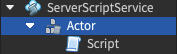
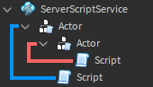
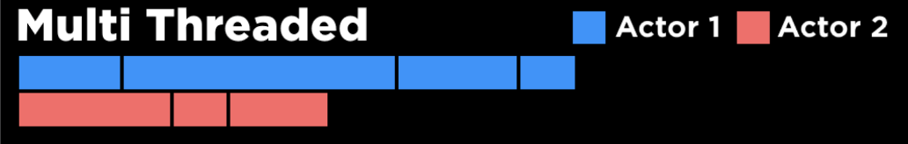
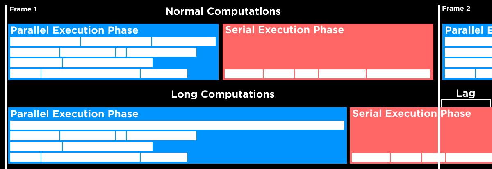
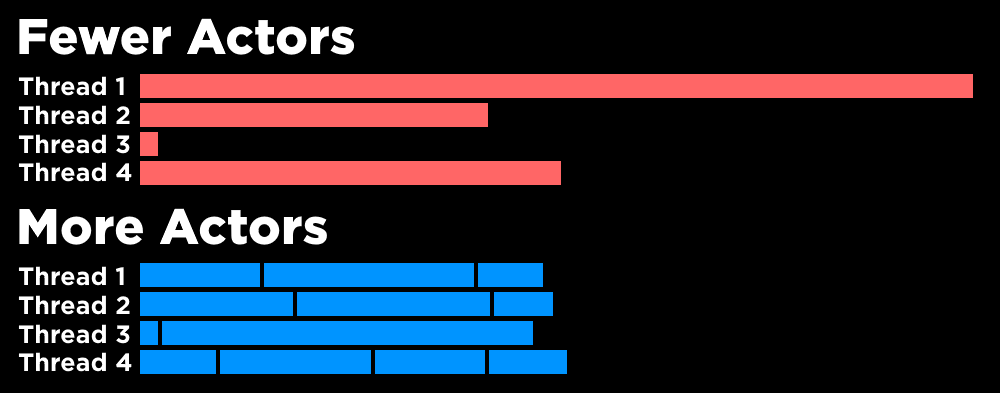

# Parallel Luau

## 목차
- [Parallel Luau](#parallel-luau)
  - [목차](#목차)
  - [병렬 프로그래밍 모델](#병렬-프로그래밍-모델)
  - [코드 분할을 여러 스레드로 분할](#코드-분할을-여러-스레드로-분할)
    - [액터 인스턴스 배치](#액터-인스턴스-배치)
    - [스레드 비동기화](#스레드-비동기화)
    - [스레드 안전성](#스레드-안전성)
  - [스레드 간 통신](#스레드-간-통신)
    - [액터 메시징](#액터-메시징)
    - [공유 테이블](#공유-테이블)
    - [직접 데이터 모델 통신](#직접-데이터-모델-통신)
  - [예제](#예제)
    - [서버 측 레이캐스팅 검증](#서버-측-레이캐스팅-검증)
    - [서버 측 절차적 지형 생성](#서버-측-절차적-지형-생성)
  - [모범 사례](#모범-사례)
  - [출처](#출처)
  - [다음](#다음)

---

**Parallel Luau** 프로그래밍 모델을 사용하면 여러 스레드에서 동시에 코드를 실행하여 경험의 성능을 향상시킬 수 있습니다. 콘텐츠가 늘어나면서 성능과 안전성을 유지하기 위해 이 모델을 채택할 수 있습니다.

<video controls width="100%" src="../img/04_08_Parallel_Luau/parallel-luau.mp4"></video>

## 병렬 프로그래밍 모델

기본적으로 스크립트는 순차적으로 실행됩니다. 만약 NPC(비플레이어 캐릭터), 레이캐스팅 검증, 절차적 생성 등 복잡한 논리나 콘텐츠가 포함된 경험을 만들 경우, 순차 실행은 사용자에게 렉을 유발할 수 있습니다. 병렬 프로그래밍 모델을 사용하면 작업을 여러 쓰레드로 분할하여 병렬로 실행할 수 있습니다. 이를 통해 경험 코드를 더 빠르게 실행하여 사용자 경험을 개선할 수 있습니다.

병렬 프로그래밍 모델은 코드의 안전성도 향상시킵니다. 코드를 여러 스레드로 분할하면 하나의 스레드에서 코드 수정이 다른 병렬로 실행되는 코드에 영향을 미치지 않기 때문에, 하나의 버그가 전체 경험을 망치는 위험을 줄일 수 있습니다. 또한 업데이트를 적용할 때 실시간 서버에서 사용자 지연을 최소화할 수 있습니다.

병렬 프로그래밍 모델을 채택한다고 해서 모든 것을 여러 스레드에 넣어야 한다는 의미는 아닙니다. 예를 들어, 서버 측 레이캐스팅 검증은 개별 사용자마다 병렬로 원격 이벤트를 설정하지만 여전히 글로벌 속성을 변경하기 위해 초기 코드는 순차적으로 실행해야 합니다. 병렬 실행의 일반적인 패턴입니다.

원하는 출력을 달성하려면 대부분의 경우 순차적 단계와 병렬 단계를 결합해야 합니다. 현재 병렬로 지원되지 않는 작업이 있어 스크립트 실행을 방해할 수 있기 때문입니다. 병렬에서 API 사용 수준에 대한 자세한 내용은 스레드 안전성을 참조하세요.

## 코드 분할을 여러 스레드로 분할

경험의 스크립트를 동시에 여러 스레드에서 실행하려면 데이터 모델의 다른 **액터** 아래에서 논리적 청크로 분할해야 합니다. 액터는 `Actor` 인스턴스로 나타내며 `DataModel`에서 상속받습니다. 이들은 실행 격리 단위로 작동하며 여러 코어에서 동시에 실행되는 작업을 분산합니다.

### 액터 인스턴스 배치

액터를 적절한 컨테이너에 배치하거나 NPC 및 레이캐스터와 같은 3D 엔티티의 최상위 인스턴스 유형을 대체한 다음 해당 스크립트를 추가할 수 있습니다.



대부분의 상황에서 데이터 모델에서 한 액터의 자식으로 또 다른 액터를 배치하지 않아야 합니다. 그러나 특정 사용 사례에 맞게 여러 액터에 중첩된 스크립트를 배치하기로 결정한 경우, 스크립트는 가장 가까운 상위 액터에 의해 소유됩니다.


### 스레드 비동기화

액터 아래에 스크립트를 배치하면 병렬 실행 기능이 부여되지만 기본적으로 코드는 여전히 단일 스레드에서 순차적으로 실행됩니다. 성능을 개선하려면 `task.desynchronize()`를 호출해야 합니다. 이 함수는 현재 코루틴의 실행을 일시 중지하고 병렬로 코드를 실행할 다음 병렬 실행 기회에 재개합니다. 스크립트를 다시 순차 실행으로 전환하려면 `task.synchronize()`를 호출합니다.

대안으로, 신호 콜백이 트리거될 때 즉시 병렬로 코드를 실행하도록 예약하려는 경우 `Datatype.RBXScriptSignal:ConnectParallel()` 메서드를 사용할 수 있습니다. 신호 콜백 내에서 `task.desynchronize()`를 호출할 필요가 없습니다.

```lua title='스레드 비동기화'
local RunService = game:GetService("RunService")

RunService.Heartbeat:ConnectParallel(function()
	...  -- 상태 업데이트를 계산하는 병렬 코드

	task.synchronize()

	...  -- 인스턴스 상태를 변경하는 순차 코드
end)
```

<Alert severity="warning">
병렬 비동기화 단계에서는 `require()`를 사용할 수 없습니다. 사용할 스크립트를 먼저 순차적 컨텍스트에서 require 하세요.
</Alert>

같은 액터의 일부인 스크립트는 항상 서로 순차적으로 실행되므로 여러 액터가 필요합니다. 예를 들어, NPC의 병렬 가능 행동 스크립트를 하나의 액터에 모두 넣으면 여전히 단일 스레드에서 순차적으로 실행되지만, 다양한 NPC 로직을 위해 여러 액터를 사용하면 각 액터가 자체 스레드에서 병렬로 실행됩니다. 자세한 내용은 모범 사례를 참조하세요.

<GridContainer numColumns="2">
  <figure>
    
    <figcaption>병렬 코드를 하나의 스레드에서 순차적으로 실행하는 액터</figcaption>
  </figure>
  <figure>
    
    <figcaption>병렬 코드를 여러 스레드에서 동시에 실행하는 액터</figcaption>
  </figure>
</GridContainer>

### 스레드 안전성

병렬 실행 중에는 `DataModel` 계층의 대부분의 인스턴스에 평소와 같이 접근할 수 있지만, 일부 API 속성과 함수는 읽거나 쓸 수 없습니다. 병렬 코드에서 이러한 API를 사용하면 Roblox 엔진이 자동으로 이러한 접근을 감지하고 방지할 수 있습니다.

API 멤버는 병렬 코드에서 사용 가능한지 여부를 나타내는 스레드 안전성 수준을 가지며, 다음 표에 나와 있습니다:

<table>
	<thead>
		<tr>
			<th>안전성 수준</th>
			<th>속성</th>
			<th>함수</th>
		</tr>
	</thead>
	<tbody>
		<tr>
			<td>**비안전**</td>
			<td>병렬로 읽거나 쓸 수 없습니다.</td>
			<td>병렬로 호출할 수 없습니다.</td>
		</tr>
		<tr>
			<td>**병렬 읽기**</td>
			<td>병렬로 읽을 수 있지만 쓸 수는 없습니다.</td>
			<td>N/A</td>
		</tr>
		<tr>
			<td>**로컬 안전**</td>
			<td>같은 액터 내에서 사용할 수 있으며, 다른 `Actor|Actors`에서는 읽을 수 있지만 쓸 수는 없습니다.</td>
			<td>같은 액터 내에서 호출할 수 있으며, 다른 `Actor|Actors`에서는 호출할 수 없습니다.</td>
		</tr>
		<tr>
			<td>**안전**</td>
			<td>읽고 쓸 수 있습니다.</td>
			<td>호출할 수 있습니다.</td>
		</tr>
	</tbody>
</table>

API 멤버에 대한 스레드 안전성 태그는 `API 참조`에서 찾을 수 있습니다. 이를 사용할 때 병렬 스레드 간에 API 호출이나 속성 변경이 어떻게 상호 작용할 수 있는지 고려해야 합니다. 일반적으로 여러 액터가 동일한 데이터를 읽는 것은 안전하지만 다른 액터의 상태를 수정하는 것은 안전하지 않습니다.

<Alert severity="info">
API 멤버가 스레드 안전성 수준을 명시하지 않는 경우 기본적으로 해당 멤버는 **비안전**입니다.
</Alert>

## 스레드 간 통신

멀티스레딩 컨텍스트에서 다른 액터의 스크립트 간에 데이터를 교환하고, 작업을 조정하며, 활동을 동기화하기 위해 여전히 통신을 허용할 수 있습니다. 엔진은 다음과 같은 스레드 간 통신 메커니즘을 지원합니다:

- 스크립트를 사용하여 액터에 메시지를 보내는 액터 메시징 API.
- 여러 액터 간에 많은 데이터를 효율적으로 공유하기 위한 공유 테이블 데이터 구조.
- 제한 사항이 있는 간단한 통신을 위한 직접 데이터 모델 통신.

여러 메커니즘을 지원하여 스레드 간 통신 요구를 충족할 수 있습니다. 예를 들어, 공유 테이블을 액터 메시징 API를 통해 보낼 수 있습니다.

### 액터 메시징

**액터 메시징** API

는 병렬 또는 순차적 컨텍스트에서 스크립트를 사용하여 동일한 데이터 모델 내의 액터에 데이터를 보낼 수 있게 합니다. 이 API를 통한 통신은 비동기적이며, 송신자가 수신자가 메시지를 받을 때까지 차단되지 않습니다.

이 API를 사용하여 메시지를 보낼 때 메시지를 분류하기 위해 **토픽**을 정의해야 합니다. 각 메시지는 단일 액터에게만 보낼 수 있지만, 해당 액터는 내부적으로 메시지에 여러 콜백을 바인딩할 수 있습니다. 액터의 자식인 스크립트만 메시지를 받을 수 있습니다.

API는 다음 메서드를 가지고 있습니다:

- `Actor:SendMessage()`는 액터에 메시지를 보냅니다.
- `Actor:BindToMessage()`는 순차적 컨텍스트에서 지정된 토픽의 메시지에 루아 콜백을 바인딩합니다.
- `Actor:BindToMessageParallel()`는 병렬 컨텍스트에서 지정된 토픽의 메시지에 루아 콜백을 바인딩합니다.

다음 예제는 송신자의 끝에서 `Actor:SendMessage()`를 사용하여 토픽을 정의하고 메시지를 보내는 방법을 보여줍니다:

```lua title="예제 메시지 송신자"
-- "Greeting" 토픽으로 작업자 액터에 두 개의 메시지를 보냅니다.
local workerActor = workspace.WorkerActor
workerActor:SendMessage("Greeting", "Hello World!")
workerActor:SendMessage("Greeting", "Welcome")

print("메시지 전송 완료")
```

다음 예제는 수신자의 끝에서 병렬 컨텍스트에서 특정 토픽에 대한 콜백을 바인딩하기 위해 `Actor:BindToMessageParallel()`를 사용하는 방법을 보여줍니다:

```lua title="예제 메시지 수신자"
-- 이 스크립트가 소속된 액터를 가져옵니다.
local actor = script:GetActor()

-- "Greeting" 메시지 토픽에 대한 콜백을 바인딩합니다.
actor:BindToMessageParallel("Greeting", function(greetingString)
	print(actor.Name, "-", greetingString)
end)

print("메시지 바인딩 완료")
```

### 공유 테이블

`Datatype.SharedTable`은 여러 액터에서 실행되는 스크립트에서 접근할 수 있는 테이블과 유사한 데이터 구조입니다. 많은 데이터를 포함하며 여러 스레드 간에 공통 공유 상태가 필요한 상황에 유용합니다. 예를 들어, 여러 액터가 데이터 모델에 저장되지 않은 공통 월드 상태를 작업할 때 사용할 수 있습니다.

다른 액터에 공유 테이블을 보내는 것은 데이터의 복사본을 만들지 않습니다. 대신, 공유 테이블은 여러 스크립트가 동시에 안전하고 원자적으로 업데이트할 수 있도록 합니다. 한 액터에 의한 공유 테이블의 모든 업데이트는 즉시 모든 액터에게 표시됩니다. 공유 테이블은 구조적 공유를 사용하여 기본 데이터를 복사하지 않고도 리소스를 효율적으로 사용하여 복제할 수도 있습니다.

### 직접 데이터 모델 통신

여러 스레드 간의 통신을 직접 데이터 모델을 사용하여 할 수도 있습니다. 이 경우 서로 다른 액터가 속성이나 속성을 쓰고 나중에 읽을 수 있습니다. 그러나 스레드 안전성을 유지하려면 병렬로 실행되는 스크립트는 일반적으로 데이터 모델을 쓸 수 없습니다. 따라서 통신을 위해 데이터 모델을 직접 사용하는 것은 제한 사항이 있으며 스크립트의 성능에 영향을 줄 수 있는 빈번한 동기화를 강제할 수 있습니다.

## 예제

### 서버 측 레이캐스팅 검증

전투 경험을 위해 사용자 무기에 대한 [레이캐스팅](https://create.roblox.com/docs/workspace/raycasting)을 활성화해야 합니다. 지연을 줄이기 위해 클라이언트에서 무기를 시뮬레이션하고 서버는 히트를 확인해야 하며, 이는 레이캐스팅과 예상 캐릭터 속도를 계산하고 과거 행동을 검토하는 일부 휴리스틱을 포함합니다.

클라이언트가 히트 정보를 통신하기 위해 사용하는 원격 이벤트에 연결된 단일 중앙 집중식 스크립트를 사용하는 대신, 서버 측에서 병렬로 각 사용자 캐릭터에 대한 히트 검증 프로세스를 실행할 수 있습니다.

해당 캐릭터의 `Actor` 아래에서 실행되는 서버 측 스크립트는 이 원격 이벤트에 병렬 연결을 사용하여 관련 논리를 실행하여 히트를 확인합니다. 논리가 히트를 확인하면 데미지를 차감하며, 이는 순차적으로 실행됩니다.

```lua
local tool = script.Parent.Parent

local remoteEvent = Instance.new("RemoteEvent")  -- 새로운 원격 이벤트 생성 및 도구에 부모 설정
remoteEvent.Name = "RemoteMouseEvent"  -- 로컬 스크립트가 찾을 수 있도록 이름 변경
remoteEvent.Parent = tool
local remoteEventConnection  -- 원격 이벤트 연결에 대한 참조 생성

-- 원격 이벤트를 수신하는 함수
local function onRemoteMouseEvent(player: Player, clickLocation: CFrame)
	-- 순차적: 순차적으로 실행되는 초기 설정 코드
	local character = player.Character
	-- 레이캐스팅 중 사용자 캐릭터를 제외
	local params = RaycastParams.new()
	params.FilterType = Enum.RaycastFilterType.Exclude
	params.FilterDescendantsInstances = { character }

	-- 병렬: 병렬로 레이캐스팅 수행
	task.desynchronize()
	local origin = tool.Handle.CFrame.Position
	local epsilon = 0.01  -- 클릭 위치가 객체에서 약간 벗어날 수 있으므로 레이를 약간 확장하는 데 사용
	local lookDirection = (1 + epsilon) * (clickLocation.Position - origin)
	local raycastResult = workspace:Raycast(origin, lookDirection, params)
	if raycastResult then
		local hitPart = raycastResult.Instance
		if hitPart and hitPart.Name == "block" then
			local explosion = Instance.new("Explosion")

			-- 순차적: 아래 코드는 액터 외부의 상태를 수정합니다
			task.synchronize()
			explosion.DestroyJointRadiusPercent = 0  -- 폭발을 치명적이지 않게 설정
			explosion.Position = clickLocation.Position

			-- 여러 액터가 레이캐스팅에서 동일한 부분을 얻고 이를 파괴하기로 결정할 수 있습니다
			-- 이는 안전하지만 동시에 두 개의 폭발이 발생하여 하나 대신 두 개의 폭발이 발생합니다
			-- 아래는 실행이 이 부분에 먼저 도달했는지 두 번 확인합니다
			if hitPart.Parent then
				explosion.Parent = workspace
				hitPart:Destroy()  -- 파괴
			end
		end
	end
end

-- 초기 설정 코드가 병렬로 실행될 수 없으므로 처음에는 순차적으로 신호 연결
remoteEventConnection = remoteEvent.OnServerEvent:Connect(onRemoteMouseEvent)
```

### 서버 측 절차적 지형 생성

경험을 위해 방대한 세계를 만들려면 동적으로 세계를 채워야 합니다. 절차적 생성은 일반적으로 개별 지형 청크를 생성하며, 생성기는 객체 배치, 재료 사용 및 보셀 채우기를 위한 상대적으로 복잡한 계산을 수행합니다. 병렬로 생성 코드를 실행하면 프로세스의 효율성을 높일 수 있습니다. 다음 코드 샘플은 예시입니다.

```lua
-- 병렬 실행에는 액터 사용이 필요합니다
-- 이 스크립트는 스스로 복제됩니다. 원본은 프로세스를 시작하고 클론은 작업자 역할을 합니다.

local actor = script:GetActor()
if actor == nil then
	local workers = {}
	for i = 1, 32 do
		local actor = Instance.new("Actor")
		script:Clone().Parent = actor
		table.insert(workers, actor)
	end
	
	-- 모든 액터를 자신 아래에 부모 설정
	for _, actor in workers do
		actor.Parent = script
	end
	
	-- 메시지를 보내 액터들에게 지형을 생성하도록 지시
	-- 이 예제에서는 액터가 무작위로 선택됩니다
	task.defer(function()
		local rand = Random.new()
		local seed = rand:NextNumber()
		
		local sz = 10
		for x = -sz, sz do
			for y = -sz, sz do
				for z = -sz, sz do
					workers[rand:NextInteger(1, #workers)]:SendMessage("GenerateChunk", x, y, z, seed)
				end
			end
		end
	end)
	
	-- 원본 스크립트에서 종료; 나머지 코드는 각 액터에서 실행됩니다
	return
end

function makeNdArray(numDim, size, elemValue)
	if numDim == 0 then
		return elemValue
	end
	local result = {}
	for i = 1, size do
		result[i] = makeNdArray(numDim - 1, size, elemValue)
	end
	return result
end

function generateVoxelsWithSeed(xd, yd, zd, seed)
	local matEnums = {Enum.Material.CrackedLava, Enum.Material.Basalt, Enum.Material.Asphalt}
	local materials = makeNdArray(3, 4, Enum.Material.CrackedLava)
	local occupancy = make

NdArray(3, 4, 1)
	
	local rand = Random.new()
	
	for x = 0, 3 do
		for y = 0, 3 do
			for z = 0, 3 do
				occupancy[x + 1][y + 1][z + 1] = math.noise(xd + 0.25 * x, yd + 0.25 * y, zd + 0.25 * z)
				materials[x + 1][y + 1][z + 1] = matEnums[rand:NextInteger(1, #matEnums)]
			end
		end
	end
	
	return {materials = materials, occupancy = occupancy}
end

-- 병렬 실행 컨텍스트에서 호출될 콜백 바인딩
actor:BindToMessageParallel("GenerateChunk", function(x, y, z, seed)
	local voxels = generateVoxelsWithSeed(x, y, z, seed)
	local corner = Vector3.new(x * 16, y * 16, z * 16)
	
	-- 현재 WriteVoxels()는 순차적 단계에서 호출되어야 합니다
	task.synchronize()
	workspace.Terrain:WriteVoxels(
		Region3.new(corner, corner + Vector3.new(16, 16, 16)),
		4,
		voxels.materials,
		voxels.occupancy
	)
end)
```

## 모범 사례

병렬 프로그래밍의 최대 이점을 적용하려면 루아 코드를 추가할 때 다음 모범 사례를 참조하세요:

- **긴 계산을 피하십시오** — 병렬에서도 긴 계산은 다른 스크립트의 실행을 차단하고 렉을 유발할 수 있습니다. 대량의 긴 계산을 처리하기 위해 병렬 프로그래밍을 사용하는 것을 피하십시오.

   

- **적절한 수의 액터를 사용하십시오** — 최고의 성능을 위해서는 더 많은 `Actors`를 사용하세요. 장치에 `Actors`보다 코어가 적더라도 세분화는 코어 간의 부하 균형을 더 효율적으로 할 수 있게 합니다.

   

   이는 가능한 한 많은 `Actors`를 사용해야 한다는 의미는 아닙니다. 여전히 연결된 논리를 다른 `Actors`로 분할하지 않고 논리 단위로 `Actors`로 코드를 나누어야 합니다. 예를 들어, 병렬로 레이캐스팅 검증을 활성화하려면 4개의 `Actors` 대신 64개 이상의 `Actors`를 사용하는 것이 합리적입니다. 이는 시스템의 확장성을 높이고 기본 하드웨어의 성능에 따라 작업을 분산할 수 있게 합니다. 그러나 너무 많은 `Actors`를 사용하는 것은 유지 관리가 어려울 수 있습니다.

---
## 출처
 - [Parallel Luau](https://create.roblox.com/docs/scripting/multithreading)

---
## [다음](./04_09_Native_Code_Generation.md)