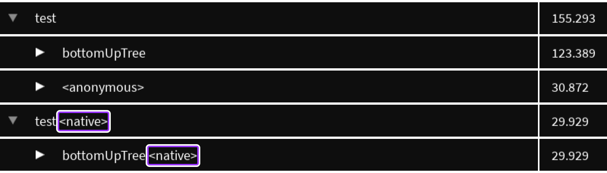
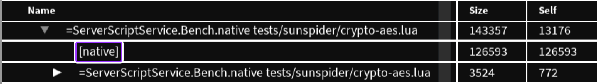
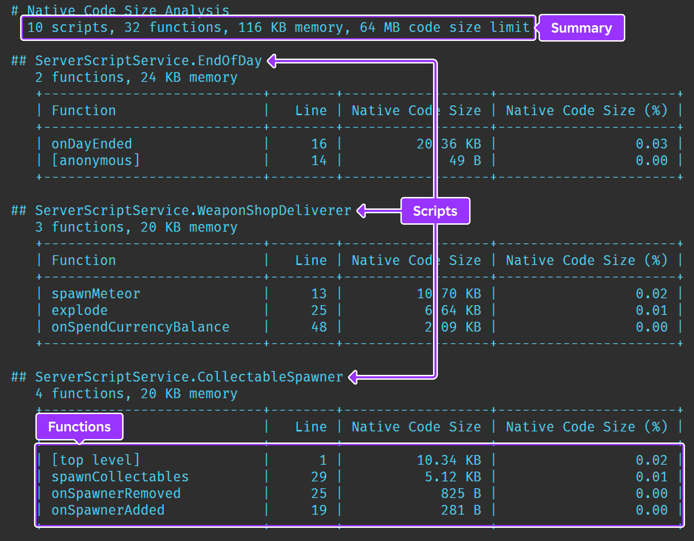

# Native Code Generation

## 목차
- [Native Code Generation](#native-code-generation)
	- [목차](#목차)
	- [네이티브 활성화](#네이티브-활성화)
	- [모범 사례](#모범-사례)
	- [피해야 할 코드](#피해야-할-코드)
	- [형식 주석 사용](#형식-주석-사용)
	- [Studio 도구](#studio-도구)
		- [디버깅](#디버깅)
		- [스크립트 프로파일러](#스크립트-프로파일러)
		- [Luau 힙](#luau-힙)
		- [크기 분석](#크기-분석)
	- [제한 사항 및 문제 해결](#제한-사항-및-문제-해결)
	- [출처](#출처)
	- [다음](#다음)

---

Luau의 네이티브 코드 생성 지원으로 인해, 경험 내 서버 측 스크립트는 Luau VM이 작동하는 일반 바이트코드가 아닌 CPU가 실행하는 기계 코드 명령으로 직접 컴파일될 수 있습니다. 이 기능은 특히 많은 수치 계산을 수행하고, 많은 Luau 라이브러리나 Roblox API 호출을 사용하지 않는 스크립트의 실행 속도를 향상시킬 수 있습니다.

## 네이티브 활성화

`Script`에 대한 네이티브 코드 생성을 활성화하려면, 스크립트 상단에 `--!native` 주석을 추가하십시오:&sup1;

```lua highlight="1"
--!native

print("네이티브 코드에서 인사드립니다!")
```

이것은 스크립트의 모든 함수와 최상위 범위에서 네이티브 코드 생성을 활성화합니다. 추가 변경 사항은 필요하지 않습니다. 네이티브로 실행되는 스크립트의 동작은 이전과 동일하며, 성능만 다릅니다. Luau 언어의 모든 기능과 모든 Roblox API는 계속 지원됩니다.

또한, 개별 함수에 대해 네이티브 코드 생성을 활성화하려면 `@native` 속성을 추가하십시오:

```lua highlight="1"
@native
local function f(x)
  return (x + 1)
end
```

<figcaption><sup>1</sup> 향후 일부 스크립트는 유익하다고 판단될 경우 자동으로 네이티브로 실행되기 시작할 수 있지만, 현재는 수동으로 `--!native` 주석을 추가해야 합니다.</figcaption>

## 모범 사례

다음 팁은 네이티브 코드 생성에서 최대의 이점을 얻는 데 도움이 됩니다:

- 이 기능을 Luau 내부에서 직접 많은 계산을 수행하는 스크립트 내에서 사용하는 것이 좋습니다. 테이블과 특히 `Library.buffer` 유형에 대해 많은 수학적 연산을 수행하는 경우, 이 스크립트는 좋은 후보가 될 수 있습니다.

- 스크립트의 함수만 네이티브로 컴파일됩니다. 최상위 범위의 코드는 종종 한 번만 실행되며, 매 프레임마다 호출되는 함수처럼 많은 이점을 얻지 못합니다.

- 네이티브 컴파일 여부를 판단하기 위해 스크립트나 함수의 실행 시간을 측정하는 것이 좋습니다. 스크립트 프로파일러 도구를 사용하여 함수의 성능을 측정하여 정보에 입각한 결정을 내릴 수 있습니다.

- 모든 스크립트에 `--!native` 주석을 추가하면 일부가 더 빠르게 실행될 수 있지만, 네이티브 코드 생성에는 몇 가지 단점이 있습니다:

  - 코드 컴파일 시간이 필요하여 서버의 시작 시간이 증가할 수 있습니다.
  - 네이티브로 컴파일된 코드를 저장하기 위해 추가 메모리가 필요합니다.
  - 경험 내 네이티브로 컴파일된 코드의 총 허용량에 제한이 있습니다.

이 문제들은 `@native` 속성을 신중하게 사용함으로써 해결할 수 있습니다.

## 피해야 할 코드

네이티브 코드 생성이 활성화된 상태에서도 모든 기능이 동일하게 동작하지만, 일부는 네이티브로 실행되지 않으며 비최적화나 인터프리터 실행으로 돌아갈 수 있습니다. 이러한 경우는 다음과 같습니다:

- 사용되지 않는 `Global.LuaGlobals.getfenv()`/`Global.LuaGlobals.setfenv()` 호출.
- 비수치 인수를 사용하는 `Library.math.asin()`과 같은 다양한 Luau 내장 함수 사용.
- 형식화된 함수에 부적절하게 형식화된 매개변수를 전달하는 경우, 예를 들어 `foo`를 `function foo(arg: string)`로 선언했을 때 `foo(true)`를 호출하는 경우. 항상 올바른 형식 주석을 사용하십시오.

스크립트 프로파일러를 사용할 때, 네이티브로 컴파일된 버전과 일반 버전의 함수가 소요된 시간을 비교할 수 있습니다. `--!native` 스크립트 내 함수나 `@native`로 표시된 함수가 네이티브로 실행되지 않는 경우, 위 목록의 한 가지 이상 요소가 비최적화를 유발하고 있을 수 있습니다.

## 형식 주석 사용

네이티브 코드 생성은 코드 경로를 최적화하기 위해 주어진 변수의 가장 가능성이 높은 형식을 추론하려고 합니다. 예를 들어, `a + b`가 숫자에 대해 수행된다고 가정하거나, `t.X`에서 테이블이 액세스된다고 가정합니다. 그러나 연산자 오버로딩을 감안할 때, `a`와 `b`는 테이블이나 `Datatype.Vector3` 유형일 수 있으며, `t`는 Roblox 데이터 유형일 수 있습니다.

네이티브 코드 생성은 모든 형식을 지원하지만, 예측이 잘못되면 불필요한 검사가 발생하여 코드 실행 속도가 느려질 수 있습니다.

일부 일반적인 문제를 해결하기 위해 함수 인수에 Luau 형식 주석을 사용합니다. 특히 `Datatype.Vector3` 인수에 주석을 다는 것이 좋습니다:

```lua
--!native

-- "v"는 테이블로 간주됩니다; 함수가 테이블 검사로 인해 느리게 실행됩니다
local function sumComponentsSlow(v)
	return v.X + v.Y + v.Z
end

-- "v"는 Vector3로 선언됩니다; 벡터에 특화된 코드가 생성됩니다
local function sumComponentsFast(v: Vector3)
	return v.X + v.Y + v.Z
end
```

## Studio 도구

다음 Studio 도구는 `--!native` 스크립트와 `@native` 함수에 대해 지원됩니다.

### 디버깅

일반 디버깅이 지원되지만, 로컬/업값에 대한 뷰는 불완전할 수 있으며 네이티브로 실행되는 호출 스택 프레임에서 변수가 누락될 수 있습니다.

또한, 네이티브 컴파일이 선택된 코드를 디버깅할 때 중단점을 설정하면 해당 함수의 네이티브 실행이 비활성화됩니다.

### 스크립트 프로파일러

스크립트 프로파일러에서는 네이티브로 실행되는 함수 옆에 `<native>`가 표시됩니다:



`@native`로 표시된 함수나 `--!native` 스크립트 내 함수가 `<native>` 주석을 표시하지 않는 경우, 해당 함수가 중단점 설정, 권장되지 않는 코드 사용 또는 형식 주석 불일치로 인해 네이티브로 실행되지 않을 수 있습니다.

### Luau 힙

Luau 힙 프로파일러에서는 네이티브 함수가 차지하는 메모리가 그래프에 `[native]` 요소로 표시됩니다.



### 크기 분석

모든 네이티브로 컴파일된 스크립트는 메모리를 소비합니다. 컴파일된 코드의 크기가 미리 정의된 한도에 도달하면 네이티브 컴파일이 중지되고 나머지 코드는 비네이티브로 실행됩니다. 따라서 스크립트를 네이티브로 컴파일할 때 신중하게 선택하는 것이 중요합니다.

개별 함수와 스크립트의 네이티브 코드 크기를 모니터링하려면:

1. 클라이언트/서버 전환 버튼을 통해 **서버** 보기에 있는지 확인하십시오.
2. 명령줄에서 `debug.dumpcodesize()`를 호출하십시오.

출력 창에서 호출 시점까지 네이티브로 컴파일된 스크립트와 함수의 총 수, 네이티브 코드가 차지하는 메모리, 네이티브 코드 크기 한도를 확인할 수 있습니다. 요약 후, 네이티브로 컴파일된 각 스크립트에 대한 테이블이 코드 크기 내림차순으로 표시됩니다.



각 스크립트에 대해, 컴파일된 함수의 수

와 네이티브 코드 메모리 소비량이 표시됩니다. 각 함수는 네이티브 코드 크기 내림차순으로 나열되며, 익명 함수는 `[anonymous]`로 표시되고 전체 스크립트는 `[top level]`로 표시됩니다. 마지막 열에서는 네이티브 코드 크기 한도와 관련하여 백분율이 계산됩니다. 함수의 네이티브 코드 크기는 정확하게 보고되지만, 스크립트의 메모리 소비량은 가장 가까운 페이지 크기로 반올림됩니다.

## 제한 사항 및 문제 해결

코드를 특정 CPU의 명령으로 컴파일하려면 추가 저장 메모리가 필요합니다. 또한, 복잡한 함수에 대한 최적화는 수행하는 데 너무 많은 시간이 소요될 수 있습니다. 내부 한도에 도달하면 Studio의 출력 창에 오류가 보고됩니다. 다음은 해당 오류의 예입니다:

<blockquote>
_Function 'f' at line 20 exceeded single code block instruction limit_

이 오류는 함수 내부의 단일 코드 블록이 64K 명령을 초과했음을 의미합니다. 이 문제를 피하려면 함수를 단순화하거나 개별 작은 함수로 분할하십시오.
</blockquote>

<blockquote>
_Function 'f' at line 20 exceeded function code block limit_

이 오류는 단일 함수가 32K 이상의 내부 코드 블록을 포함하고 있음을 의미합니다. 내부 코드 블록은 스크립트의 제어 흐름 블록과 정확히 일치하지 않지만, 이 오류는 함수의 제어 흐름을 단순화하거나 개별 작은 함수로 분할하여 피할 수 있습니다.
</blockquote>

<blockquote>
_Function 'f' at line 200 exceeded total module instruction limit_

이 오류는 전체적으로 함수가 스크립트의 총 명령 제한인 100만 명령에 도달했음을 의미합니다. 경우에 따라 보고된 함수 자체에 많은 명령이 포함될 수 있으며, 또는 스크립트 내 이전 함수에 의해 제한에 도달할 수 있습니다. 이 문제를 피하려면, 특히 큰 함수를 별도의 비네이티브 스크립트로 이동하거나 다른 함수에 `@native`를 사용하는 것이 좋습니다. 또한, 별도의 스크립트를 `--!native`로 표시할 수 있지만, 100만 명령은 많은 메모리를 차지하여 메모리 한도를 초과할 수 있습니다.
</blockquote>

<blockquote>
_Function 'f' at line 20 encountered an internal lowering failure_ **(or)** <br />
_Internal error: Native code generation failed (assembly lowering)_

때때로 함수에는 네이티브 코드 컴파일러가 현재 처리할 수 없는 복잡한 코드가 포함되어 있습니다. 이 오류를 피하려면 코드의 복잡한 표현식을 검사하고 분할하거나 단순화하십시오. 또한, 이 이유로 실패한 코드의 예와 함께 버그 보고서를 제출하는 것이 좋습니다.
</blockquote>

<blockquote>
_Memory allocation limit reached for native code generation_

이 오류는 네이티브 코드 데이터의 전체 메모리 한도에 도달했음을 의미합니다. 이 문제를 피하려면, 메모리 소모가 큰 스크립트에서 `--!native`를 제거하여 더 작은 스크립트가 한도 내에 맞도록 하십시오. 또는, 큰 함수나 자주 호출되지 않는 함수를 별도의 비네이티브 모듈로 이동하십시오.
</blockquote>

---
## 출처
 - [Native Code Generation](https://create.roblox.com/docs/luau/native-code-gen)

---
## [다음](./04_10_security_tactics.md)