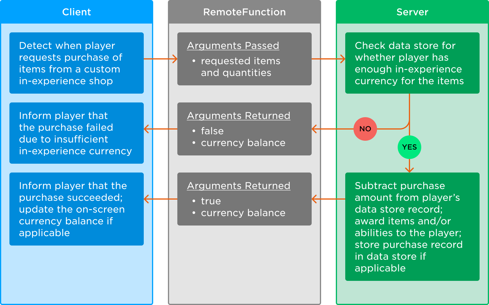
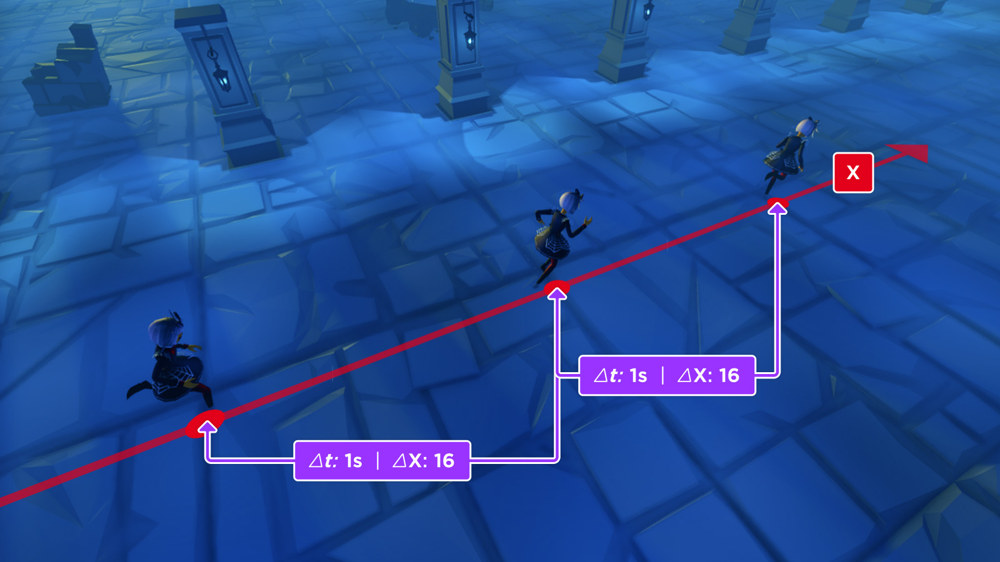
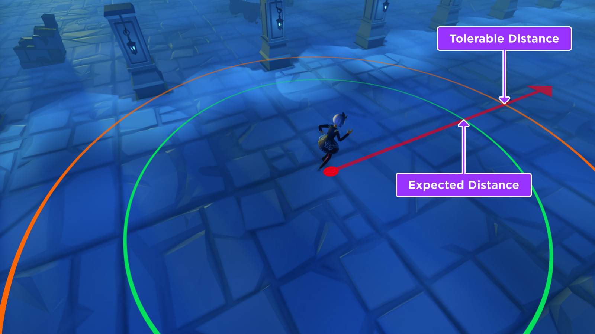

# Security Tactics and Cheat Mitigation

## 목차
- [Security Tactics and Cheat Mitigation](#security-tactics-and-cheat-mitigation)
	- [목차](#목차)
	- [방어적 설계 전술](#방어적-설계-전술)
	- [서버 측 완화](#서버-측-완화)
		- [원격 런타임 유형 검증](#원격-런타임-유형-검증)
		- [데이터 검증](#데이터-검증)
		- [값 검증](#값-검증)
			- [경험 내 상점](#경험-내-상점)
			- [무기 조준 시스템](#무기-조준-시스템)
			- [DataStore 조작](#datastore-조작)
		- [원격 제한](#원격-제한)
		- [이동 검증](#이동-검증)
	- [출처](#출처)
	- [다음](#다음)

---

Roblox는 분산 물리 시스템을 사용하여 클라이언트가 제어하는 객체의 물리 시뮬레이션을 관리합니다. 일반적으로 이는 플레이어의 캐릭터와 해당 캐릭터 근처의 고정되지 않은 객체를 의미합니다. 또한, 제3자 소프트웨어를 통해 공격자는 클라이언트에서 임의의 Lua 코드를 실행하여 데이터 모델을 조작하고 실행 중인 코드를 디컴파일하여 볼 수 있습니다.

이는 숙련된 공격자가 다음과 같은 방법으로 게임에서 치트를 실행할 수 있음을 의미합니다:

- 자신의 캐릭터를 임의로 텔레포트하기
- 보안을 설정하지 않은 `RemoteEvents`를 발사하거나 `RemoteFunctions`을 호출하여 아이템을 획득하지 않고도 자신에게 부여하기
- 캐릭터의 `WalkSpeed`를 조정하여 매우 빠르게 이동시키기

일반적인 공격을 방지하기 위해 제한된 `설계 방어`를 구현할 수 있지만, 서버가 실행 중인 경험의 최종 권한을 가지므로 더 신뢰할 수 있는 `서버 측 완화 전술`을 구현하는 것이 좋습니다.

## 방어적 설계 전술

기본적인 설계 결정은 초기 보안 조치로서 익스플로잇을 억제할 수 있습니다. 예를 들어, 플레이어가 다른 플레이어를 죽여서 점수를 얻는 슈팅 게임에서 공격자는 점수를 빨리 얻기 위해 같은 장소로 텔레포트하는 봇을 만들 수 있습니다. 이러한 잠재적인 익스플로잇을 고려할 때 두 가지 접근 방식과 예상 결과를 살펴보겠습니다:

<table>
<thead>
  <tr>
    <th>접근 방식</th>
    <th>예상 결과</th>
  </tr>
</thead>
<tbody>
  <tr>
    <td>코드를 작성하여 봇을 감지하려고 시도합니다.</td>
    <td>
	<Alert severity="error" style={{marginBottom:"0px;"}}>
    빠른 점수를 얻으려는 공격자는 복잡한 감지 코드를 우회하여 다른 방법으로 봇을 사용할 것입니다.
	</Alert>
	</td>
  </tr>
  <tr>
    <td>새로 스폰된 플레이어를 죽일 때 얻는 점수를 줄이거나 완전히 제거합니다.</td>
    <td>
	<Alert severity="success" style={{marginBottom:"0px;"}}>
    공격자는 봇을 즉시 죽여도 점수를 얻지 못하므로 더 많은 시간과 노력이 필요하게 됩니다. 또한, "스폰 캠핑"을 하는 플레이어도 더 이상 새로 스폰된 플레이어를 죽여도 점수를 얻지 못하므로 억제됩니다.
	</Alert>
	</td>
  </tr>
</tbody>
</table>

방어적 설계가 완벽하거나 포괄적인 솔루션은 아니지만, `서버 측 완화`와 함께 보다 넓은 보안 접근 방식에 기여할 수 있습니다.

## 서버 측 완화

가능한 한 **서버**가 "진실"과 현재 세계 상태에 대해 최종 판결을 내려야 합니다. 클라이언트는 물론 서버에 변경 사항을 요청하거나 작업을 수행할 수 있지만, 서버는 이러한 변경/작업을 **검증하고 승인**한 후 결과를 다른 플레이어에게 복제해야 합니다.

일부 물리 작업을 제외하고, 클라이언트의 데이터 모델에 대한 변경 사항은 서버로 복제되지 않으므로 주요 공격 경로는 `RemoteEvents` 및 `RemoteFunctions`을 통해 선언한 네트워크 이벤트를 통해 이루어집니다. 공격자가 클라이언트에서 자신의 코드를 실행하면 원하는 데이터를 사용하여 이를 호출할 수 있다는 점을 기억하십시오.

### 원격 런타임 유형 검증

공격 경로 중 하나는 공격자가 `RemoteEvents` 및 `RemoteFunctions`을 잘못된 유형의 인수로 호출하는 것입니다. 일부 시나리오에서는 서버가 이러한 원격을 청취하는 코드가 오류를 발생시켜 공격자에게 유리한 결과를 초래할 수 있습니다.

원격 이벤트/함수를 사용할 때, 서버에서 전달된 인수의 **유형**을 검증하여 이러한 유형의 공격을 방지할 수 있습니다. 모듈 **"t"**는 이러한 유형 검사를 위한 유용한 도구입니다. 예를 들어, 모듈의 코드가 `ReplicatedStorage` 내부의 **t**라는 `ModuleScript`로 존재한다고 가정합니다:

```lua title="StarterPlayerScripts의 LocalScript" highlight="6"
local ReplicatedStorage = game:GetService("ReplicatedStorage")

local remoteFunction = ReplicatedStorage:WaitForChild("RemoteFunctionTest")

-- 함수 호출 시 파트 색상과 위치 전달
local newPart = remoteFunction:InvokeServer(Color3.fromRGB(200, 0, 50), Vector3.new(0, 25, 0))

if newPart then
	print("서버가 요청된 파트를 생성했습니다:", newPart)
elseif newPart == false then
	print("서버가 요청을 거부했습니다. 파트가 생성되지 않았습니다.")
end
```

```lua title="ServerScriptService의 Script" highlight="4, 7, 12, 18, 29"
local ReplicatedStorage = game:GetService("ReplicatedStorage")

local remoteFunction = ReplicatedStorage:WaitForChild("RemoteFunctionTest")
local t = require(ReplicatedStorage:WaitForChild("t"))

-- 불필요한 오버헤드를 피하기 위해 미리 유형 검증기 생성
local createPartTypeValidator = t.tuple(t.instanceIsA("Player"), t.Color3, t.Vector3)

-- 전달된 속성으로 새 파트 생성
local function createPart(player, partColor, partPosition)
	-- 전달된 인수 유형 검사
	if not createPartTypeValidator(player, partColor, partPosition) then
		-- 여기서 유형 검사가 실패하면 "false"를 조용히 반환합니다.
		-- 쿨다운 없이 오류를 발생시키면 서버를 느리게 만들 수 있습니다.
		-- 대신 클라이언트 피드백을 제공하세요!

		return false
	end

	print(player.Name .. "이(가) 새 파트를 요청했습니다.")
	local newPart = Instance.new("Part")
	newPart.Color = partColor
	newPart.Position = partPosition
	newPart.Parent = workspace
	return newPart
end

-- 원격 함수의 콜백에 "createPart()" 바인딩
remoteFunction.OnServerInvoke = createPart
```

### 데이터 검증

다른 공격으로는 `기술적으로 유효한 유형`의 데이터를 보내지만, 매우 크거나 길거나 잘못된 형식을 사용하는 경우가 있습니다. 예를 들어, 서버가 문자열 길이에 따라 확장되는 비용이 많이 드는 작업을 수행해야 할 경우, 공격자는 매우 큰 또는 잘못된 형식의 문자열을 보내 서버를 느리게 만들 수 있습니다.

마찬가지로, `inf` 및 `NaN`은 `Global.LuaGlobals.type()`으로 `number`로 인식되지만, 이를 처리하지 않으면 주요 문제가 발생할 수 있습니다. 다음과 같은 함수를 통해 이를 처리할 수 있습니다:

```lua
local function isNaN(n: number): boolean
	-- NaN은 자신과 결코 같지 않습니다.
	return n ~= n
end

local function isInf(n: number): boolean
	-- 숫자는 -inf 또는 inf일 수 있습니다.
	return math.abs(n) == math.huge
end
```

공격자가 사용하는 또 다른 일반적인 공격은 `Instance` 대신 `tables`를 보내는 것입니다. 복잡한 페이로드는 일반 객체 참조를 모방할 수 있습니다.

예를 들어, 아이템 데이터가 `NumberValue` 객체에 저장된 경험 내 상점 시스템을 제공할 때, 공격자는 다음과 같은 방법으로 모든 다른 검사를 우회할 수 있습니다:

```lua title="StarterPlayerScripts의 LocalScript" highlight="5, 17, 20"
local ReplicatedStorage = game:GetService("ReplicatedStorage")

local itemDataFolder = ReplicatedStorage:WaitForChild("ItemData")
local buyItemEvent = ReplicatedStorage:WaitForChild("BuyItemEvent")
local payload = {
	Name = "Ultra Blade",
	ClassName = "Folder",
	Parent = itemDataFolder,
	Price = {
		Name = "Price",
		ClassName = "NumberValue",
		Value = 0,  -- 부정적인 값도 사용하여 통화를 빼앗는 대신 부여할 수 있습니다!
	},
}

-- 서버에 악성 페이로드 전송 (이것은 거부될 것입니다)
print(buyItemEvent:InvokeServer(payload))  -- "Invalid item provided"를 출력합니다.

-- 서버에 실제 아이템 전송 (이것은 통과될 것입니다!)
print(buyItemEvent:InvokeServer(itemDatafolder["Real Blade"]))  -- 구매가 성공하면 "true" 및 남은 통화를 출력합니다.
```

```lua title="ServerScriptService의 Script" highlight="7-10"
local ReplicatedStorage = game:GetService("ReplicatedStorage")

local itemDataFolder = ReplicatedStorage:WaitForChild("ItemData")
local buyItemEvent = ReplicatedStorage:WaitForChild("BuyItemEvent")

local function buyItem(player, item)
	-- 전달된 아이템이 위조되지 않았고 ItemData 폴더에 있는지 확인합니다.
	if typeof(item) ~= "Instance" or not item:IsDescendantOf(itemDataFolder) then
		return false, "유효하지 않은 아이템 제공됨"
	end

	-- 서버는 그 후 예제 흐름을 기반으로 구매를 처리할 수 있습니다.
end

-- 원격 함수의 콜백에 "buyItem()" 바인딩
buyItemEvent.OnServerInvoke = buyItem
```

### 값 검증

유형 및 데이터를 검증하는 것 외에도, `RemoteEvents` 및 `RemoteFunctions`을 통해 전달되는 **값**이 요청된 컨텍스트에서 유효하고 논리적인지 확인해야 합니다. 두 가지 일반적인 예는 `경험 내 상점`과 `무기 조준 시스템`입니다.

#### 경험 내 상점

사용자 인터페이스가 있는 경험 내 상점 시스템을 고려해 보십시오. 예를 들어, 제품 선택 메뉴와 "구매" 버튼이 있습니다. 버튼을 누르면 클라이언트와 서버 간에 `RemoteFunction`을 호출하여 구매를 요청할 수 있습니다. 그러나 가장 신뢰할 수 있는 경험 관리자 역할을 하는 **서버**가 사용자가 아이템을 구매할 수 있는 충분한 돈이 있는지 확인해야 합니다.

<figure>
  
  <figcaption>`RemoteFunction`을 통한 클라이언트에서 서버로의 예제 구매 흐름</figcaption>
</figure>

#### 무기 조준 시스템

전투 시나리오에서는 조준 및 명중 검증을 통한 값 검증에 특별한 주의를 기울여야 합니다.

플레이어가 레이저 빔을 다른 플레이어에게 발사할 수 있는 게임을 상상해 보십시오. 클라이언트가 서버에 **누구를** 피해를 입힐지 말하는 대신, 서버에 발사 위치와 명중했다고 생각하는 위치를 알려야 합니다. 서버는 다음 사항을 검증할 수 있습니다:

- 클라이언트가 **발사한 위치**가 서버의 플레이어 캐릭터 근처에 있는지 확인합니다. 서버와 클라이언트 간의 지연으로 인해 약간의 오차가 발생할 수 있으므로 추가적인 허용 오차가 필요합니다.
- 클라이언트가 **명중한 위치**가 서버의 **명중한 파트** 위치와 합리적으로 가까운지 확인합니다.
- 클라이언트가 보고한 발사 위치와 명중 위치 사이에 정적 장애물이 없는지 확인합니다. 이 검사는 클라이언트가 벽을 통과해 발사하려는 시도를 방지합니다. 이 검사는 지연으로 인해 유효한 발사가 거부되지 않도록 정적 지형만을 검사해야 합니다.

**추가적으로**, 다음과 같은 서버 측 검증을 구현하는 것이 좋습니다:

- 플레이어가 마지막으로 무기를 발사한 시간을 추적하고 너무 빠르게 발사하지 않도록 검증합니다.
- 각 플레이어의 탄약 양을 서버에서 추적하고, 발사하는 플레이어가 공격을 실행할 충분한 탄약이 있는지 확인합니다.
- 팀 또는 "플레이어 대 봇" 전투 시스템을 구현한 경우, 명중한 캐릭터가 적인지, 팀원인지 확인합니다.
- 명중한 플레이어가 살아 있는지 확인합니다.
- 서버에서 무기 및 플레이어 상태를 저장하고, 발사하는 플레이어가 재장전 중이거나 달리는 상태와 같은 현재 행동으로 인해 차단되지 않았는지 확인합니다.

#### DataStore 조작

`DataStoreService`를 사용하여 플레이어 데이터를 저장하는 경험에서, 공격자는 유효하지 않은 데이터와 더 모호한 방법을 악용하여 `DataStore`가 제대로 저장되지 않도록 할 수 있습니다. 이는 특히 아이템 거래, 마켓플레이스 및 유사한 시스템이 있는 경험에서 악용될 수 있으며, 아이템이나 통화가 플레이어의 인벤토리에서 사라질 수 있습니다.

클라이언트 입력을 통해 플레이어 데이터에 영향을 미치는 `RemoteEvent` 또는 `RemoteFunction`을 통해 수행되는 모든 작업은 다음 기준에 따라 정리되어야 합니다:

- `Instance` 값은 `DataStore`로 직렬화할 수 없으며 실패할 수 있습니다. 이를 방지하려면 `유형 검증`을 사용하십시오.
- `DataStores`에는 `데이터 제한`이 있습니다. 임의의 길이의 문자열은 확인하거나 제한하여 이 문제를 피하고, 클라이언트가 무한한 임의의 키를 테이블에 추가할 수 없도록 해야 합니다.
- 테이블 인덱스는 `NaN` 또는 `nil`일 수 없습니다. 클라이언트가 전달한 모든 테이블을 반복하여 모든 인덱스가 유효한지 확인하십시오.
- `DataStores`는 유효한 UTF-8 문자만 허용하므로 `utf8.len()`을 사용하여 클라이언트가 제공한 모든 문자열을 정리하여 유효한지 확인하십시오. `utf8.len()`은 유니코드 문자를 하나의 문자로 처리하여 문자열의 길이를 반환하며, 유효하지 않은 UTF-8 문자가 발견되면 `nil`과 잘못된 문자의 위치를 반환합니다. 유효하지 않은 UTF-8 문자열은 키와 값으로 테이블에 존재할 수도 있습니다.

### 원격 제한

클라이언트가 서버에서 계산 비용이 많이 드는 작업을 완료하도록 하거나 `RemoteEvent`를 통해 `DataStoreService`와 같은 속도 제한된 서비스에 접근할 수 있는 경우, **속도 제한**을 구현하여 작업이 너무 자주 호출되지 않도록 하는 것이 중요합니다. 속도 제한은 클라이언트가 마지막으로 원격 이벤트를 호출한 시간을 추적하고 너무 이른 요청을 거부함으로써 구현할 수 있습니다.

### 이동 검증

경쟁적인 경험에서는 플레이어 캐릭터의 움직임을 서버에서 검증하여 맵 주위를 텔레포트하거나 허용 속도보다 빠르게 이동하지 않도록 할 수 있습니다.

1. 1초 간격으로 캐릭터의 새로운 위치를 이전에 캐시된 위치와 비교합니다.

   

2. 캐릭터의 `WalkSpeed` (초당 스터드) 기준으로 허용 가능한 최대 거리 변화를 결정합니다. 약간의 서버 지연을 허용하기 위해 ~1.4를 곱합니다. 예를 들어, 기본 `WalkSpeed`가 16일 때, 허용 가능한 델타는 ~22입니다.

   

3. 실제 거리 델타를 허용 가능한 델타와 비교하고 다음과 같이 진행합니다:

   - 허용 가능한 델타인 경우, 캐릭터의 새로운 위치를 캐시하여 다음 증분 검사를 준비합니다.
   - 예기치 않거나 허용할 수 없는 델타(잠재적인 속도/텔레포트 익스플로잇인 경우):
     1. 서버 지연 또는 다른 비익스플로잇 요인으로 인한 "거짓 긍정" 결과로 플레이어를 처벌하는 대신 별도의 "위반 횟수" 값을 증가시킵니다.
     2. 30-60초 동안 많은 위반 횟수가 발생하면, 플레이어를 경험에서 완전히 `Kick()`하십시오. 그렇지 않으면 "위반 횟수" 수를 재설정하십시오. 플레이어를 치팅으로 인해 킥할 때는 영향을 받는 플레이어 수를 추적하기 위해 이벤트를 기록하는 것이 가장 좋습니다.

---
## 출처
 - [Security Tactics and Cheat Mitigation](https://create.roblox.com/docs/scripting/security/security-tactics)

---
## [다음](./05_00_Lighting_and_Effects.md)